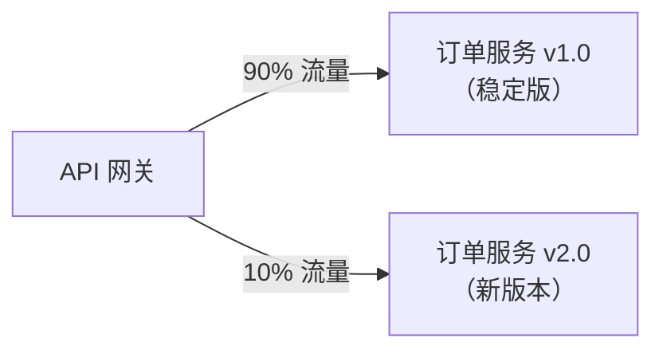

# 高级网关功能

## 本篇导读

### 核心目标

学完本篇后，你将能够：

- 理解限流的核心算法（令牌桶、滑动窗口）并用 Redis 实现生产可用的限流守卫
- 在业务请求层面实现熔断器，保护后端服务不因网关压力过大而崩溃
- 理解灰度发布（Canary Release）的多种策略，并在网关中实现基于请求头、用户 ID 或百分比的流量分割
- 理解多租户（Multi-tenancy）的概念，在网关层实现租户识别和基础隔离
- 综合运用前三篇所学，了解生产级网关的完整能力

### 重点与难点

**重点**：

- 令牌桶与滑动窗口算法的核心区别——令牌桶允许短期突发，滑动窗口严格控制速率
- 限流维度的选择——按 IP、用户 ID、API 端点，不同场景适用不同维度
- Redis Lua 脚本的原子性——为什么限流计数必须用 Lua 脚本而不是普通 Redis 命令

**难点**：

- 理解"Redis Lua 脚本原子执行"如何防止分布式环境下的竞争条件
- 灰度发布的"粘性"问题——同一个用户的请求必须始终路由到同一个版本，不能来回切换
- 多租户中数据隔离与共享的边界——哪些资源可以共享，哪些必须完全隔离

## 限流（Rate Limiting）

### 为什么网关必须做限流

没有限流的 API 接口，任何人都可以无限制地发送请求。攻击者可以利用这一点实施：

**DDoS 攻击（拒绝服务攻击）**：发送大量请求，耗尽服务器资源，导致正常用户无法访问。

**暴力破解**：对登录接口无限重试，尝试所有可能的密码组合。

**API 滥用**：爬虫程序高速抓取数据，对外分发或用于竞争分析。

限流通过控制每个来源在单位时间内的最大请求数，防止单个来源占用过多资源。

### 两种核心限流算法

#### 令牌桶算法（Token Bucket）

想象一个桶，按固定速率往桶里放令牌（Token）。每来一个请求，就从桶里拿一个令牌；桶空了，请求被拒绝。

```plaintext
令牌生成速率：10 个/秒
令牌桶容量：  50 个（最大突发）

│ 00秒 │ 令牌数：50（满桶）
│ 01秒 │ 来了 30 个请求 → 拿走 30 个令牌，剩 20 个
│ 02秒 │ 补充 10 个令牌，剩 30 个
│ 03秒 │ 来了 60 个请求 → 拿走 30 个（桶空），拒绝 30 个
│ 04秒 │ 补充 10 个令牌，剩 10 个
```

**特点**：允许短期突发（最多一次性消耗整个桶的令牌量），但长期平均速率不超过令牌生成速率。适合允许间歇性高峰的 API。

#### 滑动窗口算法（Sliding Window）

在当前时间点往前看固定时长的窗口，统计这段时间内的请求数。如果超过上限，拒绝请求。

```plaintext
窗口大小：60 秒
最大请求数：100 次

时间线：... [10:05:00 ─────────────────── 10:06:00]
当前时刻：10:05:45

统计 10:04:45 ~ 10:05:45 这 60 秒内的请求数：
  - 如果 ≤ 100，放行
  - 如果 > 100，拒绝
```

**特点**：严格控制任意 60 秒内的请求数，没有突发能力，更均匀。适合需要精确控制速率的场景（如短信发送、邮件发送）。

#### 在网关中选择哪种算法

| 场景                     | 推荐算法 | 原因                         |
| ------------------------ | -------- | ---------------------------- |
| 通用 API 接口保护        | 令牌桶   | 允许合理的突发，用户体验更好 |
| 短信/邮件等敏感操作      | 滑动窗口 | 严格控制，防止费用超支       |
| 登录接口暴力破解防护     | 滑动窗口 | 精确限制尝试次数             |
| 文件上传等资源密集型操作 | 令牌桶   | 允许合理的批量操作           |

### 限流维度

限流可以从不同维度来限制：

**按 IP 地址**：最简单，不需要用户认证就能生效。适合防御扫描、爬虫等未认证攻击。缺点：多人共享 IP（如企业 NAT）可能误伤正常用户，代理/VPN 可以绕过。

**按用户 ID**：更精确，已认证的用户才能使用。能准确定位特定用户的滥用行为。缺点：攻击者大量注册账号可以绕过。

**按 API 端点**：不同接口设置不同限额。例如登录接口每 IP 每分钟 10 次，数据查询接口每用户每分钟 1000 次。

**组合维度**：生产环境通常同时使用多个维度，例如：每 IP 每分钟 100 次（防扫描）+ 每用户每分钟 1000 次（防滥用）。

### Redis 实现：滑动窗口 Lua 脚本

使用 Redis 实现滑动窗口限流，核心在于使用 Lua 脚本保证原子性。

**为什么需要 Lua 脚本？**

限流通常需要两步操作：读取当前计数 → 判断是否超限 → 更新计数。在多网关实例的分布式环境中，如果这两步不是原子的，可能出现竞争条件：

```plaintext
实例A 读取计数：99（还差1次到上限）
实例B 读取计数：99（还差1次到上限）
实例A 判断：可以通过，写入 100
实例B 判断：可以通过，写入 100
→ 实际通过了 101 次，超过了 100 的限额
```

Redis Lua 脚本在服务端原子执行，整个脚本执行期间不会被其他命令插入：

```typescript
// rate-limit/rate-limit.service.ts
import { Injectable, Logger } from '@nestjs/common';
import { InjectRedis } from '../redis/redis.module';
import Redis from 'ioredis';

export interface RateLimitResult {
  allowed: boolean;
  current: number;
  limit: number;
  resetAt: number; // 窗口重置时间戳（毫秒）
}

/**
 * 基于滑动窗口的 Redis 限流服务
 *
 * 使用 Sorted Set 存储请求时间戳，窗口内的请求集合可精确统计
 */
@Injectable()
export class RateLimitService {
  private readonly logger = new Logger(RateLimitService.name);

  /**
   * 滑动窗口 Lua 脚本
   *
   * KEYS[1]: Redis Key（如 "ratelimit:user:42:/api/orders"）
   * ARGV[1]: 当前时间戳（毫秒）
   * ARGV[2]: 窗口大小（毫秒）
   * ARGV[3]: 窗口内最大请求数
   *
   * 返回: [是否通过(1/0), 当前窗口内请求数]
   */
  private readonly SLIDING_WINDOW_SCRIPT = `
    local key = KEYS[1]
    local now = tonumber(ARGV[1])
    local window = tonumber(ARGV[2])
    local limit = tonumber(ARGV[3])
    local windowStart = now - window

    -- 移除窗口外的旧记录
    redis.call('ZREMRANGEBYSCORE', key, 0, windowStart)

    -- 统计窗口内的请求数
    local count = redis.call('ZCARD', key)

    if count < limit then
      -- 添加当前请求（score 和 member 都使用时间戳，保证唯一）
      redis.call('ZADD', key, now, now .. '-' .. math.random(1000000))
      -- 设置过期时间（窗口大小 + 1秒缓冲）
      redis.call('PEXPIRE', key, window + 1000)
      return {1, count + 1}
    else
      return {0, count}
    end
  `;

  constructor(@InjectRedis() private readonly redis: Redis) {}

  /**
   * 检查限流
   *
   * @param key 限流 key（包含维度信息）
   * @param windowMs 滑动窗口大小（毫秒）
   * @param limit 窗口内最大请求数
   */
  async checkLimit(
    key: string,
    windowMs: number,
    limit: number
  ): Promise<RateLimitResult> {
    const now = Date.now();

    try {
      const result = (await this.redis.eval(
        this.SLIDING_WINDOW_SCRIPT,
        1, // keyCount
        key, // KEYS[1]
        String(now), // ARGV[1]
        String(windowMs), // ARGV[2]
        String(limit) // ARGV[3]
      )) as [number, number];

      const [allowed, current] = result;

      return {
        allowed: allowed === 1,
        current,
        limit,
        resetAt: now + windowMs, // 近似值，实际重置时间因滑动而持续更新
      };
    } catch (err) {
      // Redis 不可用时，降级放行（牺牲限流保可用性）
      this.logger.error('Rate limit Redis error, allowing request', err);
      return { allowed: true, current: 0, limit, resetAt: now + windowMs };
    }
  }
}
```

### 限流守卫

```typescript
// rate-limit/rate-limit.guard.ts
import {
  Injectable,
  CanActivate,
  ExecutionContext,
  HttpException,
  HttpStatus,
} from '@nestjs/common';
import { Reflector } from '@nestjs/core';
import { Request, Response } from 'express';
import { RateLimitService } from './rate-limit.service';
import { IS_PUBLIC_KEY } from '../auth/public.decorator';
import { GatewayTokenPayload } from '../auth/jwt-verify.service';

export const RATE_LIMIT_KEY = 'rateLimit';

export interface RateLimitOptions {
  /** 滑动窗口大小（毫秒） */
  windowMs: number;
  /** 窗口内最大请求数 */
  limit: number;
  /** 限流维度：ip | user | endpoint | combined */
  dimension?: 'ip' | 'user' | 'combined';
}

/** 路由级限流配置装饰器 */
export const RateLimit = (options: RateLimitOptions) =>
  SetMetadata(RATE_LIMIT_KEY, options);

@Injectable()
export class RateLimitGuard implements CanActivate {
  // 默认限流配置：每用户每分钟 600 次
  private readonly DEFAULT_OPTIONS: RateLimitOptions = {
    windowMs: 60 * 1000,
    limit: 600,
    dimension: 'combined',
  };

  constructor(
    private readonly reflector: Reflector,
    private readonly rateLimitService: RateLimitService
  ) {}

  async canActivate(context: ExecutionContext): Promise<boolean> {
    const isPublic = this.reflector.getAllAndOverride<boolean>(IS_PUBLIC_KEY, [
      context.getHandler(),
      context.getClass(),
    ]);

    if (isPublic) {
      return true;
    }

    // 获取路由级限流配置，没有则使用默认值
    const options =
      this.reflector.getAllAndOverride<RateLimitOptions>(RATE_LIMIT_KEY, [
        context.getHandler(),
        context.getClass(),
      ]) ?? this.DEFAULT_OPTIONS;

    const request = context.switchToHttp().getRequest<Request>();
    const response = context.switchToHttp().getResponse<Response>();

    const key = this.buildKey(request, options);
    const result = await this.rateLimitService.checkLimit(
      key,
      options.windowMs,
      options.limit
    );

    // 在响应头中返回限流信息（符合 IETF 草案标准）
    response.setHeader('RateLimit-Limit', options.limit);
    response.setHeader(
      'RateLimit-Remaining',
      Math.max(0, options.limit - result.current)
    );
    response.setHeader('RateLimit-Reset', Math.ceil(result.resetAt / 1000)); // Unix 时间戳（秒）

    if (!result.allowed) {
      throw new HttpException(
        {
          statusCode: 429,
          error: 'TooManyRequests',
          message: 'Rate limit exceeded. Please try again later.',
          retryAfter: Math.ceil(options.windowMs / 1000),
        },
        HttpStatus.TOO_MANY_REQUESTS
      );
    }

    return true;
  }

  private buildKey(request: Request, options: RateLimitOptions): string {
    const ip = request.ip ?? 'unknown';
    const user = request.user as GatewayTokenPayload | undefined;
    const userId = user?.sub ?? 'anonymous';
    const path = request.path;

    switch (options.dimension) {
      case 'ip':
        return `ratelimit:ip:${ip}`;
      case 'user':
        return `ratelimit:user:${userId}`;
      case 'combined':
      default:
        // 已认证用户按用户 ID 限流，未认证按 IP 限流
        const dimension = user ? `user:${userId}` : `ip:${ip}`;
        return `ratelimit:${dimension}:${path}`;
    }
  }
}
```

需要先定义 `SetMetadata` 引用（已经在 `@nestjs/common` 中）：

```typescript
import { SetMetadata } from '@nestjs/common';
```

### 不同接口的限流配置

```typescript
import { RateLimit } from '../rate-limit/rate-limit.guard';

@Controller('/auth')
export class AuthProxyController {
  // 登录接口：严格限制，防暴力破解
  // 每 IP 每 15 分钟最多 10 次尝试
  @RateLimit({ windowMs: 15 * 60 * 1000, limit: 10, dimension: 'ip' })
  @Post('/login')
  login() {}

  // 短信验证码：每用户每分钟 1 次
  @RateLimit({ windowMs: 60 * 1000, limit: 1, dimension: 'user' })
  @Post('/sms/send')
  sendSms() {}
}

@Controller('/api')
export class DataProxyController {
  // 数据查询：每用户每分钟 1000 次
  @RateLimit({ windowMs: 60 * 1000, limit: 1000, dimension: 'user' })
  @Get('/data')
  getData() {}

  // 文件导出：限制并发，每用户每小时 5 次
  @RateLimit({ windowMs: 60 * 60 * 1000, limit: 5, dimension: 'user' })
  @Post('/export')
  export() {}
}
```

## 业务层熔断器

### 与 JWKS 熔断器的区别

在上一篇，我们实现了 JWKS 公钥拉取的熔断器——当认证服务不可用时，保护网关不一直等待超时。

本篇讨论 **业务层面的熔断器**——当后端业务服务（订单服务、用户服务等）出现故障时，网关应该：

1. 快速返回错误，不让请求在网关队列中积压
2. 停止向故障服务发送请求，让故障服务有时间恢复
3. 定期试探服务是否恢复，一旦恢复立即恢复正常路由

### 代理服务中集成熔断器

```typescript
// proxy/proxy.service.ts
import { Injectable, Logger, BadGatewayException } from '@nestjs/common';
import { ConfigService } from '@nestjs/config';
import { Request, Response } from 'express';
import { CircuitBreaker, CircuitOpenError } from '../auth/circuit-breaker';

interface ServiceConfig {
  url: string;
  breaker: CircuitBreaker;
}

@Injectable()
export class ProxyService {
  private readonly logger = new Logger(ProxyService.name);

  // 每个后端服务都有独立的熔断器
  private readonly services: Record<string, ServiceConfig>;

  constructor(private readonly config: ConfigService) {
    this.services = {
      users: {
        url: config.getOrThrow('USER_SERVICE_URL'),
        breaker: new CircuitBreaker('user-service', {
          failureThreshold: 5,
          resetTimeout: 30_000,
          halfOpenRequests: 2,
        }),
      },
      orders: {
        url: config.getOrThrow('ORDER_SERVICE_URL'),
        breaker: new CircuitBreaker('order-service', {
          failureThreshold: 5,
          resetTimeout: 30_000,
          halfOpenRequests: 2,
        }),
      },
      products: {
        url: config.getOrThrow('PRODUCT_SERVICE_URL'),
        breaker: new CircuitBreaker('product-service', {
          failureThreshold: 5,
          resetTimeout: 30_000,
          halfOpenRequests: 2,
        }),
      },
    };
  }

  async forward(
    serviceName: string,
    req: Request,
    res: Response
  ): Promise<void> {
    const service = this.services[serviceName];

    if (!service) {
      throw new BadGatewayException(`Unknown service: ${serviceName}`);
    }

    try {
      await service.breaker.execute(async () => {
        await this.doForward(service.url, req, res);
      });
    } catch (err) {
      if (err instanceof CircuitOpenError) {
        this.logger.warn(`Circuit breaker OPEN for ${serviceName}`);
        throw new BadGatewayException(
          `Service "${serviceName}" is temporarily unavailable. Please try again later.`
        );
      }

      throw err;
    }
  }

  private async doForward(
    targetUrl: string,
    req: Request,
    res: Response
  ): Promise<void> {
    const url = `${targetUrl}${req.path}${req.url.includes('?') ? req.url.slice(req.url.indexOf('?')) : ''}`;

    const controller = new AbortController();
    const timeout = setTimeout(() => controller.abort(), 10_000); // 10 秒超时

    try {
      const response = await fetch(url, {
        method: req.method,
        headers: {
          ...Object.fromEntries(
            Object.entries(req.headers).filter(([key]) =>
              [
                'content-type',
                'x-user-id',
                'x-user-role',
                'x-user-email',
                'x-request-id',
                'x-internal-secret',
              ].includes(key)
            )
          ),
        },
        body: ['GET', 'HEAD', 'DELETE'].includes(req.method)
          ? undefined
          : JSON.stringify(req.body),
        signal: controller.signal,
      });

      // 将后端响应原样返回给客户端
      res.status(response.status);
      response.headers.forEach((value, key) => {
        // 跳过 hop-by-hop 头
        if (!['transfer-encoding', 'connection'].includes(key.toLowerCase())) {
          res.setHeader(key, value);
        }
      });

      const body = await response.text();
      res.send(body);
    } finally {
      clearTimeout(timeout);
    }
  }
}
```

## 灰度发布（Canary Release）

### 什么是灰度发布

灰度发布（也叫金丝雀发布，Canary Release）是一种降低新版本发布风险的策略：**不是一次性把所有流量切到新版本，而是先让一小部分流量走新版本，验证没有问题后再逐步扩大比例**。

名字来源于煤矿工人曾将金丝雀带入矿井——金丝雀对有毒气体更敏感，如果金丝雀死了，矿工就知道该撤退了。灰度发布中，"金丝雀"是那一小部分用新版本服务的流量，它们是最先"感受到"新版本问题的。



### 三种灰度策略

**策略 1：基于请求头**

开发者或测试人员在请求中手动添加特定 Header，显式选择走新版本：

```plaintext
X-Canary: true
```

适合：功能测试、线上验证，开发者主动测试新版本。

**策略 2：基于用户 ID（粘性灰度）**

根据用户 ID 的哈希值或用户的某个属性（如 Beta 用户标记），固定一批用户走新版本。同一个用户的请求始终路由到相同版本——这称为"粘性"。

适合：灰度特定用户群体（如内部员工、早期用户），保证一致的用户体验。

**策略 3：基于百分比（随机）**

随机取一定比例的请求走新版本。注意这种方式是无粘性的——同一个用户的不同请求可能路由到不同版本，可能导致体验不一致。

适合：压力测试、性能对比；或者新版本只是底层优化，用户感知不到版本差异。

### 在网关中实现灰度路由

```typescript
// proxy/canary.service.ts
import { Injectable } from '@nestjs/common';
import { ConfigService } from '@nestjs/config';
import { Request } from 'express';
import { createHash } from 'crypto';
import { GatewayTokenPayload } from '../auth/jwt-verify.service';

interface CanaryRule {
  /** 新版本服务地址 */
  newVersionUrl: string;
  /** 旧版本服务地址 */
  oldVersionUrl: string;
  /** 走新版本的百分比（0-100） */
  percentage: number;
  /** 是否开启粘性（相同用户始终路由到同一版本） */
  sticky: boolean;
}

@Injectable()
export class CanaryService {
  private readonly rules: Map<string, CanaryRule>;

  constructor(private readonly config: ConfigService) {
    // 实际生产中这些规则通常从配置中心或数据库读取，支持动态更新
    this.rules = new Map([
      [
        'orders',
        {
          oldVersionUrl: config.get('ORDER_SERVICE_V1_URL', ''),
          newVersionUrl: config.get('ORDER_SERVICE_V2_URL', ''),
          percentage: Number(config.get('ORDER_CANARY_PERCENTAGE', '0')),
          sticky: true,
        },
      ],
    ]);
  }

  /**
   * 根据灰度规则决定目标服务地址
   */
  resolveTarget(serviceName: string, req: Request): string | null {
    const rule = this.rules.get(serviceName);

    if (!rule || !rule.newVersionUrl || rule.percentage === 0) {
      return null; // 没有灰度规则，使用默认路由
    }

    // 策略 1：显式 Header 强制走新版本（开发/测试用）
    if (req.headers['x-canary'] === 'true') {
      return rule.newVersionUrl;
    }

    // 策略 2：粘性哈希（基于用户 ID）
    if (rule.sticky) {
      const user = req.user as GatewayTokenPayload | undefined;
      const seed = user?.sub ?? req.ip ?? 'anonymous';
      const hash = this.hashToPercentage(seed + serviceName);
      return hash < rule.percentage ? rule.newVersionUrl : rule.oldVersionUrl;
    }

    // 策略 3：随机百分比
    return Math.random() * 100 < rule.percentage
      ? rule.newVersionUrl
      : rule.oldVersionUrl;
  }

  /**
   * 将字符串哈希映射到 0-100 的范围，用于粘性分配
   *
   * 相同输入始终返回相同数值（确定性），不同输入分布均匀
   */
  private hashToPercentage(input: string): number {
    const hash = createHash('md5').update(input).digest('hex');
    // 取前 4 个字节（8个16进制字符），转为整数，映射到 0-100
    const num = parseInt(hash.slice(0, 8), 16);
    return (num / 0xffffffff) * 100;
  }
}
```

### 在代理控制器中使用灰度服务

```typescript
// proxy/proxy.controller.ts
import { All, Controller, Req, Res } from '@nestjs/common';
import { Request, Response } from 'express';
import { ProxyService } from './proxy.service';
import { CanaryService } from './canary.service';
import { ConfigService } from '@nestjs/config';

@Controller()
export class ProxyController {
  constructor(
    private readonly proxyService: ProxyService,
    private readonly canaryService: CanaryService,
    private readonly config: ConfigService
  ) {}

  @All('/api/orders*')
  async proxyOrders(@Req() req: Request, @Res() res: Response) {
    // 解析灰度目标
    const canaryTarget = this.canaryService.resolveTarget('orders', req);

    // 在响应头中标注流量走的版本（便于调试）
    if (canaryTarget) {
      const isNewVersion = canaryTarget.includes('v2');
      res.setHeader('X-Served-By', isNewVersion ? 'orders-v2' : 'orders-v1');
    }

    await this.proxyService.forwardToUrl(
      canaryTarget ?? this.config.get('ORDER_SERVICE_URL'),
      req,
      res
    );
  }
}
```

### 灰度发布的粘性保证

哈希方法保证了粘性——只要用户 ID 不变，`hashToPercentage(userId + "orders")` 的结果就不变，路由决策就不变。

但注意：**当 `percentage` 发生变化时，粘性会被打破**。比如灰度从 10% 扩大到 20%，原来在 10%-20% 区间的用户，之前走旧版本，现在改走新版本。这是不可避免的，灰度扩大时必然有一批用户"切换"了版本。

为了减少这种影响，推荐：

- 渐进扩大：5% → 10% → 20% → 50% → 100%，每次扩大后观察指标再决定是否继续
- 在切换窗口期做好监控，快速定位因短暂双版本并行导致的问题

## 多租户（Multi-tenancy）

### 什么是多租户

多租户是指一套系统同时为多个客户（租户）提供服务，每个租户在逻辑上互相隔离。典型场景：

- **SaaS 产品**：一套 CRM 系统，同时服务 A 公司、B 公司，A 公司只能看到自己的客户数据，B 公司只能看到自己的
- **企业内部平台**：集团总部和各子公司共用一套系统，但各子公司的数据相互隔离
- **开发者平台**：多个开发者团队共用同一套 API 网关，但各团队的限流配置、API Key 相互独立

### 租户识别方式

在网关层，有三种常见的租户识别方式：

**子域名识别**：

```plaintext
tenant-a.api.example.com  → 租户 A
tenant-b.api.example.com  → 租户 B
```

优点：无需请求修改，DNS 层面天然隔离。
缺点：每个租户需要配置独立的 TLS 证书（通配符证书可以缓解），域名数量多时管理复杂。

**请求头识别**：

```plaintext
X-Tenant-Id: tenant-a
```

优点：实现简单，不需要多域名。
缺点：依赖客户端正确传递，安全性稍低（需要验证租户 ID 是否与 Token 中的租户声明一致）。

**JWT Payload 中的租户字段**：

认证服务在颁发 Token 时将租户 ID 写入 Payload：

```plaintext
{
  "sub": "user-42",
  "tenantId": "tenant-a",
  ...
}
```

优点：安全可靠，租户 ID 经过签名验证，无法伪造。
缺点：用户只能属于一个租户（如果用户可以跨租户，需要颁发多个 Token 或使用其他机制）。

### 租户识别中间件

```typescript
// tenant/tenant.middleware.ts
import {
  Injectable,
  NestMiddleware,
  BadRequestException,
} from '@nestjs/common';
import { Request, Response, NextFunction } from 'express';
import { GatewayTokenPayload } from '../auth/jwt-verify.service';

// 扩展 Request 类型
declare module 'express' {
  interface Request {
    tenantId?: string;
  }
}

@Injectable()
export class TenantMiddleware implements NestMiddleware {
  use(req: Request, res: Response, next: NextFunction) {
    // 方式1：从子域名提取
    const hostname = req.hostname; // 如 "tenant-a.api.example.com"
    const subdomainMatch = hostname.match(/^([a-z0-9-]+)\.api\./);
    if (subdomainMatch) {
      req.tenantId = subdomainMatch[1];
      return next();
    }

    // 方式2：从 Header 提取（JWT 验证后的保底方案，在 Guard 之后的路由中使用）
    const headerTenantId = req.headers['x-tenant-id'] as string;
    if (headerTenantId) {
      req.tenantId = headerTenantId;
    }

    next();
  }
}
```

### 租户验证守卫

当租户 ID 来自多个来源时，需要验证它们的一致性：

```typescript
// tenant/tenant.guard.ts
import {
  Injectable,
  CanActivate,
  ExecutionContext,
  ForbiddenException,
} from '@nestjs/common';
import { Request } from 'express';
import { GatewayTokenPayload } from '../auth/jwt-verify.service';

@Injectable()
export class TenantGuard implements CanActivate {
  canActivate(context: ExecutionContext): boolean {
    const request = context.switchToHttp().getRequest<Request>();
    const user = request.user as GatewayTokenPayload | undefined;

    // 未认证请求跳过租户验证（由 JwtAuthGuard 处理）
    if (!user) {
      return true;
    }

    // Token Payload 中的 tenantId
    const tokenTenantId = (user as any).tenantId as string | undefined;

    // 如果系统没有多租户，跳过
    if (!tokenTenantId) {
      return true;
    }

    // 请求中解析到的租户 ID
    const requestTenantId = request.tenantId;

    if (requestTenantId && requestTenantId !== tokenTenantId) {
      // 请求的租户 ID 与 Token 中的不一致，拒绝请求
      throw new ForbiddenException(
        'Tenant ID mismatch: access denied for current tenant context'
      );
    }

    // 统一使用 Token 中的 tenantId 作为权威来源
    request.tenantId = tokenTenantId;

    return true;
  }
}
```

### 租户信息传递给业务服务

业务服务需要知道当前租户 ID，以便做租户隔离的数据查询：

```typescript
// proxy/proxy.controller.ts（添加租户信息注入）
@All('*')
async proxy(@Req() req: Request, @Res() res: Response) {
  const user = req.user as GatewayTokenPayload;

  // 注入用户信息
  req.headers['x-user-id'] = user?.sub ?? '';
  req.headers['x-user-role'] = user?.role ?? 'user';
  req.headers['x-user-email'] = user?.email ?? '';

  // 注入租户信息
  req.headers['x-tenant-id'] = req.tenantId ?? '';

  // 内网安全令牌
  req.headers['x-internal-secret'] = process.env.INTERNAL_SECRET ?? '';

  await this.proxyService.forward(this.resolveService(req.path), req, res);
}
```

### 多租户限流配置

在多租户场景下，限流 Key 必须包含租户 ID，防止不同租户的限流计数互相干扰：

```typescript
// rate-limit/rate-limit.guard.ts（添加租户维度）
private buildKey(request: Request, options: RateLimitOptions): string {
  const ip = request.ip ?? 'unknown';
  const user = request.user as GatewayTokenPayload | undefined;
  const userId = user?.sub ?? 'anonymous';
  const tenantId = request.tenantId ?? 'default';    // 租户维度
  const path = request.path;

  switch (options.dimension) {
    case 'ip':
      return `ratelimit:${tenantId}:ip:${ip}`;
    case 'user':
      return `ratelimit:${tenantId}:user:${userId}`;
    case 'combined':
    default:
      const dimension = user ? `user:${userId}` : `ip:${ip}`;
      return `ratelimit:${tenantId}:${dimension}:${path}`;
  }
}
```

不同租户可以有不同的限流配额（从配置中心读取）：

```typescript
async getLimit(tenantId: string, path: string): Promise<number> {
  // 从 Redis 读取租户级别的限流配置
  const customLimit = await this.redis.get(`tenantlimit:${tenantId}:${path}`);
  if (customLimit) return Number(customLimit);

  // 默认配额
  return 600;
}
```

## 网关健康检查与可观测性

### 健康检查端点

生产环境的网关需要暴露健康检查端点，让负载均衡器判断节点是否可用：

```typescript
// app.controller.ts
import { Controller, Get } from '@nestjs/common';
import { Public } from './auth/public.decorator';
import { JwksCacheService } from './auth/jwks-cache.service';

@Controller()
export class AppController {
  constructor(private readonly jwksCache: JwksCacheService) {}

  /**
   * 浅层健康检查：只检查进程是否存活
   * 适合：负载均衡器的存活探针（Kubernetes liveness probe）
   */
  @Public()
  @Get('/health')
  health() {
    return { status: 'ok', timestamp: new Date().toISOString() };
  }

  /**
   * 深层健康检查：检查关键依赖（Redis、JWKS）是否正常
   * 适合：就绪探针（Kubernetes readiness probe）
   */
  @Public()
  @Get('/health/ready')
  async ready() {
    const checks: Record<string, 'ok' | 'error'> = {};

    // 检查 JWKS 缓存是否有可用公钥
    // （生产中可以检查缓存中是否有至少一个有效公钥）
    checks.jwks = 'ok';

    const allOk = Object.values(checks).every((v) => v === 'ok');

    return {
      status: allOk ? 'ready' : 'not_ready',
      checks,
      timestamp: new Date().toISOString(),
    };
  }
}
```

### 网关指标监控

在生产环境，应该监控网关的关键指标，常用 Prometheus + Grafana 体系：

关键指标包括：

- **请求速率（QPS）**：按路由、按响应状态码分类
- **响应延迟（P50 / P95 / P99）**：重点关注 P99，发现长尾延迟
- **限流拒绝率**：被限流拒绝的请求占总请求的比例
- **熔断器状态**：各个后端服务的熔断状态分布
- **JWT 验证失败率**：401 错误的占比，识别异常客户端行为
- **JWKS 缓存命中率**：缓存是否高效

### 结构化日志

结构化日志（JSON 格式）比纯文本日志更易于被日志系统（ELK、Loki 等）解析和查询：

```typescript
// logger/logger.middleware.ts（结构化日志版本）
@Injectable()
export class LoggerMiddleware implements NestMiddleware {
  private readonly logger = new Logger('ACCESS');

  use(req: Request, res: Response, next: NextFunction) {
    const traceId = (req.headers['x-trace-id'] as string) ?? randomUUID();
    req.headers['x-trace-id'] = traceId;
    res.setHeader('x-trace-id', traceId);

    const startTime = Date.now();

    res.on('finish', () => {
      // 结构化日志，方便 ELK / Loki 解析
      this.logger.log(
        JSON.stringify({
          traceId,
          method: req.method,
          path: req.path,
          statusCode: res.statusCode,
          duration: Date.now() - startTime,
          ip: req.ip,
          userAgent: req.get('user-agent'),
          userId: req.user?.sub,
          tenantId: req.tenantId,
        })
      );
    });

    next();
  }
}
```

## 常见问题与解决方案

### 问题一：限流导致正常用户被误封

**现象**：办公室所有员工共用一个 NAT IP，按 IP 限流时，整个办公室被封。

**解决方案**：

- 已认证用户优先按用户 ID 限流，未认证请求才按 IP 限流
- 为企业用户提供更高的限流配额（多租户场景）
- 提高 IP 维度的限流阈值，主要靠用户维度限流精细控制

### 问题二：灰度发布中新版本出现严重 Bug

**应急处理**：

立即将 `ORDER_CANARY_PERCENTAGE` 配置改为 `0`，网关的灰度服务检测到配置变为 0 后，不再路由任何流量到新版本。由于使用的是环境变量配置，修改需要重启网关（或通过配置中心动态更新）。

推荐方案：将灰度百分比存储在 Redis 中，网关定期读取，支持实时修改无需重启：

```typescript
async getCanaryPercentage(service: string): Promise<number> {
  const pct = await this.redis.get(`canary:percentage:${service}`);
  return pct ? Number(pct) : 0;
}
```

### 问题三：多租户数据泄露风险

**风险**：业务服务如果不做租户过滤，可能返回其他租户的数据。

**防御策略**：

- 网关层面：确保每个请求都携带正确的 `X-Tenant-Id` 请求头
- 业务服务层面：所有数据库查询必须加上 `tenantId` 过滤条件（行级租户隔离）
- 审计层面：记录每次跨租户访问尝试，触发告警

```typescript
// 业务服务的数据访问层示例（行级租户隔离）
async findOrders(tenantId: string, userId: string) {
  return this.db.query.orders.findMany({
    where: and(
      eq(orders.tenantId, tenantId),   // 必须加租户过滤！
      eq(orders.userId, userId),
    ),
  });
}
```

### 问题四：熔断器半开状态下探测请求失败怎么办

**问题**：Half-Open 状态下的探测请求虽然成功，但因为负载不够，系统看似恢复实则不稳定。

**解决方案**：

- 增加 `halfOpenRequests` 配置值，需要多次成功才关闭熔断
- Half-Open 状态下的成功阈值可以结合响应时间判断（响应时间恢复正常才算成功）
- 加入指数退避（Exponential Backoff）：第一次 Open 后等 30 秒，再次 Open 等 60 秒，以此类推

```typescript
// 带指数退避的熔断器（改进版）
private onFailure() {
  this.failureCount++;
  this.attemptCount++; // 记录尝试次数，用于退避计算

  if (this.shouldOpen()) {
    this.state = CircuitState.Open;
    // 指数退避：30s, 60s, 120s, ... 最大 5 分钟
    const backoff = Math.min(
      this.options.resetTimeout * Math.pow(2, this.attemptCount - 1),
      5 * 60 * 1000
    );
    this.nextAttemptAt = Date.now() + backoff;
  }
}
```

### 问题五：网关如何处理 SSE（Server-Sent Events）和流式响应

**问题**：有些 API 使用 SSE 推送实时数据，或返回大文件的流式下载。普通的请求-响应模型不适合这类场景。

**解决方案**：

对于流式响应，网关需要使用管道（pipe）而不是缓冲响应体：

```typescript
private async doForwardStream(targetUrl: string, req: Request, res: Response): Promise<void> {
  const response = await fetch(targetUrl, {
    method: req.method,
    headers: req.headers as Record<string, string>,
  });

  res.status(response.status);
  response.headers.forEach((value, key) => {
    res.setHeader(key, value);
  });

  // 使用 Web Streams API 将响应体直接管道到客户端
  const reader = response.body!.getReader();

  const pump = async () => {
    const { done, value } = await reader.read();
    if (done) {
      res.end();
      return;
    }
    res.write(value);
    await pump();
  };

  await pump();
}
```

## 本篇小结

本篇完成了 API 网关高级功能的实现，形成了生产可用的网关能力矩阵：

**核心要点**：

- 滑动窗口算法用 sorted set 存储请求时间戳，通过 Lua 脚本原子操作保证分布式一致性
- 限流 Key 应包含维度前缀（IP、用户 ID）和租户 ID，防止计数跨维度、跨租户干扰
- 业务层熔断器为每个后端服务独立配置，服务 A 的故障不影响服务 B 的请求处理
- 灰度发布的粘性通过对用户 ID + 服务名取哈希实现，相同用户始终路由到相同版本
- 多租户在网关层完成租户识别和验证，通过请求头传递给业务服务，业务服务负责行级数据隔离
- 健康检查端点、结构化日志和指标监控是网关生产化的必要组成部分

**模块六总结**：

至此，我们完整地构建了一个生产级 API 网关。它具备：

- JWT 验证（含 JWKS 公钥缓存、并发锁、熔断降级）
- 基于角色（RBAC）和 Scope 的双重权限检查
- 基于滑动窗口的 Redis 分布式限流
- 业务服务级别的熔断保护
- 粘性灰度发布支持
- 多租户识别与隔离
- 完整的日志、追踪和健康检查

这个网关可以作为后续模块中所有业务服务的统一入口，为客户端接入（模块七）和生产部署（模块八）奠定坚实基础。
