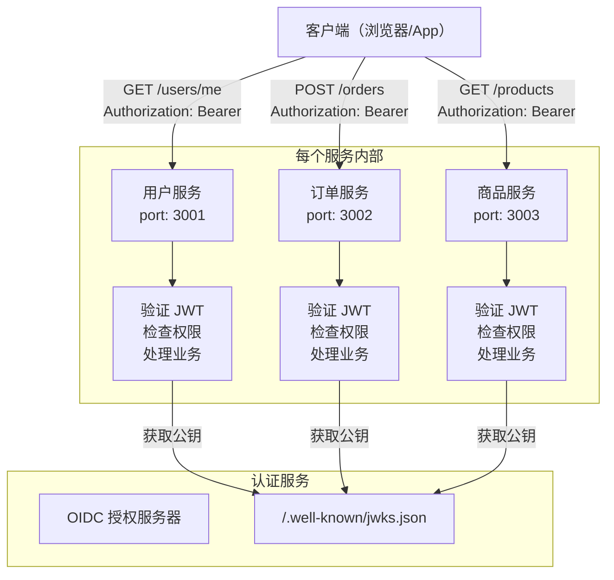
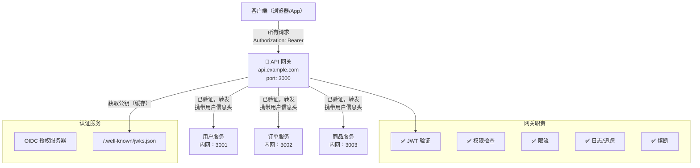
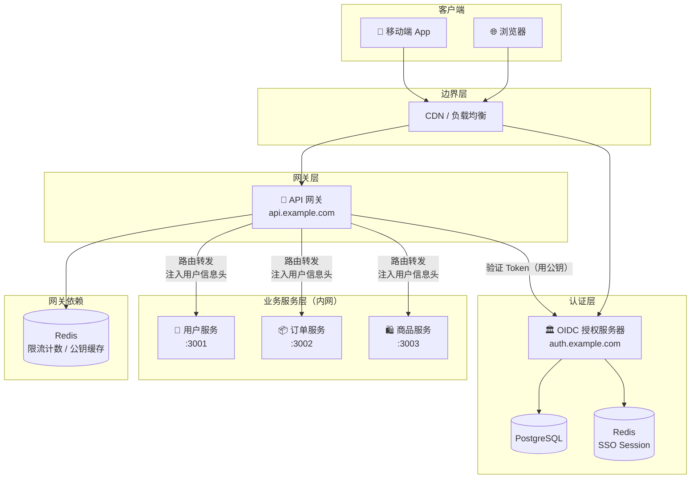
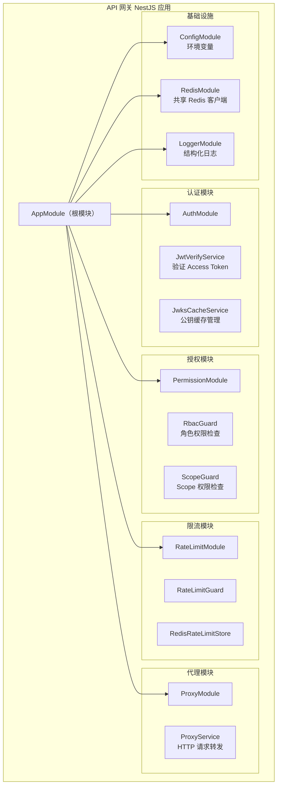
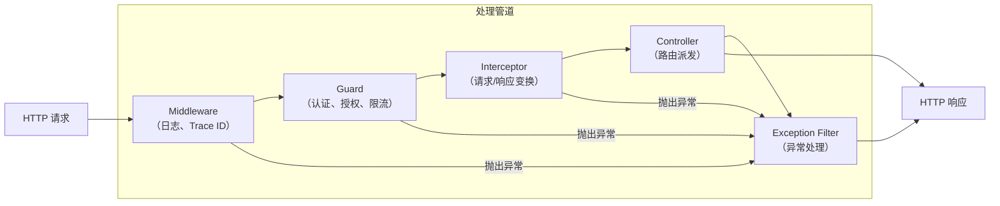
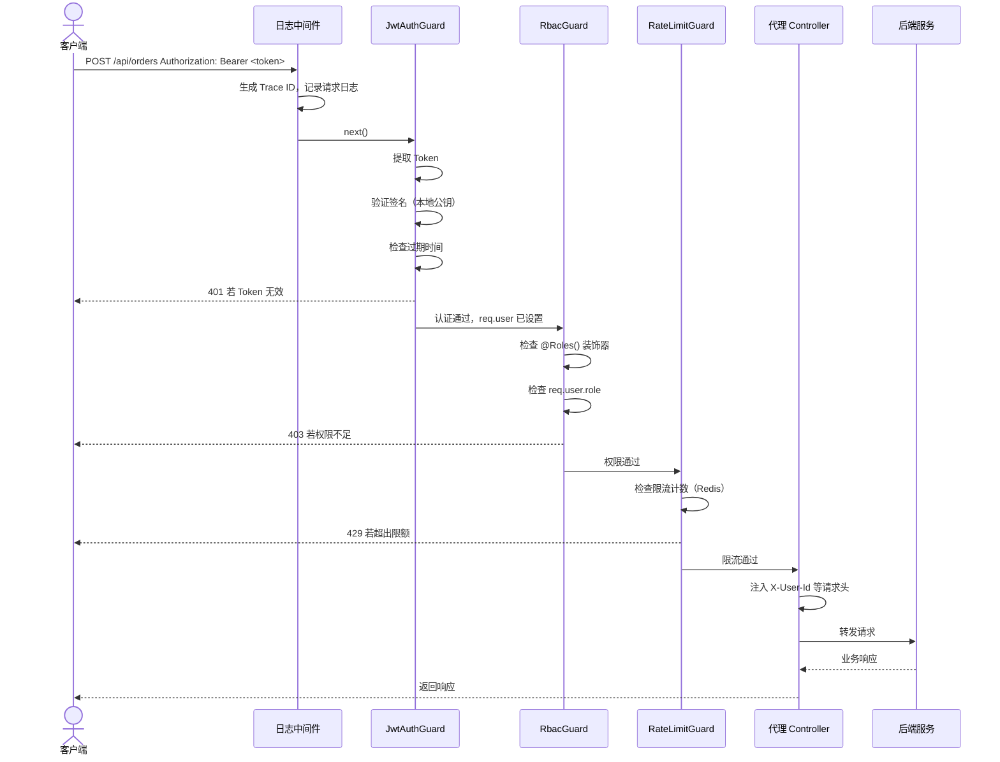

# API 网关设计

## 本篇导读

### 核心目标

学完本篇后，你将能够：

- 理解 API 网关在微服务架构中的角色，明确它解决了哪些具体问题
- 设计一个职责清晰的网关架构，知道哪些逻辑应该放在网关，哪些不应该
- 规划 NestJS 网关项目的模块结构，为后续章节的实现打好基础
- 理解请求在网关中的处理管道：从入口到转发的每一步发生了什么

### 重点与难点

**重点**：

- 网关与认证服务的关系——网关不负责颁发 Token，只负责验证 Token
- 网关的职责边界——哪些横切关注点应该在网关统一处理
- NestJS 请求处理管道——Middleware、Guard、Interceptor 各自的定位

**难点**：

- 理解网关与直接在每个业务服务里做认证的本质区别
- 网关的无状态设计——网关本身不存储会话，一切决策基于 Token 中的声明
- 错误处理策略——网关拒绝请求时如何返回规范的错误格式

## 从需求出发：没有网关会怎样

### 原始状态：每个服务自己做认证

在没有 API 网关的架构中，每个业务服务都需要自己验证客户端请求携带的 Access Token。假设我们有三个业务服务：用户服务、订单服务和商品服务：



这个架构在服务数量少的时候还能接受，但随着服务增多，问题会逐渐显现：

**重复代码泛滥**。JWT 验证逻辑、公钥缓存逻辑、RBAC 权限检查代码会在每个服务里重复一遍。三个服务还好，十个服务呢？每次认证逻辑发生变化（比如切换签名算法、增加新的权限检查），你需要在十个代码仓库里同步修改。

**安全策略难以统一**。某个服务的开发者忘记加 `@UseGuards(JwtAuthGuard)` 装饰器，或者配置了错误的 RBAC 规则，这个漏洞可能在很长时间内不被发现。网络上任何能访问到该服务端口的请求都可以绕过认证。

**横切关注点分散**。限流、日志、熔断、请求追踪（Trace ID）这些与业务无关的关注点如果分散在各服务里，维护成本极高，而且行为不一致。

**服务暴露风险**。如果每个业务服务都直接对外暴露端口，攻击面就很大。而且，随着服务数量增加，客户端需要记住越来越多的地址和端口。

### 引入 API 网关后的变化

API 网关（API Gateway）是一个独立的服务，作为所有外部请求的统一入口：



网关承担了所有横切关注点后，业务服务可以：

- **专注于业务逻辑**，不需要处理认证授权
- **在私有网络中运行**，不直接对外暴露
- **信任网关传递的用户信息**，比如通过请求头 `X-User-Id: 123` 获取当前用户 ID

## 网关的职责边界

### 网关应该做什么

一个好的 API 网关只负责 **横切关注点（Cross-Cutting Concerns）**——这些逻辑与具体业务无关，但又几乎每个请求都需要：

**1. 认证（Authentication）**

验证请求携带的 Access Token 签名是否合法、是否过期、是否被吊销。这是网关最核心的职责。

**2. 授权（Authorization）**

基于 Token 中的 Scope 和用户角色（Role）判断该请求是否有权限访问目标资源。例如，只有 `admin` 角色才能访问管理接口，只有持有 `orders:write` Scope 的 Token 才能创建订单。

**3. 限流（Rate Limiting）**

防止某个客户端或 IP 发送过多请求，保护后端服务不被压垮。可以按用户 ID、IP 地址、API 端点设置不同的限流规则。

**4. 请求路由（Routing）**

根据请求路径将请求转发到对应的后端服务。这是网关最基础的功能——本质上就是一个反向代理。

**5. 请求/响应变换（Transformation）**

在将请求转发给后端之前，可以修改请求头（如注入用户信息）。在将响应返回给客户端之前，可以统一格式、过滤敏感字段。

**6. 日志与追踪（Logging & Tracing）**

为每个请求生成唯一的 Trace ID，记录请求的入口、出口、耗时、状态码等信息，支持分布式追踪。

**7. 熔断与降级（Circuit Breaker）**

当某个后端服务出现故障时，停止向该服务发送请求（熔断），并返回降级响应，防止故障扩散。

### 网关不应该做什么

同样重要的是明确网关的边界——有些事情不应该放在网关里：

**1. 业务逻辑**

"下单前检查库存是否充足"、"积分兑换规则"这类逻辑是具体业务的责任，应该在对应的业务服务里实现。如果放在网关，会导致网关越来越臃肿，与具体业务服务强耦合。

**2. 数据库操作**

网关不应该直接操作业务数据库。网关唯一可能访问的存储是：认证服务的公钥缓存（内存或 Redis）、限流计数器（Redis）。

**3. Token 颁发**

颁发 Token 是认证服务（OIDC 授权服务器）的职责，网关只負責验证 Token。如果网关既验证又颁发，它就变成了认证服务，职责越界。

**4. 用户管理**

用户注册、修改密码、绑定手机号这类功能属于认证服务或用户服务，不应该在网关暴露这些接口。

### 职责边界总结

| 职责                | 放在网关？ | 说明                                 |
| ------------------- | ---------- | ------------------------------------ |
| JWT 签名验证        | ✅ 是      | 网关唯一需要认证服务公钥             |
| Scope/Role 权限检查 | ✅ 是      | 基于 Token 声明，无需查业务数据库    |
| 请求限流            | ✅ 是      | 保护下游服务                         |
| 请求路由转发        | ✅ 是      | 网关的基础功能                       |
| 分布式追踪          | ✅ 是      | 所有请求统一打 Trace ID              |
| 熔断降级            | ✅ 是      | 保护系统整体稳定性                   |
| 业务数据校验        | ❌ 否      | 业务服务自己负责                     |
| 用户信息查询        | ❌ 否      | 业务服务根据注入的用户 ID 自行查询   |
| Token 颁发/刷新     | ❌ 否      | 认证服务的职责                       |
| 复杂权限计算        | ❌ 否      | 业务级权限（如"能否编辑他人的评论"） |

## 系统整体架构

### 完整架构图

经过前面几个模块的积累，现在加入 API 网关后，整体系统架构如下：



### 关键设计决策

**为什么网关验证 Token 不需要每次联系认证服务？**

我们使用的是 RS256 非对称加密算法。认证服务用 **私钥** 签名 Token，任何持有对应 **公钥** 的服务都可以验证签名是否合法——不需要回调认证服务。

网关在启动时会从认证服务的 `/.well-known/jwks.json` 端点获取公钥，缓存在内存或 Redis 中。后续的每次 Token 验证都使用本地缓存的公钥，完全不需要网络请求。这使得 Token 验证的延迟极低（通常是亚毫秒级）。

**网关如何将用户信息传递给业务服务？**

网关验证 Token 后，将 Token 中的关键信息（用户 ID、角色、邮箱等）通过 HTTP 请求头传递给后端服务：

```plaintext
X-User-Id: 42
X-User-Role: admin
X-User-Email: user@example.com
X-Request-Id: a3f7c2d1-...
```

业务服务直接读取这些请求头，无需再验证 Token。但这里有个重要的安全要求：**业务服务必须只信任来自网关的请求**，如果外部直接访问业务服务端口并伪造这些请求头，会绕过认证。解决方案：

- 业务服务只监听内网地址，不对外暴露
- 网关和业务服务之间使用固定的内网访问密钥（`X-Internal-Secret: <secret>`）
- 业务服务验证该 Header，拒绝不携带此 Header 的请求

## 功能模块设计

### 模块划分

网关项目的功能模块划分如下：



### 各模块职责说明

**AuthModule**：JWT 验证相关逻辑。包含从认证服务获取 JWKS 公钥、缓存公钥、验证 Token 签名和有效期、提取 Payload。这是网关的核心模块，后续章节会详细实现。

**PermissionModule**：权限检查相关逻辑。包含 RBAC 角色权限守卫和 OAuth2 Scope 权限守卫。根据 Token Payload 中的角色和 Scope 决定是否允许请求通过。

**RateLimitModule**：限流相关逻辑。基于 Redis 实现令牌桶或滑动窗口算法，支持按用户 ID、IP 地址、API 端点配置不同的限流规则。

**ProxyModule**：请求转发逻辑。根据请求路径匹配路由规则，将请求转发到对应的后端服务，注入用户信息请求头，并将后端响应原样返回给客户端。

**RedisModule**：提供共享的 Redis 客户端实例。限流计数和公钥缓存都可以使用同一个 Redis 实例。

## NestJS 项目结构

### 目录组织

```plaintext
gateway/
├── src/
│   ├── main.ts                        # 应用入口
│   ├── app.module.ts                  # 根模块
│   ├── app.controller.ts              # 健康检查端点
│   │
│   ├── auth/                          # 认证模块
│   │   ├── auth.module.ts
│   │   ├── jwt-verify.service.ts      # JWT 验证核心逻辑
│   │   ├── jwks-cache.service.ts      # JWKS 公钥缓存
│   │   ├── jwt-auth.guard.ts          # JWT 认证守卫
│   │   ├── current-user.decorator.ts  # @CurrentUser() 装饰器
│   │   └── public.decorator.ts        # @Public() 装饰器
│   │
│   ├── permission/                    # 授权模块
│   │   ├── permission.module.ts
│   │   ├── rbac.guard.ts              # RBAC 角色权限守卫
│   │   ├── scope.guard.ts             # OAuth2 Scope 守卫
│   │   ├── roles.decorator.ts         # @Roles() 装饰器
│   │   └── scopes.decorator.ts        # @RequireScopes() 装饰器
│   │
│   ├── rate-limit/                    # 限流模块
│   │   ├── rate-limit.module.ts
│   │   ├── rate-limit.guard.ts        # 限流守卫
│   │   └── rate-limit.service.ts      # 限流逻辑（Redis）
│   │
│   ├── proxy/                         # 请求转发模块
│   │   ├── proxy.module.ts
│   │   ├── proxy.service.ts           # HTTP 转发逻辑
│   │   └── proxy.controller.ts        # 通配路由，接收所有请求
│   │
│   ├── redis/                         # Redis 共享模块
│   │   ├── redis.module.ts
│   │   └── redis.service.ts
│   │
│   ├── logger/                        # 日志模块
│   │   ├── logger.module.ts
│   │   └── logger.middleware.ts       # 请求日志中间件
│   │
│   └── common/                        # 公共工具
│       ├── filters/
│       │   └── gateway-exception.filter.ts  # 全局异常过滤器
│       └── interceptors/
│           └── trace-id.interceptor.ts      # Trace ID 注入
│
├── .env
├── .env.example
└── package.json
```

### 项目初始化

创建 NestJS 网关项目：

```plaintext
nest new gateway
cd gateway
pnpm add @nestjs/config ioredis jose axios
pnpm add -D @types/node
```

依赖说明：

- `@nestjs/config`：环境变量配置模块
- `ioredis`：Redis 客户端
- `jose`：JOSE（JSON Object Signing and Encryption）库，用于 JWT 验证
- `axios`：用于向后端服务转发请求（也可以使用 `@nestjs/axios`）

## 请求处理管道

### NestJS 的分层处理

在 NestJS 中，一个 HTTP 请求会依次经过以下处理层：



**Middleware（中间件）**：最先执行，可以访问 `req` 和 `res` 对象，执行完毕后必须调用 `next()` 传递控制权。适合做请求日志记录和 Trace ID 注入，因为这两件事需要在所有处理逻辑之前完成。

**Guard（守卫）**：在路由 Handler 之前执行，返回 `true` 则放行，返回 `false` 或抛出异常则拒绝请求。适合做认证（`JwtAuthGuard`）、授权（`RbacGuard`）、限流（`RateLimitGuard`）。

**Interceptor（拦截器）**：在 Guard 通过后、Controller 处理前后都可以执行，可以修改请求数据和响应数据。适合做统一的响应格式包装、请求耗时统计。

**Exception Filter（异常过滤器）**：捕获整个管道中抛出的任何异常，统一格式化错误响应。适合将 NestJS 内置的 `HttpException` 以及自定义异常转换为规范的 JSON 错误格式。

### 在网关中的具体应用



### Guard 的执行顺序

当一个路由上有多个 Guard 时（如认证 Guard + 授权 Guard + 限流 Guard），它们按注册顺序依次执行。**如果任意一个 Guard 返回 `false` 或抛出异常，后续的 Guard 不再执行**。

网关中 Guard 的推荐执行顺序：

1. **JwtAuthGuard**（认证）：最先执行，因为后续 Guard 都依赖 `req.user`
2. **RbacGuard**（角色权限）：需要 `req.user.role`，依赖认证通过
3. **ScopeGuard**（Scope 权限）：需要 `req.user.scope`，依赖认证通过
4. **RateLimitGuard**（限流）：认证之后限流，可以按用户维度限流

在全局注册这些 Guard：

```typescript
// main.ts
import { NestFactory, Reflector } from '@nestjs/core';
import { AppModule } from './app.module';
import { JwtAuthGuard } from './auth/jwt-auth.guard';
import { RbacGuard } from './permission/rbac.guard';
import { ScopeGuard } from './permission/scope.guard';
import { RateLimitGuard } from './rate-limit/rate-limit.guard';
import { GatewayExceptionFilter } from './common/filters/gateway-exception.filter';

async function bootstrap() {
  const app = await NestFactory.create(AppModule);
  const reflector = app.get(Reflector);

  // 全局异常过滤器（最先注册，捕获所有异常）
  app.useGlobalFilters(new GatewayExceptionFilter());

  // 全局 Guard（按执行顺序注册）
  app.useGlobalGuards(
    new JwtAuthGuard(reflector),
    new RbacGuard(reflector),
    new ScopeGuard(reflector),
    new RateLimitGuard(reflector)
  );

  await app.listen(3000);
}

bootstrap();
```

## 环境配置

### 环境变量设计

网关需要以下环境变量：

```plaintext
# 认证服务配置
AUTH_SERVER_URL=https://auth.example.com
# JWKS 端点（通常是 auth 服务的标准端点）
JWKS_URI=https://auth.example.com/.well-known/jwks.json

# JWT 验证配置
JWT_ISSUER=https://auth.example.com
JWT_AUDIENCE=https://api.example.com

# Redis 配置（用于限流和公钥缓存）
REDIS_HOST=localhost
REDIS_PORT=6379
REDIS_PASSWORD=

# 内网安全密钥（网关与业务服务间的信任令牌）
INTERNAL_SECRET=your-internal-secret-here

# 后端服务地址配置
USER_SERVICE_URL=http://user-service:3001
ORDER_SERVICE_URL=http://order-service:3002
PRODUCT_SERVICE_URL=http://product-service:3003

# 网关端口
PORT=3000
```

### ConfigModule 配置

```typescript
// app.module.ts
import { Module } from '@nestjs/common';
import { ConfigModule } from '@nestjs/config';
import { AuthModule } from './auth/auth.module';
import { PermissionModule } from './permission/permission.module';
import { RateLimitModule } from './rate-limit/rate-limit.module';
import { ProxyModule } from './proxy/proxy.module';
import { RedisModule } from './redis/redis.module';
import { LoggerModule } from './logger/logger.module';

@Module({
  imports: [
    ConfigModule.forRoot({
      isGlobal: true, // 全局可用，无需重复导入
      envFilePath: '.env',
    }),
    RedisModule, // 先初始化 Redis（其他模块可能依赖）
    LoggerModule,
    AuthModule,
    PermissionModule,
    RateLimitModule,
    ProxyModule,
  ],
})
export class AppModule {}
```

## 错误处理策略

### 网关错误 vs 业务错误

网关会产生两类错误：

**网关自身的错误**：Token 无效（401）、权限不足（403）、限流超出（429）、代理连接失败（502）。这类错误由网关直接返回，不涉及业务服务。

**业务服务的错误**：订单不存在（404）、库存不足（400）等。这类错误由业务服务返回，网关将其原样透传给客户端。

### 统一错误响应格式

网关统一使用以下 JSON 格式返回错误：

```typescript
// common/filters/gateway-exception.filter.ts
import {
  ExceptionFilter,
  Catch,
  ArgumentsHost,
  HttpException,
  HttpStatus,
  Logger,
} from '@nestjs/common';
import { Request, Response } from 'express';

interface ErrorResponse {
  statusCode: number;
  error: string;
  message: string;
  path: string;
  timestamp: string;
  traceId?: string;
}

@Catch()
export class GatewayExceptionFilter implements ExceptionFilter {
  private readonly logger = new Logger(GatewayExceptionFilter.name);

  catch(exception: unknown, host: ArgumentsHost) {
    const ctx = host.switchToHttp();
    const request = ctx.getRequest<Request>();
    const response = ctx.getResponse<Response>();

    let status = HttpStatus.INTERNAL_SERVER_ERROR;
    let message = 'Internal server error';
    let error = 'InternalServerError';

    if (exception instanceof HttpException) {
      status = exception.getStatus();
      const exceptionResponse = exception.getResponse();
      if (typeof exceptionResponse === 'string') {
        message = exceptionResponse;
      } else if (typeof exceptionResponse === 'object') {
        const res = exceptionResponse as Record<string, unknown>;
        message = (res.message as string) ?? message;
        error = (res.error as string) ?? error;
      }
      error = this.statusToError(status);
    } else if (exception instanceof Error) {
      message = exception.message;
      this.logger.error('Unhandled exception', exception.stack);
    }

    const body: ErrorResponse = {
      statusCode: status,
      error,
      message,
      path: request.url,
      timestamp: new Date().toISOString(),
      traceId: request.headers['x-trace-id'] as string,
    };

    response.status(status).json(body);
  }

  private statusToError(status: number): string {
    const map: Record<number, string> = {
      400: 'BadRequest',
      401: 'Unauthorized',
      403: 'Forbidden',
      404: 'NotFound',
      429: 'TooManyRequests',
      500: 'InternalServerError',
      502: 'BadGateway',
      503: 'ServiceUnavailable',
    };
    return map[status] ?? 'Error';
  }
}
```

错误响应示例：

```plaintext
HTTP/1.1 401 Unauthorized
Content-Type: application/json

{
  "statusCode": 401,
  "error": "Unauthorized",
  "message": "Access token is expired",
  "path": "/api/users/me",
  "timestamp": "2026-03-29T10:30:00.000Z",
  "traceId": "a3f7c2d1-b892-4f01-9e34-0f7a82c3d5e1"
}
```

### 日志中间件

请求日志中间件在每个请求开始时注入 Trace ID，并在请求结束时记录访问日志：

```typescript
// logger/logger.middleware.ts
import { Injectable, NestMiddleware, Logger } from '@nestjs/common';
import { Request, Response, NextFunction } from 'express';
import { randomUUID } from 'crypto';

@Injectable()
export class LoggerMiddleware implements NestMiddleware {
  private readonly logger = new Logger('HTTP');

  use(req: Request, res: Response, next: NextFunction) {
    // 注入 Trace ID（优先使用上游传入的，否则生成新的）
    const traceId = (req.headers['x-trace-id'] as string) ?? randomUUID();
    req.headers['x-trace-id'] = traceId;
    res.setHeader('x-trace-id', traceId);

    const { method, url, ip } = req;
    const userAgent = req.get('user-agent') ?? '';
    const startTime = Date.now();

    res.on('finish', () => {
      const duration = Date.now() - startTime;
      const { statusCode } = res;

      this.logger.log(
        `${method} ${url} ${statusCode} ${duration}ms - ${ip} "${userAgent}" trace=${traceId}`
      );
    });

    next();
  }
}
```

日志中间件在 `AppModule` 中全局注册：

```typescript
// app.module.ts
import { MiddlewareConsumer, Module, NestModule } from '@nestjs/common';
import { LoggerMiddleware } from './logger/logger.middleware';

@Module({
  /* ... */
})
export class AppModule implements NestModule {
  configure(consumer: MiddlewareConsumer) {
    consumer.apply(LoggerMiddleware).forRoutes('*');
  }
}
```

## 公开路由的处理

### 为什么需要公开路由

并非所有路由都需要认证。健康检查接口 (`GET /health`) 需要让负载均衡器无需认证就能访问。如果使用全局 Guard，需要有办法为特定路由跳过认证。

### @Public() 装饰器

通过 NestJS 的 `Reflector` 机制，可以为路由打上 "public" 标记，让 Guard 识别并跳过认证：

```typescript
// auth/public.decorator.ts
import { SetMetadata } from '@nestjs/common';

export const IS_PUBLIC_KEY = 'isPublic';

/**
 * 标记一个路由为公开路由，跳过 JWT 认证
 *
 * @example
 * @Public()
 * @Get('/health')
 * health() {
 *   return { status: 'ok' };
 * }
 */
export const Public = () => SetMetadata(IS_PUBLIC_KEY, true);
```

在 Guard 中检查这个标记：

```typescript
// auth/jwt-auth.guard.ts（简化版，完整实现见下一章）
import { Injectable, CanActivate, ExecutionContext } from '@nestjs/common';
import { Reflector } from '@nestjs/core';
import { IS_PUBLIC_KEY } from './public.decorator';

@Injectable()
export class JwtAuthGuard implements CanActivate {
  constructor(private readonly reflector: Reflector) {}

  async canActivate(context: ExecutionContext): Promise<boolean> {
    // 检查是否标记为公开路由
    const isPublic = this.reflector.getAllAndOverride<boolean>(IS_PUBLIC_KEY, [
      context.getHandler(),
      context.getClass(),
    ]);

    if (isPublic) {
      return true; // 跳过认证
    }

    // 执行 JWT 验证逻辑（详见下一章）
    return this.validateToken(context);
  }

  private async validateToken(context: ExecutionContext): Promise<boolean> {
    // 具体实现见"JWT 验证中间件"章节
    return true;
  }
}
```

### 健康检查端点

```typescript
// app.controller.ts
import { Controller, Get } from '@nestjs/common';
import { Public } from './auth/public.decorator';

@Controller()
export class AppController {
  @Public()
  @Get('health')
  health() {
    return {
      status: 'ok',
      timestamp: new Date().toISOString(),
    };
  }
}
```

## 常见问题与解决方案

### 问题一：网关成为单点故障

**问题**：所有请求都经过网关，如果网关宕机，整个系统就不可用。

**解决方案**：

- **水平扩展**：部署多个网关实例，在前面放负载均衡器（Nginx、AWS ALB 等）
- **无状态设计**：网关本身不存储会话状态，任何实例都可以处理任何请求
- **限流计数存 Redis**：多个网关实例共享同一个 Redis，限流计数保持一致
- **公钥缓存存 Redis**：避免每个实例各自缓存，减少对认证服务的重复请求

### 问题二：网关延迟增加

**问题**：每个请求都多经过一层网关，会增加响应时间。

**分析**：网关主要做的是 JWT 签名验证（纯本地计算，约 0.5-2ms）、Redis 读取（约 1-3ms，如果需要的话）、HTTP 转发（网络本身的延迟）。正常情况下，网关引入的额外延迟在 5ms 以内。

**优化策略**：

- JWKS 公钥本地内存缓存，零网络开销
- 限流计数使用 Redis Pipeline 或 Lua 脚本减少网络往返次数
- 服务间通信使用内网直连，避免经过外网绕行

### 问题三：如何处理 WebSocket

**问题**：WebSocket 连接是长连接，Token 可能在连接期间过期。

**解决方案**：

- 在握手阶段（HTTP Upgrade 请求）验证 Token，通过后才升级到 WebSocket
- WebSocket 连接建立后，客户端定期发送心跳，携带更新后的 Token
- 网关维护 WebSocket 连接池，检测到 Token 过期后发送 `4001` 关闭帧

### 问题四：内网服务被直接访问

**问题**：业务服务在内网部署，但攻击者可能通过某种途径直接访问内网服务端口，并伪造 `X-User-Id` 请求头。

**解决方案**：

业务服务应在内网鉴权——检查 `X-Internal-Secret` 请求头：

```typescript
// 业务服务中的内网鉴权中间件
@Injectable()
export class InternalSecretMiddleware implements NestMiddleware {
  use(req: Request, res: Response, next: NextFunction) {
    const secret = req.headers['x-internal-secret'];
    if (secret !== process.env.INTERNAL_SECRET) {
      throw new UnauthorizedException('Direct access not allowed');
    }
    next();
  }
}
```

加上 K8s NetworkPolicy 或 VPC Security Group 限制，只允许网关 Pod 的 IP 访问业务服务，双重保障。

### 问题五：网关配置如何动态更新

**问题**：路由规则、限流配置发生变化时，需要重启网关才能生效。

**解决方案**：

- 对于不频繁变化的配置（如路由规则），接受重启网关（通过滚动更新，零停机）
- 对于需要动态调整的配置（如限流阈值），将配置存储在 Redis 中，网关定期读取
- 使用配置中心（如 Consul、etcd）并监听配置变更事件

## 本篇小结

本篇从"为什么需要 API 网关"出发，建立了对网关这一组件的整体认知。

**核心要点**：

- API 网关是所有外部请求的统一入口，负责认证、授权、限流、日志、熔断等横切关注点
- 网关通过本地缓存的 JWKS 公钥验证 JWT，不需要每次联系认证服务，延迟极低
- 网关验证通过后，将用户信息通过请求头（`X-User-Id` 等）注入给后端服务
- 业务服务在内网运行，通过 `X-Internal-Secret` 确保只处理来自网关的请求
- NestJS 的请求处理管道（Middleware → Guard → Interceptor → Controller）为网关提供了清晰的分层结构

**下一篇**：我们将深入实现 JWT 验证中间件，包括 JWKS 公钥的获取与缓存、并发安全的缓存更新、熔断降级和缓存雪崩防护。
