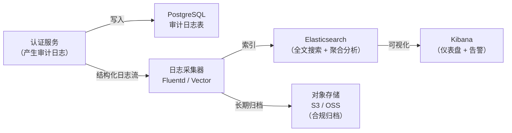

# 审计与安全监控

## 本篇导读

### 核心目标

学完本篇后，你将能够：

- 理解审计日志（Audit Log）与应用日志（Application Log）的本质区别，以及为什么认证系统必须无一例外地记录审计日志
- 在 NestJS 中设计并实现结构化审计日志系统，涵盖认证事件的完整生命周期
- 实现基于规则的攻击检测：暴力破解、账号枚举、异常地理位置登录、会话劫持检测
- 设计告警通知系统：将安全事件推送到邮件、Slack 或 PagerDuty
- 理解日志分析的基础方法：如何通过日志发现攻击模式
- 掌握审计日志的合规性要求：为什么以及如何满足 GDPR、SOC 2 等合规框架对日志的要求

### 重点与难点

**重点**：

- 审计日志的不可篡改性——为什么审计日志不能被修改或删除，以及如何在技术上保障这一点
- 区分"应该记录什么"和"不应该记录什么"——密码、Token 明文绝不能出现在日志中
- 攻击检测的滑动窗口——如何用 Redis 实现高效的短期行为统计

**难点**：

- 审计日志的性能影响——每次认证操作都写日志，如何减少对主链路延迟的影响（异步写入）
- 攻击检测的误报与漏报——阈值太低误伤正常用户，阈值太高放过攻击者，如何权衡
- 用户行为基线建立——什么是"异常"登录？需要先有"正常"的参照系

## 审计日志的设计原则

### 审计日志 vs 应用日志

很多团队在項目初期把两者混淆，等到出现安全事件需要追溯时，才发现日志里什么有用的都没有。

**应用日志（Application Log）**是给开发者看的，用于调试和排查问题：

```plaintext
[2026-03-29T10:23:15.123Z] ERROR UserService.findById: Database connection timeout after 5000ms
[2026-03-29T10:23:16.456Z] INFO  Server started on port 3000
[2026-03-29T10:23:17.789Z] DEBUG JwtStrategy.validate: Token payload { sub: "uid-123" }
```

**审计日志（Audit Log）**是给安全审计员、合规团队和事故响应团队看的，用于追踪谁在什么时候对什么资源做了什么操作：

```json
{
  "eventId": "evt_01HX8K5P2Q3R4S5T6U7V8W9X",
  "timestamp": "2026-03-29T10:23:15.123Z",
  "eventType": "auth.login.failure",
  "actor": {
    "ip": "203.0.113.45",
    "userAgent": "Mozilla/5.0 ...",
    "userId": null
  },
  "resource": { "type": "user.account", "identifier": "user@example.com" },
  "outcome": "failure",
  "reason": "invalid_password",
  "requestId": "req_abcd1234",
  "sessionId": null
}
```

两者的核心区别：

| 维度     | 应用日志           | 审计日志                   |
| -------- | ------------------ | -------------------------- |
| 受众     | 开发者             | 安全审计员、合规团队       |
| 目的     | 调试、监控服务健康 | 安全追溯、合规证明         |
| 格式     | 通常是文本行       | 必须是结构化（JSON）       |
| 保留时长 | 通常 7~30 天       | 通常 1~7 年（合规要求）    |
| 可修改性 | 可以滚动覆盖       | 必须不可删除、不可篡改     |
| 敏感字段 | 可能包含调试信息   | 绝对不能含密码、Token 明文 |

### 必须记录的认证事件

以下事件是认证系统中 **必须** 记录的，缺少任何一项都会在安全事故发生时留下盲区：

| 事件类型       | 事件 Key                       | 说明                                       |
| -------------- | ------------------------------ | ------------------------------------------ |
| 登录成功       | `auth.login.success`           | 记录用户 ID、IP、设备信息、登录方式        |
| 登录失败       | `auth.login.failure`           | 记录尝试的账号、IP、失败原因               |
| 登出           | `auth.logout`                  | 记录用户 ID、会话 ID                       |
| 注册成功       | `auth.register.success`        | 记录新用户 ID、IP                          |
| 密码修改       | `auth.password.changed`        | 记录用户 ID、操作 IP（是本人还是攻击者？） |
| 密码重置请求   | `auth.password.reset.request`  | 记录请求邮箱、IP                           |
| 密码重置完成   | `auth.password.reset.complete` | 记录用户 ID、IP                            |
| Token 刷新     | `auth.token.refresh`           | 记录用户 ID、Refresh Token 标识符          |
| Token 刷新失败 | `auth.token.refresh.failure`   | 记录失败原因（过期/已撤销/不存在）         |
| MFA 绑定       | `auth.mfa.enabled`             | 记录用户 ID、操作 IP                       |
| MFA 禁用       | `auth.mfa.disabled`            | 记录用户 ID、操作 IP（高危操作）           |
| MFA 验证失败   | `auth.mfa.failure`             | 记录失败次数                               |
| 恢复码使用     | `auth.recovery_code.used`      | 记录用户 ID（用了几个，还剩几个）          |
| 第三方登录成功 | `auth.oauth.login.success`     | 记录 provider（google/github/wechat）      |
| 账号锁定       | `auth.account.locked`          | 记录触发锁定的 IP                          |
| 账号解锁       | `auth.account.unlocked`        | 记录操作者（管理员解锁还是自动解锁）       |
| SSO 会话创建   | `auth.sso.session.created`     | 记录 OIDC 客户端 ID                        |
| SSO 会话撤销   | `auth.sso.session.revoked`     | 记录撤销原因（登出/过期/管理员操作）       |

### 绝对不能记录的内容

以下内容一旦出现在日志中，就是安全漏洞：

- **密码明文或哈希值**：日志系统通常没有数据库那么严格的访问控制，密码哈希泄露等同于密码泄露
- **Access Token / Refresh Token 完整值**：泄露 Token 等同于泄露身份
- **Session ID 完整值**：同上
- **信用卡号、银行账号等 PCI DSS 范畴的数据**
- **个人身份证号等 PII（个人可识别信息）**（在 GDPR 适用地区格外重要）

对于 Token，可以记录其前 8 位（用于调试追踪）或其哈希值（用于关联事件），但绝不记录完整值：

```typescript
// 安全做法：只记录 Token 的摘要
const tokenDigest = crypto
  .createHash('sha256')
  .update(token)
  .digest('hex')
  .slice(0, 16);
// 日志中记录 tokenDigest，不记录 token 本身
```

## 审计日志系统实现

### 数据模型设计

```typescript
// drizzle schema
export const auditLogs = pgTable('audit_logs', {
  id: varchar('id', { length: 36 }).primaryKey(), // ULID 格式，保证时间有序
  timestamp: timestamp('timestamp').notNull().defaultNow(),
  eventType: varchar('event_type', { length: 100 }).notNull(),
  actorUserId: uuid('actor_user_id'), // null 表示未认证用户
  actorIp: varchar('actor_ip', { length: 45 }), // 支持 IPv6（最长 45 字符）
  actorUserAgent: text('actor_user_agent'),
  actorDeviceId: varchar('actor_device_id', { length: 100 }),
  resourceType: varchar('resource_type', { length: 100 }),
  resourceId: varchar('resource_id', { length: 255 }),
  outcome: varchar('outcome', { length: 20 }).notNull(), // 'success' | 'failure'
  reason: varchar('reason', { length: 255 }),
  metadata: jsonb('metadata'), // 事件相关的其他结构化数据
  requestId: varchar('request_id', { length: 100 }),
  sessionId: varchar('session_id', { length: 100 }), // 脱敏后的会话标识
});

// 索引：常用查询模式
// 按时间范围查询：timestamp DESC
// 按用户查询：actor_user_id + timestamp
// 按事件类型查询：event_type + timestamp
// 按 IP 查询：actor_ip + timestamp
```

**为什么用 ULID 而不是 UUID v4**：ULID（Universally Unique Lexicographically Sortable Identifier）内嵌了时间戳前缀，按 ID 排序即按时间排序，更适合审计日志这类时序数据。同时 ULID 也保证全局唯一，不依赖数据库自增 ID。

### Audit Log Service

```typescript
// src/audit/audit.service.ts
import { Injectable } from '@nestjs/common';
import { DrizzleService } from '../drizzle/drizzle.service';
import { auditLogs } from '../drizzle/schema';
import { monotonicFactory } from 'ulid';

const ulid = monotonicFactory();

export interface AuditLogEntry {
  eventType: string;
  actorUserId?: string;
  actorIp?: string;
  actorUserAgent?: string;
  resourceType?: string;
  resourceId?: string;
  outcome: 'success' | 'failure';
  reason?: string;
  metadata?: Record<string, unknown>;
  requestId?: string;
  sessionId?: string;
}

@Injectable()
export class AuditService {
  constructor(private readonly drizzle: DrizzleService) {}

  // 异步写入：不阻塞主链路（setImmediate 让当前事件循环先完成）
  log(entry: AuditLogEntry): void {
    setImmediate(async () => {
      try {
        await this.drizzle.db.insert(auditLogs).values({
          id: ulid(),
          eventType: entry.eventType,
          actorUserId: entry.actorUserId ?? null,
          actorIp: entry.actorIp ?? null,
          actorUserAgent: entry.actorUserAgent ?? null,
          resourceType: entry.resourceType ?? null,
          resourceId: entry.resourceId ?? null,
          outcome: entry.outcome,
          reason: entry.reason ?? null,
          metadata: entry.metadata ?? null,
          requestId: entry.requestId ?? null,
          sessionId: entry.sessionId ?? null,
        });
      } catch (err) {
        // 审计日志写入失败不应该影响主业务，但必须记录到应用日志
        console.error('[AuditService] Failed to write audit log:', err);
      }
    });
  }

  // 查询接口（给管理后台或合规团队使用）
  async query(params: {
    userId?: string;
    eventType?: string;
    ip?: string;
    startTime?: Date;
    endTime?: Date;
    limit?: number;
    offset?: number;
  }) {
    const conditions = [];

    if (params.userId) {
      conditions.push(eq(auditLogs.actorUserId, params.userId));
    }
    if (params.eventType) {
      conditions.push(eq(auditLogs.eventType, params.eventType));
    }
    if (params.ip) {
      conditions.push(eq(auditLogs.actorIp, params.ip));
    }
    if (params.startTime) {
      conditions.push(gte(auditLogs.timestamp, params.startTime));
    }
    if (params.endTime) {
      conditions.push(lte(auditLogs.timestamp, params.endTime));
    }

    return this.drizzle.db
      .select()
      .from(auditLogs)
      .where(and(...conditions))
      .orderBy(desc(auditLogs.timestamp))
      .limit(params.limit ?? 50)
      .offset(params.offset ?? 0);
  }
}
```

### 在认证服务中集成审计日志

通过 NestJS 拦截器（Interceptor）统一捕获请求上下文，在服务层按需调用 `AuditService.log()`：

```typescript
// src/auth/auth.service.ts（集成审计日志示例）

@Injectable()
export class AuthService {
  constructor(
    private readonly auditService: AuditService
    // ... 其他依赖
  ) {}

  async login(email: string, password: string, context: RequestContext) {
    const user = await this.usersService.findByEmail(email);

    if (!user) {
      // 记录失败：账号不存在
      this.auditService.log({
        eventType: 'auth.login.failure',
        actorIp: context.ip,
        actorUserAgent: context.userAgent,
        resourceType: 'user.account',
        resourceId: email, // 注意：这里记录的是尝试的邮箱，不涉及密码
        outcome: 'failure',
        reason: 'account_not_found',
        requestId: context.requestId,
      });
      // 注意：从用户角度应该返回相同的错误消息，防止账号枚举
      throw new UnauthorizedException('Invalid credentials');
    }

    const passwordValid = await bcrypt.compare(password, user.passwordHash);
    if (!passwordValid) {
      this.auditService.log({
        eventType: 'auth.login.failure',
        actorUserId: user.id,
        actorIp: context.ip,
        actorUserAgent: context.userAgent,
        resourceType: 'user.account',
        resourceId: user.id,
        outcome: 'failure',
        reason: 'invalid_password',
        requestId: context.requestId,
      });
      throw new UnauthorizedException('Invalid credentials');
    }

    // 登录成功
    this.auditService.log({
      eventType: 'auth.login.success',
      actorUserId: user.id,
      actorIp: context.ip,
      actorUserAgent: context.userAgent,
      resourceType: 'user.account',
      resourceId: user.id,
      outcome: 'success',
      metadata: {
        loginMethod: 'password',
        mfaRequired: user.mfaEnabled,
      },
      requestId: context.requestId,
    });

    // ... 继续生成 Token 等
  }
}
```

**RequestContext 的获取**：在 NestJS 中，可以通过自定义拦截器或 `REQUEST` 作用域将请求上下文注入到服务层。更简洁的方式是在 Controller 层提取上下文信息，作为参数传递给 Service：

```typescript
// 从 NestJS Request 对象中提取 RequestContext
function extractContext(req: Request): RequestContext {
  return {
    ip:
      req.headers['x-forwarded-for']?.toString().split(',')[0].trim() ?? req.ip,
    userAgent: req.headers['user-agent'] ?? '',
    requestId: req.headers['x-request-id']?.toString() ?? ulid(),
  };
}
```

## 攻击检测实现

### 暴力破解检测

暴力破解是认证系统面临的最常见攻击。基本的限制措施（错误次数过多锁定账号）在模块二已实现，这里进一步扩展为基于 IP 的全局检测：

```typescript
// src/security/brute-force.service.ts
import { Injectable } from '@nestjs/common';
import { RedisService } from '../redis/redis.service';
import { AuditService } from '../audit/audit.service';
import { AlertService } from './alert.service';

@Injectable()
export class BruteForceService {
  constructor(
    private readonly redis: RedisService,
    private readonly auditService: AuditService,
    private readonly alertService: AlertService
  ) {}

  // 记录登录失败并检测暴力破解
  async recordFailedAttempt(ip: string, targetAccount: string): Promise<void> {
    const now = Date.now();
    const windowKey = `brute:ip:${ip}`;
    const accountKey = `brute:account:${targetAccount}`;

    // 使用 Redis Sorted Set，以时间戳为 score，实现滑动窗口统计
    const pipeline = this.redis.client.pipeline();

    // 记录本次失败（member 为 timestamp，score 也为 timestamp）
    pipeline.zadd(windowKey, now, `${now}-${Math.random()}`);
    pipeline.zadd(accountKey, now, `${now}-${Math.random()}`);

    // 清理 15 分钟前的记录（保持滑动窗口）
    const windowStart = now - 15 * 60 * 1000;
    pipeline.zremrangebyscore(windowKey, 0, windowStart);
    pipeline.zremrangebyscore(accountKey, 0, windowStart);

    // 设置过期时间（避免 Redis 内存泄露）
    pipeline.expire(windowKey, 900); // 15 分钟
    pipeline.expire(accountKey, 900);

    await pipeline.exec();

    // 统计 15 分钟内该 IP 的失败次数
    const ipFailures = await this.redis.client.zcard(windowKey);
    // 统计 15 分钟内该账号的失败次数
    const accountFailures = await this.redis.client.zcard(accountKey);

    // 触发告警阈值
    if (ipFailures >= 20) {
      // 某个 IP 15 分钟内失败 20 次以上（可能在扫描账号列表）
      await this.handleBruteForceAlert(
        'ip_brute_force',
        ip,
        ipFailures,
        targetAccount
      );
    }

    if (accountFailures >= 5) {
      // 某个账号 15 分钟内失败 5 次以上（针对特定账号的暴力破解）
      await this.handleBruteForceAlert(
        'account_brute_force',
        ip,
        accountFailures,
        targetAccount
      );
    }
  }

  private async handleBruteForceAlert(
    type: string,
    ip: string,
    failureCount: number,
    targetAccount: string
  ) {
    // 防止重复告警（同一 IP 每 10 分钟只告警一次）
    const alertCooldownKey = `alert:cooldown:${type}:${ip}`;
    const alreadyAlerted = await this.redis.client.exists(alertCooldownKey);
    if (alreadyAlerted) return;

    await this.redis.client.set(alertCooldownKey, '1', 'EX', 600);

    // 发送告警
    await this.alertService.send({
      severity: 'high',
      title: `Possible brute force detected: ${type}`,
      body: `IP ${ip} has failed ${failureCount} times in 15 minutes (targeting: ${targetAccount})`,
      metadata: { type, ip, failureCount, targetAccount },
    });
  }

  // 检查 IP 是否应该被封禁进入黑名单
  async isIpBlocked(ip: string): Promise<boolean> {
    return !!(await this.redis.client.exists(`blocked:ip:${ip}`));
  }

  // 手动封禁 IP（管理员操作）
  async blockIp(
    ip: string,
    durationSeconds: number,
    reason: string
  ): Promise<void> {
    await this.redis.client.set(
      `blocked:ip:${ip}`,
      reason,
      'EX',
      durationSeconds
    );
  }
}
```

### 账号枚举攻击检测

账号枚举攻击是指攻击者通过观察"账号不存在"和"密码错误"这两种不同的错误响应，来确认哪些邮箱已经注册。

**防御账号枚举的基本原则**：登录失败时，无论账号是否存在，都返回相同的错误消息（`"Invalid credentials"`），而不是区分"账号不存在"和"密码错误"。

但聪明的攻击者还会利用时序差异（timing attack）：如果账号存在，服务端需要执行 bcrypt 比对（耗时 ~100ms）；如果账号不存在，直接返回（耗时 ~1ms）。通过测量响应时间差，攻击者仍然能判断账号是否存在。

**解决方案**：无论账号是否存在，都执行一次虚假的 bcrypt 计算：

```typescript
async login(email: string, password: string) {
  const user = await this.usersService.findByEmail(email);

  if (!user) {
    // 即使账号不存在，也执行一次 bcrypt 计算，确保响应时间与账号存在时一致
    await bcrypt.compare(password, '$2b$10$invalidhashpadding000000000000000000000000000000000000');
    throw new UnauthorizedException('Invalid credentials');
  }

  const isValid = await bcrypt.compare(password, user.passwordHash);
  if (!isValid) {
    throw new UnauthorizedException('Invalid credentials');
  }

  // ...
}
```

### 异常地理位置检测

如果用户通常在北京登录，突然从东京登录，可能是账号被盗。实现这个功能需要 IP 地理位置数据库（如 MaxMind GeoIP2）。

```typescript
// src/security/geo-anomaly.service.ts
import { Injectable } from '@nestjs/common';
import { RedisService } from '../redis/redis.service';
import { AlertService } from './alert.service';
import * as geoip from 'geoip-lite'; // 轻量级 MaxMind 封装

@Injectable()
export class GeoAnomalyService {
  constructor(
    private readonly redis: RedisService,
    private readonly alertService: AlertService
  ) {}

  async checkAndRecord(userId: string, ip: string): Promise<void> {
    const geo = geoip.lookup(ip);
    if (!geo) return; // 私有 IP 或未知 IP，跳过检测

    const currentCountry = geo.country;
    const currentCity = geo.city;

    // 获取用户历史登录地理位置
    const historyKey = `geo:history:${userId}`;
    const history = await this.redis.client.lrange(historyKey, 0, 9); // 最近 10 次

    if (history.length > 0) {
      const lastLocation = JSON.parse(history[0]);

      // 简单判断：如果国家不同，视为异常
      if (lastLocation.country !== currentCountry) {
        await this.alertService.send({
          severity: 'medium',
          title: 'Unusual login location detected',
          body: `User logged in from ${currentCity}, ${currentCountry}. Previous login was from ${lastLocation.city}, ${lastLocation.country}.`,
          metadata: {
            userId,
            ip,
            currentLocation: { country: currentCountry, city: currentCity },
            previousLocation: lastLocation,
          },
        });
      }
    }

    // 记录本次登录位置
    await this.redis.client.lpush(
      historyKey,
      JSON.stringify({
        country: currentCountry,
        city: currentCity,
        ip,
        timestamp: new Date().toISOString(),
      })
    );
    // 保留最近 10 条，设置 30 天过期
    await this.redis.client.ltrim(historyKey, 0, 9);
    await this.redis.client.expire(historyKey, 30 * 24 * 3600);
  }
}
```

**注意**：IP 地理位置数据本身并不精确，同一运营商在不同城市的出口 IP 可能被识别为同一地区，VPN 用户会频繁触发异常告警。地理位置检测应该作为 **告警参考** 而非 **硬性拦截**，配合人工审核使用。

### 可疑行为综合评分（Risk Scoring）

更成熟的方案是对每次登录行为进行综合评分，分数超过阈值时触发不同级别的响应：

```typescript
// src/security/risk-score.service.ts
export interface RiskFactor {
  name: string;
  score: number;
  description: string;
}

@Injectable()
export class RiskScoreService {
  async calculateLoginRisk(context: {
    ip: string;
    userId?: string;
    userAgent: string;
    email: string;
  }): Promise<{ score: number; factors: RiskFactor[] }> {
    const factors: RiskFactor[] = [];
    let totalScore = 0;

    // 因子 1：IP 是否在黑名单中
    const isBlocked = await this.bruteForceService.isIpBlocked(context.ip);
    if (isBlocked) {
      factors.push({ name: 'blocked_ip', score: 100, description: 'IP is on blocklist' });
      totalScore += 100;
    }

    // 因子 2：是否是 Tor 出口节点或已知代理 IP
    const isTor = await this.checkIfTorExit(context.ip);
    if (isTor) {
      factors.push({ name: 'tor_exit', score: 40, description: 'Login from Tor exit node' });
      totalScore += 40;
    }

    // 因子 3：近期失败次数
    const recentFailures = await this.getRecentFailureCount(context.ip, context.email);
    if (recentFailures >= 3) {
      const score = Math.min(recentFailures * 10, 50);
      factors.push({ name: 'recent_failures', score, description: `${recentFailures} recent failed attempts` });
      totalScore += score;
    }

    // 因子 4：User-Agent 是否异常（空 UA、自动化工具特征）
    if (!context.userAgent || context.userAgent.includes('python-requests') || context.userAgent.includes('curl')) {
      factors.push({ name: 'suspicious_ua', score: 30, description: 'Suspicious or automated User-Agent' });
      totalScore += 30;
    }

    // 因子 5：登录时间是否异常（凌晨 2~5 点）
    const hour = new Date().getUTCHours();
    if (hour >= 2 && hour <= 5) {
      factors.push({ name: 'off_hours', score: 10, description: 'Login during unusual hours' });
      totalScore += 10;
    }

    return { score: Math.min(totalScore, 100), factors };
  }
}

// 在认证流程中使用风险评分
async login(email: string, password: string, context: RequestContext) {
  const risk = await this.riskScoreService.calculateLoginRisk({ ip: context.ip, email, userAgent: context.userAgent });

  if (risk.score >= 100) {
    // 直接拒绝
    throw new ForbiddenException('Login blocked due to security concerns');
  }

  if (risk.score >= 60) {
    // 要求额外验证（如人机验证/CAPTCHA）
    throw new ForbiddenException('Additional verification required');
  }

  // 正常登录流程...
  // 如果 risk.score 在 30~60，可以要求进行 MFA 验证即使用户未启用 MFA
}
```

## 告警通知系统

### 告警的分级设计

不同严重程度的安全事件需要不同的响应速度和通知渠道：

| 严重程度 | 场景示例                       | 响应时间要求 | 通知渠道                |
| -------- | ------------------------------ | ------------ | ----------------------- |
| Critical | 疑似数据泄露、管理员账号被攻破 | 立即         | 电话 + 短信 + PagerDuty |
| High     | 大规模暴力破解、多账号异常登录 | 5 分钟内     | Slack + 邮件            |
| Medium   | 单账号异常登录、单 IP 频繁失败 | 1 小时内     | Slack                   |
| Low      | 单次可疑行为、低风险触发       | 工作时间处理 | 日志归档 + 每日报告     |

### AlertService 实现

```typescript
// src/security/alert.service.ts
import { Injectable } from '@nestjs/common';
import { HttpService } from '@nestjs/axios';
import { ConfigService } from '@nestjs/config';

export interface AlertPayload {
  severity: 'critical' | 'high' | 'medium' | 'low';
  title: string;
  body: string;
  metadata?: Record<string, unknown>;
}

@Injectable()
export class AlertService {
  private readonly slackWebhookUrl: string;

  constructor(
    private readonly http: HttpService,
    private readonly config: ConfigService
  ) {
    this.slackWebhookUrl = this.config.get('SLACK_WEBHOOK_URL', '');
  }

  async send(payload: AlertPayload): Promise<void> {
    // 并发发送到多个渠道，某个渠道失败不影响其他渠道
    await Promise.allSettled([
      this.sendToSlack(payload),
      payload.severity === 'critical'
        ? this.sendEmail(payload)
        : Promise.resolve(),
    ]);
  }

  private async sendToSlack(payload: AlertPayload): Promise<void> {
    if (!this.slackWebhookUrl) return;

    const colorMap = {
      critical: '#FF0000',
      high: '#FF8C00',
      medium: '#FFD700',
      low: '#36A64F',
    };

    const message = {
      attachments: [
        {
          color: colorMap[payload.severity],
          title: `[${payload.severity.toUpperCase()}] ${payload.title}`,
          text: payload.body,
          fields: payload.metadata
            ? Object.entries(payload.metadata).map(([k, v]) => ({
                title: k,
                value: String(v),
                short: true,
              }))
            : [],
          footer: `AuthService Security Alert | ${new Date().toISOString()}`,
        },
      ],
    };

    try {
      await this.http.axiosRef.post(this.slackWebhookUrl, message, {
        timeout: 5000,
      });
    } catch (err) {
      console.error('[AlertService] Failed to send Slack alert:', err);
    }
  }

  private async sendEmail(payload: AlertPayload): Promise<void> {
    // 使用 Nodemailer 或 SendGrid SDK 发送告警邮件
    // 具体实现取决于使用的邮件服务
    console.error(
      '[AlertService] Critical alert (email not configured):',
      payload.title
    );
  }
}
```

## 日志分析基础

### 结构化日志的查询示例

有了结构化的审计日志，可以在 PostgreSQL 中直接用 SQL 进行安全分析：

```sql
-- 1. 过去 24 小时内，登录失败次数最多的 IP 排名
SELECT actor_ip, COUNT(*) AS failure_count
FROM audit_logs
WHERE event_type = 'auth.login.failure'
  AND timestamp > NOW() - INTERVAL '24 hours'
GROUP BY actor_ip
ORDER BY failure_count DESC
LIMIT 20;

-- 2. 某用户过去 30 天的登录历史（包含 IP 和地理位置）
SELECT timestamp, actor_ip, outcome, reason,
       metadata->>'loginMethod' AS login_method
FROM audit_logs
WHERE actor_user_id = 'uid-xxx'
  AND event_type IN ('auth.login.success', 'auth.login.failure')
  AND timestamp > NOW() - INTERVAL '30 days'
ORDER BY timestamp DESC;

-- 3. 过去 1 小时内，登录成功后立即触发异常操作的账号（可能是账号被盗）
WITH recent_logins AS (
  SELECT actor_user_id, MAX(timestamp) AS last_login
  FROM audit_logs
  WHERE event_type = 'auth.login.success'
    AND timestamp > NOW() - INTERVAL '1 hour'
  GROUP BY actor_user_id
),
suspicious_actions AS (
  SELECT actor_user_id, event_type, timestamp
  FROM audit_logs
  WHERE event_type IN ('auth.password.changed', 'auth.mfa.disabled')
    AND timestamp > NOW() - INTERVAL '1 hour'
)
SELECT l.actor_user_id, l.last_login, s.event_type, s.timestamp
FROM recent_logins l
JOIN suspicious_actions s ON l.actor_user_id = s.actor_user_id
WHERE s.timestamp > l.last_login  -- 登录后才发生的操作
ORDER BY s.timestamp DESC;

-- 4. 某 IP 在过去 15 分钟内尝试的不同账号数（账号枚举检测）
SELECT actor_ip,
       COUNT(DISTINCT resource_id) AS unique_accounts,
       COUNT(*) AS total_attempts
FROM audit_logs
WHERE event_type = 'auth.login.failure'
  AND timestamp > NOW() - INTERVAL '15 minutes'
GROUP BY actor_ip
HAVING COUNT(DISTINCT resource_id) > 10
ORDER BY unique_accounts DESC;
```

### 与外部日志分析平台集成

对于更大规模的系统，PostgreSQL 直查虽然灵活但存在性能限制。生产环境通常会将审计日志同步到专门的日志分析平台：



**为什么同时写 PostgreSQL 和日志平台**：

- PostgreSQL：业务系统可以直接关联查询（用户表 JOIN 审计表）
- Elasticsearch：擅长全文检索和聚合分析，适合安全团队的探索性查询
- 对象存储（S3/OSS）：成本极低，适合长期合规归档（按法规要求保留 1~7 年）

## 合规性考量

### GDPR 对审计日志的要求

如果你的产品面向欧盟用户，GDPR（通用数据保护条例）对个人数据的处理有明确要求：

**数据最小化原则**：只记录必要的信息。如果 IP 地址不是分析必需的，就不要记录。

**保留期限**：明确规定审计日志的保留期限，期满后自动删除（技术上实现自动清理脚本）。

**访问控制**：审计日志包含用户行为数据，必须设置严格的读取权限，不能所有员工都能看。

**数据主体权利**：当用户行使"被遗忘权"（Right to be Forgotten）要求删除账号时，审计日志中包含其 userId 的记录如何处理？通常的合理做法是：将审计日志中的 userId 替换为一个匿名标识符（对 userId 做单向哈希），同时保留审计事件本身（因为合规审计需要完整的事件链）。

### SOC 2 对审计日志的要求

SOC 2（Service Organization Control 2）是云服务供应商常需要的安全合规认证。其"可用性"、"机密性"、"安全性"控制要求中，对审计日志有明确要求：

- 必须记录的事件：认证成功/失败、权限变更、敏感数据访问
- 日志必须至少保留 1 年
- 必须有防篡改机制（例如将日志定期存储到不可变的存储中）
- 必须有日志访问的访问控制和审计（审计审计者的操作）

## 常见问题与解决方案

### 审计日志影响接口性能

**问题**：在高并发场景下，每次认证请求都写一条数据库记录，导致接口延迟明显增加。

**解决方案**：采用异步批量写入策略。上文的 `setImmediate` 实现已经将写入异步化，进一步可以引入写入缓冲：

```typescript
// 批量写入优化
@Injectable()
export class AuditService implements OnModuleInit {
  private buffer: AuditLogEntry[] = [];
  private flushTimer: NodeJS.Timeout;

  onModuleInit() {
    // 每 5 秒批量写入一次
    this.flushTimer = setInterval(() => this.flush(), 5000);
  }

  log(entry: AuditLogEntry): void {
    this.buffer.push({ ...entry, id: ulid(), timestamp: new Date() });
    // 缓冲区超过 100 条时立即写入
    if (this.buffer.length >= 100) {
      this.flush();
    }
  }

  private async flush(): Promise<void> {
    if (this.buffer.length === 0) return;
    const batch = this.buffer.splice(0, this.buffer.length);
    try {
      await this.drizzle.db.insert(auditLogs).values(batch);
    } catch (err) {
      console.error('[AuditService] Batch write failed:', err);
      // 失败时可以尝试重新加入缓冲区或写入降级存储
    }
  }
}
```

**权衡**：批量写入会引入最多 5 秒的延迟，即安全事件发生后最多 5 秒才出现在审计日志中。对于实时告警场景，可以将告警触发和日志写入分开——告警仍然实时触发，日志允许小幅延迟。

### 如何防止审计日志被内部人员篡改

**问题**：数据库管理员拥有直接修改数据库的权限，如何确保审计日志的不可篡改性？

**方案一：将日志存储到只写存储**

使用 AWS S3 的 **S3 Object Lock**（WORM——Write Once Read Many）功能，或 Google Cloud Storage 的 Retention Policy。存入后在保留期内无法删除或覆盖。

**方案二：日志哈希链（Blockchain-lite 方案）**

每条审计日志记录上一条记录的哈希：

```typescript
// 每条审计日志包含上一条记录的哈希
const prevLog = await getLastAuditLog();
const entry = {
  ...newLogData,
  prevHash: prevLog ? sha256(JSON.stringify(prevLog)) : null,
};
```

这样，任何对中间某条记录的篡改都会导致哈希链断裂，可以被检测到。

**方案三：定期将日志哈希存储到区块链或公证服务**

将每天的审计日志 Merkle Tree Root 存储到以太坊（或使用 Notarization 服务），提供可验证的存在证明。

**实用建议**：对大多数中小型应用，方案一（使用云对象存储的 WORM 功能）是成本最低、维护最简单的可信方案。

### 误报率过高，安全团队疲于应对

**问题**：攻击检测触发了大量误报，安全团队对告警失去信任，开始忽略所有告警。这是"告警疲劳（Alert Fatigue）"，是安全运营中最危险的陷阱之一。

**解决方案**：

1. **分级处理**：Critical 立即响应，Medium/Low 汇总到每日报告，不发即时通知
2. **持续调整阈值**：收集误报数据，根据实际业务流量动态调整检测规则
3. **丰富上下文**：告警消息应包含足够的上下文，让接收告警的人能快速判断是否是误报，而不需要反复查询多个系统
4. **白名单机制**：将已知的自动化测试 IP、办公 IP 加入白名单，减少内部测试引发的告警

## 本篇小结

本篇构建了一套完整的认证系统审计与安全监控能力，从日志记录到攻击检测再到告警通知，形成完整的安全闭环。

**审计日志的三个核心原则**：

- 结构化存储（JSON），而非文本行；ULID 保证时间有序的唯一 ID
- 绝不记录密码、Token 明文等敏感信息；记录 Token 摘要（前 8 位或哈希）
- 异步写入（`setImmediate`），不阻塞认证主链路

**攻击检测的三条防线**：

- 账号级别：连续失败次数触发锁定（模块二已实现）
- IP 级别：滑动窗口统计 + Redis Sorted Set，15 分钟失败 20 次触发告警
- 行为级别：地理位置异常、User-Agent 异常、时间段异常的综合风险评分

**告警疲劳的破解之道**：严格分级，Critical 立即响应，其他级别汇总报告；持续根据实际业务调整阈值；每条告警必须包含足够上下文，让接收者能快速判断。

**合规性**：GDPR 要求数据最小化、明确保留期限和用户数据匿名化；SOC 2 要求完整事件记录、至少 1 年保留和防篡改机制。

安全监控是一项持续投入的工作，没有一劳永逸的配置。随着业务规模增长，需要定期回顾检测规则的误报率，并根据新出现的攻击模式持续更新检测逻辑。
