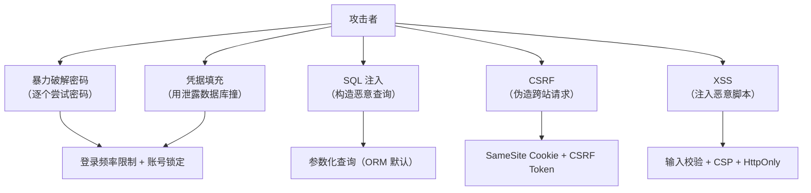
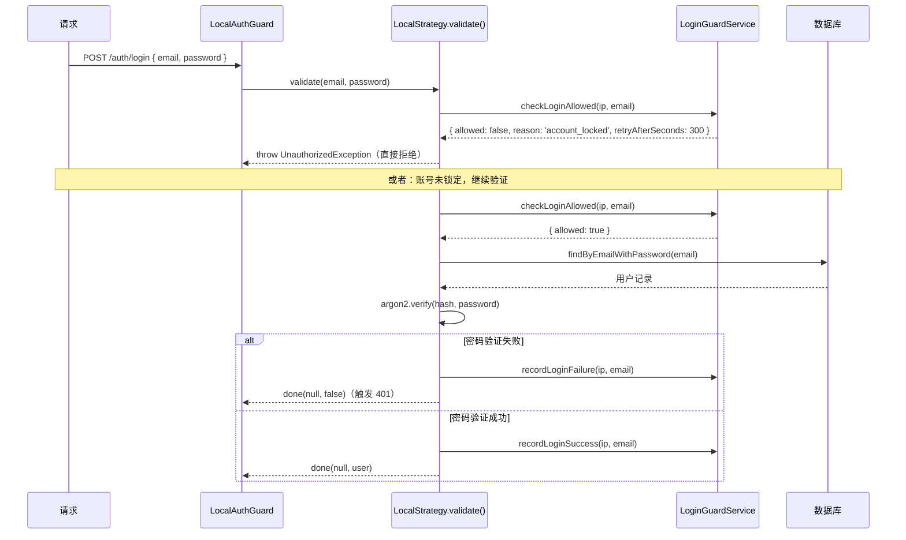
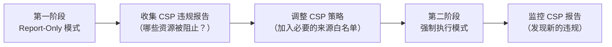

# 安全防护

## 本篇导读

### 核心目标

学完本篇后，你将能够：

- 实现基于 Redis 的登录频率限制与账号锁定机制，防御暴力破解和凭据填充攻击
- 理解 Drizzle ORM 如何通过参数化查询自动防御 SQL 注入，并识别在 ORM 场景下仍然存在的注入风险
- 在 NestJS 中使用 Helmet 一键配置安全响应头，并实现内容安全策略（CSP）防御 XSS
- 判断在 Session + SameSite Cookie 的架构下，是否还需要额外的 CSRF Token，以及如何正确实现
- 将以上防护措施整合为一套系统性的纵深防御架构

### 重点与难点

**重点**：

- 登录频率限制的两个维度——按 IP 限制（防撞库）和按账号限制（防针对性暴力破解）
- Drizzle ORM 为什么默认安全？哪些写法仍然存在注入风险？
- SameSite=Lax 在现代浏览器中已经能防御大部分 CSRF，何时还需要 CSRF Token？

**难点**：

- 账号锁定的"锁定时长递增"策略——如何在 Redis 中实现指数退避式的锁定时长
- CSP 策略的调试——`report-uri` 与 `report-only` 模式的使用
- 在 SPA（单页应用）架构下，CSRF Token 的正确传递方式

## 一道防线不够，要纵深防御

前四篇搭建了一个功能完整的 Session 认证系统：注册、登录、会话管理都有了。但"功能完整"和"安全可用"是两回事。

假设你的系统已经上线，攻击者会怎样尝试突破？



本篇逐一拆解这四类攻击，并给出在 NestJS + Session 架构下的具体实现。

## 核心概念讲解

### 登录频率限制与账号锁定

#### 攻击场景：暴力破解 vs 凭据填充

**暴力破解（Brute Force）**：攻击者对单个账号反复尝试不同密码，直到成功。

```plaintext
POST /api/auth/login  → { email: "victim@example.com", password: "password1" }
POST /api/auth/login  → { email: "victim@example.com", password: "password2" }
POST /api/auth/login  → { email: "victim@example.com", password: "password3" }
...（几万次）
POST /api/auth/login  → { email: "victim@example.com", password: "Tr0ub4dour" } ✅
```

**凭据填充（Credential Stuffing）**：攻击者拿到某个网站泄露的用户名密码组合，逐一在其他网站尝试。因为很多用户多个网站用同一个密码，成功率惊人（通常 0.1%～2%）。

```plaintext
POST /api/auth/login  → { email: "user1@example.com", password: "泄露的密码1" }
POST /api/auth/login  → { email: "user2@example.com", password: "泄露的密码2" }
POST /api/auth/login  → { email: "user3@example.com", password: "泄露的密码3" }
...（来自泄露数据库的几百万条记录）
```

两种攻击的特征不同，防御策略也要分层：

| 攻击类型 | 特征                                 | 防御策略                             |
| -------- | ------------------------------------ | ------------------------------------ |
| 暴力破解 | 同一 IP 大量失败，或同一账号大量失败 | 按 IP 限速 + 账号锁定                |
| 凭据填充 | 大量不同账号，每个账号尝试次数少     | 按 IP 限速 + 异常检测 + 密码泄露检测 |

#### 防御设计

我们需要在两个维度上做限制：

**维度一：按 IP 限制**（防凭据填充）

单个 IP 在时间窗口内，允许的最大登录失败次数。

- 窗口：15 分钟
- 上限：20 次失败
- 触发后：拒绝该 IP 的登录请求一段时间

**维度二：按账号限制**（防暴力破解）

单个账号在时间窗口内，允许的最大登录失败次数。

- 窗口：15 分钟
- 上限：5 次失败
- 触发后：锁定账号，要求用户通过邮件解锁或等待冷却

**指数退避锁定**（让攻击代价越来越高）

每次锁定的时长随失败次数递增：

```
第 5 次失败：锁定 1 分钟
第 6 次失败（解锁后又失败）：锁定 5 分钟
第 7 次失败：锁定 15 分钟
第 8 次失败：锁定 1 小时
第 9 次失败及以上：锁定 24 小时
```

这对合法用户影响小（偶尔一两次输错密码不会被长期锁），但对攻击者代价极高。

#### 在 Redis 中实现频率限制

我们把限速状态存在 Redis 中：

```
ip-limit:{ip}      → 该 IP 的失败次数（15 分钟窗口，TTL = 15min）
login-fail:{email} → 该账号的失败次数（15 分钟窗口，TTL = 15min）
login-lock:{email} → 账号锁定标记（TTL = 锁定时长）
```

封装一个 `LoginGuardService`：

```typescript
// src/auth/login-guard.service.ts
import { Injectable, Inject } from '@nestjs/common';
import { RedisClientType } from 'redis';
import { REDIS_CLIENT } from '../redis/redis.provider';

const IP_LIMIT_PREFIX = 'ip-limit:';
const LOGIN_FAIL_PREFIX = 'login-fail:';
const LOGIN_LOCK_PREFIX = 'login-lock:';

// 窗口时间（秒）
const WINDOW_SECONDS = 15 * 60; // 15 分钟
// IP 最大失败次数
const IP_MAX_FAILURES = 20;
// 账号最大失败次数（触发锁定）
const ACCOUNT_MAX_FAILURES = 5;

// 指数退避锁定时长（秒），索引 = 超出阈值的次数
const LOCK_DURATIONS = [
  60, // 第 1 次锁定：1 分钟
  5 * 60, // 第 2 次：5 分钟
  15 * 60, // 第 3 次：15 分钟
  60 * 60, // 第 4 次：1 小时
  24 * 60 * 60, // 第 5 次及以上：24 小时
];

export interface LoginGuardResult {
  allowed: boolean;
  reason?: 'ip_rate_limited' | 'account_locked';
  retryAfterSeconds?: number;
}

@Injectable()
export class LoginGuardService {
  constructor(@Inject(REDIS_CLIENT) private readonly redis: RedisClientType) {}

  /**
   * 登录前检查：是否允许尝试
   */
  async checkLoginAllowed(
    ip: string,
    email: string
  ): Promise<LoginGuardResult> {
    // 1. 检查 IP 是否超限
    const ipKey = `${IP_LIMIT_PREFIX}${ip}`;
    const ipFailures = await this.redis.get(ipKey);
    if (ipFailures && parseInt(ipFailures) >= IP_MAX_FAILURES) {
      const ttl = await this.redis.ttl(ipKey);
      return {
        allowed: false,
        reason: 'ip_rate_limited',
        retryAfterSeconds: ttl,
      };
    }

    // 2. 检查账号是否被锁定
    const lockKey = `${LOGIN_LOCK_PREFIX}${email}`;
    const locked = await this.redis.exists(lockKey);
    if (locked) {
      const ttl = await this.redis.ttl(lockKey);
      return {
        allowed: false,
        reason: 'account_locked',
        retryAfterSeconds: ttl,
      };
    }

    return { allowed: true };
  }

  /**
   * 登录成功后调用：清除失败记录
   */
  async recordLoginSuccess(ip: string, email: string): Promise<void> {
    await Promise.all([
      this.redis.del(`${IP_LIMIT_PREFIX}${ip}`),
      this.redis.del(`${LOGIN_FAIL_PREFIX}${email}`),
    ]);
  }

  /**
   * 登录失败后调用：记录失败，必要时锁定账号
   */
  async recordLoginFailure(ip: string, email: string): Promise<void> {
    const ipKey = `${IP_LIMIT_PREFIX}${ip}`;
    const failKey = `${LOGIN_FAIL_PREFIX}${email}`;
    const lockKey = `${LOGIN_LOCK_PREFIX}${email}`;

    // 使用 Pipeline 减少 Redis 往返次数
    const [, ipFailures] = (await this.redis
      .multi()
      .incr(ipKey)
      .expire(ipKey, WINDOW_SECONDS)
      .incr(failKey)
      .expire(failKey, WINDOW_SECONDS)
      .exec()) as [unknown, unknown, number, unknown];

    // 重新读取账号失败次数（multi().exec() 的结果顺序对应命令顺序）
    const accountFailures = await this.redis.get(failKey);
    const failures = parseInt(accountFailures ?? '0');

    // 超过阈值时，根据已失败次数决定锁定时长
    if (failures >= ACCOUNT_MAX_FAILURES) {
      const lockCount = failures - ACCOUNT_MAX_FAILURES; // 超出阈值的次数（0 起始）
      const lockIndex = Math.min(lockCount, LOCK_DURATIONS.length - 1);
      const lockDuration = LOCK_DURATIONS[lockIndex];
      await this.redis.set(lockKey, '1', { EX: lockDuration });
    }
  }

  /**
   * 获取账号当前失败次数（用于展示"还剩 N 次尝试机会"）
   */
  async getFailureCount(email: string): Promise<number> {
    const raw = await this.redis.get(`${LOGIN_FAIL_PREFIX}${email}`);
    return parseInt(raw ?? '0');
  }
}
```

#### 将频率限制接入登录流程

在 `LocalStrategy` 的 `validate` 方法和 `AuthController` 的 `login` 方法中，按照以下时序接入：



修改 `LocalStrategy.validate()` 接入频率限制：

```typescript
// src/auth/strategies/local.strategy.ts
import { Injectable, UnauthorizedException } from '@nestjs/common';
import { PassportStrategy } from '@nestjs/passport';
import { Strategy } from 'passport-local';
import { Request } from 'express';
import { AuthService } from '../auth.service';
import { LoginGuardService } from '../login-guard.service';

@Injectable()
export class LocalStrategy extends PassportStrategy(Strategy) {
  constructor(
    private readonly authService: AuthService,
    private readonly loginGuardService: LoginGuardService
  ) {
    super({
      usernameField: 'email',
      passwordField: 'password',
      passReqToCallback: true, // 把 req 一并传入 validate，方便读取 IP
    });
  }

  async validate(req: Request, email: string, password: string) {
    const ip = req.ip ?? req.socket.remoteAddress ?? '0.0.0.0';
    const normalizedEmail = email.toLowerCase().trim();

    // 1. 登录前检查
    const check = await this.loginGuardService.checkLoginAllowed(
      ip,
      normalizedEmail
    );
    if (!check.allowed) {
      const reason =
        check.reason === 'account_locked'
          ? `账号已被锁定，请在 ${check.retryAfterSeconds} 秒后重试`
          : `登录尝试过于频繁，请在 ${check.retryAfterSeconds} 秒后重试`;
      throw new UnauthorizedException(reason);
    }

    // 2. 验证用户凭据
    const user = await this.authService.validateUser(normalizedEmail, password);

    if (!user) {
      // 3. 验证失败：记录失败次数
      await this.loginGuardService.recordLoginFailure(ip, normalizedEmail);

      // 读取剩余尝试次数，给用户提示
      const failures =
        await this.loginGuardService.getFailureCount(normalizedEmail);
      const remaining = Math.max(0, 5 - failures);
      const message =
        remaining > 0
          ? `邮箱或密码不正确，还剩 ${remaining} 次尝试机会`
          : '账号已被锁定，请稍后再试';

      throw new UnauthorizedException(message);
    }

    // 4. 验证成功：清除失败记录
    await this.loginGuardService.recordLoginSuccess(ip, normalizedEmail);
    return user;
  }
}
```

#### 防爬虫：接口级别的全局限速

除了登录失败计数，还需要在接口级别配置整体的请求频率限制，防止高频轰炸。NestJS 官方提供了 `@nestjs/throttler` 模块，基于令牌桶算法实现限速：

```bash
pnpm add @nestjs/throttler
```

```typescript
// src/app.module.ts
import { ThrottlerModule, ThrottlerGuard } from '@nestjs/throttler';
import { APP_GUARD } from '@nestjs/core';

@Module({
  imports: [
    ThrottlerModule.forRoot([
      {
        // 短期限制：10 秒内最多 5 次
        name: 'short',
        ttl: 10_000, // 毫秒
        limit: 5,
      },
      {
        // 中期限制：1 分钟内最多 20 次
        name: 'medium',
        ttl: 60_000,
        limit: 20,
      },
    ]),
  ],
  providers: [
    {
      // 全局应用 ThrottlerGuard
      provide: APP_GUARD,
      useClass: ThrottlerGuard,
    },
  ],
})
export class AppModule {}
```

对于登录接口，单独配置更严格的限制：

```typescript
// src/auth/auth.controller.ts
import { Throttle, SkipThrottle } from '@nestjs/throttler';

@Controller('auth')
export class AuthController {
  // 登录接口：覆盖全局限速，10 秒内最多 3 次
  @Post('login')
  @Throttle({ short: { limit: 3, ttl: 10_000 } })
  @UseGuards(LocalAuthGuard)
  async login(@Req() req: Request) {
    // ...
  }

  // 注册接口：1 小时内最多 5 次（限制批量注册）
  @Post('register')
  @Throttle({ medium: { limit: 5, ttl: 3_600_000 } })
  async register(
    @Body(new ZodValidationPipe(RegisterSchema)) body: RegisterInput
  ) {
    // ...
  }

  // 获取当前用户：跳过全局限速（频繁轮询是正常行为）
  @Get('me')
  @SkipThrottle()
  @UseGuards(SessionAuthGuard)
  async me(@Req() req: Request) {
    // ...
  }
}
```

当触发限速时，`ThrottlerGuard` 会自动返回 `429 Too Many Requests` 响应。

#### 安全提示：锁定通知

账号被锁定时，应该通过邮件通知用户——这样合法用户可以及时发现账号遭受攻击，同时可以提供"解锁账号"的链接。这是用户体验和安全性的平衡点，本教程不展开邮件发送的实现，但在生产系统中这个步骤不应省略。

**注意邮件内容的措辞**：不要说"你的账号被攻击了"，应该说"你的账号因多次登录失败被临时保护，如果这不是你，请立即修改密码"。前者容易引起恐慌，后者更建设性。

### SQL 注入防护

#### 什么是 SQL 注入

SQL 注入是最古老也最经典的 Web 攻击之一——攻击者通过在用户输入中夹带 SQL 代码，改变查询的语义，绕过认证或提取数据：

```sql
-- 正常查询
SELECT * FROM users WHERE email = 'user@example.com' AND password = '123456';

-- 攻击者输入 email = "' OR 1=1 --"
SELECT * FROM users WHERE email = '' OR 1=1 --' AND password = '...'
--                                    ^^^^^^  ^^ 注释掉了后面的条件！
-- 相当于：
SELECT * FROM users WHERE 1=1;  -- 返回所有用户！
```

#### 为什么 Drizzle ORM 默认安全

我们使用的 Drizzle ORM，在执行查询时总是使用 **参数化查询（Parameterized Queries）**——SQL 语句和参数值分开传递给数据库驱动，数据库在执行时明确知道哪部分是 SQL 逻辑，哪部分是数据：

```typescript
// 你写的 Drizzle 代码
db.select().from(users).where(eq(users.email, email));

// Drizzle 实际发给 PostgreSQL 的
// 查询语句：SELECT * FROM "users" WHERE "users"."email" = $1
// 参数列表：['user@example.com']
```

无论 `email` 变量中包含什么内容（哪怕是 `' OR 1=1 --`），它都只会被当作一个字符串字面量处理，不会被解析为 SQL 代码。

**验证方式**：如果你开启了 Drizzle 的 SQL 日志，可以在控制台看到实际发送给数据库的 SQL 和参数：

```typescript
// drizzle.config.ts 或初始化时
const db = drizzle(client, {
  logger: process.env.NODE_ENV !== 'production', // 开发时开启 SQL 日志
});
```

输出类似：

```plaintext
Query: select * from "users" where "users"."email" = $1
Params: [ 'user@example.com' ]
```

#### 仍然需要警惕的危险写法

Drizzle ORM 默认安全，但有几个场景仍然存在注入风险：

**危险写法一：`sql` 标签函数的字符串拼接**

Drizzle 提供了 `sql` 标签模板函数来执行原始 SQL，如果在其中进行字符串拼接，就会引入注入风险：

```typescript
import { sql } from 'drizzle-orm';

// ❌ 危险：直接将用户输入拼接进 SQL 字符串
const column = req.query.sortBy; // 用户可控：'name; DROP TABLE users; --'
const result = await db.execute(
  sql`SELECT * FROM users ORDER BY ${sql.raw(column)}` // sql.raw 不做转义！
);

// ✅ 安全：对用户输入做白名单校验
const ALLOWED_SORT_COLUMNS = ['created_at', 'email', 'name'] as const;
type SortColumn = (typeof ALLOWED_SORT_COLUMNS)[number];

function isSafeColumn(col: string): col is SortColumn {
  return (ALLOWED_SORT_COLUMNS as readonly string[]).includes(col);
}

const rawColumn = req.query.sortBy as string;
if (!isSafeColumn(rawColumn)) {
  throw new BadRequestException('不支持的排序字段');
}

// 仅允许白名单中的列名
const result = await db.select().from(users).orderBy(tableDefs[rawColumn]);
```

**`sql.raw()` 是 Drizzle 中唯一"不做参数化"的 API**，专门为需要动态构造 SQL 片段的场景设计（如动态列名、动态表名），使用时必须确保传入的值经过严格的白名单校验。

**危险写法二：将用户输入当作列名或表名**

Drizzle 的 `eq(users.email, value)` 是安全的，但如果你用用户输入动态决定查询哪个字段：

```typescript
// ❌ 危险：用户输入决定了查询字段名
const field = req.query.field as string; // 'email; DROP TABLE...'
const value = req.query.value as string;

// 错误地用字符串拼接构造列对象
const result = await db
  .select()
  .from(users)
  .where(
    sql`${sql.raw(field)} = ${value}` // field 被直接插入 SQL！
  );

// ✅ 安全：白名单限定允许查询的字段
const QUERYABLE_FIELDS = {
  email: users.email,
  id: users.id,
} as const;

type QueryField = keyof typeof QUERYABLE_FIELDS;

const field = req.query.field as string;
if (!Object.keys(QUERYABLE_FIELDS).includes(field)) {
  throw new BadRequestException('不支持的查询字段');
}

const result = await db
  .select()
  .from(users)
  .where(eq(QUERYABLE_FIELDS[field as QueryField], value));
```

**危险写法三：使用 `db.execute()` 执行手写 SQL 但拼接参数**

如果系统中有历史遗留的手写 SQL（比如复杂的报表查询），一定要使用参数化而不是字符串拼接：

```typescript
// ❌ 危险：字符串拼接构造 SQL
const rawSql = `SELECT * FROM users WHERE email = '${email}'`;
await db.execute(sql.raw(rawSql));

// ✅ 安全：使用 Drizzle sql 标签的插值（自动参数化）
// sql 标签中的 ${变量} 会被自动参数化，不是字符串拼接！
const result = await db.execute(
  sql`SELECT * FROM users WHERE email = ${email}` // email 是参数，不是拼接
);
```

注意 `sql\`...\``标签模板的`${email}` 与普通字符串模板的 `${email}`行为完全不同：Drizzle 的`sql` 标签会把插值转换为参数占位符（`$1`、`$2` 等）并单独传递，不会拼接成字符串。

#### 数据库账号最小权限原则

除了参数化查询，另一个重要的 SQL 注入防御措施是：**数据库账号最小权限**。

即使攻击者成功注入了 SQL，如果数据库账号只有有限的权限，能造成的破坏也会大大降低：

```sql
-- 不要用超级管理员账号连接应用数据库
-- ❌ 危险：SUPERUSER 权限可以执行任何操作（包括读写系统表）
CREATE USER app_admin WITH SUPERUSER PASSWORD 'secret';

-- ✅ 安全：只授予应用所需的最小权限
CREATE USER app_user WITH PASSWORD 'strong_random_password';
GRANT CONNECT ON DATABASE auth_db TO app_user;
GRANT USAGE ON SCHEMA public TO app_user;
-- 只允许必要的操作
GRANT SELECT, INSERT, UPDATE ON TABLE users TO app_user;
GRANT SELECT, INSERT, UPDATE, DELETE ON TABLE sessions TO app_user;
-- 明确禁止危险操作（不授予即禁止，这里只是说明）
-- REVOKE DELETE ON TABLE users FROM app_user; -- 如需软删除，明确禁止物理删除
```

这样即使发生注入，攻击者也无法通过 `DROP TABLE`、`COPY TO`（导出数据到文件）等危险命令造成灾难性损失。

### XSS 防护的实践落地

模块一《传输安全》已经讲解了 XSS 的三种类型（存储型、反射型、DOM 型）和防御原则（输出编码、输入验证、CSP、HttpOnly Cookie）。本节聚焦于在 NestJS + React 项目中的具体实现。

#### Helmet：一键配置安全响应头

[Helmet](https://helmetjs.github.io/) 是 Express/NestJS 生态中最常用的安全头中间件，它自动设置一系列与 XSS 防御相关的 HTTP 响应头：

```bash
pnpm add helmet
```

```typescript
// src/main.ts
import helmet from 'helmet';

async function bootstrap() {
  const app = await NestFactory.create(AppModule);

  // Helmet 必须在所有其他中间件之前注册
  app.use(
    helmet({
      // Content-Security-Policy: 控制资源加载策略
      contentSecurityPolicy: {
        directives: {
          defaultSrc: ["'self'"],
          scriptSrc: ["'self'"], // 只允许同源脚本
          styleSrc: ["'self'", "'unsafe-inline'"], // 允许内联样式（开发需要，生产可去掉）
          imgSrc: ["'self'", 'data:', 'https:'], // 图片允许 HTTPS
          connectSrc: ["'self'"], // AJAX 限制同源
          fontSrc: ["'self'", 'https:'],
          objectSrc: ["'none'"], // 禁止插件（Flash等）
          frameAncestors: ["'none'"], // 禁止被嵌入 iframe（防点击劫持）
          baseUri: ["'self'"],
          formAction: ["'self'"],
          upgradeInsecureRequests: [], // 强制升级 HTTP 为 HTTPS
        },
      },
      // X-Frame-Options: DENY（与 frameAncestors 重复，但兼容老浏览器）
      frameguard: { action: 'deny' },
      // X-Content-Type-Options: nosniff（防 MIME 类型嗅探）
      noSniff: true,
      // Referrer-Policy: 控制 Referer 头的发送
      referrerPolicy: { policy: 'strict-origin-when-cross-origin' },
      // X-XSS-Protection: 1; mode=block（老浏览器的 XSS 过滤器，新浏览器已废弃）
      xssFilter: true,
    })
  );

  // ... 其他中间件
}
```

Helmet 设置的关键响应头：

| 响应头                      | 作用                                                                 |
| --------------------------- | -------------------------------------------------------------------- |
| `Content-Security-Policy`   | 控制页面可加载的资源来源，是 XSS 防御的核心                          |
| `X-Frame-Options`           | 防止页面被嵌入 iframe（防点击劫持），已被 CSP `frame-ancestors` 替代 |
| `X-Content-Type-Options`    | 禁止浏览器猜测 MIME 类型                                             |
| `Referrer-Policy`           | 控制请求中 Referer 头的内容（防信息泄露）                            |
| `Strict-Transport-Security` | HSTS：强制 HTTPS                                                     |
| `Permissions-Policy`        | 限制浏览器功能（摄像头、地理位置等）的访问权限                       |

#### CSP 的调试策略

上线严格的 CSP 策略前，必须经过充分测试——错误的 CSP 会导致 JS 无法执行、样式丢失、字体加载失败等功能异常。推荐使用 **Report-Only 模式**：

```typescript
// 第一阶段：Report-Only 模式（只上报违规，不阻止）
app.use(
  helmet({
    contentSecurityPolicy: {
      useDefaults: true,
      directives: {
        'report-to': 'csp-endpoint',
        // 注意：Report-Only 模式使用 Content-Security-Policy-Report-Only 头
      },
      reportOnly: true, // 关键：只上报，不阻止！
    },
  })
);

// 配置上报端点（接收浏览器发来的 CSP 违规报告）
app.use('/csp-report', (req: Request, res: Response) => {
  const report = req.body;
  console.warn('CSP Violation:', JSON.stringify(report, null, 2));
  // 生产环境可以发送到日志系统（Sentry、ELK 等）
  res.sendStatus(204);
});
```



**常见的 CSP 误报来源**：

- 浏览器扩展注入的脚本（这是正常的，不需要处理）
- CDN 资源（需要将 CDN 域名加入白名单）
- 第三方监控脚本（如 Sentry、Google Analytics，需要加入白名单或使用 nonce）
- 内联事件处理器（`onclick="..."`，需要重构为绑定事件监听器）

#### 服务端输入净化

即使前端已经做了校验，服务端也必须对来自客户端的数据做净化：

```bash
pnpm add sanitize-html
pnpm add -D @types/sanitize-html
```

对于允许用户输入富文本的场景（如评论、个人简介），使用 `sanitize-html` 移除危险标签：

```typescript
// src/common/utils/sanitize.ts
import sanitizeHtml from 'sanitize-html';

/**
 * 净化富文本输入，只保留安全的 HTML 标签和属性
 */
export function sanitizeRichText(html: string): string {
  return sanitizeHtml(html, {
    // 白名单：只允许这些安全标签
    allowedTags: ['p', 'br', 'strong', 'em', 'u', 'ul', 'ol', 'li', 'a'],
    allowedAttributes: {
      // 链接只允许 href，且必须是 http/https
      a: ['href'],
    },
    // 过滤掉危险的 URL 协议（如 javascript:）
    allowedSchemes: ['http', 'https'],
    // 去掉空的标签
    nonTextTags: ['style', 'script', 'textarea', 'option', 'noscript'],
  });
}

/**
 * 净化纯文本输入（转义 HTML 特殊字符）
 * 用于不允许格式的输入（如用户名、标题）
 */
export function sanitizePlainText(text: string): string {
  return text
    .replace(/&/g, '&amp;')
    .replace(/</g, '&lt;')
    .replace(/>/g, '&gt;')
    .replace(/"/g, '&quot;')
    .replace(/'/g, '&#x27;');
}
```

**在 Zod Schema 中集成净化**：

```typescript
// src/users/dto/update-profile.dto.ts
import { z } from 'zod';
import { sanitizeRichText, sanitizePlainText } from '../common/utils/sanitize';

export const UpdateProfileSchema = z.object({
  // 用户名：纯文本，限制长度
  displayName: z.string().min(1).max(50).transform(sanitizePlainText), // 净化后再存储

  // 个人简介：允许基本格式，但净化掉危险标签
  bio: z
    .string()
    .max(500)
    .optional()
    .transform((val) => (val ? sanitizeRichText(val) : val)),
});
```

**重要原则**：净化要在存储之前进行，而不是在读取后进行。原因是：

- 在写入时净化，数据库中存储的永远是安全的数据
- 在读取时净化，每次查询都有额外开销，且如果某条查询路径忘了净化，就成了漏洞

#### 前端输出编码（React 的默认保护）

React 在渲染字符串时会自动进行 HTML 转义，这是默认的 XSS 防护：

```jsx
// ✅ 安全：React 会自动转义 userComment 中的 HTML 特殊字符
function Comment({ userComment }) {
  return <div className="comment">{userComment}</div>;
}

// ❌ 危险：dangerouslySetInnerHTML 不做任何转义
function Comment({ userComment }) {
  return <div dangerouslySetInnerHTML={{ __html: userComment }} />;
}
```

`dangerouslySetInnerHTML` 只应用于：

- 渲染经过服务端净化的富文本（用 `sanitize-html` 处理过的）
- 渲染你完全控制的静态内容（不包含任何用户输入）

永远不要把原始的用户输入直接传给 `dangerouslySetInnerHTML`。

### CSRF 防护：SameSite Cookie 到底够不够？

#### 重新审视我们的架构

模块一已经深入讲解了 CSRF 的原理和防御方案。这里聚焦一个实际问题：**在我们已有的 Session + SameSite=Lax Cookie 架构下，还需要额外实现 CSRF Token 吗？**

先梳理我们已有的防御：

```typescript
// session 配置中（session-mechanism 篇已实现）
session({
  cookie: {
    httpOnly: true,
    secure: process.env.NODE_ENV === 'production',
    sameSite: 'lax', // 已有防御！
    maxAge: 7 * 24 * 60 * 60 * 1000,
  },
});
```

**SameSite=Lax 能防御什么？**

它阻止浏览器在跨站请求中发送 Cookie，除了顶层导航的 GET 请求。

**什么攻击能绕过 SameSite=Lax？**

- 跨站的 GET 请求（如 `` 或顶层链接跳转触发的 GET 操作）
- 浏览器不支持 SameSite Cookie 的情况（老旧浏览器，占比已很低）

**结论：**

| 场景                                      | SameSite=Lax 够用？ | 是否需要 CSRF Token |
| ----------------------------------------- | ------------------- | ------------------- |
| 前后端同域（`app.com` → `app.com/api`）   | ✅ 通常够           | 不需要              |
| 前后端跨子域（`app.com` → `api.app.com`） | ✅ 够，子域视为跨站 | 建议加              |
| 接口有 GET 请求修改数据（Bad Practice）   | ❌ 不够             | 必须加，或改为 POST |
| 系统需要支持 IE11 等老浏览器              | ❌ 不够             | 必须加              |
| SameSite=None（跨域 SSO/iframe 场景）     | ❌ 不够             | 必须加              |

对于本教程的架构（前后端分离、前端部署在同域或以 `SameSite=Lax` 为主），SameSite=Lax 提供了基础防护。但作为纵深防御，加上 CSRF Token 是更安全的选择。

#### 实现 CSRF Token（双重 Cookie 验证模式）

双重 Cookie 验证不需要服务端存储 Token（无需数据库/Redis），适合 Session 认证体系：

**工作流程**：

```mermaid
sequenceDiagram
    participant FE as 前端（React）
    participant BE as 后端（NestJS）

    Note over FE,BE: 初始化阶段
    FE->>BE: GET /api/auth/me（任意首次请求）
    BE-->>FE: 200 OK<br/>Set-Cookie: csrf-token=random_value; SameSite=Lax; Path=/<br/>（注意：不加 HttpOnly，前端需要读取！）

    Note over FE,BE: 写操作阶段
    FE->>FE: document.cookie 读取 csrf-token 的值
    FE->>BE: POST /api/auth/logout<br/>Cookie: sessionId=xxx; csrf-token=random_value<br/>X-CSRF-Token: random_value（请求头携带 Token 值）

    BE->>BE: 比对 Cookie 中的 csrf-token\n与请求头 X-CSRF-Token 是否一致
    BE-->>FE: 200 OK（验证通过）
```

**为什么这能防 CSRF？**

攻击者可以让浏览器自动携带 Cookie（`csrf-token=xxx`），但无法读取 Cookie 的内容（同源策略阻止了跨域的 `document.cookie` 读取），因此无法在请求头中放入正确的 `X-CSRF-Token`，服务器比对失败，请求被拒绝。

**服务端实现**：

```typescript
// src/auth/csrf.middleware.ts
import { Injectable, NestMiddleware } from '@nestjs/common';
import { Request, Response, NextFunction } from 'express';
import * as crypto from 'crypto';

@Injectable()
export class CsrfMiddleware implements NestMiddleware {
  // 这些方法不需要 CSRF 验证
  private readonly SAFE_METHODS = new Set(['GET', 'HEAD', 'OPTIONS']);
  // 这些路径豁免 CSRF 检查（如第三方 Webhook 需要使用请求签名代替）
  private readonly EXEMPT_PATHS = ['/api/webhook'];

  use(req: Request, res: Response, next: NextFunction) {
    // 1. 为没有 csrf-token Cookie 的请求生成一个
    if (!req.cookies['csrf-token']) {
      const token = crypto.randomBytes(32).toString('hex');
      res.cookie('csrf-token', token, {
        sameSite: 'lax',
        secure: process.env.NODE_ENV === 'production',
        path: '/',
        // 注意：不设置 httpOnly！前端需要通过 JS 读取
      });
    }

    // 2. 只对"非安全方法"的请求做验证
    if (this.SAFE_METHODS.has(req.method)) {
      return next();
    }

    // 3. 豁免路径跳过验证
    if (this.EXEMPT_PATHS.some((path) => req.path.startsWith(path))) {
      return next();
    }

    // 4. 验证 Token
    const cookieToken = req.cookies['csrf-token'];
    const headerToken = req.headers['x-csrf-token'];

    if (!cookieToken || !headerToken || cookieToken !== headerToken) {
      return res.status(403).json({
        statusCode: 403,
        code: 'CSRF_VALIDATION_FAILED',
        message: 'CSRF 验证失败',
      });
    }

    next();
  }
}
```

在 `AppModule` 中注册中间件：

```typescript
// src/app.module.ts
import { MiddlewareConsumer, Module, NestModule } from '@nestjs/common';
import { CsrfMiddleware } from './auth/csrf.middleware';

@Module({
  // ...
})
export class AppModule implements NestModule {
  configure(consumer: MiddlewareConsumer) {
    consumer.apply(CsrfMiddleware).forRoutes('*'); // 应用到所有路由（中间件内部会自过滤安全方法）
  }
}
```

**前端集成**：

```typescript
// src/api/client.ts（前端 HTTP 客户端配置）

// 从 Cookie 中读取 csrf-token（需要安装 js-cookie 或手动解析）
function getCsrfToken(): string | null {
  const match = document.cookie.match(/csrf-token=([^;]+)/);
  return match ? match[1] : null;
}

// 配置 Axios 拦截器，自动携带 CSRF Token
import axios from 'axios';

const apiClient = axios.create({
  baseURL: '/api',
  withCredentials: true, // 携带 Cookie（Session）
});

apiClient.interceptors.request.use((config) => {
  // 对写操作自动注入 CSRF Token 头
  if (
    !['get', 'head', 'options'].includes(config.method?.toLowerCase() ?? '')
  ) {
    const token = getCsrfToken();
    if (token) {
      config.headers['X-CSRF-Token'] = token;
    }
  }
  return config;
});
```

#### CSRF Token 的刷新策略

CSRF Token 什么时候应该更换？

- **每次请求都换**（Per-Request Tokens）：安全性最高，但每次写操作都需要先获取新 Token，实现复杂
- **每次 Session 登录时换**：登录成功后生成新 Token，注销时清除，在同一个 Session 期间 Token 固定
- **固定不换**（本教程采用）：Cookie 不过期前 Token 固定，简单但理论上存在 Token 泄露风险

对于大多数 Web 应用，"Session 级别"的 CSRF Token 已经足够安全——攻击者需要先通过 XSS 获取 Token（如果防住了 XSS，CSRF Token 就安全了）。

### 整合：安全中间件的加载顺序

所有安全中间件和守卫注册时，顺序很重要：

```typescript
// src/main.ts（完整的安全配置顺序）
async function bootstrap() {
  const app = await NestFactory.create(AppModule);

  // 1. Helmet（安全响应头）——最先注册，为所有后续响应设置安全头
  app.use(
    helmet({
      contentSecurityPolicy: {
        /* CSP 配置 */
      },
    })
  );

  // 2. CORS（跨域策略）——在安全头之后、Session 之前
  app.enableCors({
    origin: process.env.CORS_ORIGIN ?? 'http://localhost:5173',
    credentials: true,
  });

  // 3. Session 中间件
  app.use(
    session({
      store: new RedisStore({
        /* ... */
      }),
      secret: process.env.SESSION_SECRET!,
      resave: false,
      saveUninitialized: false,
      rolling: true,
      cookie: {
        httpOnly: true,
        secure: process.env.NODE_ENV === 'production',
        sameSite: 'lax',
        maxAge: 7 * 24 * 60 * 60 * 1000,
      },
    })
  );

  // 4. Passport（依赖 Session）
  app.use(passport.initialize());
  app.use(passport.session());

  // 5. Cookie Parser（CSRF 中间件需要读取 Cookie，依赖 cookie-parser）
  // 注意：express-session 已经隐式依赖了 cookie 解析，但 CsrfMiddleware 直接
  // 读取 req.cookies 需要显式安装 cookie-parser
  // pnpm add cookie-parser && pnpm add -D @types/cookie-parser
  // app.use(cookieParser()); // 如果没有单独安装，可以手动解析 req.headers.cookie

  // 6. 全局异常过滤器
  app.useGlobalFilters(new GlobalExceptionFilter());

  // 7. 全局路由前缀
  app.setGlobalPrefix('api');

  await app.listen(process.env.PORT ?? 3000);
}
```

**CSRF 中间件**通过 `AppModule.configure()` 注册，在所有路由守卫（Guard）之前生效，这是正确的时序。

### 更新后的项目结构

经过本篇的补充，authentication 相关的安全代码结构如下：

```plaintext
src/
├── main.ts                      # 安全中间件的全局注册（Helmet、CORS 配置）
├── app.module.ts                # CsrfMiddleware 注册、ThrottlerModule 配置
└── auth/
    ├── auth.module.ts           # LoginGuardService 注册
    ├── auth.controller.ts       # @Throttle 装饰器、@SkipThrottle 配置
    ├── csrf.middleware.ts       # 新增：双重 Cookie CSRF 验证
    ├── login-guard.service.ts   # 新增：频率限制 + 账号锁定
    └── strategies/
        └── local.strategy.ts   # 更新：接入 LoginGuardService
```

## 常见问题与解决方案

### 问题一：账号锁定把合法用户锁出去了

**症状**：合法用户多次忘记密码，触发了账号锁定，无法登录，联系客服解锁成本高。

**解决方案**：提供多种解锁途径：

1. **自动解锁**（已实现）：等待锁定时间过期（如 1 分钟后自动解锁）
2. **邮件解锁**（推荐）：账号被锁定时，向注册邮件发送一次性解锁链接，点击后清除 `login-lock:` 键并重置失败计数
3. **人工解锁**（兜底）：用户联系客服，管理员通过后台清除锁定状态

**防止合理用户误伤的额外措施**：

- 在锁定提示中清楚说明解锁方式和剩余等待时间
- 第一次锁定的时间不要太长（1 分钟），只有反复失败才递增
- 对已知安全的 IP（如企业内网）可以加白名单豁免

### 问题二：频率限制误伤了 NAT 后面的多个真实用户

**症状**：多个用户共用同一个公网 IP（公司内网 NAT），其中一个用户多次失败登录，导致所有用户都被 IP 限速拦截。

**原因**：按 IP 限速在 NAT 网络下会将多个用户视为同一个"攻击者"。

**应对策略**：

- **降低 IP 限速的敏感度**：将 IP 级别的限制调高（如 100 次/15 分钟），同时依赖账号级别的限制作为主要防御
- **结合设备指纹**：通过 User-Agent、Accept-Language 等请求头的组合特征，区分同 IP 下的不同用户
- **基于 `X-Forwarded-For` 的精准 IP**：如果你的应用在 Nginx 后面，`req.ip` 可能是 Nginx 的 IP，需要配置信任代理：

```typescript
// src/main.ts
app.set('trust proxy', 1); // 信任第一个代理（Nginx）
// 之后 req.ip 会读取 X-Forwarded-For 中的真实客户端 IP
```

### 问题三：CSRF 中间件导致 Cookie 字段报错

**症状**：添加 `CsrfMiddleware` 后，`req.cookies` 是 `undefined`，读取 `req.cookies['csrf-token']` 报错。

**原因**：`req.cookies` 需要 `cookie-parser` 中间件来解析请求头中的 Cookie 字符串。`express-session` 虽然也处理 Cookie，但它不把所有 Cookie 挂载到 `req.cookies` 上，只处理自己的 Session Cookie。

**解决方案**：

```bash
pnpm add cookie-parser
pnpm add -D @types/cookie-parser
```

```typescript
// src/main.ts
import * as cookieParser from 'cookie-parser';

async function bootstrap() {
  // ...
  // 在 Session 中间件之前注册（或之后都可以，两者独立）
  app.use(cookieParser());
  // ...
}
```

### 问题四：CSP 阻断了第三方脚本（如 Google Analytics）

**症状**：添加 CSP 后，Google Analytics 或其他监控脚本无法加载，控制台出现 CSP 阻断报错。

**排查步骤**：

1. 先切换到 Report-Only 模式（`reportOnly: true`），查看 CSP 违规报告
2. 从报告中找出被阻断的资源 URL（`blocked-uri` 字段）
3. 将对应的域名加入对应指令的白名单

**Google Analytics 所需的 CSP 配置**：

```typescript
scriptSrc: [
  "'self'",
  'https://www.googletagmanager.com',
  'https://www.google-analytics.com',
],
connectSrc: [
  "'self'",
  'https://www.google-analytics.com',
  'https://analytics.google.com',
],
imgSrc: [
  "'self'",
  'data:',
  'https://www.google-analytics.com',
],
```

### 问题五：Throttler 在多实例部署下不同节点独立计数

**症状**：应用部署了 3 个实例，每个实例各自维护限速计数，实际上允许的请求数是配置值的 3 倍。

**原因**：`@nestjs/throttler` 默认使用内存存储计数器，多实例间不共享。

**解决方案**：使用 Redis 作为 Throttler 的存储后端：

```bash
pnpm add @nestjs-throttler-storage-redis
```

```typescript
// src/app.module.ts
import { ThrottlerStorageRedisService } from '@nestjs-throttler-storage-redis';

@Module({
  imports: [
    ThrottlerModule.forRootAsync({
      inject: [REDIS_CLIENT],
      useFactory: (redisClient: RedisClientType) => ({
        throttlers: [
          { name: 'short', ttl: 10_000, limit: 5 },
          { name: 'medium', ttl: 60_000, limit: 20 },
        ],
        storage: new ThrottlerStorageRedisService(redisClient),
      }),
    }),
  ],
})
export class AppModule {}
```

这样所有实例共享同一个 Redis 中的计数器，限速配置准确生效。

### 问题六：双重 Cookie CSRF 验证与流式响应不兼容

**症状**：服务端实现了服务器发送事件（SSE）或 WebSocket，CSRF 中间件会阻断这类连接。

**原因**：SSE 和 WebSocket 握手使用 GET 方法，不需要 CSRF 验证（我们的中间件已豁免 GET 方法）。但某些实现方式使用 POST 初始化，会触发验证。

**解决方案**：在 `EXEMPT_PATHS` 中添加 SSE/WebSocket 的端点：

```typescript
private readonly EXEMPT_PATHS = [
  '/api/webhook',
  '/api/events',   // SSE 端点
  '/api/ws',       // WebSocket 端点
];
```

并对这些端点使用其他验证机制（如验证 `Origin` 请求头），防止 CSRF：

```typescript
// 验证 Origin 头是否来自可信来源
const origin = req.headers.origin;
const allowedOrigins = process.env.CORS_ORIGIN?.split(',') ?? [];
if (!allowedOrigins.includes(origin ?? '')) {
  return res.status(403).json({ message: 'Forbidden' });
}
```

## 本篇小结

本篇为模块二的 Session 认证系统构建了全面的安全防护体系，覆盖了从认证层到传输层的多道防线：

**登录频率限制与账号锁定**：设计了按 IP 和按账号两个维度的限速策略，在 Redis 中实现了带指数退避的账号锁定机制，将暴力破解的时间成本提升到不可行的程度。同时集成了 `@nestjs/throttler` 在接口级别设置请求频率上限。

**SQL 注入防护**：明确了 Drizzle ORM 通过参数化查询默认防御 SQL 注入的机制，并识别了 `sql.raw()`、动态列名拼接等仍然存在风险的写法，给出了白名单校验的正确做法。此外强调了数据库账号最小权限原则作为纵深防御的一环。

**XSS 防护实践**：通过 Helmet 一键配置了 15+ 个安全响应头（特别是 CSP），通过 `sanitize-html` 对富文本输入进行净化，并明确了 React 默认的 HTML 编码保护以及 `dangerouslySetInnerHTML` 的使用边界。介绍了 CSP Report-Only 模式在上线前收集违规信息的最佳实践。

**CSRF 防护**：分析了现有 `SameSite=Lax` Cookie 的防御范围，实现了不依赖服务端存储的双重 Cookie 验证方案，并给出了前端 Axios 拦截器自动注入 CSRF Token 的完整配置。

至此，模块二《Session 认证基础》的全部五篇内容已经完成。我们从用户模型设计出发，依次实现了 Session 核心机制、注册登录 API、会话管理，到本篇的安全防护，构建了一个功能完整、安全可靠的 Session 认证系统。

下一个模块将进入 **JWT（JSON Web Token）** 的世界——了解无状态认证的工作原理、双令牌策略的设计，以及如何解决 JWT 吊销的难题。
