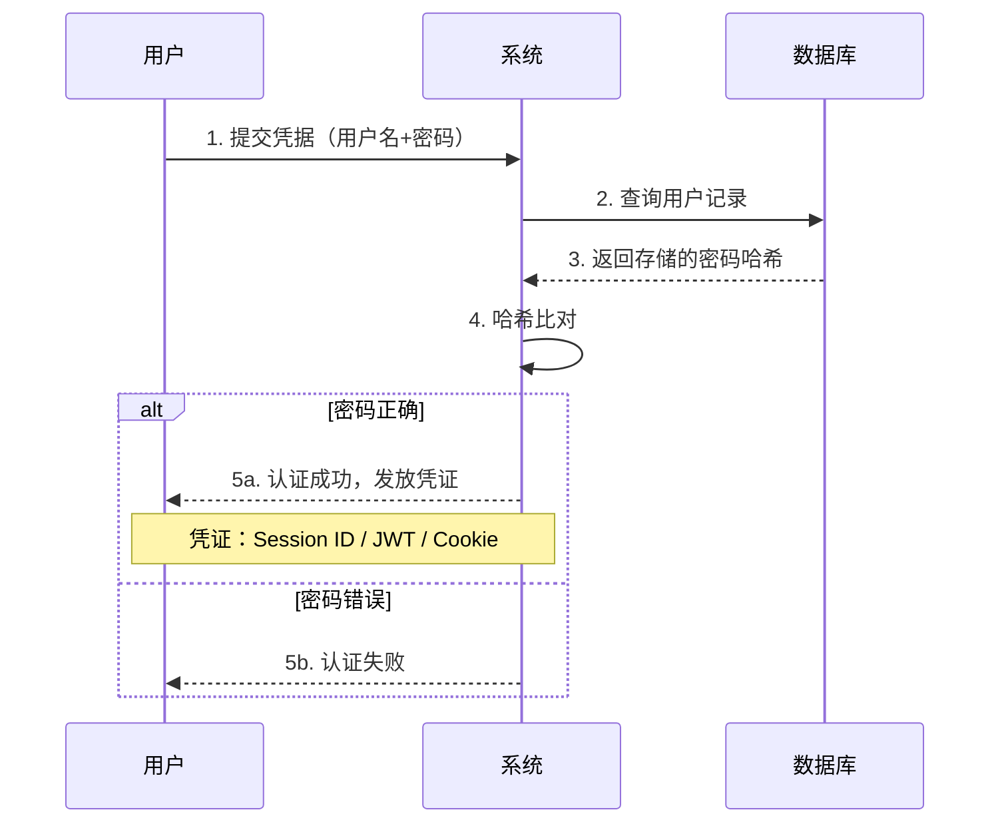
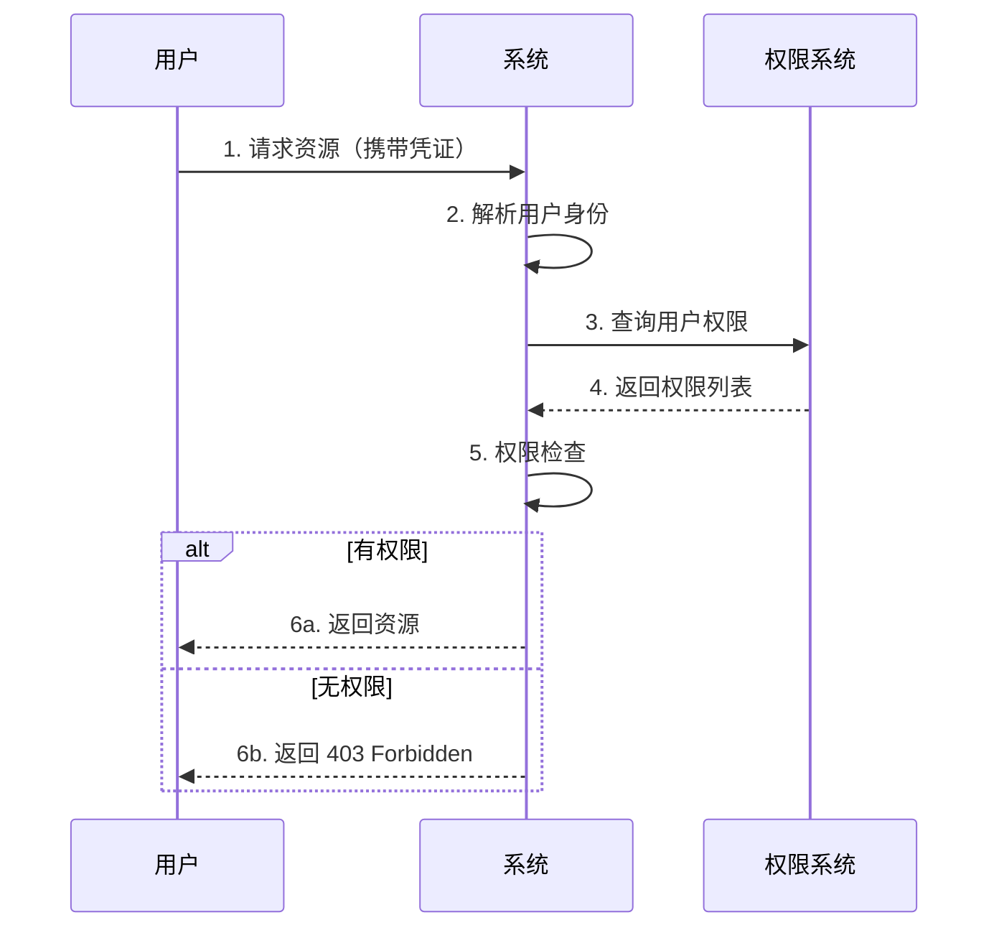
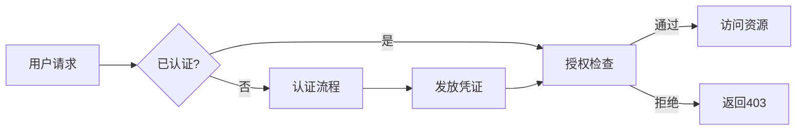
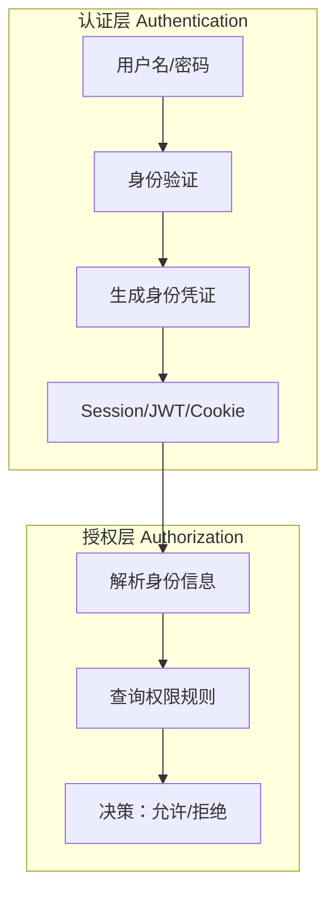
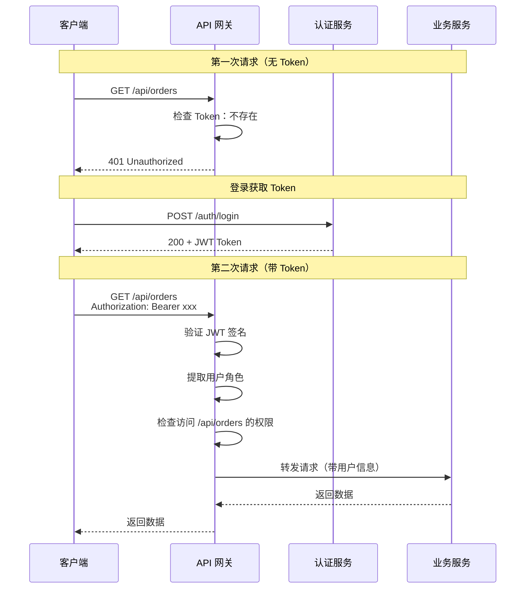
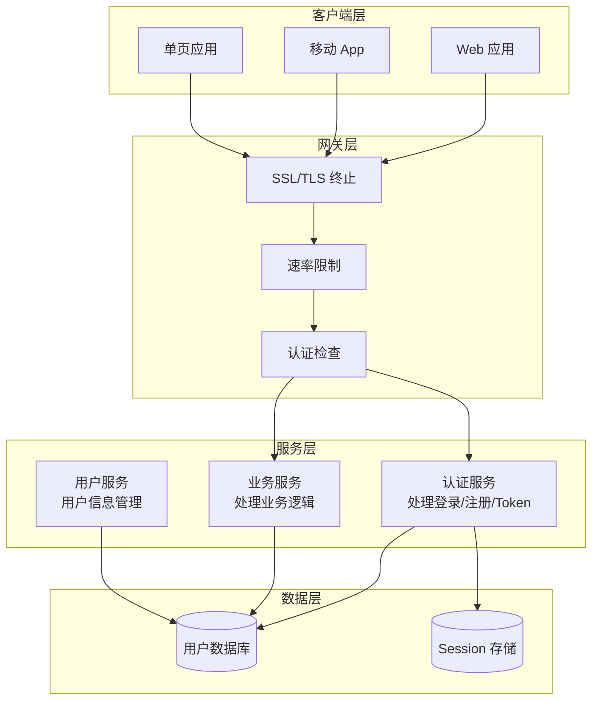

# 认证 vs 授权

## 学习目标

学完本章后，你将能够：

- 准确区分 **认证（Authentication）** 和 **授权（Authorization）** 的概念边界
- 理解两者在整个安全体系中的位置和关系
- 识别实际场景中常见的混淆和错误设计
- 为后续章节的深入实现建立清晰的概念框架

## 一个故事：机场安检

想象你进入一个机场：

1. **在值机柜台**：你出示身份证和机票，工作人员核对你的身份——这是**认证**
2. **在安检口**：你出示登机牌，工作人员检查你是否有权限进入候机区——这是**授权**
3. **在贵宾室门口**：你出示登机牌，工作人员检查你的舱位等级——这也是**授权**

**关键洞察**：

- 认证回答的是"**你是谁？**"
- 授权回答的是"**你能做什么？**"

## 核心概念辨析

### 认证（Authentication）

**定义**：验证用户身份的过程，确认"你声称的身份是否属实"。

**认证因子（Authentication Factors）**

身份验证可以通过三种不同类型的"证据"来完成，这些证据被称为"因子"：

**知识因子（Something You Know）**

- 定义：存储在你记忆中的秘密信息
- 特点：成本低，但容易被猜测、窃取或社会工程学攻击
- 示例：
  - 密码：最常见，但弱密码是安全漏洞的主要来源
  - PIN 码：通常4-6位数字，用于银行卡、手机解锁
  - 安全问题：如"你第一只宠物的名字"（现已不推荐，容易被社工）

**持有因子（Something You Have）**

- 定义：你物理拥有的设备或物品
- 特点：需要实体 possession，增加安全性但可能丢失
- 示例：
  - 手机：接收短信验证码、TOTP（如 Google Authenticator）
  - 硬件密钥：YubiKey、FIDO2 密钥，防钓鱼攻击
  - 智能卡：企业门禁卡、银行 U 盾
  - 恢复码：备用登录码，打印保存

**生物因子（Something You Are）**

- 定义：你身体固有的生物特征
- 特点：无法遗忘，但难以更换（生物特征泄露后无法修改）
- 示例：
  - 指纹：手机解锁、门禁系统（最常见）
  - 人脸识别：iPhone Face ID、机场通关
  - 虹膜扫描：高安全级别场所
  - 声纹识别：电话银行验证

**多因素认证（MFA）**

结合两种或以上因子，大幅提升安全性。例如：

- 密码（知识）+ 手机验证码（持有）= 最常见的 2FA
- 密码（知识）+ YubiKey（持有）+ 指纹（生物）= 高安全级别

**认证流程**：



### 授权（Authorization）

**定义**：决定已认证用户可以访问哪些资源、执行哪些操作的过程。

**授权模型详解**

**RBAC（Role-Based Access Control）- 基于角色的访问控制**

核心思想：权限与角色绑定，用户通过分配角色获得权限。

```
用户 --分配--> 角色 --拥有--> 权限
```

示例场景：

```
角色：admin        拥有权限：user:create, user:delete, order:manage
角色：manager      拥有权限：order:manage, report:view
角色：customer     拥有权限：order:create, order:view:self

用户 Alice → 分配 admin 角色 → 可以删除用户、管理订单
用户 Bob   → 分配 customer 角色 → 只能创建和查看自己的订单
```

优点：

- 直观易懂，与企业组织架构对应
- 批量管理：调整角色权限，所有该角色用户自动生效
- 适合权限相对固定的系统

缺点：

- 角色爆炸：细粒度权限需要大量角色（如"华东区销售经理"）
- 无法表达复杂条件（如"只能查看自己部门的订单"）

**ABAC（Attribute-Based Access Control）- 基于属性的访问控制**

核心思想：权限决策基于用户、资源、环境的属性动态计算。

决策公式：

```
是否允许 = f(用户属性, 资源属性, 环境属性, 操作)
```

示例策略：

```
"允许访问" 当且仅当：
- 用户.department == 资源.所属部门
- 用户.级别 >= 资源.密级
- 环境.时间 在 9:00-18:00 之间
- 用户.状态 == '在职'
```

优点：

- 极度灵活，可表达任意复杂策略
- 动态权限：属性变化立即生效
- 适合多租户 SaaS、数据权限复杂的系统

缺点：

- 设计和调试复杂
- 性能开销大（每次请求都要计算策略）

**ACL（Access Control List）- 访问控制列表**

核心思想：每个资源维护一个列表，记录谁能对它做什么。

示例结构：

```
文件 report.pdf 的 ACL：
- Alice: 读、写、删除
- Bob: 读
- Charlie: 无权限
```

优点：

- 简单直接，资源级别的精确控制
- 适合文件系统、云存储等场景

缺点：

- 用户多时难以管理
- 无法批量查看"某用户有哪些权限"
- 适合资源少、权限简单的场景

**三种模型对比**：

| 维度     | RBAC         | ABAC           | ACL            |
| -------- | ------------ | -------------- | -------------- |
| 管理粒度 | 角色         | 属性规则       | 单个资源       |
| 灵活性   | 中           | 极高           | 低             |
| 复杂度   | 低           | 高             | 低             |
| 适用场景 | 企业系统     | 复杂 SaaS      | 文件存储       |
| 典型代表 | AWS IAM Role | AWS IAM Policy | Linux 文件权限 |

**授权流程**：



## 两者的关系

### 时序关系：先认证，后授权



**关键理解**：

- 没有认证，授权无从谈起（不知道你是谁，怎么决定你能做什么？）
- 认证成功不代表授权成功（你是公司员工，但不代表你能进财务室）

### 数据流关系



## 实际场景对比

### 场景1：Web 应用登录

这是一个典型的单体 Web 应用中的认证和授权流程。

**认证过程详解**：

1. 用户在登录页输入邮箱和密码，点击提交
2. 后端接收请求，从数据库查询该邮箱对应的用户记录
3. 使用相同的哈希算法对用户输入的密码进行哈希
4. 将计算结果与数据库存储的哈希值比对
5. 如果匹配，生成凭证（JWT Token 或创建 Session）
6. 将凭证返回给前端（Token 放入响应体，或 Set-Cookie 头）

**授权过程详解**：

1. 用户访问 `/api/admin/users`（携带凭证）
2. 后端中间件解析凭证，获取当前用户ID
3. 查询该用户拥有的角色/权限
4. 检查是否包含访问 `/api/admin/users` 所需的权限（如 `user:read` 或 `admin` 角色）
5. 如果有权限，执行查询并返回用户列表
6. 如果无权限，返回 403 Forbidden

```
┌─────────────────────────────────────────────────────────────┐
│                         Web 应用                             │
├─────────────────────────────────────────────────────────────┤
│  认证过程：                                                  │
│  1. 用户输入邮箱和密码                                        │
│  2. 后端验证密码哈希                                          │
│  3. 生成 JWT 或创建 Session                                   │
│  4. 返回 Token 或设置 Cookie                                  │
├─────────────────────────────────────────────────────────────┤
│  授权过程：                                                  │
│  1. 用户请求 /api/admin/users                                 │
│  2. 从 JWT/Session 中提取用户ID                               │
│  3. 检查用户是否有 "admin" 角色                               │
│  4. 有权限：返回用户列表；无权限：返回 403                    │
└─────────────────────────────────────────────────────────────┘
```

### 场景2：API 网关

API 网关是微服务架构中的关键组件，负责统一处理认证和基础授权。

**为什么需要 API 网关？**

在微服务架构中，如果每个服务都自己处理认证：

- 重复代码：每个服务都要实现 JWT 验证
- 密钥管理：每个服务都要知道 JWT 密钥
- 难以统一：限流、审计等功能散落在各处

API 网关作为流量入口，统一处理这些横切关注点。

**完整流程解析**：



**网关的具体职责**：

1. **Token 检查**：从 Header 中提取 `Authorization: Bearer xxx`
2. **签名验证**：使用公钥或密钥验证 JWT 签名是否有效
3. **过期检查**：验证 Token 是否在有效期内
4. **用户解析**：从 Token payload 中提取用户ID、角色等
5. **权限检查**：判断用户是否有权访问该路径（粗粒度）
6. **请求转发**：将用户信息添加到请求头，转发给下游服务
7. **响应处理**：统一错误格式、添加安全响应头等

**下游服务的职责**：

网关处理的是"能否访问这个服务"，而服务内部处理"能否访问这个资源"：

```
网关检查：用户是否有访问 /api/orders 的权限（角色级别）
服务检查：用户是否有权查看订单 #12345（资源级别，只能看自己订单）
```

## 常见混淆与误区

### 误区1：把认证当授权

**错误设计**：

```javascript
// ❌ 错误：只要登录了就能访问
app.get('/admin', (req, res) => {
  if (req.user) {
    // 只检查了"是否登录"
    return res.json({ data: 'admin data' });
  }
  res.status(401).send('未登录');
});
```

**正确设计**：

```javascript
// ✅ 正确：检查具体权限
app.get('/admin', requireAuth, requireRole('admin'), (req, res) => {
  res.json({ data: 'admin data' });
});
```

### 误区2：在认证阶段做授权决策

**错误设计**：

```javascript
// ❌ 错误：登录时决定能访问什么
app.post('/login', async (req, res) => {
  const user = await authenticate(req.body);
  if (user) {
    // 错误：在登录时就生成特定资源的访问令牌
    const token = generateToken({
      userId: user.id,
      canAccessOrders: user.role === 'manager', // 授权信息混入认证
      canDeleteUsers: user.role === 'admin',
    });
    res.json({ token });
  }
});
```

**问题分析**：

- 用户权限可能在登录后发生变化
- Token 变得臃肿，包含大量授权细节
- 无法支持动态权限调整

**正确设计**：

```javascript
// ✅ 正确：认证只证明身份
app.post('/login', async (req, res) => {
  const user = await authenticate(req.body);
  if (user) {
    // Token 只包含身份信息
    const token = generateToken({
      userId: user.id,
      username: user.username,
      // 不包含权限信息！
    });
    res.json({ token });
  }
});

// 授权在访问时实时检查
app.get('/orders', requireAuth, async (req, res) => {
  const permissions = await getPermissions(req.user.userId);
  if (permissions.includes('order:read')) {
    return res.json(await getOrders());
  }
  res.status(403).send('无权限');
});
```

### 误区3：混淆 401 和 403

| 状态码               | 含义   | 使用场景                      |
| -------------------- | ------ | ----------------------------- |
| **401 Unauthorized** | 未认证 | 没有提供凭证，或凭证无效/过期 |
| **403 Forbidden**    | 未授权 | 已认证，但没有权限访问该资源  |

**示例**：

```javascript
// 未提供 Token → 401
app.use((req, res, next) => {
  const token = req.headers.authorization;
  if (!token) {
    return res.status(401).json({
      error: '需要提供访问凭证',
    });
  }
  // ...
});

// Token 有效，但权限不足 → 403
app.delete('/users/:id', requireAuth, (req, res) => {
  if (req.user.role !== 'admin') {
    return res.status(403).json({
      error: '需要管理员权限',
    });
  }
  // ...
});
```

**简单记忆**：

- **401**：系统问"你是谁？"（请出示证件）
- **403**：系统说"我知道你是谁，但这不能让你进"

## 认证与授权在系统架构中的位置



**架构要点**：

1. **网关层**：负责 SSL、速率限制、基础认证检查
2. **认证服务**：独立的登录/注册/Token 管理
3. **业务服务**：专注于授权决策和业务逻辑

## 本章小结

**核心要点**：

1. **认证** = 证明"你是谁"（Identity）
   - 输入：凭据（密码、Token等）
   - 输出：身份凭证（Session/JWT）
   - 三种因子：知识因子、持有因子、生物因子

2. **授权** = 决定"你能做什么"（Permission）
   - 输入：身份凭证 + 请求资源
   - 输出：允许/拒绝
   - 三种模型：RBAC、ABAC、ACL

3. **关系**：先认证，后授权；认证是授权的前提

4. **HTTP 状态码**：
   - 401 = 未认证（请出示证件）
   - 403 = 未授权（知道你是谁，但不让你进）

**下章预告**：

在深入实现之前，我们需要先理解**密码安全**的基础知识。为什么直接存储密码是危险的？什么是哈希和盐值？Bcrypt 和 Argon2 有什么区别？这些知识将直接影响你设计用户注册/登录系统的方式。

## 踩坑记录

### 坑1：认为"登录了就能访问"

**症状**：系统只检查用户是否登录，不检查具体权限。

**后果**：普通用户通过猜测 URL 访问管理员功能。

**对策**：每个受保护端点都要显式声明所需权限。

### 坑2：在 JWT 中塞入过多权限信息

**症状**：JWT payload 中包含详细的权限列表（`permissions: ['read', 'write', 'delete']`）。

**后果**：

- Token 体积膨胀
- 权限变更后 Token 无法即时失效（除非加入黑名单）
- 违反"认证信息 vs 授权信息"分离原则

**对策**：JWT 只存身份信息，权限实时查询或使用专门的服务。

### 坑3：混淆 401 和 403 的使用场景

**症状**：

- 没登录返回 403
- 权限不足返回 401

**后果**：API 使用者困惑，客户端处理逻辑混乱。

**解释**：

- **401 Unauthorized**：字面意思是"未授权"，但在 HTTP 规范中表示"未认证"。这是因为早期规范命名不够准确，现在已成为约定俗成。
- **403 Forbidden**：明确表示服务器理解请求，但拒绝执行。

### 坑4：认为"认证服务 = 用户服务"

**症状**：把所有用户相关功能（注册、登录、资料修改、权限管理）塞到一个服务里。

**后果**：

- 认证逻辑和业务逻辑耦合
- 认证服务成为性能瓶颈
- 难以独立扩展

**对策**：

- 认证服务：只负责"证明你是谁"（登录/注册/Token 管理）
- 用户服务：负责"你是谁的信息"（资料、偏好设置等）

## 动手练习

### 练习1：识别场景

判断以下场景属于**认证**还是**授权**：

1. 用户输入账号密码点击登录
2. 系统检查用户是否是 VIP 会员
3. 门禁系统读取员工工卡
4. 论坛检查用户是否有发帖权限
5. 银行 App 要求输入指纹

<details>
<summary>点击查看答案</summary>

1. **认证** - 验证身份
2. **授权** - 检查权限（VIP 是一种权限属性）
3. **认证** - 验证持卡者身份
4. **授权** - 检查操作权限
5. **认证** - 生物特征验证身份

</details>

### 练习2：设计判断

假设你在设计一个博客系统，以下设计是否合理？为什么？

**设计A**：用户登录后，后端返回一个包含用户所有权限的 JWT，前端根据这个 JWT 决定显示哪些菜单。

**设计B**：每次访问管理后台 API 时，后端都查询数据库检查用户是否有管理员权限。

<details>
<summary>点击查看分析</summary>

**设计A分析**：

- 优点：前端渲染快，减少请求
- 缺点：
  - 权限变更后用户需重新登录才能生效
  - JWT 体积随权限数量增长
  - 敏感权限信息暴露在客户端
- 改进：前端可缓存权限，但需要设置合理的过期时间

**设计B分析**：

- 优点：权限实时生效，安全性高
- 缺点：每次请求都查数据库，性能开销大
- 改进：权限缓存（Redis）+ 变更时主动失效

**结论**：两者结合——JWT 存基础身份信息，权限可以缓存但要有失效机制。

</details>
