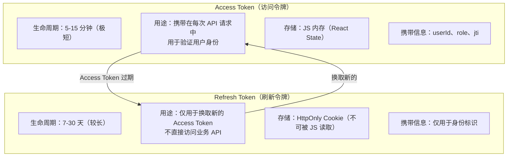
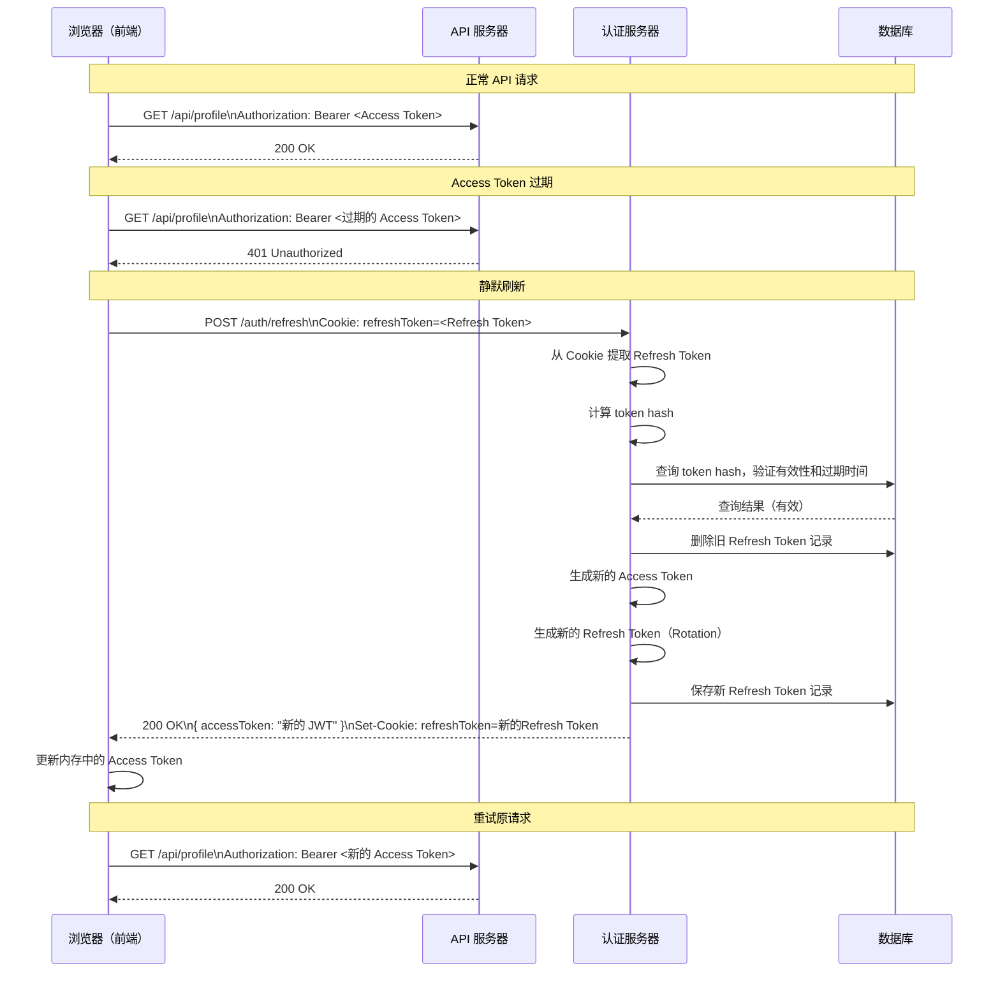
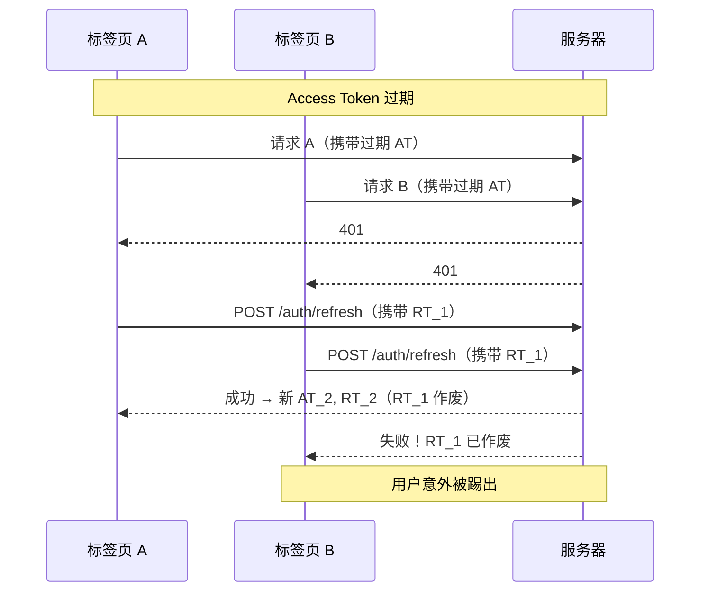
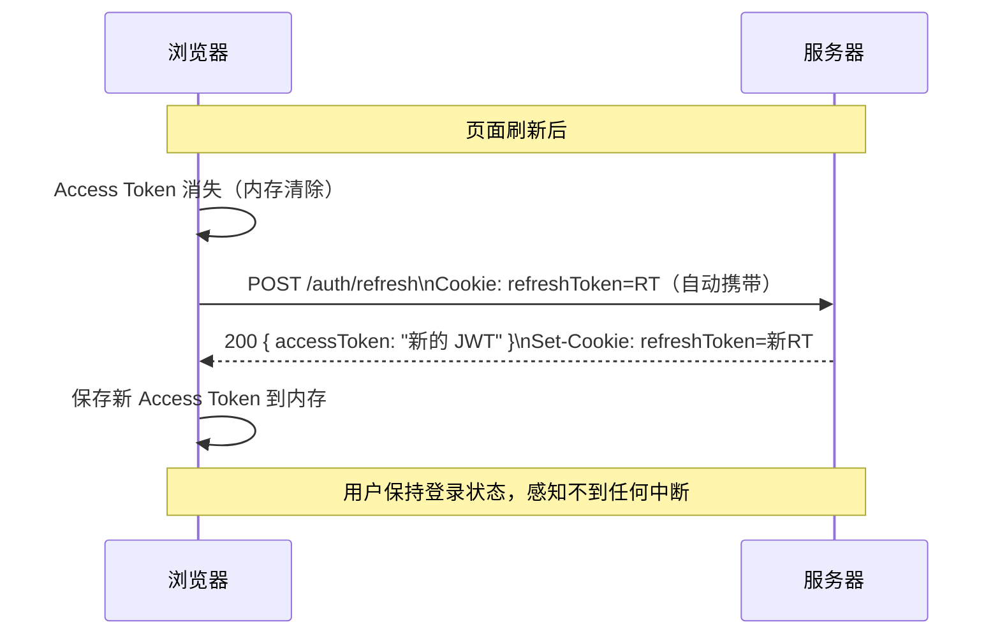

# 双令牌策略

## 本篇导读

### 核心目标

学完本篇后，你将能够：

- 理解双令牌策略（Access Token + Refresh Token）的设计动机，以及它如何在"无状态"和"可控性"之间取得平衡
- 掌握 Access Token 和 Refresh Token 各自的职责、生命周期和存储方式
- 设计并实现完整的 Token 刷新流程，包括刷新端点的安全保护
- 识别并解决并发刷新（多个请求同时触发刷新）带来的竞态问题
- 实现 Refresh Token 轮换（Rotation）策略，防止令牌重放攻击

### 重点与难点

**重点**：

- Access Token 存在 JS 内存中，Refresh Token 存在 HttpOnly Cookie 中——这个分工的安全依据
- Refresh Token 应该存在数据库还是 Redis？两种方案的权衡
- Token 刷新时，旧 Access Token 应该如何处理？

**难点**：

- 并发刷新竞态问题：多个并发请求都收到 401，都同时尝试刷新 Token，如何保证只有一次刷新成功
- Refresh Token Rotation：每次刷新后旧 Refresh Token 失效，如何防止网络抖动导致的合法用户失效
- 页面刷新后内存中的 Access Token 消失，如何实现"静默续期"（用 Refresh Token 重获 Access Token）

## 为什么需要双令牌？

理解双令牌策略，必须先理解它要解决的根本矛盾。

### 单 Token 的两难困境

在上一篇，我们了解了 JWT 的核心特性：**无状态**。服务器不存储任何 Token 相关的状态，只要签名有效且未过期，Token 就被接受。

这带来了一个根本性的矛盾：

**如果 Token 过期时间很长（如 7 天）**：

- 用户体验好，不需要频繁登录
- 但一旦 Token 泄露，攻击者可以在 7 天内随意使用
- 用户修改密码后，旧 Token 依然有效长达 7 天
- 必须实现完整的黑名单机制才能撤销，这几乎让 JWT 的"无状态"优势消失

**如果 Token 过期时间很短（如 15 分钟）**：

- 泄露后的有效窗口很短，安全性高
- 但用户需要每 15 分钟重新登录一次，体验极差
- 需要频繁输入密码，用户根本无法接受

单个 Token 无法同时满足"长期有效（体验好）"和"短期有效（安全）"这两个矛盾需求。

### 用两个 Token 解决这个矛盾

双令牌策略（Dual Token Strategy）引入两个职责不同的令牌：



**核心思路**：

- Access Token 短命（15 分钟），即使泄露危害极小，且不需要服务端维护黑名单
- Refresh Token 长命（7-30 天），但只存在 HttpOnly Cookie 中（JS 无法读取），且每次使用后会被轮换（旧的立即失效）
- 用户正常使用时，Access Token 过期后通过 Refresh Token 静默换取新的，用户无感知

这样，用户"感知上"是长期登录的（Refresh Token 7天有效），但每个 Access Token 只有 15 分钟的有效期，安全窗口极短。

## 双令牌的职责与存储

### Access Token 的设计

**职责**：携带在每个业务 API 请求的 Authorization Header 中，由 API 服务器验证用户身份。

**生命周期**：5-15 分钟。偏短的过期时间意味着：

- 即使 Token 被中间人截获，攻击者的利用窗口极短
- 不需要实现黑名单（Token 很快就会自然失效）
- 权限变更（如角色升降级）会在下次刷新时生效，延迟最多 15 分钟

**存储位置：JS 内存**

Access Token 推荐存储在 JavaScript 变量或框架状态（如 React useState）中，而不是 localStorage 或 Cookie：

```typescript
// 在 React 应用中存储 Access Token（伪代码）
const [accessToken, setAccessToken] = useState<string | null>(null);

// 登录成功后
const { accessToken } = await login(email, password);
setAccessToken(accessToken);

// 发起 API 请求时
const response = await fetch('/api/profile', {
  headers: { Authorization: `Bearer ${accessToken}` },
});
```

存在内存中的优势：

- **防 XSS 窃取**：内存变量不像 localStorage 那样可以被全域 JavaScript 访问（跨 context 访问会被隔离）
- **自动清理**：页面刷新或标签页关闭后自动清除，不会在设备上留下持久化的 Token
- **符合最小存活原则**：只在需要时存在，用完即走

存在内存中的代价：页面刷新后 Access Token 消失，需要向后端发起一次静默刷新请求，用 Refresh Token 换取新的 Access Token。这个过程对用户应该是无感知的。

**格式**：标准 JWT，携带 `sub`（用户 ID）、`role`、`jti`（用于可选的黑名单）、`exp`、`iss` 等声明。

### Refresh Token 的设计

**职责**：只用于向 `/auth/refresh` 端点换取新的 Access Token，不能用于访问任何业务 API。

**生命周期**：7-30 天（根据业务安全需求调整）。

**存储位置：HttpOnly Cookie**

Refresh Token 必须存在 HttpOnly Cookie 中：

```typescript
// 服务端下发 Refresh Token
res.cookie('refreshToken', token, {
  httpOnly: true, // JavaScript 无法读取
  secure: true, // 只通过 HTTPS 发送
  sameSite: 'strict', // 严格 SameSite（刷新端点只需同站请求）
  path: '/auth/refresh', // 只在刷新端点携带，减少暴露范围
  maxAge: 7 * 24 * 60 * 60 * 1000, // 7 天（毫秒）
});
```

关键配置解释：

- `httpOnly: true`：即使页面存在 XSS 漏洞，攻击者的脚本也无法读取 Refresh Token
- `path: '/auth/refresh'`：浏览器只在访问 `/auth/refresh` 路径时自动携带这个 Cookie，减少 Refresh Token 暴露在其他请求中的机会
- `sameSite: 'strict'`：因为刷新端点只需要同站请求（前端代码主动调用），`Strict` 足以防止 CSRF，且防护比 `Lax` 更严格

**格式**：可以是随机字符串（存数据库）或特殊签名的 JWT，后文会详细比较两种方案。

### 两种 Token 的完整对比

| 维度           | Access Token         | Refresh Token                |
| -------------- | -------------------- | ---------------------------- |
| 生命周期       | 5-15 分钟            | 7-30 天                      |
| 存储位置       | JS 内存              | HttpOnly Cookie              |
| 携带方式       | Authorization Header | Cookie（自动携带）           |
| 用途           | 访问所有业务 API     | 只用于换取新 Access Token    |
| 格式           | JWT（含用户信息）    | 随机字符串 或 JWT            |
| 服务端存储需求 | 无（验证签名即可）   | 需要存 DB/Redis 校验有效性   |
| 可撤销性       | 不易撤销（短命即可） | 可以撤销（直接删除 DB 记录） |

## Refresh Token 的存储方案

Refresh Token 与 Access Token 最大的不同：**服务端需要"记住"有效的 Refresh Token**，以便验证请求的 Refresh Token 是否合法。这引入了有状态性，也涉及具体的存储方案选择。

### 方案 A：数据库存储（推荐）

在数据库中为每个有效的 Refresh Token 记录一行：

```typescript
// Drizzle ORM Schema 示例
import { pgTable, text, timestamp, uuid, boolean } from 'drizzle-orm/pg-core';
import { users } from './users';

export const refreshTokens = pgTable('refresh_tokens', {
  id: uuid('id').primaryKey().defaultRandom(),
  userId: uuid('user_id')
    .notNull()
    .references(() => users.id, { onDelete: 'cascade' }),
  // 存储 Token 的哈希值，而不是明文（如果 DB 泄露，Token 依然不可用）
  tokenHash: text('token_hash').notNull().unique(),
  // 设备/客户端标识，用于多设备管理
  userAgent: text('user_agent'),
  ipAddress: text('ip_address'),
  expiresAt: timestamp('expires_at', { withTimezone: true }).notNull(),
  // Rotation 用：记录上一代 token hash，防止重放攻击
  previousTokenHash: text('previous_token_hash'),
  createdAt: timestamp('created_at', { withTimezone: true })
    .defaultNow()
    .notNull(),
  updatedAt: timestamp('updated_at', { withTimezone: true })
    .defaultNow()
    .notNull(),
});
```

**优点**：

- 可以精确查看有多少活跃会话，以及每个会话的来源（设备、IP）
- 支持用户主动管理：登出单个设备、查看登录历史、踢出所有设备
- 数据持久化，服务重启后 Refresh Token 依然有效

**缺点**：

- 刷新操作需要查询数据库（相比 Redis 稍慢）
- 需要维护过期数据的清理（定时任务删除过期记录）

**安全措施**：存储 Refresh Token 的 **SHA-256 哈希值**而不是明文。即使数据库泄露，攻击者拿到哈希值也无法直接使用（因为验证时需要从 Cookie 中获取原始 Token，再计算哈希对比）。

```typescript
import { createHash } from 'node:crypto';

function hashToken(token: string): string {
  return createHash('sha256').update(token).digest('hex');
}
```

### 方案 B：Redis 存储

将 Refresh Token（或其哈希）存入 Redis，利用 TTL 自动清理过期记录：

```typescript
// Redis key 设计
// rt:{userId}:{tokenId}  →  token hash（TTL = 过期时间）
const key = `rt:${userId}:${tokenId}`;
await redisClient.set(key, hashToken(refreshToken), { EX: 7 * 24 * 60 * 60 });
```

**优点**：

- 读取速度快（内存数据库），TTL 自动清理无需手动管理
- 适合高并发刷新场景

**缺点**：

- Redis 数据默认非持久化（需要配置 AOF/RDB）
- 缺乏结构化，难以实现"查看设备列表"等功能
- 需要额外的机制支持"踢出所有设备"（扫描 Key 前缀性能差）

### 方案选择建议

对于本教程构建的认证服务，推荐**数据库方案**：功能更完整，为后续的"多设备管理"、"登录历史"功能做好基础。刷新操作的频率远低于 API 请求（通常每 15 分钟一次），数据库查询的延迟可以接受。

## 完整刷新流程设计



### 刷新端点实现

#### 数据访问层

```typescript
// src/auth/refresh-token.repository.ts
import { Injectable, Inject } from '@nestjs/common';
import { NodePgDatabase } from 'drizzle-orm/node-postgres';
import { eq, and, gt } from 'drizzle-orm';
import { createHash } from 'node:crypto';
import * as schema from '../db/schema';
import { DB_CLIENT } from '../db/db.provider';

@Injectable()
export class RefreshTokenRepository {
  constructor(
    @Inject(DB_CLIENT)
    private readonly db: NodePgDatabase<typeof schema>
  ) {}

  private hashToken(token: string): string {
    return createHash('sha256').update(token).digest('hex');
  }

  async save(params: {
    userId: string;
    token: string;
    userAgent?: string;
    ipAddress?: string;
    expiresAt: Date;
  }): Promise<void> {
    await this.db.insert(schema.refreshTokens).values({
      userId: params.userId,
      tokenHash: this.hashToken(params.token),
      userAgent: params.userAgent,
      ipAddress: params.ipAddress,
      expiresAt: params.expiresAt,
    });
  }

  /**
   * 查找有效的 Refresh Token 记录
   * 同时验证：哈希匹配 + 未过期
   */
  async findValid(
    token: string
  ): Promise<typeof schema.refreshTokens.$inferSelect | null> {
    const tokenHash = this.hashToken(token);
    const now = new Date();

    const rows = await this.db
      .select()
      .from(schema.refreshTokens)
      .where(
        and(
          eq(schema.refreshTokens.tokenHash, tokenHash),
          gt(schema.refreshTokens.expiresAt, now)
        )
      )
      .limit(1);

    return rows[0] ?? null;
  }

  async deleteByHash(token: string): Promise<void> {
    const tokenHash = this.hashToken(token);
    await this.db
      .delete(schema.refreshTokens)
      .where(eq(schema.refreshTokens.tokenHash, tokenHash));
  }

  /**
   * 删除用户所有 Refresh Token（踢出所有设备）
   */
  async deleteAllByUserId(userId: string): Promise<void> {
    await this.db
      .delete(schema.refreshTokens)
      .where(eq(schema.refreshTokens.userId, userId));
  }
}
```

#### Service 层

```typescript
// src/auth/auth.service.ts（刷新相关部分）
import { Injectable, UnauthorizedException } from '@nestjs/common';
import { randomBytes } from 'node:crypto';
import { ConfigService } from '@nestjs/config';
import { RefreshTokenRepository } from './refresh-token.repository';
import { TokenService } from './token.service';
import { UsersService } from '../users/users.service';

@Injectable()
export class AuthService {
  constructor(
    private readonly refreshTokenRepo: RefreshTokenRepository,
    private readonly tokenService: TokenService,
    private readonly usersService: UsersService,
    private readonly config: ConfigService
  ) {}

  /**
   * 生成安全的随机 Refresh Token
   * 使用 crypto.randomBytes 而不是 UUID（熵更高）
   */
  private generateRefreshToken(): string {
    return randomBytes(40).toString('base64url');
    // 40 字节 = 320 位随机熵，base64url 编码后约 54 字符
  }

  /**
   * 登录成功后颁发双令牌
   */
  async issueTokens(
    userId: string,
    userAgent?: string,
    ipAddress?: string
  ): Promise<{ accessToken: string; refreshToken: string }> {
    const user = await this.usersService.findById(userId);
    if (!user) throw new UnauthorizedException();

    // 生成 Access Token（JWT）
    const accessToken = await this.tokenService.generateAccessToken(
      user.id,
      user.email,
      user.role
    );

    // 生成 Refresh Token（随机字节）
    const refreshToken = this.generateRefreshToken();

    // 计算 Refresh Token 过期时间
    const refreshTokenTtlDays = this.config.get<number>(
      'REFRESH_TOKEN_TTL_DAYS',
      7
    );
    const expiresAt = new Date();
    expiresAt.setDate(expiresAt.getDate() + refreshTokenTtlDays);

    // 存入数据库
    await this.refreshTokenRepo.save({
      userId,
      token: refreshToken,
      userAgent,
      ipAddress,
      expiresAt,
    });

    return { accessToken, refreshToken };
  }

  /**
   * 用 Refresh Token 换取新的双令牌（Token Rotation）
   */
  async refreshTokens(
    oldRefreshToken: string,
    userAgent?: string,
    ipAddress?: string
  ): Promise<{ accessToken: string; refreshToken: string }> {
    // 1. 查找并验证旧的 Refresh Token
    const tokenRecord = await this.refreshTokenRepo.findValid(oldRefreshToken);

    if (!tokenRecord) {
      // Token 不存在或已过期
      throw new UnauthorizedException('Invalid or expired refresh token');
    }

    // 2. 立即删除旧 Refresh Token（Rotation 的关键：防止重放）
    await this.refreshTokenRepo.deleteByHash(oldRefreshToken);

    // 3. 颁发新的双令牌
    return this.issueTokens(tokenRecord.userId, userAgent, ipAddress);
  }
}
```

#### Controller 层

```typescript
// src/auth/auth.controller.ts（刷新端点部分）
import {
  Controller,
  Post,
  Req,
  Res,
  UnauthorizedException,
  UseGuards,
} from '@nestjs/common';
import { Request, Response } from 'express';
import { AuthService } from './auth.service';
import { ConfigService } from '@nestjs/config';

@Controller('auth')
export class AuthController {
  constructor(
    private readonly authService: AuthService,
    private readonly config: ConfigService
  ) {}

  @Post('refresh')
  async refresh(
    @Req() req: Request,
    @Res({ passthrough: true }) res: Response
  ) {
    // 从 HttpOnly Cookie 中读取 Refresh Token
    const refreshToken = req.cookies['refreshToken'] as string | undefined;

    if (!refreshToken) {
      throw new UnauthorizedException('Refresh token not found');
    }

    const userAgent = req.headers['user-agent'];
    const ipAddress = req.ip;

    // 执行 Token Rotation：旧 Token 换新双令牌
    const { accessToken, refreshToken: newRefreshToken } =
      await this.authService.refreshTokens(refreshToken, userAgent, ipAddress);

    // 设置新的 Refresh Token Cookie
    const ttlDays = this.config.get<number>('REFRESH_TOKEN_TTL_DAYS', 7);
    res.cookie('refreshToken', newRefreshToken, {
      httpOnly: true,
      secure: process.env.NODE_ENV === 'production',
      sameSite: 'strict',
      path: '/auth/refresh', // 只在刷新端点发送
      maxAge: ttlDays * 24 * 60 * 60 * 1000,
    });

    // Access Token 通过 JSON 响应体返回（由前端存入内存）
    return { accessToken };
  }

  @Post('logout')
  async logout(@Req() req: Request, @Res({ passthrough: true }) res: Response) {
    const refreshToken = req.cookies['refreshToken'] as string | undefined;

    if (refreshToken) {
      // 从数据库删除 Refresh Token 记录
      await this.authService.revokeRefreshToken(refreshToken);
    }

    // 清除 Cookie
    res.clearCookie('refreshToken', { path: '/auth/refresh' });

    return { message: 'Logged out successfully' };
  }
}
```

## Refresh Token Rotation（令牌轮换）

上面的实现中，每次调用 `/auth/refresh` 都会：

1. 验证旧 Refresh Token
2. 立即删除旧 Refresh Token
3. 生成并返回新的 Refresh Token

这种"每次使用后废弃"的机制叫做 **Refresh Token Rotation**。

### 为什么需要 Rotation？

假设没有 Rotation，Refresh Token 可以无限次使用：

```plaintext
攻击者偷到了用户的 Refresh Token

攻击者：POST /auth/refresh  → 拿到新 Access Token ✅
用户：  POST /auth/refresh  → 拿到新 Access Token ✅（因为旧 Token 还有效）

攻击者和用户都能无限续期，服务器完全无法感知令牌泄露。
```

有了 Rotation 后：

```plaintext
攻击者偷到了用户的 Refresh Token

攻击者先调用：
攻击者：POST /auth/refresh  → 使用原始 Token RT_1
         → 返回 rt2（新 Token），RT_1 被删除

用户后来调用：
用户：  POST /auth/refresh  → 使用原始 Token RT_1（已被删除！）
         → 404/Invalid，刷新失败
用户发现自己被踢出，知道账号可能被盗
```

Rotation 使得同一个 Refresh Token 只能被使用一次，任何重放攻击都会被检测到。

### Rotation 的竞态问题

然而，Rotation 引入了一个新问题：如果用户的网络不稳定，刷新请求超时，用户重试时新的 Token 还没有送达，但旧的 Token 已经被删除——用户会被意外踢出。

更常见的场景是：前端打开了多个标签页，多个标签页同时检测到 Access Token 过期，争先恐后地调用刷新端点：

```plaintext
标签页 A：POST /auth/refresh（携带 RT_1）
标签页 B：POST /auth/refresh（携带 RT_1）  ← 同时发出

标签页 A：成功，RT_1 → RT_2（RT_1 被删除）
标签页 B：失败，RT_1 已删除，被当作令牌重放对待，用户被踢出
```

一种优雅的解决方案是**允许在极短时间窗口内的重用（Grace Period）**：

```typescript
// 在 Refresh Token 记录中增加一个"宽限期"字段
export const refreshTokens = pgTable('refresh_tokens', {
  // ...其他字段
  replacedAt: timestamp('replaced_at', { withTimezone: true }), // 被替换的时间
  replacementTokenHash: text('replacement_token_hash'), // 替换成的新 Token hash
});
```

当旧 Token 被使用后，不是立即物理删除，而是标记为"已替换"，并记录替换时间。在宽限期内（如 30 秒），如果再次收到同一个旧 Token 的请求，服务器可以：

1. 识别这是一次"重复的合法刷新请求"（在宽限期内，且关联的新 Token 存在）
2. 返回已经生成的新 Token，而不是报错

30 秒后，旧 Token 记录被清理，任何重用都会被拒绝。

## 并发刷新的竞态问题

让我们更系统地看并发刷新问题。这是双令牌策略中最复杂，也最容易被忽视的问题。

### 问题场景



### 解法一：前端加锁（推荐）

在前端维护一个"刷新锁"，保证同一时间只有一个刷新请求在进行：

```typescript
// src/api/tokenRefresher.ts

let isRefreshing = false;
// 等待刷新完成的队列
let refreshSubscribers: Array<(token: string) => void> = [];

function subscribeToRefresh(callback: (token: string) => void) {
  refreshSubscribers.push(callback);
}

function notifySubscribers(newToken: string) {
  refreshSubscribers.forEach((cb) => cb(newToken));
  refreshSubscribers = [];
}

let accessToken: string | null = null;

async function refreshAccessToken(): Promise<string> {
  const response = await fetch('/auth/refresh', {
    method: 'POST',
    credentials: 'include',
  });
  if (!response.ok) throw new Error('Refresh failed');
  const { accessToken: newToken } = await response.json();
  return newToken;
}

// axios 拦截器中使用
axiosInstance.interceptors.response.use(
  (response) => response,
  (error) => {
    const originalRequest = error.config;

    if (error.response?.status !== 401 || originalRequest._retry) {
      return Promise.reject(error);
    }

    if (isRefreshing) {
      // 已有刷新在进行，加入等待队列
      return new Promise((resolve) => {
        subscribeToRefresh((token) => {
          originalRequest.headers.Authorization = `Bearer ${token}`;
          resolve(axiosInstance(originalRequest));
        });
      });
    }

    // 成为"刷新发起者"
    isRefreshing = true;
    originalRequest._retry = true;

    return refreshAccessToken()
      .then((newToken) => {
        accessToken = newToken;
        notifySubscribers(newToken); // 通知所有等待者
        originalRequest.headers.Authorization = `Bearer ${newToken}`;
        return axiosInstance(originalRequest);
      })
      .catch((err) => {
        // 刷新失败，跳转登录页
        window.location.href = '/login';
        return Promise.reject(err);
      })
      .finally(() => {
        isRefreshing = false;
      });
  }
);
```

**工作原理**：

1. 第一个收到 401 的请求成为"刷新发起者"，设置 `isRefreshing = true`，开始刷新
2. 后续收到 401 的请求发现 `isRefreshing = true`，进入等待队列
3. 刷新成功后，`notifySubscribers` 通知所有等待者，它们用新的 Access Token 重试原请求
4. 整个过程中，服务器只收到一次 `/auth/refresh` 请求

### 解法二：服务端幂等（兜底）

前端锁虽然有效，但不是100%可靠（网络分区、多浏览器实例等场景可能失效）。服务端可以用 Redis 实现分布式锁，保证每个 Refresh Token 在极短时间内只被处理一次：

```typescript
// src/auth/auth.service.ts（幂等刷新）
async refreshTokensIdempotent(oldRefreshToken: string): Promise<{ accessToken: string; refreshToken: string }> {
  const lockKey = `refresh-lock:${createHash('sha256').update(oldRefreshToken).digest('hex').slice(0, 16)}`;

  // 尝试获取分布式锁（10 秒 TTL，防止死锁）
  const acquired = await this.redisClient.set(lockKey, '1', { NX: true, EX: 10 });
  if (!acquired) {
    // 锁被占用，等待 100ms 后重试（简单退避）
    await new Promise((resolve) => setTimeout(resolve, 100));
    // 检查是否已有新 Token 可用（幂等结果）
    // ... 实际实现中可以返回缓存的新 Token
    throw new UnauthorizedException('Concurrent refresh detected, please retry');
  }

  try {
    return await this.refreshTokens(oldRefreshToken);
  } finally {
    await this.redisClient.del(lockKey);
  }
}
```

## 页面刷新后的"静默续期"

页面刷新后，内存中的 Access Token 消失。这时需要"静默续期"：用 Cookie 中的 Refresh Token 换取新的 Access Token，整个过程对用户无感知。



在 React 应用中，这通常在根组件挂载时执行：

```typescript
// src/hooks/useAuth.ts
import { useEffect, useState } from 'react';

export function useAuth() {
  const [accessToken, setAccessToken] = useState<string | null>(null);
  const [isLoading, setIsLoading] = useState(true);

  useEffect(() => {
    // 应用启动时尝试静默续期
    silentRefresh()
      .then((token) => setAccessToken(token))
      .catch(() => setAccessToken(null)) // 刷新失败 = 未登录
      .finally(() => setIsLoading(false));
  }, []);

  return { accessToken, setAccessToken, isLoading };
}

async function silentRefresh(): Promise<string> {
  const response = await fetch('/auth/refresh', {
    method: 'POST',
    credentials: 'include', // 携带 Cookie
  });
  if (!response.ok) throw new Error('Not authenticated');
  const { accessToken } = await response.json();
  return accessToken;
}
```

## 常见问题与解决方案

### 问题一：用户在多个设备上登录，如何分别管理？

**方案**：每次登录时记录设备信息（User-Agent、IP），并为每个 Refresh Token 记录绑定一个 `sessionId`。用户可以在设置页面查看所有活跃会话并单独注销。

```typescript
// 登出单个设备
async revokeSession(userId: string, sessionId: string): Promise<void> {
  await this.db
    .delete(schema.refreshTokens)
    .where(
      and(
        eq(schema.refreshTokens.userId, userId),
        eq(schema.refreshTokens.id, sessionId)
      )
    );
}

// 登出所有设备
async revokeAllSessions(userId: string): Promise<void> {
  await this.refreshTokenRepo.deleteAllByUserId(userId);
}
```

### 问题二：Refresh Token 泄露了怎么办？

**场景**：用户发现有可疑的登录记录，可能 Refresh Token 被盗。

**应对措施**：

1. 用户点击"退出所有设备"，立即删除数据库中该用户的所有 Refresh Token 记录
2. 可选：将用户的所有当前活跃 Access Token 加入黑名单（见下一篇：JWT 黑名单）
3. 通知用户修改密码

### 问题三：Refresh Token 过期了，用户需要重新登录吗？

**是的**，这是设计预期。Refresh Token 过期意味着用户超过了设定的登录有效期（如 7 天没有活动）。这时需要重新输入密码。

在实现"记住我"功能时，可以提供两种 Refresh Token 有效期：

- 普通登录：7 天
- 勾选"记住我"：30 天

### 问题四：如何检测 Refresh Token 被重放（攻击检测）？

如果检测到同一个旧 Refresh Token 被使用了两次（已经 Rotation 过了再次收到），这可能意味着令牌泄露：

```typescript
// 在 refreshTokens 方法中
const tokenRecord = await this.refreshTokenRepo.findValid(oldRefreshToken);

if (!tokenRecord) {
  // Token 不存在，检查它是否是一个已经被轮换过的旧 Token
  const usedRecord = await this.refreshTokenRepo.findUsed(oldRefreshToken);
  if (usedRecord) {
    // 检测到已使用的 Refresh Token 被重放！
    // 立即吊销该用户的所有会话（因为可能意味着令牌泄露）
    await this.refreshTokenRepo.deleteAllByUserId(usedRecord.userId);
    // 记录安全日志
    this.logger.warn(
      `Refresh token reuse detected for user ${usedRecord.userId}`
    );
  }
  throw new UnauthorizedException('Invalid refresh token');
}
```

## 本篇小结

双令牌策略是 JWT 认证系统在"无状态性"和"安全可控性"之间取得平衡的核心设计：

**职责分工**：Access Token 短命（5-15 分钟），用于访问业务 API，存于 JS 内存；Refresh Token 长命（7-30 天），仅用于换取新 Access Token，存于 HttpOnly Cookie。

**Refresh Token 存储**：推荐存数据库（PostgreSQL），存储 SHA-256 哈希值而非明文，支持多设备管理和精细的吊销控制。

**Token Rotation**：每次使用 Refresh Token 后立即将其废弃，颁发全新的 Refresh Token。这使得令牌重放攻击立即可检测，同时通过宽限期机制避免正常网络抖动误伤合法用户。

**并发刷新**：前端使用"刷新锁 + 订阅者队列"模式，保证多个并发 401 只触发一次刷新请求。服务端可配合分布式锁作为兜底防护。

**静默续期**：页面加载时先用 Refresh Token 获取新的 Access Token，整个过程对用户无感知，实现"永久在线"的用户体验。

下一篇，我们将深入 **JWT 黑名单**机制——在某些场景下（密码修改、账号封禁），我们需要在 Access Token 过期之前主动撤销它。Redis 黑名单和布隆过滤器如何配合，让我们在最小性能开销下实现按需吊销。
