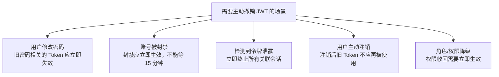
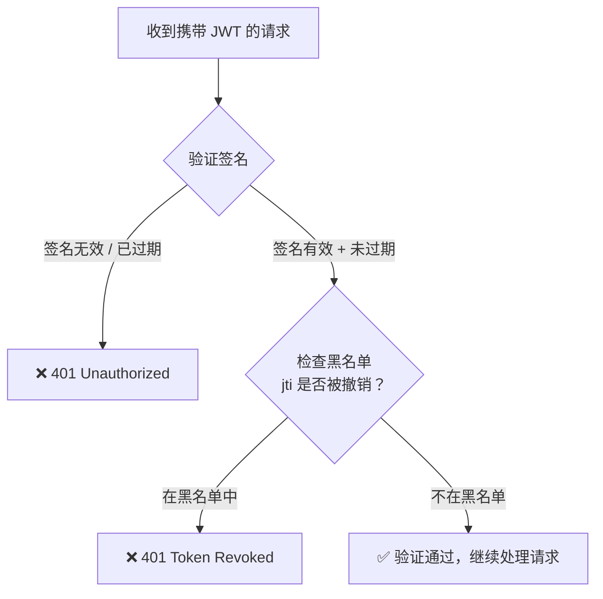
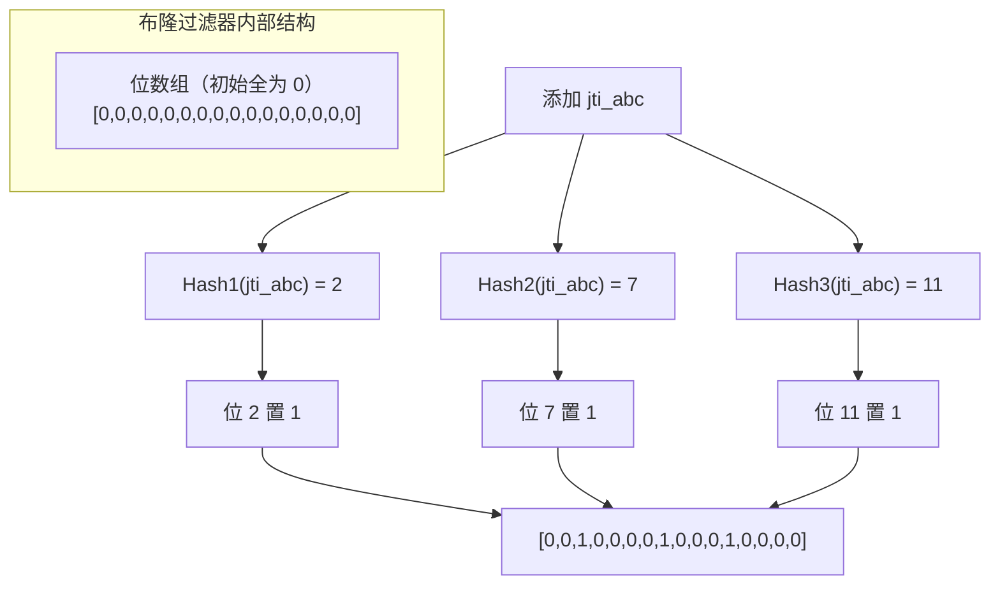
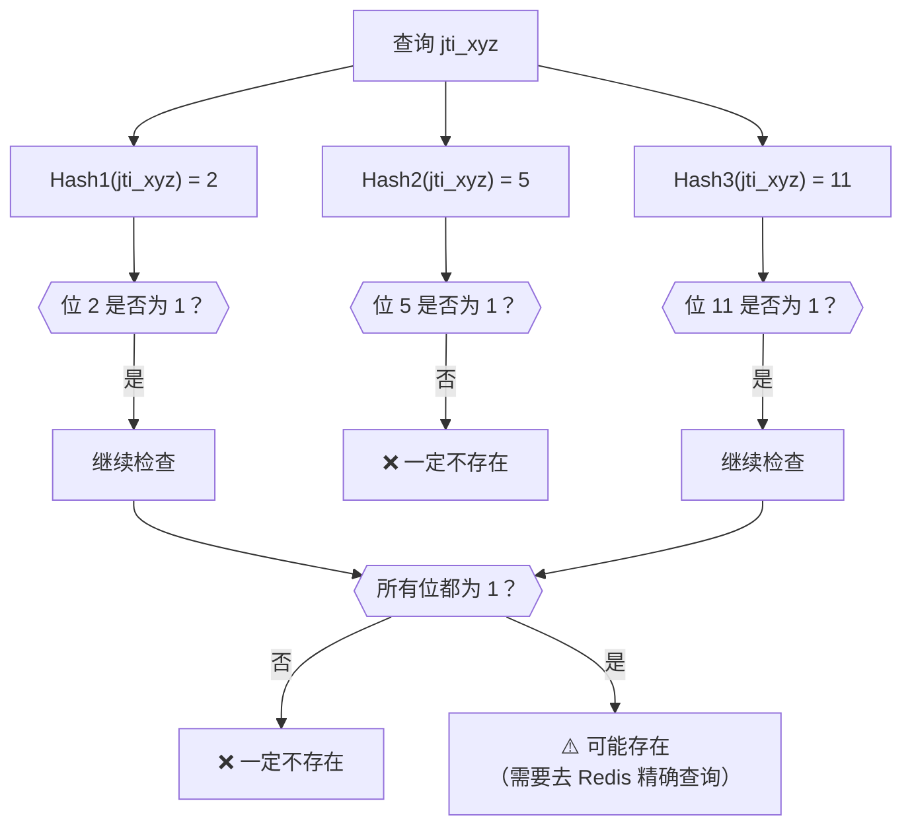
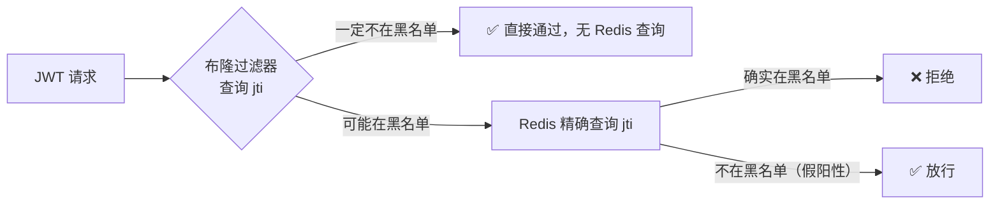

# JWT 黑名单

## 本篇导读

### 核心目标

学完本篇后，你将能够：

- 理解 JWT 无法主动撤销的根本原因，以及哪些场景真正需要主动撤销
- 设计并实现基于 Redis 的 JWT 黑名单机制，以最小的有状态性开销实现按需吊销
- 理解布隆过滤器（Bloom Filter）的工作原理，以及如何在 Redis 中用它优化黑名单查询
- 制定合理的过期清理策略，避免黑名单无限增长

### 重点与难点

**重点**：

- 黑名单存储的是 `jti`（JWT 唯一 ID），而不是完整 Token——减少存储量，提高查询效率
- 黑名单 Key 的 TTL 应该设置为多少？等于同一个 Token 的剩余有效时间，而不是固定值
- 布隆过滤器是一种"可能存在"判断，存在假阳性（误报），但绝不漏报——用于提前过滤大量正常请求

**难点**：

- 布隆过滤器的误报率和参数调优（位数组大小、哈希函数数量）
- 如何优雅地在黑名单检查失败（Redis 宕机）时降级处理，不完全阻断服务
- 在微服务架构中，黑名单检查放在哪一层？（API Gateway vs 业务服务）

## JWT 为什么默认无法撤销？

回顾上一篇的核心原则：JWT 是**无状态**的。服务器不记录任何已颁发令牌的信息，验证时只需检查签名和过期时间，无需任何数据库查询。

这个无状态性是刻意设计的——它赋予了 JWT 极强的水平扩展能力。但它也带来了一个内在限制：**令牌一旦签发，在过期之前无法被服务器主动"收回"**。

类比一下：传统的钥匙可以被没收（删除 Session），而 JWT 更像是一枚精密的数字锁头，只要结构完整（签名有效）且没有标注失效日期（未过期），任何持有它的人都能开门。你没有办法远程让某把已经颁发出去的"数字钥匙"失效。

在大多数场景中，这个限制是可以接受的：Access Token 只有 15 分钟有效期，即使泄露，攻击者的窗口也很短。但有些场景不能接受这个延迟：

### 哪些场景需要主动撤销？



对于上面这些场景，等待 Access Token 自然过期（最多 15 分钟）可能是不可接受的风险或不良体验。

### 两种思路的权衡

| 思路                        | 原理                                 | 优点               | 缺点                                      |
| --------------------------- | ------------------------------------ | ------------------ | ----------------------------------------- |
| 等待自然过期                | 不做任何处理                         | 无额外开销         | 最多 15 分钟的"僵尸期"                    |
| JWT 黑名单                  | 在 Redis 中记录已撤销 Token 的 `jti` | 即时撤销，精确控制 | 引入有状态性（Redis 查询）                |
| 颁发 Refresh Token 时短过期 | 通过不续期间接控制访问时间           | 简单，无额外存储   | 只能在刷新端点控制，Access Token 依然有效 |

**实际建议**：

- 对于权限降级这类场景，通常"最多 15 分钟后生效"是可以接受的，不需要黑名单
- 对于账号封禁、密码修改这类安全相关操作，必须使用黑名单实现即时撤销
- 对于用户注销，拒绝续期 Refresh Token + 让 Access Token 自然过期（15 分钟内依然有效）是常见的折中方案；对于高安全要求的应用，注销时同时将 Access Token 加入黑名单

## 核心概念讲解

### Redis 黑名单设计

#### Key 设计

```plaintext
jwt-blacklist:{jti}
```

- **Key**：前缀 `jwt-blacklist:` + JWT 的 `jti` 字段（唯一 ID）
- **Value**：1（存在即意味着被撤销，值本身不重要）
- **TTL**：**等于该 Token 的剩余有效时间**（而不是固定值）

为什么 TTL 要等于 Token 剩余有效时间？

```plaintext
假设 Token 在 12:00 签发，15 分钟后（12:15）过期

12:00 用户注销，将此 Token 加入黑名单：
  TTL = 12:15 - 12:00 = 15 分钟（当前时刻到过期的剩余时间）

12:15 Token 自然过期，黑名单记录也同时自动删除（TTL 到期）
  → Redis 永远不会积累过期的黑名单记录！
```

如果 TTL 设置为固定值（如 24 小时），则 Token 过期后黑名单记录还会在 Redis 中存放很长时间，浪费存储空间。

#### 如何计算剩余有效时间？

从 JWT Payload 中读取 `exp` 字段（Unix 时间戳，秒），减去当前时间：

```typescript
function getRemainingTtl(exp: number): number {
  const now = Math.floor(Date.now() / 1000);
  return Math.max(0, exp - now);
}
```

如果 Token 已经过期（`exp <= now`），`getRemainingTtl` 返回 0，此时不需要加入黑名单（过期的 Token 本身就无法通过验证）。

#### 完整的黑名单服务

```typescript
// src/auth/jwt-blacklist.service.ts
import { Injectable, Inject } from '@nestjs/common';
import { RedisClientType } from 'redis';
import { REDIS_CLIENT } from '../redis/redis.provider';

const BLACKLIST_PREFIX = 'jwt-blacklist:';

@Injectable()
export class JwtBlacklistService {
  constructor(
    @Inject(REDIS_CLIENT)
    private readonly redis: RedisClientType
  ) {}

  /**
   * 将 JWT 加入黑名单
   * @param jti JWT 唯一 ID
   * @param exp JWT 过期时间（Unix 时间戳，秒）
   */
  async blacklist(jti: string, exp: number): Promise<void> {
    const ttlSeconds = Math.floor(Date.now() / 1000);
    const remainingTtl = exp - ttlSeconds;

    if (remainingTtl <= 0) {
      // Token 已过期，无需加入黑名单（过期 Token 本身就无效）
      return;
    }

    const key = `${BLACKLIST_PREFIX}${jti}`;
    // NX：只在 key 不存在时设置（幂等性）
    // EX：TTL 秒数
    await this.redis.set(key, '1', { NX: true, EX: remainingTtl });
  }

  /**
   * 检查 jti 是否在黑名单中
   */
  async isBlacklisted(jti: string): Promise<boolean> {
    const key = `${BLACKLIST_PREFIX}${jti}`;
    const value = await this.redis.get(key);
    return value !== null;
  }
}
```

#### 在哪里调用黑名单检查？

黑名单检查应该在 JWT 签名验证通过之后进行：



**为什么先验证签名，后检查黑名单？**

这个顺序非常重要：

1. 如果先查黑名单，攻击者可以用构造的垃圾 Token 来轰炸 Redis（黑名单查询），造成 DoS
2. 签名验证是本地 CPU 运算（无网络请求），性能高，先过滤掉无效 Token
3. 只有通过签名验证的 Token 才值得去 Redis 查一次

### 批量撤销：撤销用户的所有令牌

有时候需要撤销某个用户的**所有**有效 Token（如账号封禁、密码修改）。如果要逐个将每个活跃 Token 的 `jti` 加入黑名单，需要先知道用户当前有哪些有效 Token——这在无状态 JWT 场景下做不到。

一种更优雅的方案是：在用户表中维护一个 **Token 版本号（Token Version）**：

```typescript
// Drizzle ORM Schema 中用户表
export const users = pgTable('users', {
  id: uuid('id').primaryKey().defaultRandom(),
  email: text('email').notNull().unique(),
  passwordHash: text('password_hash').notNull(),
  role: text('role').notNull().default('user'),
  // Token 版本号：每次需要撤销所有令牌时递增
  tokenVersion: integer('token_version').notNull().default(0),
  // ...其他字段
});
```

在 JWT Payload 中携带 `tokenVersion`：

```typescript
const payload: AccessTokenPayload = {
  sub: userId,
  email,
  role,
  jti: randomUUID(),
  tv: user.tokenVersion, // Token Version
};
```

验证时，从数据库查询用户的当前 `tokenVersion`，与 Token 中的 `tv` 对比：

```typescript
// 验证逻辑
const payload = await this.jwtService.verifyAsync<AccessTokenPayload>(token);

// 从 DB 或 Redis 缓存（推荐）查询用户当前 tokenVersion
const currentVersion = await this.getUserTokenVersion(payload.sub);

if (payload.tv !== currentVersion) {
  throw new UnauthorizedException('Token has been invalidated');
}
```

**撤销所有令牌**：只需将用户的 `tokenVersion` 加 1：

```typescript
async invalidateAllTokens(userId: string): Promise<void> {
  await this.db
    .update(schema.users)
    .set({ tokenVersion: sql`token_version + 1` })
    .where(eq(schema.users.id, userId));

  // 同时清除 Redis 中的版本号缓存（如果有缓存的话）
  await this.redis.del(`user-tv:${userId}`);
}
```

所有旧版本号的 Token 立即失效，新颁发的 Token 携带新版本号。这个方案无需在黑名单中存储任何 Token 信息，只有数据库中的一个整数字段。

**缺点**：验证时需要额外查询数据库（获取 `tokenVersion`），但可以通过 Redis 缓存（短 TTL，如 1 分钟）来减轻数据库压力。

**两种方案的配合使用**：

| 场景               | 推荐方案                                  |
| ------------------ | ----------------------------------------- |
| 撤销单个 Token     | `jti` 黑名单                              |
| 撤销用户所有 Token | Token Version 递增                        |
| 注销当前设备       | 删除 Refresh Token + `jti` 黑名单（可选） |
| 封禁账号           | Token Version 递增 + 拒绝发放新 Token     |
| 密码修改           | Token Version 递增                        |

### 布隆过滤器：黑名单查询的性能优化

在大型系统中，黑名单中可能存在大量 `jti` 记录（高并发场景下每秒颁发数千个 Token，其中可能有相当比例被提前撤销）。每次 API 请求都需要查一次 Redis 黑名单，在极高 QPS 场景下，Redis 查询量会非常大。

布隆过滤器可以作为 Redis 黑名单前的"快速过滤层"，大幅减少实际 Redis 查询量。

#### 布隆过滤器的原理

布隆过滤器是一种概率数据结构，使用**固定大小的位数组**（bit array）和**多个哈希函数**来判断一个元素是否可能存在于集合中。



**查询过程**：



布隆过滤器的关键特性：

- **确定不存在**：如果布隆过滤器返回"不存在"，则该元素**一定不在集合中**（无漏报）
- **可能存在**：如果布隆过滤器返回"可能存在"，该元素**不一定真的存在**（有假阳性）
- **时间复杂度**：O(k)，k 为哈希函数数量，非常快
- **空间效率极高**：一个 100 万元素、假阳性率 1% 的布隆过滤器只需约 1.2MB

**在黑名单场景的应用**：



假设黑名单中的 Token 占所有请求 Token 的 0.1%（大多数 Token 都是正常的），布隆过滤器的假阳性率设为 1%，那么：

- 99.9% 的请求：布隆过滤器直接返回"不存在"，无 Redis 查询
- 0.1% 的真实黑名单 Token + 0.999% × 1% ≈ 1% 的假阳性：才需要 Redis 查询

Redis 查询量从"每次请求都查"减少到"约 1% 的请求才查"，性能大幅提升。

#### 在 Redis 中使用布隆过滤器

Redis 通过 **RedisBloom** 模块（或 Redis Stack）提供原生布隆过滤器支持。Node.js 可通过 `redis` 客户端的 `BF` 命令系列操作布隆过滤器：

```bash
# 确认 Redis 实例中是否有 RedisBloom 支持（Redis Stack 或单独加载模块）
redis-cli MODULE LIST
# 应该能看到 bf、ReJSON 等模块
```

```typescript
// src/auth/jwt-bloom-filter.service.ts
import { Injectable, Inject, OnModuleInit } from '@nestjs/common';
import { RedisClientType } from 'redis';
import { REDIS_CLIENT } from '../redis/redis.provider';

const BLOOM_KEY = 'jwt-blacklist-bloom';

/**
 * 布隆过滤器参数说明：
 * - errorRate: 假阳性率（0.01 = 1%）。越低需要越多内存
 * - capacity: 预期元素数量。超过后假阳性率会上升
 *
 * 规划：
 * - 系统每天峰值约 10 万次撤销操作
 * - 保留 7 天的数据（Access Token 最长 15 分钟，7 天绰绰有余）
 * - 预期元素数 = 7 × 100,000 = 700,000，取整为 1,000,000
 */
@Injectable()
export class JwtBloomFilterService implements OnModuleInit {
  constructor(
    @Inject(REDIS_CLIENT)
    private readonly redis: RedisClientType
  ) {}

  async onModuleInit() {
    // 初始化布隆过滤器（如果不存在）
    // BF.RESERVE key error_rate capacity
    try {
      await (this.redis as any).bf.reserve(BLOOM_KEY, 0.01, 1_000_000);
    } catch (err: any) {
      // 如果 key 已存在（过滤器已初始化），忽略错误
      if (!err.message.includes('item exists')) {
        throw err;
      }
    }
  }

  /**
   * 将 jti 加入布隆过滤器
   */
  async add(jti: string): Promise<void> {
    await (this.redis as any).bf.add(BLOOM_KEY, jti);
  }

  /**
   * 检查 jti 是否可能在布隆过滤器中
   * 返回 false：一定不在黑名单
   * 返回 true：可能在黑名单（需要 Redis 精确查询）
   */
  async mightExist(jti: string): Promise<boolean> {
    const result = await (this.redis as any).bf.exists(BLOOM_KEY, jti);
    return result === 1;
  }
}
```

#### 将布隆过滤器与黑名单结合

```typescript
// src/auth/jwt-blacklist.service.ts（优化版）
import { Injectable, Inject, Logger } from '@nestjs/common';
import { RedisClientType } from 'redis';
import { REDIS_CLIENT } from '../redis/redis.provider';
import { JwtBloomFilterService } from './jwt-bloom-filter.service';

const BLACKLIST_PREFIX = 'jwt-blacklist:';

@Injectable()
export class JwtBlacklistService {
  private readonly logger = new Logger(JwtBlacklistService.name);

  constructor(
    @Inject(REDIS_CLIENT)
    private readonly redis: RedisClientType,
    private readonly bloomFilter: JwtBloomFilterService
  ) {}

  /**
   * 将 JWT 加入黑名单（同时更新布隆过滤器）
   */
  async blacklist(jti: string, exp: number): Promise<void> {
    const now = Math.floor(Date.now() / 1000);
    const remainingTtl = exp - now;

    if (remainingTtl <= 0) {
      return; // 已过期，无需处理
    }

    const key = `${BLACKLIST_PREFIX}${jti}`;

    // 同时写入 Redis 精确黑名单和布隆过滤器
    await Promise.all([
      this.redis.set(key, '1', { NX: true, EX: remainingTtl }),
      this.bloomFilter.add(jti),
    ]);
  }

  /**
   * 检查 jti 是否在黑名单中（两层过滤）
   */
  async isBlacklisted(jti: string): Promise<boolean> {
    // 第一层：布隆过滤器快速判断
    // 如果布隆过滤器返回 false，一定不在黑名单，直接跳过 Redis 查询
    let mightBeBlacklisted: boolean;
    try {
      mightBeBlacklisted = await this.bloomFilter.mightExist(jti);
    } catch (err) {
      // 布隆过滤器不可用时降级：直接查 Redis
      this.logger.warn(
        'Bloom filter unavailable, falling back to Redis directly'
      );
      mightBeBlacklisted = true;
    }

    if (!mightBeBlacklisted) {
      return false; // 快速路径：一定不在黑名单
    }

    // 第二层：Redis 精确查询确认
    const key = `${BLACKLIST_PREFIX}${jti}`;
    try {
      const value = await this.redis.get(key);
      return value !== null;
    } catch (err) {
      // Redis 查询失败时的降级策略，见下文"熔断降级"部分
      this.logger.error('Redis blacklist check failed', err);
      return false; // 降级：允许通过（优先可用性）
    }
  }
}
```

### 布隆过滤器的限制与注意事项

#### 不支持删除

标准布隆过滤器**不支持删除元素**。如果 `jti` 过期了，你无法从布隆过滤器中将其移除，这意味着过时的 bit 会一直占用空间，逐渐导致假阳性率升高。

**解决方案**：定期**重建**布隆过滤器。

因为布隆过滤器中的元素只有有效期内的 Token（TTL 与 Token 有效期对齐），可以定期重建：

1. 启动一个新的空布隆过滤器
2. 从 Redis 中扫描所有 `jwt-blacklist:*` 的 Key 重新写入新过滤器
3. 原子性地将新过滤器替换旧的

```typescript
// src/auth/bloom-filter-rebuilder.ts
import { Injectable, Logger } from '@nestjs/common';
import { Cron, CronExpression } from '@nestjs/schedule';
import { JwtBloomFilterService } from './jwt-bloom-filter.service';
import { JwtBlacklistService } from './jwt-blacklist.service';

@Injectable()
export class BloomFilterRebuilder {
  private readonly logger = new Logger(BloomFilterRebuilder.name);

  constructor(
    private readonly bloomFilter: JwtBloomFilterService,
    private readonly blacklist: JwtBlacklistService
  ) {}

  /**
   * 每小时重建一次布隆过滤器，清理已过期的 jti
   * 避免布隆过滤器随时间累积假阳性
   */
  @Cron(CronExpression.EVERY_HOUR)
  async rebuild(): Promise<void> {
    this.logger.log('Rebuilding JWT blacklist bloom filter...');

    try {
      await this.bloomFilter.rebuild();
      this.logger.log('Bloom filter rebuild completed');
    } catch (err) {
      this.logger.error('Bloom filter rebuild failed', err);
    }
  }
}
```

#### 可计数布隆过滤器（Counting Bloom Filter）

如果需要支持删除，可以使用**计数布隆过滤器**，将 bit 替换为计数器：添加时计数器 +1，删除时 -1，计数器为 0 表示元素不存在。Redis 的 RedisBloom 模块提供了 `CF`（Cuckoo Filter）作为替代，支持删除操作。

## 黑名单的过期清理策略

### Redis TTL 自动清理

正确设置 TTL 的黑名单记录会自动被 Redis 清理，无需手动干预。这是最优雅的清理方式。

**确认 TTL 设置正确**：

```bash
# 检查黑名单 Key 的 TTL
redis-cli TTL jwt-blacklist:some-jti-uuid
# 应该返回一个正数（剩余秒数）
# -1 表示永不过期（配置有问题！）
# -2 表示 Key 不存在（已过期被清理）
```

### Token Version 的版本号无需清理

`tokenVersion` 存在用户表的整数字段中，只会增大，没有"过期"的概念，无需清理。

### 定时清理过期的 Refresh Token

数据库中的 Refresh Token 记录需要定时清理过期条目（Redis TTL 不在这里帮忙）：

```typescript
// src/auth/cleanup.service.ts
import { Injectable, Logger } from '@nestjs/common';
import { Cron, CronExpression } from '@nestjs/schedule';
import { lt } from 'drizzle-orm';
import * as schema from '../db/schema';
import { NodePgDatabase } from 'drizzle-orm/node-postgres';

@Injectable()
export class CleanupService {
  private readonly logger = new Logger(CleanupService.name);

  constructor(private readonly db: NodePgDatabase<typeof schema>) {}

  /**
   * 每天凌晨 3 点清理过期的 Refresh Token 记录
   */
  @Cron('0 3 * * *')
  async cleanupExpiredRefreshTokens(): Promise<void> {
    this.logger.log('Cleaning up expired refresh tokens...');

    const result = await this.db
      .delete(schema.refreshTokens)
      .where(lt(schema.refreshTokens.expiresAt, new Date()));

    this.logger.log(
      `Cleaned up ${result.rowCount ?? 0} expired refresh tokens`
    );
  }
}
```

## 熔断降级：Redis 不可用时怎么办？

在高可用系统中，必须考虑 Redis 不可用的情况。黑名单服务依赖 Redis，如果 Redis 宕机，黑名单检查会失败。这时有两种降级策略：

**策略 A：熔断（Fail-Open，优先可用性）**

Redis 不可用时，允许请求通过（不检查黑名单）。系统依然可用，但在 Redis 恢复之前，被撤销的 Token 可能临时有效。

适合：业务可用性优先的系统。

**策略 B：断路（Fail-Closed，优先安全性）**

Redis 不可用时，拒绝所有请求。系统暂时不可用，但不存在安全漏洞。

适合：金融、医疗等安全敏感系统。

```typescript
// src/auth/jwt-blacklist.service.ts（带熔断的版本）
import { Injectable, Inject, Logger } from '@nestjs/common';
import { RedisClientType } from 'redis';
import { REDIS_CLIENT } from '../redis/redis.provider';

@Injectable()
export class JwtBlacklistService {
  private readonly logger = new Logger(JwtBlacklistService.name);
  // 是否优先可用性（true = Fail-Open，false = Fail-Closed）
  private readonly failOpen: boolean;

  constructor(@Inject(REDIS_CLIENT) private readonly redis: RedisClientType) {
    this.failOpen = process.env.BLACKLIST_FAIL_OPEN !== 'false';
  }

  async isBlacklisted(jti: string): Promise<boolean> {
    const key = `jwt-blacklist:${jti}`;

    try {
      const value = await this.redis.get(key);
      return value !== null;
    } catch (err) {
      this.logger.error(
        `Redis blacklist check failed for jti ${jti}. Fail-${this.failOpen ? 'Open' : 'Closed'} mode.`,
        err
      );

      if (this.failOpen) {
        // Fail-Open：假设不在黑名单，允许请求通过
        return false;
      } else {
        // Fail-Closed：抛出异常，触发 500 错误或下游熔断
        throw err;
      }
    }
  }
}
```

## 完整的 JWT 验证流程

将黑名单集成到 JWT 验证的完整流程：

```typescript
// src/auth/jwt-verify.service.ts
import { Injectable, UnauthorizedException } from '@nestjs/common';
import { JwtService } from '@nestjs/jwt';
import { AccessTokenPayload } from '../jwt/jwt.types';
import { JwtBlacklistService } from './jwt-blacklist.service';

@Injectable()
export class JwtVerifyService {
  constructor(
    private readonly jwtService: JwtService,
    private readonly blacklist: JwtBlacklistService
  ) {}

  async verify(token: string): Promise<AccessTokenPayload> {
    // Step 1: 验证签名 + 过期时间（本地 CPU 运算，无网络请求）
    let payload: AccessTokenPayload;
    try {
      payload = await this.jwtService.verifyAsync<AccessTokenPayload>(token);
    } catch (err: any) {
      if (err.name === 'TokenExpiredError') {
        throw new UnauthorizedException('Access token expired');
      }
      throw new UnauthorizedException('Invalid access token');
    }

    // Step 2: 检查 jti 是否在黑名单中（Redis 查询）
    if (payload.jti) {
      const revoked = await this.blacklist.isBlacklisted(payload.jti);
      if (revoked) {
        throw new UnauthorizedException('Access token has been revoked');
      }
    }

    return payload;
  }
}
```

## 总结：不同场景的撤销方案选型

| 场景                     | 推荐方案                                                       | 理由                            |
| ------------------------ | -------------------------------------------------------------- | ------------------------------- |
| 正常注销（当前设备）     | 删除 Refresh Token + 等待 Access Token 自然过期                | 简单，15 分钟后完全失效         |
| 高安全性注销（立即失效） | 删除 Refresh Token + `jti` 黑名单                              | 注销即时生效                    |
| 密码修改                 | Token Version 递增 + 删除所有 Refresh Token                    | 批量撤销，无需遍历 Token        |
| 账号封禁                 | Token Version 递增 + 删除所有 Refresh Token + 设置 banned 标记 | 多重保障，拒绝任何新 Token 颁发 |
| 令牌泄露检测             | 删除所有 Refresh Token + Token Version 递增 + 安全告警         | 立即终止所有会话                |
| 角色/权限降级            | 等待自然过期（通常 15 分钟内）或 Token Version 递增            | 根据业务对延迟的容忍度选择      |

## 常见问题与解决方案

### 问题一：布隆过滤器参数怎么设置才合理？

布隆过滤器的两个核心参数：

- **capacity（预期元素数量）**：估算每天的令牌撤销量 × 令牌最大有效天数（如 15 分钟 = 0.01 天，可以忽略）+ 一定裕量
- **errorRate（假阳性率）**：通常选择 1%（0.01）。越低假阳性率越少，但占用内存越多

计算公式（近似）：

- 位数组大小（bits）= `-n × ln(p) / (ln 2)²`，其中 n 是容量，p 是假阳性率
- 100 万元素 / 1% 假阳性率 ≈ 9.58 MB

如果 Redis 内存是瓶颈，可以适当提高假阳性率（如 3%），减少布隆过滤器内存占用。

### 问题二：如果黑名单中的 jti 很少，还需要布隆过滤器吗？

**不需要**。布隆过滤器适合大量元素的场景（数万以上）。如果黑名单记录通常只有几百条，直接查 Redis 的性能已经很好，增加布隆过滤器反而引入不必要的复杂性。

遵循"先让系统跑起来，有明确的性能问题再优化"的原则——不要过早优化。

### 问题三：Token Version 方案需要每次请求都查数据库，性能怎么样？

Token Version 的查询可以用 Redis 缓存（短 TTL，如 60 秒）来加速：

```typescript
async getUserTokenVersion(userId: string): Promise<number> {
  const cacheKey = `user-tv:${userId}`;

  // 先查缓存
  const cached = await this.redis.get(cacheKey);
  if (cached !== null) return parseInt(cached, 10);

  // 缓存未命中，查数据库
  const user = await this.usersService.findById(userId);
  if (!user) throw new UnauthorizedException();

  // 写入缓存（60 秒 TTL）
  await this.redis.set(cacheKey, user.tokenVersion.toString(), { EX: 60 });

  return user.tokenVersion;
}
```

权限降级等操作后清除对应缓存：

```typescript
await this.redis.del(`user-tv:${userId}`);
```

这样大多数请求命中缓存，只有约每 60 秒才需要真正查一次数据库。

### 问题四：JWT 黑名单与 Session 相比，性能差距有多大？

| 方案               | 每次 API 请求的额外操作                  | 典型延迟           |
| ------------------ | ---------------------------------------- | ------------------ |
| 纯 JWT（无黑名单） | 签名验证（本地）                         | 约 0.1ms           |
| JWT + jti 黑名单   | 签名验证（本地）+ Redis 查询             | 约 0.1 + 1 = 1.1ms |
| JWT + 布隆 + Redis | 签名验证 + 布隆（本地）+ Redis（1%概率） | 约 0.12ms（平均）  |
| Session            | Redis 查询                               | 约 1ms             |

布隆过滤器能让 JWT 黑名单方案的平均延迟接近纯 JWT，同时保留了按需撤销的能力。

## 本篇小结

本篇系统地讲解了 JWT 黑名单机制：

**为什么需要黑名单**：JWT 默认无法提前撤销，但密码修改、账号封禁等场景不能接受"最多 15 分钟"的失效延迟。黑名单以最小的有状态性代价解决了这个问题。

**Redis 黑名单设计**：以 `jti` 为 Key，TTL 设置为 Token 的剩余有效时间。Token 过期时黑名单记录自动清理，不会积累。黑名单检查必须在签名验证通过之后进行，防止垃圾 Token 轰炸 Redis。

**批量撤销**：Token Version（版本号）机制不需要遍历任何 Token，一次数据库操作递增版本号，所有旧版本 Token 立即失效。配合 Redis 缓存可将性能影响降到最低。

**布隆过滤器**：作为 Redis 黑名单的前置"快速过滤层"，利用"确定不存在"的特性让 99%+ 的正常请求绕过 Redis 查询。需要定期重建以清理已过期的 bit。

**降级策略**：Redis 不可用时的 Fail-Open（优先可用性）与 Fail-Closed（优先安全性）两种策略，根据业务特性选择。

下一篇，我们将把以上所有理论落地到 NestJS 的 **Passport JWT 策略**中——实现一个完整的 JWT Guard，将 Token 提取、签名验证、黑名单检查整合为一个可复用的认证守卫，并实现优雅的错误处理和自定义装饰器。
