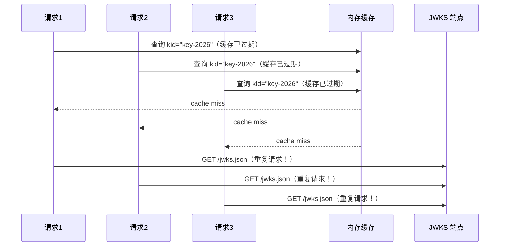
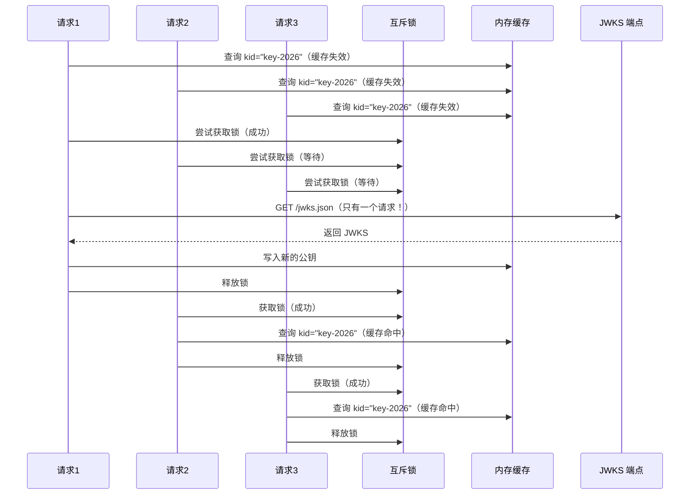
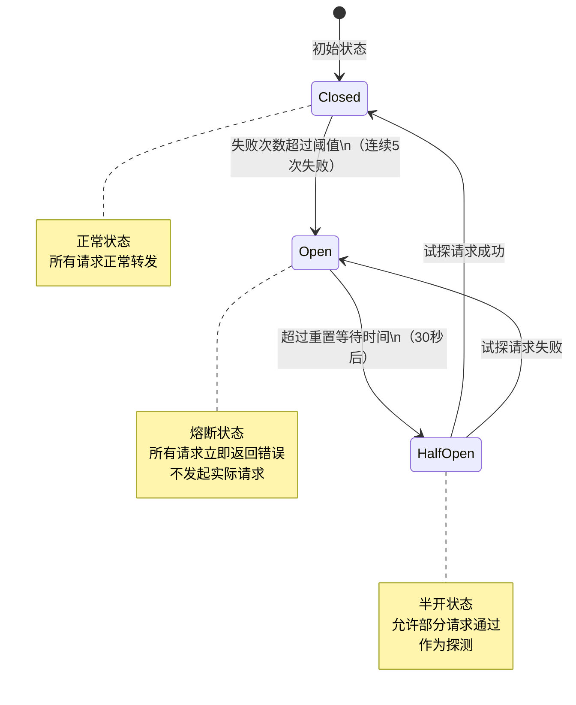
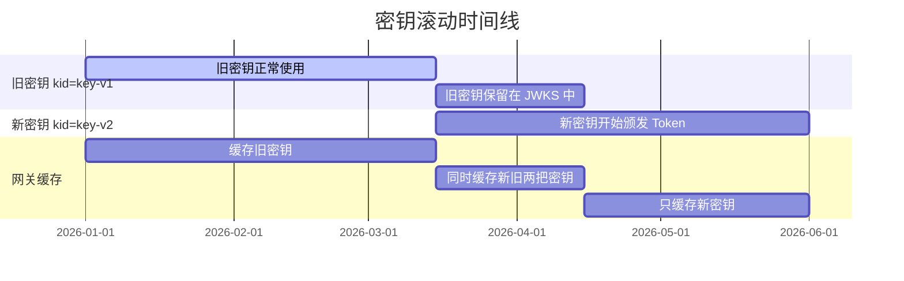

# JWT 验证中间件

## 本篇导读

### 核心目标

学完本篇后，你将能够：

- 理解 API 网关验证 JWT 的完整流程，掌握 JWKS 端点的作用和使用方式
- 实现一个线程安全的 JWKS 公钥缓存服务，防止高并发场景下的重复请求
- 使用并发锁（Mutex）解决缓存击穿（Cache Stampede）问题
- 实现熔断器（Circuit Breaker）模式，在认证服务不可用时保护网关稳定性
- 理解并解决缓存雪崩（Cache Avalanche）问题，通过随机 TTL 抖动防止同时失效

### 重点与难点

**重点**：

- JWKS 的结构和 `kid`（Key ID）的作用——Token Header 中的 `kid` 决定用哪把公钥验证
- 并发安全的缓存更新——多个请求同时发现缓存失效时，只有一个应该去拉取新公钥
- 熔断器状态机——Closed、Open、Half-Open 三种状态的转换逻辑

**难点**：

- 在无状态的 NestJS 请求处理环境中实现有状态的熔断器
- 区分三种缓存问题：缓存击穿（单个 key 失效引发大量请求）、缓存穿透（查不存在的 key）、缓存雪崩（大量 key 同时失效）
- `kid` 滚动（Key Rotation）场景——认证服务更换密钥时，网关如何平滑过渡

## JWT 验证的核心挑战

### 重新审视 JWT 验证流程

在模块三，我们学习了 JWT 的结构和验证方式。现在在网关场景下，情况有所不同：

**模块三的场景**：业务服务直接持有公钥（从环境变量加载），验证本服务颁发的 Token。

**网关场景**：网关不持有公钥参数，需要从认证服务的 JWKS 端点动态获取公钥，并且面对来自所有业务服务的 Token 验证需求，QPS 可能很高。

对比两者的差异：

| 维度     | 业务服务（模块三）  | API 网关（本篇）            |
| -------- | ------------------- | --------------------------- |
| 公钥来源 | 环境变量（静态）    | JWKS 端点（动态）           |
| 公钥数量 | 只有一把            | 可能有多把（按 `kid` 区分） |
| 密钥轮换 | 需要重启服务        | 自动获取新公钥              |
| 验证频率 | 服务内部的 API 用户 | 所有下游服务的所有请求      |
| 并发压力 | 中等                | 极高（所有流量的必经之路）  |
| 降级策略 | 无需特殊考虑        | 认证服务不可用时需要熔断    |

### JWKS 端点与公钥格式

JWKS（JSON Web Key Set）是一个标准的 JSON 格式，用于表示一组公钥。我们在模块四曾经实现了这个端点（`/.well-known/jwks.json`），现在来看如何消费它。

一个典型的 JWKS 响应：

```plaintext
GET /.well-known/jwks.json

{
  "keys": [
    {
      "kty": "RSA",
      "use": "sig",
      "kid": "key-2026-03-01",
      "n": "pjdss8ZaDfEH6K6U7GeW2nxDqR4IP049fk1fK0lndimbMMVBdPv_hSpm8T...",
      "e": "AQAB",
      "alg": "RS256"
    },
    {
      "kty": "RSA",
      "use": "sig",
      "kid": "key-2025-12-01",
      "n": "oXJ8OyOv_eRnce4akdanR4KYyhfZl0E_YiPsr6fGwYIO3vUxHTfwjQMd7...",
      "e": "AQAB",
      "alg": "RS256"
    }
  ]
}
```

- **`kty`**：Key Type，`RSA` 表示 RSA 密钥
- **`use`**：Key Use，`sig` 表示用于签名验证
- **`kid`**：Key ID，唯一标识一把密钥
- **`n`** 和 **`e`**：RSA 公钥的模数（modulus）和指数（exponent），Base64URL 编码
- **`alg`**：算法，`RS256` 表示 RSASSA-PKCS1-v1_5 with SHA-256

JWT 的 Header 部分会包含 `kid` 字段：

```plaintext
JWT Header（Base64URL 解码后）：
{
  "alg": "RS256",
  "kid": "key-2026-03-01"
}
```

验证流程：

1. 从 JWT Header 中提取 `kid`
2. 在 JWKS 中查找对应 `kid` 的公钥
3. 用该公钥验证 JWT 签名

## 公钥缓存设计

### 为什么必须缓存

如果网关每收到一个请求都去请求 JWKS 端点，在高并发场景下后果将是灾难性的：

假设网关每秒处理 10,000 个请求，每个请求都发起一次 HTTPS 请求到 JWKS 端点（约 10-50ms），那么每秒会有 10,000 个出站 HTTPS 连接。认证服务的 JWKS 端点会被打崩，而且这 50ms 的延迟会直接叠加到每个 API 响应时间上。

缓存是必须的，问题是：缓存什么、缓存多久、何时失效？

### 缓存结构设计

我们将公钥缓存在一个以 `kid` 为键的 Map 中，每个条目记录密钥内容和过期时间：

```typescript
interface CachedKey {
  key: KeyLike;        // jose 库的 KeyLike 对象，可直接用于验证
  expiresAt: number;   // 时间戳（毫秒），过期后需要重新获取
}

// 内存缓存：kid → CachedKey
private readonly cache = new Map<string, CachedKey>();
```

**为什么用 `kid` 作为键？**

认证服务可能同时维护多把公钥（例如，在密钥轮换期间，旧 Token 还在流通，必须用旧公钥验证）。以 `kid` 为键，可以在同一个缓存中存储多把公钥，按需查找。

**关于缓存时间（TTL）的考量**：

| TTL 太短（< 5 分钟）    | TTL 太长（> 24 小时）                             |
| ----------------------- | ------------------------------------------------- |
| 频繁请求 JWKS，增加延迟 | 密钥轮换后，网关仍用旧公钥，导致拒绝新 Token      |
| 认证服务压力大          | 密钥泄露时，换新密钥后旧 Token 长时间仍可通过验证 |

推荐 TTL：**1 小时**。认证服务在执行密钥轮换时，应保持旧密钥在 JWKS 中至少 24 小时，以确保所有网关实例有足够时间更新缓存。

### 缓存雪崩防护：随机 TTL 抖动

**问题背景**：

假设网关在 12:00 启动，一次性将所有公钥存入了缓存，TTL 统一设置为 1 小时。那么 13:00 时，所有公钥同时过期，所有正在处理请求的线程都会发现缓存失效，同时涌向 JWKS 端点——这就是 **缓存雪崩**。

在有多个网关实例的场景下，如果它们同时启动（比如滚动重启），这个问题会更严重。

**解决方案：随机抖动（Jitter）**：

为每个缓存条目的 TTL 添加随机偏移，避免同时失效：

```typescript
// 基础 TTL 1 小时，随机抖动 ±15 分钟
const BASE_TTL_MS = 60 * 60 * 1000; // 1 小时
const JITTER_MS = 15 * 60 * 1000; // 15 分钟

function computeTTL(): number {
  const jitter = (Math.random() - 0.5) * 2 * JITTER_MS; // -15min ~ +15min
  return BASE_TTL_MS + jitter;
}
```

这样，即使多个缓存条目同时被添加，它们的过期时间也会分散在 45 分钟 ~ 75 分钟的区间内，不会同时失效。

## 并发锁：解决缓存击穿

### 缓存击穿（Cache Stampede）问题

缓存击穿是另一个相关但不同的问题：**当某个特定 `kid` 的缓存过期时，多个并发请求同时发现缓存失效，都去请求 JWKS，导致对 JWKS 端点的重复请求**。



在每秒处理数万请求的网关上，一个公钥缓存失效可能瞬间触发几百个 JWKS 请求。

### 使用互斥锁（Mutex）防止重复拉取

解决方案：当缓存失效时，**只允许一个请求去拉取 JWKS，其他请求等待结果**：



### 在 Node.js 中实现 Mutex

Node.js 是单线程的，不存在真正的并发竞争。但 Node.js 的非阻塞 I/O 允许多个异步操作同时"挂起"，等待外部资源。

**问题场景**：请求 1 发现缓存失效，开始 `await fetch(jwksUrl)`。在等待期间，请求 2 也发现缓存失效（此时缓存还没更新），也开始 `await fetch(jwksUrl)`。虽然不是真正的并发，但两个异步操作都去请求了 JWKS。

**解决方案**：用一个 Promise 作为锁。第一个到达的请求将 JWKS 拉取的 Promise 存储起来，后续请求直接 `await` 同一个 Promise，而不是再发起新的请求：

```typescript
// auth/jwks-cache.service.ts
import { Injectable, Logger, OnModuleInit } from '@nestjs/common';
import { ConfigService } from '@nestjs/config';
import { createRemoteJWKSet, JWTVerifyGetKey, KeyLike, importJWK } from 'jose';

interface CachedKey {
  key: KeyLike;
  expiresAt: number;
}

@Injectable()
export class JwksCacheService implements OnModuleInit {
  private readonly logger = new Logger(JwksCacheService.name);

  // kid → 缓存的公钥
  private readonly keyCache = new Map<string, CachedKey>();

  // 正在进行的 JWKS 拉取 Promise（用于 Mutex）
  // null 表示当前没有正在进行的拉取
  private fetchingPromise: Promise<void> | null = null;

  // JWKS 刷新时间记录（用于熔断器，后面会用到）
  private lastFetchedAt: number = 0;
  private consecutiveFailures: number = 0;

  private readonly jwksUri: string;
  private readonly BASE_TTL_MS = 60 * 60 * 1000; // 1 小时
  private readonly JITTER_MS = 15 * 60 * 1000; // ±15 分钟抖动

  constructor(private readonly config: ConfigService) {
    this.jwksUri = this.config.getOrThrow<string>('JWKS_URI');
  }

  async onModuleInit() {
    // 应用启动时预热公钥缓存
    await this.refreshKeys().catch((err) => {
      this.logger.warn('Failed to prefetch JWKS on startup', err.message);
    });
  }

  /**
   * 根据 kid 获取公钥
   *
   * 如果缓存中有未过期的公钥，直接返回
   * 如果缓存失效或缓存中没有该 kid，触发缓存刷新
   */
  async getKey(kid: string): Promise<KeyLike | null> {
    const cached = this.keyCache.get(kid);

    if (cached && Date.now() < cached.expiresAt) {
      return cached.key; // 缓存命中，直接返回
    }

    // 缓存失效，需要刷新
    // 如果已经有一个刷新在进行中，等待它完成（Mutex）
    // 如果没有，启动新的刷新
    if (!this.fetchingPromise) {
      this.fetchingPromise = this.refreshKeys().finally(() => {
        this.fetchingPromise = null; // 刷新完成后清除 Promise
      });
    }

    await this.fetchingPromise;

    // 刷新完成后再查缓存
    return this.keyCache.get(kid)?.key ?? null;
  }

  /**
   * 从 JWKS 端点拉取最新的公钥集合，更新缓存
   */
  private async refreshKeys(): Promise<void> {
    this.logger.log(`Fetching JWKS from ${this.jwksUri}`);

    const response = await fetch(this.jwksUri, {
      signal: AbortSignal.timeout(5000), // 5 秒超时
    });

    if (!response.ok) {
      throw new Error(
        `JWKS fetch failed: ${response.status} ${response.statusText}`
      );
    }

    const jwks: { keys: JsonWebKey[] } = await response.json();

    if (!Array.isArray(jwks.keys) || jwks.keys.length === 0) {
      throw new Error('JWKS response contains no keys');
    }

    // 更新缓存中的所有 key
    for (const jwk of jwks.keys) {
      if (!jwk.kid || jwk.use !== 'sig') {
        continue; // 跳过没有 kid 或不用于签名的 key
      }

      try {
        const key = (await importJWK(jwk)) as KeyLike;
        const ttl = this.computeTTL();

        this.keyCache.set(jwk.kid, {
          key,
          expiresAt: Date.now() + ttl,
        });

        this.logger.log(
          `Cached key kid=${jwk.kid}, TTL=${Math.round(ttl / 1000)}s`
        );
      } catch (err) {
        this.logger.warn(`Failed to import JWK kid=${jwk.kid}`, err);
      }
    }

    this.lastFetchedAt = Date.now();
    this.consecutiveFailures = 0; // 成功重置失败计数
  }

  /**
   * 计算带随机抖动的 TTL，防止缓存雪崩
   */
  private computeTTL(): number {
    const jitter = (Math.random() - 0.5) * 2 * this.JITTER_MS;
    return Math.max(this.BASE_TTL_MS + jitter, 30 * 60 * 1000); // 最少 30 分钟
  }
}
```

### Mutex 实现的关键细节

上面代码中 Mutex 的核心逻辑只有几行，但非常精妙：

```typescript
if (!this.fetchingPromise) {
  this.fetchingPromise = this.refreshKeys().finally(() => {
    this.fetchingPromise = null;
  });
}

await this.fetchingPromise;
```

**执行过程分析**：

1. 请求 1 发现 `this.fetchingPromise === null`，进入 `if` 分支，创建 JWKS 拉取 Promise 并赋值给 `this.fetchingPromise`，然后 `await` 该 Promise
2. 在请求 1 等待期间，请求 2 到来，发现 `this.fetchingPromise !== null`（请求 1 刚才赋值的），跳过 `if` 分支，直接 `await` 同一个 Promise
3. JWKS 拉取完成，`.finally()` 将 `this.fetchingPromise` 重置为 `null`
4. 请求 1 和请求 2 的 `await` 都得到解决，继续各自的后续逻辑
5. 此后新来的请求发现 `this.fetchingPromise === null`，如果缓存已更新，将直接命中缓存

**关键点**：Promise 是可以被多个 `await` 同时等待的。这就是为什么这个方案能工作——本质上是把一个 "正在进行中的异步操作" 共享给所有等待方。

## 熔断器：应对认证服务故障

### 什么是熔断器

想象一个保险丝：当电路中电流过大时，保险丝断开，保护其他设备不被烧毁。熔断器（Circuit Breaker）模式类似：当某个下游服务持续出错时，停止向该服务发请求，直接返回错误，保护整个系统。

熔断器有三种状态：



**Closed（关闭）**：正常状态。所有请求正常转发，持续监控失败次数。当连续失败次数超过阈值时，切换到 Open 状态。

**Open（打开/熔断）**：熔断状态。所有请求立即返回错误，不再向下游发请求，保护下游服务和自身资源。等待一段时间（重置超时）后，切换到 Half-Open 状态。

**Half-Open（半开）**：探测状态。允许少量请求通过，观察下游是否恢复。如果通过的请求成功，切换回 Closed；否则重新 Open。

### 为什么网关需要熔断 JWKS 请求

如果认证服务宕机了，JWKS 端点不可用，每次拉取公钥都会超时（5 秒）。在高并发下，即使有 Mutex 控制，串行的 5 秒超时也是不可接受的。

更糟的是：如果认证服务在一段时间内频繁出错，没有熔断的话，网关会持续发起注定失败的 JWKS 请求，浪费资源，同时加速认证服务的崩溃（雪崩效应）。

熔断器的价值：**快速失败**。当认证服务不可用时，立即返回错误，而不是等待超时。

### 熔断器实现

```typescript
// auth/circuit-breaker.ts
export enum CircuitState {
  Closed = 'CLOSED',
  Open = 'OPEN',
  HalfOpen = 'HALF_OPEN',
}

interface CircuitBreakerOptions {
  /** 开始熔断的失败次数阈值 */
  failureThreshold: number;
  /** 熔断后多久进入 Half-Open 状态（毫秒） */
  resetTimeout: number;
  /** Half-Open 状态下允许通过的请求数 */
  halfOpenRequests: number;
}

export class CircuitBreaker {
  private state: CircuitState = CircuitState.Closed;
  private failureCount: number = 0;
  private successCount: number = 0;
  private nextAttemptAt: number = 0;

  constructor(
    private readonly name: string,
    private readonly options: CircuitBreakerOptions
  ) {}

  /**
   * 通过熔断器执行一个操作
   *
   * @throws CircuitOpenError 如果熔断器处于 Open 状态
   */
  async execute<T>(fn: () => Promise<T>): Promise<T> {
    if (this.state === CircuitState.Open) {
      if (Date.now() < this.nextAttemptAt) {
        throw new CircuitOpenError(`Circuit breaker "${this.name}" is OPEN`);
      }
      // 等待时间已到，切换到 Half-Open 允许试探
      this.state = CircuitState.HalfOpen;
      this.successCount = 0;
    }

    try {
      const result = await fn();
      this.onSuccess();
      return result;
    } catch (error) {
      this.onFailure();
      throw error;
    }
  }

  get currentState(): CircuitState {
    return this.state;
  }

  private onSuccess() {
    if (this.state === CircuitState.HalfOpen) {
      this.successCount++;
      if (this.successCount >= this.options.halfOpenRequests) {
        // 足够多的成功，恢复到 Closed
        this.state = CircuitState.Closed;
        this.failureCount = 0;
        this.successCount = 0;
      }
    } else {
      // Closed 状态下成功，重置失败计数
      this.failureCount = 0;
    }
  }

  private onFailure() {
    this.failureCount++;

    if (
      this.state === CircuitState.HalfOpen ||
      this.failureCount >= this.options.failureThreshold
    ) {
      this.state = CircuitState.Open;
      this.nextAttemptAt = Date.now() + this.options.resetTimeout;
    }
  }
}

export class CircuitOpenError extends Error {
  constructor(message: string) {
    super(message);
    this.name = 'CircuitOpenError';
  }
}
```

### 将熔断器集成到 JWKS 缓存服务

```typescript
// auth/jwks-cache.service.ts（集成熔断器后的完整版）
import {
  Injectable,
  Logger,
  OnModuleInit,
  ServiceUnavailableException,
} from '@nestjs/common';
import { ConfigService } from '@nestjs/config';
import { importJWK, KeyLike } from 'jose';
import { CircuitBreaker, CircuitOpenError } from './circuit-breaker';

interface CachedKey {
  key: KeyLike;
  expiresAt: number;
}

@Injectable()
export class JwksCacheService implements OnModuleInit {
  private readonly logger = new Logger(JwksCacheService.name);
  private readonly keyCache = new Map<string, CachedKey>();
  private fetchingPromise: Promise<void> | null = null;

  private readonly jwksUri: string;
  private readonly BASE_TTL_MS = 60 * 60 * 1000;
  private readonly JITTER_MS = 15 * 60 * 1000;

  // 熔断器配置：连续 5 次失败触发熔断，30 秒后进入 Half-Open
  private readonly breaker = new CircuitBreaker('JWKS', {
    failureThreshold: 5,
    resetTimeout: 30_000, // 30 秒
    halfOpenRequests: 2, // Half-Open 状态下 2 次成功就关闭
  });

  constructor(private readonly config: ConfigService) {
    this.jwksUri = this.config.getOrThrow<string>('JWKS_URI');
  }

  async onModuleInit() {
    await this.refreshKeys().catch((err) => {
      this.logger.warn('Failed to prefetch JWKS on startup', err.message);
    });
  }

  async getKey(kid: string): Promise<KeyLike | null> {
    const cached = this.keyCache.get(kid);

    if (cached && Date.now() < cached.expiresAt) {
      return cached.key;
    }

    // 触发缓存刷新（带 Mutex）
    if (!this.fetchingPromise) {
      this.fetchingPromise = this.safeRefreshKeys().finally(() => {
        this.fetchingPromise = null;
      });
    }

    try {
      await this.fetchingPromise;
    } catch (err) {
      if (err instanceof CircuitOpenError) {
        // 熔断器打开，检查是否有过期缓存可以降级使用
        const stale = this.keyCache.get(kid);
        if (stale) {
          this.logger.warn(
            `Circuit is OPEN, using stale key kid=${kid} (expired ${Math.round((Date.now() - stale.expiresAt) / 1000)}s ago)`
          );
          return stale.key; // 降级：使用过期的公钥
        }
        // 没有任何缓存，无法处理请求
        throw new ServiceUnavailableException(
          'Authentication service is unavailable'
        );
      }
      throw err;
    }

    return this.keyCache.get(kid)?.key ?? null;
  }

  private async safeRefreshKeys(): Promise<void> {
    try {
      await this.breaker.execute(() => this.refreshKeys());
    } catch (err) {
      if (err instanceof CircuitOpenError) {
        this.logger.warn(`JWKS refresh skipped: ${err.message}`);
        throw err; // 向上传递，由 getKey 处理降级逻辑
      }
      this.logger.error('Failed to refresh JWKS', err);
      throw err;
    }
  }

  private async refreshKeys(): Promise<void> {
    this.logger.log(`Fetching JWKS from ${this.jwksUri}`);

    const response = await fetch(this.jwksUri, {
      signal: AbortSignal.timeout(5000),
    });

    if (!response.ok) {
      throw new Error(`JWKS fetch failed: ${response.status}`);
    }

    const jwks: { keys: JsonWebKey[] } = await response.json();

    for (const jwk of jwks.keys) {
      if (!jwk.kid || jwk.use !== 'sig') continue;

      try {
        const key = (await importJWK(jwk)) as KeyLike;
        this.keyCache.set(jwk.kid, {
          key,
          expiresAt: Date.now() + this.computeTTL(),
        });
      } catch (err) {
        this.logger.warn(`Failed to import JWK kid=${jwk.kid}`, err);
      }
    }
  }

  private computeTTL(): number {
    const jitter = (Math.random() - 0.5) * 2 * this.JITTER_MS;
    return Math.max(this.BASE_TTL_MS + jitter, 30 * 60 * 1000);
  }
}
```

**降级策略说明**：

当熔断器打开时（认证服务不可用），网关面临两个选择：

**激进策略**：直接返回 502 错误，所有需要认证的请求都失败。优点：不会用过期公钥放行可能已失效的 Token。缺点：认证服务短暂故障就会导致所有 API 不可用。

**保守策略**：使用过期的公钥缓存继续验证 Token（降级）。优点：认证服务短暂故障不影响用户体验。缺点：在这段时间内，即使 Token 被吊销（密钥已更换），网关仍可能放行。

推荐根据业务场景选择：**安全敏感型业务**（金融、医疗）使用激进策略；**体验优先型业务**（电商、内容）使用带监控告警的保守策略，同时设置降级时长上限（如最多降级 5 分钟）。

## JWT 验证中间件完整实现

### JWT 验证服务

```typescript
// auth/jwt-verify.service.ts
import { Injectable, UnauthorizedException, Logger } from '@nestjs/common';
import { ConfigService } from '@nestjs/config';
import { jwtVerify, JWTPayload } from 'jose';
import { JwksCacheService } from './jwks-cache.service';

export interface GatewayTokenPayload extends JWTPayload {
  sub: string; // 用户 ID
  email?: string;
  role?: string;
  scope?: string; // 空格分隔的 Scope 列表
  jti?: string; // JWT ID（用于吊销检查）
}

@Injectable()
export class JwtVerifyService {
  private readonly logger = new Logger(JwtVerifyService.name);
  private readonly issuer: string;
  private readonly audience: string;

  constructor(
    private readonly jwksCache: JwksCacheService,
    private readonly config: ConfigService
  ) {
    this.issuer = this.config.getOrThrow<string>('JWT_ISSUER');
    this.audience = this.config.getOrThrow<string>('JWT_AUDIENCE');
  }

  /**
   * 验证 Access Token 并返回 Payload
   *
   * @throws UnauthorizedException 如果 Token 无效
   */
  async verify(token: string): Promise<GatewayTokenPayload> {
    // 1. 解码 JWT Header，获取 kid（不验证签名，只解析 Header）
    const kid = this.extractKid(token);

    if (!kid) {
      throw new UnauthorizedException('Missing kid in token header');
    }

    // 2. 从缓存获取对应的公钥
    const publicKey = await this.jwksCache.getKey(kid);

    if (!publicKey) {
      // 未知的 kid——可能是密钥轮换后的新 key，尝试强制刷新一次
      throw new UnauthorizedException(`Unknown key id: ${kid}`);
    }

    // 3. 验证签名、有效期、issuer、audience
    try {
      const { payload } = await jwtVerify(token, publicKey, {
        issuer: this.issuer,
        audience: this.audience,
        algorithms: ['RS256'],
      });

      return payload as GatewayTokenPayload;
    } catch (err) {
      const errorMessage = err instanceof Error ? err.message : 'Unknown error';
      this.logger.debug(`JWT verification failed: ${errorMessage}`);
      throw new UnauthorizedException(this.mapJwtError(errorMessage));
    }
  }

  /**
   * 从 JWT 字符串中提取 Header 的 kid，不验证签名
   */
  private extractKid(token: string): string | undefined {
    try {
      const [headerB64] = token.split('.');
      const header = JSON.parse(
        Buffer.from(headerB64, 'base64url').toString('utf-8')
      );
      return header.kid;
    } catch {
      return undefined;
    }
  }

  /**
   * 将 jose 库的错误信息映射为友好的错误描述
   */
  private mapJwtError(message: string): string {
    if (message.includes('expired')) return 'Access token is expired';
    if (message.includes('not before')) return 'Token is not yet valid';
    if (message.includes('issuer')) return 'Invalid token issuer';
    if (message.includes('audience')) return 'Invalid token audience';
    if (message.includes('signature')) return 'Invalid token signature';
    return 'Invalid access token';
  }
}
```

### JWT 认证守卫

```typescript
// auth/jwt-auth.guard.ts
import {
  Injectable,
  CanActivate,
  ExecutionContext,
  UnauthorizedException,
} from '@nestjs/common';
import { Reflector } from '@nestjs/core';
import { Request } from 'express';
import { JwtVerifyService, GatewayTokenPayload } from './jwt-verify.service';
import { IS_PUBLIC_KEY } from './public.decorator';

// 扩展 Express 的 Request 类型，添加 user 字段
declare module 'express' {
  interface Request {
    user?: GatewayTokenPayload;
  }
}

@Injectable()
export class JwtAuthGuard implements CanActivate {
  constructor(
    private readonly reflector: Reflector,
    private readonly jwtVerify: JwtVerifyService
  ) {}

  async canActivate(context: ExecutionContext): Promise<boolean> {
    // 检查是否为公开路由
    const isPublic = this.reflector.getAllAndOverride<boolean>(IS_PUBLIC_KEY, [
      context.getHandler(),
      context.getClass(),
    ]);

    if (isPublic) {
      return true;
    }

    const request = context.switchToHttp().getRequest<Request>();
    const token = this.extractToken(request);

    if (!token) {
      throw new UnauthorizedException('Missing access token');
    }

    // 验证 Token，将结果注入 req.user
    request.user = await this.jwtVerify.verify(token);

    return true;
  }

  /**
   * 从请求中提取 Bearer Token
   * 优先从 Authorization 头提取，其次从 Cookie 提取
   */
  private extractToken(request: Request): string | undefined {
    const authHeader = request.headers.authorization;

    if (authHeader?.startsWith('Bearer ')) {
      return authHeader.slice(7);
    }

    // 备选：从 Cookie 提取（适用于 BFF 模式）
    const cookieToken = request.cookies?.access_token;
    if (cookieToken) {
      return cookieToken;
    }

    return undefined;
  }
}
```

### @CurrentUser() 装饰器

在网关的代理控制器中，需要从 `req.user` 获取用户信息并注入请求头。使用自定义装饰器让代码更简洁：

```typescript
// auth/current-user.decorator.ts
import { createParamDecorator, ExecutionContext } from '@nestjs/common';
import { Request } from 'express';
import { GatewayTokenPayload } from './jwt-verify.service';

export const CurrentUser = createParamDecorator(
  (data: keyof GatewayTokenPayload | undefined, ctx: ExecutionContext) => {
    const request = ctx.switchToHttp().getRequest<Request>();
    const user = request.user as GatewayTokenPayload;

    return data ? user?.[data] : user;
  }
);
```

使用示例：

```typescript
// proxy/proxy.controller.ts
@Controller()
export class ProxyController {
  @All('*')
  async proxy(
    @CurrentUser() user: GatewayTokenPayload,
    @Req() req: Request,
    @Res() res: Response
  ) {
    // 向后端服务注入用户信息头
    req.headers['x-user-id'] = user.sub;
    req.headers['x-user-role'] = user.role ?? 'user';
    req.headers['x-user-email'] = user.email ?? '';
    req.headers['x-internal-secret'] = this.config.get('INTERNAL_SECRET');

    await this.proxyService.forward(req, res);
  }
}
```

## AuthModule 注册

```typescript
// auth/auth.module.ts
import { Module } from '@nestjs/common';
import { JwksCacheService } from './jwks-cache.service';
import { JwtVerifyService } from './jwt-verify.service';
import { JwtAuthGuard } from './jwt-auth.guard';

@Module({
  providers: [JwksCacheService, JwtVerifyService, JwtAuthGuard],
  exports: [JwksCacheService, JwtVerifyService, JwtAuthGuard],
})
export class AuthModule {}
```

## 密钥滚动（Key Rotation）处理

### 什么是密钥滚动

密钥滚动是指定期更换 JWT 签名密钥对。常见原因：

- 定期轮换（安全最佳实践，通常每 3-12 个月一次）
- 密钥泄露（必须立即更换）
- 系统迭代（更换更安全的算法）

### 滚动期间的兼容性问题

在密钥滚动过程中，会有一段时间两把密钥同时有效：



- **Day 0**：生成新密钥对，将新公钥 `kid=key-v2` 添加到 JWKS（但还不用它签名）
- **Day 1**：开始用新密钥签名新的 Token；旧密钥 `kid=key-v1` 继续保留在 JWKS 中
- **Day 30**：旧密钥颁发的所有 Token 都已过期（最长过期时间一般是 24h Access Token），从 JWKS 中移除旧密钥

这个设计让网关能同时验证两种 Token：

- 持有 `kid=key-v1` 的旧 Token → 用缓存中的旧公钥验证
- 持有 `kid=key-v2` 的新 Token → 用缓存中的新公钥验证

### 处理未知 kid

如果网关缓存中没有某个 `kid`，可能是：

1. 密钥刚刚轮换，网关缓存还没更新
2. Token 被篡改，`kid` 字段是伪造的

应对策略：**强制刷新一次 JWKS，然后再试**。如果刷新后仍然找不到该 `kid`，才认为 Token 无效：

```typescript
async getKey(kid: string): Promise<KeyLike | null> {
  const cached = this.keyCache.get(kid);

  if (cached && Date.now() < cached.expiresAt) {
    return cached.key;
  }

  // 第一次：尝试刷新
  await this.triggerRefresh();

  const afterRefresh = this.keyCache.get(kid);
  if (afterRefresh) {
    return afterRefresh.key;
  }

  // 刷新后仍找不到，判定为无效 kid
  this.logger.warn(`Key not found after refresh: kid=${kid}`);
  return null;
}
```

## 常见问题与解决方案

### 问题一：Token 中没有 kid 字段

**原因**：颁发 Token 时没有在 Header 中设置 `kid`，或者使用的是对称密钥（HMAC），不需要区分密钥。

**解决方案**：如果系统只有一把公钥，可以跳过 `kid` 匹配，直接用唯一的公钥验证。但推荐在颁发 Token 时始终包含 `kid`——因为你不知道将来什么时候需要轮换密钥。

### 问题二：JWKS 端点返回 5xx 错误

**原因**：认证服务部分不可用，或者 JWKS 端点刚好发生了重启。

**解决方案**：

- 熔断器开始计数错误，连续失败 5 次后触发熔断
- 熔断期间使用降级策略（过期公钥），并发告警
- 30 秒后进入 Half-Open 状态，试探认证服务是否恢复

### 问题三：多个网关实例的公钥缓存不一致

**问题**：实例 A 已经刷新了公钥，实例 B 还在用旧公钥——如果新旧密钥都存在于 JWKS，是正常的；如果旧密钥已从 JWKS 移除，实例 B 会拒绝新 Token。

**解决方案**：

- 密钥轮换时，旧密钥保留在 JWKS 中至少一个缓存 TTL 周期（1.25 小时）
- 可以将公钥缓存移到 Redis，所有实例共享一个缓存，刷新只需一次

### 问题四：validate() 中能否查数据库

**问题**：能否在 JWT 验证守卫中查询数据库，检查用户是否被封禁？

**回答**：技术上可以，但不推荐。理由：

- 每次 API 请求都查数据库，大幅增加延迟和数据库负载
- 网关的优势在于快速验证，引入数据库查询违背了这一设计原则

**替代方案**：

- 使用 Token 吊销机制（JWT 黑名单，见模块三），封禁用户时将其所有活跃 Token 的 `jti` 加入 Redis 黑名单
- 在 Token Payload 中包含账号状态（`isActive: true`），每次用户状态变更时吊销现有 Token，颁发新 Token

## 本篇小结

本篇实现了 API 网关的核心 JWT 验证逻辑，涉及多个工程难点：

**核心要点**：

- JWKS 端点用于分发公钥，`kid` 字段是公钥的唯一标识，JWT Header 和 JWKS 通过 `kid` 关联
- 公钥必须缓存在内存中，避免每次验证都请求 JWKS 端点
- 通过"共享 Promise" 实现 Mutex，防止并发下的重复 JWKS 请求（缓存击穿）
- 随机 TTL 抖动避免多个缓存条目同时失效（缓存雪崩）
- 熔断器（Closed → Open → Half-Open）保护网关在认证服务不可用时快速失败
- 熔断期间可以降级使用过期公钥，权衡安全性和可用性

**下一篇**：将实现权限检查守卫，包括基于角色的 RBAC 授权、OAuth2 Scope 验证，以及如何通过自定义装饰器灵活地为路由配置权限要求。
