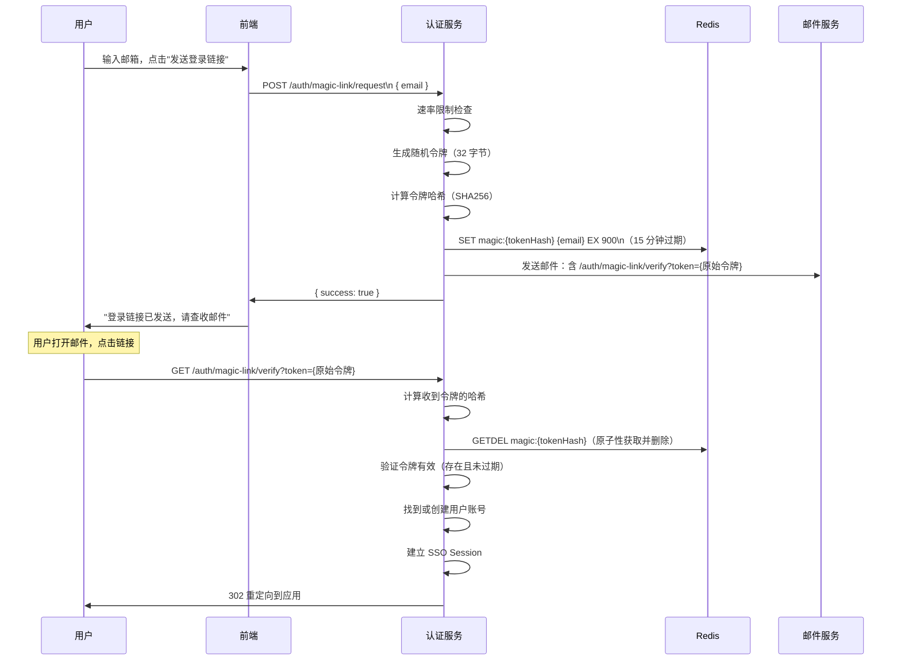

# Magic Link 邮箱登录

## 本篇导读

### 核心目标

学完本篇后，你将能够：

- 理解 Magic Link（无密码邮箱登录）的工作原理和适用场景
- 生成安全的一次性登录令牌（cryptographically secure random token）
- 实现令牌的 Redis 存储（TTL 限制时间窗口）和一次性消费（原子性 GETDEL）
- 集成邮件发送服务（Nodemailer + SMTP）
- 实现防滥发机制（速率限制、同 IP 频率控制）
- 理解 Magic Link 的安全边界和最佳实践

### 重点与难点

**重点**：

- 令牌必须是密码学安全的随机数——不能用 `Math.random()`，要用 `crypto.randomBytes()`
- 令牌一次性消费——用 Redis 的 GETDEL 命令，原子性地获取并删除，防止重放
- 令牌存储的 Key 设计——以令牌哈希为 Key（不以令牌明文为 Key），防止 Redis 泄露后被利用

**难点**：

- 速率限制的设计——如何防止攻击者大量发送邮件耗尽 SMTP 配额
- 邮件发送失败的处理——异步发送还是同步发送？失败后用户看到什么？
- 多设备的 Magic Link——A 设备请求的 Magic Link，B 设备点击会怎样？

## 什么是 Magic Link

Magic Link 是一种 **无密码登录** 方式：用户输入邮箱地址，系统发送一封包含 **一次性登录链接** 的邮件，用户点击链接后直接登录，无需记忆密码。



### Magic Link vs 密码的对比

| 维度       | 密码登录                 | Magic Link                           |
| ---------- | ------------------------ | ------------------------------------ |
| 用户体验   | 需要记忆密码             | 无需记忆，但需要查邮件               |
| 安全性     | 密码可能被猜测/重用/泄露 | 令牌一次性、短期有效、发送到可信邮箱 |
| 账号恢复   | 需要"忘记密码"流程       | 无需，本身就是基于邮箱               |
| 适用场景   | 频繁登录的 daily app     | 低频使用的工具、newsletter 平台      |
| 中间人风险 | 无                       | 邮件可能被拦截（推荐结合 HTTPS）     |

## 令牌设计

### 为什么要存令牌哈希而不是明文

令牌设计的一个重要原则：**Redis 里存令牌的哈希值，URL 里带令牌明文**。

原因：如果存令牌明文，一旦 Redis 被攻击者读取，攻击者拿到令牌就能直接登录。

如果存令牌的哈希值：

- URL 里是令牌明文，用户点击链接时提交明文
- 服务器计算明文的哈希，在 Redis 里查找
- 即使 Redis 泄露，攻击者得到的是哈希值（SHA256 的单向性使其无法反推明文）

这与密码存储的原理相同：存哈希，不存原文。

### 令牌生成

```typescript
import { randomBytes, createHash } from 'crypto';

// 生成令牌明文（32 字节 = 64 个十六进制字符）
function generateToken(): string {
  return randomBytes(32).toString('hex');
}

// 计算令牌哈希（用于 Redis Key）
function hashToken(token: string): string {
  return createHash('sha256').update(token).digest('hex');
}

// Redis Key 结构
// magic:{tokenHash} → email
// TTL: 900 秒（15 分钟）
```

## MagicLinkService 实现

```typescript
// src/magic-link/magic-link.service.ts
import {
  Injectable,
  BadRequestException,
  TooManyRequestsException,
} from '@nestjs/common';
import { InjectRedis } from '@nestjs-modules/ioredis';
import Redis from 'ioredis';
import { randomBytes, createHash } from 'crypto';
import { MailService } from '../mail/mail.service';
import { SocialAuthService } from '../social/social-auth.service';
import { db } from '../db';
import { users } from '../db/schema';
import { eq } from 'drizzle-orm';

@Injectable()
export class MagicLinkService {
  private readonly TOKEN_TTL_SECONDS = 15 * 60; // 15 分钟
  private readonly RATE_LIMIT_WINDOW = 60; // 60 秒
  private readonly RATE_LIMIT_MAX = 3; // 每个邮箱每分钟最多 3 次请求

  constructor(
    @InjectRedis() private readonly redis: Redis,
    private readonly mailService: MailService,
    private readonly socialAuthService: SocialAuthService
  ) {}

  async requestMagicLink(email: string, ip: string): Promise<void> {
    // 1. 速率限制：同一邮箱 60 秒内最多 3 次
    await this.checkRateLimit(email, ip);

    // 2. 生成令牌
    const token = randomBytes(32).toString('hex');
    const tokenHash = createHash('sha256').update(token).digest('hex');

    // 3. 存入 Redis（只存 email，不存令牌明文）
    await this.redis.setex(`magic:${tokenHash}`, this.TOKEN_TTL_SECONDS, email);

    // 4. 发送邮件（包含令牌明文的链接）
    const magicUrl = `${process.env.APP_BASE_URL}/auth/magic-link/verify?token=${token}`;
    await this.mailService.sendMagicLink(email, magicUrl);
  }

  async verifyToken(token: string): Promise<string> {
    // 1. 计算令牌哈希
    const tokenHash = createHash('sha256').update(token).digest('hex');

    // 2. 原子性地获取并删除（一次性令牌）
    const email = await this.redis.getdel(`magic:${tokenHash}`);

    if (!email) {
      throw new BadRequestException('登录链接无效或已过期，请重新发送');
    }

    return email;
  }

  async findOrCreateUserByEmail(email: string): Promise<string> {
    // 查找已有用户
    const [existing] = await db
      .select({ id: users.id })
      .from(users)
      .where(eq(users.email, email))
      .limit(1);

    if (existing) {
      return existing.id;
    }

    // 创建新用户
    const { userId } = await this.socialAuthService.findOrCreateUser({
      provider: 'magic-link',
      providerUserId: email, // Magic Link 以邮箱为唯一 ID
      email,
      name: email.split('@')[0], // 默认用邮箱前缀作为用户名
      rawProfile: { email, loginMethod: 'magic-link' },
    });

    return userId;
  }

  private async checkRateLimit(email: string, ip: string): Promise<void> {
    // 限制1：同一邮箱
    const emailKey = `magic:rate:email:${email}`;
    const emailCount = await this.redis.incr(emailKey);
    if (emailCount === 1) {
      await this.redis.expire(emailKey, this.RATE_LIMIT_WINDOW);
    }
    if (emailCount > this.RATE_LIMIT_MAX) {
      throw new TooManyRequestsException('发送太频繁，请稍后再试');
    }

    // 限制2：同一 IP（防止攻击者对多个邮箱轰炸）
    const ipKey = `magic:rate:ip:${ip}`;
    const ipCount = await this.redis.incr(ipKey);
    if (ipCount === 1) {
      await this.redis.expire(ipKey, this.RATE_LIMIT_WINDOW);
    }
    if (ipCount > 10) {
      // IP 级别限制更宽松，每分钟最多 10 次
      throw new TooManyRequestsException('操作太频繁，请稍后再试');
    }
  }
}
```

## MagicLinkController 实现

```typescript
// src/magic-link/magic-link.controller.ts
import {
  Controller,
  Post,
  Get,
  Body,
  Query,
  Req,
  Res,
  HttpCode,
} from '@nestjs/common';
import { Request, Response } from 'express';
import { z } from 'zod/v4';
import { MagicLinkService } from './magic-link.service';
import { SsoService } from '../sso/sso.service';

const requestSchema = z.object({
  email: z.email(),
});

@Controller('auth/magic-link')
export class MagicLinkController {
  constructor(
    private readonly magicLinkService: MagicLinkService,
    private readonly ssoService: SsoService
  ) {}

  // 1. 发送 Magic Link
  @Post('request')
  @HttpCode(200)
  async request(@Body() body: unknown, @Req() req: Request) {
    const { email } = requestSchema.parse(body);
    const ip = req.ip ?? 'unknown';

    // 注意：即使邮箱不存在也返回成功—防止用户枚举攻击
    // 用户不应该知道某个邮箱是否在系统中注册过
    await this.magicLinkService.requestMagicLink(email, ip);

    return { success: true, message: '如果邮箱存在，登录链接已发送' };
  }

  // 2. 验证 Magic Link（用户点击邮件中的链接访问这里）
  @Get('verify')
  async verify(
    @Query('token') token: string,
    @Req() req: Request,
    @Res() res: Response
  ) {
    if (!token) {
      return res.redirect('/login?error=invalid_token');
    }

    try {
      // 验证令牌，获取对应的邮箱
      const email = await this.magicLinkService.verifyToken(token);

      // 找到或创建用户
      const userId = await this.magicLinkService.findOrCreateUserByEmail(email);

      // 建立 SSO Session
      const ssoSessionId = await this.ssoService.createSession(userId, {
        ip: req.ip ?? '',
        loginMethod: 'magic-link',
      });

      res.cookie('sso_session', ssoSessionId, {
        httpOnly: true,
        secure: process.env.NODE_ENV === 'production',
        sameSite: 'lax',
        maxAge: 30 * 24 * 60 * 60 * 1000,
      });

      // 恢复 pending 授权请求
      const pendingAuthParams = req.session?.pendingAuthRequest;
      if (pendingAuthParams) {
        delete req.session.pendingAuthRequest;
        return res.redirect(
          `/oauth/authorize?${new URLSearchParams(pendingAuthParams)}`
        );
      }

      return res.redirect('/');
    } catch (err: any) {
      // 不要在 URL 里暴露具体错误原因
      return res.redirect('/login?error=invalid_or_expired_link');
    }
  }
}
```

## 邮件发送服务

### 安装 Nodemailer

```bash
pnpm add nodemailer
pnpm add -D @types/nodemailer
```

### MailService 实现

```typescript
// src/mail/mail.service.ts
import { Injectable, Logger } from '@nestjs/common';
import { createTransport, Transporter } from 'nodemailer';
import { OAuthConfigService } from '../config/oauth-config.service';

@Injectable()
export class MailService {
  private readonly transporter: Transporter;
  private readonly logger = new Logger(MailService.name);
  private readonly fromAddress: string;

  constructor(private readonly oauthConfigService: OAuthConfigService) {
    const smtp = oauthConfigService.smtp;

    this.fromAddress = smtp.from ?? 'noreply@example.com';

    this.transporter = createTransport({
      host: smtp.host,
      port: smtp.port,
      secure: smtp.port === 465, // 465 用 SSL，587 用 STARTTLS
      auth: {
        user: smtp.user,
        pass: smtp.pass,
      },
    });
  }

  async sendMagicLink(to: string, magicUrl: string): Promise<void> {
    try {
      await this.transporter.sendMail({
        from: `"你的应用" <${this.fromAddress}>`,
        to,
        subject: '你的登录链接',
        text: `
点击以下链接登录你的账号（链接 15 分钟内有效）：

${magicUrl}

如果这不是你发起的，请忽略此邮件。
        `.trim(),
        html: `
<!DOCTYPE html>
<html>
<head>
  <meta charset="utf-8">
  <meta name="viewport" content="width=device-width, initial-scale=1">
</head>
<body style="font-family: sans-serif; max-width: 600px; margin: 0 auto; padding: 20px;">
  <h2>登录你的账号</h2>
  <p>点击下方按钮登录（链接 <strong>15 分钟</strong> 内有效，且只能使用一次）：</p>
  <p style="text-align: center; margin: 30px 0;">
    <a href="${magicUrl}"
       style="background: #0070f3; color: white; padding: 12px 24px;
              text-decoration: none; border-radius: 6px; font-size: 16px;">
      点击登录
    </a>
  </p>
  <p style="color: #666; font-size: 14px;">
    如果按钮无法点击，请复制以下链接到浏览器地址栏：<br>
    <a href="${magicUrl}">${magicUrl}</a>
  </p>
  <hr style="border: none; border-top: 1px solid #eee; margin: 30px 0;">
  <p style="color: #999; font-size: 12px;">
    如果这不是你发起的，请忽略此邮件。
  </p>
</body>
</html>
        `.trim(),
      });
    } catch (err: any) {
      this.logger.error(`邮件发送失败: ${to}`, err.message);
      // 重新抛出，让 Controller 层决定是否对用户展示错误
      throw err;
    }
  }
}
```

## 前端实现

```tsx
// MagicLinkForm.tsx
import { useState } from 'react';

type Status = 'idle' | 'loading' | 'sent' | 'error';

export function MagicLinkForm() {
  const [email, setEmail] = useState('');
  const [status, setStatus] = useState<Status>('idle');
  const [error, setError] = useState('');

  const handleSubmit = async (e: React.FormEvent) => {
    e.preventDefault();
    setStatus('loading');
    setError('');

    try {
      const res = await fetch('/auth/magic-link/request', {
        method: 'POST',
        headers: { 'Content-Type': 'application/json' },
        body: JSON.stringify({ email }),
      });

      if (!res.ok) {
        const data = await res.json();
        if (res.status === 429) {
          setError('发送太频繁，请稍后再试');
        } else {
          setError(data.message ?? '发送失败，请重试');
        }
        setStatus('error');
        return;
      }

      setStatus('sent');
    } catch {
      setError('网络错误，请重试');
      setStatus('error');
    }
  };

  if (status === 'sent') {
    return (
      <div>
        <h3>邮件已发送！</h3>
        <p>
          请检查 <strong>{email}</strong> 的收件箱（包括垃圾邮件文件夹）。
        </p>
        <p>链接 15 分钟内有效。</p>
        <button onClick={() => setStatus('idle')}>重新发送</button>
      </div>
    );
  }

  return (
    <form onSubmit={handleSubmit}>
      <label htmlFor="email">邮箱地址</label>
      <input
        id="email"
        type="email"
        value={email}
        onChange={(e) => setEmail(e.target.value)}
        placeholder="your@email.com"
        required
        disabled={status === 'loading'}
      />
      {error && <p style={{ color: 'red' }}>{error}</p>}
      <button type="submit" disabled={status === 'loading'}>
        {status === 'loading' ? '发送中...' : '发送登录链接'}
      </button>
    </form>
  );
}
```

## 安全设计要点

### 防用户枚举

`POST /auth/magic-link/request` 无论邮箱是否已注册，都返回同样的成功响应：

```json
{ "success": true, "message": "如果邮箱存在，登录链接已发送" }
```

这防止攻击者通过批量测试邮箱来判断哪些邮箱已在系统注册（用户枚举攻击）。

### 令牌有效期

15 分钟是常见的设置——太短（<5 分钟）用户体验差（邮件可能延迟），太长（>1 小时）窗口太大。

### 防 Magic Link 点击劫持

邮件客户端的预览功能（比如 Gmail 的预取功能）可能自动访问邮件中的链接，导致令牌被"预消耗"。

解决方案：不要用 GET 方法直接完成登录，改为两步：

1. GET `/auth/magic-link/verify?token=...` → 显示一个确认页面（"确认要登录吗？"按钮）
2. POST `/auth/magic-link/confirm` → 完成登录

这样预览功能访问 GET 端点时，只看到确认页面，不会触发实际登录。

## 常见问题与解决方案

### Q：Magic Link 可以复用吗（多次点击同一个链接）？

**A**：不行，也不应该可以。用 Redis 的 `GETDEL` 命令确保令牌被消费后立即删除。如果用户点击了链接但登录后又点了一次，会看到"链接已失效"的提示，需要重新请求。

### Q：用户在手机上请求的 Magic Link，在电脑上点击有效吗？

**A**：有效。令牌不与设备或浏览器绑定（只与邮箱绑定）。如果你想限制只能在同一浏览器上完成（高安全场景），可以在请求 Magic Link 时把 Session ID 存入 Redis 值里，验证时对比当前 Session。

### Q：邮件发送服务推荐用哪个？

**A**：

- 开发测试：[Mailtrap](https://mailtrap.io/)（邮件发送后不真实发出，可以在控制台查看），或者直接用 Gmail SMTP（每天限额 500 封）
- 生产小规模：Amazon SES（极低成本）、Mailgun、SendGrid（有免费额度）
- 生产大规模：Amazon SES + 自定义域名，需要配置 SPF、DKIM、DMARC 提升送达率

## 本篇小结

Magic Link 是一种无密码登录方式，特别适合低频使用的产品或不想让用户管理密码的场景。

安全设计的核心原则：令牌用 `crypto.randomBytes(32)` 生成，Redis 中存令牌的 SHA256 哈希（不存明文），验证时用 `GETDEL` 原子性消费（防重放），接口统一返回成功响应（防用户枚举），速率限制防止邮件轰炸。

`magic-link` 作为一种 `provider` 集成进上一篇设计的 `findOrCreateUser` 逻辑中，以邮箱地址为 `providerUserId`，与其他第三方登录方式统一管理。

下一篇实现账号体系整合——当用户既有密码登录又有 Google 登录时，如何管理这些登录方式的绑定、解绑以及账号合并。
