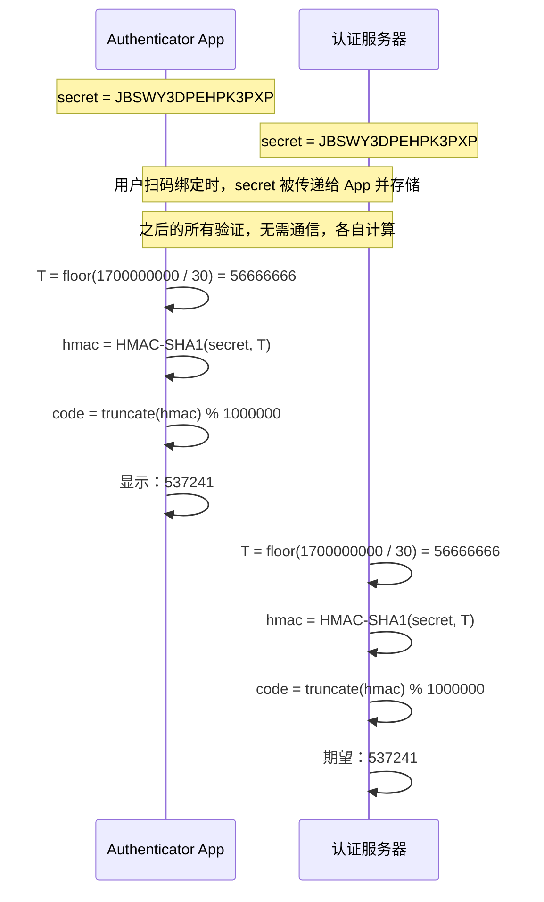
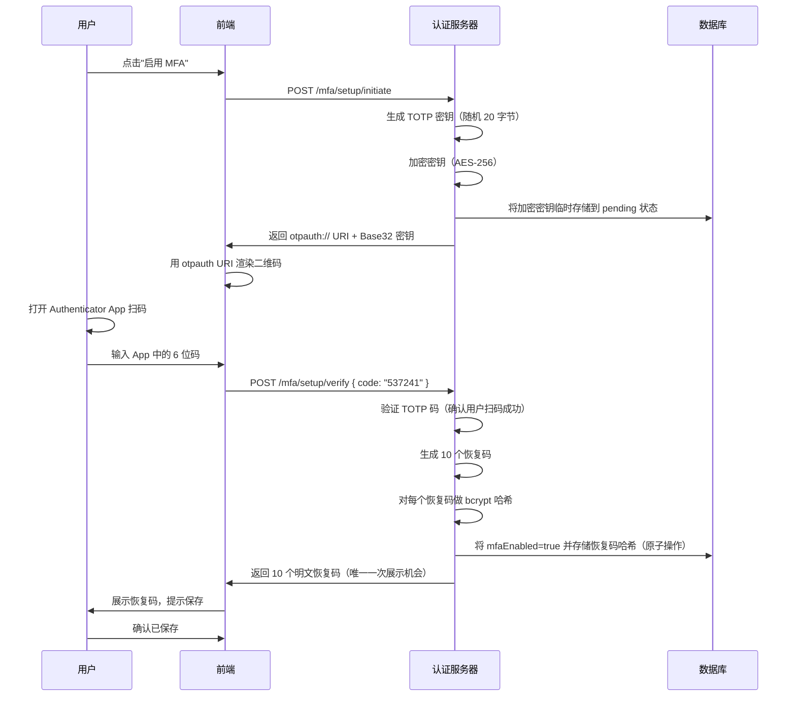
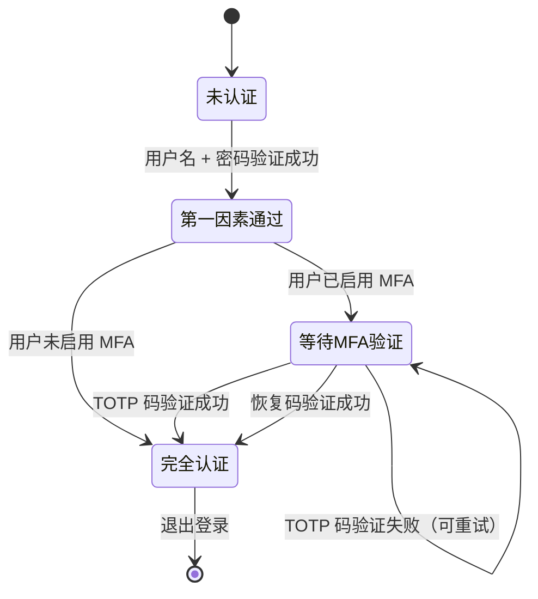

# 多因素认证（MFA）

## 本篇导读

### 核心目标

学完本篇后，你将能够：

- 深入理解 TOTP（基于时间的一次性密码）的数学原理，知道它为什么安全、又有哪些局限性
- 在 NestJS 认证服务中实现完整的 MFA 注册流程：生成密钥、生成二维码、用户扫码绑定
- 实现 TOTP 验证流程：登录后的二次验证、容忍时间偏差的验证窗口设计
- 生成并安全存储恢复码（Recovery Code），当用户丢失设备时能够通过恢复码找回账号
- 理解 MFA 的备用方案设计：短信 OTP 作为降级选项的适用场景与局限
- 掌握 MFA 的安全边界：Replay Attack 防护、绑定流程的安全性、用户体验与安全性的平衡

### 重点与难点

**重点**：

- TOTP 的时间同步机制——客户端和服务端如何在不通信的情况下生成相同的一次性密码
- Base32 密钥的生成与存储——为什么要用 Base32 而不是 Base64，密钥的熵（随机性）要求
- 二维码的内容格式——`otpauth://` URI 格式，Authenticator App 如何解析扫码内容
- 恢复码的设计原则——一次性、不可预测、安全存储（哈希而非明文）

**难点**：

- 时间窗口容忍的边界——为什么要允许前后各 1 个窗口的偏差，以及这样做的安全影响
- Replay Attack（重放攻击）防护——如何防止同一个 TOTP 码被使用两次
- MFA 绑定流程的原子性——绑定流程中途失败应该如何回滚，防止出现"半绑定"状态
- 会话中 MFA 状态的跟踪——在 Session 或 JWT 中如何标记用户是否已完成 MFA 验证

## TOTP 核心原理

### 什么是一次性密码

传统密码是 **静态** 的：你设置一个密码，这个密码可以反复使用，直到你修改它为止。这带来一个显而易见的问题：密码一旦泄露，攻击者就可以一直使用它。

一次性密码（OTP，One-Time Password）的核心思想是：每次使用的密码都不同，用完即废。攻击者即使截获了你上一次使用的密码，对下一次登录也毫无帮助。

OTP 有两大主流变体：

- **HOTP（基于计数器的一次性密码）**：每用一次计数器加一，密码根据计数器值生成。问题是客户端和服务端的计数器容易失去同步。
- **TOTP（基于时间的一次性密码）**：用当前时间作为"计数器"，每 30 秒生成一个新密码。客户端和服务端只要时间同步，就能独立生成相同的密码，无需网络交互。

我们使用的是 TOTP，也是 Google Authenticator、Microsoft Authenticator 等主流 App 默认使用的算法，由 RFC 6238 定义。

### TOTP 的数学原理

TOTP 的计算方式可以用一行公式概括：

```plaintext
TOTP = HOTP(secret, floor(current_unix_timestamp / 30))
HOTP = Truncate(HMAC-SHA1(secret, counter))
```

让我们逐步拆解：

**第一步：计算时间步长（Time Step）**

```plaintext
T = floor(unix_timestamp / 30)
```

比如当前时间戳是 `1700000000`，那么 `T = floor(1700000000 / 30) = 56666666`。

这意味着在同一个 30 秒窗口内（比如 10:00:00 到 10:00:29），无论你在哪一秒请求，得到的 `T` 值都是相同的，所以生成的密码也是相同的。

**第二步：HMAC-SHA1 计算**

```plaintext
hmac_result = HMAC-SHA1(secret, T_bytes)
```

将共享密钥（secret）和时间步长（T 的大端字节序表示）输入 HMAC-SHA1，得到 20 字节的哈希值。

**第三步：动态截断（Dynamic Truncation）**

HMAC-SHA1 输出 20 字节，我们需要把它变成一个 6 位数字：

1. 取最后 1 字节的低 4 位，得到偏移量 `offset`（值在 0~15 之间）
2. 从 `offset` 开始取 4 字节，忽略最高位（防止符号位影响）
3. 对 `10^6` 取模，得到 6 位数字

```plaintext
offset = hmac_result[19] & 0x0F
code = (hmac_result[offset..offset+4] & 0x7FFFFFFF) % 1_000_000
```

最终的 6 位数字就是当前 TOTP 码。

### 为什么客户端和服务端能独立生成相同的结果

这是 TOTP 最精妙的地方：**整个生成过程不需要任何网络通信**。

客户端（Authenticator App）和服务端各自持有同一份 `secret`，各自读取当前系统时间。因为两端使用了相同的密钥 + 相同的时间步长，HMAC-SHA1 的计算结果必然相同，最终显示的 6 位码也相同。



### 时间偏差容忍机制

现实中，客户端和服务端的时钟不可能完美同步。用户的手机时间可能比服务器慢几秒，或者用户动作稍慢，在 30 秒窗口快结束时才输入，提交时窗口已经切换。

解决方案是在服务端验证时，**不只验证当前时间窗口，还验证前后各 1 个窗口**：

```plaintext
T_current    = floor(now / 30)
T_previous   = T_current - 1  （前一个 30 秒窗口）
T_next       = T_current + 1  （后一个 30 秒窗口）

如果用户提供的 code 与这三个窗口中任意一个匹配，认为验证通过
```

这样，验证有效期实际上是 90 秒（3 个 30 秒窗口），在合理范围内接受时钟偏差和用户操作延迟。

代价是：安全窗口相应扩大为 90 秒。业界普遍认为这是可以接受的权衡，RFC 6238 也建议允许至少前后各 1 个窗口的容忍。

### Replay Attack 防护

TOTP 的一个关键问题是：在 30 秒有效期内，同一个 6 位码可以被提交多次。如果攻击者截获了你刚刚提交的 TOTP 码，他能在过期前用它再登录一次吗？

答案是：**如果不做额外防护，可以**。

防御 Replay Attack 的方案：在 Redis 中记录每个密钥每次成功验证的时间步长，如果同一个时间步长被使用两次，拒绝第二次。

```typescript
// 使用 Redis 记录已用过的时间步长
const usedKey = `totp:used:${userId}:${timeStep}`;
const alreadyUsed = await redis.exists(usedKey);
if (alreadyUsed) {
  throw new UnauthorizedException('TOTP code has already been used');
}
// 标记为已使用，有效期稍大于一个验证窗口（90秒 + 缓冲）
await redis.set(usedKey, '1', 'EX', 120);
```

## MFA 注册流程实现

### 数据库模型设计

在用户表基础上，添加 MFA 相关字段：

```typescript
// drizzle schema
export const users = pgTable('users', {
  id: uuid('id').primaryKey().defaultRandom(),
  email: varchar('email', { length: 255 }).notNull().unique(),
  passwordHash: varchar('password_hash', { length: 255 }),

  // MFA 相关字段
  mfaEnabled: boolean('mfa_enabled').notNull().default(false),
  mfaSecret: varchar('mfa_secret', { length: 255 }), // 加密存储的 TOTP 密钥
  mfaEnabledAt: timestamp('mfa_enabled_at'), // 启用时间（审计用）

  createdAt: timestamp('created_at').notNull().defaultNow(),
  updatedAt: timestamp('updated_at').notNull().defaultNow(),
});

// 恢复码独立存表（一对多关系）
export const mfaRecoveryCodes = pgTable('mfa_recovery_codes', {
  id: uuid('id').primaryKey().defaultRandom(),
  userId: uuid('user_id')
    .notNull()
    .references(() => users.id, { onDelete: 'cascade' }),
  codeHash: varchar('code_hash', { length: 255 }).notNull(), // 哈希存储，不存明文
  usedAt: timestamp('used_at'), // 已使用则记录时间
  createdAt: timestamp('created_at').notNull().defaultNow(),
});
```

**为什么 `mfaSecret` 要加密存储**：`mfa_secret` 是用来生成 TOTP 的根密钥，如果数据库被拖库，攻击者能直接生成有效的 TOTP 码。应该用 AES-256 对称加密后再存库，解密密钥单独保管（环境变量或密钥管理服务）。

**为什么恢复码哈希存储**：和密码一样，恢复码一旦明文存储，数据库泄露后攻击者可以直接用恢复码绑过 MFA。使用 bcrypt 或类似的慢哈希函数对恢复码做哈希存储。

### MFA 注册的完整流程

MFA 注册是一个多步骤流程，需要确保每一步的原子性：



**为什么分两步**：先生成密钥，再验证用户扫码成功，才真正启用 MFA。如果省略验证步骤直接启用，可能出现用户扫码失败但 MFA 已被标记为启用的情况，用户随即被锁在账号外面。

### NestJS 实现

首先安装所需依赖：

```bash
pnpm add otplib qrcode
pnpm add -D @types/qrcode
```

`otplib` 提供 TOTP 生成与验证的标准实现，`qrcode` 用于在服务端生成二维码图片（Base64 Data URL，直接返回给前端渲染）。

**MFA 模块结构**：

```typescript
// src/mfa/mfa.module.ts
import { Module } from '@nestjs/common';
import { MfaController } from './mfa.controller';
import { MfaService } from './mfa.service';

@Module({
  controllers: [MfaController],
  providers: [MfaService],
  exports: [MfaService],
})
export class MfaModule {}
```

**MFA Service 实现**：

```typescript
// src/mfa/mfa.service.ts
import {
  Injectable,
  BadRequestException,
  UnauthorizedException,
} from '@nestjs/common';
import { authenticator } from 'otplib';
import * as QRCode from 'qrcode';
import * as crypto from 'node:crypto';
import * as bcrypt from 'bcrypt';
import { DrizzleService } from '../drizzle/drizzle.service';
import { RedisService } from '../redis/redis.service';
import { users, mfaRecoveryCodes } from '../drizzle/schema';
import { eq, and, isNull } from 'drizzle-orm';

// 用于加密 MFA 密钥的 AES 密钥（应从环境变量获取）
const MFA_ENCRYPTION_KEY = Buffer.from(process.env.MFA_ENCRYPTION_KEY!, 'hex');

@Injectable()
export class MfaService {
  constructor(
    private readonly drizzle: DrizzleService,
    private readonly redis: RedisService
  ) {}

  // ─── 密钥加解密 ───────────────────────────────────────────────────────────

  private encryptSecret(secret: string): string {
    const iv = crypto.randomBytes(16);
    const cipher = crypto.createCipheriv('aes-256-gcm', MFA_ENCRYPTION_KEY, iv);
    const encrypted = Buffer.concat([
      cipher.update(secret, 'utf8'),
      cipher.final(),
    ]);
    const authTag = cipher.getAuthTag();
    // 格式：iv(hex) : authTag(hex) : ciphertext(hex)
    return `${iv.toString('hex')}:${authTag.toString('hex')}:${encrypted.toString('hex')}`;
  }

  private decryptSecret(stored: string): string {
    const [ivHex, authTagHex, ciphertextHex] = stored.split(':');
    const iv = Buffer.from(ivHex, 'hex');
    const authTag = Buffer.from(authTagHex, 'hex');
    const ciphertext = Buffer.from(ciphertextHex, 'hex');
    const decipher = crypto.createDecipheriv(
      'aes-256-gcm',
      MFA_ENCRYPTION_KEY,
      iv
    );
    decipher.setAuthTag(authTag);
    return decipher.update(ciphertext) + decipher.final('utf8');
  }

  // ─── MFA 注册流程 ─────────────────────────────────────────────────────────

  async initiateMfaSetup(userId: string, userEmail: string) {
    // 检查是否已启用 MFA
    const [user] = await this.drizzle.db
      .select()
      .from(users)
      .where(eq(users.id, userId))
      .limit(1);

    if (user.mfaEnabled) {
      throw new BadRequestException('MFA is already enabled for this account');
    }

    // 生成 TOTP 密钥（otplib 默认生成 Base32 格式的 20 字节随机密钥）
    const secret = authenticator.generateSecret(20);

    // 加密后临时存储到 Redis（有效期 10 分钟，等待用户完成扫码验证）
    const pendingKey = `mfa:pending:${userId}`;
    await this.redis.client.set(pendingKey, secret, 'EX', 600);

    // 生成 otpauth:// URI（供 Authenticator App 解析）
    const otpauthUrl = authenticator.keyuri(userEmail, 'MyApp', secret);

    // 生成二维码 Data URL
    const qrCodeDataUrl = await QRCode.toDataURL(otpauthUrl);

    return {
      qrCodeDataUrl,
      // 同时返回明文 Base32 密钥，供用户手动输入（一些老款 App 不支持 URI 格式）
      manualEntryKey: secret,
    };
  }

  async verifyAndEnableMfa(userId: string, totpCode: string) {
    // 从 Redis 取出临时密钥
    const pendingKey = `mfa:pending:${userId}`;
    const secret = await this.redis.client.get(pendingKey);

    if (!secret) {
      throw new BadRequestException(
        'MFA setup session expired. Please start over.'
      );
    }

    // 验证 TOTP 码（使用宽松模式，允许前后各 1 个窗口的偏差）
    authenticator.options = { window: 1 };
    const isValid = authenticator.verify({ token: totpCode, secret });

    if (!isValid) {
      throw new UnauthorizedException(
        'Invalid TOTP code. Please check your Authenticator App and try again.'
      );
    }

    // 生成 10 个恢复码（每个 16 字节，Base32 编码后约 26 字符）
    const recoveryCodes = Array.from({ length: 10 }, () =>
      crypto.randomBytes(10).toString('base64url').toUpperCase().slice(0, 16)
    );

    // 哈希恢复码（使用 bcrypt，cost factor 10）
    const recoveryCodeHashes = await Promise.all(
      recoveryCodes.map((code) => bcrypt.hash(code, 10))
    );

    // 在数据库事务中原子性地完成：启用 MFA + 加密存储密钥 + 存储恢复码哈希
    const encryptedSecret = this.encryptSecret(secret);

    await this.drizzle.db.transaction(async (tx) => {
      // 更新用户：启用 MFA，存储加密密钥
      await tx
        .update(users)
        .set({
          mfaEnabled: true,
          mfaSecret: encryptedSecret,
          mfaEnabledAt: new Date(),
        })
        .where(eq(users.id, userId));

      // 插入恢复码哈希
      await tx.insert(mfaRecoveryCodes).values(
        recoveryCodeHashes.map((hash) => ({
          userId,
          codeHash: hash,
        }))
      );
    });

    // 清除 Redis 临时密钥
    await this.redis.client.del(pendingKey);

    // 返回明文恢复码（此为唯一一次机会）
    return { recoveryCodes };
  }

  // ─── TOTP 验证（登录时使用）─────────────────────────────────────────────

  async verifyTotp(userId: string, totpCode: string): Promise<boolean> {
    const [user] = await this.drizzle.db
      .select()
      .from(users)
      .where(and(eq(users.id, userId), eq(users.mfaEnabled, true)))
      .limit(1);

    if (!user || !user.mfaSecret) {
      return false;
    }

    const secret = this.decryptSecret(user.mfaSecret);

    // 计算当前时间步长（用于 Replay Attack 防护）
    const timeStep = Math.floor(Date.now() / 1000 / 30);

    // 检查是否已使用过（Replay Attack 防护）
    const usedKey = `totp:used:${userId}:${timeStep}`;
    const alreadyUsed = await this.redis.client.exists(usedKey);
    if (alreadyUsed) {
      throw new UnauthorizedException(
        'This TOTP code has already been used. Please wait for the next code.'
      );
    }

    authenticator.options = { window: 1 };
    const isValid = authenticator.verify({ token: totpCode, secret });

    if (isValid) {
      // 标记该时间步长已被使用（过期时间 120 秒，覆盖 ±1 窗口范围）
      await this.redis.client.set(usedKey, '1', 'EX', 120);
    }

    return isValid;
  }

  // ─── 恢复码验证 ───────────────────────────────────────────────────────────

  async verifyRecoveryCode(userId: string, code: string): Promise<boolean> {
    // 获取该用户所有未使用的恢复码
    const codes = await this.drizzle.db
      .select()
      .from(mfaRecoveryCodes)
      .where(
        and(
          eq(mfaRecoveryCodes.userId, userId),
          isNull(mfaRecoveryCodes.usedAt)
        )
      );

    // 逐一比对（bcrypt 比对是恒时的，不存在时序攻击）
    for (const recoveryCode of codes) {
      const match = await bcrypt.compare(code, recoveryCode.codeHash);
      if (match) {
        // 标记为已使用
        await this.drizzle.db
          .update(mfaRecoveryCodes)
          .set({ usedAt: new Date() })
          .where(eq(mfaRecoveryCodes.id, recoveryCode.id));
        return true;
      }
    }

    return false;
  }

  // ─── 禁用 MFA ─────────────────────────────────────────────────────────────

  async disableMfa(userId: string, totpCode: string) {
    // 必须先验证 TOTP，才允许禁用 MFA（防止攻击者在无人值守的机器上操作）
    const isValid = await this.verifyTotp(userId, totpCode);
    if (!isValid) {
      throw new UnauthorizedException('Invalid TOTP code');
    }

    await this.drizzle.db.transaction(async (tx) => {
      await tx
        .update(users)
        .set({ mfaEnabled: false, mfaSecret: null, mfaEnabledAt: null })
        .where(eq(users.id, userId));

      // 删除所有恢复码
      await tx
        .delete(mfaRecoveryCodes)
        .where(eq(mfaRecoveryCodes.userId, userId));
    });
  }
}
```

**MFA Controller**：

```typescript
// src/mfa/mfa.controller.ts
import {
  Controller,
  Post,
  Body,
  Req,
  UseGuards,
  HttpCode,
  HttpStatus,
} from '@nestjs/common';
import { MfaService } from './mfa.service';
import { JwtAuthGuard } from '../auth/guards/jwt-auth.guard';
import { MfaVerifyDto } from './dto/mfa-verify.dto';

@Controller('mfa')
@UseGuards(JwtAuthGuard) // 所有 MFA 操作都需要先完成第一因素认证
export class MfaController {
  constructor(private readonly mfaService: MfaService) {}

  @Post('setup/initiate')
  async initiateMfaSetup(@Req() req: any) {
    return this.mfaService.initiateMfaSetup(req.user.id, req.user.email);
  }

  @Post('setup/verify')
  @HttpCode(HttpStatus.OK)
  async verifyAndEnable(@Req() req: any, @Body() dto: MfaVerifyDto) {
    return this.mfaService.verifyAndEnableMfa(req.user.id, dto.code);
  }

  @Post('disable')
  @HttpCode(HttpStatus.OK)
  async disableMfa(@Req() req: any, @Body() dto: MfaVerifyDto) {
    await this.mfaService.disableMfa(req.user.id, dto.code);
    return { message: 'MFA has been disabled' };
  }
}
```

## MFA 登录验证流程

### 两阶段登录的会话设计

启用了 MFA 的用户登录时，需要经过两个阶段：



**"第一因素通过"状态**是一个临时状态，代表用户已通过密码验证但尚未完成 MFA 验证。必须在服务端维护这个状态，不能只靠前端控制，否则攻击者可以直接跳过 MFA 步骤。

### 使用 Redis 跟踪 MFA 等待状态

在 JWT 体系中，一个常见的设计是：

**方案 A：颁发"半令牌（Half Token）"**

密码验证通过后，颁发一个短期的临时 JWT，其中包含 `mfaRequired: true` 声明。这个临时 JWT 只能访问 `/auth/mfa/verify` 接口，不能访问任何业务接口。MFA 验证通过后，颁发正式 JWT。

**方案 B：Redis 临时状态 + Session ID**

密码验证通过后，在 Redis 中写入一条 `mfa:pending:{randomSessionId}` 记录，返回 `sessionId` 给前端。前端携带 `sessionId` 提交 TOTP 码，验证通过后颁发正式 JWT。

方案 A 实现更简洁，方案 B 对前端无需引入"中间状态 JWT"的概念。本篇以方案 A 为例实现。

**半令牌（Half Token）实现**：

```typescript
// src/auth/auth.service.ts 中的登录逻辑

async login(email: string, password: string): Promise<LoginResult> {
  const user = await this.validateUserCredentials(email, password);

  if (!user) {
    throw new UnauthorizedException('Invalid credentials');
  }

  // 如果用户未启用 MFA，直接返回完整 Token
  if (!user.mfaEnabled) {
    return {
      type: 'complete',
      accessToken: this.issueAccessToken(user),
      refreshToken: this.issueRefreshToken(user),
    };
  }

  // 用户已启用 MFA，颁发半令牌
  // 半令牌有效期 5 分钟（足够用户完成 MFA 验证）
  const halfToken = this.jwtService.sign(
    { sub: user.id, email: user.email, mfaPending: true },
    { expiresIn: '5m', secret: process.env.JWT_MFA_SECRET },
  );

  return {
    type: 'mfa_required',
    mfaToken: halfToken,
  };
}

async completeMfaLogin(userId: string, totpCode: string): Promise<CompleteLoginResult> {
  // 尝试 TOTP 验证
  const totpValid = await this.mfaService.verifyTotp(userId, totpCode);
  if (totpValid) {
    const user = await this.usersService.findById(userId);
    return {
      accessToken: this.issueAccessToken(user),
      refreshToken: this.issueRefreshToken(user),
    };
  }

  // 尝试恢复码验证
  const recoveryValid = await this.mfaService.verifyRecoveryCode(userId, totpCode);
  if (recoveryValid) {
    const user = await this.usersService.findById(userId);
    return {
      accessToken: this.issueAccessToken(user),
      refreshToken: this.issueRefreshToken(user),
    };
  }

  throw new UnauthorizedException('Invalid MFA code');
}
```

**半令牌守卫**：

```typescript
// src/auth/guards/mfa-token.guard.ts
import { Injectable, UnauthorizedException } from '@nestjs/common';
import { AuthGuard } from '@nestjs/passport';

@Injectable()
export class MfaTokenGuard extends AuthGuard('mfa-jwt') {}

// 对应的 Passport 策略——验证半令牌
// src/auth/strategies/mfa-jwt.strategy.ts
import { Injectable } from '@nestjs/common';
import { PassportStrategy } from '@nestjs/passport';
import { ExtractJwt, Strategy } from 'passport-jwt';

@Injectable()
export class MfaJwtStrategy extends PassportStrategy(Strategy, 'mfa-jwt') {
  constructor() {
    super({
      jwtFromRequest: ExtractJwt.fromAuthHeaderAsBearerToken(),
      secretOrKey: process.env.JWT_MFA_SECRET,
    });
  }

  async validate(payload: any) {
    if (!payload.mfaPending) {
      throw new UnauthorizedException('Invalid MFA token');
    }
    return { id: payload.sub, email: payload.email };
  }
}
```

**MFA 验证接口**：

```typescript
// src/auth/auth.controller.ts（部分）

@Post('mfa/verify')
@UseGuards(MfaTokenGuard)  // 需要携带半令牌
@HttpCode(HttpStatus.OK)
async verifyMfa(@Req() req: any, @Body() dto: MfaVerifyDto) {
  return this.authService.completeMfaLogin(req.user.id, dto.code);
}
```

## 恢复码设计与管理

### 恢复码的设计原则

恢复码是用户在手机丢失或 Authenticator App 损坏时，绕过 MFA 找回账号的最后手段。设计时需满足：

**不可预测**：恢复码必须是密码学安全的随机数生成的，不能用 UUID v4（虽然 UUID 也是随机的，但 UUID 的字符集和格式是公开的，搜索空间比完全随机的字节流小）。上面的实现使用 `crypto.randomBytes(10)` 生成 80 位随机数，搜索空间约为 $2^{80}$，在合理有效期内无法暴力破解。

**一次性**：每个恢复码只能使用一次。用完后标记为已使用，不可复用。

**数量合适**：通常生成 8~12 个。太少用户可能用完；太多用户可能不认真对待，随意丢弃。

**安全存储**：恢复码和密码具有等同的安全等级，必须哈希存储，不存明文。

**展示时机**：明文恢复码只在用户完成 MFA 绑定时展示一次，之后服务端不再保存明文，用户必须在这一次妥善保存。

### 恢复码展示 UI 设计建议

生成的恢复码应以易于阅读和备份的格式展示：

```plaintext
你的 MFA 恢复码（保存后无法再次查看）

  ABCD-EFGH-IJKL     MNOP-QRST-UVWX
  1234-5678-9012     AABC-DDEE-FFGG
  XYZW-VUTS-RQPO     NMLK-JIHG-FEDC
  8765-4321-AABC     DDEE-FFGG-HHII
  JJKK-LLMM-NNOO     PPQQ-RRSS-TTUU

  ⚠️  每个恢复码只能使用一次
  ⚠️  请将这些码保存在安全的地方（密码管理器 / 打印并锁入保险箱）
  ⚠️  关闭此页面后将无法再次查看

  [下载文本文件]  [复制全部]
```

格式建议：将每个恢复码分成若干组，用连字符分隔（类似信用卡号的分组方式），方便人眼阅读和手动输入。

### 恢复码剩余数量警告

当用户已使用了大部分恢复码时，应该提醒用户重新生成：

```typescript
// 获取恢复码状态
async getRecoveryCodeStatus(userId: string) {
  const total = await this.drizzle.db
    .select({ count: sql<number>`count(*)` })
    .from(mfaRecoveryCodes)
    .where(eq(mfaRecoveryCodes.userId, userId));

  const used = await this.drizzle.db
    .select({ count: sql<number>`count(*)` })
    .from(mfaRecoveryCodes)
    .where(and(
      eq(mfaRecoveryCodes.userId, userId),
      isNotNull(mfaRecoveryCodes.usedAt),
    ));

  const remaining = total[0].count - used[0].count;

  return {
    remaining,
    total: total[0].count,
    shouldRegenerate: remaining <= 2,  // 剩余 2 个以下发出警告
  };
}

// 重新生成恢复码（需要 TOTP 验证）
async regenerateRecoveryCodes(userId: string, totpCode: string) {
  const isValid = await this.verifyTotp(userId, totpCode);
  if (!isValid) {
    throw new UnauthorizedException('Invalid TOTP code');
  }

  const newCodes = Array.from({ length: 10 }, () =>
    crypto.randomBytes(10).toString('base64url').toUpperCase().slice(0, 16),
  );
  const newHashes = await Promise.all(newCodes.map((code) => bcrypt.hash(code, 10)));

  await this.drizzle.db.transaction(async (tx) => {
    // 删除旧恢复码（包括已使用和未使用的）
    await tx.delete(mfaRecoveryCodes).where(eq(mfaRecoveryCodes.userId, userId));
    // 插入新恢复码
    await tx.insert(mfaRecoveryCodes).values(
      newHashes.map((hash) => ({ userId, codeHash: hash })),
    );
  });

  return { recoveryCodes: newCodes };
}
```

## 备用方案：短信 OTP

### 短信 OTP 的定位

短信 OTP（发送 6 位数字到手机）是最广为人知的二因素验证方式。它确实提供了比纯密码更高的安全性，但在安全专业人士中争议较多。

**短信 OTP 的局限性**：

**SIM 卡互换攻击（SIM Swapping）**：攻击者联系电话运营商，通过社会工程学手段（伪造身份证件、欺骗客服）将受害者的手机号转移到攻击者控制的 SIM 卡上。之后无论受害者的手机接收到什么短信，攻击者的手机都会同步收到。这种攻击曾被用于入侵多位知名人士和加密货币交易所账户。

**短信拦截**：在部分国家，协议层（SS7）存在已知漏洞，允许对短信进行监听。虽然这要求攻击者具备电信运营商级别的访问权限，但它是真实存在的威胁。

**基础设施依赖**：短信发送依赖第三方服务商（Twilio、阿里云短信等），服务商宕机会导致用户无法登录。

**场景适用性**：短信 OTP 仍然比"无 MFA"安全很多。在以下场景可以考虑使用短信 OTP 作为 MFA 的补充（而非替代）：

- 用于账号找回流程（验证用户身份，而非主要 MFA 因素）
- 用于高风险操作的二次确认（修改密码、绑定支付方式）
- 无法使用 TOTP 的用户的降级选项（老年用户等）

### 短信 OTP 的实现

```typescript
// src/sms/sms-otp.service.ts
import { Injectable } from '@nestjs/common';
import { RedisService } from '../redis/redis.service';
import * as crypto from 'node:crypto';

@Injectable()
export class SmsOtpService {
  constructor(private readonly redis: RedisService) {}

  async sendOtp(phone: string, purpose: 'login' | 'verify'): Promise<void> {
    // 频率限制：同一号码 1 分钟内只能发送 1 次
    const rateLimitKey = `sms:ratelimit:${phone}`;
    const rateLimited = await this.redis.client.exists(rateLimitKey);
    if (rateLimited) {
      throw new Error('Please wait before requesting another SMS code.');
    }

    // 生成 6 位 OTP（使用密码学安全随机数）
    const otp = crypto.randomInt(100000, 999999).toString();

    // 存储到 Redis（5 分钟过期，带频率限制）
    const otpKey = `sms:otp:${purpose}:${phone}`;
    await this.redis.client.set(otpKey, otp, 'EX', 300);
    await this.redis.client.set(rateLimitKey, '1', 'EX', 60);

    // 调用短信服务商 API 发送（此处省略具体实现）
    await this.sendSmsViaProvider(
      phone,
      `Your verification code is: ${otp}. Valid for 5 minutes.`
    );
  }

  async verifyOtp(
    phone: string,
    purpose: 'login' | 'verify',
    code: string
  ): Promise<boolean> {
    const otpKey = `sms:otp:${purpose}:${phone}`;
    const stored = await this.redis.client.get(otpKey);

    if (!stored) {
      return false;
    }

    // 使用恒时比较，防止时序攻击
    const isMatch = crypto.timingSafeEqual(
      Buffer.from(stored),
      Buffer.from(code)
    );

    if (isMatch) {
      // 使用后立即删除（一次性）
      await this.redis.client.del(otpKey);
    }

    return isMatch;
  }

  private async sendSmsViaProvider(
    phone: string,
    message: string
  ): Promise<void> {
    // 调用第三方短信 API（Twilio / 阿里云 / 腾讯云等）
    // 具体实现取决于使用的服务商 SDK
  }
}
```

## otpauth URI 格式详解

Authenticator App 扫码时，解析的是二维码中编码的 `otpauth://` URI。理解这个格式对调试非常有帮助：

```plaintext
otpauth://totp/{Label}?secret={Secret}&issuer={Issuer}&algorithm={Algorithm}&digits={Digits}&period={Period}
```

各参数说明：

| 参数        | 说明                                              | 默认值   | 示例                     |
| ----------- | ------------------------------------------------- | -------- | ------------------------ |
| `Label`     | 在 App 中显示的账号标识，建议格式：`Issuer:email` | 无默认值 | `MyApp:user@example.com` |
| `secret`    | Base32 编码的共享密钥                             | 必填     | `JBSWY3DPEHPK3PXP`       |
| `issuer`    | 服务名称（防止同名 Label 混淆）                   | 无       | `MyApp`                  |
| `algorithm` | HMAC 哈希算法                                     | `SHA1`   | `SHA1` / `SHA256`        |
| `digits`    | OTP 位数                                          | `6`      | `6`                      |
| `period`    | 时间步长（秒）                                    | `30`     | `30`                     |

**注意**：虽然 TOTP 规范支持 SHA256、SHA512 和更长的 OTP，但大多数 Authenticator App（包括 Google Authenticator）只支持 SHA1 + 6 位数 + 30 秒。为了最大兼容性，使用默认值即可。

一个完整的 URI 示例：

```plaintext
otpauth://totp/MyApp:user@example.com?secret=JBSWY3DPEHPK3PXP&issuer=MyApp&algorithm=SHA1&digits=6&period=30
```

## 常见问题与解决方案

### TOTP 验证一直失败

**问题**：用户扫码后，每次输入 Authenticator App 显示的 6 位码，服务端都返回"Invalid TOTP code"。

**排查步骤**：

1. **检查服务器时钟**：TOTP 最依赖时间同步。用 `date -u` 命令查看服务器的 UTC 时间，与真实时间对比。偏差超过 30 秒就会导致持续验证失败。

   ```bash
   # 检查服务器时间与 NTP 时间的偏差
   ntpdate -q pool.ntp.org
   ```

   解决方案：在服务器上启用并同步 NTP 时间服务（`timedatectl set-ntp true`）。

2. **检查窗口容忍设置**：确认 `authenticator.options = { window: 1 }` 被正确设置。不设置的话默认 `window: 0`，即不容忍任何时间偏差。

3. **检查密钥传递**：确认存储的密钥和 Authenticator App 扫到的密钥是同一个值，没有经过二次编码或截断。

4. **调试时打印时间步长**：

   ```typescript
   const timeStep = Math.floor(Date.now() / 1000 / 30);
   console.log('Current time step:', timeStep);
   console.log('Expected code:', authenticator.generate(secret));
   ```

### 恢复码验证慢

**问题**：用户输入恢复码后，服务端响应很慢（可能超过 10 秒）。

**原因**：bcrypt 是慢哈希函数，用 `cost factor 10` 哈希一个恢复码大约需要 100ms。如果用户有 10 个未使用的恢复码，最坏情况需要比对所有 10 个，总耗时约 1 秒。如果 `cost factor` 更高，时间会指数级增长。

**优化方案**：

恢复码的使用场景极低频（用户通常几年才用一次）。10 个恢复码的顺序比对耗时约 1 秒，属于可接受范围。如果需要进一步优化：

- 在恢复码表中加索引，直接按前 N 位字符过滤，缩小比对范围
- 或者使用固定格式（如前 4 字节 + 哈希），先快速过滤再精确比对

```typescript
// 优化版：将恢复码前 8 位作为查找索引
// 恢复码格式：ABCDEFGH-xxxx
// 数据库额外存储 prefix 字段

async verifyRecoveryCode(userId: string, code: string): Promise<boolean> {
  const prefix = code.slice(0, 8).toUpperCase();

  // 只取具有匹配前缀的恢复码，大幅缩小比对范围
  const candidates = await this.drizzle.db
    .select()
    .from(mfaRecoveryCodes)
    .where(and(
      eq(mfaRecoveryCodes.userId, userId),
      eq(mfaRecoveryCodes.prefix, prefix),
      isNull(mfaRecoveryCodes.usedAt),
    ));

  for (const candidate of candidates) {
    const match = await bcrypt.compare(code, candidate.codeHash);
    if (match) {
      await this.markRecoveryCodeUsed(candidate.id);
      return true;
    }
  }
  return false;
}
```

### MFA 绑定中途退出，账号状态异常

**问题**：用户点击"启用 MFA"后，服务端生成了密钥并存储（`mfaEnabled=false`，但 `mfaSecret` 不为空），用户直接关闭页面，留下一个不完整的中间状态。

**本篇方案**：密钥临时存储在 Redis（10 分钟过期），而非数据库。只有在用户成功验证 TOTP 码后，才在数据库事务中原子性地写入密钥并设置 `mfaEnabled=true`。用户中途退出，Redis 中的临时密钥自动过期，数据库保持干净。

这是这个设计最重要的安全价值：**绑定流程的原子性**，不会产生"半绑定"状态。

### 用户换了新手机，MFA 如何迁移

**场景**：用户买了新手机，Authenticator App 中的 TOTP 配置没有迁移，旧手机也已废弃或初始化。

**解决方案**：

1. 用户通过恢复码完成本次登录（恢复码走账号恢复路径）
2. 登录后，用户先禁用 MFA（此时可以不需要 TOTP，只需恢复码验证）
3. 然后重新启用 MFA，扫码绑定新手机上的 Authenticator App

这个流程确保了"丢失设备"这一场景的完整覆盖。预防性建议：提醒用户在设置 MFA 时，使用支持 iCloud/Google Drive 备份的 Authenticator App（如 Authy、1Password 内置的 TOTP），或者使用硬件密钥（YubiKey）作为更强的 MFA 因素。

## 本篇小结

本篇实现了一套生产级的 MFA（多因素认证）系统，涵盖了从原理到代码的完整链路。

**TOTP 原理**：TOTP 是 HMAC-SHA1 + 时间步长的组合，客户端和服务端共享密钥，各自独立计算不需要网络通信。30 秒一个窗口，加上服务端允许前后各 1 个窗口的容忍，有效解决了时钟微偏差问题。

**安全设计的三个关键点**：

- TOTP 密钥用 AES-256-GCM 加密存储，数据库泄露不等于 MFA 失效
- Replay Attack 防护：每个时间步长只能使用一次，已使用的步长在 Redis 中标记 120 秒
- 绑定流程原子性：临时密钥存 Redis，只有验证成功才写入数据库，杜绝半绑定状态

**恢复码**：密码学随机生成、一次性使用、bcrypt 哈希存储，只在绑定时明文展示一次。剩余数量过少时主动提醒用户重新生成。

**两阶段登录**：密码验证通过后颁发短期半令牌（`mfaPending: true`），只允许访问 MFA 验证接口。MFA 验证通过后颁发完整业务令牌。半令牌由独立的 JWT Secret 签名，与业务令牌完全隔离。

至此，认证系统具备了多因素认证能力，显著提升了账号安全性。
