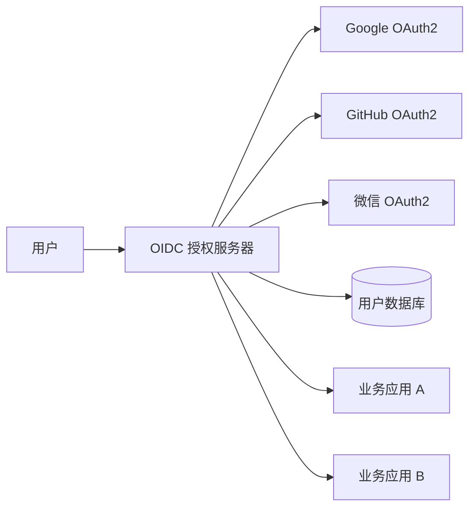
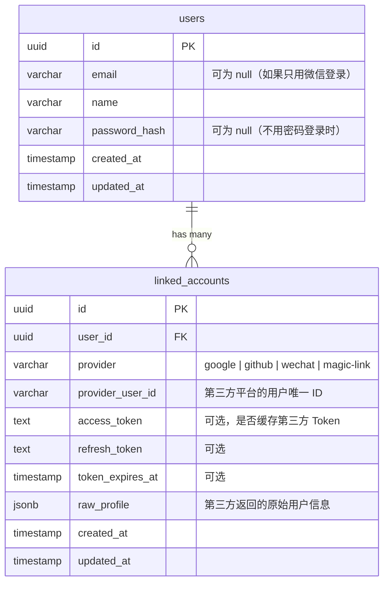

# 第三方登录项目初始化

## 本篇导读

### 核心目标

学完本篇后，你将能够：

- 理解为什么要把第三方登录集成到 OIDC 授权服务器（而不是单独部署）
- 设计支持多种第三方登录的数据库表结构
- 用 Drizzle ORM 实现 `linked_accounts` 表和相关 Schema
- 配置多个 OAuth2 提供方的环境变量和配置管理模块
- 理解"账号关联"的核心模型：一个本地用户账号可以绑定多个第三方登录方式

### 重点与难点

**重点**：

- `linked_accounts` 表的设计——`provider` + `provider_user_id` 的唯一组合
- 统一的 OAuth2 回调处理模式：不管是 Google、GitHub 还是微信，回调逻辑相同
- 配置管理：每个 Provider 的 `clientId`、`clientSecret`、Scope、回调 URL 如何组织

**难点**：

- 账号关联 vs 账号合并的区别——什么情况下要关联，什么情况下要合并？
- 首次第三方登录时的账号创建策略——自动创建 vs 要求绑定已有账号
- 事务保证：创建用户和创建 `linked_account` 记录必须在同一个事务里

## 集成策略：为什么不单独部署

在开始写代码之前，先想清楚架构决策：第三方登录应该集成到哪里？

### 方案一：集成到 OIDC 授权服务器

用户点击"用 Google 登录" → OIDC 授权服务器处理 Google OAuth2 流程 → 找到或创建本地用户 → 建立 SSO Session → 发出 ID Token 给业务应用



优点：

- 所有登录方式统一管理，业务应用无感知（只看到 OIDC 协议的 ID Token）
- SSO 天然支持——无论用户用哪种方式登录，都建立同一套 SSO Session
- 账号体系统一管理（linked_accounts 只在认证服务里维护）

### 方案二：每个业务应用独立集成

每个业务应用分别接入 Google、GitHub 等，各自维护用户数据。

缺点：重复代码、无法 SSO、账号体系碎片化。

**结论**：集成到 OIDC 授权服务器是正确的做法，也是本教程采用的方案。

## 数据模型设计

### 核心概念：一用户多登录方式

数据模型的核心是：一个本地用户账号（`users` 表中的一条记录）可以通过多种方式登录：

- 用户名 + 密码（传统方式）
- Google 账号
- GitHub 账号
- 微信扫码
- Magic Link（邮箱）

这些登录方式通过 `linked_accounts` 表与 `users` 表关联。



关键约束：

- `(provider, provider_user_id)` 联合唯一——同一个第三方账号只能关联到一个本地用户
- `user_id` + `provider` 联合唯一——一个本地用户每种 Provider 只能绑定一个账号（防止重复绑定同一 Provider 的不同账号）

### Drizzle ORM Schema

```typescript
// src/db/schema/linked-accounts.ts
import {
  pgTable,
  uuid,
  varchar,
  text,
  timestamp,
  jsonb,
  unique,
} from 'drizzle-orm/pg-core';
import { sql } from 'drizzle-orm';
import { users } from './users';

export type OAuthProvider = 'google' | 'github' | 'wechat' | 'magic-link';

export const linkedAccounts = pgTable(
  'linked_accounts',
  {
    id: uuid('id')
      .primaryKey()
      .default(sql`gen_random_uuid()`),

    userId: uuid('user_id')
      .notNull()
      .references(() => users.id, { onDelete: 'cascade' }),

    // 登录提供方标识
    provider: varchar('provider', { length: 50 })
      .$type<OAuthProvider>()
      .notNull(),

    // 该提供方下用户的唯一 ID
    // Google: sub 字段
    // GitHub: id 字段（数字字符串）
    // 微信: unionid（推荐）或 openid
    providerUserId: varchar('provider_user_id', { length: 255 }).notNull(),

    // 可选：缓存第三方 Access Token（用于代表用户调用第三方 API）
    accessToken: text('access_token'),
    refreshToken: text('refresh_token'),
    tokenExpiresAt: timestamp('token_expires_at'),

    // 第三方返回的原始用户信息（调试和未来扩展用）
    rawProfile: jsonb('raw_profile'),

    createdAt: timestamp('created_at').defaultNow().notNull(),
    updatedAt: timestamp('updated_at').defaultNow().notNull(),
  },
  (table) => ({
    // 核心约束：同一提供方下，用户 ID 全局唯一
    providerUserUnique: unique('linked_accounts_provider_user_unique').on(
      table.provider,
      table.providerUserId
    ),
    // 一个本地用户每个 Provider 只能绑定一个账号
    userProviderUnique: unique('linked_accounts_user_provider_unique').on(
      table.userId,
      table.provider
    ),
  })
);

export type LinkedAccount = typeof linkedAccounts.$inferSelect;
export type NewLinkedAccount = typeof linkedAccounts.$inferInsert;
```

### 更新 users 表

第三方登录的用户可能没有密码（只用 Google 登录），email 也可能为空（比如微信 OAuth2 默认不返回邮箱）：

```typescript
// src/db/schema/users.ts
export const users = pgTable('users', {
  id: uuid('id')
    .primaryKey()
    .default(sql`gen_random_uuid()`),
  email: varchar('email', { length: 255 }).unique(), // 移除 notNull 约束
  name: varchar('name', { length: 255 }).notNull(),
  avatarUrl: text('avatar_url'),
  passwordHash: text('password_hash'), // 移除 notNull 约束，第三方登录用户没有密码
  createdAt: timestamp('created_at').defaultNow().notNull(),
  updatedAt: timestamp('updated_at').defaultNow().notNull(),
});
```

### 生成迁移文件

```bash
# 生成迁移 SQL
pnpm drizzle-kit generate

# 应用迁移
pnpm drizzle-kit migrate
```

## 配置管理

每个 OAuth Provider 需要 `clientId`、`clientSecret`、scope、回调 URL 等配置。使用 NestJS 的 `ConfigModule` + Zod 验证统一管理。

### 环境变量

```bash
# .env
# 应用基础 URL（用于构造回调地址）
APP_BASE_URL=https://auth.example.com

# Google OAuth2
GOOGLE_CLIENT_ID=your_google_client_id
GOOGLE_CLIENT_SECRET=your_google_client_secret

# GitHub OAuth2
GITHUB_CLIENT_ID=your_github_client_id
GITHUB_CLIENT_SECRET=your_github_client_secret

# 微信开放平台
WECHAT_APP_ID=your_wechat_app_id
WECHAT_APP_SECRET=your_wechat_app_secret

# 邮件发送（Magic Link 用）
SMTP_HOST=smtp.example.com
SMTP_PORT=587
SMTP_USER=noreply@example.com
SMTP_PASS=your_smtp_password
SMTP_FROM=noreply@example.com
```

### 配置验证 Schema

```typescript
// src/config/oauth.config.ts
import { z } from 'zod/v4';

export const oauthConfigSchema = z.object({
  APP_BASE_URL: z.url(),
  GOOGLE_CLIENT_ID: z.string().min(1).optional(),
  GOOGLE_CLIENT_SECRET: z.string().min(1).optional(),
  GITHUB_CLIENT_ID: z.string().min(1).optional(),
  GITHUB_CLIENT_SECRET: z.string().min(1).optional(),
  WECHAT_APP_ID: z.string().min(1).optional(),
  WECHAT_APP_SECRET: z.string().min(1).optional(),
  SMTP_HOST: z.string().min(1).optional(),
  SMTP_PORT: z.coerce.number().int().positive().optional(),
  SMTP_USER: z.string().min(1).optional(),
  SMTP_PASS: z.string().min(1).optional(),
  SMTP_FROM: z.email().optional(),
});

export type OAuthConfig = z.infer<typeof oauthConfigSchema>;
```

### OAuthConfigService

```typescript
// src/config/oauth-config.service.ts
import { Injectable } from '@nestjs/common';
import { ConfigService } from '@nestjs/config';

export interface ProviderConfig {
  clientId: string;
  clientSecret: string;
  callbackUrl: string;
  scopes: string[];
  enabled: boolean;
}

@Injectable()
export class OAuthConfigService {
  private readonly baseUrl: string;

  constructor(private readonly config: ConfigService) {
    this.baseUrl = config.getOrThrow('APP_BASE_URL');
  }

  get google(): ProviderConfig {
    const clientId = this.config.get('GOOGLE_CLIENT_ID');
    const clientSecret = this.config.get('GOOGLE_CLIENT_SECRET');
    return {
      clientId: clientId ?? '',
      clientSecret: clientSecret ?? '',
      callbackUrl: `${this.baseUrl}/auth/google/callback`,
      scopes: ['openid', 'profile', 'email'],
      enabled: !!(clientId && clientSecret),
    };
  }

  get github(): ProviderConfig {
    const clientId = this.config.get('GITHUB_CLIENT_ID');
    const clientSecret = this.config.get('GITHUB_CLIENT_SECRET');
    return {
      clientId: clientId ?? '',
      clientSecret: clientSecret ?? '',
      callbackUrl: `${this.baseUrl}/auth/github/callback`,
      scopes: ['read:user', 'user:email'],
      enabled: !!(clientId && clientSecret),
    };
  }

  get wechat(): {
    appId: string;
    appSecret: string;
    callbackUrl: string;
    enabled: boolean;
  } {
    const appId = this.config.get('WECHAT_APP_ID');
    const appSecret = this.config.get('WECHAT_APP_SECRET');
    return {
      appId: appId ?? '',
      appSecret: appSecret ?? '',
      callbackUrl: `${this.baseUrl}/auth/wechat/callback`,
      enabled: !!(appId && appSecret),
    };
  }

  get smtp() {
    return {
      host: this.config.get('SMTP_HOST'),
      port: this.config.get<number>('SMTP_PORT') ?? 587,
      user: this.config.get('SMTP_USER'),
      pass: this.config.get('SMTP_PASS'),
      from: this.config.get('SMTP_FROM'),
      enabled: !!(
        this.config.get('SMTP_HOST') &&
        this.config.get('SMTP_USER') &&
        this.config.get('SMTP_PASS')
      ),
    };
  }
}
```

## 核心服务：OAuthService

这是所有第三方登录共享的核心逻辑，负责"找到或创建用户"。

```typescript
// src/oauth/social/social-auth.service.ts
import { Injectable, ConflictException } from '@nestjs/common';
import { db } from '../../db';
import { users, linkedAccounts, type OAuthProvider } from '../../db/schema';
import { eq, and } from 'drizzle-orm';

export interface OAuthProfile {
  provider: OAuthProvider;
  providerUserId: string; // 第三方平台的用户 ID
  email?: string; // 可选（微信默认不返回）
  name: string;
  avatarUrl?: string;
  accessToken?: string;
  refreshToken?: string;
  tokenExpiresAt?: Date;
  rawProfile: Record<string, unknown>;
}

export interface ResolvedUser {
  userId: string;
  isNewUser: boolean; // 是否是通过这次登录新创建的用户
  linkedAccountId: string;
}

@Injectable()
export class SocialAuthService {
  /**
   * 第三方登录的核心逻辑：
   * 1. 查找现有的 linked_account 记录 → 直接返回对应用户
   * 2. 如果没有 linked_account，查找同邮箱的本地用户 → 创建关联
   * 3. 如果都没有 → 创建新用户和关联记录
   */
  async findOrCreateUser(profile: OAuthProfile): Promise<ResolvedUser> {
    return await db.transaction(async (tx) => {
      // 步骤1：查找已有的 linked_account
      const [existing] = await tx
        .select()
        .from(linkedAccounts)
        .where(
          and(
            eq(linkedAccounts.provider, profile.provider),
            eq(linkedAccounts.providerUserId, profile.providerUserId)
          )
        )
        .limit(1);

      if (existing) {
        // 更新第三方 Token（如果有）
        await tx
          .update(linkedAccounts)
          .set({
            accessToken: profile.accessToken,
            refreshToken: profile.refreshToken,
            tokenExpiresAt: profile.tokenExpiresAt,
            rawProfile: profile.rawProfile,
            updatedAt: new Date(),
          })
          .where(eq(linkedAccounts.id, existing.id));

        return {
          userId: existing.userId,
          isNewUser: false,
          linkedAccountId: existing.id,
        };
      }

      // 步骤2：如果有邮箱，查找同邮箱的本地用户
      let userId: string | null = null;

      if (profile.email) {
        const [existingUser] = await tx
          .select({ id: users.id })
          .from(users)
          .where(eq(users.email, profile.email))
          .limit(1);

        if (existingUser) {
          userId = existingUser.id;
        }
      }

      // 步骤3：没有找到本地用户，创建新用户
      let isNewUser = false;
      if (!userId) {
        const [newUser] = await tx
          .insert(users)
          .values({
            email: profile.email ?? null,
            name: profile.name,
            avatarUrl: profile.avatarUrl ?? null,
            // 第三方登录用户没有密码
            passwordHash: null,
          })
          .returning({ id: users.id });

        userId = newUser.id;
        isNewUser = true;
      }

      // 创建 linked_account 关联记录
      const [linkedAccount] = await tx
        .insert(linkedAccounts)
        .values({
          userId,
          provider: profile.provider,
          providerUserId: profile.providerUserId,
          accessToken: profile.accessToken ?? null,
          refreshToken: profile.refreshToken ?? null,
          tokenExpiresAt: profile.tokenExpiresAt ?? null,
          rawProfile: profile.rawProfile,
        })
        .returning({ id: linkedAccounts.id });

      return {
        userId,
        isNewUser,
        linkedAccountId: linkedAccount.id,
      };
    });
  }
}
```

### 事务的重要性

注意 `findOrCreateUser` 方法全程在 `db.transaction()` 中执行。这是因为：

1. 查找 linked_account → 不存在
2. 查找同邮箱用户 → 不存在
3. 创建新用户
4. 创建 linked_account

如果步骤 4 失败（比如并发请求导致的唯一约束冲突），步骤 3 创建的用户记录也必须回滚——否则系统里会有一个没有任何 linked_account 也没有密码的"孤儿用户"。

## 统一的回调处理模式

虽然不同 Provider 的 OAuth2 流程有差异，但认证完成后的处理逻辑是统一的：

```typescript
// src/oauth/social/social-auth.controller.ts（共用的回调逻辑）
async handleOAuthCallback(
  profile: OAuthProfile,
  req: Request,
  res: Response,
) {
  // 1. 找到或创建用户
  const { userId, isNewUser } = await this.socialAuthService.findOrCreateUser(profile);

  // 2. 建立 SSO Session
  const ssoSessionId = await this.ssoService.createSession(userId, {
    ip: req.ip,
    userAgent: req.headers['user-agent'],
    loginMethod: profile.provider,
  });

  // 3. 设置 SSO Session Cookie
  res.cookie('sso_session', ssoSessionId, {
    httpOnly: true,
    secure: process.env.NODE_ENV === 'production',
    sameSite: 'lax',
    maxAge: 30 * 24 * 60 * 60 * 1000, // 30 天
  });

  // 4. 如果登录前有 pending 的 OAuth2 授权请求，继续完成它
  const pendingAuth = req.session.pendingAuthRequest;
  if (pendingAuth) {
    delete req.session.pendingAuthRequest;
    return res.redirect(`/oauth/authorize?${new URLSearchParams(pendingAuth)}`);
  }

  // 5. 否则重定向到默认页面（或登录前的页面）
  const returnTo = req.session.returnTo ?? '/';
  delete req.session.returnTo;
  return res.redirect(returnTo);
}
```

## 项目模块结构

在现有 OIDC 服务器的基础上，新增如下模块：

```plaintext
src/
├── auth/                          # 现有：密码登录、Session 管理
├── oauth/                         # 现有：OIDC 授权服务器端点
├── social/                        # 新增：第三方登录
│   ├── social.module.ts
│   ├── social-auth.service.ts     # 核心：findOrCreateUser
│   ├── social-auth.controller.ts  # 各 Provider 的回调处理
│   ├── google/
│   │   ├── google.strategy.ts     # Passport Google OAuth2 策略
│   │   └── google.controller.ts   # /auth/google、/auth/google/callback
│   ├── github/
│   │   ├── github.strategy.ts
│   │   └── github.controller.ts
│   └── wechat/
│       ├── wechat.service.ts      # 微信 API 客户端
│       └── wechat.controller.ts
├── magic-link/                    # 新增：Magic Link 邮箱登录
│   ├── magic-link.module.ts
│   ├── magic-link.service.ts
│   └── magic-link.controller.ts
├── account/                       # 新增：账号管理（绑定/解绑）
│   ├── account.module.ts
│   ├── account.service.ts
│   └── account.controller.ts
└── config/
    ├── oauth.config.ts            # 新增：OAuth 配置 Schema
    └── oauth-config.service.ts    # 新增：各 Provider 配置读取
```

## 常见问题与解决方案

### Q：如果用户用 Google 登录时，数据库里已有同邮箱账号（用密码注册的），怎么处理？

**A**：`findOrCreateUser` 的步骤 2 会自动将 Google 账号关联到这个已有的本地用户。用户下次可以用 Google 登录或用密码登录，效果相同。

但这里有个安全问题：如果 Google 账号的邮箱被攻击者控制（比如攻击者在 Google 上注册了一个和受害者邮箱相同的账号），攻击者就能通过"邮箱匹配自动关联"接管受害者的账号。

生产中的保险策略：如果 Google 返回的 `email_verified` 为 `false`，不做自动关联；或者更保守地，自动关联时发一封确认邮件给用户，要求点击确认。

### Q：`raw_profile` 字段有什么用？

**A**：用于调试和未来功能扩展。第三方 API 返回的原始数据可能包含一些你目前不需要但将来可能用到的字段（比如 GitHub 返回的 `bio`、`company`、`location`）。存下来的好处是：不需要重新触发 OAuth 流程，可以从 `raw_profile` 读取历史数据。

注意：不要把第三方 Access Token 长期存储（安全风险），或者至少加密存储。

### Q：是否应该缓存第三方 Access Token？

**A**：取决于你的需求：

- 如果你只需要登录（知道用户是谁），不需要代表用户调第三方 API，**不要存储** Access Token
- 如果你需要代表用户调 GitHub API（比如读仓库），才需要存储。此时需要加密存储，并实现 Refresh Token 刷新逻辑

大多数"第三方登录"场景（Google/GitHub 只用来登录，不用来调接口），不需要缓存 Token。

## 本篇小结

第三方登录集成的核心是设计好 `linked_accounts` 表：`(provider, provider_user_id)` 唯一确定一个第三方账号，`user_id` 关联到本地用户。

`findOrCreateUser` 是所有 Provider 共享的核心逻辑：先查 linked_account → 找同邮箱用户自动关联 → 都没有则创建新用户并建立关联，全程在数据库事务中执行确保原子性。

配置管理通过 `OAuthConfigService` 统一读取各 Provider 的环境变量，支持按 Provider 单独开启或关闭。

接下来几篇将逐一实现各个 Provider 的具体接入：微信扫码、Google、GitHub，以及不依赖第三方平台的 Magic Link 邮箱登录。
