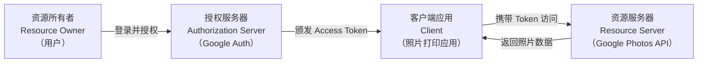
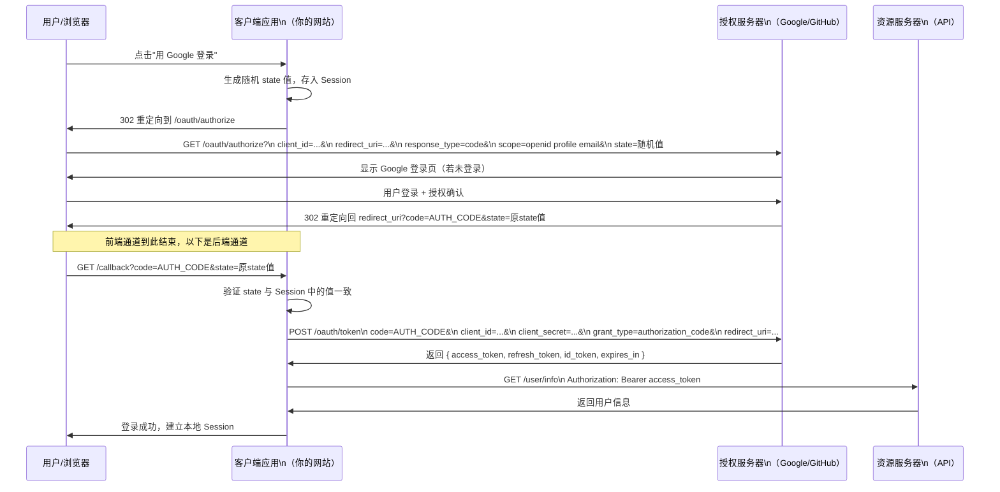
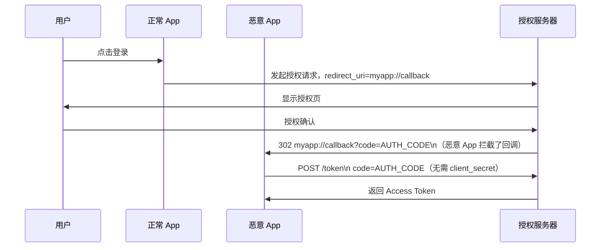
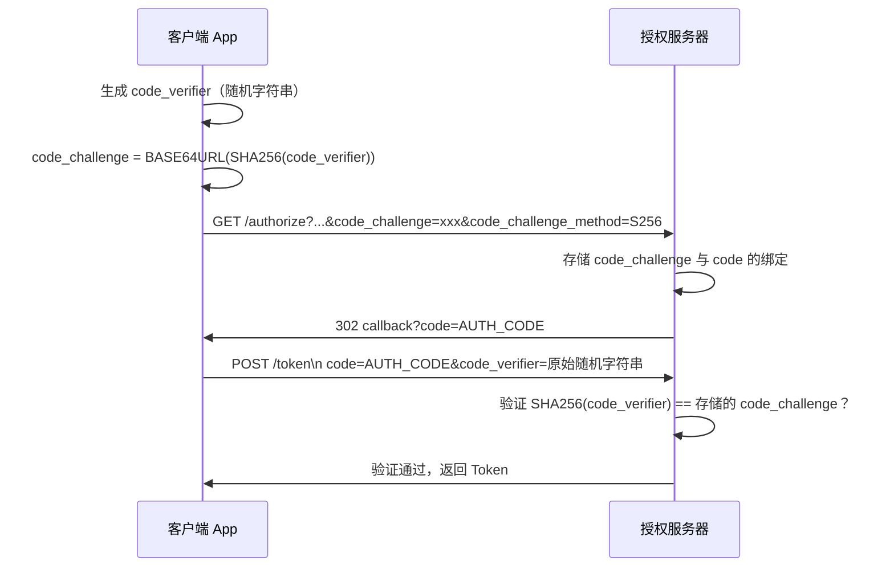
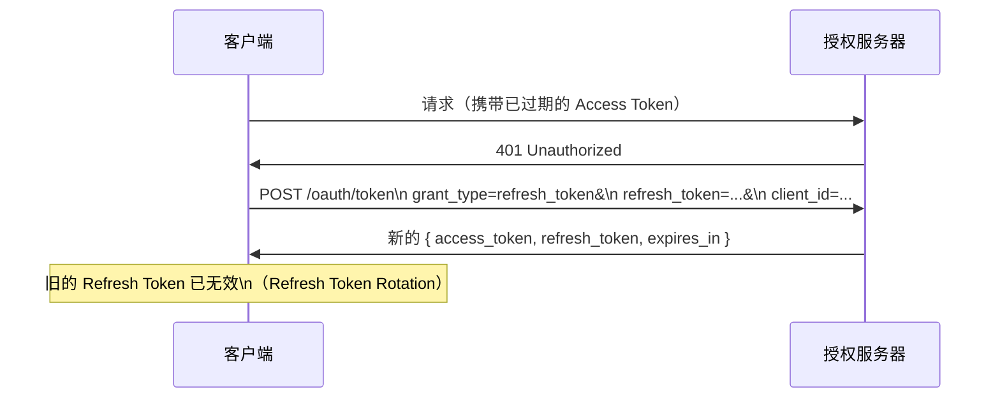

# OAuth2 协议详解

## 本篇导读

### 核心目标

学完本篇后，你将能够：

- 理解 OAuth2 的本质——它解决了什么问题，为什么这样设计
- 掌握 OAuth2 的四个角色和四种授权模式
- 深入理解授权码模式（Authorization Code Flow）的每一个步骤
- 理解 PKCE 扩展的原理：为什么公开客户端（SPA、移动端）必须使用它
- 掌握 `state` 参数的 CSRF 防护机制
- 理解 Access Token 和 Refresh Token 的设计哲学

### 重点与难点

**重点**：

- 授权码模式的完整流程——特别是"前端通道"和"后端通道"的区分
- PKCE 的转换流程：`code_verifier → SHA256 → base64url → code_challenge`
- `state` 参数的生成时机、存储位置和验证时机

**难点**：

- `redirect_uri` 的精确匹配语义——为什么不能模糊匹配？
- Access Token 短期 vs Refresh Token 长期的背后权衡
- OAuth2 只解决"授权"，不解决"认证"——这个边界在哪里？

## 为什么需要 OAuth2

在 OAuth2 出现之前，如果你要开发一个"照片打印"应用，让用户把 Google Photos 里的照片打印出来，你会怎么设计登录流程？

**旧方式（密码共享反模式）**：

用户把 Google 账号和密码直接告诉你的应用。应用用这个密码登录 Google，获取照片，然后打印。

这有什么问题？

- **权限过载**：你获得了用户 **完整的 Google 账号权限**——可以看邮件、删照片、改密码，而不只是读照片
- **无法撤销**：用户无法在不改密码的情况下撤销对你的授权
- **密码泄露风险**：用户密码存在你的应用里，一旦你的数据库泄露，Google 账号也完蛋了
- **信任传递**：用户无法确认第三方应用会怎么处理账号

**OAuth2 的解法**：

- 用户 **不把密码告诉** 第三方应用
- 用户在 Google 的页面上登录，并明确选择"授予照片打印应用读取照片的权限"
- Google 给第三方应用一个 **Access Token**（访问令牌），这个 Token 只有读照片的权限，且有过期时间
- 用户随时可以在 Google 账号设置里撤销这个授权

OAuth2 本质上是一个 **委托授权框架**：用户把资源访问权限的一部分，安全地委托给第三方应用。

## OAuth2 的四个角色

理解 OAuth2 必须先清楚四个角色的职责：



**资源所有者（Resource Owner）**：拥有资源的人，通常就是用户。照片是你的，所以你是资源所有者。

**客户端应用（Client）**：想要访问资源的应用。"客户端"这个名字容易引发误解——它不一定是浏览器端，它是相对于授权服务器的客户端，可以是 Web 后端、移动 App、SPA、甚至是命令行工具。

**授权服务器（Authorization Server）**：负责验证用户身份并颁发 Token。Google 的授权服务器、GitHub 的授权服务器、微信的授权服务器，或者你自己用模块四搭建的 OIDC 服务器，都属于这个角色。

**资源服务器（Resource Server）**：存放资源并接收 Token 的 API 服务器。Google Photos 的 API 就是资源服务器。它验证收到的 Access Token，决定是否开放资源访问权限。

在实际产品中，授权服务器和资源服务器可以是同一个服务，也可以是分离的不同服务。

## 四种授权模式

OAuth2 规范定义了四种获取 Token 的方式。但要先说明：在现代互联网开发中，只有 **授权码模式**（和其 PKCE 变体）是推荐使用的。

### 授权码模式（Authorization Code Flow）

适用场景：有服务端的 Web 应用（BFF 模式）。

核心特点：Authorization Code 通过前端浏览器传递，但 Access Token 的交换在后端完成（不走前端通道）。

这是最安全的模式，后面重点讲解。

### 隐式模式（Implicit Flow）——已废弃

早期为 SPA 设计的模式：跳过授权码阶段，直接在重定向 URL 里返回 Access Token。

问题：Token 暴露在 URL 里（URL 会被记录在浏览器历史、日志中），安全性差。

OAuth 2.1 草案（BCP/对安全最佳实践的收录）已废弃此模式，SPA 应改用带 PKCE 的授权码模式。

### 密码模式（Resource Owner Password Credentials）——废弃

用户名密码直接传给第三方应用，应用用它换 Token。这和最初的"密码共享反模式"没有本质区别。

唯一适用场景：第一方应用（你自己的移动 App，配合你自己的认证服务器）。现代推荐做法也已改成授权码 + PKCE。

### 客户端凭证模式（Client Credentials）

没有用户参与的机器间授权：服务 A 用 client_id + client_secret 直接换 Token，访问服务 B。

适用于微服务间调用，不适用于代表用户的访问场景。

## 授权码模式深度解析

授权码模式是所有第三方登录的基础，必须彻底理解每一步。



### 第一步：构造授权 URL

用户点击"用 Google 登录"时，应用构造这样的 URL：

```plaintext
https://accounts.google.com/o/oauth2/v2/auth?
  client_id=your_client_id&
  redirect_uri=https://yourapp.com/auth/callback&
  response_type=code&
  scope=openid%20profile%20email&
  state=abc123xyz789&
  access_type=offline&   # Google 特有：请求 Refresh Token
  prompt=consent         # Google 特有：强制显示授权页面
```

每个参数的作用：

- `client_id`：你的应用在授权服务器的身份标识，提前注册后获得
- `redirect_uri`：授权完成后跳回的地址，必须与注册时完全一致
- `response_type=code`：告诉服务器"我想要授权码"（不是 Token）
- `scope`：请求的权限范围，空格分隔多个 Scope
- `state`：防 CSRF 的随机字符串，详见下文

### 第二步：用户在授权服务器完成登录和授权确认

这一步完全在授权服务器那边发生：用户看到的是 Google 的登录页、Google 的授权确认页。你的应用 **完全不参与**，也无法看到用户输入的密码。

这正是 OAuth2 的安全基础。

### 第三步：授权服务器回调

用户授权后，Google 把用户重定向到你注册的 `redirect_uri`：

```plaintext
https://yourapp.com/auth/callback?
  code=4/P7q7W91a-oMsCeLvIaQm6bTrgtp7&
  state=abc123xyz789
```

注意：

- `code` 是 **授权码（Authorization Code）**，不是 Token
- `code` 生命周期极短（通常 60 秒内）
- `code` 只能用一次

### 第四步：后端用授权码换 Token（关键！）

你的后端服务器拿到 code 后，向授权服务器发出 Token 请求：

```typescript
const tokenResponse = await fetch('https://oauth2.googleapis.com/token', {
  method: 'POST',
  headers: { 'Content-Type': 'application/x-www-form-urlencoded' },
  body: new URLSearchParams({
    code: authorizationCode,
    client_id: process.env.GOOGLE_CLIENT_ID!,
    client_secret: process.env.GOOGLE_CLIENT_SECRET!,
    redirect_uri: 'https://yourapp.com/auth/callback',
    grant_type: 'authorization_code',
  }),
});

const tokens = await tokenResponse.json();
// { access_token, refresh_token, id_token, expires_in, token_type }
```

**为什么必须在后端做这一步？**

因为这一步需要 `client_secret`（应用的密码），而 `client_secret` 不能暴露在前端（任何人都能看到前端代码）。

这就是"前端通道"和"后端通道"的核心区别：

- **前端通道**（Front Channel）：通过浏览器重定向传递，用户和攻击者都能看到 URL。传递 `code`（短效、一次性）是安全的。
- **后端通道**（Back Channel）：服务端直接发起 HTTP 请求，不经过浏览器。传递 `client_secret` 和接收 Token 在这里完成。

### 第五步：用 Access Token 访问资源

```typescript
const userInfo = await fetch('https://www.googleapis.com/oauth2/v3/userinfo', {
  headers: { Authorization: `Bearer ${accessToken}` },
});
const profile = await userInfo.json();
// { sub, name, email, picture, email_verified }
```

## scope 的设计哲学

Scope 是用户对权限的精细控制手段。不同授权服务器有不同的 Scope 设计，但有一些通用原则：

**最小权限原则**：只请求你真正需要的 Scope。如果只需要读用户名和邮箱，不要请求写入权限。用户看到的授权请求越宽泛，越可能拒绝或放弃。

常见的 Scope 示例：

```plaintext
# OpenID Connect 标准 Scope（获取身份信息）
openid          # 必须，表明这是 OIDC 请求，返回 ID Token
profile         # 用户基本信息（name, picture, given_name, locale...）
email           # 邮箱地址和 email_verified

# Google 特定 Scope
https://www.googleapis.com/auth/calendar.readonly   # 只读日历
https://www.googleapis.com/auth/gmail.send          # 发送邮件

# GitHub 特定 Scope
read:user       # 读取用户信息
user:email      # 读取邮箱（即使设为私密也能读）
repo            # 访问仓库
```

## state 参数与 CSRF 防护

`state` 参数是防止 CSRF（跨站请求伪造）攻击的关键机制。

### 攻击场景

假设你的 `/auth/callback` 端点没有验证 `state`：

1. 攻击者构造一个指向你的 `/auth/callback?code=ATTACKER_CODE` 的链接
2. 攻击者诱导受害者点击这个链接（比如通过钓鱼邮件）
3. 你的应用用攻击者的 code 换取 Token，然后用攻击者的账号信息登录受害者的浏览器
4. 受害者在你的网站上，实际上登录的是攻击者的账号

**结果**：受害者在你的网站上执行的任何操作（支付、填写信息）都关联到攻击者账号，攻击者可以窃取到受害者的这些操作。

### 防护机制

正确的 `state` 使用方式：

```typescript
// 1. 构造授权 URL 时，生成随机 state 并存入 Session
import { randomBytes } from 'crypto';

const state = randomBytes(32).toString('hex');
req.session.oauthState = state;

const authUrl = `https://accounts.google.com/o/oauth2/v2/auth?` +
  `client_id=${CLIENT_ID}&` +
  `redirect_uri=${REDIRECT_URI}&` +
  `response_type=code&` +
  `scope=openid profile email&` +
  `state=${state}`;

res.redirect(authUrl);

// 2. 收到回调时，验证 state 与 Session 中的值
async handleCallback(code: string, state: string, req: Request) {
  if (state !== req.session.oauthState) {
    throw new Error('Invalid state parameter - possible CSRF attack');
  }
  // 验证通过后清除 Session 中的 state（防重放）
  delete req.session.oauthState;

  // 继续换 Token...
}
```

`state` 也可以携带应用状态，比如登录前用户访问的页面 URL（用 base64 编码）：

```typescript
const statePayload = {
  nonce: randomBytes(16).toString('hex'),
  returnTo: req.query.returnTo ?? '/',
};
const state = Buffer.from(JSON.stringify(statePayload)).toString('base64url');
```

## PKCE：公开客户端的安全增强

### 什么是公开客户端

OAuth2 将客户端分为两类：

- **机密客户端（Confidential Client）**：能安全保管 `client_secret` 的客户端，如 Web 后端服务器
- **公开客户端（Public Client）**：无法安全保管 `client_secret` 的客户端，如 SPA（所有代码对用户可见）、移动 App（可被反编译）

公开客户端不应该有 `client_secret`——即使有，也是不安全的。那公开客户端怎么安全地完成 Token 交换？

### 授权码拦截攻击

在没有 PKCE 前，公开客户端（如移动 App）面临一个威胁：

1. 恶意 App（已安装在同一手机上）注册了与你的 App 相同的 `redirect_uri` URL Scheme（如 `myapp://callback`）
2. 用户授权后，系统弹出对话框问用哪个 App 处理这个 URL（或者恶意 App 直接截获）
3. 恶意 App 拿到了 `code`，用它（没有 `client_secret` 验证）换取了 Token



### PKCE 如何解决

PKCE（Proof Key for Code Exchange，读作 "pixie"）在授权码模式上增加了一个"代码验证器"绑定：

**PKCE 工作原理**：

1. 发起授权请求前，客户端生成随机的 `code_verifier`（43-128 字符的随机字符串）
2. 计算 `code_challenge = BASE64URL(SHA256(code_verifier))`
3. 发起授权请求时，把 `code_challenge` 和 `code_challenge_method=S256` 附在 URL 里
4. 授权服务器记住这个 `code_challenge`，与颁发的 `code` 绑定
5. 换 Token 时，客户端提交 `code_verifier`（明文）
6. 授权服务器验证：`BASE64URL(SHA256(code_verifier)) == 已存储的 code_challenge`？



即使恶意 App 拦截了 `code`，它也没有 `code_verifier`（从未通过网络传输过），无法完成 Token 交换。

### TypeScript 实现

```typescript
import { randomBytes, createHash } from 'crypto';

// 生成 code_verifier（43-128 个 Base64url 字符，这里取 43 个字节 ≈ 58 Base64url 字符）
function generateCodeVerifier(): string {
  return randomBytes(43).toString('base64url');
}

// 生成 code_challenge（S256 方法）
function generateCodeChallenge(verifier: string): string {
  return createHash('sha256').update(verifier).digest('base64url');
}

// 授权服务器端：验证 PKCE
function verifyPkce(codeVerifier: string, storedChallenge: string): boolean {
  const computed = createHash('sha256')
    .update(codeVerifier)
    .digest('base64url');
  // 使用 timingSafeEqual 防止时序攻击
  const buf1 = Buffer.from(computed);
  const buf2 = Buffer.from(storedChallenge);
  if (buf1.length !== buf2.length) return false;
  return require('crypto').timingSafeEqual(buf1, buf2);
}
```

## Access Token 与 Refresh Token

### 为什么 Access Token 要设计成短期的

Access Token 是"通行证"——持有者就能访问资源。如果 Access Token 被窃取，攻击者拿到 Token 就能直接访问资源服务器，而资源服务器不知道它被盗了（Token 本身还有效）。

**短期 Access Token 的好处**：即使泄露，攻击者可用的时间窗口很短（通常 15 分钟 ~ 1 小时），危害有限。

典型的有效期设置：

- Access Token：15 分钟（高安全场景）~ 1 小时（常规场景）
- Refresh Token：7 天 ~ 90 天，甚至更长

### Refresh Token 的刷新机制



**Refresh Token Rotation**（推荐）：每次刷新时颁发新的 Refresh Token，同时废弃旧的。这样可以检测 Refresh Token 被盗用——一旦旧 Token 被再次使用，说明泄露，立即吊销所有 Token。

### Opaque Token vs JWT

Access Token 有两种设计：

**Opaque Token（不透明 Token）**：

- 只是一个随机字符串（如 UUID）
- 意义存在授权服务器的数据库或 Redis 里
- 验证时需要查询授权服务器（Token Introspection）
- 优点：可以精确撤销；缺点：每次验证都要走网络

**JWT（自包含 Token）**：

- 包含 Claims（sub, iss, aud, exp, scope 等）的 Base64 编码 JSON
- 资源服务器用公钥验签，不需要联系授权服务器
- 优点：验证效率高；缺点：无法主动撤销（只能等过期）

对于第三方登录场景，通常 Access Token 是 Opaque 的（发给第三方授权服务器，只用来查用户信息，不需要分发给资源服务器），而在自己搭建的 OIDC 服务器里（如模块四），自己颁发的 Access Token 选用 JWT 效率更高。

## OAuth2 常见安全误区

### 误区一：授权码可以反复使用

授权码（Authorization Code）是一次性的——用过一次后应该立即失效。如果授权服务器允许重复使用，攻击者从浏览器历史或日志中找到 code 就能换取 Token。

正确做法：授权码在使用后立即删除（或标记为已用），建议存放在 Redis 用 `GETDEL` 命令原子性地获取并删除。

### 误区二：redirect_uri 只做前缀匹配

错误示例：注册的 Redirect URI 是 `https://yourapp.com/callback`，但实际允许 `https://yourapp.com/callback/extra` 或 `https://yourapp.com/callback?anything=1`。

攻击者可以注册 `https://yourapp.com.evil.com/callback`（作为前缀可能匹配）来劫持 code。

**正确做法**：Redirect URI 必须完全精确匹配（exact match），包括 path、query string 都要相同。RFC 6749 规范对此有明确要求。

### 误区三：在前端存储 client_secret

SPA 的 JavaScript 代码对所有人可见，不应该有 `client_secret`。即使混淆了也没用——混淆不是加密。

SPA 必须使用 PKCE。

### 误区四：混淆 OAuth2 和 OIDC 的职责

OAuth2 解决的是"授权"——给应用 A 访问用户在服务 B 上资源的权限。它 **不解决** 用户身份认证，Access Token 里没有用户是谁的信息（标准 OAuth2 里没有规定 Access Token 的格式）。

"用 Google 登录"在技术上用的是 OpenID Connect（OIDC）——OIDC 是在 OAuth2 之上加了 ID Token，用来传递用户身份信息。这在下一篇教程中详细介绍。

## 常见问题与解决方案

### Q：授权码模式中，state 用 Session 存还是 Cookie 存？

**A**：推荐用服务端 Session 存储，不要直接放 Cookie。

- 如果直接 Set-Cookie 存 `state`，需要确保 Cookie 是 `HttpOnly` 和 `SameSite=Lax`，且在验证后立即删除
- 用服务端 Session（如 Redis 存储的 Session）更安全，因为浏览器端无法修改 Session 中的值

对于 SPA（前端完全控制流程），通常把随机 `state` 存在 `sessionStorage`（不是 `localStorage`，因为 `sessionStorage` 只在当前标签页有效，无法被其他标签页的 XSS 利用）。

### Q：公开客户端（SPA）是否还需要 redirect_uri 验证？

**A**：必须还需要。PKCE 防的是授权码拦截攻击，redirect_uri 验证防的是开放重定向攻击——两者互补，缺一不可。

### Q：Access Token 过期了，用户要重新登录吗？

**A**：不一定。如果有 Refresh Token，后端可以静默刷新（用 Refresh Token 换新的 Access Token），用户无感知。

如果 Refresh Token 也过期了（或被撤销），那才需要用户重新授权。这就是为什么"记住我"功能本质上是延长 Refresh Token 有效期或持久化 Refresh Token。

### Q：scope 里没有申请的权限，能用 Access Token 访问吗？

**A**：在设计良好的资源服务器上，不能。资源服务器会验证 Token 中的 `scope` 声明，只允许已授权的操作。

但这取决于资源服务器的实现——有些服务（特别是早期 API 设计）没有做 scope 检查，这是实现上的安全漏洞。

### Q：如果用户在 Google 上撤销了对我的应用的授权，会发生什么？

**A**：

- 撤销后，Google 收到的新的 Token 刷新请求会失败（Refresh Token 被吊销）
- 已经颁发的、尚未过期的 Access Token 仍然有效（直到过期）
- 资源服务器如果不做 Token Introspection，短期内无法感知到撤销

这就是短期 Access Token 的重要性——撤销后最多等 Access Token 自然过期（15分钟~1小时）就生效了，不至于攻击者长期使用。

## 本篇小结

OAuth2 是现代第三方登录的基础框架，其核心设计是"用户委托授权"——不共享密码，而是通过标准化的授权流程颁发受限的 Access Token。

授权码模式是生产唯一推荐的模式：`code` 走前端通道（短效、一次性），`client_secret` 和 Token 交换走后端通道。`state` 参数防 CSRF，`redirect_uri` 精确匹配防开放重定向。

对于无法持有 `client_secret` 的公开客户端（SPA、移动 App），PKCE 扩展提供了等效的安全保证：`code_verifier`（随机字符串）和 `code_challenge`（其 SHA256 哈希）确保 code 即使被拦截也无法被利用。

Access Token 短期（防泄露后持续危害）、Refresh Token 长期（用户体验）、Rotation 机制（检测 Refresh Token 泄露）构成了完整的 Token 生命周期管理。

下一篇将介绍 OpenID Connect——在 OAuth2 的基础上增加 ID Token，解决用户身份认证（而不只是授权访问）的问题。
