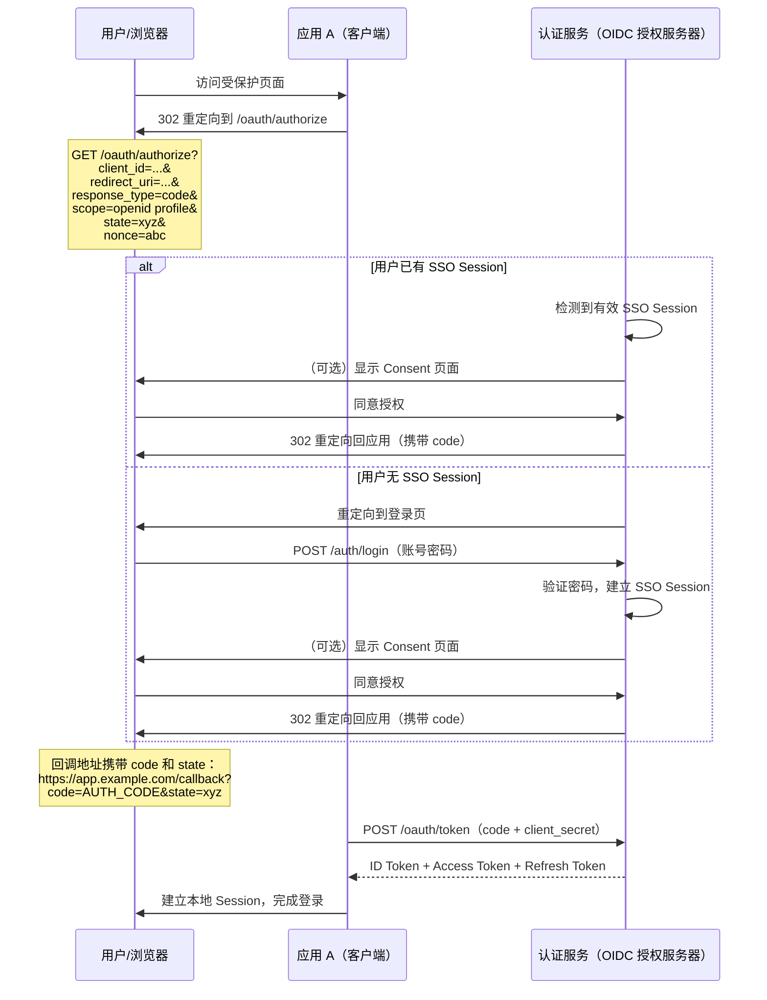
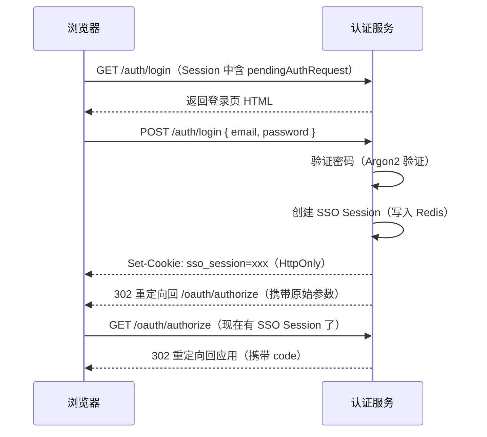
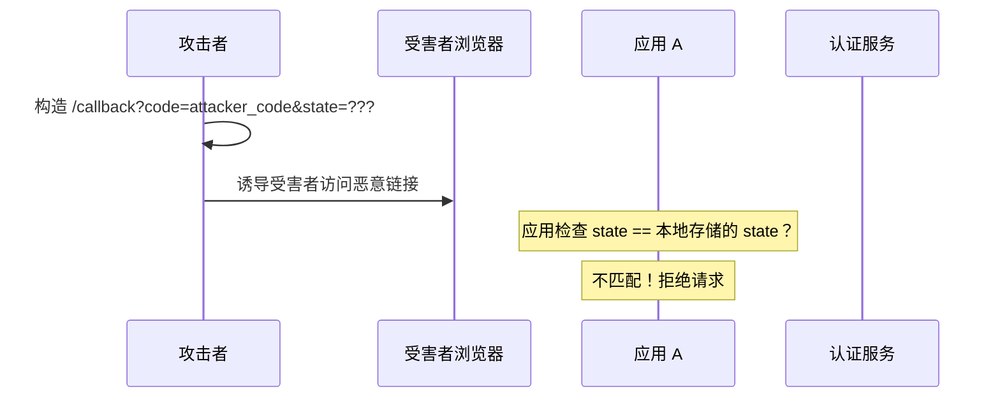

# 授权端点与登录流程

## 本篇导读

### 核心目标

学完本篇后，你将能够：

- 理解 Authorization Code Flow（授权码流程）的每个步骤和参数含义
- 实现 `/oauth/authorize` 端点，正确校验所有授权请求参数
- 构建 SSO Session 检测逻辑：已登录直接颁发授权码，未登录跳转登录页
- 理解 Consent（授权确认）的设计意义，并实现 Consent 页面交互
- 生成安全的一次性授权码，并正确绑定到请求参数

### 重点与难点

**重点**：

- 授权请求的完整参数验证——每个参数的校验规则和失败处理方式
- SSO Session 检测的精确逻辑——何时需要用户登录，何时可以直接颁发代码
- `state` 参数的作用——防止 CSRF 攻击，客户端必须在回调时验证它

**难点**：

- `nonce` 参数的意义——它与 `state` 的区别，以及它在 ID Token 中如何防重放
- Consent 页面与授权码之间的状态传递——如何设计 Consent 页面的会话
- `prompt` 参数的各种值对 SSO Session 检测逻辑的影响

## Authorization Code Flow 完整流程

在开始实现之前，先把整个 Authorization Code Flow（授权码流程）的交互图摆出来，这是所有后续实现的依据。



这个流程涉及了几个关键角色和两个主要阶段：

**阶段一（本篇）**：授权端点处理（`/oauth/authorize`），安全检查、SSO Session 检测、登录页/Consent 页面交互，最终颁发授权码。

**阶段二（下一篇）**：令牌端点处理（`/oauth/token`），用授权码换取 ID Token + Access Token + Refresh Token。

## 授权端点参数详解

`/oauth/authorize` 接收一系列 Query String 参数，每个参数都有严格的校验规则。

### 必须参数

| 参数            | 描述                                                             |
| --------------- | ---------------------------------------------------------------- |
| `response_type` | 必须为 `code`（授权码模式）                                      |
| `client_id`     | 客户端标识符，必须在 `oauth_clients` 表中注册且处于激活状态      |
| `redirect_uri`  | 回调地址，必须与该客户端注册的白名单完全匹配                     |
| `scope`         | 授权范围，必须包含 `openid`，且为该客户端 `allowedScopes` 的子集 |

### 推荐参数

| 参数    | 描述                                                                     |
| ------- | ------------------------------------------------------------------------ |
| `state` | 客户端生成的不可预测随机字符串，防 CSRF。认证服务原样带回 `redirect_uri` |
| `nonce` | 客户端生成的随机字符串，写入 ID Token，防 ID Token 重放攻击              |

### 条件必须参数

| 参数                    | 使用条件                                         |
| ----------------------- | ------------------------------------------------ |
| `code_challenge`        | 公开客户端（`client_type = public`）必须提供     |
| `code_challenge_method` | 公开客户端必须为 `S256`（禁止使用 `plain` 模式） |

### 可选控制参数

| 参数         | 值                                              | 描述                                              |
| ------------ | ----------------------------------------------- | ------------------------------------------------- |
| `prompt`     | `none` / `login` / `consent` / `select_account` | 控制认证服务是否强制要求用户交互（详见 SSO 章节） |
| `max_age`    | 数字（秒）                                      | SSO Session 的最大年龄，超出则强制重新登录        |
| `ui_locales` | 语言标签（如 `zh-CN`）                          | 提示认证服务使用的界面语言                        |

### 参数错误的处理策略

处理错误时有一个重要规则：错误的处理方式取决于 `redirect_uri` 是否可信。

**`redirect_uri` 可信时**（能找到对应客户端且 URI 在白名单）：将错误作为参数添加到 `redirect_uri` 并重定向：

```plaintext
https://app.example.com/callback?error=invalid_scope&error_description=...&state=xyz
```

**`redirect_uri` 不可信时**（`client_id` 无效、`redirect_uri` 不在白名单）：直接在认证服务页面展示错误，**绝不重定向**——重定向到不可信的 URI 本身就是安全漏洞。

标准错误码：

| 错误码                      | 含义                           |
| --------------------------- | ------------------------------ |
| `invalid_request`           | 缺少必要参数或参数格式错误     |
| `unauthorized_client`       | 该客户端没有权限使用此授权类型 |
| `access_denied`             | 用户拒绝了授权                 |
| `unsupported_response_type` | 不支持的 `response_type`       |
| `invalid_scope`             | 请求的 `scope` 无效            |
| `server_error`              | 服务器内部错误                 |

## 实现 `/oauth/authorize` 端点

### 请求参数 DTO

```typescript
// src/oauth/authorize/dto/authorize.dto.ts
import { z } from 'zod/v4';

export const authorizeQuerySchema = z.object({
  response_type: z.literal('code'),
  client_id: z.string().min(1),
  redirect_uri: z.url(),
  scope: z.string().min(1),
  state: z.string().optional(),
  nonce: z.string().optional(),
  code_challenge: z.string().optional(),
  code_challenge_method: z.enum(['S256', 'plain']).optional(),
  prompt: z.enum(['none', 'login', 'consent', 'select_account']).optional(),
  max_age: z.coerce.number().int().min(0).optional(),
});

export type AuthorizeQuery = z.infer<typeof authorizeQuerySchema>;
```

### AuthorizeService

```typescript
// src/oauth/authorize/authorize.service.ts
import {
  Injectable,
  BadRequestException,
  UnauthorizedException,
} from '@nestjs/common';
import { ClientsService } from '../../clients/clients.service';
import { SsoService } from '../../sso/sso.service';
import { RedisService } from '../../redis/redis.service';
import { AuthorizeQuery } from './dto/authorize.dto';
import { randomBytes } from 'crypto';
import { nanoid } from 'nanoid';

export interface AuthCodeData {
  clientId: string;
  userId: string;
  scope: string;
  redirectUri: string;
  nonce?: string;
  codeChallenge?: string;
  codeChallengeMethod?: string;
}

@Injectable()
export class AuthorizeService {
  constructor(
    private readonly clientsService: ClientsService,
    private readonly ssoService: SsoService,
    private readonly redis: RedisService
  ) {}

  // 第一步：验证授权请求参数
  async validateAuthorizeRequest(query: AuthorizeQuery) {
    // 1. 验证 client_id
    const client = await this.clientsService.findByClientId(query.client_id);
    if (!client || !client.isActive) {
      // client_id 无效时，不能重定向，直接返回错误
      throw new BadRequestException('无效的 client_id');
    }

    // 2. 验证 redirect_uri（精确匹配）
    if (!this.clientsService.isRedirectUriAllowed(client, query.redirect_uri)) {
      // redirect_uri 无效时，同样不能重定向
      throw new BadRequestException('无效的 redirect_uri');
    }

    // -- 以下错误可以重定向回客户端 --

    // 3. 验证 scope
    const grantedScope = this.clientsService.iseScopeAllowed(
      client,
      query.scope
    )
      ? query.scope
      : null;
    if (!grantedScope || !grantedScope.split(' ').includes('openid')) {
      throw this.redirectError(
        query,
        'invalid_scope',
        'scope 无效或缺少 openid'
      );
    }

    // 4. 公开客户端必须提供 PKCE
    if (client.clientType === 'public') {
      if (!query.code_challenge) {
        throw this.redirectError(
          query,
          'invalid_request',
          '公开客户端必须使用 PKCE'
        );
      }
      if (query.code_challenge_method !== 'S256') {
        throw this.redirectError(
          query,
          'invalid_request',
          '必须使用 S256 code_challenge_method'
        );
      }
    }

    return { client, grantedScope };
  }

  // 第二步：生成授权码（在 SSO Session 验证通过且 Consent 完成后调用）
  async issueAuthCode(data: AuthCodeData): Promise<string> {
    const code = randomBytes(32).toString('base64url'); // URL 安全的随机字符串

    // 将授权码存入 Redis，TTL 10 分钟
    await this.redis.setex(`auth_code:${code}`, 600, JSON.stringify(data));

    return code;
  }

  // 从 Redis 原子地取出并删除授权码（防重放）
  async consumeAuthCode(code: string): Promise<AuthCodeData | null> {
    const raw = await this.redis.getdel(`auth_code:${code}`);
    if (!raw) return null;
    return JSON.parse(raw) as AuthCodeData;
  }

  // 构造重定向到客户端的 URL（携带 code + state）
  buildRedirectUrl(redirectUri: string, code: string, state?: string): string {
    const url = new URL(redirectUri);
    url.searchParams.set('code', code);
    if (state) url.searchParams.set('state', state);
    return url.toString();
  }

  // 构造错误重定向 URL
  buildErrorRedirectUrl(
    redirectUri: string,
    error: string,
    description: string,
    state?: string
  ): string {
    const url = new URL(redirectUri);
    url.searchParams.set('error', error);
    url.searchParams.set('error_description', description);
    if (state) url.searchParams.set('state', state);
    return url.toString();
  }

  private redirectError(
    query: AuthorizeQuery,
    error: string,
    description: string
  ) {
    // 返回一个特殊的异常，Controller 层据此做重定向
    const redirectUrl = this.buildErrorRedirectUrl(
      query.redirect_uri,
      error,
      description,
      query.state
    );
    return new AuthorizeRedirectException(redirectUrl);
  }
}

export class AuthorizeRedirectException extends Error {
  constructor(public readonly redirectUrl: string) {
    super('Authorization redirect');
  }
}
```

### AuthorizeController

```typescript
// src/oauth/authorize/authorize.controller.ts
import { Controller, Get, Query, Res, Req, Session } from '@nestjs/common';
import { Response, Request } from 'express';
import {
  AuthorizeService,
  AuthorizeRedirectException,
} from './authorize.service';
import { SsoService } from '../../sso/sso.service';
import { authorizeQuerySchema, AuthorizeQuery } from './dto/authorize.dto';

@Controller('oauth')
export class AuthorizeController {
  constructor(
    private readonly authorizeService: AuthorizeService,
    private readonly ssoService: SsoService
  ) {}

  @Get('authorize')
  async authorize(
    @Query() rawQuery: Record<string, string>,
    @Req() req: Request,
    @Res() res: Response,
    @Session() session: Record<string, any>
  ) {
    // 解析和验证 query 参数
    const parseResult = authorizeQuerySchema.safeParse(rawQuery);
    if (!parseResult.success) {
      return res.status(400).json({ error: 'invalid_request' });
    }
    const query = parseResult.data;

    try {
      // 1. 验证客户端参数
      const { client, grantedScope } =
        await this.authorizeService.validateAuthorizeRequest(query);

      // 2. 检测 SSO Session
      const ssoSessionId = req.cookies?.['sso_session'];
      const ssoSession = ssoSessionId
        ? await this.ssoService.getSession(ssoSessionId)
        : null;

      // 处理 prompt=none：不允许任何用户交互
      if (query.prompt === 'none' && !ssoSession) {
        const errorUrl = this.authorizeService.buildErrorRedirectUrl(
          query.redirect_uri,
          'login_required',
          '需要登录但 prompt=none',
          query.state
        );
        return res.redirect(errorUrl);
      }

      // 处理 prompt=login：强制重新登录（忽略已有 SSO Session）
      if (query.prompt === 'login' && ssoSession) {
        await this.ssoService.destroySession(ssoSessionId!);
        // 继续走登录流程
      }

      // 处理 max_age：SSO Session 超出最大年龄，强制重新登录
      if (ssoSession && query.max_age !== undefined) {
        const sessionAge = Math.floor(Date.now() / 1000) - ssoSession.loginTime;
        if (sessionAge > query.max_age) {
          await this.ssoService.destroySession(ssoSessionId!);
          // 继续走登录流程
        }
      }

      // 3. 如果用户已有有效 SSO Session，且已为该客户端同意过授权
      const activeSsoSession = ssoSessionId
        ? await this.ssoService.getSession(ssoSessionId)
        : null;

      if (activeSsoSession) {
        // 检查是否需要 Consent
        if (
          client.requireConsent &&
          query.prompt !== 'consent' &&
          !activeSsoSession.consentedClients?.includes(query.client_id)
        ) {
          // 需要 Consent 但尚未同意：跳转 Consent 页面
          // 将授权请求参数保存到 Session，Consent 完成后恢复
          session.pendingAuthRequest = {
            query,
            userId: activeSsoSession.userId,
          };
          return res.redirect('/auth/consent');
        }

        // 直接颁发授权码
        const code = await this.authorizeService.issueAuthCode({
          clientId: query.client_id,
          userId: activeSsoSession.userId,
          scope: grantedScope,
          redirectUri: query.redirect_uri,
          nonce: query.nonce,
          codeChallenge: query.code_challenge,
          codeChallengeMethod: query.code_challenge_method,
        });

        // 在 SSO Session 中记录已登录该客户端
        await this.ssoService.recordClientLogin(ssoSessionId!, query.client_id);

        const redirectUrl = this.authorizeService.buildRedirectUrl(
          query.redirect_uri,
          code,
          query.state
        );
        return res.redirect(redirectUrl);
      }

      // 4. 用户未登录：将授权请求参数保存，重定向到登录页
      session.pendingAuthRequest = { query };
      return res.redirect('/auth/login');
    } catch (err) {
      if (err instanceof AuthorizeRedirectException) {
        return res.redirect(err.redirectUrl);
      }
      throw err;
    }
  }
}
```

## 登录页面与登录流程

### 登录页的前后端设计

登录页是一个独立的前端页面，由认证服务自己托管（不是业务应用的一部分）。



### 登录接口实现

```typescript
// src/auth/auth.controller.ts
import { Controller, Post, Body, Res, Req, Session, Get } from '@nestjs/common';
import { Response, Request } from 'express';
import { AuthService } from './auth.service';
import { SsoService } from '../sso/sso.service';
import { z } from 'zod/v4';

const loginSchema = z.object({
  email: z.email(),
  password: z.string().min(1),
});

@Controller('auth')
export class AuthController {
  constructor(
    private readonly authService: AuthService,
    private readonly ssoService: SsoService
  ) {}

  // GET /auth/login - 返回登录页（SSR 或 SPA 入口）
  @Get('login')
  async loginPage(
    @Session() session: Record<string, any>,
    @Res() res: Response
  ) {
    // 检查是否有待处理的授权请求
    if (!session.pendingAuthRequest) {
      // 直接访问登录页（非 OIDC 流程），正常展示
    }
    // 返回登录页面（这里以返回静态 HTML 为例，实际项目用 React）
    return res.sendFile('login.html', { root: 'public' });
  }

  // POST /auth/login - 处理登录表单提交
  @Post('login')
  async login(
    @Body() body: unknown,
    @Req() req: Request,
    @Res() res: Response,
    @Session() session: Record<string, any>
  ) {
    const parseResult = loginSchema.safeParse(body);
    if (!parseResult.success) {
      return res.status(400).json({ error: '邮箱或密码格式错误' });
    }

    const { email, password } = parseResult.data;

    // 验证用户凭据
    const user = await this.authService.validateCredentials(email, password);
    if (!user) {
      // 注意：不要透露是账号不存在还是密码错误（防止账号枚举攻击）
      return res.status(401).json({ error: '邮箱或密码错误' });
    }

    // 创建 SSO Session
    const ssoSessionId = await this.ssoService.createSession({
      userId: user.id,
      email: user.email,
      ipAddress: req.ip ?? '',
      userAgent: req.headers['user-agent'] ?? '',
    });

    // 设置 SSO Session Cookie（HttpOnly，防 XSS 读取）
    res.cookie('sso_session', ssoSessionId, {
      httpOnly: true,
      secure: process.env.NODE_ENV === 'production', // 生产环境强制 HTTPS
      sameSite: 'lax',
      maxAge: 7 * 24 * 60 * 60 * 1000, // 7 天（与 SSO Session TTL 一致）
      path: '/',
    });

    // 登录成功后，恢复待处理的授权请求
    const pending = session.pendingAuthRequest;
    if (pending?.query) {
      // 清除 Session 中的临时数据
      delete session.pendingAuthRequest;

      // 重定向回授权端点，现在有 SSO Session 了
      const params = new URLSearchParams(
        pending.query as Record<string, string>
      );
      return res.redirect(`/oauth/authorize?${params.toString()}`);
    }

    // 没有待处理的授权请求，跳到默认页
    return res.json({ success: true, message: '登录成功' });
  }
}
```

**登录安全注意事项**：

**防账号枚举**：无论是账号不存在还是密码错误，都返回同样的错误消息 `"邮箱或密码错误"`。如果区分这两种情况，攻击者可以通过系统性地尝试邮箱地址来确认哪些账号存在。

**防暴力破解**：登录接口必须有限流保护（详见模块二《安全防护》章节，Rate Limiting 的实现）。在认证服务这个高价值目标上，限流策略应该比普通 API 更严格。

**`sameSite: 'lax'`**：对于 SSO Session Cookie，使用 `lax` 而不是 `strict`。`strict` 模式下，跨站跳转（从应用 A 重定向到认证服务时）不会携带 Cookie，导致用户每次跨应用跳转都需要重新登录——完全破坏了 SSO 的体验。`lax` 模式允许顶级导航携带 Cookie，正好满足 OIDC 重定向的需求。

## Consent 授权确认页面

### 什么时候需要 Consent

Consent 页面是 OAuth2 授权流程的核心用户体验：让用户决定是否允许某个应用访问自己的信息。

**需要 Consent 的场景**：

- 客户端的 `requireConsent = true`（第三方应用）
- 用户第一次登录某个应用
- 应用申请的 Scope 发生了变化（比如以前只申请 `openid`，现在要申请 `email`）
- `prompt = consent`（强制重新确认）

**不需要 Consent 的场景**：

- 客户端的 `requireConsent = false`（公司内部应用，信任关系已建立）
- 用户已经同意过相同 Scope 的授权（从 Consent 历史记录中判断）

### Consent 的状态设计

Consent 页面需要一个临时状态存储，记录用户在 Consent 页面上看到了什么，以及用户的选择要如何影响授权流程：

```typescript
// 存在 Express Session 中（服务端存储，防篡改）
session.pendingAuthRequest = {
  query: AuthorizeQuery, // 原始授权请求参数
  userId: string, // 已登录的用户 ID
};
```

### Consent 处理接口

```typescript
// src/auth/consent.controller.ts
import { Controller, Post, Body, Res, Session, Get } from '@nestjs/common';
import { Response } from 'express';
import { AuthorizeService } from '../oauth/authorize/authorize.service';
import { SsoService } from '../sso/sso.service';

@Controller('auth')
export class ConsentController {
  constructor(
    private readonly authorizeService: AuthorizeService,
    private readonly ssoService: SsoService
  ) {}

  @Get('consent')
  async consentPage(
    @Session() session: Record<string, any>,
    @Res() res: Response
  ) {
    if (!session.pendingAuthRequest) {
      return res.status(400).send('没有待处理的授权请求');
    }
    // 返回 Consent 页面（展示应用名称、申请的 Scope）
    return res.sendFile('consent.html', { root: 'public' });
  }

  @Post('consent')
  async handleConsent(
    @Body() body: { approved: boolean },
    @Session() session: Record<string, any>,
    @Res() res: Response
  ) {
    const pending = session.pendingAuthRequest;
    if (!pending) {
      return res.status(400).json({ error: '无效的同意请求' });
    }

    const { query, userId } = pending as {
      query: any;
      userId: string;
    };

    if (!body.approved) {
      // 用户拒绝授权
      delete session.pendingAuthRequest;
      const errorUrl = this.authorizeService.buildErrorRedirectUrl(
        query.redirect_uri,
        'access_denied',
        '用户拒绝了授权',
        query.state
      );
      return res.redirect(errorUrl);
    }

    // 用户同意授权：颁发授权码
    const code = await this.authorizeService.issueAuthCode({
      clientId: query.client_id,
      userId,
      scope: query.scope,
      redirectUri: query.redirect_uri,
      nonce: query.nonce,
      codeChallenge: query.code_challenge,
      codeChallengeMethod: query.code_challenge_method,
    });

    // 记录用户已同意该客户端的授权（存入 SSO Session）
    const ssoSessionId = (session as any).ssoSessionId;
    if (ssoSessionId) {
      await this.ssoService.recordConsent(ssoSessionId, query.client_id);
    }

    delete session.pendingAuthRequest;

    const redirectUrl = this.authorizeService.buildRedirectUrl(
      query.redirect_uri,
      code,
      query.state
    );
    return res.redirect(redirectUrl);
  }
}
```

## `state` 与 `nonce` 的安全意义

### `state` 参数——防 CSRF

`state` 是客户端（业务应用）在发起授权请求前生成的随机字符串，认证服务在回调时原样带回。客户端在收到回调时，必须验证 `state` 与自己生成的一致。

这防止了 CSRF 攻击：



攻击者如果能让受害者的浏览器访问 `/callback?code=xxx`，就可以将攻击者的授权码与受害者的会话绑定（账号劫持）。有 `state` 验证后，攻击者无法知道受害者的 `state`，这个攻击失效。

**客户端如何使用 `state`**：

```typescript
// 发起授权请求前
const state = randomBytes(16).toString('base64url');
localStorage.setItem('oauth_state', state);

// 构造授权 URL
const authUrl =
  `${AUTH_SERVER}/oauth/authorize?` +
  `client_id=${CLIENT_ID}&` +
  `redirect_uri=${encodeURIComponent(REDIRECT_URI)}&` +
  `response_type=code&` +
  `scope=openid+profile+email&` +
  `state=${state}`;

// 在回调页面验证
const params = new URLSearchParams(window.location.search);
const returnedState = params.get('state');
const storedState = localStorage.getItem('oauth_state');
if (returnedState !== storedState) {
  throw new Error('state 不匹配，可能是 CSRF 攻击');
}
localStorage.removeItem('oauth_state'); // 清除，不要重复使用
```

### `nonce` 参数——防 ID Token 重放

`nonce` 是由客户端生成的随机字符串，在授权请求时发送给认证服务，认证服务会将它原样写入 ID Token 的 `nonce` 字段。客户端在收到 ID Token 后，验证 `nonce` 与自己生成的一致。

`nonce` 防止的是 ID Token 重放攻击：

攻击者如果获得了用户的 ID Token（例如从历史日志、中间人攻击），可能尝试将它提交给另一个依赖方（另一个应用）。`nonce` 将 ID Token 与特定的授权请求绑定——每次授权请求的 `nonce` 都不同，ID Token 里的 `nonce` 只对应一次授权流程。

## 常见问题与解决方案

### Q：授权码能存在哪里？ Redis 还是数据库？

**A**：强烈推荐 Redis。理由：

1. **原子性**：Redis 的 `GETDEL` 命令可以原子地取出并删除授权码，天然防止竞态条件下的重放攻击。数据库需要用事务 + 行锁来达到同样效果，更复杂。
2. **自动过期**：Redis 的 TTL 机制自动清理过期授权码，无需额外的清理任务。
3. **性能**：授权码的生命周期极短（10 分钟），没有必要持久化到关系型数据库。

### Q：用户已经登录（有 SSO Session），但点击"不同意"（deny）授权，应该清除 SSO Session 吗？

**A**：不应该。用户拒绝授权（`access_denied`）只意味着用户不想让某个特定应用访问自己的信息——不代表用户要登出认证服务。SSO Session 应该保持有效。只有在以下情况才清除 SSO Session：用户主动点击"退出登录"，或 SSO Session 到期。

### Q：`session.pendingAuthRequest` 使用 Express Session 是否安全？

**A**：是的，Express Session 的内容存储在服务端（Redis），客户端只持有一个 Session ID（通过 Cookie）。只要 Session ID 通过 `httpOnly` Cookie 传递（防 XSS）且使用 `SameSite=Lax`（防 CSRF），`pendingAuthRequest` 中的授权请求参数是安全的。注意不要将敏感信息（如密码）存入 Session。

### Q：什么是 Front-Channel 和 Back-Channel？

**A**：在 OIDC 上下文中：

- **Front-Channel**：通过浏览器重定向传递信息。授权码通过 Redirect URI 传递就是 Front-Channel——信息经过用户的浏览器。Front-Channel 容易被用户看到，且依赖浏览器的可靠性（如用户关闭浏览器）。
- **Back-Channel**：服务器之间直接通信，不经过浏览器。Token 端点的 `code` 换 `token` 就是 Back-Channel——应用的后端服务器直接与认证服务的 `/oauth/token` 端点通信。Back-Channel 更安全但需要网络可达性。

## 本篇小结

本篇实现了 OIDC 授权流程的第一个环节。

**参数验证层面**，我们明确了 `/oauth/authorize` 的所有参数的校验规则，以及错误时的正确处理策略：`redirect_uri` 可信时重定向错误，不可信时在页面直接展示错误。

**SSO Session 检测层面**，我们设计了完整的检测逻辑：无 SSO Session 跳转登录页，有 SSO Session 判断是否需要 Consent，需要 Consent 跳转 Consent 页面，不需要则直接颁发授权码。同时处理了 `prompt` 参数的各种控制场景。

**安全设计层面**，我们实现了两个重要的安全机制：`state` 参数的 CSRF 防护（客户端生成随机值，回调时验证），以及 `nonce` 参数的 ID Token 重放防护（写入 ID Token，客户端回调时验证）。

**授权码设计层面**，我们选择用 Redis + `GETDEL` 原子操作存储授权码，这在防止重放攻击、自动过期清理、性能三个维度上都优于关系型数据库方案。

下一篇将实现授权流程的第二个环节：`/oauth/token` 令牌端点，用授权码换取 ID Token、Access Token 和 Refresh Token。
