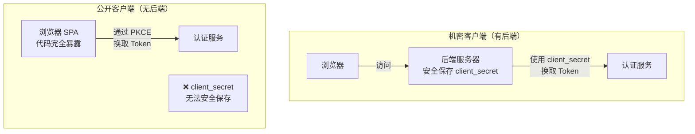
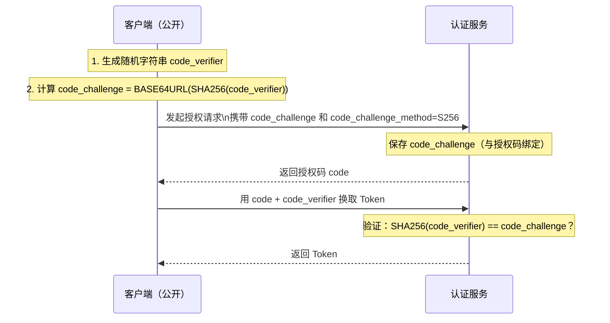

# 客户端应用管理

## 本篇导读

### 核心目标

学完本篇后，你将能够：

- 理解 OIDC 中"客户端应用"（Client）的概念，以及为什么需要注册机制
- 区分机密客户端（Confidential Client）和公开客户端（Public Client）的本质差异
- 实现客户端应用的注册、查询、更新和删除接口
- 正确生成和验证 `client_id` 与 `client_secret`，理解其安全设计
- 配置 Redirect URI 白名单，防止开放重定向攻击
- 理解 PKCE（Proof Key for Code Exchange）机制，以及何时必须使用它

### 重点与难点

**重点**：

- 机密客户端 vs 公开客户端——这个区分决定了认证流程的安全模式
- `client_secret` 的存储策略——为什么要存哈希而不是明文
- Redirect URI 的精确匹配规则——任何宽松都是安全漏洞

**难点**：

- PKCE 的工作原理——`code_verifier`、`code_challenge`、`S256` 变换的关系
- 为什么公开客户端不能依赖 `client_secret`，以及 PKCE 如何填补这个安全空缺
- Scope 机制——如何定义每个客户端允许申请的权限范围

## 什么是 OIDC 客户端

在 OIDC（OpenID Connect）和 OAuth2 的语境里，**客户端（Client）** 指的是任何想要通过认证服务获取用户身份信息的应用程序。

注意这里的"客户端"不是指用户的浏览器——而是指 **接入认证服务的业务应用**。在一个企业内部系统中，OA 系统、CRM 系统、BI 系统都是认证服务的"客户端"。

### 为什么需要客户端注册

类比：银行开卡

你去银行存钱，银行需要知道：你是谁？为什么信任你？身份核实后才给你开户。

同理，业务系统想接入认证服务，也需要先"开户"——即客户端注册。注册确立了几件事：

**1. 认证服务认可这个应用**

任意一个陌生应用都可以把用户重定向到认证服务的登录页，然后声称自己的 Redirect URI 是某个地址。如果没有注册机制，认证服务无法判断这个应用是否可信——攻击者可以构造一个假链接，把授权码发送到自己控制的服务器。

**2. 约定权限范围（Scope）**

注册时明确了该应用最多可以申请哪些权限（Scope）。即使应用在请求时申请了超出注册范围的权限，认证服务也会拒绝。

**3. 建立审计追踪**

所有使用认证服务颁发 Token 的操作都关联到一个具体的客户端，便于安全审计和问题溯源。

### 机密客户端 vs 公开客户端

这是 OAuth2 中最重要的一个概念区分，直接决定了认证流程的安全设计。

**机密客户端（Confidential Client）**：运行在服务器端的应用，有能力安全地保存密钥。

典型例子：

- 传统的服务端渲染（SSR）Web 应用（Next.js App Router 模式、NestJS 渲染 HTML）
- 有后端的 BFF（Backend for Frontend）模式 Web 应用
- 服务器间通信（Machine-to-Machine）

机密客户端可以有 `client_secret`，在换取 Token 时通过提交 `client_id + client_secret` 来证明身份。

**公开客户端（Public Client）**：运行在用户设备上，无法安全保存密钥。

典型例子：

- 纯浏览器 SPA（React、Vue 等）
- 移动端 App（iOS、Android）
- 桌面应用

公开客户端不应该有 `client_secret`——因为这些客户端的代码对用户是完全可见的（浏览器 DevTools、APK 反编译），任何硬编码在客户端里的密钥都不是真正的密钥。



**对比总结**：

| 维度           | 机密客户端              | 公开客户端                         |
| -------------- | ----------------------- | ---------------------------------- |
| 运行环境       | 服务器                  | 浏览器 / 移动端 / 桌面             |
| 是否有密钥     | 有 `client_secret`      | 无密钥，使用 PKCE                  |
| 安全保障       | 服务器端密钥保密        | PKCE（一次性随机挑战）             |
| 典型使用场景   | BFF 模式 Web 应用       | 纯 SPA、移动 App                   |
| Token 存储位置 | HTTPOnly Cookie（安全） | 内存或 localStorage（有 XSS 风险） |

## PKCE 机制详解

PKCE（Proof Key for Code Exchange，RFC 7636）是为公开客户端设计的安全机制，解决了授权码拦截攻击（Authorization Code Interception Attack）。

### 授权码拦截攻击

考虑移动应用场景。当用户在认证服务登录成功后，认证服务会把授权码通过 Redirect URI 发回给应用。在移动端，Redirect URI 通常是一个自定义 URL Scheme，如 `myapp://callback`。设备上如果有另一个注册了相同 URL Scheme 的恶意应用，它可能拦截到这个包含授权码的回调——并用这个授权码去换取 Token。

PKCE 解决了这个问题：即使攻击者拿到了授权码，没有对应的 `code_verifier`，也无法完成 Token 换取。

### PKCE 工作流程



**关键步骤说明**：

**第一步**：客户端在发起授权请求 **之前** 生成一个随机的 `code_verifier`（至少 43 个字符，最多 128 个字符，只用 `[A-Z a-z 0-9 - . _ ~]` 这些字符）。

**第二步**：对 `code_verifier` 做 SHA-256 哈希，再做 Base64URL 编码，得到 `code_challenge`：

```typescript
// code_verifier → code_challenge 的转换
import { createHash, randomBytes } from 'crypto';

function generateCodeVerifier(): string {
  return randomBytes(32).toString('base64url');
}

function generateCodeChallenge(verifier: string): string {
  return createHash('sha256').update(verifier).digest('base64url');
}
```

**第三步**：`code_challenge` 随授权请求发送给认证服务，认证服务把它与授权码绑定保存。

**第四步**：客户端用授权码换 Token 时，同时提交 `code_verifier`。认证服务对 `code_verifier` 做 SHA-256 哈希，与保存的 `code_challenge` 对比——如果匹配，说明换 Token 的请求来自最初发起授权请求的客户端。

**为什么这样就安全了？** 攻击者即使拦截了授权码，也不知道 `code_verifier`（它从未在网络上传输）。没有 `code_verifier` 就无法换取 Token。

## 数据库模型与 Drizzle Schema

### Schema 定义

```typescript
// src/database/schema/oauth-clients.ts
import {
  pgTable,
  uuid,
  varchar,
  boolean,
  jsonb,
  text,
  timestamp,
} from 'drizzle-orm/pg-core';

export const oauthClients = pgTable('oauth_clients', {
  id: uuid('id').primaryKey().defaultRandom(),
  clientId: varchar('client_id', { length: 100 }).notNull().unique(),
  clientSecretHash: varchar('client_secret_hash', { length: 255 }),
  clientName: varchar('client_name', { length: 255 }).notNull(),
  clientType: varchar('client_type', { length: 20 })
    .notNull()
    .default('confidential'),
  redirectUris: jsonb('redirect_uris').$type<string[]>().notNull().default([]),
  grantTypes: jsonb('grant_types')
    .$type<string[]>()
    .notNull()
    .default(['authorization_code']),
  allowedScopes: jsonb('allowed_scopes')
    .$type<string[]>()
    .notNull()
    .default(['openid']),
  requireConsent: boolean('require_consent').default(true).notNull(),
  frontChannelLogoutUri: text('front_channel_logout_uri'),
  backChannelLogoutUri: text('back_channel_logout_uri'),
  postLogoutRedirectUris: jsonb('post_logout_redirect_uris')
    .$type<string[]>()
    .default([]),
  createdAt: timestamp('created_at').defaultNow().notNull(),
  updatedAt: timestamp('updated_at').defaultNow().notNull(),
  isActive: boolean('is_active').default(true).notNull(),
});

export type OAuthClient = typeof oauthClients.$inferSelect;
export type NewOAuthClient = typeof oauthClients.$inferInsert;
```

## 客户端管理服务实现

### ClientsService

```typescript
// src/clients/clients.service.ts
import {
  Injectable,
  ConflictException,
  NotFoundException,
} from '@nestjs/common';
import { InjectDrizzle } from '../database/database.module';
import { DrizzleDB } from '../database/database.service';
import { oauthClients, OAuthClient } from '../database/schema/oauth-clients';
import { eq } from 'drizzle-orm';
import { randomBytes, scrypt, timingSafeEqual } from 'crypto';
import { promisify } from 'util';
import { nanoid } from 'nanoid';

const scryptAsync = promisify(scrypt);

@Injectable()
export class ClientsService {
  constructor(@InjectDrizzle() private readonly db: DrizzleDB) {}

  async createClient(data: {
    clientName: string;
    clientType: 'confidential' | 'public';
    redirectUris: string[];
    allowedScopes?: string[];
    requireConsent?: boolean;
  }): Promise<{ client: OAuthClient; clientSecret?: string }> {
    // 生成 client_id：可读的随机标识符
    const clientId = `client_${nanoid(16)}`;

    let clientSecret: string | undefined;
    let clientSecretHash: string | undefined;

    // 只有机密客户端才生成 client_secret
    if (data.clientType === 'confidential') {
      clientSecret = randomBytes(32).toString('hex'); // 64 字符的十六进制字符串
      clientSecretHash = await this.hashSecret(clientSecret);
    }

    const [client] = await this.db
      .insert(oauthClients)
      .values({
        clientId,
        clientSecretHash,
        clientName: data.clientName,
        clientType: data.clientType,
        redirectUris: data.redirectUris,
        allowedScopes: data.allowedScopes ?? ['openid', 'profile', 'email'],
        requireConsent: data.requireConsent ?? true,
        grantTypes: ['authorization_code', 'refresh_token'],
      })
      .returning();

    // 注意：clientSecret 只在创建时返回一次，之后无法再次获取
    return { client, clientSecret };
  }

  async findByClientId(clientId: string): Promise<OAuthClient | null> {
    const [client] = await this.db
      .select()
      .from(oauthClients)
      .where(eq(oauthClients.clientId, clientId))
      .limit(1);
    return client ?? null;
  }

  // 验证 client_secret（用于机密客户端的令牌端点认证）
  async verifyClientSecret(
    client: OAuthClient,
    secret: string
  ): Promise<boolean> {
    if (!client.clientSecretHash) return false;
    return this.verifySecret(secret, client.clientSecretHash);
  }

  // 验证 redirect_uri（精确匹配白名单）
  isRedirectUriAllowed(client: OAuthClient, redirectUri: string): boolean {
    return client.redirectUris.includes(redirectUri);
  }

  // 验证 scope（请求的 scope 必须是客户端注册 scope 的子集）
  iseScopeAllowed(client: OAuthClient, requestedScope: string): boolean {
    const requestedScopes = requestedScope.split(' ');
    return requestedScopes.every((s) => client.allowedScopes.includes(s));
  }

  private async hashSecret(secret: string): Promise<string> {
    const salt = randomBytes(16).toString('hex');
    const hash = (await scryptAsync(secret, salt, 64)) as Buffer;
    return `${salt}:${hash.toString('hex')}`;
  }

  private async verifySecret(secret: string, stored: string): Promise<boolean> {
    const [salt, hashHex] = stored.split(':');
    const storedHash = Buffer.from(hashHex, 'hex');
    const hash = (await scryptAsync(secret, salt, 64)) as Buffer;
    return timingSafeEqual(storedHash, hash);
  }
}
```

**关键设计决策讲解**：

**`client_id` 生成**：使用 `nanoid` 生成随机字符串，加上 `client_` 前缀使其可读。相比 UUID，这种格式在日志和调试时更容易识别。

**`client_secret` 只返回一次**：类似 GitHub 的 Personal Access Token，`client_secret` 在创建时展示给管理员，之后存储的是哈希值，永远无法再次查看明文。这迫使用户妥善保管，同时即使数据库被攻破，攻击者也拿不到明文密钥。

**`timingSafeEqual` 防时序攻击**：普通的字符串比较（`===`）在密码学场景下有时序攻击风险——字符串越早出现不同字符，比较结束越早，通过精密计时可以推断密码内容。`timingSafeEqual` 无论是否匹配，都会执行相同时间的操作，消除这个信息泄漏。

### Redirect URI 精确匹配

这是最容易出安全漏洞的地方。Redirect URI 必须做 **精确字符串匹配**，不能做前缀匹配，不能支持通配符（生产环境）：

```typescript
// ❌ 错误：前缀匹配，攻击者可以用 https://app.example.com.evil.com 绕过
isRedirectUriAllowed(client, redirectUri) {
  return client.redirectUris.some(uri => redirectUri.startsWith(uri));
}

// ❌ 错误：通配符匹配，攻击者可以注册 https://evil.com 并声称匹配 *
isRedirectUriAllowed(client, redirectUri) {
  return client.redirectUris.some(uri => minimatch(redirectUri, uri));
}

// ✅ 正确：精确匹配
isRedirectUriAllowed(client, redirectUri) {
  return client.redirectUris.includes(redirectUri);
}
```

**开放重定向攻击（Open Redirect）**：如果认证服务允许任意 Redirect URI，攻击者可以构造：

```plaintext
https://auth.example.com/oauth/authorize?
  client_id=legit-app&
  redirect_uri=https://evil.com/steal&
  response_type=code&
  scope=openid
```

用户被引导到认证服务登录，登录成功后授权码被发送到了 `evil.com`——攻击者用这个授权码换取 Token，完成账号劫持。

精确匹配是防止此类攻击的第一道防线。

## 客户端管理 API

### DTO 定义（Zod 验证）

```typescript
// src/clients/dto/create-client.dto.ts
import { z } from 'zod/v4';

export const createClientSchema = z.object({
  clientName: z.string().min(1).max(255),
  clientType: z.enum(['confidential', 'public']),
  redirectUris: z
    .array(z.url())
    .min(1)
    .max(10)
    .refine(
      (uris) =>
        uris.every((uri) => {
          const url = new URL(uri);
          // 生产环境只允许 HTTPS（本地开发允许 localhost HTTP）
          return url.protocol === 'https:' || url.hostname === 'localhost';
        }),
      { message: '生产环境 Redirect URI 必须使用 HTTPS' }
    ),
  allowedScopes: z
    .array(z.enum(['openid', 'profile', 'email', 'offline_access']))
    .default(['openid', 'profile', 'email']),
  requireConsent: z.boolean().default(true),
  frontChannelLogoutUri: z.url().optional(),
  backChannelLogoutUri: z.url().optional(),
  postLogoutRedirectUris: z.array(z.url()).default([]),
});

export type CreateClientDto = z.infer<typeof createClientSchema>;
```

### Controller

```typescript
// src/clients/clients.controller.ts
import {
  Controller,
  Get,
  Post,
  Delete,
  Param,
  Body,
  UsePipes,
  HttpCode,
  HttpStatus,
  UseGuards,
} from '@nestjs/common';
import { ClientsService } from './clients.service';
import { ZodValidationPipe } from '../common/pipes/zod-validation.pipe';
import { createClientSchema, CreateClientDto } from './dto/create-client.dto';
import { AdminGuard } from '../common/guards/admin.guard';

@Controller('clients')
@UseGuards(AdminGuard) // 只有管理员可以管理客户端
export class ClientsController {
  constructor(private readonly clientsService: ClientsService) {}

  @Post()
  @HttpCode(HttpStatus.CREATED)
  @UsePipes(new ZodValidationPipe(createClientSchema))
  async createClient(@Body() dto: CreateClientDto) {
    const { client, clientSecret } =
      await this.clientsService.createClient(dto);

    return {
      id: client.id,
      clientId: client.clientId,
      // 只在创建响应中返回 clientSecret，之后不再可见
      ...(clientSecret && { clientSecret }),
      clientName: client.clientName,
      clientType: client.clientType,
      redirectUris: client.redirectUris,
      allowedScopes: client.allowedScopes,
      createdAt: client.createdAt,
      message: clientSecret
        ? '请妥善保存 clientSecret，这是唯一一次展示机会'
        : undefined,
    };
  }

  @Get()
  async listClients() {
    // 列表接口不返回任何密钥信息
    const clients = await this.clientsService.findAll();
    return clients.map(({ clientSecretHash: _, ...safe }) => safe);
  }

  @Delete(':id')
  @HttpCode(HttpStatus.NO_CONTENT)
  async deleteClient(@Param('id') id: string) {
    await this.clientsService.deactivate(id);
  }
}
```

## Scope 机制设计

### OIDC 标准 Scope

OIDC 规范定义了一组标准 Scope，每个 Scope 对应一组 Claims：

| Scope            | 包含的 Claims                                            |
| ---------------- | -------------------------------------------------------- |
| `openid`         | `sub`（必须，标识用户的唯一 ID）                         |
| `profile`        | `name`、`given_name`、`family_name`、`picture`、`locale` |
| `email`          | `email`、`email_verified`                                |
| `phone`          | `phone_number`、`phone_number_verified`                  |
| `address`        | `address`（结构化地址对象）                              |
| `offline_access` | 申请 Refresh Token（可以离线刷新 Access Token）          |

`openid` 是所有 OIDC 请求的必选 Scope，没有 `openid` 就不是 OIDC 请求，认证服务不会生成 ID Token。

### 自定义 Scope

除了 OIDC 标准 Scope，你也可以定义自己的业务 Scope：

```typescript
// 示例：自定义业务 Scope
const CUSTOM_SCOPES = {
  'orders:read': '读取你的订单信息',
  'orders:write': '修改你的订单',
  admin: '管理员权限',
} as const;
```

但要注意：认证服务处理的 Scope 应该只涉及 **用户身份信息的读取权限**，业务数据的读写权限（如 `orders:read`）理论上属于业务系统的授权范畴，放在认证服务的 Scope 里是可以的，但实际的访问控制还是由业务系统执行。

### Scope 验证流程

```typescript
// 授权请求中的 scope 验证
validateScope(client: OAuthClient, requestedScope: string): string {
  const requested = requestedScope.split(' ').filter(Boolean);
  const allowed = new Set(client.allowedScopes);

  // openid 必须包含
  if (!requested.includes('openid')) {
    throw new BadRequestException('scope 必须包含 openid');
  }

  // 过滤掉客户端未注册的 scope（降级而不是报错，用户体验更好）
  const granted = requested.filter((s) => allowed.has(s));
  return granted.join(' ');
}
```

**为什么是过滤（降级）而不是报错？** RFC 6749 允许授权服务器授予小于请求的权限范围。对于不支持的 Scope，服务器可以选择忽略（返回实际授予的 Scope），而不是直接拒绝整个请求。这样用户体验更好——用户仍然可以完成登录，只是某些权限申请没被批准。当然，如果 `openid` 这个核心 Scope 没有，整个请求就没有意义了，这个时候报错是正确的。

## 实际注册示例：应用 A 和应用 B

假设我们要为两个业务应用注册客户端：

### 应用 A：管理后台（BFF 模式，机密客户端）

```bash
curl -X POST https://auth.example.com/clients \
  -H "Authorization: Bearer admin-token" \
  -H "Content-Type: application/json" \
  -d '{
    "clientName": "管理后台",
    "clientType": "confidential",
    "redirectUris": [
      "https://admin.example.com/auth/callback",
      "http://localhost:3001/auth/callback"
    ],
    "allowedScopes": ["openid", "profile", "email"],
    "requireConsent": false,
    "postLogoutRedirectUris": ["https://admin.example.com/login"]
  }'
```

响应：

```json
{
  "clientId": "client_Abc123Xyz456Def7",
  "clientSecret": "a1b2c3d4e5f6...（64字符，只展示一次）",
  "clientName": "管理后台",
  "clientType": "confidential",
  "message": "请妥善保存 clientSecret，这是唯一一次展示机会"
}
```

### 应用 B：用户端 SPA（公开客户端）

```bash
curl -X POST https://auth.example.com/clients \
  -H "Authorization: Bearer admin-token" \
  -H "Content-Type: application/json" \
  -d '{
    "clientName": "用户端 Web 应用",
    "clientType": "public",
    "redirectUris": [
      "https://app.example.com/callback",
      "http://localhost:5173/callback"
    ],
    "allowedScopes": ["openid", "profile", "email", "offline_access"],
    "requireConsent": true
  }'
```

响应（无 `clientSecret`，公开客户端使用 PKCE）：

```json
{
  "clientId": "client_Pqr789Stu012Vwx3",
  "clientName": "用户端 Web 应用",
  "clientType": "public"
}
```

## 常见问题与解决方案

### Q：localhost 的 Redirect URI 是否应该允许 HTTP？

**A**：是的，本地开发环境允许 `http://localhost:*`，这是 RFC 8252 明确允许的。但生产环境的 Redirect URI **必须使用 HTTPS**，否则授权码在传输过程中可能被拦截。在 Redirect URI 验证时，可以检查是否为 `localhost`，如果是则允许 HTTP 协议。

### Q：`client_secret` 丢失了怎么办？

**A**：只能重新生成。由于服务端只存哈希值，无法恢复明文。这是合理的安全设计——如果丢失，重新生成一个新密钥，并在业务应用的配置中更新。重新生成密钥的接口需要谨慎设计，必须要求管理员身份验证，并且生成后立即失效旧密钥。

### Q：生产环境是否适合用 Redirect URI 通配符？

**A**：OAuth2 规范（RFC 6749）明确要求 **精确匹配 Redirect URI**，不允许通配符。有些 IdP 实现提供了通配符支持，但这本质上是一个牺牲安全性换取便利性的选择。正确的做法是为开发/测试/生产环境分别注册不同的 Redirect URI（即分别注册到白名单里，而不是用通配符代替）。

### Q：`offline_access` Scope 是什么？

**A**：申请 `offline_access` 表示客户端希望在用户不在线的情况下访问资源——这需要 Refresh Token。没有 `offline_access` Scope，认证服务不会颁发 Refresh Token，Access Token 过期后用户必须重新登录。如果你的应用需要后台刷新（如移动端在后台同步数据），就需要申请这个 Scope。

### Q：如何实现客户端密钥轮换？

**A**：实现双密钥机制：

1. 保留旧密钥哈希（标记为 `legacySecretHash`）
2. 生成并存储新密钥哈希
3. 在验证时同时接受新旧密钥（给应用升级配置的过渡期）
4. 过渡期后（如 7 天），删除旧密钥记录

## 本篇小结

本篇深入讲解了 OIDC 客户端管理的设计与实现。

**核心概念层面**，我们区分了机密客户端（运行在服务器端，有密钥）和公开客户端（运行在用户设备端，使用 PKCE 代替密钥）——这个区分决定了后续整个认证流程的安全模式。

**安全设计层面**，我们实现了三个关键安全机制：`client_secret` 只存哈希值（防数据库泄露）；使用 `timingSafeEqual` 对比哈希（防时序攻击）；Redirect URI 做精确字符串匹配（防开放重定向攻击）。

**PKCE 机制**，我们理解了为什么公开客户端不能有密钥，以及 PKCE 如何通过 `code_verifier → code_challenge` 的单向哈希机制，在不泄露验证信息的前提下证明授权码的合法使用者。

**Scope 设计层面**，我们了解了 OIDC 标准 Scope（openid、profile、email、offline_access）的含义，以及 `offline_access` Scope 对应着 Refresh Token 的颁发。

下一篇将基于本篇注册的客户端，实现 OIDC 授权流程的第一个环节：`/oauth/authorize` 授权端点，以及与之配套的登录页和 SSO Session 检测逻辑。
