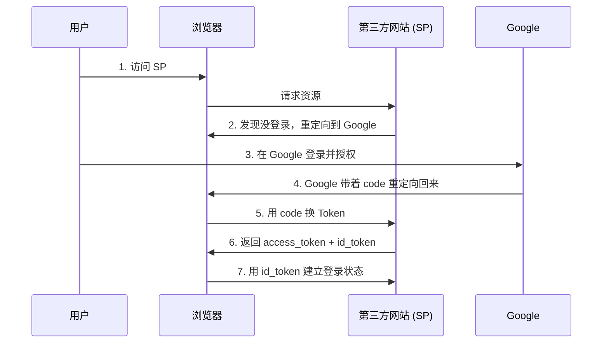

# OIDC 授权码 Flow 完整演示

## 本篇导读

### 核心目标

学完本篇后，你将能够：

- 在不写任何代码的情况下，理解 OIDC 授权码 Flow 的完整流程
- 说出浏览器、认证服务（IdP）、业务应用（SP）三方之间发生了什么
- 为后续章节的深入学习建立直观的整体认识

### 重要说明

本篇**不涉及代码**，纯粹用图文和抓包示例，让你可以"亲眼看到"OIDC 流程的每一个步骤。建议用 Chrome 打开开发者工具（Network 面板），跟着下面的步骤在自己电脑上实际操作一遍。

## 准备工作：用 Google 账号体验 OIDC

我们用 Google 作为 IdP，用一个简单的实验来走完整个流程。

**实验目标**：用 Google 账号登录一个第三方网站（不需要在这个网站上做任何操作，只需要走完流程）。

### 第一步：构造授权请求 URL

Google 的 OIDC 授权端点是：

```
https://accounts.google.com/o/oauth2/v2/auth
```

我们在浏览器地址栏直接输入（或点击这个链接）：

```
https://accounts.google.com/o/oauth2/v2/auth?
  response_type=code&
  client_id=YOUR_CLIENT_ID&
  redirect_uri=https://example.com/callback&
  scope=openid%20profile%20email&
  state=abc123&
  nonce=xyz789
```

**参数解释**（先混个脸熟，不用强记）：

| 参数                         | 含义                                                                      |
| ---------------------------- | ------------------------------------------------------------------------- |
| `response_type=code`         | 告诉 Google：我想要一个授权码（Authorization Code），而不是直接给我 Token |
| `client_id`                  | 你的应用在 Google 注册后获得的唯一标识                                    |
| `redirect_uri`               | Google 授权完成后，把浏览器重定向到这个地址                               |
| `scope=openid profile email` | 我想要这些信息：用户身份（openid）、姓名头像（profile）、邮箱（email）    |
| `state`                      | 一个随机字符串，用于防止 CSRF 攻击（后面会解释）                          |
| `nonce`                      | 另一个随机字符串，用于防止 Token 重放攻击（后面会解释）                   |

> **实际操作**：你可以用这个公开测试链接体验流程（来自 OIDC 官方示例）：
>
> [https://accounts.google.com/o/oauth2/v2/auth?client_id=1055274148554-8b7bo36ak1a22ek40i4l0vj4qurc67g9.apps.googleusercontent.com&response_type=code&redirect_uri=https://developers.google.com/oauthplayground&scope=openid%20profile%20email&state=security_token&nonce=param&code_challenge_method=S256](https://accounts.google.com/o/oauth2/v2/auth?client_id=1055274148554-8b7bo36ak1a22ek40i4l0vj4qurc67g9.apps.googleusercontent.com&response_type=code&redirect_uri=https://developers.google.com/oauthplayground&scope=openid%20profile%20email&state=security_token&nonce=param&code_challenge_method=S256)

### 第二步：观察浏览器地址栏的变化

点击上面的链接后，观察地址栏：

```
# 授权前
https://accounts.google.com/o/oauth2/v2/auth?response_type=code&...

# 用户在 Google 登录后（假设用户已登录）
https://example.com/callback?code=4/P7q7W91a-oMsCeLvIaQm6bTrgtp7&state=abc123
```

关键变化：

1. **地址栏从 Google 域名变成了你的 redirect_uri 域名**——浏览器被重定向回来了
2. **URL 中多了一个 `code` 参数**——这就是授权码
3. **`state` 参数原样返回**——这是验证重定向是否被篡改的关键

### 第三步：用授权码换 Token

授权码只是一张"取票凭证"，不能直接使用。我们需要用授权码向 Google 的 Token 端点换真正的 Token。

用 curl 发送这个请求（把 `code` 换成上一步拿到的值）：

```bash
curl -X POST https://oauth2.googleapis.com/token \
  -H "Content-Type: application/x-www-form-urlencoded" \
  -d "code=4/P7q7W91a-oMsCeLvIaQm6bTrgtp7" \
  -d "client_id=YOUR_CLIENT_ID" \
  -d "client_secret=YOUR_CLIENT_SECRET" \
  -d "redirect_uri=https://example.com/callback" \
  -d "grant_type=authorization_code"
```

Google 返回的是：

```json
{
  "access_token": "ya29.a0AbVbY6M...",
  "id_token": "eyJhbGciOiJSUzI1NiIsImtpZCI6Ij...",
  "token_type": "Bearer",
  "expires_in": 3600,
  "refresh_token": "1//0gYWEpo7y..."
}
```

**两个关键 Token**：

- **`access_token`**：访问令牌，用于调用 Google 的 API（比如获取用户信息）
- **`id_token`**：身份令牌，这是一个 JWT，里面包含了用户的身份信息（姓名、邮箱等）

### 第四步：解析 ID Token

`id_token` 是一个 JWT，我们可以直接用浏览器地址栏解码它。

1. 把 `id_token` 的值复制下来
2. 打开 [https://jwt.io](https://jwt.io)
3. 粘贴进去

你会看到解码后的内容：

**Header（头部）**：

```json
{
  "alg": "RS256",
  "typ": "JWT",
  "kid": "8a1b2c3d4e5f6g7h8i9j0k"
}
```

- `alg: RS256` 表示 Google 用 RSA 私钥签名，验证签名需要用对应的公钥
- `kid` 是密钥 ID，用于在 JWKS 端点找到正确的公钥

**Payload（内容）**：

```json
{
  "iss": "https://accounts.google.com",
  "sub": "110169484474386276334",
  "aud": "1055274148554-8b7bo36ak1...",
  "exp": 1700005200,
  "iat": 1700001600,
  "nonce": "xyz789",
  "name": "Ryan Zhang",
  "picture": "https://lh3.googleusercontent.com/...",
  "email": "ryan@example.com",
  "email_verified": true
}
```

关键字段含义：

- `iss`：签发者——是 Google，不是其他什么服务
- `sub`：用户的唯一标识——同一个 Google 账号在同一个应用中，`sub` 是固定的
- `aud`：这个 Token 发给谁——必须是你的 `client_id`，防止被其他应用冒用
- `exp/iat`：过期时间和颁发时间——Token 不会永远有效

## 用时序图理解三方交互

整个流程涉及三个角色：



### 详细步骤拆解

**步骤 1-2：发起授权请求**

用户在浏览器访问 `https://app.example.com/dashboard`

第三方网站检查发现用户没有登录，把浏览器重定向到：

```
https://accounts.google.com/o/oauth2/v2/auth?
  response_type=code&
  client_id=xxx&
  redirect_uri=https://app.example.com/callback&
  scope=openid profile email&
  state=abc123
```

**步骤 3：用户在 Google 完成认证**

用户在 Google 的登录页输入账号密码（或已经是登录状态直接点授权）。

Google 验证通过后：

- 创建 SSO Session（记录这个浏览器已经在 Google 登录了）
- 生成一个一次性授权码（code）
- 把浏览器重定向回 `https://app.example.com/callback?code=xxx&state=abc123`

**步骤 4-5：第三方网站用授权码换 Token**

第三方网站收到 `code`，立即用后端服务器向 Google 请求 Token（注意：这个过程浏览器不参与，是服务器之间的通信，叫 Back-channel）。

```bash
POST https://oauth2.googleapis.com/token
Content-Type: application/x-www-form-urlencoded

code=4/P7q7W91a...&client_id=xxx&client_secret=yyy&redirect_uri=...
```

Google 收到后：

- 验证 code 是否有效（还没用过，没过期）
- 验证 client_secret 是否正确（确认请求者是真的应用）
- 作废这个 code（只能使用一次）

返回 Token：

```json
{
  "access_token": "ya29...",
  "id_token": "eyJ...",
  "refresh_token": "1//0gY..."
}
```

**步骤 6-7：建立登录状态**

第三方网站：

- 验证 `id_token` 的签名（用 Google 的公钥确认是 Google 签的）
- 解析 `sub` 作为用户唯一标识
- 创建本地 Session
- 返回用户信息给浏览器，登录完成

## 关键问题解答

### Q：为什么不能直接把 Token 放在重定向 URL 里返回？

答：安全性考虑。重定向 URL 会出现在浏览器地址栏、Referer 头、历史记录里。如果 Token 直接暴露，攻击者可能通过这些途径窃取。授权码模式把 Token 的获取放到"后端到后端"的请求中，不经过浏览器，降低了 Token 泄露的风险。

### Q：为什么需要 `state` 参数？

答：防止 CSRF（跨站请求伪造）攻击。要理解 `state` 的作用，先要理解什么是 CSRF 攻击。

**什么是 CSRF 攻击？**

假设你已经登录了银行网站 `bank.com`，浏览器保存了你的登录 Cookie。攻击者给你发送一封邮件，里面包含一个链接：

```html

```

或者更隐蔽地，攻击者在你常逛的论坛里嵌入这个图片。当你打开这个页面时，浏览器会自动带着 `bank.com` 的 Cookie 向银行发起转账请求。银行看到你是登录状态，就执行了转账。

这就是 CSRF 攻击——利用浏览器的自动发送 Cookie 机制，冒充用户执行操作。

**`state` 如何防止 CSRF？**

在 OIDC 流程中，攻击者利用 CSRF 可以在第三方网站上冒充你。来看一个具体场景：

**没有 `state` 时的攻击**

假设第三方网站 `myapp.com` 的回调 URL 是 `https://myapp.com/callback`。

1. 攻击者先用自己的账号登录 `myapp.com`，发起授权请求，得到一个授权码 `code_A`
2. 攻击者构造一个恶意链接：`https://myapp.com/callback?code=code_A`
3. 攻击者通过钓鱼邮件、社会工程学等手段诱导你点击这个链接（比如伪装成"你的账号存在异常，请点击处理"）
4. 你点击后，浏览器请求 `https://myapp.com/callback?code=code_A`
5. `myapp.com` 用这个授权码换 Token，发现换到的是攻击者的账号
6. 结果：你被错误地登录成了攻击者的账号，或者攻击者绑定了自己的 Google 账号到你的 `myapp.com` 账户

**有 `state` 后的防御**

1. 你访问 `myapp.com` 时，`myapp.com` 在服务端生成一个随机字符串 `state`，存在 Session 里
2. 发起授权请求时，把这个 `state` 也发过去：`https://google.com/authorize?...&state=random123`
3. Google 会在回调时原封不动地返回 `state`：`https://myapp.com/callback?code=xxx&state=random123`
4. `myapp.com` 收到回调后，先检查 Session 里的 `state` 和 URL 里的 `state` 是否一致
5. 攻击者构造的恶意链接里没有正确的 `state`（攻击者不知道 Session 里存的是什么），验证必然失败

**类比**：你去酒店前台办理入住，前台给你一张房卡和一个房间号纸条。纸条上写着"请告诉前台房号才能进入"。攻击者偷走了你的房卡，但没有房号纸条，前台不会让他进入。

### Q：为什么需要 `nonce` 参数？

答：防止 ID Token 重放攻击。要理解 `nonce`，先要理解什么是重放攻击。

**什么是重放攻击？**

假设你通过 OIDC 流程成功登录了 `myapp.com`，收到了一个有效的 ID Token。正常情况下，你会用这个 ID Token 来证明自己的身份。

现在，攻击者通过某种手段（比如网络嗅探、中间人攻击、或者从泄露的日志里）获取到了这个 ID Token。注意：攻击者并没有完成授权流程，他只是拿到了这个 Token。

攻击者可以把这个 Token 提交给 `myapp.com` 的某个 API，冒充你发起请求。如果 `myapp.com` 只检查 Token 是否有效（签名正确、未过期），而不检查其他因素，就会被攻击成功。

**`nonce` 如何防止重放攻击？**

`nonce`（Number used once，顾名思义"只用一次的数字"）是一个随机生成的字符串，它的作用是将"这一次特定的授权请求"和"最终收到的 ID Token"绑定在一起：

**具体流程：**

1. 你访问 `myapp.com`，`myapp.com` 生成一个随机字符串 `nonce`（比如 `abc123xyz`），存在服务端的 Session 里
2. `myapp.com` 发起授权请求时，把这个 `nonce` 包含在 URL 参数里：

```
https://google.com/authorize?
  response_type=code&
  client_id=myapp_id&
  redirect_uri=https://myapp.com/callback&
  scope=openid profile&
  nonce=abc123xyz
```

3. Google（IdP）收到授权请求后，把这个 `nonce` 写入即将颁发的 ID Token 里。ID Token 的 Payload 大概是：

```json
{
  "iss": "https://accounts.google.com",
  "sub": "110169484474386276334",
  "aud": "myapp_id",
  "exp": 1700005200,
  "iat": 1700001600,
  "nonce": "abc123xyz"
}
```

4. 你收到 ID Token 后，`myapp.com` 做验证时发现 Token 里的 `nonce` 是 `abc123xyz`，和 Session 里存的完全一致——说明这个 Token 确实是为"这一次"授权请求颁发的，不是重放的。

5. 攻击者即使截获了这个 ID Token（或者从别处获取），他把这个 Token 提交给 `myapp.com` 时，`myapp.com` 会检查 Session——但 Session 里的 `nonce` 已经被使用过了（一次性），或者根本不存在，验证失败。

**为什么攻击者无法伪造 `nonce`？**

因为 `nonce` 是 `myapp.com` 的服务端生成的，存放在 `myapp.com` 的 Session 里。攻击者：

- 不知道这个随机字符串是什么
- 无法控制 Google（IdP）把什么值写入 ID Token
- 每次授权请求的 `nonce` 都不同，无法预测

**类比**：你去机场值机，工作人员在你的登机牌上贴了一个条形码标签（`nonce`）。安检时，扫描枪不仅检查登机牌真假，还检查条形码是否和你购票时的记录一致。攻击者即使偷走了你的登机牌，条形码对不上，也无法登机。

**`state` vs `nonce` 的区别**

| | `state` | `nonce` |
|---|---|---|
| **目的** | 防止 CSRF 攻击 | 防止 ID Token 重放攻击 |
| **攻击场景** | 攻击者诱导你完成一次授权，冒充你在第三方网站操作 | 攻击者窃取已有的 ID Token，拿来冒充你 |
| **验证时机** | 授权码回调时验证（验证你是从自己的页面发起授权的） | 收到 ID Token 时验证（验证这个 Token 是为"这一次"授权颁发的） |
| **存在哪里** | 第三方网站自己的 Session | 第三方网站 Session + ID Token 里 |

### Q：授权码只能使用一次，用完就作废，这有什么意义？

答：即使授权码被截获（比如攻击者监听了两步之间的通信），他也只能在极短的时间内使用一次。一旦第三方网站用它换到了 Token，授权码立即作废。攻击者没有 `client_secret`，无法换到真正的 Token。

### Q：为什么 Access Token 和 ID Token 要分开？

答：它们的用途不同：

- **ID Token**：专门用于告诉第三方网站"用户是谁"，只能由客户端验证，不能用来访问 API
- **Access Token**：用于调用 Google 的 API（比如读取用户的其他信息），是由资源服务器验证的

两者分离让安全边界更清晰。

## 本篇小结

OIDC 授权码 Flow 的核心是**三方交互、两次跳转、一次后端请求**：

1. **第一次跳转**：浏览器从 SP 跳到 IdP，用户在 IdP 登录授权
2. **授权码返回**：IdP 带着 `code` 把浏览器重定向回 SP
3. **后端请求**：SP 用 `code` + `client_secret` 向 IdP 换 Token（Back-channel）
4. **第二次跳转不发生**：Token 直接返回给 SP 的后端服务器，不经过浏览器

这是 OIDC 最安全的流程，适用于有后端服务器的应用（如 BFF 模式）。

## 下一步

现在你已经知道"OIDC 流程发生了什么"。后续章节我们将深入讲解：

- 这些参数具体是什么、怎么选
- ID Token 为什么能自验证
- 如何用代码实现这个流程
