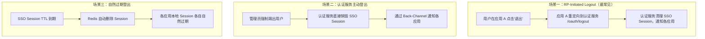
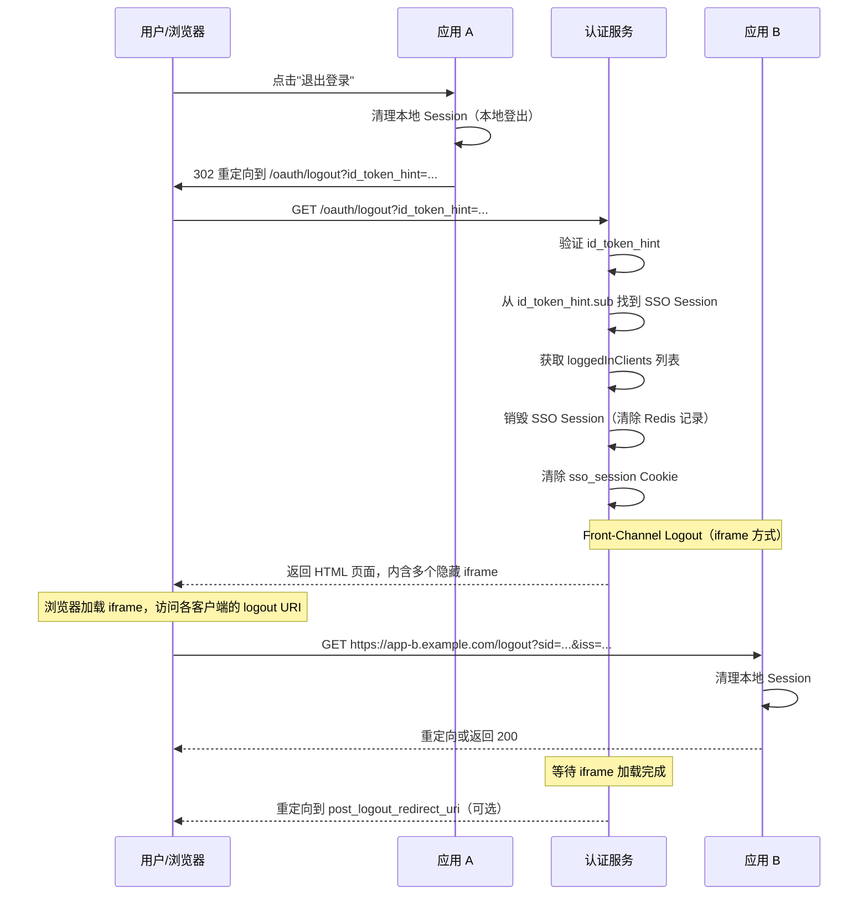
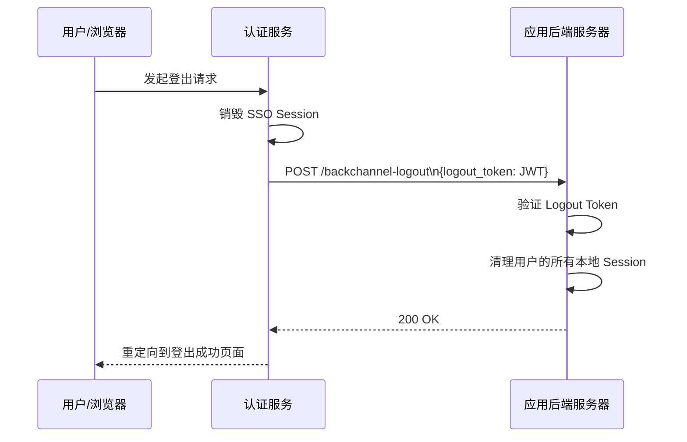

# 单点登出（SLO）

## 本篇导读

### 核心目标

学完本篇后，你将能够：

- 理解单点登出（Single Log-Out, SLO）的挑战：为什么"退出一处"很容易，"退出处处"很难
- 实现 RP-Initiated Logout（由业务应用发起的登出流程）
- 理解并实现 Front-Channel Logout（通过浏览器重定向通知各应用清理 Session）
- 理解并实现 Back-Channel Logout（服务端到服务端的直接登出通知）
- 对比两种登出机制的可靠性差异，以及如何在实践中组合使用

### 重点与难点

**重点**：

- 两种登出机制的本质差异——Front-Channel 依赖浏览器，Back-Channel 依赖服务器网络
- SSO Session 销毁的时机——应该在通知所有客户端之前还是之后销毁？
- `id_token_hint` 参数的作用——登出请求如何告知认证服务"是谁要登出"

**难点**：

- Front-Channel Logout 的不可靠性——如果用户关闭浏览器会怎样？
- Back-Channel Logout Token 的结构——与普通 JWT 有什么区别？
- 部分登出vs全部登出——有些场景只想退出当前应用，不影响其他应用

## 单点登出的本质难题

登录（Sign-In）比登出（Sign-Out）容易得多——这是 SSO 领域的一个常识，但原因并不显而易见。

### 为什么登录容易

登录时，用户的浏览器从认证服务获取授权码，然后客户端应用用授权码换取 Token，建立本地 Session。这个流程是**线性和同步**的——所有步骤按顺序完成，任何一步失败都意味着整个登录失败。

### 为什么登出难

登出时，认证服务需要**并行和异步**地通知所有已登录的业务应用清理各自的本地 Session。这个流程面临几个现实挑战：

**挑战一：应用数量未知**。用户在这次 SSO Session 里访问了哪些应用？认证服务只能通过 `loggedInClients` 列表来追踪，但如果某次登录没有被正确记录，就会遗漏。

**挑战二：浏览器可能不在线**。Front-Channel Logout 依赖浏览器——如果用户已经关闭了浏览器（或者用户是在另一台设备上发起的登出），浏览器就无法帮忙通知各应用。

**挑战三：应用服务器可能不可达**。Back-Channel Logout 依赖服务间网络——如果某个业务应用的服务器正好宕机或网络不通，它就收不到登出通知。

这些挑战决定了 SLO 很难做到 100% 可靠的完全同步登出。实践中通常采用"尽力而为（best-effort）"策略，加上多重保障。

### SLO 的三种场景



## RP-Initiated Logout 流程

RP-Initiated Logout 是由 **客户端应用（Relying Party, RP）** 发起的登出流程——当用户在应用 A 点击"退出"时，应用 A 把用户重定向到认证服务的 `/oauth/logout` 端点。

### 端点参数

```plaintext
GET /oauth/logout?
  id_token_hint={ID_TOKEN}&     # 可选但推荐：告诉认证服务是哪个用户在登出
  post_logout_redirect_uri={URI}& # 可选：登出完成后重定向回的地址
  state={RANDOM_STRING}&          # 可选：防 CSRF，与 post_logout_redirect_uri 配合使用
  client_id={CLIENT_ID}           # 当 id_token_hint 缺失时，用于标识请求来自哪个客户端
```

**`id_token_hint`** 的设计意图：客户端应用把自己保存的 ID Token 提供给认证服务，让认证服务能够准确地识别：

1. 要登出的是哪个用户（Token 的 `sub`）
2. 这个请求是哪个客户端发起的（Token 的 `aud`）

**`post_logout_redirect_uri`** 必须在客户端注册时的 `postLogoutRedirectUris` 白名单中，否则拒绝重定向（防止恶意重定向攻击）。

### Logout 端点处理流程



### Logout Controller 实现

```typescript
// src/oauth/logout/logout.controller.ts
import { Controller, Get, Query, Req, Res } from '@nestjs/common';
import { Request, Response } from 'express';
import { SsoService } from '../../sso/sso.service';
import { ClientsService } from '../../clients/clients.service';
import { LogoutService } from './logout.service';
import { verify, decode } from 'jsonwebtoken';
import { KeysService } from '../../keys/keys.service';

@Controller('oauth')
export class LogoutController {
  constructor(
    private readonly ssoService: SsoService,
    private readonly clientsService: ClientsService,
    private readonly logoutService: LogoutService,
    private readonly keysService: KeysService
  ) {}

  @Get('logout')
  async logout(
    @Query() query: Record<string, string>,
    @Req() req: Request,
    @Res() res: Response
  ) {
    const {
      id_token_hint: idTokenHint,
      post_logout_redirect_uri: postLogoutUri,
      state,
      client_id: clientId,
    } = query;

    // 1. 解析 id_token_hint 获取用户信息
    let userId: string | null = null;
    let requestingClientId: string | null = clientId ?? null;

    if (idTokenHint) {
      try {
        // 验证 ID Token（注意：即使已过期也可接受，用于识别用户）
        const decoded = decode(idTokenHint, { complete: true });
        if (decoded?.payload && typeof decoded.payload === 'object') {
          const kid = decoded.header.kid;
          const publicKey = this.keysService.getPublicKey(kid);

          if (publicKey) {
            // 使用 ignoreExpiration 允许过期的 id_token_hint
            const payload = verify(idTokenHint, publicKey, {
              algorithms: ['RS256'],
              ignoreExpiration: true, // id_token_hint 过期是正常的
            }) as any;

            userId = payload.sub;
            requestingClientId = requestingClientId ?? payload.aud;
          }
        }
      } catch (err) {
        // id_token_hint 无效，继续处理（不强制要求）
      }
    }

    // 2. 获取当前 SSO Session
    const ssoSessionId = req.cookies?.['sso_session'];
    let ssoSession = ssoSessionId
      ? await this.ssoService.getSession(ssoSessionId)
      : null;

    // 如果有 id_token_hint，以其中的 userId 为准
    const targetUserId = userId ?? ssoSession?.userId;

    // 3. 验证 post_logout_redirect_uri（如果提供了）
    let redirectAfterLogout: string | null = null;
    if (postLogoutUri && requestingClientId) {
      const client =
        await this.clientsService.findByClientId(requestingClientId);
      if (
        client &&
        (client.postLogoutRedirectUris as string[]).includes(postLogoutUri)
      ) {
        redirectAfterLogout = state
          ? `${postLogoutUri}?state=${encodeURIComponent(state)}`
          : postLogoutUri;
      }
    }

    // 4. 如果没有 SSO Session（用户未登录），直接重定向
    if (!ssoSession && !targetUserId) {
      if (redirectAfterLogout) {
        return res.redirect(redirectAfterLogout);
      }
      return res.redirect('/');
    }

    // 5. 获取已登录的客户端列表（SLO 通知目标）
    const loggedInClients = ssoSession?.loggedInClients ?? [];

    // 6. 销毁 SSO Session
    if (ssoSessionId) {
      await this.ssoService.destroySession(ssoSessionId);
    }

    // 7. 清除 SSO Session Cookie
    res.clearCookie('sso_session', { path: '/' });

    // 8. 触发 Back-Channel Logout（服务端直接通知，不依赖浏览器）
    const backChannelResults =
      await this.logoutService.triggerBackChannelLogout(
        loggedInClients,
        ssoSessionId ?? '',
        targetUserId ?? ''
      );

    // 9. 收集 Front-Channel Logout URI（需要通过浏览器 iframe 访问）
    // 对于 Back-Channel 失败的客户端，通过 Front-Channel 作为补充
    const frontChannelUris = await this.logoutService.getFrontChannelLogoutUris(
      loggedInClients.filter(
        (id) => !backChannelResults.succeeded.includes(id)
      ),
      ssoSessionId ?? ''
    );

    // 10. 返回 Front-Channel Logout 页面（如果需要）
    if (frontChannelUris.length > 0) {
      return res.send(
        this.logoutService.buildFrontChannelLogoutHtml(
          frontChannelUris,
          redirectAfterLogout
        )
      );
    }

    // 11. 直接重定向（所有客户端都已通过 Back-Channel 成功通知）
    if (redirectAfterLogout) {
      return res.redirect(redirectAfterLogout);
    }
    return res.redirect('/');
  }
}
```

## Front-Channel Logout

### 技术原理

Front-Channel Logout 通过让用户浏览器访问各个客户端应用的 Logout URI 来实现登出通知。认证服务在 HTML 页面中插入若干隐藏的 `<iframe>` 或 `` 标签（推荐用 iframe），浏览器加载时会自动向各应用发送带有 Session 信息的 GET 请求，各应用借此清理对应的本地 Session。

```html
<!-- 认证服务返回的 Front-Channel Logout 页面 -->
<!DOCTYPE html>
<html>
  <head>
    <title>正在退出...</title>
  </head>
  <body>
    <!-- 通知应用 A 登出 -->
    <iframe
      src="https://app-a.example.com/logout?iss=https://auth.example.com&sid=sso_session_id_hash"
      style="display:none; width:0; height:0;"
      title="应用 A 登出"
    >
    </iframe>

    <!-- 通知应用 B 登出 -->
    <iframe
      src="https://app-b.example.com/oidc-logout?iss=https://auth.example.com&sid=sso_session_id_hash"
      style="display:none; width:0; height:0;"
      title="应用 B 登出"
    >
    </iframe>

    <script>
      // 等待所有 iframe 加载完成后重定向
      let loadedCount = 0;
      const totalIframes = document.querySelectorAll('iframe').length;
      const TIMEOUT_MS = 3000; // 3 秒超时
      const redirectUrl = '{POST_LOGOUT_REDIRECT_URI}';

      function redirect() {
        if (redirectUrl) {
          window.location.href = redirectUrl;
        } else {
          document.body.innerHTML = '<p>已成功退出登录</p>';
        }
      }

      document.querySelectorAll('iframe').forEach((iframe) => {
        iframe.onload = iframe.onerror = () => {
          loadedCount++;
          if (loadedCount >= totalIframes) redirect();
        };
      });

      // 超时保底：即使有 iframe 没有响应，也继续执行
      setTimeout(redirect, TIMEOUT_MS);
    </script>
  </body>
</html>
```

### LogoutService 的 Front-Channel 支持

```typescript
// src/oauth/logout/logout.service.ts
import { Injectable } from '@nestjs/common';
import { ClientsService } from '../../clients/clients.service';
import { createHash } from 'crypto';

@Injectable()
export class LogoutService {
  constructor(private readonly clientsService: ClientsService) {}

  // 获取所有需要 Front-Channel 登出的客户端 URI
  async getFrontChannelLogoutUris(
    clientIds: string[],
    ssoSessionId: string
  ): Promise<string[]> {
    const uris: string[] = [];
    const sessionIdHash = createHash('sha256')
      .update(ssoSessionId)
      .digest('base64url');

    for (const clientId of clientIds) {
      const client = await this.clientsService.findByClientId(clientId);
      if (client?.frontChannelLogoutUri) {
        const url = new URL(client.frontChannelLogoutUri);
        url.searchParams.set('iss', process.env.OIDC_ISSUER!);
        url.searchParams.set('sid', sessionIdHash); // 不传明文 Session ID，传哈希
        uris.push(url.toString());
      }
    }

    return uris;
  }

  buildFrontChannelLogoutHtml(
    uris: string[],
    redirectUrl: string | null
  ): string {
    const iframes = uris
      .map(
        (uri, i) =>
          `<iframe src="${uri}" style="display:none;width:0;height:0;" id="fc-${i}" title="Logout ${i}"></iframe>`
      )
      .join('\n');

    const redirectScript = redirectUrl
      ? `if (loadedCount >= totalIframes) window.location.href = ${JSON.stringify(redirectUrl)};`
      : 'if (loadedCount >= totalIframes) document.body.innerHTML = "<p>已退出</p>";';

    return `<!DOCTYPE html>
<html>
<body>
${iframes}
<script>
let loadedCount = 0;
const totalIframes = ${uris.length};
document.querySelectorAll('iframe').forEach(f => {
  f.onload = f.onerror = () => { loadedCount++; ${redirectScript} };
});
setTimeout(() => { ${redirectUrl ? `window.location.href = ${JSON.stringify(redirectUrl)};` : ''} }, 3000);
</script>
</body>
</html>`;
  }
}
```

### 客户端如何响应 Front-Channel Logout 请求

业务应用需要提供一个 Logout URI（注册到 `frontChannelLogoutUri` 字段），处理来自认证服务的登出通知：

```typescript
// 应用 A 的 Front-Channel Logout 处理端点
@Get('logout')
async handleFrontChannelLogout(
  @Query('iss') issuer: string,
  @Query('sid') sessionIdHash: string,
  @Res() res: Response,
) {
  // 验证 issuer 是受信任的认证服务
  if (issuer !== TRUSTED_ISSUER) {
    return res.status(400).send();
  }

  // 根据 sessionIdHash 找到对应的本地 Session
  // （需要在建立本地 Session 时存储 SSO Session ID 的哈希值）
  await this.authService.logoutBySsoSessionHash(sessionIdHash);

  // 返回 200，iframe 的 onload 事件会触发
  return res.status(200).send();
}
```

**一个重要的设计细节**：传递给应用的是 SSO Session ID 的哈希值（而不是明文 Session ID）。这防止了恶意方截获 Front-Channel Logout 请求后复用 Session ID。

## Back-Channel Logout

### 技术原理

Back-Channel Logout 是认证服务直接向各业务应用的后端服务器发送 HTTP POST 请求，不经过用户浏览器。认证服务发送一个特殊的 **Logout Token**（JWT 格式），应用服务器验证后清理对应的本地 Session。



### Logout Token 结构

Logout Token 是一个特殊的 JWT，格式类似 ID Token，但有几个重要区别：

```json
{
  "iss": "https://auth.example.com",
  "sub": "user-123",
  "aud": "client_AppB", // 目标客户端
  "iat": 1700000000,
  "jti": "unique-logout-event-id", // 防重放
  "events": {
    "http://schemas.openid.net/event/backchannel-logout": {}
  },
  "sid": "hashed-sso-session-id" // SSO Session 标识符（哈希值）
}
```

**Logout Token 与 ID Token 的关键区别**：

- Logout Token 必须包含 `events` 字段（表明这是一个 Back-Channel Logout 事件）
- Logout Token **不能包含** `nonce` 字段（防止与 ID Token 混淆）
- Logout Token 的 `exp` 可以较短（几分钟），防止重放

### Back-Channel Logout 实现

```typescript
// logout.service.ts 中的 Back-Channel 部分
async triggerBackChannelLogout(
  clientIds: string[],
  ssoSessionId: string,
  userId: string,
): Promise<{ succeeded: string[]; failed: string[] }> {
  const succeeded: string[] = [];
  const failed: string[] = [];
  const sessionHash = createHash('sha256').update(ssoSessionId).digest('base64url');

  await Promise.allSettled(
    clientIds.map(async (clientId) => {
      const client = await this.clientsService.findByClientId(clientId);
      if (!client?.backChannelLogoutUri) {
        // 客户端没有注册 Back-Channel URI，跳过
        return;
      }

      // 生成 Logout Token
      const logoutToken = this.generateLogoutToken({
        userId,
        clientId,
        sessionHash,
      });

      try {
        const response = await fetch(client.backChannelLogoutUri, {
          method: 'POST',
          headers: { 'Content-Type': 'application/x-www-form-urlencoded' },
          body: new URLSearchParams({ logout_token: logoutToken }).toString(),
          signal: AbortSignal.timeout(5000), // 5 秒超时
        });

        if (response.ok) {
          succeeded.push(clientId);
        } else {
          failed.push(clientId);
          // 记录失败，后续可以重试
          this.logger.warn(`Back-Channel Logout 失败: ${clientId}, status: ${response.status}`);
        }
      } catch (err: any) {
        failed.push(clientId);
        this.logger.error(`Back-Channel Logout 请求失败: ${clientId}`, err.message);
      }
    }),
  );

  return { succeeded, failed };
}

private generateLogoutToken(params: {
  userId: string;
  clientId: string;
  sessionHash: string;
}): string {
  const now = Math.floor(Date.now() / 1000);
  const { randomBytes } = require('crypto');

  return sign(
    {
      iss: process.env.OIDC_ISSUER,
      sub: params.userId,
      aud: params.clientId,
      iat: now,
      exp: now + 120, // 2 分钟有效期
      jti: randomBytes(16).toString('hex'),
      events: {
        'http://schemas.openid.net/event/backchannel-logout': {},
      },
      sid: params.sessionHash,
    },
    this.keysService.getCurrentPrivateKey(),
    {
      algorithm: 'RS256',
      keyid: this.keysService.getCurrentKid(),
    },
  );
}
```

### 业务应用接收 Back-Channel Logout

```typescript
// 应用 B 的 Back-Channel Logout 处理端点
@Post('backchannel-logout')
async handleBackChannelLogout(@Body() body: { logout_token: string }, @Res() res: Response) {
  const { logout_token: logoutToken } = body;

  if (!logoutToken) {
    return res.status(400).json({ error: 'invalid_request' });
  }

  try {
    // 从 JWKS 端点获取公钥验证 Logout Token
    const publicKey = await this.getPublicKeyFromJwks(logoutToken);

    const payload = verify(logoutToken, publicKey, {
      algorithms: ['RS256'],
      issuer: TRUSTED_ISSUER,
      audience: OUR_CLIENT_ID,
    }) as any;

    // 验证必须包含 events 字段
    if (!payload.events?.['http://schemas.openid.net/event/backchannel-logout']) {
      return res.status(400).json({ error: 'invalid_request' });
    }

    // 验证没有 nonce 字段（与 ID Token 区分）
    if (payload.nonce !== undefined) {
      return res.status(400).json({ error: 'invalid_request' });
    }

    // 防重放：检查 jti 是否已被处理过
    const alreadyProcessed = await this.redis.exists(`logout_jti:${payload.jti}`);
    if (alreadyProcessed) {
      return res.status(200).send(); // 幂等：已处理过，返回成功
    }

    // 标记 jti 为已处理（TTL 与 Logout Token 有效期一致，稍长一些）
    await this.redis.setex(`logout_jti:${payload.jti}`, 300, '1');

    // 根据 sub（用户 ID）清理所有本地 Session
    await this.sessionService.destroyAllSessionsForUser(payload.sub);

    return res.status(200).send();
  } catch (err: any) {
    this.logger.error('Back-Channel Logout 验证失败', err.message);
    return res.status(400).json({ error: 'invalid_request' });
  }
}
```

## Front-Channel vs Back-Channel 的对比与选择

| 维度             | Front-Channel Logout              | Back-Channel Logout              |
| ---------------- | --------------------------------- | -------------------------------- |
| 依赖的通信路径   | 浏览器（用户必须在线）            | 服务器网络（不依赖浏览器）       |
| 可靠性           | 低（浏览器可能关闭，iframe 超时） | 高（服务端直连，可重试）         |
| 实现复杂度       | 低（返回带 iframe 的 HTML）       | 中（需要验证 Logout Token）      |
| 跨域 Cookie 要求 | 是（SameSite=None）               | 不需要                           |
| 网络要求         | 无（通过浏览器）                  | 认证服务需要能访问业务应用服务器 |
| 适用场景         | 浏览器 SPA、简单场景              | 需要高可靠性的企业应用、BFF 架构 |

**推荐策略（两者结合）**：

1. 优先使用 Back-Channel Logout（可靠性高）
2. 对于没有注册 `backChannelLogoutUri` 的客户端，使用 Front-Channel Logout 作为 fallback
3. 记录所有登出失败的客户端，提供管理端查询界面

## 本地登出 vs 全局登出

这是 SLO 设计中一个常见的用户体验问题：用户退出登录时，是只退出当前应用，还是退出所有应用？

两种模式都有合理的使用场景：

**本地登出（Local Logout）**：

- 用户只在应用 A 点击退出，清理应用 A 的本地 Session，但 SSO Session 仍然有效
- 用户访问应用 B 时，仍然可以通过 SSO 免密登录（不需要输密码）
- 适用于："我只是想退出这个设备上的这个应用"

**全局登出（Global Logout / SLO）**：

- 销毁 SSO Session，同时通知所有已登录的应用清理本地 Session
- 适用于："我要完全退出，所有设备、所有应用都退出"
- 通常在"注销账号"、"紧急登出"、"他人设备"场景使用

**如何区分**：用户界面可以提供两个选项——"退出（Logout，当前应用）"和"退出全部设备（Sign out all devices）"。前者只做本地登出，后者触发 RP-Initiated Logout 流程。

```typescript
// 本地登出：仅清理本地 Session，不触及 SSO Session
@Post('auth/local-logout')
async localLogout(@Session() session: any, @Res() res: Response) {
  // 清理本地 Session
  await this.sessionService.destroy(session.id);
  session.destroy();
  res.clearCookie('session'); // 清理本地 Session Cookie

  // 注意：不重定向到认证服务，SSO Session 保持有效
  return res.json({ success: true });
}
```

## 常见问题与解决方案

### Q：如果用户在电脑 A 登出，电脑 B 上的 Session 多久后才失效？

**A**：取决于 SLO 机制的实现：

- **有 Back-Channel Logout**：几乎立即（认证服务服务端直接通知业务应用服务器）
- **只有 Front-Channel Logout**：需要用户在电脑 A 的浏览器中访问所有应用的登出 URI，前提是浏览器还开着
- **没有 SLO**：等到各应用本地 Session 自然过期（可能是几小时到几天）

这也是为什么 Back-Channel Logout 对安全性要求高的场景（如账号被盗后紧急踢出）是必要的。

### Q：Back-Channel Logout 失败后是否应该重试？

**A**：应该重试，但要有上限。推荐策略：

1. 失败后加入重试队列（可以用 Redis List 或专门的异步队列库如 BullMQ）
2. 指数退避（第 1 次失败后 10 秒重试，第 2 次失败后 30 秒，以此类推）
3. 最多重试 5 次，超过后记录永久失败事件，发送告警通知

```typescript
// 使用 BullMQ 实现重试队列
await logoutQueue.add(
  'back-channel-logout',
  { clientId, logoutToken },
  {
    attempts: 5,
    backoff: { type: 'exponential', delay: 10000 },
  }
);
```

### Q：如果 SSO Session 已经销毁，但某个应用的本地 Session 还活着，会有什么问题？

**A**：用户在该应用内的访问不受影响——该应用使用自己的本地 Session 维持用户状态，不需要 SSO Session 存在。问题在于：

1. **安全事件场景**：如果是因为账号被盗而强制登出，攻击者仍然可以利用残留的本地 Session 访问这个应用，直到本地 Session 自然过期。这正是 Back-Channel Logout 的意义。

2. **用户体验场景**：用户认为自己已经"登出"，但某个应用还显示已登录状态。这属于 SLO 不完全的情况，是可以接受的（只要 SSO Session 已销毁，用户下次访问时自然需要重新登录）。

### Q：`id_token_hint` 过期了是否应该拒绝登出请求？

**A**：不应该拒绝。OIDC 规范明确说明，登出端点在处理 `id_token_hint` 时应该 **忽略 Token 的过期时间**（使用 `ignoreExpiration: true`）——用户完全可以在登录 1 小时后（Access Token 已过期）才点击退出，这时 ID Token 自然也过期了，但用户仍然有权发起登出请求。

## 本篇小结

本篇实现了 SSO 体系中最复杂的环节：单点登出（SLO）。

**RP-Initiated Logout** 是最常见的登出场景——用户在应用 A 发起，认证服务清理 SSO Session，然后通知所有其他已登录的客户端。整个流程的关键是 `id_token_hint`（标识用户身份）和 `post_logout_redirect_uri`（白名单验证后的重定向目标）。

**Front-Channel Logout** 依赖浏览器——认证服务返回一个内嵌多个 `<iframe>` 的 HTML 页面，浏览器加载时自动向各应用发送携带 `sid`（SSO Session 哈希）的 GET 请求。优点是实现简单，缺点是依赖浏览器在线且不超时。

**Back-Channel Logout** 是服务端直连——认证服务向各应用的 `backChannelLogoutUri` 发送 POST 请求，携带 Logout Token（包含 `events` 字段的特殊 JWT）。优点是可靠性高，缺点是认证服务需要能访问各业务应用的后端服务器。

**两种机制结合**是生产推荐方案：优先使用 Back-Channel，失败或缺少 URI 时用 Front-Channel 作为 fallback，关键失败进入重试队列。

至此，模块四的七篇教程全部完成——我们从整体设计、客户端注册，一步步实现了完整的 OIDC 授权服务器：授权端点、Token 端点、标准 OIDC 端点，再到 SSO Session 管理和单点登出。下一个模块将讲解如何将第三方 OAuth2 登录（Google、GitHub、微信）集成到这个认证服务中。
