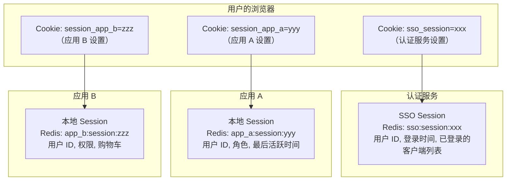
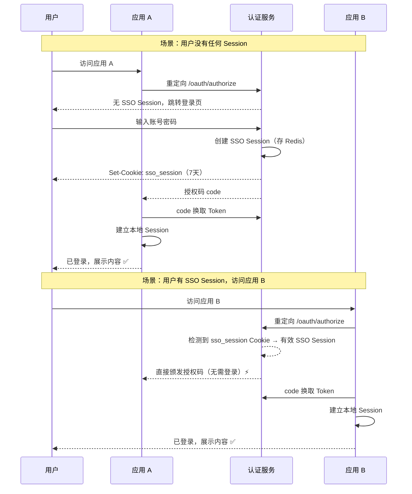
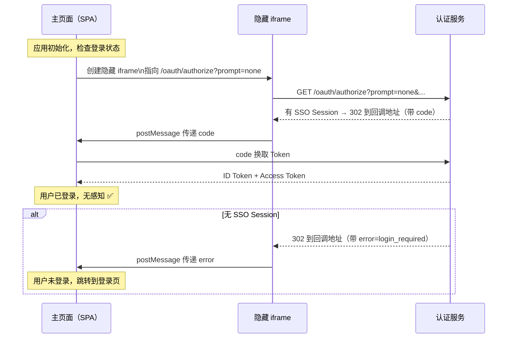

# SSO Session 与免登录

## 本篇导读

### 核心目标

学完本篇后，你将能够：

- 深入理解 SSO Session 的数据结构设计，以及它与各业务应用本地 Session 的关系
- 实现完整的 `SsoService`，包括 Session 的创建、读取、更新和销毁
- 理解并实现 OIDC 的四种 `prompt` 参数值对认证流程的控制效果
- 实现静默认证（Silent Authentication / `prompt=none`）流程，让浏览器无感知地检测登录状态
- 理解多应用登录态同步的机制，以及"登录传播"是如何发生的

### 重点与难点

**重点**：

- SSO Session 与业务应用本地 Session 并存的设计——两者分别解决什么问题
- `prompt` 参数的四种值（`none`、`login`、`consent`、`select_account`）在哪些场景下使用
- `max_age` 参数如何限制 SSO Session 的年龄，触发重新认证

**难点**：

- 静默认证的跨域 iframe 方案——为什么 SPA 需要用 iframe 做静默认证
- 多应用之间"登录传播"的时序——用户登录应用 A 后，访问应用 B 时发生了什么
- `auth_time` vs `iat`——为什么高安全场景需要检查 `auth_time` 而不是 `iat`

## SSO Session 的核心设计哲学

### 两层 Session 并存

理解 SSO 架构最重要的认知：**每个用户同时维护着多个 Session**——一个 SSO Session（在认证服务端），加上 N 个应用本地 Session（分别在各业务应用端）。



**SSO Session 的职责**：

- 记录用户是否已在认证服务处登录
- SSO Session 有效 → 用户不需要再次输入密码，可以免密登录其他应用
- 记录该 SSO 会话中已访问过的客户端（用于 SLO）

**应用本地 Session 的职责**：

- 记录用户在这个特定应用内的登录态
- 存储应用特定的用户数据（角色、权限缓存、业务状态等）
- 控制应用内的访问授权

### 为什么需要应用本地 Session

你可能会问：既然 SSO Session 已经证明了用户的身份，为什么每个应用还要维护自己的 Session？

**理由一：性能**。如果每个 API 请求都需要向认证服务查询 SSO Session 来验证用户身份，认证服务会成为整个系统的性能瓶颈。应用建立本地 Session 后，API 请求只需查询本地 Redis，延迟从跨服务网络级别降到同机房的 Redis 查询级别。

**理由二：应用特定数据**。每个应用的用户信息需求不同——OA 系统关心用户的部门和直属领导，电商应用关心用户的等级和积分。这些信息存在应用自己的 Session 里，无需每次从认证服务查询。

**理由三：独立控制**。应用可以独立控制自己的 Session 过期时间、刷新策略、"记住登录"的持续时长，而不受 SSO Session 的约束。

## SSO Session 的数据结构

### Redis 存储格式

```plaintext
Key: sso:session:{sessionId}

Value: JSON
{
  "userId": "550e8400-e29b-41d4-a716-446655440000",
  "email": "user@example.com",
  "loginTime": 1700000000,       // 用户实际完成认证的 Unix 时间戳（秒）
  "ipAddress": "203.0.113.42",
  "userAgent": "Mozilla/5.0 (Windows NT 10.0; Win64; x64) ...",

  // 本次 SSO 会话期间用户已登录过的客户端 ID 列表
  // 用于 SLO 时通知这些客户端清理本地 Session
  "loggedInClients": ["client_AppA", "client_AppB"],

  // 用户已同意授权的客户端列表（避免重复显示 Consent 页面）
  "consentedClients": ["client_AppA"],

  // 认证方法（密码、MFA、第三方 OAuth 等）
  "amr": ["pwd"],

  // 认证上下文类别（Level of Assurance）
  "acr": "urn:mace:incommon:iap:bronze"
}

TTL: 604800（7天）
```

**关键字段解释**：

**`loginTime`**：这就是 ID Token 中 `auth_time` Claim 的数据来源。用户通过 SSO 免密传递登录态时，新颁发的 ID Token 中的 `auth_time` 应该是用户最初登录的时间，而不是 Token 颁发时间。这样依赖方可以通过检查 `auth_time` 来决定是否需要强制重新认证。

**`loggedInClients`**：单点登出（SLO）时的关键数据。当用户在应用 A 发起全局登出时，认证服务需要知道要通知哪些应用清理本地 Session——这个列表就是答案。

**`consentedClients`**：避免频繁打扰用户。用户对一个内部应用同意过授权后，下次免密登录该应用时不再显示 Consent 页面（除非 `prompt=consent` 强制要求）。

## SsoService 完整实现

```typescript
// src/sso/sso.service.ts
import { Injectable } from '@nestjs/common';
import { RedisService } from '../redis/redis.service';
import { randomBytes } from 'crypto';

export interface SsoSessionData {
  userId: string;
  email: string;
  loginTime: number;
  ipAddress: string;
  userAgent: string;
  loggedInClients: string[];
  consentedClients: string[];
  amr: string[];
}

@Injectable()
export class SsoService {
  private readonly SSO_SESSION_TTL = 7 * 24 * 60 * 60; // 7 天（秒）
  private readonly KEY_PREFIX = 'sso:session:';

  constructor(private readonly redis: RedisService) {}

  // 创建新的 SSO Session（用户登录后调用）
  async createSession(data: {
    userId: string;
    email: string;
    ipAddress: string;
    userAgent: string;
    amr?: string[];
  }): Promise<string> {
    const sessionId = randomBytes(32).toString('base64url');
    const session: SsoSessionData = {
      userId: data.userId,
      email: data.email,
      loginTime: Math.floor(Date.now() / 1000),
      ipAddress: data.ipAddress,
      userAgent: data.userAgent,
      loggedInClients: [],
      consentedClients: [],
      amr: data.amr ?? ['pwd'],
    };

    await this.redis.setex(
      `${this.KEY_PREFIX}${sessionId}`,
      this.SSO_SESSION_TTL,
      JSON.stringify(session)
    );

    return sessionId;
  }

  // 读取 SSO Session
  async getSession(sessionId: string): Promise<SsoSessionData | null> {
    const raw = await this.redis.get(`${this.KEY_PREFIX}${sessionId}`);
    if (!raw) return null;
    return JSON.parse(raw) as SsoSessionData;
  }

  // 记录用户已通过该 SSO Session 登录了某个客户端
  async recordClientLogin(sessionId: string, clientId: string): Promise<void> {
    const session = await this.getSession(sessionId);
    if (!session) return;

    if (!session.loggedInClients.includes(clientId)) {
      session.loggedInClients.push(clientId);
      await this.saveSession(sessionId, session);
    }
  }

  // 记录用户已同意授权某个客户端
  async recordConsent(sessionId: string, clientId: string): Promise<void> {
    const session = await this.getSession(sessionId);
    if (!session) return;

    if (!session.consentedClients.includes(clientId)) {
      session.consentedClients.push(clientId);
      await this.saveSession(sessionId, session);
    }
  }

  // 检查 SSO Session 是否有效（用于受保护资源检查）
  async isSessionValid(sessionId: string): Promise<boolean> {
    const exists = await this.redis.exists(`${this.KEY_PREFIX}${sessionId}`);
    return exists === 1;
  }

  // 销毁 SSO Session（登出时调用）
  async destroySession(sessionId: string): Promise<SsoSessionData | null> {
    const session = await this.getSession(sessionId);
    await this.redis.del(`${this.KEY_PREFIX}${sessionId}`);
    return session;
  }

  // 滑动过期：每次活跃访问时刷新 TTL
  async refreshSessionTtl(sessionId: string): Promise<void> {
    await this.redis.expire(
      `${this.KEY_PREFIX}${sessionId}`,
      this.SSO_SESSION_TTL
    );
  }

  // 获取 Session 的剩余活跃时间（秒）
  async getSessionAge(sessionId: string): Promise<number | null> {
    const session = await this.getSession(sessionId);
    if (!session) return null;
    return Math.floor(Date.now() / 1000) - session.loginTime;
  }

  private async saveSession(
    sessionId: string,
    session: SsoSessionData
  ): Promise<void> {
    // 获取当前剩余 TTL，避免覆盖时重置过期时间
    const remainingTtl = await this.redis.ttl(`${this.KEY_PREFIX}${sessionId}`);
    if (remainingTtl <= 0) return; // Session 已过期，不保存

    await this.redis.setex(
      `${this.KEY_PREFIX}${sessionId}`,
      remainingTtl,
      JSON.stringify(session)
    );
  }
}
```

## `prompt` 参数的完整处理逻辑

`prompt` 参数让客户端应用可以控制认证服务的用户交互行为：

### `prompt=none`：静默认证

不允许任何用户交互。如果用户有有效的 SSO Session，直接颁发授权码；如果没有，立即返回错误（不跳转登录页）。

这是实现 **静默认证（Silent Authentication）** 的核心——应用在后台检查用户是否仍然处于登录状态，而不打扰用户。

```typescript
if (prompt === 'none') {
  if (!ssoSession) {
    // 没有 SSO Session，立即返回 login_required 错误
    return res.redirect(
      buildErrorRedirectUrl(redirect_uri, 'login_required', '', state)
    );
  }
  if (requiresInteraction) {
    // 有 SSO Session 但需要 Consent，返回 interaction_required
    return res.redirect(
      buildErrorRedirectUrl(redirect_uri, 'interaction_required', '', state)
    );
  }
  // 直接颁发授权码，无任何交互
  const code = await issueAuthCode(...);
  return res.redirect(buildRedirectUrl(redirect_uri, code, state));
}
```

**error 值说明**：

- `login_required`：需要用户登录（无 SSO Session）
- `interaction_required`：有 SSO Session 但需要 Consent 或其他用户交互
- `consent_required`：专门表示需要 Consent 界面

### `prompt=login`：强制重新登录

忽略已有的 SSO Session，强制用户重新输入凭据。适用于：

- 高安全性操作前（转账、修改密码、删除账号）
- 应用认为当前 SSO Session 可能来自他人（比如公共电脑）

```typescript
if (prompt === 'login') {
  // 销毁当前 SSO Session（不影响业务应用的本地 Session）
  if (ssoSessionId) {
    await ssoService.destroySession(ssoSessionId);
    res.clearCookie('sso_session');
  }
  // 重定向到登录页
  return res.redirect('/auth/login');
}
```

### `prompt=consent`：强制显示 Consent

即使用户之前已经同意过授权，也强制再次显示 Consent 页面。适用于：

- 应用更新了申请的 Scope（用户需要对新 Scope 进行确认）
- 安全敏感场景（用户需要明确确认某次授权）

```typescript
if (prompt === 'consent') {
  // 忽略 consentedClients 记录，强制跳转 Consent 页面
  session.pendingAuthRequest = { query, userId: ssoSession.userId };
  return res.redirect('/auth/consent');
}
```

### `prompt=select_account`：账号选择

如果用户在认证服务里有多个账号（如企业微信的多组织账号），显示账号选择界面。在只有单一账号的系统中，通常等同于 `prompt=login`。

### `max_age` 参数：Session 年龄限制

```typescript
if (max_age !== undefined) {
  const sessionAge = await ssoService.getSessionAge(ssoSessionId);
  if (sessionAge !== null && sessionAge > max_age) {
    // SSO Session 超龄，需要重新认证
    await ssoService.destroySession(ssoSessionId);
    session.pendingAuthRequest = { query };
    return res.redirect('/auth/login');
  }
}
```

**`max_age` 的典型使用场景**：

```typescript
// 用户要进行支付操作，要求用户在最近 300 秒内（5分钟）有过实际认证
const authUrl = buildAuthUrl({
  ...defaultParams,
  prompt: undefined, // 让 max_age 决定是否需要重新认证
  max_age: 300, // 5 分钟内的认证有效
});
```

如果用户在 5 分钟前登录过（SSO Session 还在，但认证时间超过 5 分钟），会被要求重新输入密码。

## 多应用登录传播：SSO 的核心体验

### "第一次登录"与"SSO 传递登录"的区别



这就是 SSO 的魔法：用户第一次在应用 A 登录时输入了密码，之后访问应用 B 时认证服务检测到了有效的 SSO Session，直接颁发授权码——用户没有感觉到任何"登录"过程，页面直接进入了登录后的状态。

### 登录传播的关键：浏览器携带 SSO Cookie

SSO 的免登录能力依赖于一个前提：用户的浏览器发送对认证服务的请求时，会携带 `sso_session` Cookie。

```plaintext
GET /oauth/authorize?client_id=AppB&... HTTP/1.1
Host: auth.example.com
Cookie: sso_session=用户在应用A登录时设置的值
```

这就是为什么 SSO Session Cookie 要设置 `domain` 为认证服务的域名（而不是各业务应用的域名）——认证服务的 Cookie 只在访问认证服务时发送，不会泄露到业务应用。

## 静默认证（Silent Authentication）实现

### 什么是静默认证

静默认证解决了一个用户体验问题：用户打开 SPA 应用时，应用如何在不跳转到认证服务的情况下，检查用户是否已经通过 SSO 登录过？

直接跳转到 `/oauth/authorize` 会导致页面闪烁（空白 → 认证服务登录页 → 应用页面），用户体验很差。静默认证通过隐藏的 iframe 在后台完成这个检查：



### 前端实现静默认证

```typescript
// 前端 SPA：检查 SSO 登录状态（不显示登录界面）
async function silentAuth(): Promise<TokenSet | null> {
  return new Promise((resolve) => {
    const state = randomBase64();
    const nonce = randomBase64();
    const codeVerifier = randomBase64();
    const codeChallenge = sha256Base64url(codeVerifier);

    // 保存本次授权请求的参数（用于回调验证）
    sessionStorage.setItem('silent_auth_state', state);
    sessionStorage.setItem('silent_auth_nonce', nonce);
    sessionStorage.setItem('silent_auth_verifier', codeVerifier);

    const authUrl =
      `${AUTH_SERVER}/oauth/authorize?` +
      `client_id=${CLIENT_ID}&` +
      `redirect_uri=${encodeURIComponent(SILENT_REDIRECT_URI)}&` +
      `response_type=code&` +
      `scope=openid+profile+email&` +
      `state=${state}&` +
      `nonce=${nonce}&` +
      `code_challenge=${codeChallenge}&` +
      `code_challenge_method=S256&` +
      `prompt=none`; // 关键：不允许任何用户交互

    // 创建隐藏的 iframe（5 秒超时）
    const iframe = document.createElement('iframe');
    iframe.style.display = 'none';
    iframe.src = authUrl;

    const timeout = setTimeout(() => {
      document.body.removeChild(iframe);
      window.removeEventListener('message', onMessage);
      resolve(null);
    }, 5000);

    const onMessage = async (event: MessageEvent) => {
      if (event.origin !== AUTH_SERVER) return;
      const { code, error, state: returnedState } = event.data;

      clearTimeout(timeout);
      document.body.removeChild(iframe);
      window.removeEventListener('message', onMessage);

      if (error || returnedState !== state) {
        resolve(null);
        return;
      }

      // 用 code 换取 Token
      const tokens = await exchangeCodeForTokens(code, codeVerifier);
      resolve(tokens);
    };

    window.addEventListener('message', onMessage);
    document.body.appendChild(iframe);
  });
}
```

### 静默认证的回调页（iframe 内加载的页面）

静默认证需要一个专门的回调页（与主应用的回调页分开），这个页面的唯一职责是把 URL 参数通过 `postMessage` 发给父页面：

```html
<!-- /silent-callback.html -->
<!DOCTYPE html>
<html>
  <body>
    <script>
      // 解析 URL 参数
      const params = new URLSearchParams(window.location.search);
      const result = {
        code: params.get('code'),
        state: params.get('state'),
        error: params.get('error'),
        error_description: params.get('error_description'),
      };

      // 发送给父页面
      if (window.parent !== window) {
        window.parent.postMessage(result, window.location.origin);
      }
    </script>
  </body>
</html>
```

### 为什么需要单独的 `silent_redirect_uri`

静默认证的回调地址必须与普通登录的回调地址分开。原因：

- 普通回调页会处理登录完成后的路由跳转（如 `navigate('/dashboard')`），在 iframe 里执行这些操作会导致奇怪的行为
- 静默回调页只做一件事：`postMessage`，然后什么都不做

在客户端注册时，`redirectUris` 白名单中要同时包含普通回调地址和静默回调地址：

```json
{
  "redirectUris": [
    "https://app.example.com/callback",
    "https://app.example.com/silent-callback"
  ]
}
```

### iframe 方案的安全注意事项

SSO Session Cookie 必须设置 `SameSite=None` 才能在 iframe 中跨站发送（因为主页面是 `app.example.com`，但 iframe 内访问的是 `auth.example.com`）。但 `SameSite=None` 需要同时设置 `Secure`（必须通过 HTTPS）：

```typescript
res.cookie('sso_session', sessionId, {
  httpOnly: true,
  secure: true, // 必须
  sameSite: 'none', // 允许第三方 Cookie（iframe 场景）
  maxAge: 7 * 24 * 60 * 60 * 1000,
});
```

**注意**：现代浏览器（Safari、Firefox）正在逐步限制第三方 Cookie。iframe 的静默认证方案在这些浏览器中可能失效。替代方案是使用 **Check Session Endpoint**（OIDC Session Management 规范，通过同源 iframe 实现）或者将认证服务部署在业务应用的同一个顶级域名下（如 `auth.example.com` 与 `app.example.com` 共享 `.example.com` 顶级 Cookie）。

## Session 安全加固

### Session ID 的生命周期管理

SSO Session ID 既是高价值的认证凭证，也是攻击目标。需要以下保护措施：

**防 Session 固定攻击（Session Fixation）**：

在用户登录 **成功前后**，必须生成新的 Session ID。如果攻击者事先知道了 Session ID（比如通过某种方式在受害者浏览器植入了一个已知 Session ID），然后等用户登录，就能以该 Session ID 访问用户的账号。解决方案：登录成功后始终生成新的 Session ID：

```typescript
// 登录成功后，清除旧 Session ID，创建新 Session
async login(userId: string, ...): Promise<string> {
  // 不复用任何预先存在的 Session ID
  const newSessionId = await this.ssoService.createSession({ userId, ... });
  return newSessionId;
}
```

**单设备 Session 限制（可选）**：

如果你的安全策略要求"同一时间只允许一个设备登录"，可以在 Redis 中维护用户的 Session ID 列表，每次新登录时撤销所有旧 Session：

```typescript
// Redis 中维护用户的所有活跃 Session
await redis.sadd(`user:sessions:${userId}`, sessionId);
await redis.expire(`user:sessions:${userId}`, SSO_SESSION_TTL);

// 单设备模式：新登录时清除旧 Session
async forceLogoutOtherDevices(userId: string, currentSessionId: string) {
  const sessions = await redis.smembers(`user:sessions:${userId}`);
  for (const sid of sessions) {
    if (sid !== currentSessionId) {
      await this.ssoService.destroySession(sid);
    }
  }
}
```

### SSO Session 的滑动过期 vs 固定过期

**固定过期**：Session 从创建时起固定 7 天过期，无论用户是否活跃。7 天后必须重新登录。

**滑动过期**：每次活跃访问（即每次 SSO Session 被使用）都延长过期时间。连续活跃的用户可以一直保持登录状态。

两种策略的权衡：

| 维度       | 固定过期                     | 滑动过期                          |
| ---------- | ---------------------------- | --------------------------------- |
| 安全性     | 更高（7天后必须重登）        | 稍低（活跃用户可以永不过期）      |
| 用户体验   | 活跃用户可能中途被踢出       | 活跃用户永远不会被意外登出        |
| 实现复杂度 | 简单                         | 需要在每次授权时刷新 TTL          |
| 泄露风险   | 泄露的 Session 最多 7 天有效 | 泄露的 Session 只要继续使用就有效 |

企业应用通常使用混合策略：设置**最大绝对生命周期**（如 30 天）和**活跃滑动窗口**（如 7 天不活跃则过期）：

```typescript
// 每次使用 SSO Session 时，刷新活跃窗口 TTL（7 天）
await redis.expire(`sso:session:${sessionId}`, 7 * 24 * 3600);

// 同时记录 Session 的绝对创建时间，超过 30 天强制失效
if (session.loginTime < now - 30 * 24 * 3600) {
  await ssoService.destroySession(sessionId);
  return null;
}
```

## 常见问题与解决方案

### Q：SSO Session 有效期应该设置多长？

**A**：没有统一答案，取决于安全策略和用户体验的平衡。常见参考值：

- **高安全性（金融、医疗）**：30分钟~2小时，结合 `max_age` 对敏感操作要求重新认证
- **企业内部应用**：8~24小时（工作日结束后过期）
- **To C 消费类应用**：7~30天（"记住我"功能）

建议的策略：短 SSO Session + 频繁的静默认证刷新（每次活跃时通过 `prompt=none` 静默续期），而不是超长 SSO Session。

### Q：用户修改密码后，如何立即失效所有 SSO Session？

**A**：在 Redis 中维护用户的 Session ID 集合：

```typescript
// 修改密码时，立即撤销所有 Session
async onPasswordChanged(userId: string) {
  const sessions = await redis.smembers(`user:sessions:${userId}`);
  for (const sessionId of sessions) {
    await redis.del(`sso:session:${sessionId}`);
  }
  await redis.del(`user:sessions:${userId}`);

  // 同时撤销所有 Refresh Token
  await tokenService.revokeAllTokensForUser(userId);
}
```

### Q：SSO Session 为什么不用 JWT？

**A**：SSO Session 需要服务端可撤销——管理员需要能够立即踢出某个用户，而 JWT 是自包含的，无法服务端撤销（除非加黑名单）。Redis 存储的 Session 只需删除对应的 key 就能立即失效，简单且可靠。JWT 的无状态优势在 SSO Session 场景下反而是劣势。

## 本篇小结

本篇深入讲解了 SSO Session 的设计与实现，以及"免登录"体验的技术机制。

**两层 Session 设计**是 SSO 架构的核心：SSO Session 在认证服务端记录全局登录状态，各应用本地 Session 存储应用特定数据。两者并存，各自解决不同问题——不能合并成一个。

**`SsoService` 实现**封装了 SSO Session 的完整生命周期：创建（用户登录时）、读取（授权端点检查时）、更新（记录已登录客户端和已同意授权的客户端）、销毁（登出时）。所有操作以 Redis 为存储层，以 `sso:session:{id}` 为 key 命名空间。

**`prompt` 参数的四种值**（`none`、`login`、`consent`、`select_account`）和 `max_age` 参数，共同构成了客户端应用控制认证服务用户交互行为的完整机制，从"完全静默"到"强制重新认证"全面覆盖。

**静默认证（`prompt=none` + 隐藏 iframe + `postMessage`）** 是 SPA 应用实现无感知登录状态检测的标准方案，需要单独的 `silent-redirect-uri` 和正确的 Cookie `SameSite` 配置。

下一篇将讲解单点登出（SLO）——当用户选择"退出登录"时，如何协调清理所有应用的本地 Session，实现真正的"退出一处，处处退出"。
