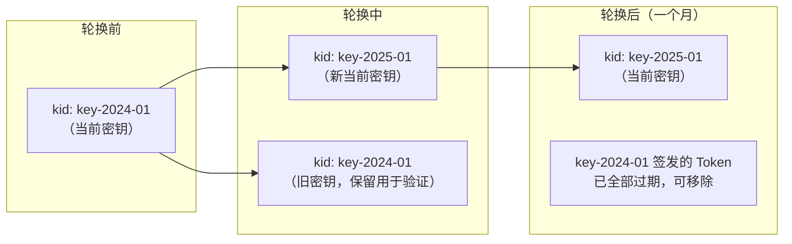
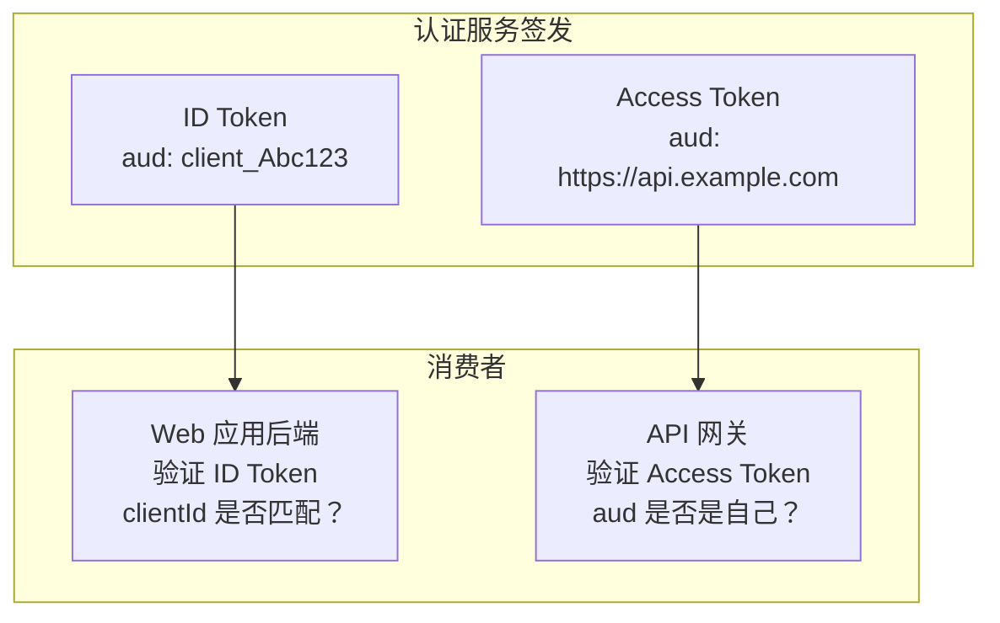

# OIDC 标准端点

## 本篇导读

### 核心目标

学完本篇后，你将能够：

- 理解 OIDC 发现文档（Discovery Document）的作用，以及为什么它让集成变得简单
- 实现 `/.well-known/openid-configuration` 端点，完整描述认证服务的能力
- 实现 JWKS 端点，安全地公开 RS256 公钥供其他服务验证 JWT
- 实现 `/oauth/userinfo` 端点，让客户端应用能获取最新的用户信息
- 理解公钥管理和密钥轮换的完整方案

### 重点与难点

**重点**：

- Discovery Document 是"自描述"的关键——客户端不需要硬编码任何端点地址
- JWKS 端点的安全性设计——公钥公开是安全的，但要防止 DoS 和缓存击穿
- UserInfo 端点的访问控制——只有携带有效 Access Token 才能访问

**难点**：

- 密钥轮换的无感知设计——旧密钥签发的 Token 在轮换后仍然可以验证
- `kid`（Key ID）在多密钥场景下的作用
- 为什么 Access Token 的 `aud` 应该是 API 地址，而不是客户端 `client_id`

## 为什么需要这些"标准端点"

在 OIDC 出现之前，每个 OAuth2 服务提供商都有自己的 API 格式——GitHub 的用户信息 API 是 `/api/user`，Google 是 `/oauth2/v1/userinfo`，各有各的字段命名。这带来了集成的碎片化：接入每个平台都需要单独研究文档、单独写适配代码。

OIDC 通过三个机制解决了这个问题：

**标准端点**：所有 OIDC 服务器必须实现相同的端点路径和响应格式（UserInfo、JWKS、Discovery）。

**Discovery Document**：OIDC 服务器在 `/.well-known/openid-configuration` 提供一个机器可读的 JSON 文档，描述所有端点地址、支持的算法、Scope、Claim 等信息。客户端只需要知道"认证服务的基地址"，其他一切从 Discovery 文档自动发现。

**标准 JWT 格式**：ID Token 使用标准 JWT 格式，`kid` 字段指向 JWKS 中的公钥，任何服务都可以独立验证。

这三个机制让 OIDC 客户端库只需要配置一个 `issuer` URL，剩下的全部自动化。

## Discovery Document 端点

### 端点位置

Discovery Document 必须位于：

```plaintext
{issuer}/.well-known/openid-configuration
```

如果认证服务的 `issuer` 是 `https://auth.example.com`，则 Discovery Document 的 URL 是：

```plaintext
https://auth.example.com/.well-known/openid-configuration
```

### Discovery Document 的内容

这是一个 JSON 文档，包含认证服务的所有元数据：

```json
{
  "issuer": "https://auth.example.com",
  "authorization_endpoint": "https://auth.example.com/oauth/authorize",
  "token_endpoint": "https://auth.example.com/oauth/token",
  "userinfo_endpoint": "https://auth.example.com/oauth/userinfo",
  "jwks_uri": "https://auth.example.com/.well-known/jwks.json",
  "end_session_endpoint": "https://auth.example.com/oauth/logout",
  "check_session_iframe": "https://auth.example.com/oauth/session",
  "registration_endpoint": "https://auth.example.com/clients",
  "scopes_supported": ["openid", "profile", "email", "offline_access"],
  "response_types_supported": ["code"],
  "grant_types_supported": ["authorization_code", "refresh_token"],
  "subject_types_supported": ["public"],
  "id_token_signing_alg_values_supported": ["RS256"],
  "token_endpoint_auth_methods_supported": [
    "client_secret_basic",
    "client_secret_post",
    "none"
  ],
  "claims_supported": [
    "sub",
    "iss",
    "aud",
    "exp",
    "iat",
    "auth_time",
    "nonce",
    "email",
    "email_verified",
    "name",
    "picture",
    "updated_at"
  ],
  "code_challenge_methods_supported": ["S256"],
  "frontchannel_logout_supported": true,
  "backchannel_logout_supported": true,
  "backchannel_logout_session_supported": true
}
```

### 实现 Discovery Controller

```typescript
// src/discovery/discovery.controller.ts
import { Controller, Get } from '@nestjs/common';
import { ConfigService } from '@nestjs/config';

@Controller('.well-known')
export class DiscoveryController {
  private issuer: string;

  constructor(private readonly config: ConfigService) {
    this.issuer = this.config.getOrThrow<string>('OIDC_ISSUER');
  }

  @Get('openid-configuration')
  getOpenIdConfiguration() {
    return {
      issuer: this.issuer,
      authorization_endpoint: `${this.issuer}/oauth/authorize`,
      token_endpoint: `${this.issuer}/oauth/token`,
      userinfo_endpoint: `${this.issuer}/oauth/userinfo`,
      jwks_uri: `${this.issuer}/.well-known/jwks.json`,
      end_session_endpoint: `${this.issuer}/oauth/logout`,

      scopes_supported: ['openid', 'profile', 'email', 'offline_access'],
      response_types_supported: ['code'],
      grant_types_supported: ['authorization_code', 'refresh_token'],
      subject_types_supported: ['public'],

      id_token_signing_alg_values_supported: ['RS256'],
      token_endpoint_auth_methods_supported: [
        'client_secret_basic',
        'client_secret_post',
        'none', // 公开客户端（PKCE 模式）
      ],

      claims_supported: [
        'sub',
        'iss',
        'aud',
        'exp',
        'iat',
        'auth_time',
        'nonce',
        'email',
        'email_verified',
        'name',
        'picture',
        'updated_at',
      ],

      code_challenge_methods_supported: ['S256'],

      // SLO 支持声明
      frontchannel_logout_supported: true,
      backchannel_logout_supported: true,
      backchannel_logout_session_supported: true,
    };
  }
}
```

**关于 Discovery Document 的缓存**：Discovery Document 很少变化（只有在添加新端点或新能力时才更新），可以设置较长的缓存时间：

```typescript
@Get('openid-configuration')
@Header('Cache-Control', 'public, max-age=86400') // 缓存 24 小时
getOpenIdConfiguration() { ... }
```

## JWKS 端点

### 什么是 JWKS

JWKS（JSON Web Key Set）是一种标准格式（RFC 7517），用于表示公钥集合。JWKS 端点是认证服务公开自己公钥的地方，任何需要验证 JWT 的服务（API 网关、业务服务）都可以从这里获取公钥。

一个典型的 JWKS 响应：

```json
{
  "keys": [
    {
      "kty": "RSA",
      "use": "sig",
      "alg": "RS256",
      "kid": "key-2024-01",
      "n": "0vx7agoebGcQSuuPiLJXZptN9nndrQmbXEps2aiAFbWhM90Y...",
      "e": "AQAB"
    }
  ]
}
```

字段说明：

| 字段  | 含义                                      |
| ----- | ----------------------------------------- |
| `kty` | 密钥类型（RSA、EC 等）                    |
| `use` | 密钥用途（`sig` = 签名，`enc` = 加密）    |
| `alg` | 签名算法（RS256）                         |
| `kid` | 密钥 ID，与 JWT Header 中的 `kid` 对应    |
| `n`   | RSA 公钥的模数（Base64URL 编码）          |
| `e`   | RSA 公钥的指数（通常是 `AQAB`，即 65537） |

### 实现 JWKS 端点

```typescript
// src/discovery/jwks.controller.ts
import { Controller, Get, Header } from '@nestjs/common';
import { KeysService } from '../keys/keys.service';

@Controller('.well-known')
export class JwksController {
  constructor(private readonly keysService: KeysService) {}

  @Get('jwks.json')
  @Header('Cache-Control', 'public, max-age=3600') // 公钥可缓存，但不宜太长（考虑密钥轮换）
  @Header('Content-Type', 'application/json')
  getJwks() {
    return {
      keys: this.keysService.getAllPublicJwks(),
    };
  }
}
```

### KeysService 支持多密钥

为了支持密钥轮换（同时存在新旧两个密钥），`KeysService` 需要管理密钥集合：

```typescript
// src/keys/keys.service.ts
import { Injectable, OnModuleInit } from '@nestjs/common';
import { ConfigService } from '@nestjs/config';
import { createPrivateKey, createPublicKey, KeyObject } from 'crypto';

interface KeyPair {
  kid: string;
  privateKey: KeyObject;
  publicKey: KeyObject;
  algorithm: 'RS256';
}

@Injectable()
export class KeysService implements OnModuleInit {
  private keys: Map<string, KeyPair> = new Map();
  private currentKid: string;

  constructor(private readonly config: ConfigService) {}

  onModuleInit() {
    // 加载当前活跃密钥
    const kid = this.config.getOrThrow<string>('JWT_KEY_ID');
    const privatePem = this.config.getOrThrow<string>('JWT_PRIVATE_KEY');
    this.addKey(kid, privatePem);
    this.currentKid = kid;

    // 加载旧密钥（如果有）用于验证过渡期 Token
    const legacyKid = this.config.get<string>('JWT_LEGACY_KEY_ID');
    const legacyPem = this.config.get<string>('JWT_LEGACY_PRIVATE_KEY');
    if (legacyKid && legacyPem) {
      this.addKey(legacyKid, legacyPem);
    }
  }

  private addKey(kid: string, privatePem: string) {
    const privateKey = createPrivateKey(privatePem);
    const publicKey = createPublicKey(privateKey);
    this.keys.set(kid, { kid, privateKey, publicKey, algorithm: 'RS256' });
  }

  // 获取当前签名用密钥（私钥）
  getCurrentPrivateKey(): KeyObject {
    return this.keys.get(this.currentKid)!.privateKey;
  }

  // 获取当前 kid
  getCurrentKid(): string {
    return this.currentKid;
  }

  // 获取指定 kid 的公钥（用于验证）
  getPublicKey(kid: string): KeyObject | null {
    return this.keys.get(kid)?.publicKey ?? null;
  }

  // 导出所有公钥的 JWK 格式（用于 JWKS 端点）
  getAllPublicJwks(): object[] {
    return Array.from(this.keys.values()).map(({ publicKey, kid }) => ({
      ...publicKey.export({ format: 'jwk' }),
      use: 'sig',
      alg: 'RS256',
      kid,
    }));
  }
}
```

### JWKS 缓存与密钥轮换的协调

JWT Header 中的 `kid` 字段告诉验证方去 JWKS 端点的哪个密钥验证：

```json
{
  "alg": "RS256",
  "typ": "JWT",
  "kid": "key-2024-01"
}
```

**验证方的正确实现**：

```typescript
// API 网关或业务服务验证 JWT 的伪代码
async function verifyToken(token: string) {
  const decoded = decodeHeader(token); // 不验证，只解码 Header 取 kid
  const kid = decoded.kid;

  // 从缓存或 JWKS 端点获取公钥
  let publicKey = jwksCache.get(kid);
  if (!publicKey) {
    const jwks = await fetch('https://auth.example.com/.well-known/jwks.json');
    const { keys } = await jwks.json();
    const jwk = keys.find((k) => k.kid === kid);
    if (!jwk) throw new Error(`未知的 kid: ${kid}`);
    publicKey = await importPublicKey(jwk);
    jwksCache.set(kid, publicKey); // 缓存，避免频繁请求 JWKS
  }

  return verify(token, publicKey, { algorithms: ['RS256'] });
}
```

**密钥轮换流程**：



密钥轮换的关键点：不能直接删除旧密钥——既有的 JWT（尤其是 Refresh Token 关联的 Access Token）可能还在用旧密钥签名。旧密钥需要保留到所有用它签名的 JWT 都过期为止（通常是 Access Token 的生命周期，15 分钟~1 小时）。

## UserInfo 端点

### 端点设计

`/oauth/userinfo` 是一个受保护的端点，只有携带有效 Access Token 才能访问。它返回当前用户的 OIDC Claims，让客户端可以获取最新的用户信息（而不是依赖 ID Token 中可能已经过期的信息）。

```typescript
// src/oauth/userinfo/userinfo.controller.ts
import {
  Controller,
  Get,
  Post,
  Req,
  Res,
  UnauthorizedException,
} from '@nestjs/common';
import { Request, Response } from 'express';
import { KeysService } from '../../keys/keys.service';
import { UsersService } from '../../users/users.service';
import { verify } from 'jsonwebtoken';

@Controller('oauth')
export class UserInfoController {
  constructor(
    private readonly keysService: KeysService,
    private readonly usersService: UsersService
  ) {}

  // OIDC 规范要求同时支持 GET 和 POST
  @Get('userinfo')
  @Post('userinfo')
  async getUserInfo(@Req() req: Request, @Res() res: Response) {
    // 从 Authorization: Bearer <token> 中提取 Access Token
    const authHeader = req.headers.authorization;
    if (!authHeader?.startsWith('Bearer ')) {
      res.setHeader('WWW-Authenticate', 'Bearer realm="auth.example.com"');
      throw new UnauthorizedException('缺少 Bearer Token');
    }

    const accessToken = authHeader.slice(7);

    // 验证 Access Token
    let payload: any;
    try {
      const decoded = this.decodeHeader(accessToken);
      const kid = decoded.kid as string;
      const publicKey = this.keysService.getPublicKey(kid);

      if (!publicKey) {
        throw new UnauthorizedException(`未知的密钥 ID: ${kid}`);
      }

      payload = verify(accessToken, publicKey, {
        algorithms: ['RS256'],
        issuer: process.env.OIDC_ISSUER,
        audience: process.env.API_AUDIENCE,
      });
    } catch (err: any) {
      res.setHeader(
        'WWW-Authenticate',
        `Bearer error="invalid_token", error_description="${err.message}"`
      );
      throw new UnauthorizedException('Token 无效或已过期');
    }

    // 从数据库获取最新用户信息
    const user = await this.usersService.findById(payload.sub);
    if (!user) {
      throw new UnauthorizedException('用户不存在');
    }

    // 根据 Token 中的 scope 返回对应的 Claims
    const scope = (payload.scope as string) ?? '';
    const scopes = new Set(scope.split(' '));

    const claims: Record<string, unknown> = {
      sub: user.id,
    };

    if (scopes.has('email')) {
      claims.email = user.email;
      claims.email_verified = user.emailVerified ?? false;
    }

    if (scopes.has('profile')) {
      claims.name = user.name ?? null;
      claims.picture = user.avatarUrl ?? null;
      claims.updated_at = Math.floor(user.updatedAt.getTime() / 1000);
    }

    // UserInfo 响应也可以是 JWT（application/jwt），
    // 但大多数场景用 JSON 格式（application/json）就够了
    return res.json(claims);
  }

  // 从 JWT 中解码 Header（不验证签名）
  private decodeHeader(token: string): Record<string, unknown> {
    const parts = token.split('.');
    if (parts.length !== 3) throw new Error('无效的 JWT 格式');
    return JSON.parse(Buffer.from(parts[0], 'base64url').toString());
  }
}
```

### UserInfo 端点 vs ID Token 中的 Claims

两者都包含用户信息，但有重要区别：

| 维度     | ID Token 中的 Claims          | UserInfo 端点返回的 Claims    |
| -------- | ----------------------------- | ----------------------------- |
| 时效性   | 颁发时的快照，可能过期        | 实时从数据库查询，始终最新    |
| 调用成本 | 零（已包含在 Token 里）       | 一次 HTTP 请求                |
| 适用场景 | 建立本地 Session 时（一次性） | 需要最新用户信息时            |
| 签名保护 | 有（JWT 签名）                | 无（依赖 HTTPS + Token 验证） |

**最佳实践**：

- 用 ID Token 完成初始登录（建立本地 Session，从 ID Token 提取用户信息缓存）
- 需要实时用户信息时（如用户修改了头像或邮箱），调用 UserInfo 端点

### UserInfo 响应的安全要求

```typescript
// UserInfo 端点必须设置
res.setHeader('Cache-Control', 'no-store');
res.setHeader('Pragma', 'no-cache');
```

UserInfo 包含用户个人信息，不应该被任何缓存存储。

## Access Token 的 `aud` 字段设计

在前面的实现中，我们为 Access Token 设置了 `aud: process.env.API_AUDIENCE`，而 ID Token 的 `aud` 是 `client_id`。这个区别很重要，值得单独讲解。

### 为什么 Access Token 和 ID Token 的 `aud` 不同

**ID Token 的 `aud` 是客户端 `client_id`**：ID Token 是给客户端应用（Web 应用的前端/后端）看的，它包含的用户身份信息专门给这个应用使用。如果有人把一个应用的 ID Token 提交给另一个应用，验证 `aud` 可以阻止这种攻击。

**Access Token 的 `aud` 是 API 地址**：Access Token 是给 API 服务端（资源服务器）看的。API 网关验证 Access Token 时，检查 `aud` 是否是自己的地址。这防止了"把针对 API-A 颁发的 Access Token 提交给 API-B"的攻击。



## 实现 Token 自省端点（Introspection）

虽然本教程主要使用 JWT 格式的自包含 Token，但为了兼容性（有些旧版客户端或资源服务器需要），可以提供 Token Introspection 端点（RFC 7662）：

```typescript
// src/oauth/introspect/introspect.controller.ts
@Controller('oauth')
export class IntrospectController {
  @Post('introspect')
  async introspect(@Req() req: Request, @Res() res: Response) {
    // 验证调用方的客户端身份（只有注册的客户端才能内省）
    const { clientId, clientSecret } = this.extractClientCredentials(req);
    const client = await this.clientsService.findByClientId(clientId ?? '');
    if (
      !client ||
      !(await this.clientsService.verifyClientSecret(
        client,
        clientSecret ?? ''
      ))
    ) {
      return res.status(401).json({ error: 'invalid_client' });
    }

    const token = req.body.token as string;
    if (!token) {
      return res.json({ active: false });
    }

    try {
      const payload = verify(token, publicKey, { algorithms: ['RS256'] });
      // 检查是否在黑名单
      // ...
      return res.json({ active: true, ...payload });
    } catch {
      return res.json({ active: false });
    }
  }
}
```

## CORS 配置

JWKS 端点和 Discovery 端点需要响应跨域请求（浏览器端的 SPA 应用需要直接访问这些端点）：

```typescript
// main.ts
app.enableCors({
  origin: (origin, callback) => {
    // 允许已注册的客户端来源
    const allowedOrigins = await clientsService.getAllowedOrigins();
    if (!origin || allowedOrigins.includes(origin)) {
      callback(null, true);
    } else {
      callback(new Error('不允许的跨域来源'));
    }
  },
  credentials: true,
});
```

对于 JWKS 和 Discovery 端点，可以直接设定 `Access-Control-Allow-Origin: *`——这些端点只包含公钥和元数据，没有任何敏感信息，开放 CORS 完全安全：

```typescript
@Get('jwks.json')
@Header('Access-Control-Allow-Origin', '*')
@Header('Cache-Control', 'public, max-age=3600')
getJwks() { ... }
```

## 常见问题与解决方案

### Q：JWKS 端点的公钥被恶意替换了怎么办？

**A**：JWKS 端点只提供公钥，公钥本身不是秘密——任何人都可以获取。攻击者获得公钥没有任何用处，因为他们没有对应的私钥，无法伪造 JWT。

真正的风险是：攻击者伪造一个假的 JWKS 端点，让 API 网关使用攻击者的公钥验证——这样攻击者用自己的私钥签名的 JWT 就能通过验证。防御措施：

1. JWKS URI 应该写死在 API 网关的配置里，而不是依赖动态发现
2. API 网关与认证服务之间通过 TLS 进行通信
3. 固定证书锁定（Certificate Pinning）可以进一步防止中间人替换

### Q：UserInfo 端点可以缓存吗？

**A**：不应该在服务端缓存 UserInfo 响应（需要实时数据），但客户端（如浏览器内存）可以缓存较短时间（如 5 分钟）。注意：`Cache-Control: no-store` 是对共享缓存（代理、CDN）的禁止，客户端内存缓存不受 HTTP 缓存头控制。

### Q：Discovery Document 需要身份验证吗？

**A**：不需要。Discovery Document 是完全公开的——其中的所有信息（端点 URL、支持的算法等）都不是敏感信息，任何人都可以访问。这正是 OIDC 的设计哲学：公开所有"协议元数据"，简化集成。

### Q：`/oauth/token` 端点的 `aud` 验证是否适用于所有情况？

**A**：JWT Access Token 的 `aud` 验证需要结合实际部署架构来配置。如果公司有多个 API 服务（`api-a.example.com`、`api-b.example.com`），有两种选择：

1. **统一 audience**：所有 API 共用一个 audience（如 `https://api.example.com`），在 API 内部通过 `scope` 区分权限
2. **多 audience**：每个 API 有独立的 audience，在颁发 Token 时指定目标 API

本教程使用选项 1（简单场景），选项 2 适合高安全性要求的多 API 场景。

## 本篇小结

本篇实现了 OIDC 协议的三个"配套端点"，它们让认证服务真正变成一个标准、可互操作的 OIDC Provider。

**Discovery Document**（`/.well-known/openid-configuration`）实现了认证服务的"自描述"——OIDC 客户端库只需要知道 `issuer`，就能自动发现所有端点地址和服务能力，无需硬编码配置。

**JWKS 端点**（`/.well-known/jwks.json`）以标准 JWK 格式公开了 RS256 公钥。我们设计了支持多密钥的 `KeysService`，以 `kid` 字段为索引，支持密钥轮换过渡期（新旧公钥同时存在，老 Token 仍可验证）。

**UserInfo 端点**（`/oauth/userinfo`）提供了实时的用户信息查询接口，需要携带有效的 Bearer Access Token 才能访问。我们明确了它与 ID Token 中 Claims 的区别：ID Token 是颁发时的快照，UserInfo 是实时数据库查询。

**`aud` 字段设计**是本篇的一个重要概念：ID Token 的 `aud` 是 `client_id`（给客户端应用看的），Access Token 的 `aud` 是 API 地址（给资源服务器看的）——这个区分是防止令牌混用攻击的关键设计。

下一篇将聚焦 SSO Session 的设计与实现，讲解"免登录"是如何实现的，以及 `prompt` 参数的完整处理逻辑。
