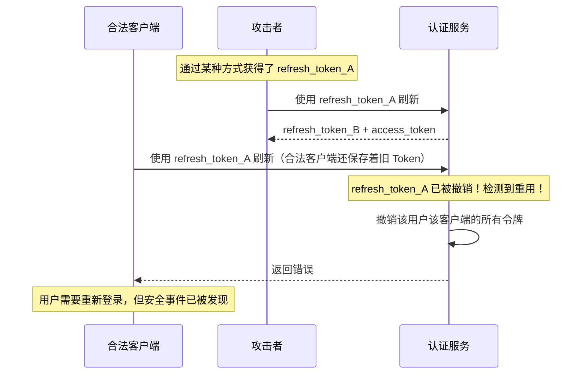

# Token 端点实现

## 本篇导读

### 核心目标

学完本篇后，你将能够：

- 理解 `/oauth/token` 端点的作用，以及它与 `/oauth/authorize` 的关系
- 实现机密客户端和公开客户端（PKCE）两种客户端认证方式
- 生成符合 OIDC 规范的 ID Token（包含正确的 Claims 和签名）
- 生成短生命周期 Access Token 和长生命周期 Refresh Token
- 使用 Refresh Token 刷新 Access Token，并理解刷新时的安全要求

### 重点与难点

**重点**：

- ID Token 的标准 Claims 结构——哪些是必须的，哪些对应用有实际价值
- 客户端认证的两种方式——`client_secret_basic` 和 `client_secret_post`
- Refresh Token 的安全设计——存储、验证、轮换（Refresh Token Rotation）

**难点**：

- Token 端点的安全要求比授权端点更高，为什么必须通过 HTTPS 且绝对不能重定向
- `auth_time` Claim 的含义，以及为什么它比 `iat` 更重要
- Refresh Token Rotation 机制——如何在刷新时检测令牌被盗用

## Token 端点的定位与安全要求

### 为什么 Token 端点和授权端点设计如此不同

`/oauth/authorize` 端点通过浏览器重定向工作，是 Front-Channel 通信——信息经过用户的浏览器，安全敏感信息必须通过授权码的间接传递来保护。

`/oauth/token` 端点是 Back-Channel 通信——这是客户端应用的后端服务器直接向认证服务发起的 HTTPS POST 请求，不经过用户浏览器。这带来了几个设计上的差异：

**差异一：不能有重定向**。Token 端点是一个普通的 REST API，直接返回 JSON，绝不重定向。

**差异二：请求体而不是 Query String**。敏感参数（`client_secret`、`code`）通过 POST Body 传递，而不是 URL 参数——URL 会出现在日志、Referer 头中，存在信息泄露风险。

**差异三：必须验证客户端身份**。拿到授权码的不一定是合法的客户端——攻击者可能截获了授权码。Token 端点通过验证 `client_id + client_secret`（机密客户端）或 PKCE `code_verifier`（公开客户端）来确认请求者就是最初发起授权请求的那个客户端。

### Token 端点的请求格式

```http
POST /oauth/token HTTP/1.1
Host: auth.example.com
Content-Type: application/x-www-form-urlencoded
Authorization: Basic Y2xpZW50X2lk...  （或通过 POST Body 传 client_id/client_secret）

grant_type=authorization_code&
code=AUTH_CODE_HERE&
redirect_uri=https://app.example.com/callback&
client_id=client_Abc123...&
code_verifier=...（公开客户端，PKCE 验证）
```

**`Content-Type` 必须是 `application/x-www-form-urlencoded`**，这是 OAuth2 规范要求的，不是 JSON。

## 客户端身份认证的两种方式

### `client_secret_basic`——HTTP Basic Auth

机密客户端可以通过 HTTP Basic Authentication 传递 `client_id` 和 `client_secret`：

```http
Authorization: Basic BASE64(client_id + ":" + client_secret)
```

### `client_secret_post`——POST Body 传参

也可以在 POST Body 中直接传递：

```plaintext
client_id=client_Abc123...&client_secret=secret_value&grant_type=...
```

实际实现时，这两种方式都要支持：

```typescript
// 从请求中提取客户端凭据
function extractClientCredentials(req: Request): {
  clientId: string | null;
  clientSecret: string | null;
} {
  // 优先从 HTTP Basic Auth 中取
  const authHeader = req.headers.authorization;
  if (authHeader?.startsWith('Basic ')) {
    const decoded = Buffer.from(authHeader.slice(6), 'base64').toString();
    const [clientId, clientSecret] = decoded.split(':');
    return {
      clientId: decodeURIComponent(clientId),
      clientSecret: decodeURIComponent(clientSecret),
    };
  }

  // 降级从 POST Body 中取
  const { client_id, client_secret } = req.body as Record<string, string>;
  return { clientId: client_id ?? null, clientSecret: client_secret ?? null };
}
```

### PKCE 验证（公开客户端）

公开客户端没有 `client_secret`，用 PKCE 的 `code_verifier` 来验证身份。验证逻辑：

```typescript
function verifyPkce(
  codeVerifier: string,
  codeChallenge: string,
  method: string
): boolean {
  if (method !== 'S256') return false; // 只接受 S256

  const computed = createHash('sha256')
    .update(codeVerifier)
    .digest('base64url');

  return timingSafeEqual(Buffer.from(computed), Buffer.from(codeChallenge));
}
```

## ID Token 的 Claims 结构

ID Token 是 OIDC 与 OAuth2 最核心的区别——它是一个 JWT，包含了用户的身份信息，供客户端应用使用。

### 必须包含的 Claims

| Claim | 类型   | 含义                                                              |
| ----- | ------ | ----------------------------------------------------------------- |
| `iss` | string | 令牌颁发者，必须是认证服务的 URL（如 `https://auth.example.com`） |
| `sub` | string | 用户的唯一标识符（在认证服务内唯一，通常是用户 ID）               |
| `aud` | string | 令牌的目标受众，必须是接收此 Token 的客户端的 `client_id`         |
| `exp` | number | 过期时间（Unix 时间戳，秒级）                                     |
| `iat` | number | 令牌颁发时间（Unix 时间戳，秒级）                                 |

### 推荐包含的 Claims

| Claim            | 类型    | 含义                                                  |
| ---------------- | ------- | ----------------------------------------------------- |
| `auth_time`      | number  | 用户实际完成认证的时间（与 `iat` 不同，详见下方说明） |
| `nonce`          | string  | 从授权请求中带入，防 ID Token 重放攻击                |
| `email`          | string  | 用户邮箱（需要 `email` Scope）                        |
| `email_verified` | boolean | 邮箱是否已验证                                        |
| `name`           | string  | 用户全名（需要 `profile` Scope）                      |

**`auth_time` 与 `iat` 的区别**：

- `iat` 是这个 ID Token JWT 的颁发时间——每次访问应用刷新 Token 时，颁发一个新 JWT，`iat` 就更新为当前时间
- `auth_time` 是用户最后一次实际输入密码（或其他凭据）完成认证的时间——即使 SSO Session 有效并自动传递登录态，`auth_time` 也不更新

当应用需要高安全性操作（如转账、改密码）时，可以检查 `auth_time`：如果距离用户上次真实认证超过 N 分钟，要求用户重新输入密码——而不是依赖 SSO 的自动传递。

### 根据 Scope 决定 Claims

```typescript
function buildIdTokenClaims(
  user: User,
  grantedScope: string,
  client: OAuthClient,
  nonce?: string,
  authTime?: number
): Record<string, unknown> {
  const scopes = new Set(grantedScope.split(' '));

  const claims: Record<string, unknown> = {
    // 必须 Claims
    sub: user.id,
    aud: client.clientId,
    // 时间 Claims（由外部注入，不在这里生成）
  };

  // email scope
  if (scopes.has('email')) {
    claims.email = user.email;
    claims.email_verified = user.emailVerified;
  }

  // profile scope
  if (scopes.has('profile')) {
    claims.name = user.name ?? null;
    claims.picture = user.avatarUrl ?? null;
    claims.updated_at = Math.floor(user.updatedAt.getTime() / 1000);
  }

  // 可选 Claims
  if (nonce) claims.nonce = nonce;
  if (authTime) claims.auth_time = authTime;

  return claims;
}
```

## TokenService 完整实现

```typescript
// src/oauth/token/token.service.ts
import {
  Injectable,
  UnauthorizedException,
  BadRequestException,
} from '@nestjs/common';
import { InjectDrizzle } from '../../database/database.module';
import { DrizzleDB } from '../../database/database.service';
import { KeysService } from '../../keys/keys.service';
import { ClientsService } from '../../clients/clients.service';
import { UsersService } from '../../users/users.service';
import { SsoService } from '../../sso/sso.service';
import { AuthorizeService } from '../authorize/authorize.service';
import { oauthTokens } from '../../database/schema/oauth-tokens';
import { createHash, randomBytes, timingSafeEqual } from 'crypto';
import { sign } from 'jsonwebtoken';
import { eq, and } from 'drizzle-orm';

@Injectable()
export class TokenService {
  constructor(
    @InjectDrizzle() private readonly db: DrizzleDB,
    private readonly keysService: KeysService,
    private readonly clientsService: ClientsService,
    private readonly usersService: UsersService,
    private readonly ssoService: SsoService,
    private readonly authorizeService: AuthorizeService
  ) {}

  // 处理 authorization_code 授权类型
  async exchangeCodeForTokens(params: {
    code: string;
    redirectUri: string;
    clientId: string;
    clientSecret?: string;
    codeVerifier?: string;
  }) {
    // 1. 从 Redis 原子地取出并删除授权码
    const codeData = await this.authorizeService.consumeAuthCode(params.code);
    if (!codeData) {
      throw new UnauthorizedException('授权码无效或已过期');
    }

    // 2. 验证 redirect_uri 必须与授权时完全一致
    if (codeData.redirectUri !== params.redirectUri) {
      throw new UnauthorizedException('redirect_uri 不匹配');
    }

    // 3. 验证 client_id 匹配
    if (codeData.clientId !== params.clientId) {
      throw new UnauthorizedException('client_id 不匹配');
    }

    // 4. 获取客户端信息
    const client = await this.clientsService.findByClientId(params.clientId);
    if (!client || !client.isActive) {
      throw new UnauthorizedException('客户端无效');
    }

    // 5. 验证客户端身份
    if (client.clientType === 'confidential') {
      // 机密客户端：验证 client_secret
      if (!params.clientSecret) {
        throw new UnauthorizedException('机密客户端需要提供 client_secret');
      }
      const secretValid = await this.clientsService.verifyClientSecret(
        client,
        params.clientSecret
      );
      if (!secretValid) {
        throw new UnauthorizedException('client_secret 错误');
      }
    } else {
      // 公开客户端：验证 PKCE code_verifier
      if (!params.codeVerifier || !codeData.codeChallenge) {
        throw new UnauthorizedException('公开客户端需要提供 code_verifier');
      }
      const pkceValid = this.verifyPkce(
        params.codeVerifier,
        codeData.codeChallenge,
        codeData.codeChallengeMethod ?? 'S256'
      );
      if (!pkceValid) {
        throw new UnauthorizedException('code_verifier 验证失败');
      }
    }

    // 6. 获取用户信息
    const user = await this.usersService.findById(codeData.userId);
    if (!user) {
      throw new UnauthorizedException('用户不存在');
    }

    // 7. 获取 SSO Session 中的 auth_time
    // （实际项目中存在 auth_code data 里更可靠）
    const now = Math.floor(Date.now() / 1000);

    // 8. 生成所有令牌
    const idToken = this.generateIdToken({
      user,
      client,
      scope: codeData.scope,
      nonce: codeData.nonce,
      authTime: now, // 简化处理，生产中应从 SSO Session 取
    });

    const accessToken = this.generateAccessToken({
      userId: user.id,
      clientId: client.clientId,
      scope: codeData.scope,
    });

    const scopes = codeData.scope.split(' ');
    let refreshToken: string | undefined;

    if (scopes.includes('offline_access')) {
      refreshToken = await this.generateRefreshToken({
        userId: user.id,
        clientId: client.clientId,
        scope: codeData.scope,
      });
    }

    return {
      access_token: accessToken,
      token_type: 'Bearer',
      expires_in: 900, // 15 分钟
      id_token: idToken,
      ...(refreshToken && { refresh_token: refreshToken }),
      scope: codeData.scope,
    };
  }

  // 生成 ID Token（OIDC 规范 JWT）
  private generateIdToken(params: {
    user: any;
    client: any;
    scope: string;
    nonce?: string;
    authTime?: number;
  }): string {
    const { user, client, scope, nonce, authTime } = params;
    const now = Math.floor(Date.now() / 1000);

    const claims = this.buildIdTokenClaims(
      user,
      scope,
      client,
      nonce,
      authTime
    );

    return sign(
      {
        ...claims,
        iss: process.env.OIDC_ISSUER,
        aud: client.clientId,
        iat: now,
        exp: now + 3600, // ID Token 有效期 1 小时
        auth_time: authTime ?? now,
      },
      this.keysService.getPrivateKey(),
      {
        algorithm: 'RS256',
        keyid: this.keysService.getKid(),
      }
    );
  }

  // 生成 Access Token（JWT 格式，自包含）
  private generateAccessToken(params: {
    userId: string;
    clientId: string;
    scope: string;
  }): string {
    const now = Math.floor(Date.now() / 1000);
    const jti = randomBytes(16).toString('hex');

    return sign(
      {
        iss: process.env.OIDC_ISSUER,
        sub: params.userId,
        aud: process.env.API_AUDIENCE, // API 网关的地址
        jti,
        scope: params.scope,
        client_id: params.clientId,
        iat: now,
        exp: now + 900, // 15 分钟
      },
      this.keysService.getPrivateKey(),
      {
        algorithm: 'RS256',
        keyid: this.keysService.getKid(),
      }
    );
  }

  // 生成 Refresh Token（随机不透明字符串，存数据库）
  private async generateRefreshToken(params: {
    userId: string;
    clientId: string;
    scope: string;
  }): Promise<string> {
    const token = randomBytes(32).toString('base64url');
    const tokenHash = createHash('sha256').update(token).digest('hex');

    await this.db.insert(oauthTokens).values({
      tokenType: 'refresh_token',
      tokenHash,
      clientId: params.clientId,
      userId: params.userId,
      scope: params.scope,
      expiresAt: new Date(Date.now() + 30 * 24 * 60 * 60 * 1000), // 30 天
    });

    return token;
  }

  // 处理 refresh_token 授权类型
  async refreshTokens(params: {
    refreshToken: string;
    clientId: string;
    clientSecret?: string;
  }) {
    const tokenHash = createHash('sha256')
      .update(params.refreshToken)
      .digest('hex');

    // 查询 Refresh Token 记录
    const [tokenRecord] = await this.db
      .select()
      .from(oauthTokens)
      .where(
        and(
          eq(oauthTokens.tokenHash, tokenHash),
          eq(oauthTokens.tokenType, 'refresh_token'),
          eq(oauthTokens.clientId, params.clientId)
        )
      )
      .limit(1);

    if (!tokenRecord) {
      throw new UnauthorizedException('Refresh Token 无效');
    }

    if (tokenRecord.revoked) {
      // 检测到已撤销的 Refresh Token 被重新使用——可能是令牌被盗！
      // 应该撤销该用户下该客户端的所有令牌
      await this.revokeAllTokensForUserClient(
        tokenRecord.userId,
        tokenRecord.clientId
      );
      throw new UnauthorizedException(
        'Refresh Token 已被撤销，检测到潜在的安全威胁'
      );
    }

    if (tokenRecord.expiresAt < new Date()) {
      throw new UnauthorizedException('Refresh Token 已过期');
    }

    // 验证客户端身份（同 code 换 token 时的验证）
    const client = await this.clientsService.findByClientId(params.clientId);
    if (!client) throw new UnauthorizedException('客户端无效');

    if (client.clientType === 'confidential') {
      if (!params.clientSecret)
        throw new UnauthorizedException('需要 client_secret');
      const valid = await this.clientsService.verifyClientSecret(
        client,
        params.clientSecret
      );
      if (!valid) throw new UnauthorizedException('client_secret 错误');
    }

    // Refresh Token Rotation：撤销旧 Token，颁发新 Token
    await this.db
      .update(oauthTokens)
      .set({ revoked: true })
      .where(eq(oauthTokens.id, tokenRecord.id));

    const user = await this.usersService.findById(tokenRecord.userId);
    if (!user) throw new UnauthorizedException('用户不存在');

    const newAccessToken = this.generateAccessToken({
      userId: user.id,
      clientId: client.clientId,
      scope: tokenRecord.scope,
    });

    const newRefreshToken = await this.generateRefreshToken({
      userId: user.id,
      clientId: client.clientId,
      scope: tokenRecord.scope,
    });

    return {
      access_token: newAccessToken,
      token_type: 'Bearer',
      expires_in: 900,
      refresh_token: newRefreshToken,
      scope: tokenRecord.scope,
    };
  }

  private verifyPkce(
    verifier: string,
    challenge: string,
    method: string
  ): boolean {
    if (method !== 'S256') return false;
    const computed = createHash('sha256').update(verifier).digest('base64url');
    return timingSafeEqual(Buffer.from(computed), Buffer.from(challenge));
  }

  private buildIdTokenClaims(
    user: any,
    scope: string,
    client: any,
    nonce?: string,
    authTime?: number
  ): Record<string, unknown> {
    const scopes = new Set(scope.split(' '));
    const claims: Record<string, unknown> = { sub: user.id };

    if (scopes.has('email')) {
      claims.email = user.email;
      claims.email_verified = user.emailVerified ?? false;
    }
    if (scopes.has('profile')) {
      claims.name = user.name ?? null;
      claims.picture = user.avatarUrl ?? null;
    }
    if (nonce) claims.nonce = nonce;
    if (authTime) claims.auth_time = authTime;

    return claims;
  }

  private async revokeAllTokensForUserClient(userId: string, clientId: string) {
    await this.db
      .update(oauthTokens)
      .set({ revoked: true })
      .where(
        and(eq(oauthTokens.userId, userId), eq(oauthTokens.clientId, clientId))
      );
  }
}
```

## Token 端点 Controller

```typescript
// src/oauth/token/token.controller.ts
import {
  Controller,
  Post,
  Req,
  Res,
  HttpCode,
  HttpStatus,
} from '@nestjs/common';
import { Request, Response } from 'express';
import { TokenService } from './token.service';

@Controller('oauth')
export class TokenController {
  constructor(private readonly tokenService: TokenService) {}

  @Post('token')
  @HttpCode(HttpStatus.OK)
  async token(@Req() req: Request, @Res() res: Response) {
    // Token 端点必须设置这些响应头（OAuth2 规范要求）
    res.setHeader('Cache-Control', 'no-store');
    res.setHeader('Pragma', 'no-cache');

    const body = req.body as Record<string, string>;
    const grantType = body.grant_type;

    // 提取客户端凭据（支持 Basic Auth 和 POST Body 两种方式）
    const { clientId, clientSecret } = this.extractClientCredentials(req);

    if (!clientId) {
      return res.status(401).json({
        error: 'invalid_client',
        error_description: '缺少 client_id',
      });
    }

    try {
      if (grantType === 'authorization_code') {
        if (!body.code || !body.redirect_uri) {
          return res.status(400).json({
            error: 'invalid_request',
            error_description: '缺少必要参数',
          });
        }

        const result = await this.tokenService.exchangeCodeForTokens({
          code: body.code,
          redirectUri: body.redirect_uri,
          clientId,
          clientSecret: clientSecret ?? undefined,
          codeVerifier: body.code_verifier,
        });

        return res.json(result);
      }

      if (grantType === 'refresh_token') {
        if (!body.refresh_token) {
          return res.status(400).json({
            error: 'invalid_request',
            error_description: '缺少 refresh_token',
          });
        }

        const result = await this.tokenService.refreshTokens({
          refreshToken: body.refresh_token,
          clientId,
          clientSecret: clientSecret ?? undefined,
        });

        return res.json(result);
      }

      return res.status(400).json({
        error: 'unsupported_grant_type',
        error_description: `不支持的 grant_type: ${grantType}`,
      });
    } catch (err: any) {
      if (err.status === 401) {
        return res
          .status(401)
          .json({ error: 'invalid_client', error_description: err.message });
      }
      if (err.status === 400) {
        return res
          .status(400)
          .json({ error: 'invalid_grant', error_description: err.message });
      }
      // 生产环境不应该暴露内部错误
      return res.status(500).json({ error: 'server_error' });
    }
  }

  private extractClientCredentials(req: Request): {
    clientId: string | null;
    clientSecret: string | null;
  } {
    const authHeader = req.headers.authorization;
    if (authHeader?.startsWith('Basic ')) {
      const decoded = Buffer.from(authHeader.slice(6), 'base64').toString();
      const colonIndex = decoded.indexOf(':');
      if (colonIndex === -1) return { clientId: null, clientSecret: null };
      return {
        clientId: decodeURIComponent(decoded.slice(0, colonIndex)),
        clientSecret: decodeURIComponent(decoded.slice(colonIndex + 1)),
      };
    }

    const body = req.body as Record<string, string>;
    return {
      clientId: body.client_id ?? null,
      clientSecret: body.client_secret ?? null,
    };
  }
}
```

## Refresh Token Rotation 安全机制

Refresh Token Rotation（刷新令牌轮换）是一个重要的安全机制，值得单独讲解。

### 传统模式 vs 轮换模式

**传统模式**：Refresh Token 一直有效，每次刷新都颁发新的 Access Token，但 Refresh Token 不变。

**轮换模式**：每次使用 Refresh Token 刷新，都同时颁发新的 Refresh Token，并撤销旧的。

### 为什么轮换模式更安全

考虑 Refresh Token 被盗的场景：



在轮换模式下，无论是攻击者先用还是合法客户端先用，都会导致另一方使用时检测到"已撤销的 Refresh Token 被重用"，从而触发安全响应（撤销所有相关令牌 + 记录安全事件）。

### 安全事件响应

```typescript
private async handleRefreshTokenReuse(userId: string, clientId: string) {
  // 撤销所有令牌
  await this.revokeAllTokensForUserClient(userId, clientId);

  // 记录安全事件（生产中应触发告警）
  this.logger.warn(`[安全事件] 检测到 Refresh Token 重用`, {
    userId,
    clientId,
    timestamp: new Date().toISOString(),
  });

  // 可以进一步：强制 SSO Session 失效，要求用户重新登录
}
```

## 令牌响应格式

根据 OAuth2/OIDC 规范，Token 端点的成功响应格式如下：

```json
HTTP/1.1 200 OK
Content-Type: application/json
Cache-Control: no-store
Pragma: no-cache

{
  "access_token": "eyJhbGciOiJSUzI1NiIsInR5cCI6IkpXVCIsImtpZCI6ImtleS0yMDI0LTAxIn0...",
  "token_type": "Bearer",
  "expires_in": 900,
  "refresh_token": "v1_xyz123...",
  "id_token": "eyJhbGciOiJSUzI1NiIsInR5cCI6IkpXVCIsImtpZCI6ImtleS0yMDI0LTAxIn0...",
  "scope": "openid profile email offline_access"
}
```

**`Cache-Control: no-store` 是强制要求**。Token 响应包含敏感信息，不能被任何缓存（浏览器缓存、代理缓存、CDN）存储。

## 常见问题与解决方案

### Q：Access Token 应该是 JWT 还是不透明字符串？

**A**：两者各有权衡。

**JWT Access Token（自包含）**：

- 优点：接受方（API 网关）可以本地验证，无需每次请求都联系认证服务
- 缺点：无法即时撤销（Token 过期前一直有效），Payload 信息对任何人可读

**不透明 Access Token（Opaque Token）**：

- 优点：可以即时撤销（在认证服务端删除记录即可）
- 缺点：每次请求都需要通过认证服务的 introspection 端点（`/oauth/introspect`）验证，带来额外的网络开销

本教程选择 **短生命周期 JWT**（15 分钟）。15 分钟窗口期足够短，即使无法即时撤销，安全风险也是可接受的。如果需要即时撤销，可以在 API 网关加 JWT 黑名单缓存（参考模块三《JWT 黑名单》章节）。

### Q：ID Token 过期后还需要吗？

**A**：ID Token 主要用于客户端应用建立本地 Session 时使用（验证用户身份、获取用户信息）。一旦应用建立了本地 Session，ID Token 就不再需要了——应该将用户信息存入本地 Session，而不是反复用 ID Token。

一些应用会把 ID Token 存储下来，作为"用户信息来源"在每次请求时使用——这是错误的。ID Token 过期后应该用 Refresh Token 获取新的 Token 集合（包含新的 ID Token），或者直接从 UserInfo 端点获取最新用户信息。

### Q：`scope` 字段包含 `offline_access` 时，是否必须颁发 Refresh Token？

**A**：是的，当且仅当 `scope` 包含 `offline_access`，且客户端已注册允许该 Scope 时，才颁发 Refresh Token。没有 `offline_access` 的 Token 响应不包含 `refresh_token` 字段。

这个设计让用户可以控制：不申请 `offline_access` 意味着应用无法在用户离线后继续访问资源——实现了细粒度的权限控制。

## 本篇小结

本篇实现了 OIDC 授权流程的第二个关键环节：令牌端点（`/oauth/token`）。

**安全认证层面**，我们实现了两种客户端身份认证方式：机密客户端的 `client_secret`（支持 HTTP Basic Auth 和 POST Body 两种方式），以及公开客户端的 PKCE `code_verifier` 验证。两者配合，确保授权码只能被最初发起授权请求的客户端使用。

**ID Token 生成层面**，我们按照 OIDC 规范构建了包含标准 Claims 的 JWT，理解了 `auth_time` 与 `iat` 的区别，以及根据 Scope 动态决定包含哪些 Claims 的设计。

**Refresh Token 设计层面**，我们实现了 Refresh Token Rotation 机制，理解了为什么轮换比静态 Refresh Token 更安全，以及如何通过检测"已撤销 Token 的重用"来发现令牌被盗事件。

**令牌格式层面**，我们明确了 Token 端点响应必须设置 `Cache-Control: no-store`，以及 Access Token 使用短生命周期 JWT 格式的设计决策和权衡。

下一篇将实现 OIDC 协议的另外三个标准端点：UserInfo 端点、Discovery Document 和 JWKS 端点，完善认证服务的公开接口。
