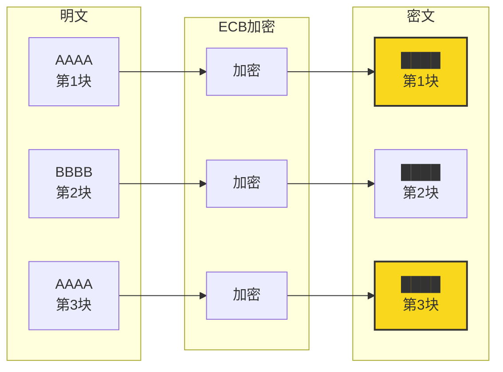
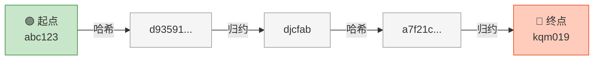
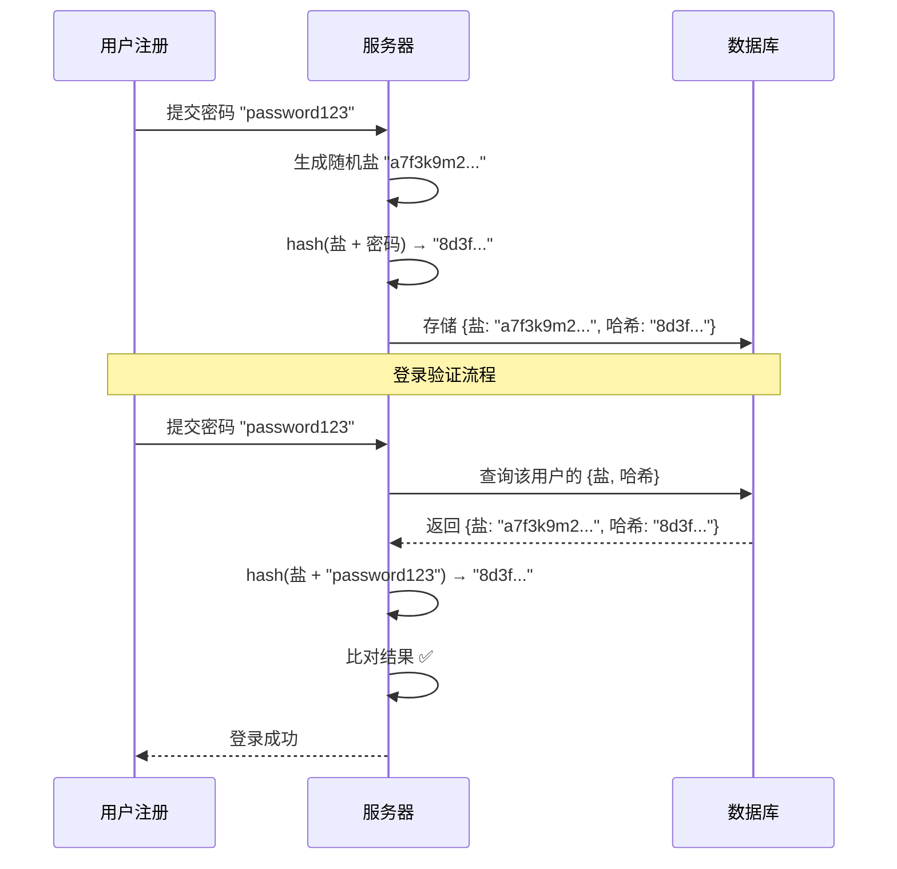
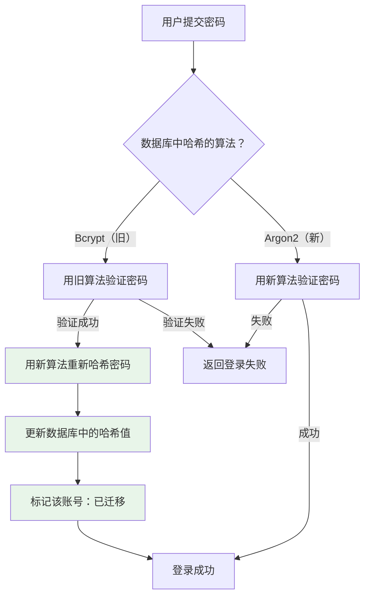

# 密码安全基础

## 本篇导读

### 核心目标

学完本篇后，你将能够：

- 理解为什么不能明文存储密码，以及哈希函数在密码存储中的作用
- 掌握彩虹表攻击的原理，以及加盐如何从根本上防御这类攻击
- 深入理解 Bcrypt 和 Argon2 的工作原理，以及如何在实际项目中选择和配置它们
- 制定合理的密码策略，平衡安全性与用户体验
- 集成 Have I Been Pwned API，实现密码泄露检测功能

### 重点与难点

**重点**：

- 哈希 vs 加密的本质区别——为什么密码必须"哈希"而不是"加密"
- 加盐的作用机制——盐不是密钥，只是随机数，为什么它就能防住彩虹表？
- 慢哈希算法的设计哲学——为什么"慢"本身就是一种安全属性？

**难点**：

- Bcrypt 的成本因子（cost factor）如何与服务器性能做权衡？
- Argon2 三种变体（Argon2i、Argon2d、Argon2id）的适用场景区别
- 密码哈希升级迁移——线上系统如何在不让用户重新设密码的前提下完成算法迁移？

## 一个比喻：俱乐部如何验证会员身份

想象你经营一家高端私人俱乐部，每位会员在入会时设定一个 **专属口令**（密码）。每次会员来访时，需要在门口报出口令，门卫核实后才放行。问题来了：你该怎么保存所有会员的口令？

**方案一：把口令写在门卫手边的花名册上**

这就是明文存储密码。花名册被偷走，所有会员的口令立刻全部暴露。

**方案二：把花名册锁进保险柜，门卫每次用钥匙打开查看**

这是"加密"密码。保险柜看起来安全，但钥匙就挂在门卫腰上（密钥存在服务器上）。小偷偷走保险柜再摸走钥匙，照样能打开。更糟的是，一把钥匙对应所有口令，钥匙一丢，全部暴露。

**方案三：把口令过一遍碎纸机，只存碎片**

这才是"哈希"密码。口令经过不可逆的碎纸机处理，存入的是碎片而非原文。俱乐部自己也看不出原文是什么，只能把会员下次报出的口令再过一遍碎纸机，然后比对碎片形状是否一致。

**方案四：给每位会员用不同型号的碎纸机**

这是"加盐哈希"。即使两位会员的口令完全相同，因为用了不同型号的碎纸机（不同的盐），碎片形状也完全不同。攻击者即使认出了某种碎片对应的原文，也没法批量还原其他会员的口令。

**方案五：把口令过碎纸机后，再把碎片反复重新粉碎一万遍**

这是"慢哈希算法"如 Bcrypt 和 Argon2 的核心思想。正常会员每次进门多等几百毫秒，不影响体验；但攻击者想批量猜口令时，每次尝试都要等那么久，计算成本会让攻击在实际上变得不可行。

## 核心概念讲解

### 为什么绝对不能明文存密码

这个问题看似基础，但仍有大量真实案例证明它被忽视了。我们来量化一下"明文存储"有多危险：

**数据泄露后的影响**

如果数据库中的密码以明文存储，一旦泄露，攻击者可以直接获取所有用户的原始密码。如果密码虽然做了哈希，但未加盐或选用了不安全的算法（如 MD5），攻击者可以在极短时间内批量破解这些哈希值。更糟糕的是，如果使用了 ECB 模式等对称加密模式存储密码，相同的明文会生成相同的密文，攻击者通过分析密文模式就能还原出大量原始密码。

::: details 什么是 ECB 模式？

分组加密（Block Cipher）将明文切分成固定大小的块（如 AES 每块 128 位），逐块进行加密。ECB（Electronic Codebook，电子密码本）是其中最简单的一种——**每个块独立加密，互不关联**。

用一个直观的例子说明：



> **注意**：第一块和第三块明文相同，加密结果也相同——ECB 模式会泄露明文结构！

这暴露了 ECB 的致命缺陷：**相同输入块 → 相同输出块**。在密码存储场景中，如果两个用户的原始密码相同（比如都是 "123456"），他们的"密文"也完全相同。攻击者只需统计密文分布，就能发现"有 100 个人用了一样的密码"，而这往往就是最常用的弱密码。

更进一步，如果用 ECB 加密图片会发生什么？原文是一张纯蓝底的图片，加密后虽然看起来像随机噪声，但蓝色区域的加密块全部相同，隐约还是会露出一个蓝色方块的轮廓——这就是密文泄露明文模式的经典案例。

正因如此，**ECB 不适合用于密码存储或任何需要语义安全的场景**。现代加密使用 CBC、CTR、GCM 等模式，它们通过初始化向量（IV）或认证标签引入随机性，确保相同明文每次加密产生不同密文，从根本上消除了 ECB 的模式泄露问题。

:::

**明文存储的连锁反应**

密码泄露的危害远不止你的应用本身。研究表明，超过 60% 的用户在多个网站使用相同的密码。这意味着：

- 你的数据库泄露 → 用户的邮箱密码、银行密码、社交媒体密码全部暴露
- 攻击者利用"撞库攻击"（Credential Stuffing），将你泄露的账号密码自动在其他网站尝试登录
- 用户不仅失去了你的账号，还失去了其他网站的账号安全

**作为开发者的责任**

你不仅仅在保护你自己的系统，你在保护用户在整个互联网上的安全。这是一份沉甸甸的责任。

### 哈希函数：从数据到指纹

**哈希函数的定义**

哈希函数（Hash Function）是将任意长度数据映射为固定长度输出（称为"哈希值"、"摘要"或"指纹"）的数学函数。它有三个关键属性：

1. **单向性（One-way）**：给定哈希值，在计算上无法还原出原始数据
2. **确定性（Deterministic）**：相同输入永远产生相同输出
3. **雪崩效应（Avalanche Effect）**：输入的微小变化（哪怕只改一个字节）会导致输出截然不同

```plaintext
"password123" → SHA-256 → ef92b778bafe771e89245b89ecbc08a44a4e166c06659911881f383d4473e94f
"password124" → SHA-256 → d2cce35f8f45e5b57adba484c42d8b1c06f944dbe15d7a4da0b285b419649e5f
```

两个几乎相同的输入，产生了完全不同的哈希值——这就是雪崩效应。

**为什么不能用 SHA-256 等通用哈希函数存储密码？**

SHA-256、MD5、SHA-1 等算法是为速度设计的，而非为密码存储设计的。这正是它们的致命弱点：

现代 GPU（如 NVIDIA RTX 4090）计算 SHA-256 的速度：约 **180 亿次/秒**。

这意味着：

- 一张 RTX 4090 每秒可以尝试 180 亿条密码
- 8 位数字密码（约 1 亿种组合）：不到 **0.006 秒** 破解
- 8 位小写字母+数字密码（约 218 亿种）：约 **1.2 秒** 破解
- 使用 1000 张 GPU 的暴力破解集群：效率提升 1000 倍

这让暴力破解在经济上完全可行。

**哈希 vs 加密的本质区别**

这是一个极其重要的概念，必须牢固掌握：

| 维度     | 哈希                    | 加密                              |
| -------- | ----------------------- | --------------------------------- |
| 可逆性   | 不可逆（单向函数）      | 可逆（使用密钥可以解密）          |
| 密钥     | 无需密钥                | 需要密钥                          |
| 用途     | 完整性校验、密码存储    | 数据保密传输、数据保密存储        |
| 密码存储 | ✅ 正确选择             | ❌ 错误选择（密钥泄露即全部暴露） |
| 典型算法 | SHA-256、Bcrypt、Argon2 | AES、RSA、ChaCha20                |

**加密密码的危险性**：如果你用 AES 加密密码，解密密钥必须存在服务器上。服务器被攻破时，攻击者同时拿到了加密密码和解密密钥，等于拿到了所有明文密码。哈希则没有这个问题——从哈希值还原原始密码在计算上是不可行的。

### 彩虹表攻击与加盐防御

#### 彩虹表：攻击的终极武器

暴力破解虽然快，但在线实时破解仍然受网络速度和账号锁定限制。聪明的攻击者发现了更高效的方式：**预计算**——提前算好答案，到时候直接查。

**第一步进化：查找表——提前算好所有答案**

想象你是一个数学老师，班上考试总是从题库里出题。一个聪明（但不太道德）的学生发现了题库，于是提前把所有题的答案算好，做成一本"题号 → 答案"的小抄。考试时根本不需要计算，直接翻答案就行。

攻击者做的是同样的事：事先将常见密码（字典中的词、所有 8 位数字字母组合等）全部哈希好，存成 **"密码 → 哈希值"** 的映射表。当拿到一批泄露的哈希值时，只需查表，瞬间得到对应的明文密码。

但这个"小抄"有个致命问题——**太厚了**。8 位所有字符组合的查找表可能有几 TB，相当于要随身携带一台装满硬盘的服务器。

**第二步进化：彩虹表——把"百科全书"压缩成"索引卡片"**

彩虹表的发明者想到了一个绝妙的压缩技巧。打个比方：

> 假设你需要一本 10 万页的百科全书，但你发现书中的内容有一种内在规律——只要知道第 1 页的内容，通过一套固定的推导规则，就能一步步推出第 2、3、4……页的内容。那你是不是只需要记住第 1 页和最后一页，需要查某一页时再从头推导就行了？

彩虹表的核心思路就是这样：**把成千上万对"密码-哈希"压缩成一条"链"，只存链的首尾两端**。

那这条"链"具体是怎么推导的呢？这需要一个特殊的工具——**归约函数**。

**归约函数：从哈希值"造"出一个新密码**

我们知道，哈希函数是 **密码 → 哈希值** 的单向通道，没有回头路。但攻击者人为设计了一个"转换器"，叫 **归约函数**（Reduction Function），它的作用是：**从哈希值中"捏造"出一个新密码**。

注意：归约函数 **不是** 哈希的逆运算——它不能还原出原始密码。它只是一种人为定义的规则，从哈希值中提取一些数字和字母，拼成一个"看起来像密码"的字符串。你可以把它想象成一台"废料再加工机"：把哈希值这堆"废料"加工成了一个新的"产品"（密码），虽然这个新产品和原来的密码毫无关系。

举个例子，一种简单的归约函数可以这样工作：取哈希值的前 6 个字符，按某种规则映射成字母和数字：

```plaintext
哈希值：d93591bce8a7f21c...
         ↓ 归约函数
归约后：djcfab  ← 一个合法密码（虽然没人会真的用它）
```

有了归约函数，攻击者就有了两个工具：

- **哈希函数**：密码 → 哈希值
- **归约函数**：哈希值 → 新密码

这两个工具交替使用，就能从一个密码出发，像走台阶一样不断往前走，形成一条长长的链。

**链的构造过程**

从一个起始密码出发，交替执行"哈希 → 归约 → 哈希 → 归约……"，就像一条流水线：



这条链经过了 3 个密码（abc123、djcfab、kqm019）和 2 个哈希值（d93591...、a7f21c...）。关键来了——**彩虹表只存储起点（abc123）和终点（kqm019），中间全部丢弃。**

这就像只记住一本书的第 1 页和最后一页，需要中间内容时再从头推导。实际使用时一条链可以走几千步，用两个密码就压缩了几千对"密码-哈希"的信息。

**怎么用彩虹表破解一个哈希？**

假设数据库泄露，攻击者拿到了哈希值 `a7f21c...`，想还原出密码。破解过程就像在一本压缩过的电话簿里查号码——先定位到哪一页，再从头翻到目标位置：

**第 1 步：定位这个哈希值在哪条链上**

对 `a7f21c...` 做归约，得到 `kqm019`。查表发现 `kqm019` 正好是某条链的终点——命中了！这条链的起点是 `abc123`。

**第 2 步：从起点重走这条链，找到目标**

从起点 `abc123` 出发，重新走一遍这条链：

```plaintext
abc123 --哈希-→ d93591... --归约-→ djcfab --哈希-→ a7f21c... ← 找到了！
                                     ↑
                            这就是目标哈希的原始密码
```

走到哈希值等于 `a7f21c...` 的那一步，它的输入密码就是答案：**`djcfab`** ✅

如果第一步没有直接命中终点呢？没关系，继续对结果做"哈希 → 归约"，相当于检查目标是不是在链的倒数第二步、倒数第三步……直到命中或遍历完所有可能步数。

**三种方案的对比**

| 方案         | 空间占用      | 破解耗时         | 比喻                         |
| ------------ | ------------- | ---------------- | ---------------------------- |
| 完整查找表   | 极大（TB 级） | 极快（直接查表） | 带着一整本百科全书           |
| 彩虹表       | 小（GB 级）   | 较慢（需重走链） | 只带索引卡片，需要时现场推导 |
| 实时暴力破解 | 极小          | 极慢             | 什么都不带，完全现场计算     |

彩虹表是一种经典的 **"时间换空间"** 权衡——牺牲一点查询时间（重走链的开销），换来了存储空间从 TB 级缩减到 GB 级。用几 GB 存储和几秒的计算，就能破解本来需要 TB 级查找表才能覆盖的密码范围。

**彩虹表的实际威力**

这不是纸上谈兵，彩虹表在现实中非常好用：

- 网站 [hashes.com](https://hashes.com) 提供免费的 MD5 和 SHA-1 彩虹表查询，你可以亲自试试
- 对于无盐 MD5 哈希，90% 以上的 8 位以下密码可以在 **几秒内** 被逆向还原
- "password" 的 MD5 哈希（5f4dcc3b5aa765d61d8327deb882cf99）在全球任何彩虹表里都有记录——试试把它粘贴到上面的网站，瞬间就能查到原文

#### 加盐：从根本上使彩虹表失效

**盐（Salt）的定义**

盐是一段随机生成的字节序列，与密码拼接后一起参与哈希计算。关键特性：

- **每个用户唯一**：即使两个用户密码相同，因盐不同，哈希值也完全不同
- **随机生成**：使用加密安全的随机数生成器（CSPRNG）生成，不可预测
- **明文存储**：盐不是秘密，和哈希值一起存在数据库里，这没问题
- **足够长**：推荐至少 16 字节（128 位），避免穷举盐

```plaintext
用户 Alice 密码："password123"
盐 A："a7f3k9m2..."（随机）
哈希输入："a7f3k9m2...password123"
存储值：盐A + hash("a7f3k9m2...password123")

用户 Bob 密码："password123"（相同密码！）
盐 B："x1p8q4r7..."（不同随机盐）
哈希输入："x1p8q4r7...password123"
存储值：盐B + hash("x1p8q4r7...password123")

数据库中Alice和Bob的哈希值完全不同 ✅
```

**为什么明文存储盐是安全的？**

这让很多初学者困惑：盐存在数据库里，攻击者拿到数据库时不也拿到盐了吗？

是的，但这不影响安全性：

- 彩虹表之所以有效，是因为它可以对一张预计算表做大量密码比对
- 有了盐，攻击者必须**针对每个用户重新构建一张彩虹表**（因为每个人的盐不同）
- 为每个用户建一张覆盖所有可能密码的彩虹表，成本等于对每个用户分别做暴力破解
- 盐把"一次预计算打倒所有人"变成了"必须逐一暴力破解每个人"——计算量提高了几亿倍

**加盐哈希流程**



### Bcrypt：专为密码设计的慢哈希算法

Bcrypt 是迄今为止应用最广泛的密码哈希算法。它由 Niels Provos 和 David Mazières 在 1999 年设计，经过 25 年的实战检验，至今依然是大多数应用的标准选择。

#### Bcrypt 的核心设计思想

**主动控制"慢"的程度**

Bcrypt 的创新点在于它引入了"成本因子（cost factor）"参数，直接控制哈希计算的迭代次数：

- 成本因子 = `n`，则内部迭代次数 = `2^n`
- 成本因子 = 10 → 迭代 1024 次
- 成本因子 = 12 → 迭代 4096 次（常用默认值）
- 成本因子 = 14 → 迭代 16384 次

随着硬件性能提升，你可以直接提高成本因子，让哈希变得更慢，而不需要更换算法。

**Bcrypt 哈希值的结构**

一个典型的 Bcrypt 哈希值如下：

```plaintext
$2b$12$R9h/cIPz0gi.URNNX3kh2OPST9/PgBkqquzi.Ss7KIUgO2t0jWMUW
│   │  │                        │
│   │  └── 盐（22字符Base64）    └── 哈希结果（31字符Base64）
│   └── 成本因子（12）
└── 算法版本（2b）
```

盐和成本因子直接编码在输出字符串中，因此验证时只需要这一个字符串，无需额外存储盐。

#### 成本因子如何选择？

**核心原则**：在你的服务器上，登录请求的哈希时间应该在 **100ms ～ 300ms** 之间。

成本不够（< 10）：在现代硬件上，哈希时间可能只有 1ms，暴力破解效率大幅提升。

成本过高（> 14）：登录接口响应时间增加到秒级，影响用户体验，甚至可以用来发动 DoS 攻击（攻击者大量发送登录请求消耗服务器 CPU）。

**基准测试方法**

在你的生产环境服务器上运行：

```typescript
import * as bcrypt from 'bcrypt';

async function benchmarkBcrypt() {
  const password = 'test-password';

  for (let cost = 10; cost <= 14; cost++) {
    const start = Date.now();
    await bcrypt.hash(password, cost);
    const duration = Date.now() - start;
    console.log(`成本因子 ${cost}: ${duration}ms`);
  }
}

benchmarkBcrypt();
```

典型输出（2024 年中档服务器）：

```plaintext
成本因子 10: 65ms
成本因子 11: 128ms
成本因子 12: 255ms
成本因子 13: 512ms
成本因子 14: 1024ms
```

根据以上结果，**成本因子 12** 是许多中小项目的合理选择。如果是高并发场景（如高频登录接口），可以考虑 10 或 11。

#### Bcrypt 的局限性

Bcrypt 有一个鲜为人知的限制：**最大输入长度为 72 字节**。超过 72 字节的密码会被截断。

这意味着以下两个密码会产生相同的哈希值：

```plaintext
"aaaa...aaaa" (72个a)  →  相同哈希
"aaaa...aaaa_extra"    →  相同哈希（尾部被截断）
```

在实践中，这通常不是问题（大多数用户密码远短于 72 字节），但如果你允许 passphrase 风格的超长密码，需要注意这一点。Argon2 没有这个限制。

### Argon2：现代密码哈希的黄金标准

Argon2 是 2015 年密码哈希竞赛（Password Hashing Competition，PHC）的获胜者，代表了密码哈希领域的最新实践。

#### Argon2 的三种变体

**Argon2d**

- 使用数据依赖的内存访问模式
- **优点**：对 GPU/ASIC 破解的抵抗力最强（GPU 并行破解因内存访问冲突而效率大降）
- **缺点**：易受侧信道攻击（timing attack）
- **适用场景**：加密货币、服务器端密码哈希（无侧信道攻击风险的场景）

**Argon2i**

- 使用数据无关的内存访问模式
- **优点**：抵抗侧信道攻击
- **缺点**：对 GPU 破解的抵抗力较弱
- **适用场景**：密钥派生（如从密码派生加密密钥）

**Argon2id（推荐）**

- Argon2d 和 Argon2i 的混合变体：前半段用 Argon2i（防侧信道），后半段用 Argon2d（防 GPU 破解）
- 兼顾两者的优点，OWASP 和 IETF RFC 9106 均推荐此变体
- **适用场景**：通用场景，包括密码存储，是配置首选

#### Argon2 的三个配置参数

Argon2id 有三个可调参数，它们共同决定计算成本：

**内存参数（m）**：哈希过程使用的内存量（KB）。

- 增加内存消耗是 Argon2 对抗 GPU 破解的核心武器，因为 GPU 的内存带宽有限
- OWASP 推荐：最低 **19 MB**，高安全场景建议 **64 MB** 或更高

**迭代参数（t）**：算法运行的迭代次数。

- 在内存固定的情况下，增加迭代次数提高 CPU 消耗
- OWASP 推荐：最低 **2**

**并行度参数（p）**：并行使用的线程数。

- 通常设置为 CPU 核心数的一半
- OWASP 推荐：**1**（可视实际情况调整）

#### OWASP 推荐配置（2024）

| 场景       | 内存（m） | 迭代（t） | 并行（p） |
| ---------- | --------- | --------- | --------- |
| 最低要求   | 19 MB     | 2         | 1         |
| 推荐配置   | 64 MB     | 3         | 4         |
| 高安全场景 | 256 MB    | 4+        | 4+        |

**在 Node.js 中使用 Argon2**

```typescript
import argon2 from 'argon2';

// 加密密码
async function hashPassword(password: string): Promise<string> {
  return argon2.hash(password, {
    type: argon2.argon2id,
    memoryCost: 65536, // 64 MB（单位：KB）
    timeCost: 3, // 迭代 3 次
    parallelism: 4, // 4 个线程
  });
}

// 验证密码
async function verifyPassword(
  hash: string,
  password: string
): Promise<boolean> {
  return argon2.verify(hash, password);
}
```

#### Bcrypt vs Argon2：如何选择？

| 维度        | Bcrypt                         | Argon2id                         |
| ----------- | ------------------------------ | -------------------------------- |
| 诞生年份    | 1999 年                        | 2015 年                          |
| 抗 GPU 能力 | 中等（内存需求低，GPU 可并行） | 强（大内存需求，GPU 并行困难）   |
| OWASP 推荐  | ✅（次选）                     | ✅（首选）                       |
| 生态成熟度  | 极成熟，几乎所有平台都有       | 较成熟，主流语言均有库支持       |
| 72 字节限制 | 有                             | 无                               |
| 配置复杂度  | 低（只有一个成本因子）         | 中（三个参数需要调优）           |
| 适用场景    | 新老项目均可，是保守安全选择   | 新项目首选，特别是高安全要求场景 |

**建议**：

- **新项目**：优先使用 Argon2id
- **已有 Bcrypt 的项目**：不必立即迁移，Bcrypt 仍然安全；下节介绍如何优雅迁移
- **不确定时**：用 Bcrypt，成本因子 12 是无需深度思考的安全选择

### 密码哈希算法迁移：不停机升级

随着硬件性能提升或安全标准更新，你可能需要将现有用户密码从 Bcrypt 迁移到 Argon2id，或者提高 Bcrypt 的成本因子。挑战在于：你不知道用户的原始密码，无法直接重新哈希。

#### 渐进式迁移方案

**核心思路**：利用用户下次登录的机会完成迁移，不影响已有用户，无需运维窗口。



**代码实现（NestJS 服务示例）**

```typescript
import * as bcrypt from 'bcrypt';
import argon2 from 'argon2';

const ARGON2_OPTIONS = {
  type: argon2.argon2id,
  memoryCost: 65536,
  timeCost: 3,
  parallelism: 4,
};

@Injectable()
export class PasswordService {
  // 注册时：直接使用新算法
  async hashPassword(password: string): Promise<string> {
    return argon2.hash(password, ARGON2_OPTIONS);
  }

  // 登录验证时：支持两种算法，并自动迁移
  async verifyAndMigratePassword(
    password: string,
    storedHash: string
  ): Promise<{ valid: boolean; newHash?: string }> {
    // 新算法：Argon2（以 $argon2 开头）
    if (storedHash.startsWith('$argon2')) {
      const valid = await argon2.verify(storedHash, password);
      return { valid };
    }

    // 旧算法：Bcrypt（以 $2b 或 $2a 开头）
    if (storedHash.startsWith('$2b') || storedHash.startsWith('$2a')) {
      const valid = await bcrypt.compare(password, storedHash);
      if (valid) {
        // 验证成功，趁机用新算法重新哈希（用户刚输入了密码，这是唯一的机会）
        const newHash = await argon2.hash(password, ARGON2_OPTIONS);
        return { valid: true, newHash };
      }
      return { valid: false };
    }

    // 未知算法，拒绝
    return { valid: false };
  }
}
```

在登录 Controller 中使用：

```typescript
const { valid, newHash } = await this.passwordService.verifyAndMigratePassword(
  password,
  user.passwordHash
);

if (!valid) {
  throw new UnauthorizedException('密码错误');
}

// 如果有新哈希，静默更新到数据库
if (newHash) {
  await this.userRepository.updatePasswordHash(user.id, newHash);
}
```

这种方案的优点是：

- 对用户完全透明，无感知
- 不需要运维窗口，随着用户日常登录自然完成迁移
- 可以监控迁移进度（统计 algorithm 字段的分布）
- 即使迁移未完成，系统也能正常运行

### 密码策略：平衡安全与可用性

密码策略（Password Policy）规定了用户可以设置什么样的密码。但好的密码策略不仅仅是"越复杂越好"——过于严格的策略会让用户产生抵触，反而导致他们用更弱的密码敷衍了事（比如把 `password` 改成 `P@ssw0rd!`，这只是看起来更复杂）。

#### NIST 2024 最新密码指南

美国国家标准与技术研究所（NIST）在 SP 800-63B 中提供了密码策略的权威指南，其 2024 年版推翻了很多"传统认知"：

**被数据推翻的旧规则**

| 旧规则（不推荐）               | 原因 + 新建议                                 |
| ------------------------------ | --------------------------------------------- |
| 必须包含大写、小写、数字、符号 | 用户通常改成 `Password1!`，可预测性反而增加   |
| 每 90 天强制更换密码           | 用户改成 `Password1`, `Password2`... 安全反降 |
| 禁止连续重复字符（如 `aaa`）   | 增加复杂度感知，实际上并不增加真实熵值        |
| 密码提示问题（安全问题）       | 答案通常可以从社交媒体猜到，是薄弱环节        |

**NIST 推荐的新规则**

1. **最小长度 8 位**，允许更长（无上限，或至少 64 位上限）
2. **允许所有 Unicode 字符**，包括空格（passphrase 更安全）
3. **不要求复杂度规则**，改为检查是否是常见密码/已泄露密码
4. **不强制定期更换**，只在怀疑泄露时要求更换
5. **必须检查已知泄露密码列表**

**核心转变**：从"规则导向密码"（满足规则的复杂密码）转向"长度和新颖性导向密码"（更长、更独特）。

#### 实用密码策略设计

综合 NIST 指南和实际工程经验，推荐以下策略：

```typescript
// 密码策略配置（Zod schema）
import { z } from 'zod/v4';

const passwordSchema = z
  .string()
  .min(8, '密码至少 8 位')
  .max(128, '密码最多 128 位') // 防止超长密码被用于 DoS
  .refine(
    (password) => !COMMON_PASSWORDS.has(password.toLowerCase()),
    '该密码过于常见，请换一个更独特的密码'
  )
  .refine(
    async (password) => !(await isPasswordBreached(password)),
    '该密码已在数据泄露事件中出现，请换一个新密码'
  );
```

**前端密码强度反馈**

相比强制规则，实时的视觉反馈（密码强度条）更能引导用户设置更强的密码：

```plaintext
[弱] password123
✳ 密码过于常见

[中] mybird2024spring
✓ 长度优秀（16位）
⚠ 尝试加入数字以外的字符

[强] purple-fox-sunrise-42
✓ 密码强度极高！这是一个优秀的 passphrase
```

密码强度可以用 zxcvbn 库评估（Dropbox 开发的智能密码强度评估器），它会考虑模式、字典词汇、键盘行走序列等因素，比简单的"必须包含大小写数字"规则更接近实际安全强度。

### 密码泄露检测：Have I Been Pwned

**Have I Been Pwned（HIBP）** 是由安全研究员 Troy Hunt 维护的密码泄露数据库，收录了来自数千次数据泄露事件的数十亿个密码。

#### k-Anonymity 模型：安全地查询而不暴露密码

你可能有顾虑：把用户密码发送到第三方服务器查询，本身不就是安全风险吗？

HIBP 的 Pwned Passwords API 通过 **k-匿名性（k-Anonymity）** 模型解决了这个问题：

1. 客户端计算密码的 SHA-1 哈希：`SHA1("password") = 5BAA61E4...`
2. 客户端只发送哈希值的**前 5 位**给 HIBP：`5BAA6`
3. HIBP 返回所有以 `5BAA6` 开头的哈希值后缀（约 500-900 个）
4. 客户端在本地检查自己的完整哈希是否在返回列表中

这样，HIBP 服务器从不知道你查询的完整密码是什么。网络上传输的是哈希的前 5 位，能够匹配的前缀对应了数以千计的不同密码——服务器无法确定你查的是哪一个。

#### 实现密码泄露检测

```typescript
import * as crypto from 'crypto';
import { HttpService } from '@nestjs/axios';
import { firstValueFrom } from 'rxjs';

@Injectable()
export class PwnedPasswordService {
  constructor(private readonly httpService: HttpService) {}

  async isPasswordPwned(password: string): Promise<boolean> {
    // 计算密码的 SHA-1 哈希
    const sha1Hash = crypto
      .createHash('sha1')
      .update(password)
      .digest('hex')
      .toUpperCase();

    const prefix = sha1Hash.slice(0, 5);
    const suffix = sha1Hash.slice(5);

    // 向 HIBP API 发送前 5 位（k-Anonymity 隐私保护）
    const response = await firstValueFrom(
      this.httpService.get(`https://api.pwnedpasswords.com/range/${prefix}`, {
        headers: {
          // 告知 HIBP 使用填充模式（所有响应包含相同字节数，防止流量分析）
          'Add-Padding': 'true',
        },
      })
    );

    // 在返回的哈希列表中查找完整哈希的后缀
    const hashes = response.data as string;
    const lines = hashes.split('\r\n');

    for (const line of lines) {
      const [hashSuffix, countStr] = line.split(':');
      if (hashSuffix === suffix) {
        const count = parseInt(countStr, 10);
        // count 表示该密码在泄露事件中出现的次数
        return count > 0;
      }
    }

    return false;
  }
}
```

#### 何时调用泄露检测？

泄露检测有网络请求延迟（通常在 100-300ms），应该在适当的时机调用：

| 时机           | 建议      | 原因                                                  |
| -------------- | --------- | ----------------------------------------------------- |
| 用户注册时     | ✅ 必做   | 在用户创建账号时就阻止使用已泄露密码                  |
| 用户修改密码时 | ✅ 必做   | 同上                                                  |
| 用户登录时     | ⚠️ 可选   | 延迟增加，但可检测历史泄露；可降级为异步检查+邮件通知 |
| 前端实时输入时 | ❌ 不推荐 | 请求频繁，用 zxcvbn 做本地强度检测即可                |

**本地缓存**：对于高频注册场景，可以本地缓存最常见的被泄露密码（HIBP 提供离线数据集，包含数十亿条，可以用布隆过滤器存储在内存中），避免每次都发起网络请求。

## 常见问题与解决方案

### 问题 1：密码哈希让登录接口变慢，能否缓存哈希结果？

**错误的优化思路**：有人想缓存 `{userId → 是否验证通过}` 来避免重复哈希，这创造了严重的安全漏洞——缓存条目变成了绕过密码验证的后门。

**正确的优化思路**：

- 使用 JWT 或 Session：用户登录一次，颁发 Token/Session，后续请求不需要重新验证密码
- 降低 Bcrypt 成本因子（10 vs 12），接受稍低的安全边际换取更低延迟
- 使用 Argon2id 替代 Bcrypt，单次哈希时间类似，但抗 GPU 能力更强
- 登录操作的慢速本质上也是一种速率限制，是对暴力破解的被动防御

### 问题 2：如何防止在后端日志中意外记录明文密码？

这是一个生产环境中真实存在的隐患。Nest.js 中的全局日志中间件、异常拦截器、Swagger 请求记录等都可能将请求体打印到日志中。

**解决方案**：

在 DTO 层面标记敏感字段：

```typescript
// 请求 DTO
export class LoginDto {
  @IsEmail()
  email: string;

  @IsString()
  @Exclude({ toPlainOnly: true }) // 序列化时排除
  password: string;
}
```

在全局日志中间件中过滤敏感字段：

```typescript
@Injectable()
export class LoggingInterceptor implements NestInterceptor {
  intercept(context: ExecutionContext, next: CallHandler): Observable<any> {
    const request = context.switchToHttp().getRequest();
    const { body } = request;

    // 深拷贝并脱敏后再记录
    const sanitizedBody = {
      ...body,
      password: body?.password ? '[REDACTED]' : undefined,
      newPassword: body?.newPassword ? '[REDACTED]' : undefined,
    };

    this.logger.log(`Request body: ${JSON.stringify(sanitizedBody)}`);
    return next.handle();
  }
}
```

### 问题 3：攻击者可以通过登录响应时间判断用户是否存在吗？

**时序攻击（Timing Attack）**：如果用户不存在时你直接返回，而用户存在但密码错误时你执行了哈希比对（慢），攻击者可以通过响应时间差判断用户名是否存在——这相当于泄露了用户信息。

**错误的实现**：

```typescript
// ❌ 时序差异泄露了用户是否存在
async login(email: string, password: string) {
  const user = await this.userRepo.findByEmail(email);
  if (!user) {
    return null; // 立即返回，很快
  }
  const valid = await argon2.verify(user.passwordHash, password); // 很慢
  return valid ? user : null;
}
```

**正确的实现**：

```typescript
// ✅ 无论用户是否存在，都执行相同时间的操作
const DUMMY_HASH = await argon2.hash('dummy-password-for-timing'); // 预先计算好

async login(email: string, password: string) {
  const user = await this.userRepo.findByEmail(email);

  if (!user) {
    // 故意执行一次哈希，使响应时间与"用户存在但密码错误"相同
    await argon2.verify(DUMMY_HASH, password);
    return null;
  }

  const valid = await argon2.verify(user.passwordHash, password);
  return valid ? user : null;
}
```

### 问题 4：用户忘记密码，可以给他发原始密码吗？

**绝对不可以**。如果你能给用户发送"原始密码"，说明你要么明文存储密码，要么可逆地加密了密码——两者都是严重的安全问题。

正确的做法是**密码重置流程**：

1. 用户点击"忘记密码"
2. 系统生成一个一次性、有时效（如 15 分钟）的重置 Token
3. 将 Token 以链接形式发送到用户邮箱
4. 用户点击链接，输入新密码
5. 系统验证 Token 有效后，将新密码哈希后存入数据库，使 Token 失效

### 问题 5：HIBP 服务不可用时，注册流程是否要中断？

**建议：降级处理，不拦截注册**。

- HIBP 的可用性不应该成为你的注册流程的单点故障
- 如果 HIBP 请求超时或返回错误，记录日志但允许注册继续进行
- 可以设置较短的超时时间（如 2 秒），超时后降级为"不检测"

```typescript
async isPasswordPwned(password: string): Promise<boolean> {
  try {
    // 设置 2 秒超时
    const result = await Promise.race([
      this.checkHibp(password),
      new Promise<boolean>((resolve) =>
        setTimeout(() => resolve(false), 2000)
      ),
    ]);
    return result;
  } catch (error) {
    // HIBP 不可用时，降级放行，记录告警
    this.logger.warn('HIBP service unavailable, skipping breach check');
    return false;
  }
}
```

## 本篇小结

本章系统地讲解了密码安全的核心知识体系：

**哈希的本质**：密码必须单向哈希而非加密，因为加密需要密钥，而密钥本身成为新的安全风险。SHA-256 等通用哈希算法太快（每秒几十亿次），不适合用于密码存储。

**加盐的作用**：每个用户生成唯一随机盐，使得即使两人密码相同，哈希值也完全不同，从而使彩虹表（预计算攻击）从根本上失效。盐无需保密，和哈希值一起存储即可。

**慢哈希算法的选择**：

- **Bcrypt**：历史最悠久，成熟可靠，成本因子 12 是广泛使用的默认配置，72 字节。有截断限制。适合需要稳健选择的团队。
- **Argon2id**：现代首选，通过大内存消耗对抗 GPU 破解能力更强，OWASP 首推。适合新项目或对安全有更高要求的场景。

**密码策略的现代观**：NIST 2024 推荐抛弃强制复杂度要求，转向鼓励更长的密码（passphrase）和检查已知泄露密码。规则越复杂，用户越容易用可预测的模式敷衍。

**泄露检测**：集成 HIBP 的 k-Anonymity API，在注册和修改密码时检查密码是否已泄露。k-Anonymity 确保查询本身不会暴露用户密码给第三方。

**工程细节**：时序攻击防护（始终执行哈希，不短路）、日志脱敏（避免密码出现在日志文件）、渐进式算法迁移（利用下次登录机会完成迁移）。

这些知识将直接应用于模块二的用户注册和登录实现中，届时你将把这里的理论转化为真实可运行的后端代码。
