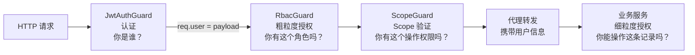
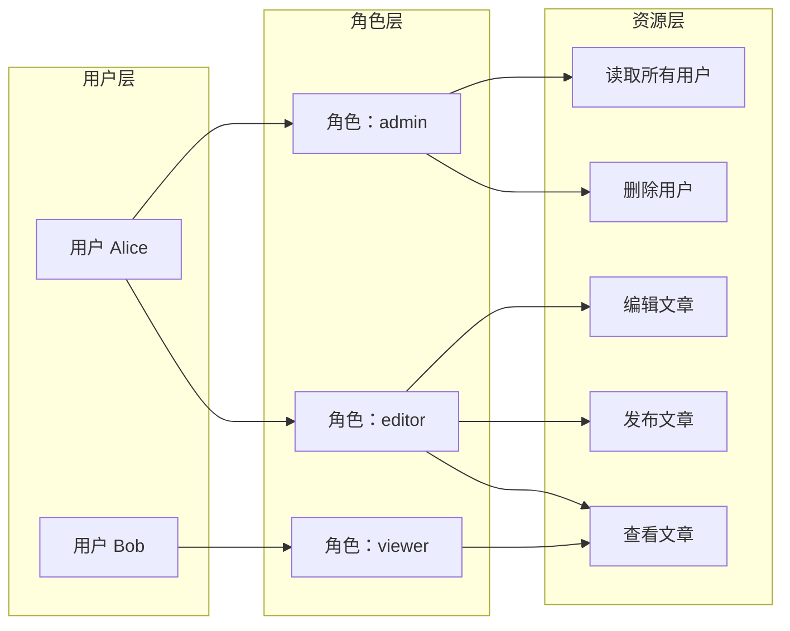

# 权限检查守卫

## 本篇导读

### 核心目标

学完本篇后，你将能够：

- 厘清认证（Authentication）与授权（Authorization）的边界，理解它们在网关中各自的职责
- 理解 RBAC（基于角色的访问控制）与 OAuth2 Scope 两种权限模型的适用场景
- 使用 NestJS 自定义装饰器（`@Roles()`、`@RequireScopes()`、`@Public()`）为路由灵活配置权限要求
- 实现 `RbacGuard` 和 `ScopeGuard` 两个守卫，覆盖从粗粒度到细粒度的权限检查
- 理解全局 Guard 与路由级 Guard 的配合，以及如何处理"跳过权限检查"的公开路由

### 重点与难点

**重点**：

- RBAC 的层级模型——角色（Role）如何映射到权限（Permission）
- 网关 RBAC 与业务服务 RBAC 的职责分工——网关只做粗粒度检查，细粒度留给业务服务
- `Reflector` 的作用——如何在 Guard 中读取装饰器打上的元数据

**难点**：

- 理解 OAuth2 Scope 与 RBAC 角色的区别——Scope 是对 _操作_ 的授权，Role 是对 _身份_ 的描述
- 多个 Guard 的执行顺序与依赖关系——RbacGuard 依赖 JwtAuthGuard 先执行
- 复合权限条件——同时满足角色要求 _和_ Scope 要求，还是满足其一即可

## 认证与授权：再次厘清边界

### 两者的核心区别

在上一篇中，我们实现的 `JwtAuthGuard` 完成了 **认证（Authentication）**——它回答"你是谁"。Token 有效，我们就知道这个请求来自用户 ID 为 `42`、角色为 `admin` 的真实用户。

**授权（Authorization）** 是下一步——它回答"你有权做这件事吗"。即使我们知道请求者是用户 `42`，也需要判断用户 `42` 是否有权访问当前请求的资源。

在 API 网关中，这两件事由不同的 Guard 负责：



**网关负责的粗粒度权限**：

- 这个接口只有管理员（`admin` 角色）才能访问
- 这个接口要求 Token 中包含 `orders:write` Scope

**业务服务负责的细粒度权限**：

- 用户只能删除自己创建的订单，不能删除他人的订单
- 用户只能查看自己团队的项目

**为什么细粒度权限不在网关做？**

因为细粒度权限通常需要查询业务数据库。比如"用户能否删除订单 #1001"，需要查询该订单的 `creatorId` 是否等于当前用户的 `userId`。这类逻辑与具体业务强耦合，放在网关会导致网关依赖业务数据库，破坏职责边界。

## RBAC 权限模型

### 核心概念

RBAC（Role-Based Access Control，基于角色的访问控制）是最常见的权限管理模型。核心思想：**将权限赋予角色，而不是直接赋予用户；用户通过拥有角色来获得权限**。



RBAC 的优势：

- 权限管理直观——给用户分配角色，而不是逐一分配权限
- 权限审计方便——查看某个角色有什么权限，比查看某个用户有什么权限更清晰
- 角色继承——高级角色可以继承低级角色的所有权限

### 网关中的简化 RBAC

在 API 网关层，我们不需要实现完整的 RBAC（完整 RBAC 通常需要数据库存储权限配置）。我们的目标是快速检查 Token Payload 中的 `role` 字段，判断用户是否具备访问当前路由的 **基本角色要求**。

典型的角色层级（从低到高）：

```plaintext
viewer（只读用户）
  ↓ 包含
editor（编辑用户）
  ↓ 包含
admin（管理员）
  ↓ 包含
super-admin（超级管理员）
```

高级角色默认包含低级角色的所有权限。

### 角色定义

```typescript
// permission/roles.enum.ts

export enum Role {
  Viewer = 'viewer',
  Editor = 'editor',
  Admin = 'admin',
  SuperAdmin = 'super-admin',
}

/**
 * 角色层级——数字越大权限越高
 * 用于判断"角色 A 是否包含角色 B 的权限"
 */
export const ROLE_HIERARCHY: Record<Role, number> = {
  [Role.Viewer]: 1,
  [Role.Editor]: 2,
  [Role.Admin]: 3,
  [Role.SuperAdmin]: 4,
};

/**
 * 判断用户角色是否满足要求的最低角色
 *
 * @param userRole 用户当前角色
 * @param requiredRole 接口要求的最低角色
 */
export function hasRole(userRole: Role, requiredRole: Role): boolean {
  const userLevel = ROLE_HIERARCHY[userRole] ?? 0;
  const requiredLevel = ROLE_HIERARCHY[requiredRole] ?? 0;
  return userLevel >= requiredLevel;
}
```

### @Roles() 装饰器

```typescript
// permission/roles.decorator.ts
import { SetMetadata } from '@nestjs/common';
import { Role } from './roles.enum';

export const ROLES_KEY = 'roles';

/**
 * 声明访问当前路由所需的最低角色
 *
 * @example
 * // 只有 admin 及以上角色才能访问
 * @Roles(Role.Admin)
 * @Delete('/users/:id')
 * deleteUser(@Param('id') id: string) {}
 *
 * @example
 * // 同时允许 editor 和 admin 访问（只需满足其一）
 * @Roles(Role.Editor, Role.Admin)
 * @Post('/articles')
 * createArticle() {}
 */
export const Roles = (...roles: Role[]) => SetMetadata(ROLES_KEY, roles);
```

### RbacGuard 实现

```typescript
// permission/rbac.guard.ts
import {
  Injectable,
  CanActivate,
  ExecutionContext,
  ForbiddenException,
} from '@nestjs/common';
import { Reflector } from '@nestjs/core';
import { Request } from 'express';
import { Role, hasRole } from './roles.enum';
import { ROLES_KEY } from './roles.decorator';
import { IS_PUBLIC_KEY } from '../auth/public.decorator';
import { GatewayTokenPayload } from '../auth/jwt-verify.service';

@Injectable()
export class RbacGuard implements CanActivate {
  constructor(private readonly reflector: Reflector) {}

  canActivate(context: ExecutionContext): boolean {
    // 公开路由跳过权限检查
    const isPublic = this.reflector.getAllAndOverride<boolean>(IS_PUBLIC_KEY, [
      context.getHandler(),
      context.getClass(),
    ]);

    if (isPublic) {
      return true;
    }

    // 获取路由要求的角色列表
    const requiredRoles = this.reflector.getAllAndOverride<Role[]>(ROLES_KEY, [
      context.getHandler(),
      context.getClass(),
    ]);

    // 没有设置 @Roles()，表示任意已认证用户均可访问
    if (!requiredRoles || requiredRoles.length === 0) {
      return true;
    }

    const request = context.switchToHttp().getRequest<Request>();
    const user = request.user as GatewayTokenPayload;

    // 此时 JwtAuthGuard 已执行，user 一定存在
    const userRole = (user?.role ?? Role.Viewer) as Role;

    // 检查用户角色是否满足任意一个要求的角色
    const hasAccess = requiredRoles.some((role) => hasRole(userRole, role));

    if (!hasAccess) {
      throw new ForbiddenException(
        `Insufficient role. Required: ${requiredRoles.join(' or ')}, got: ${userRole}`
      );
    }

    return true;
  }
}
```

### Reflector.getAllAndOverride 的行为说明

`getAllAndOverride` 会先查找 Handler 级别的元数据，如果没有，再查找 Class 级别的元数据。这个行为允许在 Controller 上设置默认权限，然后在特定方法上覆盖：

```typescript
@Roles(Role.Editor) // Controller 级别默认要求 editor
@Controller('/articles')
export class ArticleController {
  @Get() // 继承 Controller 的 @Roles(Role.Editor)
  list() {}

  @Roles(Role.Viewer) // 覆盖：查看文章不需要 editor
  @Get('/:id')
  get(@Param('id') id: string) {}

  @Roles(Role.Admin) // 覆盖：删除需要 admin
  @Delete('/:id')
  delete(@Param('id') id: string) {}
}
```

## OAuth2 Scope 权限模型

### Scope 与 Role 的区别

OAuth2 Scope 是一个常被误解的概念，容易与 Role 混淆。区分它们的关键：

**Role 描述用户是谁**（身份）：用户是管理员、编辑者、普通用户。

**Scope 描述 Token 被授权做什么**（操作权限）：这个 Token 可以读取用户信息、可以写入订单、不能删除用户。

可以这样理解：Scope 是用户在授权时 **主动同意** 的操作范围。比如用 GitHub OAuth2 登录某个应用时，会看到"该应用请求以下权限：读取你的个人信息、访问你的公开仓库"——这里的权限说明就是 Scope。

| 维度     | Role                      | Scope                         |
| -------- | ------------------------- | ----------------------------- |
| 本质     | 用户身份标签              | Token 允许的操作范围          |
| 决定者   | 管理员给用户分配          | 用户在 OAuth2 授权时同意      |
| 存储位置 | 数据库（用户-角色关联表） | Token Payload 的 `scope` 字段 |
| 粒度     | 粗（role=admin）          | 细（scope=orders:write）      |
| 主要场景 | 内部系统的权限控制        | 第三方 OAuth2 集成            |

### Scope 的命名约定

Scope 通常使用 `资源:操作` 格式：

```plaintext
users:read          读取用户信息
users:write         创建/修改用户
users:delete        删除用户
orders:read         读取订单
orders:write        创建/修改订单
orders:delete       删除订单
products:read       读取商品
admin:*             管理员全权限（谨慎使用）
```

也有些系统使用更扁平的命名：

```plaintext
read_users
write_orders
delete_products
```

无论哪种约定，关键是在整个系统内保持一致。

### @RequireScopes() 装饰器

```typescript
// permission/scopes.decorator.ts
import { SetMetadata } from '@nestjs/common';

export const SCOPES_KEY = 'scopes';

/**
 * 声明访问当前路由所需的 OAuth2 Scope
 *
 * 默认逻辑：用户必须拥有 *所有* 列出的 Scope（AND）
 * 如需 OR 语义，可在选项中指定
 *
 * @example
 * // 需要同时拥有 orders:read 和 orders:write
 * @RequireScopes('orders:read', 'orders:write')
 * @Post('/orders')
 * createOrder() {}
 *
 * @example
 * // 只需要 orders:read
 * @RequireScopes('orders:read')
 * @Get('/orders')
 * listOrders() {}
 */
export const RequireScopes = (...scopes: string[]) =>
  SetMetadata(SCOPES_KEY, scopes);
```

### ScopeGuard 实现

JWT Payload 中的 `scope` 字段通常是以空格分隔的字符串（符合 OAuth2 规范）：

```plaintext
"scope": "users:read orders:read orders:write"
```

```typescript
// permission/scope.guard.ts
import {
  Injectable,
  CanActivate,
  ExecutionContext,
  ForbiddenException,
} from '@nestjs/common';
import { Reflector } from '@nestjs/core';
import { Request } from 'express';
import { SCOPES_KEY } from './scopes.decorator';
import { IS_PUBLIC_KEY } from '../auth/public.decorator';
import { GatewayTokenPayload } from '../auth/jwt-verify.service';

@Injectable()
export class ScopeGuard implements CanActivate {
  constructor(private readonly reflector: Reflector) {}

  canActivate(context: ExecutionContext): boolean {
    // 公开路由跳过
    const isPublic = this.reflector.getAllAndOverride<boolean>(IS_PUBLIC_KEY, [
      context.getHandler(),
      context.getClass(),
    ]);

    if (isPublic) {
      return true;
    }

    const requiredScopes = this.reflector.getAllAndOverride<string[]>(
      SCOPES_KEY,
      [context.getHandler(), context.getClass()]
    );

    // 没有声明 Scope 要求，跳过检查
    if (!requiredScopes || requiredScopes.length === 0) {
      return true;
    }

    const request = context.switchToHttp().getRequest<Request>();
    const user = request.user as GatewayTokenPayload;

    // 将 scope 字符串解析为数组
    const userScopes = (user?.scope ?? '').split(' ').filter(Boolean);

    // 检查是否拥有所有要求的 Scope（AND 语义）
    const missingScopes = requiredScopes.filter(
      (scope) => !userScopes.includes(scope)
    );

    if (missingScopes.length > 0) {
      throw new ForbiddenException(
        `Missing required scopes: ${missingScopes.join(', ')}`
      );
    }

    return true;
  }
}
```

## 装饰器组合使用

### 同时使用 @Roles() 和 @RequireScopes()

两个装饰器可以同时使用，最终判断是 AND 关系（必须同时满足角色要求和 Scope 要求）：

```typescript
@Controller('/orders')
export class OrderController {
  // 任何已认证用户都可以查看自己的订单（无角色限制，无 Scope 限制）
  @Get('/my')
  getMyOrders(@CurrentUser() user: GatewayTokenPayload) {}

  // 需要 orders:read Scope，任何角色都可以
  @RequireScopes('orders:read')
  @Get()
  listAllOrders() {}

  // 需要 orders:write Scope，任何角色都可以
  @RequireScopes('orders:write')
  @Post()
  createOrder() {}

  // 需要 admin 角色，无需特定 Scope（管理员可以强制操作订单）
  @Roles(Role.Admin)
  @Delete('/:id')
  deleteOrder(@Param('id') id: string) {}

  // 需要 admin 角色 且 持有 orders:delete Scope（双重保护）
  @Roles(Role.Admin)
  @RequireScopes('orders:delete')
  @Delete('/bulk')
  bulkDelete() {}
}
```

### 绕过权限检查：@Public()

有一类特殊路由需要完全跳过认证和授权（如健康检查、公开 API 文档）。上一篇已经实现了 `@Public()` 装饰器，所有 Guard 都应检查它：

```typescript
@Controller()
export class AppController {
  @Public()
  @Get('/health')
  health() {
    return { status: 'ok' };
  }

  @Public()
  @Get('/api-docs')
  apiDocs() {
    // 返回 API 文档
  }
}
```

### 仅跳过 Scope 检查

有时候，某些路由不需要特定 Scope，但仍需要认证（比如"查看自己的个人信息"——任何已登录用户都能访问，不需要 `users:read` Scope）。这种情况只需不加 `@RequireScopes()` 即可：

```typescript
@Get('/profile')
// 没有 @RequireScopes()，ScopeGuard 会跳过此路由
getProfile(@CurrentUser() user: GatewayTokenPayload) {}
```

## 全局守卫与局部守卫

### 全局守卫的注册方式

在 `main.ts` 中通过 `app.useGlobalGuards()` 注册的守卫，默认对所有路由生效：

```typescript
// main.ts
const app = await NestFactory.create(AppModule);
const reflector = app.get(Reflector);

app.useGlobalGuards(
  new JwtAuthGuard(reflector, app.get(JwtVerifyService)),
  new RbacGuard(reflector),
  new ScopeGuard(reflector)
);
```

**注意**：通过 `app.useGlobalGuards()` 注册的守卫无法注入依赖（因为在 DI 容器之外 `new` 出来的）。如果守卫需要注入服务（如 `JwtAuthGuard` 需要 `JwtVerifyService`），需要手动通过 `app.get()` 获取实例。

另一种方式是通过 `APP_GUARD` 令牌注册，可以利用 DI 容器：

```typescript
// app.module.ts
import { APP_GUARD } from '@nestjs/core';
import { JwtAuthGuard } from './auth/jwt-auth.guard';
import { RbacGuard } from './permission/rbac.guard';
import { ScopeGuard } from './permission/scope.guard';

@Module({
  providers: [
    // 通过 DI 容器注册全局守卫
    { provide: APP_GUARD, useClass: JwtAuthGuard },
    { provide: APP_GUARD, useClass: RbacGuard },
    { provide: APP_GUARD, useClass: ScopeGuard },
  ],
})
export class AppModule {}
```

使用 `APP_GUARD` 的优势：守卫可以通过构造函数注入任何 NestJS 服务，更符合 NestJS 的设计模式。

**执行顺序**：当有多个 `APP_GUARD` 时，按照 `providers` 数组中的顺序依次执行。所以 `JwtAuthGuard` 必须在 `RbacGuard` 之前注册——因为 `RbacGuard` 依赖 `req.user` 是 `JwtAuthGuard` 设置的。

### 路由级守卫

在特定路由上额外添加守卫：

```typescript
@UseGuards(SpecialGuard)  // 只对这个方法生效
@Get('/special')
specialRoute() {}
```

路由级守卫在全局守卫之后执行。

## 完整示例：订单服务的权限配置

假设订单服务的路由通过网关暴露，各接口的权限配置如下：

```typescript
// proxy/routes.controller.ts（网关中的代理路由，演示权限配置）
import { Controller, Get, Post, Delete, Param } from '@nestjs/common';
import { Public } from '../auth/public.decorator';
import { Roles } from '../permission/roles.decorator';
import { RequireScopes } from '../permission/scopes.decorator';
import { Role } from '../permission/roles.enum';

@Controller('/api/orders')
export class OrderProxyController {
  // 公开：查看商店信息（无需登录）
  @Public()
  @Get('/store/:storeId/info')
  getStoreInfo(@Param('storeId') storeId: string) {}

  // 已认证用户都可以查看商品列表（无角色/Scope 限制）
  @Get('/products')
  listProducts() {}

  // 需要 orders:read Scope
  @RequireScopes('orders:read')
  @Get()
  listOrders() {}

  // 需要 orders:write Scope
  @RequireScopes('orders:write')
  @Post()
  createOrder() {}

  // 需要 admin 角色（忽略 Scope，管理员可以强制查看任何订单）
  @Roles(Role.Admin)
  @Get('/admin/all')
  listAllOrders() {}

  // 需要 admin 角色 且 orders:delete Scope（最高保护）
  @Roles(Role.Admin)
  @RequireScopes('orders:delete')
  @Delete('/:id')
  deleteOrder(@Param('id') id: string) {}
}
```

对应的权限矩阵：

| 接口                | 未登录 | 普通用户 | 持有 orders:read | 持有 orders:write | admin |
| ------------------- | :----: | :------: | :--------------: | :---------------: | :---: |
| GET /store/:id/info |   ✅   |    ✅    |        ✅        |        ✅         |  ✅   |
| GET /products       |   ❌   |    ✅    |        ✅        |        ✅         |  ✅   |
| GET /orders         |   ❌   |    ❌    |        ✅        |        ✅         |  ✅   |
| POST /orders        |   ❌   |    ❌    |        ❌        |        ✅         |  ✅   |
| GET /admin/all      |   ❌   |    ❌    |        ❌        |        ❌         |  ✅   |
| DELETE /orders/:id  |   ❌   |    ❌    |        ❌        |        ❌         | ✅\*  |

\*需同时持有 orders:delete Scope

## PermissionModule 注册

```typescript
// permission/permission.module.ts
import { Module } from '@nestjs/common';
import { RbacGuard } from './rbac.guard';
import { ScopeGuard } from './scope.guard';

@Module({
  providers: [RbacGuard, ScopeGuard],
  exports: [RbacGuard, ScopeGuard],
})
export class PermissionModule {}
```

在 `AppModule` 中通过 `APP_GUARD` 配置全局守卫：

```typescript
// app.module.ts
import { Module } from '@nestjs/common';
import { APP_GUARD } from '@nestjs/core';
import { ConfigModule } from '@nestjs/config';
import { AuthModule } from './auth/auth.module';
import { PermissionModule } from './permission/permission.module';
import { JwtAuthGuard } from './auth/jwt-auth.guard';
import { RbacGuard } from './permission/rbac.guard';
import { ScopeGuard } from './permission/scope.guard';

@Module({
  imports: [
    ConfigModule.forRoot({ isGlobal: true }),
    AuthModule,
    PermissionModule,
    // ... 其他模块
  ],
  providers: [
    // 全局守卫：按顺序执行
    { provide: APP_GUARD, useClass: JwtAuthGuard }, // 1. 认证
    { provide: APP_GUARD, useClass: RbacGuard }, // 2. 角色检查
    { provide: APP_GUARD, useClass: ScopeGuard }, // 3. Scope 检查
  ],
})
export class AppModule {}
```

## 权限拒绝时的响应格式

`ForbiddenException` 会被全局异常过滤器捕获，返回规范的 403 响应：

```plaintext
HTTP/1.1 403 Forbidden
Content-Type: application/json

{
  "statusCode": 403,
  "error": "Forbidden",
  "message": "Insufficient role. Required: admin or super-admin, got: editor",
  "path": "/api/admin/users",
  "timestamp": "2026-03-29T10:30:00.000Z",
  "traceId": "a3f7c2d1-..."
}
```

```plaintext
HTTP/1.1 403 Forbidden
Content-Type: application/json

{
  "statusCode": 403,
  "error": "Forbidden",
  "message": "Missing required scopes: orders:delete",
  "path": "/api/orders/123",
  "timestamp": "2026-03-29T10:30:00.000Z",
  "traceId": "b1e2f3d4-..."
}
```

## 常见问题与解决方案

### 问题一：角色信息不在 Token Payload 中怎么办

**原因**：认证服务（OIDC Server）颁发 Token 时，可能没有把用户角色写入 Payload。

**分析**：这里有一个权衡。将角色写入 Token 的优点是网关不需要查数据库；缺点是角色变更后，旧 Token 中的角色信息是过时的。在安全要求高的场景，角色变更后应吊销旧 Token，颁发新 Token。

**解决方案**：

方案A：在认证服务颁发 Token 时将角色写入 Payload（在 `jwt-theory.md` 中讨论过的权衡）。

方案B：网关维护一个轻量缓存，通过 `userId` 查询用户角色（从用户服务或认证服务），缓存 5 分钟，接受短暂的一致性延迟。

```typescript
// 方案B 示例：从用户服务获取角色
@Injectable()
export class UserRoleCacheService {
  private readonly cache = new Map<
    string,
    { role: string; expiresAt: number }
  >();

  async getRole(userId: string): Promise<string> {
    const cached = this.cache.get(userId);
    if (cached && Date.now() < cached.expiresAt) {
      return cached.role;
    }

    // 从用户服务获取（内部 API）
    const resp = await fetch(
      `${this.config.get('USER_SERVICE_URL')}/internal/users/${userId}/role`,
      { headers: { 'x-internal-secret': this.config.get('INTERNAL_SECRET') } }
    );
    const { role } = await resp.json();

    this.cache.set(userId, { role, expiresAt: Date.now() + 5 * 60 * 1000 });
    return role;
  }
}
```

### 问题二：超级管理员绕过所有权限检查

**需求**：系统存在超级管理员，他应该能访问任何接口，不管接口设置了什么 Scope 和 Role 要求。

**实现**：在守卫中最先检查是否为超级管理员，是则直接放行：

```typescript
canActivate(context: ExecutionContext): boolean {
  const isPublic = this.reflector.getAllAndOverride<boolean>(IS_PUBLIC_KEY, [
    context.getHandler(), context.getClass()
  ]);
  if (isPublic) return true;

  const request = context.switchToHttp().getRequest<Request>();
  const user = request.user as GatewayTokenPayload;

  // 超级管理员直接放行
  if (user?.role === Role.SuperAdmin) {
    return true;
  }

  // 正常权限检查...
}
```

### 问题三：不同微服务的 Scope 命名空间冲突

**问题**：订单服务和用户服务都有 `read` 操作，如何避免 `orders:read` 被误用于用户服务的读取权限？

**最佳实践**：Scope 命名中包含服务/资源名称作为命名空间，是天然的隔离。只要严格遵循 `资源:操作` 的命名约定，就不会出现冲突：

```plaintext
orders:read   # 仅用于订单资源的读取
users:read    # 仅用于用户资源的读取
```

两者是不同的字符串，不会互相干扰。

### 问题四：如何实现"资源所有者"权限

**需求**：用户只能编辑自己发布的文章，不能编辑他人的文章。

**现实**：这类细粒度权限无法在网关实现，因为网关不知道谁是某篇文章的所有者。应在业务服务中实现：

```typescript
// 文章服务（业务服务内部，非网关）
@Patch('/articles/:id')
async updateArticle(
  @Param('id') articleId: string,
  @Headers('x-user-id') userId: string, // 网关注入的用户 ID
  @Body() dto: UpdateArticleDto
) {
  const article = await this.articleService.findById(articleId);

  if (article.authorId !== userId) {
    throw new ForbiddenException('You can only edit your own articles');
  }

  return this.articleService.update(articleId, dto);
}
```

### 问题五：Guard 中如何区分"未认证"和"无权限"

**原则**：认证失败返回 `401 Unauthorized`，授权失败（已认证但无权限）返回 `403 Forbidden`。

在 NestJS 中：

- `JwtAuthGuard` 抛出 `UnauthorizedException` → 401
- `RbacGuard` 抛出 `ForbiddenException` → 403
- `ScopeGuard` 抛出 `ForbiddenException` → 403

不要混淆这两个状态码：401 的语义是"请先登录"，403 的语义是"你没有权限做这件事，即使登录也没用"。

## 本篇小结

本篇构建了网关的权限检查层，涵盖两个互补的权限模型：

**核心要点**：

- 认证（Authentication）回答"你是谁"，授权（Authorization）回答"你有权做什么"，网关负责两者的初步检查
- RBAC 基于角色（Role），角色层级使高权限角色自动继承低权限角色的访问能力
- OAuth2 Scope 基于操作范围，`资源:操作` 的命名约定让权限语义清晰，命名空间天然隔离
- `@Roles()` 和 `@RequireScopes()` 装饰器通过 `Reflector` 元数据机制与 Guard 解耦
- 通过 `APP_GUARD` 注册全局守卫，利用 DI 容器管理依赖，Guard 执行顺序由注册顺序决定
- 细粒度权限（资源所有者检查）属于业务服务的职责，不应放在网关

**下一篇**：将实现高级网关功能——限流、熔断（在业务请求层面）、灰度发布和多租户支持，让网关具备生产级的健壮性和灵活性。
