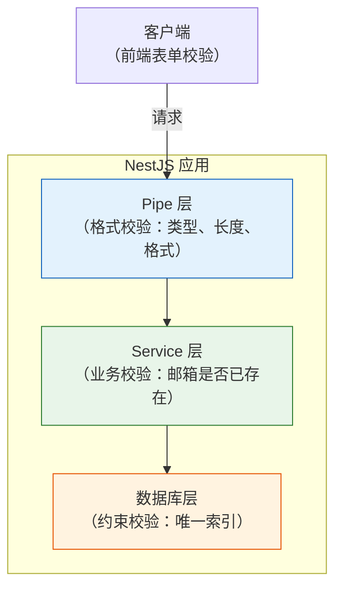
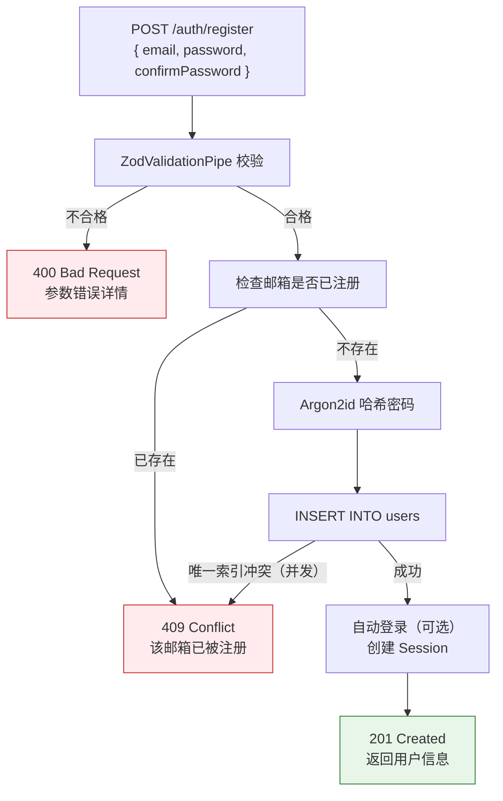
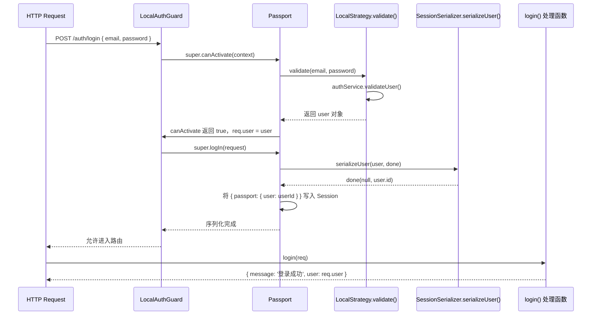

# 注册登录 API

## 本篇导读

### 核心目标

学完本篇后，你将能够：

- 使用 Zod 4 定义严格的请求参数 Schema，并在 NestJS 中通过 Pipe 自动验证请求体
- 实现符合生产标准的注册接口：邮箱查重、密码哈希、事务原子性保证
- 将上一篇的 Passport Local 策略与登录接口组合，实现完整的登录流程
- 设计统一的错误响应格式，覆盖参数校验失败、业务逻辑错误、系统异常三类场景
- 理解并实现 `/auth/me` 接口，在前端快速获取当前登录用户信息

### 重点与难点

**重点**：

- Zod 在 NestJS 中的集成方式——ZodValidationPipe 的实现与注册
- 注册接口的完整流程——参数校验、邮箱冲突处理、密码哈希、数据库写入
- 登录接口与 Passport Guard 的配合——Guard 执行顺序与响应结构

**难点**：

- Zod 4 的新 API 与之前版本的差异（`z.email()` 的变化、`ZodError` 格式化）
- 如何在 NestJS 的异常过滤器中统一处理 Zod 验证错误与业务错误
- 注册成功后是否应该自动登录——两种设计方案的权衡

## 从零到可用的注册登录

前两篇打好了基础：我们有了用户模型（数据库 Schema + Repository），也理解了 Session 认证的机制（Cookie、Redis、Passport.js）。现在是时候把它们组装成真正可以调用的 API 了。

本篇的目标是实现三个接口：

| 接口         | 方法 | 路径             | 说明                                 |
| ------------ | ---- | ---------------- | ------------------------------------ |
| 注册         | POST | `/auth/register` | 创建新账号，返回用户信息             |
| 登录         | POST | `/auth/login`    | 验证凭据，创建 Session，返回用户信息 |
| 获取当前用户 | GET  | `/auth/me`       | 返回当前登录用户的信息               |

注销接口（`POST /auth/logout`）将在第 4 篇《会话管理》中详细实现，因为它涉及多设备 Session 管理等话题。

## 核心概念讲解

### 参数校验的分层设计

在工程实践中，参数校验应该出现在多个层次，每个层次承担不同职责：



**Pipe 层（格式校验）**：

- 验证必填字段是否存在
- 验证字段格式（邮箱格式、密码最小长度）
- 参数类型转换（字符串转数字等）
- 由 ZodValidationPipe 全局处理，请求不合格直接返回 400，不进入业务逻辑

**Service 层（业务校验）**：

- 验证邮箱是否已被注册（需要查数据库）
- 验证账号状态（是否被封禁）
- 验证业务规则（如邀请码是否有效）

**数据库层（约束校验）**：

- 唯一索引强制保证邮箱唯一性（兜底，防止并发注册竞态条件）
- 非空约束、外键约束等

三层防御互相补充，缺一不可。

### Zod 4 在 NestJS 中的集成

#### 为什么选择 Zod 而不是 class-validator？

NestJS 官方文档推荐使用 `class-validator` + `class-transformer` 进行参数校验，但 Zod 在 TypeScript 项目中有显著优势：

| 对比维度        | class-validator                                | Zod                                         |
| --------------- | ---------------------------------------------- | ------------------------------------------- |
| Schema 定义     | 装饰器（运行时，需要 `emitDecoratorMetadata`） | 纯 TypeScript（编译时类型安全）             |
| 类型推导        | 需要手动定义类型，与 Schema 可能不同步         | `z.infer<typeof schema>` 自动推导，始终同步 |
| 运行时依赖      | `reflect-metadata`（增加包体积）               | 无额外运行时依赖                            |
| 错误信息        | 较简单的字符串消息                             | 结构化错误对象，路径精确，易于国际化        |
| 与 Drizzle 协同 | 需要分别定义 DTO 类和 Schema                   | 可以与 Drizzle Schema 共享类型推导          |

**Zod 4 的主要变化**：

Zod 4 相比 Zod 3 有几处值得注意的 API 变更：

```typescript
// Zod 3（旧）
z.string().email();

// Zod 4（新）：email 校验移到 z.email()
z.email();

// Zod 3（旧）：错误格式化
z.ZodError.flatten();

// Zod 4（新）：引入 z.ZodError，flatten 仍然存在但结构有变化
z.ZodError.format();

// Zod 4：新增的 z.parse 全局方法（语法糖）
// Zod 4 性能大幅提升（约 4x faster than Zod 3）
```

#### 实现 ZodValidationPipe

NestJS 的 Pipe 是处理请求参数的中间层，在控制器处理器执行之前运行：

```typescript
// src/common/pipes/zod-validation.pipe.ts
import {
  PipeTransform,
  Injectable,
  ArgumentMetadata,
  BadRequestException,
} from '@nestjs/common';
import { ZodSchema, ZodError } from 'zod';

@Injectable()
export class ZodValidationPipe implements PipeTransform {
  constructor(private schema: ZodSchema) {}

  transform(value: unknown, metadata: ArgumentMetadata) {
    // 只校验 body、query、param 类型的参数
    if (metadata.type === 'custom') {
      return value;
    }

    const result = this.schema.safeParse(value);

    if (!result.success) {
      throw new BadRequestException({
        message: '请求参数校验失败',
        errors: this.formatZodErrors(result.error),
      });
    }

    return result.data;
  }

  private formatZodErrors(error: ZodError) {
    return error.issues.map((issue) => ({
      field: issue.path.join('.'),
      message: issue.message,
      code: issue.code,
    }));
  }
}
```

**`safeParse` vs `parse`**：

- `parse`：解析失败时直接抛出 `ZodError`，需要 try-catch
- `safeParse`：总是返回 `{ success: true, data } | { success: false, error }`，无需 try-catch，更适合在 Pipe 中使用

#### 全局注册 vs 局部注册

Pipe 有两种注册方式：

**全局注册**（不推荐用于 ZodValidationPipe）：

```typescript
// 全局 Pipe 无法为每个路由指定不同的 Schema
app.useGlobalPipes(new ZodValidationPipe(someSchema)); // ❌ 一个 Schema 不可能适用所有路由
```

**局部注册**（推荐）：在每个需要校验的控制器方法上，通过 `@UsePipes` 或 `@Body(new ZodValidationPipe(schema))` 指定对应的 Schema：

```typescript
@Post('register')
async register(
  @Body(new ZodValidationPipe(RegisterDto)) body: RegisterInput
) {
  // body 已经过校验和类型推导
}
```

### 注册接口的设计

#### 定义注册 DTO（数据传输对象）

```typescript
// src/auth/dto/register.dto.ts
import { z } from 'zod';

export const RegisterSchema = z
  .object({
    email: z
      .email({ message: '请输入有效的邮箱地址' })
      .max(254, { message: '邮箱长度不能超过 254 个字符' }),

    password: z
      .string()
      .min(8, { message: '密码至少需要 8 个字符' })
      .max(128, { message: '密码不能超过 128 个字符' })
      .regex(/^(?=.*[a-z])(?=.*[A-Z])(?=.*\d)/, {
        message: '密码必须包含大小写字母和数字',
      }),

    // 密码确认（客户端体验字段，服务端也要验证）
    confirmPassword: z.string(),
  })
  .refine((data) => data.password === data.confirmPassword, {
    message: '两次输入的密码不一致',
    path: ['confirmPassword'], // 错误附着在 confirmPassword 字段上
  });

// 从 Schema 自动推导 TypeScript 类型
export type RegisterInput = z.infer<typeof RegisterSchema>;
```

**为什么服务端也要校验 `confirmPassword`？**

前端表单的校验永远可以被绕过（直接 curl 调接口）。服务端必须做自己的完整校验，不能信任客户端已经验证过的数据。

**密码强度正则表达式的权衡**：

上面的正则要求密码包含大小写字母和数字，这会拒绝一些安全但简单的密码（如完全由符号组成的密码 `!@#$%^&*()`）。NIST 800-63B 的最新建议是：

- 允许所有可打印字符（包括空格）
- 最小长度 8 位，最大长度不低于 64 位
- 不要求特定字符类型（强制复杂度不如长度有效）
- 与 Have I Been Pwned 等服务集成检查密码是否出现在泄露库中

在本教程中，为了演示目的保留了字符类型要求，实际项目中可根据安全策略调整。

#### 注册接口的完整实现

注册流程涉及多个步骤，我们来看每一步的实现：



```typescript
// src/auth/auth.service.ts（新增注册方法）
import { Injectable, ConflictException } from '@nestjs/common';
import { UsersRepository } from '../users/users.repository';
import * as argon2 from 'argon2';
import { RegisterInput } from './dto/register.dto';
import { DatabaseError } from 'pg';

@Injectable()
export class AuthService {
  constructor(private readonly usersRepository: UsersRepository) {}

  async register(input: RegisterInput) {
    // 步骤1：检查邮箱是否已注册（业务校验）
    const existingUser = await this.usersRepository.findByEmail(input.email);
    if (existingUser) {
      throw new ConflictException('该邮箱已被注册');
    }

    // 步骤2：哈希密码（永远不存明文）
    const passwordHash = await argon2.hash(input.password, {
      type: argon2.argon2id,
      memoryCost: 65536, // 64 MB
      timeCost: 3,
      parallelism: 4,
    });

    // 步骤3：创建用户（让数据库唯一索引兜底并发竞态）
    try {
      const user = await this.usersRepository.create({
        email: input.email,
        passwordHash,
      });
      return user;
    } catch (error) {
      // PostgreSQL 唯一约束违反：并发注册时的兜底处理
      if (error instanceof DatabaseError && error.code === '23505') {
        throw new ConflictException('该邮箱已被注册');
      }
      throw error;
    }
  }

  // validateUser 方法（上一篇已实现）
  async validateUser(email: string, password: string) {
    const user = await this.usersRepository.findByEmailWithPassword(email);

    if (!user) {
      // 防时序攻击：用户不存在时也执行哈希运算
      await argon2.hash('dummy-password-to-prevent-timing-attack');
      return null;
    }

    if (!user.isActive || !user.isVerified) {
      return null;
    }

    const isPasswordValid = await argon2.verify(user.passwordHash, password);
    if (!isPasswordValid) {
      return null;
    }

    const { passwordHash, deletedAt, ...safeUser } = user;
    return safeUser;
  }
}
```

#### AuthController：注册接口

```typescript
// src/auth/auth.controller.ts
import {
  Controller,
  Post,
  Get,
  Body,
  Req,
  UseGuards,
  HttpCode,
  HttpStatus,
} from '@nestjs/common';
import { Request } from 'express';
import { AuthService } from './auth.service';
import { ZodValidationPipe } from '../common/pipes/zod-validation.pipe';
import { RegisterSchema, RegisterInput } from './dto/register.dto';
import { LocalAuthGuard } from './guards/local-auth.guard';
import { SessionAuthGuard } from './guards/session-auth.guard';

@Controller('auth')
export class AuthController {
  constructor(private readonly authService: AuthService) {}

  @Post('register')
  @HttpCode(HttpStatus.CREATED)
  async register(
    @Body(new ZodValidationPipe(RegisterSchema)) body: RegisterInput,
    @Req() req: Request
  ) {
    const user = await this.authService.register(body);

    // 注册成功后自动登录（可选策略，见下文讨论）
    await new Promise<void>((resolve, reject) => {
      req.logIn(user, (err) => {
        if (err) return reject(err);
        resolve();
      });
    });

    return {
      message: '注册成功',
      user,
    };
  }

  @Post('login')
  @UseGuards(LocalAuthGuard)
  @HttpCode(HttpStatus.OK)
  async login(@Req() req: Request) {
    // LocalAuthGuard 已经完成了：
    // 1. 调用 LocalStrategy.validate() 验证邮箱密码
    // 2. 调用 serializeUser 将 userId 存入 Session
    // req.user 是 serializeUser 执行前由 validate() 返回的用户对象
    return {
      message: '登录成功',
      user: req.user,
    };
  }

  @Get('me')
  @UseGuards(SessionAuthGuard)
  async me(@Req() req: Request) {
    // SessionAuthGuard 已验证用户已登录
    // req.user 是 deserializeUser 恢复的用户对象
    return {
      user: req.user,
    };
  }
}
```

**注册后是否应该自动登录？**

这是一个设计决策，没有绝对的对错：

| 方案                               | 说明                                           | 适用场景                         |
| ---------------------------------- | ---------------------------------------------- | -------------------------------- |
| 注册后自动登录                     | 用户注册成功即进入已登录状态，无需再次输入密码 | 无邮箱验证流程，注册即可用的应用 |
| 注册后跳转到登录页                 | 用户需要手动再次登录                           | 用户体验稍差，但流程更明确       |
| 注册后发送验证邮件，验证后自动登录 | 用户注册→收验证邮件→点击链接→自动登录          | 需要邮箱验证的应用（推荐）       |

本教程采用"注册后自动登录"的方案，以简化演示流程。在生产项目中，如果有邮箱验证要求（`isVerified` 字段的用途），应在验证成功时再创建 Session。

### 登录接口的设计

#### 定义登录 DTO

```typescript
// src/auth/dto/login.dto.ts
import { z } from 'zod';

export const LoginSchema = z.object({
  email: z.email({ message: '请输入有效的邮箱地址' }),
  password: z.string().min(1, { message: '请输入密码' }),
});

export type LoginInput = z.infer<typeof LoginSchema>;
```

登录的密码校验比注册要宽松得多——只需验证"不为空"即可，因为：

- 如果用户密码本来就不符合当前密码强度规则（比如历史注册的老用户），会导致合法用户无法登录
- 密码是否正确的判断交给 Argon2 的哈希比对，而不是格式校验

#### Passport Local 策略与 Guard 的执行顺序

当请求到达 `POST /auth/login` 时，`@UseGuards(LocalAuthGuard)` 的执行顺序如下：



这里有一个微妙之处：在 `login()` 处理函数中，`req.user` 是 `LocalStrategy.validate()` 返回的用户对象（这个时候 `deserializeUser` 还没有执行过，`req.user` 直接来自 `validate` 的返回值，而不是从 Session 中恢复的）。

**为什么登录接口没有 `ZodValidationPipe`？**

因为 `LocalAuthGuard` 会在控制器方法执行之前拦截请求，Passport 自动从 `req.body` 中提取 `email` 和 `password` 字段传给 `LocalStrategy.validate()`。如果需要对登录接口也进行 Zod 校验，有两种方式：

**方式一：在 LocalStrategy 内部校验**

```typescript
async validate(email: string, password: string) {
  // 在策略内部做格式预校验
  const result = LoginSchema.safeParse({ email, password });
  if (!result.success) {
    throw new BadRequestException({
      message: '请求参数校验失败',
      errors: formatZodErrors(result.error),
    });
  }
  // 继续验证密码...
}
```

**方式二：添加前置 Pipe（通过 Guard 链）**

```typescript
@Post('login')
@UseGuards(new ZodGuard(LoginSchema), LocalAuthGuard) // ZodGuard 先执行
async login(@Req() req: Request) { ... }
```

本教程选择方式一（LocalStrategy 内部校验），以保持控制器代码的简洁。

### 统一错误响应格式

#### 设计目标

一个好的错误响应格式应该满足：

- **机器可读**：前端可以根据 `code` 字段做分支处理
- **用户可读**：`message` 字段提供对用户友好的错误说明
- **开发可读**：`details` 字段（仅开发环境）提供调试信息

```typescript
// 统一的错误响应结构
interface ErrorResponse {
  statusCode: number; // HTTP 状态码
  code: string; // 业务错误码，如 'EMAIL_ALREADY_EXISTS'
  message: string; // 对用户友好的错误说明
  details?: unknown; // 详细错误信息（生产环境可选择不返回）
  timestamp: string; // 错误发生时间（ISO 8601）
  path: string; // 请求路径
}
```

**错误码的设计**：使用 `SCREAMING_SNAKE_CASE` 风格的字符串码，而不是数字码，原因：

- 字符串码自描述性强，看到 `INVALID_CREDENTIALS` 就知道是认证错误
- 不需要维护数字码的映射表
- 前端代码中 `if (error.code === 'EMAIL_ALREADY_EXISTS')` 比 `if (error.code === 4001)` 更易读

#### 实现全局异常过滤器

```typescript
// src/common/filters/http-exception.filter.ts
import {
  ExceptionFilter,
  Catch,
  ArgumentsHost,
  HttpException,
  HttpStatus,
} from '@nestjs/common';
import { Request, Response } from 'express';

@Catch() // 捕获所有异常，包括未处理的 Error
export class GlobalExceptionFilter implements ExceptionFilter {
  catch(exception: unknown, host: ArgumentsHost) {
    const ctx = host.switchToHttp();
    const response = ctx.getResponse<Response>();
    const request = ctx.getRequest<Request>();

    let statusCode = HttpStatus.INTERNAL_SERVER_ERROR;
    let code = 'INTERNAL_SERVER_ERROR';
    let message = '服务器内部错误';
    let details: unknown = undefined;

    if (exception instanceof HttpException) {
      statusCode = exception.getStatus();
      const exceptionResponse = exception.getResponse();

      if (typeof exceptionResponse === 'object' && exceptionResponse !== null) {
        const resp = exceptionResponse as Record<string, unknown>;
        message = (resp.message as string) ?? message;
        details = resp.errors; // ZodValidationPipe 的详细错误
        code = this.getCodeFromStatus(statusCode);
      } else {
        message = exceptionResponse as string;
        code = this.getCodeFromStatus(statusCode);
      }
    } else if (exception instanceof Error) {
      // 未预期的程序错误，生产环境不向客户端暴露内部错误信息
      if (process.env.NODE_ENV !== 'production') {
        details = {
          name: exception.name,
          stack: exception.stack,
        };
      }
    }

    response.status(statusCode).json({
      statusCode,
      code,
      message,
      details: details ?? undefined,
      timestamp: new Date().toISOString(),
      path: request.url,
    });
  }

  private getCodeFromStatus(status: number): string {
    const codeMap: Record<number, string> = {
      400: 'BAD_REQUEST',
      401: 'UNAUTHORIZED',
      403: 'FORBIDDEN',
      404: 'NOT_FOUND',
      409: 'CONFLICT',
      422: 'UNPROCESSABLE_ENTITY',
      429: 'TOO_MANY_REQUESTS',
      500: 'INTERNAL_SERVER_ERROR',
    };
    return codeMap[status] ?? 'UNKNOWN_ERROR';
  }
}
```

#### 注册全局过滤器

```typescript
// src/main.ts
import { GlobalExceptionFilter } from './common/filters/http-exception.filter';

async function bootstrap() {
  const app = await NestFactory.create(AppModule);

  // ... 其他中间件配置

  // 全局异常过滤器（必须在所有其他设置之后注册）
  app.useGlobalFilters(new GlobalExceptionFilter());

  await app.listen(3000);
}
```

#### 常见错误的响应示例

**参数校验失败（400）**：

```json
{
  "statusCode": 400,
  "code": "BAD_REQUEST",
  "message": "请求参数校验失败",
  "details": [
    {
      "field": "email",
      "message": "请输入有效的邮箱地址",
      "code": "invalid_string"
    },
    {
      "field": "password",
      "message": "密码至少需要 8 个字符",
      "code": "too_small"
    }
  ],
  "timestamp": "2026-03-27T08:00:00.000Z",
  "path": "/auth/register"
}
```

**邮箱已存在（409）**：

```json
{
  "statusCode": 409,
  "code": "CONFLICT",
  "message": "该邮箱已被注册",
  "timestamp": "2026-03-27T08:00:00.000Z",
  "path": "/auth/register"
}
```

**未登录访问受保护资源（401）**：

```json
{
  "statusCode": 401,
  "code": "UNAUTHORIZED",
  "message": "请先登录",
  "timestamp": "2026-03-27T08:00:00.000Z",
  "path": "/auth/me"
}
```

**密码错误（401）**：

```json
{
  "statusCode": 401,
  "code": "UNAUTHORIZED",
  "message": "邮箱或密码不正确",
  "timestamp": "2026-03-27T08:00:00.000Z",
  "path": "/auth/login"
}
```

### 获取当前用户：`/auth/me`

`/auth/me` 接口是前端非常常用的接口，通常在应用初始化时调用，用来判断用户是否已登录并获取用户信息：

```typescript
// 前端调用示例
const response = await fetch('/auth/me', {
  credentials: 'include', // 必须携带 Cookie
});

if (response.status === 401) {
  // 用户未登录，跳转到登录页
  router.push('/login');
} else {
  const { user } = await response.json();
  // 将 user 存入全局状态
  store.setUser(user);
}
```

接口实现非常简单，因为所有工作（Session 查询、用户恢复）都由 `SessionAuthGuard` 和 `deserializeUser` 完成了：

```typescript
@Get('me')
@UseGuards(SessionAuthGuard)
async me(@Req() req: Request) {
  return {
    user: req.user, // 由 deserializeUser 从数据库查询并挂载
  };
}
```

**`/auth/me` 的响应设计**：

是否需要一个单独的 `PublicUserDto` 来明确定义响应中应该包含哪些字段？

```typescript
// 定义响应类型（可选，但推荐用于 API 文档和类型安全）
export type PublicUserResponse = {
  id: string;
  email: string;
  isVerified: boolean;
  isActive: boolean;
  createdAt: string; // Date 序列化为 ISO 字符串
  updatedAt: string;
};
```

在实践中，`req.user` 是 `PublicUser` 类型（已经排除了 `passwordHash` 和 `deletedAt`），直接返回是安全的。如果项目接入了 Swagger，可以用 `ApiResponse` 装饰器明确文档化。

### 完整项目结构

经过三篇的内容，项目结构已经成型，整理如下：

```plaintext
src/
├── main.ts                          # 应用入口，中间件配置
├── app.module.ts                    # 根模块
├── common/
│   ├── filters/
│   │   └── http-exception.filter.ts # 全局异常过滤器
│   └── pipes/
│       └── zod-validation.pipe.ts   # Zod 校验 Pipe
├── database/
│   ├── database.module.ts
│   ├── database.provider.ts
│   └── schema/
│       ├── index.ts
│       └── users.schema.ts
├── redis/
│   ├── redis.module.ts
│   └── redis.provider.ts
├── users/
│   ├── users.module.ts
│   ├── users.service.ts
│   └── users.repository.ts
└── auth/
    ├── auth.module.ts
    ├── auth.controller.ts
    ├── auth.service.ts
    ├── dto/
    │   ├── register.dto.ts
    │   └── login.dto.ts
    ├── guards/
    │   ├── local-auth.guard.ts
    │   └── session-auth.guard.ts
    ├── strategies/
    │   └── local.strategy.ts
    └── session.serializer.ts
```

### 完整的模块配置

#### AppModule

```typescript
// src/app.module.ts
import { Module } from '@nestjs/common';
import { ConfigModule } from '@nestjs/config';
import { DatabaseModule } from './database/database.module';
import { RedisModule } from './redis/redis.module';
import { UsersModule } from './users/users.module';
import { AuthModule } from './auth/auth.module';

@Module({
  imports: [
    ConfigModule.forRoot({
      isGlobal: true,
      envFilePath: '.env',
    }),
    DatabaseModule, // 全局模块，提供 Drizzle 实例
    RedisModule, // 全局模块，提供 Redis 客户端
    UsersModule,
    AuthModule,
  ],
})
export class AppModule {}
```

#### main.ts 完整配置

```typescript
// src/main.ts
import { NestFactory } from '@nestjs/core';
import { AppModule } from './app.module';
import * as session from 'express-session';
import { RedisStore } from 'connect-redis';
import { createClient } from 'redis';
import * as passport from 'passport';
import { GlobalExceptionFilter } from './common/filters/http-exception.filter';

async function bootstrap() {
  const app = await NestFactory.create(AppModule);

  // CORS 配置（开发环境）
  app.enableCors({
    origin: process.env.CORS_ORIGIN ?? 'http://localhost:5173',
    credentials: true,
  });

  // Redis 客户端（Session 存储用）
  const redisClient = createClient({
    url: process.env.REDIS_URL ?? 'redis://localhost:6379',
  });
  await redisClient.connect();

  // Session 中间件
  app.use(
    session({
      store: new RedisStore({
        client: redisClient,
        prefix: 'sess:',
      }),
      secret: process.env.SESSION_SECRET!,
      resave: false,
      saveUninitialized: false,
      rolling: true, // 每次请求自动续期
      name: 'sessionId',
      cookie: {
        httpOnly: true,
        secure: process.env.NODE_ENV === 'production',
        sameSite: 'lax',
        maxAge: 7 * 24 * 60 * 60 * 1000, // 7 天
      },
    })
  );

  // Passport 中间件（必须在 session 之后）
  app.use(passport.initialize());
  app.use(passport.session());

  // 全局异常过滤器
  app.useGlobalFilters(new GlobalExceptionFilter());

  // 全局路由前缀
  app.setGlobalPrefix('api');

  await app.listen(process.env.PORT ?? 3000);
  console.log(`Application is running on: ${await app.getUrl()}`);
}

bootstrap();
```

## 常见问题与解决方案

### 问题一：注册成功但自动登录失败

**症状**：注册接口返回 201，但 Cookie 没有被设置，后续调用 `/auth/me` 返回 401。

**原因**：`req.logIn()` 是异步的（通过回调），如果没有正确等待 Promise，可能在 Session 写入 Redis 之前就返回了响应。

**解决方案**：确保 `req.logIn()` 被正确包装成 Promise：

```typescript
// ✅ 正确：等待 Session 写入完成
await new Promise<void>((resolve, reject) => {
  req.logIn(user, (err) => {
    if (err) return reject(err);
    resolve();
  });
});

// ❌ 错误：没有等待，可能 Session 还未写入就返回了响应
req.logIn(user, (err) => {
  /* ... */
});
return { message: '注册成功', user }; // 可能在 logIn 完成前就执行了
```

### 问题二：Passport 找不到 Local 策略

**症状**：启动报错 `Unknown authentication strategy "local"`，或者登录接口返回 500。

**原因**：`LocalStrategy` 未被正确注入到 NestJS 的 DI 容器中，或者 `AuthModule` 没有正确配置 `PassportModule`。

**排查步骤**：

1. 确认 `LocalStrategy` 在 `AuthModule` 的 `providers` 中：

```typescript
@Module({
  imports: [PassportModule.register({ session: true }), UsersModule],
  providers: [AuthService, LocalStrategy, SessionSerializer], // 三者都必须在这里
})
export class AuthModule {}
```

2. 确认 `SessionSerializer` 也在 `providers` 中（缺少它会导致 `serializeUser` 未注册，Session 无法创建）。

3. 确认 `AuthModule` 导入了 `UsersModule`，且 `UsersModule` 导出了 `UsersRepository`：

```typescript
// users.module.ts
@Module({
  providers: [UsersRepository, UsersService],
  exports: [UsersRepository, UsersService], // 必须导出，AuthModule 才能注入
})
export class UsersModule {}
```

### 问题三：Zod 校验通过但类型不匹配

**症状**：Zod `safeParse` 成功，但 `result.data` 的 TypeScript 类型不是预期的类型。

**原因**：Zod Schema 的类型推导和实际校验有差异，或者使用了旧版 Zod API。

**Zod 4 常见陷阱**：

```typescript
// ❌ Zod 3 的写法，在 Zod 4 中已废弃
z.string().email();

// ✅ Zod 4 的新写法
z.email();

// ❌ z.string().min(0) 在某些场景下类型推导为 string，但允许空字符串
password: z.string().min(0);

// ✅ 明确要求非空字符串
password: z.string().min(1, { message: '请输入密码' });
```

### 问题四：登录成功但 `/auth/me` 仍返回 401

**症状**：`POST /auth/login` 返回 200 且包含用户信息，但立即调用 `GET /auth/me` 返回 401。

**原因**：跨域请求时，前端 fetch/axios 没有配置 `credentials: 'include'`，导致 Cookie 没有被携带。

**解决方案**：

```typescript
// 前端 fetch（必须显式开启 credentials）
fetch('/api/auth/me', {
  credentials: 'include', // ✅ 携带 Cookie
});

// Axios（全局配置）
axios.defaults.withCredentials = true;

// 或者单次请求
axios.get('/api/auth/me', { withCredentials: true });
```

同时确认后端 CORS 配置正确：

```typescript
app.enableCors({
  origin: 'http://localhost:5173', // 必须是具体的 origin，不能是 '*'
  credentials: true, // 允许携带 Cookie
});
```

### 问题五：`confirmPassword` 校验失败但错误字段指向错误

**症状**：密码不一致时，错误响应中的 `field` 是空字符串而不是 `confirmPassword`。

**原因**：Zod 的 `refine` 错误默认路径为根对象（空数组），需要通过 `path` 选项指定。

```typescript
// ❌ 没有指定 path，错误附着在根对象上，field 为 ''
.refine((data) => data.password === data.confirmPassword, {
  message: '两次输入的密码不一致',
  // 缺少 path
})

// ✅ 指定 path，错误附着在 confirmPassword 字段上
.refine((data) => data.password === data.confirmPassword, {
  message: '两次输入的密码不一致',
  path: ['confirmPassword'],
})
```

### 问题六：错误信息暴露内部实现细节

**症状**：生产环境中，API 错误响应包含数据库错误信息、堆栈轨迹等内部信息。

**原因**：异常过滤器没有区分生产环境和开发环境，将未处理的 `Error` 对象直接序列化返回。

**解决方案**：在 `GlobalExceptionFilter` 中严格区分环境：

```typescript
} else if (exception instanceof Error) {
  // 生产环境：只返回通用错误信息，不暴露内部细节
  if (process.env.NODE_ENV !== 'production') {
    details = {
      name: exception.name,
      message: exception.message,
      stack: exception.stack,
    };
  }
  // 生产环境的错误应该记录到日志系统（如 Sentry）
  console.error('Unhandled error:', exception);
}
```

同时，对于数据库连接错误、Redis 连接错误等基础设施错误，应该通过日志监控系统（如 Sentry、Datadog）捕获，而不是通过 API 响应暴露。

## 接口测试

以下是使用 `curl` 测试三个接口的示例，可以帮助验证实现是否正确。

**注册**：

```plaintext
curl -X POST http://localhost:3000/api/auth/register \
  -H 'Content-Type: application/json' \
  -c cookies.txt \
  -d '{
    "email": "user@example.com",
    "password": "Password123",
    "confirmPassword": "Password123"
  }'
```

**登录**：

```plaintext
curl -X POST http://localhost:3000/api/auth/login \
  -H 'Content-Type: application/json' \
  -c cookies.txt \
  -d '{
    "email": "user@example.com",
    "password": "Password123"
  }'
```

**查询当前用户**：

```plaintext
curl http://localhost:3000/api/auth/me \
  -b cookies.txt
```

`-c cookies.txt` 表示将响应中的 Cookie 保存到 `cookies.txt` 文件；`-b cookies.txt` 表示从该文件读取 Cookie 并携带。这模拟了浏览器自动管理 Cookie 的行为。

## 本篇小结

本篇将前两篇的基础组件（用户模型、Session + Passport 机制）组装成了三个完整可用的认证接口：

**参数校验**：

- 使用 Zod 4 定义强类型 Schema，`z.infer<typeof schema>` 自动推导 TypeScript 类型，无需手动维护 DTO 类型
- `ZodValidationPipe` 将 Zod Schema 接入 NestJS 的 Pipe 机制，在请求进入业务逻辑前完成格式校验
- 注册接口的 `confirmPassword` 通过 `z.refine()` 跨字段校验实现

**注册接口**：

- 三层校验：Pipe 层格式校验 → Service 层业务校验（邮箱查重） → 数据库层约束兜底（唯一索引）
- 密码使用 Argon2id 哈希，配置 OWASP 推荐参数
- 并发注册竞态条件通过捕获 PostgreSQL 的唯一约束违反错误（错误码 `23505`）处理
- 注册成功后通过 `req.logIn()` 自动创建 Session，用户无需二次登录

**登录接口**：

- `LocalAuthGuard` 封装了 Passport Local 策略完整流程：格式提取 → `validate()` 密码验证 → `serializeUser()` Session 序列化
- 防时序攻击：用户不存在时执行虚拟哈希，使两种情况响应时间一致

**统一错误处理**：

- `GlobalExceptionFilter` 统一拦截所有异常，输出格式一致（statusCode、code、message、details）的错误响应
- 生产环境过滤内部错误信息，开发环境暴露完整堆栈，通过 `NODE_ENV` 区分

在下一篇 **会话管理** 中，我们将深入讨论 Session 的生命周期精细控制：如何实现"记住我"功能、多设备 Session 并发限制、用户主动注销所有设备、以及 Session 过期策略的精细配置。
