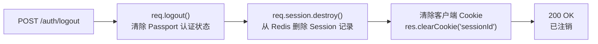
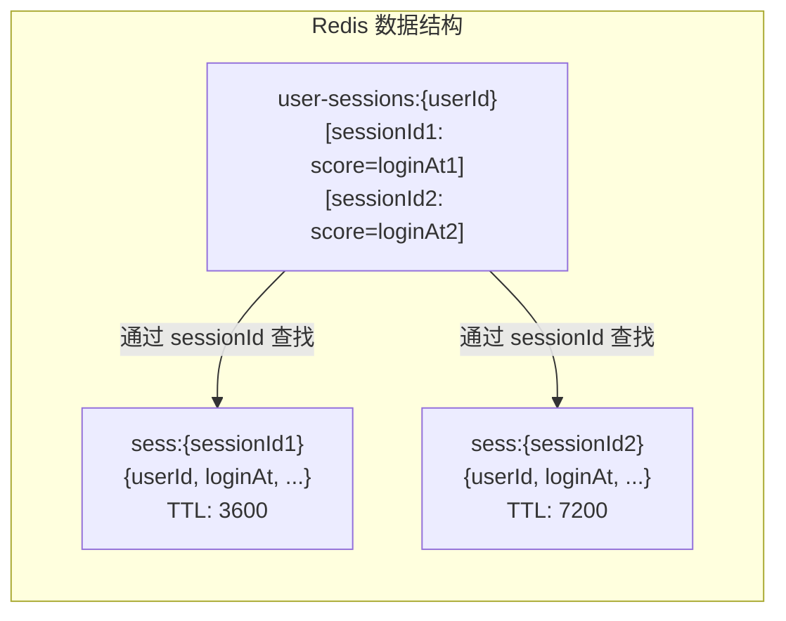
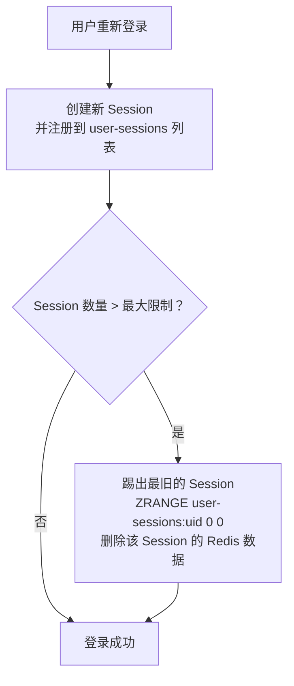
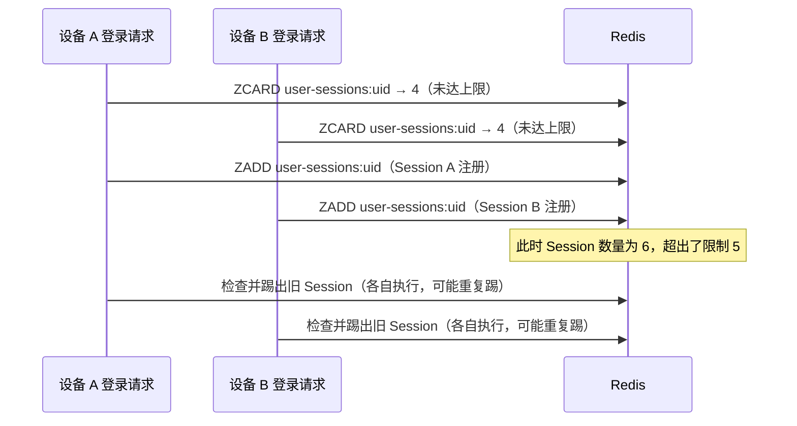
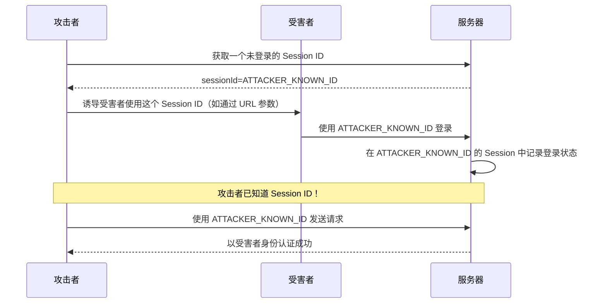
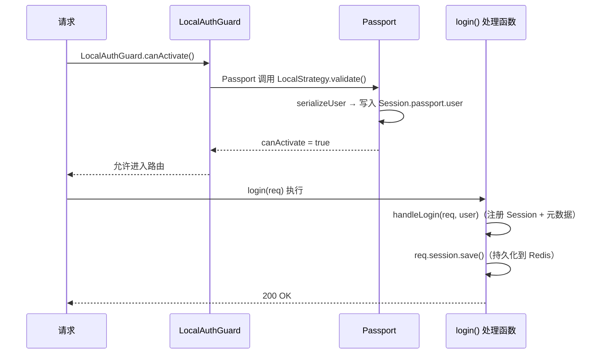

# 会话管理

## 本篇导读

### 核心目标

学完本篇后，你将能够：

- 实现完整的注销登录接口，包括单设备注销和全设备注销
- 理解 Session 过期的两种策略（绝对过期 vs 滑动过期），并在代码中正确实现"记住我"功能
- 设计并实现多设备会话管理——追踪每个用户的所有活跃 Session，并对外提供会话列表接口
- 掌握并发控制策略，限制每个用户的最大在线设备数
- 理解会话管理中常见的安全漏洞，并实施对应的防护措施

### 重点与难点

**重点**：

- 注销登录的正确实现方式——`req.logout()` 与 `req.session.destroy()` 的区别与组合使用
- 全设备注销的数据结构设计——如何在 Redis 中维护用户到 Session 列表的映射
- Session 元数据的设计与写入时机——如何在不影响认证性能的前提下记录设备信息

**难点**：

- 全设备注销的原子性保证——在 Redis 中批量删除 Session 时的一致性问题
- 并发情况下的会话数量控制——新登录踢出最旧设备时的 Race Condition
- Session 轮换（Session Rotation）的实现——登录时如何安全地更换 Session ID

## 从注销到多设备管理

前三篇已经搭建了 Session 认证的骨架：用户模型存储在 PostgreSQL，Session 存储在 Redis，注册和登录接口也已实现。但一个完整的认证系统还差最后一块拼图——**会话生命周期管理**。

会话管理回答的是这些问题：

- 用户可以如何结束自己的会话？（单设备注销）
- 用户能不能一键退出所有设备？（全设备注销）
- 用户勾选"记住我"时，Session 如何保持更长时间？
- 同一账号可以有多少个设备同时在线？
- 账号被封禁时，如何立即踢出所有设备？

这些问题在用户量少的时候可能不明显，但在真实的生产系统中，每一个细节都可能影响到用户的安全和体验。

## 核心概念讲解

### 注销登录

#### `req.logout()` vs `req.session.destroy()`

NestJS + Passport 组合中，处理注销时有两个容易混淆的函数：

**`req.logout(callback)`**

这是 Passport 提供的方法，专门用于清除 Passport 的认证状态：

- 删除 `req.user`
- 从 Session 中移除 `passport` 字段（即 `session.passport.user`）
- **不会**删除整个 Session，Session 本身（及其他数据）仍然保留在 Redis 中

```typescript
req.logout((err) => {
  // Session 中 passport.user 被清空，但 Session 仍然存在于 Redis
});
```

**`req.session.destroy(callback)`**

这是 `express-session` 提供的方法，用于彻底销毁整个 Session：

- 从 Redis 中删除 Session 记录
- 清空 `req.session` 对象
- `connect-redis` 会在 Redis 中执行 `DEL sess:{sessionId}` 命令

```typescript
req.session.destroy((err) => {
  // Redis 中的 Session 记录已被删除
  // 即使客户端再次携带同一个 Cookie，服务器也找不到对应的 Session
});
```

**两者应该如何组合使用？**

对于注销登录，推荐的做法是：先调用 `req.logout()` 清除 Passport 状态，再调用 `req.session.destroy()` 彻底销毁 Session：



为什么这么设计而不是直接 `session.destroy()`？因为 `req.logout()` 让 Passport 有机会做内部清理（某些 Passport 策略可能需要），在语义上也更明确。

#### 注销接口的完整实现

```typescript
// src/auth/auth.controller.ts（新增注销接口）
@Post('logout')
@UseGuards(SessionAuthGuard) // 必须登录才能注销
@HttpCode(HttpStatus.OK)
async logout(@Req() req: Request, @Res({ passthrough: true }) res: Response) {
  const sessionId = req.session.id;

  // 步骤1：清除 Passport 认证状态
  await new Promise<void>((resolve, reject) => {
    req.logout((err) => {
      if (err) return reject(err);
      resolve();
    });
  });

  // 步骤2：销毁 Session（从 Redis 中删除）
  await new Promise<void>((resolve, reject) => {
    req.session.destroy((err) => {
      if (err) return reject(err);
      resolve();
    });
  });

  // 步骤3：清除客户端 Cookie
  res.clearCookie('sessionId'); // 与 Session 名称配置保持一致

  return { message: '已成功注销' };
}
```

**`@Res({ passthrough: true })`** 这个装饰器值得解释一下。在 NestJS 中，一旦注入 `@Res()`，就必须使用 `res.send()` / `res.json()` 手动发送响应，否则请求会挂起。`{ passthrough: true }` 选项告诉 NestJS：你只是想访问 `res` 对象来做一些操作（比如设置 Cookie），响应还是由框架自动处理（return 语句返回的值），不需要手动调用 `res.send()`。

**`res.clearCookie('sessionId')`** 的作用是向客户端发送一个 `Set-Cookie: sessionId=; Max-Age=0` 的响应头，让浏览器立即删除 Cookie。这样即使 Redis 中的 Session 已被删除，客户端也不会携带无效的 Cookie 发出多余的请求。

**注销接口为什么需要 `SessionAuthGuard`？**

技术上来说，未登录的用户也可以调用注销接口（什么都不会发生）。加上 Guard 的原因是：

- 避免对未认证请求执行无意义的数据库查询（Guard 在进入处理函数之前拦截）
- 明确语义：注销是"登出"操作，对未登录用户没有意义，返回 401 是合理的

#### 注销后的 Cookie 清除细节

`res.clearCookie()` 在内部实际上是调用了 `res.cookie(name, '', options)`，将 Cookie 的 `Max-Age` 设为 0 并清空 Cookie 值。需要注意的是，传入的选项必须与设置 Cookie 时使用的选项基本一致（除了 `expires` 和 `maxAge`），否则浏览器可能无法正确匹配并删除 Cookie：

```typescript
// 设置 Cookie 时
res.cookie('sessionId', sessionId, {
  httpOnly: true,
  secure: true,
  path: '/',
  domain: '.app.com',
});

// 删除 Cookie 时（需要相同的 path 和 domain）
res.clearCookie('sessionId', {
  httpOnly: true,
  secure: true,
  path: '/', // 必须与设置时一致
  domain: '.app.com', // 必须与设置时一致
});
```

在使用 `express-session` 时，Cookie 的配置由中间件统一管理，`res.clearCookie()` 通常只需要传 Cookie 名称即可（默认 `path` 是 `/`）。如果配置了自定义 `domain`，则需要显式传入。

### Session 过期处理

Session 过期有两个维度：**客户端 Cookie 过期**和**服务端 Redis 数据过期**。两者必须保持一致，否则会出现 Cookie 还在但 Session 已删除（用户每次刷新页面都被踢出），或者 Cookie 提前过期但 Redis 中 Session 还占用内存的情况。

#### 两种过期策略

**绝对过期（Absolute Expiry）**

Session 从创建时起，固定在某个时间后过期，无论用户是否活跃：

```
创建时间    T+7天
    │          │
    ┼──────────┼─────────────► 时间轴
    ↑          ↑
    登录      过期（强制注销）
```

- **优点**：简单，服务器不需要在每次请求时更新过期时间
- **缺点**：用户在活跃使用 App 时可能突然被注销，体验差
- **适用场景**：安全要求高的系统（如银行应用），要求用户定期重新认证

**滑动过期（Sliding/Idle Expiry）**

每次用户发出请求，Session 的过期时间都从当前时刻起重新计算：

```
登录      活跃请求（续期）    空闲期超过 N 天
    │      │  │   │           │
    ┼──────┼──┼───┼───────────┼─────────► 时间轴
    创建   └──┘   └── 每次请求都重置过期时间
```

- **优点**：只有真正空闲的用户才会被注销，活跃用户保持登录
- **缺点**：每次请求都可能触发 Redis 写入（更新 TTL），会增加一定的 Redis 负担
- **适用场景**：大多数 Web 应用的通用选择

`express-session` 的 `rolling: true` 选项实现了滑动过期：

```typescript
session({
  rolling: true, // 每次请求自动续期（重置 maxAge 计时）
  cookie: {
    maxAge: 7 * 24 * 60 * 60 * 1000, // 7 天：空闲超过 7 天才过期
  },
  // ...其他配置
});
```

当 `rolling: true` 时，每次携带有效 Session Cookie 的请求都会触发 Session 的保存（即使 Session 数据没有变化），从而刷新 Redis 中的 TTL 和客户端 Cookie 的过期时间。

**两种策略结合**：很多应用会同时使用两种策略——设置一个**空闲过期时间**（如 7 天不活跃则注销）和一个**绝对最长过期时间**（如最长 30 天必须重新登录）：

```typescript
// 在 Session 数据中记录登录时间（绝对过期的起点）
req.session.loginAt = Date.now();

// 在 SessionAuthGuard 中检查绝对过期
const MAX_SESSION_AGE = 30 * 24 * 60 * 60 * 1000; // 30 天
if (Date.now() - req.session.loginAt > MAX_SESSION_AGE) {
  req.session.destroy(() => {});
  throw new UnauthorizedException('登录已过期，请重新登录');
}
```

#### 客户端 Cookie 过期与服务端 Redis 过期的对齐

`express-session` + `connect-redis` 会自动处理两者的对齐：

- Cookie 的 `maxAge`（毫秒）转换为 Redis 的 `TTL`（秒）时，由 `connect-redis` 自动完成
- 当 `rolling: true` 时，每次请求时 `express-session` 会同时：1）更新 Cookie 的过期时间（在响应头中重新设置 `Set-Cookie`），2）调用 `store.touch()` 更新 Redis TTL

这就是为什么在使用 `rolling: true` 时，你会发现每次请求的响应都带有 `Set-Cookie` 响应头——这是正常的，表示过期时间正在被续期。

#### 实现"记住我"功能

"记住我"的本质是：**根据用户的选择，动态调整 Session 的过期时间**。

常见的实现方式有两种：

**方式一：登录时传入参数，动态修改 Cookie 的 maxAge**

```typescript
// src/auth/dto/login.dto.ts（新增 rememberMe 字段）
export const LoginSchema = z.object({
  email: z.email({ message: '请输入有效的邮箱地址' }),
  password: z.string().min(1, { message: '请输入密码' }),
  rememberMe: z.boolean().optional().default(false),
});
```

在 LocalStrategy 内部（或者 `afterLogin` 钩子中）根据 `rememberMe` 调整 Cookie：

```typescript
// src/auth/auth.controller.ts
@Post('login')
@UseGuards(LocalAuthGuard)
@HttpCode(HttpStatus.OK)
async login(@Req() req: Request) {
  // LocalAuthGuard 执行完后，req.user 已经被设置
  // 但此时 Session 已经通过 serializeUser 建立了，Cookie maxAge 使用的是默认值

  const rememberMe = (req.body as Record<string, unknown>)?.rememberMe === true;

  // 动态修改 Session 的 Cookie 过期时间
  if (rememberMe) {
    req.session.cookie.maxAge = 30 * 24 * 60 * 60 * 1000; // 30 天
  } else {
    req.session.cookie.maxAge = undefined; // 不设置 maxAge，浏览器关闭后 Cookie 消失（会话 Cookie）
  }

  // 重新保存 Session（确保 maxAge 变更被持久化到 Redis）
  await new Promise<void>((resolve, reject) => {
    req.session.save((err) => {
      if (err) return reject(err);
      resolve();
    });
  });

  return {
    message: '登录成功',
    user: req.user,
  };
}
```

**方式二：使用独立的"记住我"令牌**

另一种更健壮的方式是令牌机制——系统生成一个长期有效的"记住我"令牌，存储到数据库和用户的另一个 Cookie（与 Session Cookie 分离）。当用户回来时，即使 Session 已过期，可以通过令牌自动创建新 Session。

这种方式的优点是两种状态明确分离：Session Cookie 短期有效，负责当前会话；记住我令牌单独管理，负责跨会话恢复。但实现复杂度更高，本教程不做展开，感兴趣的读者可以参考 Rails 的 `remember_me` 实现。

在本教程中，我们采用方式一，简单实用，覆盖大多数应用场景。

### 全设备注销与多设备 Session 管理

#### 问题的起点：谁知道这个用户有哪些 Session？

单设备注销很简单：拿到当前请求的 Session ID，删掉就行。但全设备注销需要知道当前用户 **所有的** Session ID，才能批量删除。

问题是，`express-session` 并不提供"按用户查询 Session 列表"的功能。Redis 中默认只存了 `sess:{sessionId} → 数据` 的映射，并没有 `user:{userId} → [sessionId1, sessionId2, ...]` 的反向索引。

要实现全设备注销和多设备管理，我们需要**自己维护用户到 Session 列表的映射**。

#### 数据结构设计

在 Redis 中增加一个以用户 ID 为键的有序集合（Sorted Set），记录该用户的所有活跃 Session：



选择 **有序集合（Sorted Set）** 而不是普通集合（Set）的原因：

- `score`（分值）存储登录时间戳，可以按时间排序——找出"最旧的 Session"来实现并发控制（踢出最旧设备）
- `ZRANGEBYSCORE` 可以按时间范围查询 Session
- `ZREMRANGEBYRANK` 可以删除排名最旧的 Session

```
有序集合 key：user-sessions:{userId}
member：sessionId    score：登录时间戳（Unix timestamp）
```

#### Session 元数据设计

除了 Session ID，你可能还想在会话列表中展示更多信息——"当前设备"用什么浏览器、从哪个 IP 登录的、最后活跃时间是什么时候。这些元数据需要在登录时收集并存入 Session：

```typescript
// 登录时在 Session 中存储元数据
req.session.metadata = {
  userId: user.id,
  loginAt: Date.now(),
  ip: req.ip ?? req.socket.remoteAddress ?? 'unknown',
  userAgent: req.headers['user-agent'] ?? 'unknown',
  deviceType: parseDeviceType(req.headers['user-agent']),
};
```

**`deviceType` 的解析**：

```typescript
function parseDeviceType(userAgent?: string): string {
  if (!userAgent) return 'unknown';
  const ua = userAgent.toLowerCase();
  if (ua.includes('mobile') || ua.includes('android') || ua.includes('iphone'))
    return 'mobile';
  if (ua.includes('tablet') || ua.includes('ipad')) return 'tablet';
  return 'desktop';
}
```

实际生产中可用 `ua-parser-js` 等库做更精确的解析。

**Session 元数据的存储位置**：元数据存在 Session 自身的数据中（Redis 的 `sess:{sessionId}` 记录），而不是存在 `user-sessions:{userId}` 的有序集合里。这样读取单个 Session 的详情时，只需查一个 key，不需要做多余联合查询。

#### SessionService：封装多设备 Session 操作

所有对 `user-sessions` 有序集合的操作，应该封装在一个独立的 Service 中，而不是散落在 Controller 里：

```typescript
// src/auth/session.service.ts
import { Injectable, Inject } from '@nestjs/common';
import { RedisClientType } from 'redis';
import { REDIS_CLIENT } from '../redis/redis.provider';

const USER_SESSIONS_PREFIX = 'user-sessions:';
const SESSION_PREFIX = 'sess:';

export interface SessionInfo {
  sessionId: string;
  loginAt: number;
  ip: string;
  userAgent: string;
  deviceType: string;
  lastActiveAt?: number;
}

@Injectable()
export class SessionService {
  constructor(@Inject(REDIS_CLIENT) private readonly redis: RedisClientType) {}

  /** 注册新 Session（在用户登录后调用） */
  async registerSession(
    userId: string,
    sessionId: string,
    loginAt: number
  ): Promise<void> {
    const key = `${USER_SESSIONS_PREFIX}${userId}`;
    await this.redis.zAdd(key, {
      score: loginAt,
      value: sessionId,
    });
    // user-sessions 的过期时间设为最长可能存活的时间（如 30 天）
    // 它只是一个索引，真正的 Session 有自己的 TTL
    await this.redis.expire(key, 30 * 24 * 60 * 60);
  }

  /** 注销单个 Session（从用户 Session 列表中移除） */
  async removeSession(userId: string, sessionId: string): Promise<void> {
    const key = `${USER_SESSIONS_PREFIX}${userId}`;
    await this.redis.zRem(key, sessionId);
    // 删除 Redis 中的 Session 数据
    await this.redis.del(`${SESSION_PREFIX}${sessionId}`);
  }

  /** 注销用户的所有 Session */
  async removeAllSessions(userId: string): Promise<void> {
    const key = `${USER_SESSIONS_PREFIX}${userId}`;
    // 获取所有 Session ID
    const sessionIds = await this.redis.zRange(key, 0, -1);
    if (sessionIds.length > 0) {
      // 批量删除 Session 数据
      const sessionKeys = sessionIds.map((id) => `${SESSION_PREFIX}${id}`);
      await this.redis.del(sessionKeys);
    }
    // 删除用户 Session 索引
    await this.redis.del(key);
  }

  /** 注销用户的所有 Session，但保留当前 Session */
  async removeOtherSessions(
    userId: string,
    currentSessionId: string
  ): Promise<void> {
    const key = `${USER_SESSIONS_PREFIX}${userId}`;
    const sessionIds = await this.redis.zRange(key, 0, -1);
    const otherIds = sessionIds.filter((id) => id !== currentSessionId);
    if (otherIds.length > 0) {
      const sessionKeys = otherIds.map((id) => `${SESSION_PREFIX}${id}`);
      await this.redis.del(sessionKeys);
      await this.redis.zRem(key, otherIds);
    }
  }

  /** 获取用户的所有活跃 Session 信息 */
  async getUserSessions(userId: string): Promise<SessionInfo[]> {
    const key = `${USER_SESSIONS_PREFIX}${userId}`;
    // 按 score（登录时间）降序获取所有 Session ID 和分值
    const members = await this.redis.zRangeWithScores(key, 0, -1, {
      REV: true,
    });

    const sessions: SessionInfo[] = [];
    for (const { value: sessionId, score: loginAt } of members) {
      // 从 Redis 读取 Session 的完整数据
      const raw = await this.redis.get(`${SESSION_PREFIX}${sessionId}`);
      if (!raw) {
        // Session 已在 Redis 中过期（TTL 到了），移除索引中的脏数据
        await this.redis.zRem(key, sessionId);
        continue;
      }
      try {
        const sessionData = JSON.parse(raw) as {
          metadata?: {
            ip: string;
            userAgent: string;
            deviceType: string;
            lastActiveAt?: number;
          };
        };
        sessions.push({
          sessionId,
          loginAt,
          ip: sessionData.metadata?.ip ?? 'unknown',
          userAgent: sessionData.metadata?.userAgent ?? 'unknown',
          deviceType: sessionData.metadata?.deviceType ?? 'unknown',
          lastActiveAt: sessionData.metadata?.lastActiveAt,
        });
      } catch {
        // JSON 解析失败，跳过
      }
    }
    return sessions;
  }

  /** 获取用户当前活跃 Session 数量 */
  async getSessionCount(userId: string): Promise<number> {
    const key = `${USER_SESSIONS_PREFIX}${userId}`;
    return this.redis.zCard(key);
  }

  /** 踢出最旧的 N 个 Session（并发控制用） */
  async evictOldestSessions(userId: string, keepCount: number): Promise<void> {
    const key = `${USER_SESSIONS_PREFIX}${userId}`;
    const total = await this.redis.zCard(key);
    const toEvict = total - keepCount;
    if (toEvict <= 0) return;

    // 按 score 升序取最旧的 N 个（score 最小 = 登录最早）
    const oldest = await this.redis.zRange(key, 0, toEvict - 1);
    if (oldest.length > 0) {
      const sessionKeys = oldest.map((id) => `${SESSION_PREFIX}${id}`);
      await this.redis.del(sessionKeys);
      await this.redis.zRem(key, oldest);
    }
  }
}
```

#### 完整注销接口（集成多设备管理）

将 `SessionService` 集成到注销接口中，注销时同步更新用户 Session 索引：

```typescript
// src/auth/auth.controller.ts

/** 单设备注销（注销当前会话） */
@Post('logout')
@UseGuards(SessionAuthGuard)
@HttpCode(HttpStatus.OK)
async logout(@Req() req: Request, @Res({ passthrough: true }) res: Response) {
  const userId = (req.user as PublicUser).id;
  const sessionId = req.session.id;

  // 1. 从用户 Session 索引中移除，并删除 Redis Session 数据
  //    （这一步会直接删 Redis，所以不需要再调 session.destroy()）
  await this.sessionService.removeSession(userId, sessionId);

  // 2. 清除 Passport 状态（req.user）
  await new Promise<void>((resolve, reject) => {
    req.logout((err) => (err ? reject(err) : resolve()));
  });

  // 3. 清除客户端 Cookie
  res.clearCookie('sessionId');

  return { message: '已成功注销' };
}

/** 全设备注销（注销当前用户的所有会话） */
@Post('logout/all')
@UseGuards(SessionAuthGuard)
@HttpCode(HttpStatus.OK)
async logoutAll(@Req() req: Request, @Res({ passthrough: true }) res: Response) {
  const userId = (req.user as PublicUser).id;

  // 从 Redis 删除该用户的所有 Session
  await this.sessionService.removeAllSessions(userId);

  // 清除 Passport 状态
  await new Promise<void>((resolve, reject) => {
    req.logout((err) => (err ? reject(err) : resolve()));
  });

  // 清除客户端 Cookie
  res.clearCookie('sessionId');

  return { message: '已成功注销所有设备' };
}

/** 注销其他设备（保留当前会话） */
@Post('logout/others')
@UseGuards(SessionAuthGuard)
@HttpCode(HttpStatus.OK)
async logoutOthers(@Req() req: Request) {
  const userId = (req.user as PublicUser).id;
  const currentSessionId = req.session.id;

  await this.sessionService.removeOtherSessions(userId, currentSessionId);

  return { message: '已注销其他所有设备' };
}
```

#### 会话列表接口

提供 `GET /auth/sessions` 接口，让用户能查看并管理自己的所有登录设备：

```typescript
/** 获取当前用户的所有活跃会话 */
@Get('sessions')
@UseGuards(SessionAuthGuard)
async getSessions(@Req() req: Request) {
  const userId = (req.user as PublicUser).id;
  const currentSessionId = req.session.id;
  const sessions = await this.sessionService.getUserSessions(userId);

  // 标记哪个是当前设备
  return {
    sessions: sessions.map((s) => ({
      ...s,
      isCurrent: s.sessionId === currentSessionId,
      // 出于安全，不向客户端暴露完整的 sessionId（可以暴露哈希或截断版）
      sessionId: s.sessionId.substring(0, 8) + '...',
    })),
  };
}

/** 删除指定会话（踢出特定设备） */
@Delete('sessions/:sessionToken')
@UseGuards(SessionAuthGuard)
async deleteSession(
  @Req() req: Request,
  @Param('sessionToken') sessionToken: string
) {
  const userId = (req.user as PublicUser).id;
  const currentSessionId = req.session.id;

  // 通过 sessionToken（前 8 位）找到完整的 sessionId
  const sessions = await this.sessionService.getUserSessions(userId);
  const target = sessions.find((s) => s.sessionId.startsWith(sessionToken.replace('...', '')));

  if (!target) {
    throw new NotFoundException('会话不存在');
  }

  if (target.sessionId === currentSessionId) {
    throw new BadRequestException('不能删除当前会话，请使用注销接口');
  }

  await this.sessionService.removeSession(userId, target.sessionId);
  return { message: '已踢出指定设备' };
}
```

**为什么不暴露完整的 sessionId？**

`sessionId` 是 Session 的凭据，等价于临时密码。如果通过 API 暴露完整的 `sessionId`，即使是已登录用户，也不应该能从一个设备上获取另一个设备的 Session ID（可以用来冒充其他设备）。使用截断的标识符（前 8 位 + `...`），既能在 UI 上区分不同会话，又不暴露安全敏感信息。

实际项目中，可以给每个 Session 生成一个随机的、不泄露安全信息的 `displayId`，存在 Session 元数据中用于删除操作。

### 并发控制

#### 为什么需要限制同时在线设备数？

无限制的并发 Session 会带来两个问题：

**安全隐患**：如果用户账号被盗，攻击者可以悄悄保持一个 Session 而用户察觉不到——用户看不到"异常设备"的提示，攻击者的 Session 会一直有效。

**资源滥用**：部分用户（或脚本）可能创建大量 Session，占用 Redis 内存。

#### 并发控制的实现策略

常见的策略有两种：

**策略一：超出限制时拒绝登录（硬限制）**

登录时检查当前活跃 Session 数，如果已达到上限，则拒绝新登录：

```typescript
const MAX_CONCURRENT_SESSIONS = 5;

async login(userId: string): Promise<void> {
  const count = await this.sessionService.getSessionCount(userId);
  if (count >= MAX_CONCURRENT_SESSIONS) {
    throw new TooManyRequestsException(
      `最多允许 ${MAX_CONCURRENT_SESSIONS} 个设备同时登录，请先在其他设备注销`
    );
  }
}
```

- **优点**：实现简单
- **缺点**：用户体验差，用户必须手动注销其他设备才能在新设备上登录

**策略二：超出限制时踢出最旧的 Session（滚动替换）**

登录时，如果活跃 Session 数达到上限，自动踢出最早登录的那个 Session，腾出空位给新 Session：



```typescript
// src/auth/auth.service.ts（在验证用户成功后，创建 Session 之前调用）
async handleLogin(req: Request, user: PublicUser): Promise<void> {
  const MAX_CONCURRENT_SESSIONS = 5;

  // 1. 注册新 Session（Session 此时已由 Passport 创建）
  const loginAt = Date.now();
  await this.sessionService.registerSession(user.id, req.session.id, loginAt);

  // 2. 更新 Session 元数据
  req.session.metadata = {
    userId: user.id,
    loginAt,
    ip: req.ip ?? 'unknown',
    userAgent: req.headers['user-agent'] ?? 'unknown',
    deviceType: parseDeviceType(req.headers['user-agent']),
  };

  // 3. 如果 Session 数量超限，踢出最旧的（保留最新的 MAX 个）
  await this.sessionService.evictOldestSessions(user.id, MAX_CONCURRENT_SESSIONS);
}
```

在 LocalStrategy 的 `validate` 方法调用后，我们需要一个时机来执行这个逻辑。可以在控制器的 `login` 方法中，在 LocalAuthGuard 完成认证后调用：

```typescript
@Post('login')
@UseGuards(LocalAuthGuard)
@HttpCode(HttpStatus.OK)
async login(@Req() req: Request) {
  // LocalAuthGuard 已完成认证，req.user 已设置，Session 已创建
  const user = req.user as PublicUser;
  const rememberMe = (req.body as Record<string, unknown>)?.rememberMe === true;

  // 记住我：调整 Cookie 过期时间
  if (rememberMe) {
    req.session.cookie.maxAge = 30 * 24 * 60 * 60 * 1000;
  }

  // 注册 Session 并执行并发控制
  await this.authService.handleLogin(req, user);

  // 保存 Session（确保元数据被持久化）
  await new Promise<void>((resolve, reject) => {
    req.session.save((err) => (err ? reject(err) : resolve()));
  });

  return { message: '登录成功', user };
}
```

#### 并发控制的 Race Condition

在高并发环境下（同一个账号几乎同时在多个设备登录），上述实现存在竞态条件：



**解决方案：使用 Lua 脚本保证原子性**

Redis 支持 Lua 脚本，在单个原子操作中完成"注册 + 检查 + 踢出"：

```typescript
async registerSessionWithLimit(
  userId: string,
  sessionId: string,
  loginAt: number,
  maxSessions: number
): Promise<string[]> {
  const key = `${USER_SESSIONS_PREFIX}${userId}`;

  // Lua 脚本：原子性地添加新 Session 并踢出超限的旧 Session
  const luaScript = `
    local key = KEYS[1]
    local sessionId = ARGV[1]
    local score = tonumber(ARGV[2])
    local maxSessions = tonumber(ARGV[3])
    local sessionPrefix = ARGV[4]

    -- 添加新 Session
    redis.call('ZADD', key, score, sessionId)
    redis.call('EXPIRE', key, 30 * 24 * 3600)

    -- 获取当前数量
    local total = redis.call('ZCARD', key)
    local evicted = {}

    -- 踢出超出限制的最旧 Session
    if total > maxSessions then
      local toEvict = total - maxSessions
      local oldest = redis.call('ZRANGE', key, 0, toEvict - 1)
      for _, sid in ipairs(oldest) do
        redis.call('ZREM', key, sid)
        redis.call('DEL', sessionPrefix .. sid)
        table.insert(evicted, sid)
      end
    end

    return evicted
  `;

  const evicted = await this.redis.eval(luaScript, {
    keys: [key],
    arguments: [sessionId, loginAt.toString(), maxSessions.toString(), SESSION_PREFIX],
  }) as string[];

  return evicted;
}
```

通过 Lua 脚本，整个"注册 + 踢出"操作在 Redis 中是原子的，不会出现竞态条件。

### Session 安全加固

#### Session 固定攻击（Session Fixation Attack）

Session 固定攻击的原理：



**防御方案：登录时轮换 Session ID**

在用户成功认证后，生成一个新的 Session ID，并将认证状态迁移到新 Session 中。这样即使攻击者事先知道旧 Session ID，登录后这个 ID 也失效了：

`express-session` 提供了 `req.session.regenerate()` 方法来实现 Session ID 轮换：

```typescript
// 登录成功后调用（在 LocalStrategy 验证通过、创建 Session 之后）
await new Promise<void>((resolve, reject) => {
  const oldSessionData = { ...req.session }; // 备份旧 Session 数据

  req.session.regenerate((err) => {
    if (err) return reject(err);

    // 将旧 Session 数据迁移到新 Session
    Object.assign(req.session, oldSessionData);

    req.session.save((saveErr) => {
      if (saveErr) return reject(saveErr);
      resolve();
    });
  });
});
```

**需要注意**：`regenerate()` 会创建一个新的 Session ID，但是 Passport 在调用 `req.logIn()` 时会自动调用 `regenerate()`，所以在使用 `passport.session()` 的情况下，Session 固定攻击已经被自动防御了。但如果你显式地在 `LocalAuthGuard` 之外自己管理 Session，就需要手动调用。

#### Session Secret 的管理与轮换

`express-session` 的 `secret` 用于签名 Session ID Cookie，防止 Cookie 被篡改。生产环境中，Secret 的管理需要注意以下几点：

**Secret 的强度**：

```typescript
// ❌ 太弱：固定字符串或简单密码
secret: 'mysecret';

// ✅ 推荐：生成强随机字符串
// openssl rand -hex 64 （生成一个 128 字节的十六进制字符串）
secret: process.env.SESSION_SECRET; // 至少 64 字符的随机字符串
```

**Secret 轮换**（不中断现有用户的 Session）：

`express-session` 支持配置多个 Secret，第一个用于签名，其他用于验证（兼容旧的 Cookie）：

```typescript
session({
  // 第一个 secret 用于新的签名，系列中的其他 secret 可以验证旧的
  secret: [
    process.env.SESSION_SECRET_NEW!, // 当前生效的 Secret
    process.env.SESSION_SECRET_OLD!, // 旧 Secret（过渡期）
  ],
  // ...
});
```

轮换流程：

1. 生成新 Secret，添加到数组首位：`[NEW, OLD]`
2. 部署更新——新请求用 `NEW` 签名，旧 Cookie（`OLD` 签名）仍然有效
3. 等待足够长的时间（如 Cookie 最大过期时间），让所有旧 Cookie 自然过期
4. 移除旧 Secret：`[NEW]`

#### 防止 Cookie 泄露的额外措施

除了前面已讨论的 `HttpOnly`、`Secure`、`SameSite` 以外，还有一些额外的安全措施：

**Session ID 再生成（防止 Session 猜测）**

`express-session` 生成的 Session ID 默认使用 `uid-safe` 库（24 字节的 URL 安全 base64），随机性足够，但可以在登录时强制再生成一次：

```typescript
// LocalAuthGuard 会调用 req.logIn()，后者内部调用 req.session.regenerate()
// 所以 Passport 登录流程已经自动处理了 Session 再生成
```

**限制 Session 数据大小**

Session 数据存储在 Redis 中，每次请求都需要反序列化，过大的 Session 数据会影响性能：

```typescript
// ❌ 不要在 Session 中存储大量数据
req.session.userProfile = await fetchUserProfile(); // 可能很大

// ✅ Session 中只存最小必要数据（userId/metadata），其余通过查询获取
req.session.userId = user.id;
```

**定期清理孤立的 user-sessions 索引**

当 Session 在 Redis 中自然过期（TTL 到了）时，`user-sessions:{userId}` 有序集合中的对应记录并不会自动删除（它是一个独立的 key）。这会导致 `getUserSessions()` 读取到"幽灵" sessionId——Redis 中没有对应的 Session 数据，但索引还在。

上面 `getUserSessions()` 的实现已经处理了这种情况（读取 Session 失败时从索引中移除），但这是一种被动清理。在高流量应用中，可以增加一个定期任务主动清理：

```typescript
// src/auth/session.cleaner.ts（定期清理任务）
import { Injectable } from '@nestjs/common';
import { Cron, CronExpression } from '@nestjs/schedule';
import { SessionService } from './session.service';

@Injectable()
export class SessionCleaner {
  constructor(private readonly sessionService: SessionService) {}

  @Cron(CronExpression.EVERY_HOUR)
  async cleanupExpiredSessions(): Promise<void> {
    // cleanupExpiredForUser 内部会检测哪些 sessionId
    // 在 Redis 中已没有对应数据，并从索引中移除
    // 实际实现需要遍历所有用户，这在用户量大时可能需要分批处理
    // 更可行的方案是使用 Redis Keyspace Notifications 监听 Session Key 过期事件
  }
}
```

**Redis Keyspace Notifications（推荐方案）**：

更优雅的方式是订阅 Redis 的键过期事件。当 `sess:{sessionId}` 在 Redis 中过期时，Redis 会发布一个事件，让应用清理对应的 `user-sessions` 索引：

```typescript
// 在 RedisModule 初始化时订阅键过期事件
const subscriber = redisClient.duplicate();
await subscriber.connect();

// 开启 Redis 键过期通知（需要在 redis.conf 中配置 notify-keyspace-events KEA，或运行时配置）
await redisClient.configSet('notify-keyspace-events', 'KEA');

// 订阅过期事件
await subscriber.subscribe('__keyevent@0__:expired', async (key) => {
  if (key.startsWith('sess:')) {
    const sessionId = key.slice(5); // 去掉 'sess:' 前缀
    // 从某处获取 userId（需要在 Session 中存储了 userId）
    // 或者遍历 user-sessions 索引（性能差）
    // 更好的方案：在 Session 中存储 userId，过期时从 Session 数据中读取
  }
});
```

实际生产中，Session 索引的孤立记录对安全性没有影响（用户获取的会话列表中会自动跳过无效的），对 Redis 内存的影响也相对有限，可以根据实际情况决定是否实现这个清理逻辑。

### 登录后的 Session 信息写入时机

在上文的实现中，我们在 `login` 控制器处理函数中写入 Session 元数据，并注册到 `user-sessions` 索引。但有一个值得关注的时序问题：

当 `POST /auth/login` 请求到来时，执行顺序是：



也就是说，在 `login()` 函数执行时，Session 已经由 Passport 创建并写入了 `passport.user`，此时我们再追加元数据并调用 `session.save()` 是正确的时机。不需要担心"Session 还没创建就写元数据"的问题。

### 完整的 AuthModule 模块配置

集成了上述所有功能后，`AuthModule` 的完整配置：

```typescript
// src/auth/auth.module.ts
import { Module } from '@nestjs/common';
import { PassportModule } from '@nestjs/passport';
import { UsersModule } from '../users/users.module';
import { AuthController } from './auth.controller';
import { AuthService } from './auth.service';
import { SessionService } from './session.service';
import { LocalStrategy } from './strategies/local.strategy';
import { SessionSerializer } from './session.serializer';

@Module({
  imports: [PassportModule.register({ session: true }), UsersModule],
  controllers: [AuthController],
  providers: [AuthService, SessionService, LocalStrategy, SessionSerializer],
  exports: [SessionService],
})
export class AuthModule {}
```

### 更新后的项目结构

```plaintext
src/
├── main.ts
├── app.module.ts
├── common/
│   ├── filters/
│   │   └── http-exception.filter.ts
│   └── pipes/
│       └── zod-validation.pipe.ts
├── database/
│   └── ...
├── redis/
│   ├── redis.module.ts
│   └── redis.provider.ts
├── users/
│   └── ...
└── auth/
    ├── auth.module.ts
    ├── auth.controller.ts    # 新增：logout、logout/all、logout/others、sessions 接口
    ├── auth.service.ts       # 新增：handleLogin()（会话注册 + 并发控制）
    ├── session.service.ts    # 新增：多设备 Session 管理
    ├── dto/
    │   ├── register.dto.ts
    │   └── login.dto.ts      # 新增：rememberMe 字段
    ├── guards/
    │   ├── local-auth.guard.ts
    │   └── session-auth.guard.ts
    ├── strategies/
    │   └── local.strategy.ts
    └── session.serializer.ts
```

## 常见问题与解决方案

### 问题一：全设备注销后，当前请求仍然有效

**症状**：调用 `POST /auth/logout/all` 后，同一个请求中后续的操作（如果控制器方法有后续逻辑）仍然可以执行，但再发一次请求就会 401。

**原因**：这是正常行为。当前请求是在 Session 删除之前进入处理函数的，Session 数据已经加载到了内存中。Session 从 Redis 中删除后，只影响后续请求——下次请求时，服务器找不到 Session，就会返回 401。

如果需要在同一个请求中也感知到注销状态（比如注销接口还有后续操作需要校验权限），可以在注销后手动清除内存中的 `req.user`：

```typescript
req.user = undefined; // 清除内存中的认证状态
```

### 问题二：`req.session.save()` 后 Session 没有更新

**症状**：在 `login()` 处理函数中修改了 `req.session.metadata` 并调用了 `session.save()`，但用 `redis-cli` 查看时 Session 数据没有变化。

**原因**：`req.session.save()` 需要 Session 被标记为"已修改（dirty）"才会真正写入。直接给 `req.session` 的已有属性赋值时，`express-session` 可能检测不到变化（取决于实现）。

**解决方案**：确保在修改前后 Session 数据结构有变化，或者在修改后调用 `req.session.touch()`（在某些版本的 express-session 中可用）：

```typescript
// ✅ 直接赋值新属性，express-session 能检测到
req.session.metadata = { ... };

// 如果是修改嵌套属性，需要重新赋值整个父对象
req.session.metadata = { ...req.session.metadata, lastActiveAt: Date.now() };

// 然后显式保存
await new Promise<void>((resolve, reject) => {
  req.session.save((err) => (err ? reject(err) : resolve()));
});
```

### 问题三：会话列表接口暴露了内部 sessionId

**症状**：`GET /auth/sessions` 返回的响应中包含了完整的 sessionId，这会带来安全隐患。

**解决方案**：

方案一：返回摘要信息（前 8 位 + `...`），同时为每个 Session 生成一个不透明的操作 ID：

```typescript
// 存储时在元数据中写入一个独立的 displayId
req.session.metadata.displayId = crypto.randomUUID();

// 接口返回时使用 displayId 作为客户端的标识
return {
  sessions: sessions.map((s) => ({
    id: s.displayId, // 对外暴露的标识符
    deviceType: s.deviceType,
    ip: s.ip,
    loginAt: s.loginAt,
    isCurrent: s.sessionId === currentSessionId,
    // sessionId 不暴露
  })),
};
```

删除 Session 时，通过 `displayId` 找到对应的 `sessionId`：

```typescript
@Delete('sessions/:displayId')
async deleteSession(@Req() req: Request, @Param('displayId') displayId: string) {
  const sessions = await this.sessionService.getUserSessions(userId);
  const target = sessions.find(s => s.displayId === displayId);
  // ...
}
```

### 问题四：注销接口没有清除 Cookie，但 Session 已删除

**症状**：调用 `POST /auth/logout` 后，Redis 中的 Session 已被删除，但浏览器中 Cookie 还在。下次请求时浏览器还是会携带这个 Cookie，服务器会先查 Session（找不到），然后返回 401——这其实没有功能问题，但会造成不必要的 Redis 查询。

**原因**：`res.clearCookie()` 需要正确的响应对象才能设置响应头。如果注销接口没有正确注入 `@Res({ passthrough: true })`，`clearCookie` 的调用会静默失败。

**排查步骤**：

1. 确认注销接口的控制器方法签名包含 `@Res({ passthrough: true }) res: Response`
2. 使用浏览器 DevTools 的 Network 面板，检查注销接口的响应头是否包含 `Set-Cookie: sessionId=; Max-Age=0;...`
3. 确认 `clearCookie` 的 Cookie 名称与 Session 中间件配置的 `name` 一致

### 问题五：Lua 脚本在 Redis 集群模式下执行失败

**症状**：在 Redis 集群模式下运行时，Lua 脚本报错：`CROSSSLOT Keys in request don't hash to the same slot`。

**原因**：Redis 集群模式中，不同的 key 可能分布在不同的节点上，Lua 脚本只能操作同一个节点上的 key。`sess:{sessionId}` 和 `user-sessions:{userId}` 可能在不同的节点。

**解决方案**：使用 Redis 的 Hash Tags 确保相关 key 分配到同一个节点：

```plaintext
# 不使用 Hash Tags（可能跨节点）
sess:abc123
user-sessions:user-001

# 使用 Hash Tags（{userId} 相同的 key 保证在同一节点）
{user-001}:sess:abc123
{user-001}:sessions
```

```typescript
const SESSION_PREFIX = (userId: string) => `{${userId}}:sess:`;
const USER_SESSIONS_KEY = (userId: string) => `{${userId}}:sessions`;
```

但这样做需要在 Session ID 生成时就知道 `userId`，而 `express-session` 的 Session ID 是在中间件层生成的，不知道用户 ID。一种折中方案是：Lua 脚本里只操作 `user-sessions` key，Session 本身的删除在应用层通过普通的 `DEL` 命令完成（接受极少数情况下的竞态条件），或者改为使用 Redis Pipeline 代替 Lua 脚本（Pipeline 可以跨节点执行，但不保证原子性）。

实际上，绝大多数应用（用户量千万以下）无需使用 Redis 集群，单节点或者主从复制的 Redis 就足够了，不需要担心这个问题。

### 问题六：多设备管理的 user-sessions 集合内存泄漏

**症状**：`user-sessions:{userId}` 的集合不断增长，即使 Session 已经过期，集合中仍然保留了大量无效的 `sessionId`。

**原因**：Session 自然过期时，Redis 只删除 `sess:{sessionId}` 这个 key（TTL 到了），不会自动更新 `user-sessions:{userId}` 集合。

**系统性的解决方案**：

1. **被动清理**（已实现）：`getUserSessions()` 读取每个 Session 时，如果 Session 数据已不存在，就从索引中移除
2. **主动清理（Keyspace Notifications）**：订阅 Redis 的 `expired` 事件，在 Session 过期时实时清理索引
3. **定期清理 Cron Job**：每隔一段时间，扫描所有 `user-sessions:*` 集合，删除其中无效的 sessionId

对于大多数应用，方案1（被动清理）已经足够，内存的"泄漏"量是有限的（集合里的每个 member 只有几十字节，即使有几百个过期 sessionId 也不超过几 KB）。

## 本篇小结

本篇实现了会话管理的完整功能，涵盖从注销登录到多设备控制的所有核心场景：

**注销登录**：我们区分了 `req.logout()`（清除 Passport 认证状态）和 `req.session.destroy()`（从 Redis 删除 Session 记录）的职责，并实现了三种注销方式：单设备注销、全设备注销和注销其他设备。

**Session 过期处理**：深入理解了绝对过期和滑动过期两种策略的差异，实现了基于 `rolling: true` 的滑动过期，以及通过动态修改 `req.session.cookie.maxAge` 实现的"记住我"功能。

**多设备 Session 管理**：设计了一套在 Redis 中维护用户到 Session 列表映射的方案（有序集合），封装了 `SessionService` 来统一管理多设备 Session 的注册、查询和删除，并实现了会话列表接口和踢出指定设备的功能。

**并发控制**：实现了限制最大在线设备数的策略，通过 Lua 脚本保证"注册新 Session + 踢出最旧 Session"操作的原子性，防止并发登录导致的设备数超限。

**Session 安全加固**：讨论了 Session 固定攻击的原理（Passport 的 `req.logIn()` 已自动防御），以及 Secret 的多版本轮换方案。

经过模块二四篇的学习，一个完整的、生产就绪的 Session 认证系统已经成型。下一个模块将进入 JWT 认证的世界——了解无状态认证的原理，以及如何在 Session 和 JWT 之间做合理的选择和设计。
