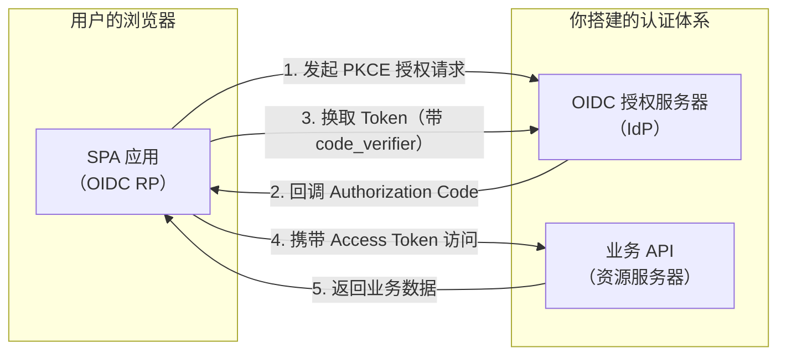
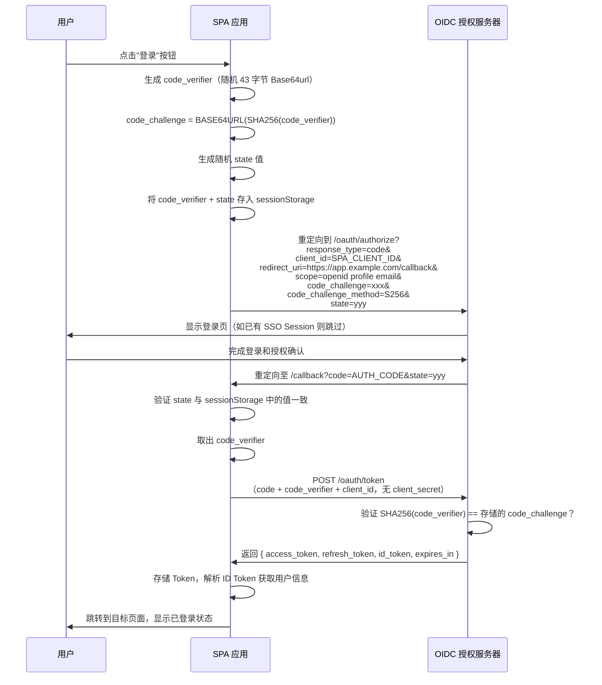
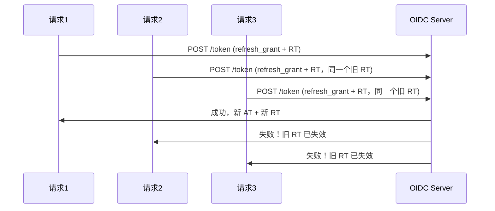

# SPA PKCE 授权码流程

## 本篇导读

### 核心目标

学完本篇后，你将能够：

- 理解 SPA（单页应用）作为 OIDC 依赖方（Relying Party）的完整架构
- 实现基于 PKCE 的授权码流程，保证公开客户端的安全性
- 掌握前端 Token 存储的三种方案及其安全权衡，并做出正确选择
- 实现 Access Token 的自动刷新机制，配合并发刷新防护

### 重点与难点

**重点**：

- SPA 为什么 **必须** 使用 PKCE——没有服务端就没有 `client_secret`，PKCE 是唯一的安全手段
- Token 存储的选择依据——内存存储 vs `localStorage` vs `sessionStorage`，各有什么代价
- Token 刷新的时机和并发控制——如何避免多个请求同时触发刷新导致的竞态条件

**难点**：

- Token 轮转（Refresh Token Rotation）在前端的处理——新旧 Refresh Token 的安全替换
- 多标签页同步的边界情况

## 纯前端模式的角色与定位

### SPA 作为 OIDC 依赖方

在我们搭建的整体认证架构中，SPA（Single Page Application）扮演的是 **OIDC 依赖方（Relying Party，简称 RP）** 的角色。



### 纯前端模式的本质约束

纯前端模式有一个根本性的约束：**所有代码对用户（或攻击者）可见**。

- JavaScript 代码，即使经过压缩和混淆，在浏览器的开发者工具里可以查看
- 写死在代码里的任何"秘密"（`client_secret`）都会被发现
- 浏览器本地存储（`localStorage`、`sessionStorage`、内存）对同源 JavaScript 完全可读

这个约束决定了：

- SPA 必须注册为 **公开客户端（Public Client）**，没有 `client_secret`
- 取而代之的是 PKCE（Proof Key for Code Exchange），用动态生成的密钥对代替静态的 `client_secret`
- Token 存储必须认真权衡安全风险

### 纯前端模式 vs BFF 模式

选择用哪种模式接入，取决于你的应用场景：

| 对比维度 | 纯前端模式（SPA） | BFF 模式 |
|---|---|---|
| 架构复杂度 | 低，无需专用后端中间层 | 高，需要维护 BFF 服务 |
| Token 安全性 | Token 在浏览器内存/存储中 | Token 只在服务端，前端不接触 |
| XSS 攻击影响 | XSS 可窃取 Token | XSS 无法窃取 Token（Cookie HttpOnly） |
| CSRF 防护 | 不使用 Cookie 携带 Token，天然免疫 CSRF | 需要主动防护 CSRF |
| 适用场景 | 对安全要求适中的工具类应用、内部系统 | 金融、医疗等高安全场景 |
| 静默刷新 | 需要 iframe 或轮询，有第三方 Cookie 限制 | 服务端自动完成，用户无感知 |

**本篇专注于纯前端模式**，BFF 模式在下一篇讲解。

## PKCE 授权码流程实现

### 完整流程时序



### PKCE 工具函数

首先实现 PKCE 所需的两个工具函数。Web Crypto API 是现代浏览器的内置 API，不需要额外依赖：

```typescript
// src/auth/pkce.ts

/**
 * 生成 code_verifier（43 字节随机 Base64url 字符串）
 * RFC 7636 规定长度范围是 43-128，推荐 43 字节
 */
export function generateCodeVerifier(): string {
  const bytes = new Uint8Array(43);
  crypto.getRandomValues(bytes);
  return base64UrlEncode(bytes);
}

/**
 * 由 code_verifier 生成 code_challenge（S256 方法）
 * code_challenge = BASE64URL(SHA256(ASCII(code_verifier)))
 */
export async function generateCodeChallenge(verifier: string): Promise<string> {
  const encoder = new TextEncoder();
  const data = encoder.encode(verifier);
  const digest = await crypto.subtle.digest('SHA-256', data);
  return base64UrlEncode(new Uint8Array(digest));
}

/**
 * 将 Uint8Array 编码为 Base64url（不含填充符 =）
 */
function base64UrlEncode(bytes: Uint8Array): string {
  const base64 = btoa(String.fromCharCode(...bytes));
  return base64.replace(/\+/g, '-').replace(/\//g, '_').replace(/=/g, '');
}

/**
 * 生成随机 state（用于 CSRF 防护）
 */
export function generateState(): string {
  const bytes = new Uint8Array(32);
  crypto.getRandomValues(bytes);
  return base64UrlEncode(bytes);
}
```

### 发起登录：构造授权 URL 并跳转

```typescript
// src/auth/auth.service.ts

const OIDC_CONFIG = {
  authorizeEndpoint: 'https://auth.example.com/oauth/authorize',
  tokenEndpoint: 'https://auth.example.com/oauth/token',
  clientId: 'spa-app-client-id', // 注册在 OIDC 服务器上的公开客户端 ID
  redirectUri: 'https://app.example.com/callback',
  scopes: ['openid', 'profile', 'email'],
};

export async function startLogin(returnTo?: string): Promise<void> {
  // 1. 生成 PKCE 参数
  const codeVerifier = generateCodeVerifier();
  const codeChallenge = await generateCodeChallenge(codeVerifier);

  // 2. 生成 state（CSRF 防护）
  //    state 中可以内嵌要返回的页面路径，登录完成后跳转回去
  const statePayload = {
    nonce: generateState(),
    returnTo: returnTo ?? window.location.pathname,
  };
  const state = btoa(JSON.stringify(statePayload));

  // 3. 将 code_verifier 和 state 存入 sessionStorage
  //    不用 localStorage：sessionStorage 在标签页关闭后自动清除，
  //    而且不会被其他标签页读取，降低泄露面
  sessionStorage.setItem('pkce_code_verifier', codeVerifier);
  sessionStorage.setItem('oauth_state', state);

  // 4. 构造授权 URL
  const params = new URLSearchParams({
    response_type: 'code',
    client_id: OIDC_CONFIG.clientId,
    redirect_uri: OIDC_CONFIG.redirectUri,
    scope: OIDC_CONFIG.scopes.join(' '),
    code_challenge: codeChallenge,
    code_challenge_method: 'S256',
    state,
  });

  const authorizeUrl = `${OIDC_CONFIG.authorizeEndpoint}?${params.toString()}`;

  // 5. 跳转到 OIDC 授权服务器
  window.location.href = authorizeUrl;
}
```

### 处理回调：验证 state 并换取 Token

```typescript
// src/auth/callback.ts

export async function handleCallback(): Promise<void> {
  const urlParams = new URLSearchParams(window.location.search);
  const code = urlParams.get('code');
  const returnedState = urlParams.get('state');
  const error = urlParams.get('error');
  const errorDescription = urlParams.get('error_description');

  // 处理授权服务器返回的错误
  if (error) {
    throw new AuthError(`Authorization failed: ${error} - ${errorDescription}`);
  }

  if (!code || !returnedState) {
    throw new AuthError('Missing code or state in callback');
  }

  // 1. 验证 state（CSRF 防护）
  const storedState = sessionStorage.getItem('oauth_state');
  if (!storedState || returnedState !== storedState) {
    throw new AuthError('State mismatch - possible CSRF attack');
  }

  // 2. 取出 code_verifier
  const codeVerifier = sessionStorage.getItem('pkce_code_verifier');
  if (!codeVerifier) {
    throw new AuthError('Missing code verifier');
  }

  // 3. 清除 sessionStorage 中的临时数据
  sessionStorage.removeItem('pkce_code_verifier');
  sessionStorage.removeItem('oauth_state');

  // 4. 用授权码换取 Token
  const tokenResponse = await exchangeCodeForTokens(code, codeVerifier);

  // 5. 存储 Token（见下一节）
  await tokenStore.save(tokenResponse);

  // 6. 解析 state 中的 returnTo，跳转回目标页面
  try {
    const statePayload = JSON.parse(atob(returnedState));
    window.history.replaceState({}, '', statePayload.returnTo ?? '/');
  } catch {
    window.history.replaceState({}, '', '/');
  }
}

async function exchangeCodeForTokens(
  code: string,
  codeVerifier: string
): Promise<TokenResponse> {
  const response = await fetch(OIDC_CONFIG.tokenEndpoint, {
    method: 'POST',
    headers: {
      'Content-Type': 'application/x-www-form-urlencoded',
    },
    body: new URLSearchParams({
      grant_type: 'authorization_code',
      code,
      client_id: OIDC_CONFIG.clientId,
      redirect_uri: OIDC_CONFIG.redirectUri,
      code_verifier: codeVerifier, // 不是 code_challenge，是原始的 verifier
      // 注意：公开客户端没有 client_secret
    }),
  });

  if (!response.ok) {
    const error = await response.json();
    throw new AuthError(`Token exchange failed: ${error.error_description}`);
  }

  return response.json() as Promise<TokenResponse>;
}

interface TokenResponse {
  access_token: string;
  refresh_token?: string;
  id_token: string;
  expires_in: number; // Access Token 过期秒数（通常 300-900 秒）
  token_type: 'Bearer';
}
```

## Token 存储策略

这是纯前端 OIDC 接入中争议最多、最需要深入理解的话题：**Token 存储在哪里？**

### 三种存储方案对比

#### 方案一：内存存储（JavaScript 变量）

Token 只存在于 JavaScript 变量中，不持久化到任何浏览器存储：

```typescript
// src/auth/token-store.ts

class MemoryTokenStore {
  private accessToken: string | null = null;
  private refreshToken: string | null = null;
  private idToken: string | null = null;
  private accessTokenExpiresAt: number = 0;

  save(response: TokenResponse): void {
    this.accessToken = response.access_token;
    this.refreshToken = response.refresh_token ?? null;
    this.idToken = response.id_token;
    // 提前 30 秒视为过期，留出刷新窗口
    this.accessTokenExpiresAt = Date.now() + (response.expires_in - 30) * 1000;
  }

  getAccessToken(): string | null {
    return this.accessToken;
  }

  getRefreshToken(): string | null {
    return this.refreshToken;
  }

  isAccessTokenExpired(): boolean {
    return Date.now() >= this.accessTokenExpiresAt;
  }

  clear(): void {
    this.accessToken = null;
    this.refreshToken = null;
    this.idToken = null;
    this.accessTokenExpiresAt = 0;
  }
}

export const tokenStore = new MemoryTokenStore();
```

**优点**：

- **最高安全性**：XSS 脚本无法通过 `localStorage.getItem()` 或 `document.cookie` 直接读取 Token
- Refresh Token 不持久化到磁盘，浏览器进程结束后即消失

**缺点**：

- **刷新页面丢失登录态**：用户按 F5 后，内存变量被清空，需要重新走完整登录流程
- **多标签页独立**：每个标签页独立维护一份内存，无法共享登录态

#### 方案二：localStorage 存储

```typescript
class LocalStorageTokenStore {
  private readonly KEYS = {
    ACCESS_TOKEN: 'auth_access_token',
    REFRESH_TOKEN: 'auth_refresh_token',
    ID_TOKEN: 'auth_id_token',
    EXPIRES_AT: 'auth_expires_at',
  };

  save(response: TokenResponse): void {
    localStorage.setItem(this.KEYS.ACCESS_TOKEN, response.access_token);
    if (response.refresh_token) {
      localStorage.setItem(this.KEYS.REFRESH_TOKEN, response.refresh_token);
    }
    localStorage.setItem(this.KEYS.ID_TOKEN, response.id_token);
    const expiresAt = Date.now() + (response.expires_in - 30) * 1000;
    localStorage.setItem(this.KEYS.EXPIRES_AT, String(expiresAt));
  }

  getAccessToken(): string | null {
    return localStorage.getItem(this.KEYS.ACCESS_TOKEN);
  }

  isAccessTokenExpired(): boolean {
    const expiresAt = Number(localStorage.getItem(this.KEYS.EXPIRES_AT) ?? 0);
    return Date.now() >= expiresAt;
  }

  clear(): void {
    Object.values(this.KEYS).forEach((key) => localStorage.removeItem(key));
  }
}
```

**优点**：

- **持久化**：刷新页面后登录态依然存在
- **多标签页共享**：所有同源标签页共享同一份 `localStorage`

**缺点**：

- **XSS 风险高**：任何通过 XSS 注入的脚本都能直接拿走 Token
- Refresh Token 存入 `localStorage` 尤为危险

#### 方案三：分级存储策略（推荐）

综合权衡，推荐的做法是：**Access Token 用内存，Refresh Token 视情况选择**。

```typescript
class HybridTokenStore {
  private accessToken: string | null = null;
  private accessTokenExpiresAt: number = 0;
  private idToken: string | null = null;
  private user: UserInfo | null = null;

  private readonly REFRESH_TOKEN_KEY = 'auth_refresh_token';
  private readonly REMEMBER_ME_KEY = 'auth_remember_me';

  save(response: TokenResponse, rememberMe = false): void {
    // Access Token 和 ID Token 只存内存
    this.accessToken = response.access_token;
    this.idToken = response.id_token;
    this.accessTokenExpiresAt = Date.now() + (response.expires_in - 30) * 1000;
    this.user = parseIdToken(response.id_token);

    // Refresh Token 根据 rememberMe 决定存储位置
    if (response.refresh_token) {
      if (rememberMe) {
        localStorage.setItem(this.REFRESH_TOKEN_KEY, response.refresh_token);
        localStorage.setItem(this.REMEMBER_ME_KEY, 'true');
      } else {
        sessionStorage.setItem(this.REFRESH_TOKEN_KEY, response.refresh_token);
      }
    }
  }

  getAccessToken(): string | null {
    return this.accessToken;
  }

  getRefreshToken(): string | null {
    return (
      sessionStorage.getItem(this.REFRESH_TOKEN_KEY) ??
      localStorage.getItem(this.REFRESH_TOKEN_KEY)
    );
  }

  isAccessTokenExpired(): boolean {
    if (!this.accessToken) return true;
    return Date.now() >= this.accessTokenExpiresAt;
  }

  getUser(): UserInfo | null {
    return this.user;
  }

  clear(): void {
    this.accessToken = null;
    this.accessTokenExpiresAt = 0;
    this.idToken = null;
    this.user = null;
    sessionStorage.removeItem(this.REFRESH_TOKEN_KEY);
    localStorage.removeItem(this.REFRESH_TOKEN_KEY);
    localStorage.removeItem(this.REMEMBER_ME_KEY);
  }
}

export const tokenStore = new HybridTokenStore();
```

### 解析 ID Token 获取用户信息

ID Token 是 JWT 格式，前端可以直接解析（不验签，因为通过 HTTPS 从 OIDC 服务器直接返回已有传输层保证）：

```typescript
interface IdTokenClaims {
  sub: string;       // 用户唯一 ID
  email: string;
  name: string;
  iat: number;      // Token 颁发时间（Unix 时间戳）
  exp: number;       // Token 过期时间
  iss: string;       // 颁发者（OIDC 服务器 URL）
  aud: string;       // 受众（你的 client_id）
}

function parseIdToken(idToken: string): UserInfo {
  const parts = idToken.split('.');
  if (parts.length !== 3) throw new Error('Invalid ID Token format');

  // Base64url 解码 payload
  const payload = parts[1];
  const padded = payload + '='.repeat((4 - (payload.length % 4)) % 4);
  const decoded = atob(padded.replace(/-/g, '+').replace(/_/g, '/'));
  const claims = JSON.parse(decoded) as IdTokenClaims;

  // 基本验证
  if (claims.iss !== OIDC_CONFIG.issuer) throw new Error('Invalid token issuer');
  if (claims.aud !== OIDC_CONFIG.clientId) throw new Error('Invalid token audience');
  if (claims.exp < Math.floor(Date.now() / 1000)) throw new Error('ID Token expired');

  return { id: claims.sub, email: claims.email, name: claims.name };
}
```

## Token 刷新管理

### Access Token 的过期处理

Access Token 通常有效期很短（5-15 分钟），在用户会话期间需要多次刷新。

**策略一：请求前检查（Proactive Refresh）**

```typescript
export async function authenticatedFetch(url: string, options: RequestInit = {}): Promise<Response> {
  if (tokenStore.isAccessTokenExpired()) {
    await refreshAccessToken();
  }

  const accessToken = tokenStore.getAccessToken();
  if (!accessToken) throw new AuthError('Not authenticated');

  return fetch(url, {
    ...options,
    headers: { ...options.headers, Authorization: `Bearer ${accessToken}` },
  });
}
```

**策略二：请求失败后重试（Reactive Refresh）**

```typescript
export async function authenticatedFetch(url: string, options: RequestInit = {}): Promise<Response> {
  const makeRequest = async (): Promise<Response> => {
    const accessToken = tokenStore.getAccessToken();
    return fetch(url, {
      ...options,
      headers: { ...options.headers, Authorization: `Bearer ${accessToken}` },
    });
  };

  let response = await makeRequest();

  if (response.status === 401) {
    try {
      await refreshAccessToken();
      response = await makeRequest();
    } catch {
      tokenStore.clear();
      throw new AuthError('Session expired, redirecting to login');
    }
  }

  return response;
}
```

### 并发刷新防护

当多个并发请求同时发现 Token 过期，如果不防护，它们会各自发起刷新请求：



**解决方案：刷新锁（Promise 复用）**：

```typescript
class TokenRefreshManager {
  private refreshPromise: Promise<void> | null = null;

  async refresh(): Promise<void> {
    if (this.refreshPromise) return this.refreshPromise;

    this.refreshPromise = this.doRefresh().finally(() => {
      this.refreshPromise = null;
    });

    return this.refreshPromise;
  }

  private async doRefresh(): Promise<void> {
    const refreshToken = tokenStore.getRefreshToken();
    if (!refreshToken) throw new AuthError('No refresh token');

    const response = await fetch(OIDC_CONFIG.tokenEndpoint, {
      method: 'POST',
      headers: { 'Content-Type': 'application/x-www-form-urlencoded' },
      body: new URLSearchParams({
        grant_type: 'refresh_token',
        refresh_token: refreshToken,
        client_id: OIDC_CONFIG.clientId,
      }),
    });

    if (!response.ok) {
      tokenStore.clear();
      throw new AuthError('Refresh token invalid');
    }

    const tokens: TokenResponse = await response.json();
    tokenStore.save(tokens);
  }
}

export const tokenRefreshManager = new TokenRefreshManager();
```

## 本篇小结

- **PKCE 是 SPA 的唯一安全手段**：用动态 `code_verifier` 替代静态 `client_secret`
- **分级存储**：Access Token 存内存（快但刷新页面丢失），Refresh Token 持久化需权衡 XSS 风险
- **并发刷新锁**：通过 Promise 复用防止多个请求同时刷新导致 Refresh Token 失效

下一篇我们将讨论更复杂的静默认证、多标签页同步，以及当纯前端模式不满足安全需求时的 BFF 方案。
