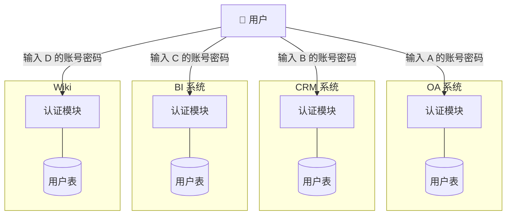
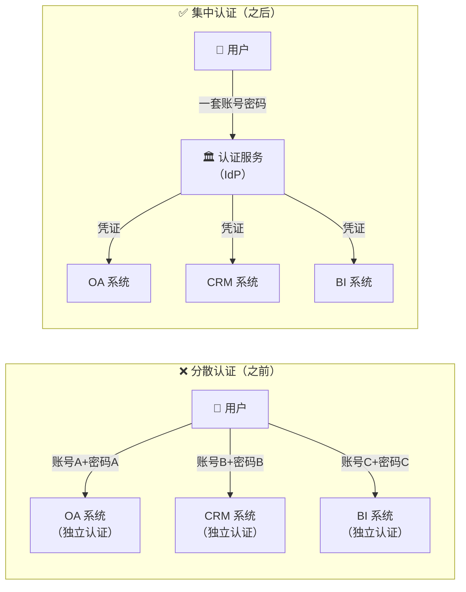
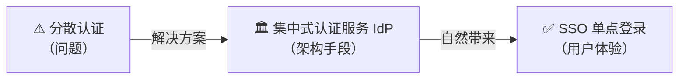
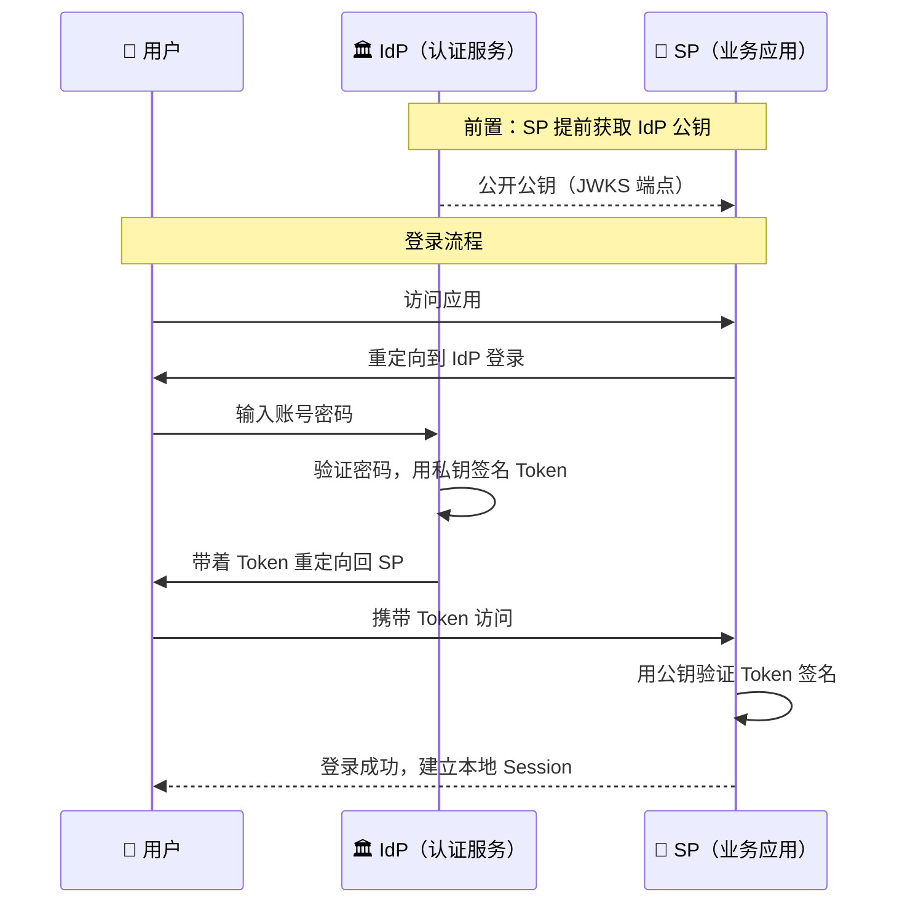
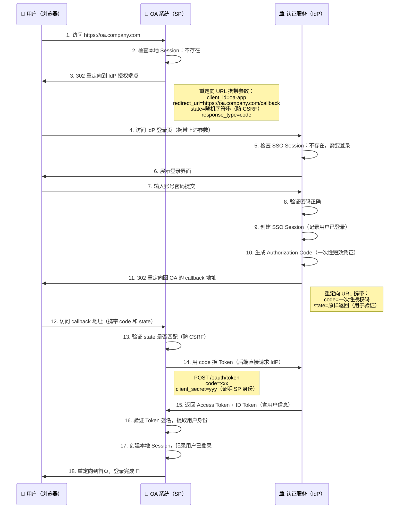
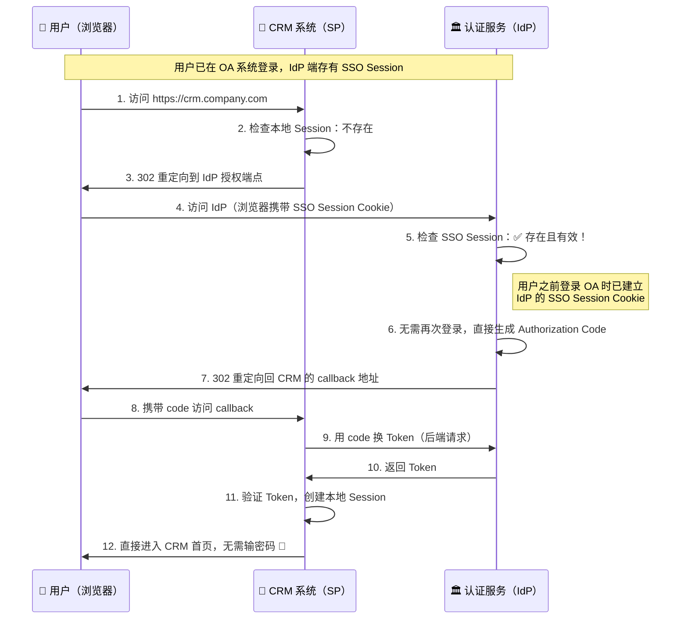
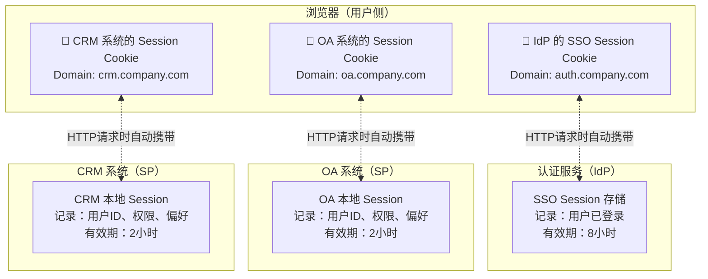
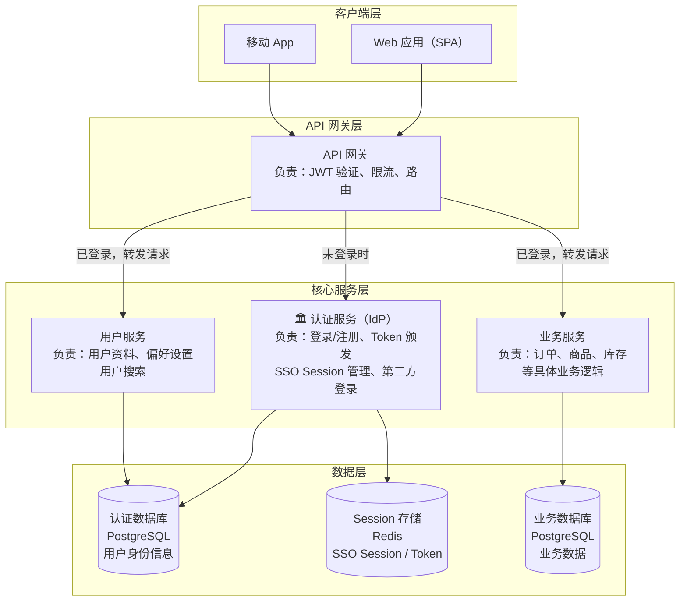
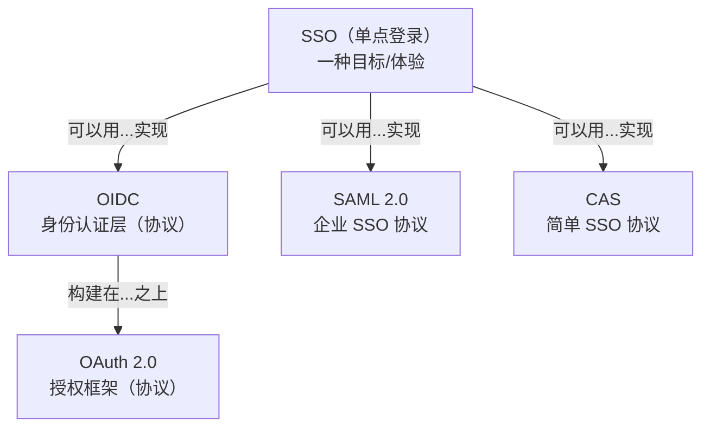
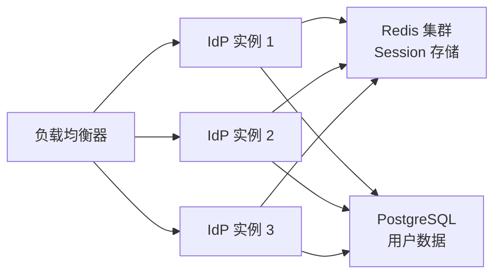

# SSO 与集中式认证服务

## 本篇导读

### 核心目标

学完本篇后，你将能够：

- 理解多系统场景下分散认证带来的问题，以及 SSO 是如何解决这些问题的
- 掌握 **IdP（身份提供者）** 和 **SP（服务提供者）** 的角色定义与信任关系
- 深入理解 SSO 的核心工作原理：用户登录一次后，其他应用是如何感知到"已登录"状态的
- 了解主流 SSO 实现协议（SAML、CAS、OIDC）的差异，以及本教程为何选择 OIDC
- 清楚集中式认证服务的职责边界——什么该做，什么不该做
- 理解本系列教程将构建的整体架构
- 理解集中式认证服务与 SSO 的层次关系：集中式认证服务是实现 SSO 的 **架构前提**，SSO 是它带来的核心用户体验

### 重点与难点

**重点**：

- IdP 和 SP 的职责划分，以及两者如何通过"凭证"建立信任
- SSO Session（存在 IdP 端）和各应用本地 Session 的区别与关系
- 认证服务的边界：认证服务只回答"你是谁"，不参与"你能做什么"

**难点**：

- SSO 的状态管理——"登录一次"是如何让多个独立应用都知道你已登录的？
- 重定向流程中各方如何防止中间人篡改？
- 集中式认证服务在微服务架构中应该承担多少职责？

## 一个类比：大学一卡通

想象你进入一所大学：

在大学里，每个场所原本都有独立的门禁：图书馆有图书馆的门禁卡，体育馆有体育馆的门禁卡，食堂有食堂的刷卡机，宿舍有宿舍的磁卡……你每到一处都要掏出不同的卡，不同的卡丢失了还要分别补办，管理员也要在不同系统里分别维护你的身份信息。

这就是 **分散认证** 的现状。

后来学校引入了 **一卡通系统**：只需在注册时去学生处办一张卡，绑定你的学籍信息。之后进图书馆、进体育馆、在食堂消费，统统刷这一张卡。各个场所不再自己维护一套身份数据，而是统一向学生处核验身份。你只需记住一张卡，各场所也不需要关心"这个人是谁"——它们只需信任学生处说的"这个人是在校学生"即可。

这就是 **单点登录（SSO）** 的本质：

- **学生处（负责发卡的机构）** = **IdP（身份提供者）**
- **图书馆、体育馆、食堂（各个使用卡的场所）** = **SP（服务提供者）**
- **你的一卡通** = **SSO 发放的凭证（Token）**
- **你刷卡进门** = **应用验证凭证后建立本地 Session**

## 核心概念讲解

### 多系统认证的痛点

在理解 SSO 之前，先来看看没有 SSO 时，企业面临什么问题。

假设一家公司有以下几个内部系统：

- **OA 系统**：处理审批、请假、报销
- **CRM 系统**：管理客户、销售线索
- **BI 系统**：数据报表和分析
- **Wiki**：内部知识库

在传统的多系统架构下，每个系统都独立维护自己的用户账号：



这种架构带来了一系列痛点：

**用户体验痛点**

员工每天需要在不同系统之间切换，每次切换都要重新登录。一个人可能需要记住 4 套账号密码。当他在 OA 系统审批完一份文件，打开 CRM 系统时又要输一次密码——这不只是烦人，还严重打断了工作流。

**安全风险**

密码分散管理带来多重安全隐患：

- 员工为了好记，在所有系统使用同一个弱密码
- 某个安全性较低的系统（比如老旧的 Wiki）被攻破，可能导致其他系统的密码也一起泄露（如果密码相同）
- 员工离职时，IT 管理员需要逐一在每个系统里删除账号，容易遗漏
- 各系统的密码存储质量参差不齐——有的系统可能还在用明文存密码

**运维成本**

- 每个系统都要独立维护一套注册/登录/找回密码的逻辑
- 新建一个系统就要重复开发一套认证代码
- 用户信息修改（如改手机号）要在多个系统分别操作
- 无法统一的安全策略（比如要求全公司强制开启双因素认证）

**对比图：分散认证 vs 集中认证**



### 什么是单点登录（SSO）

**定义**：单点登录（Single Sign-On，SSO）是一种认证机制，允许用户使用一套凭据（账号密码）登录，即可访问多个相互信任的系统，而无需在每个系统中单独登录。

**核心特性**：

- **一次登录，多处访问**：用户在 IdP 处认证一次后，访问任何受信任的 SP 都无需再次输入密码
- **统一身份**：所有应用共享同一套用户身份，用户信息只需维护一处
- **统一登出**：在任一应用退出登录，可选择同时登出所有已登录的应用（单点登出 SLO）
- **统一安全策略**：可以在 IdP 集中配置密码强度要求、MFA、账号锁定策略等

**SSO 和"记住密码"的区别**

很多人第一次听到 SSO 时会有疑问："这不就是浏览器的'记住密码'功能吗？"

完全不同：

| 维度       | 记住密码                       | SSO                                         |
| ---------- | ------------------------------ | ------------------------------------------- |
| 本质       | 浏览器帮你自动填写密码         | 认证中心直接告诉应用"这个用户已登录"        |
| 需要登录吗 | 需要，只是自动填密码后帮你提交 | 不需要，直接跳过登录界面                    |
| 跨设备     | 不可以（密码存在当前浏览器）   | 可以（只需在任意设备登录一次 IdP）          |
| 安全性     | 密码暴露在浏览器存储中，有风险 | 密码只发送给 IdP 一次，各应用不知道用户密码 |
| 统一管理   | 无法统一管理                   | 管理员可以一键禁用账号，所有应用立即生效    |

### 集中式认证：SSO 的架构前提

理解了 SSO 的定义之后，有一个问题值得单独说清楚：集中式认证服务和 SSO，是同一回事吗？**不完全是**。它们是两个层次的概念：

- **集中式认证服务**：一种 **架构方案**——把分散在各应用中的认证职责，统一剥离到一个独立的可信中心（IdP）
- **SSO（单点登录）**：一种 **用户体验目标**——用户登录一次，即可访问所有关联的应用，无需重复输入密码

两者的关系是 **因果关系**，而非等价关系：集中式认证服务是 SSO 得以实现的架构前提。

**为什么这么说？**

分散认证的根本问题在于——各应用之间没有"共同认可的权威"，所以它们的登录状态天然无法共享。你在 OA 系统登录了，CRM 系统根本不知道，因为两者是完全独立的系统，没有任何信任关系。

集中式认证改变了这一点：所有应用把认证这件事都"外包"给同一个 IdP。既然所有人都信任同一个中心，那么当这个中心说"这个用户已经验证通过了"，每个应用都可以接受这个结论—— **SSO 就是这个信任共享自然带来的结果**。

类比一下：ATM 机联网之前，工商银行的卡只能在工商银行的 ATM 上用；联网之后（建立了统一的银行间清算中心），任何 ATM 都能使用任何银行的卡。联网清算中心是 **架构手段**，"插哪台 ATM 都能用"是 **用户体验**。没有统一的清算中心，跨行取款就是一句空话。



因此，本教程标题将两者并列，是有意为之：**集中式认证服务** 描述的是我们要构建什么，**SSO** 描述的是它能为用户带来什么价值。至于认证服务的具体职责边界——哪些事该做，哪些不该做——后文将单独一节详细讨论。

### IdP 与 SP：认证生态的两个核心角色

SSO 架构中有两个关键角色，理解它们是理解 SSO 的前提。

#### IdP（Identity Provider，身份提供者）

**定义**：IdP 是负责验证用户身份并颁发凭证的中心服务。它是整个 SSO 体系的核心，所有应用都依赖它来确认用户身份。

**职责**：

- 维护用户账号信息（用户名、密码哈希、邮箱等）
- 验证用户提交的凭据（密码、一次性验证码、生物特征等）
- 管理 SSO Session（记录用户在 IdP 侧的登录状态）
- 向 SP 颁发可信凭证（如 JWT 格式的 ID Token）
- 提供标准端点（授权端点、Token 端点、用户信息端点等）

**类比**：公安局。你拿着身份证（凭证）到任何地方，对方都可以信任"公安局认证过这个人的身份"，而不需要对方自己去验证你是不是真实存在的人。

**常见的 IdP**：

- **第三方公共 IdP**：Google、GitHub、微信开放平台、企业微信、Apple ID
- **企业自建 IdP**：Keycloak（开源）、Auth0（SaaS）、Okta（SaaS）、本教程将要构建的认证服务

#### SP（Service Provider，服务提供者）

**定义**：SP 是依赖 IdP 进行用户认证的各个应用。SP 自己不验证用户密码，而是把认证工作委托给 IdP，然后根据 IdP 颁发的凭证决定是否允许用户登录。

**职责**：

- 检测用户是否已有本地 Session（是否已登录）
- 若未登录，将用户重定向到 IdP 的登录页
- 接收 IdP 返回的凭证，并向 IdP 验证凭证的真实性
- 根据凭证中的用户信息，建立本地 Session
- 处理本地的授权逻辑（用户在这个应用里能做什么）

**类比**：需要查验身份证的各类机构（银行、医院、酒店）。它们不自己签发身份证，而是信任公安局签发的证件，并在自己的系统里记录"张三今天来办理过业务"。

**常见的 SP**：你们公司的 OA、CRM、BI、Wiki——任何需要用户登录的应用，都可以成为 SP。

#### IdP 与 SP 的信任关系

SP 如何信任 IdP 发出的凭证？这是 SSO 的关键问题。

**类比**：身份证上有防伪水印，银行柜员看到这个水印就知道这是真实的政府签发的证件，而不是伪造的。

在数字世界，这个"防伪水印"就是 **数字签名**：

1. IdP 持有一对密钥：**私钥**（绝密保存）和 **公钥**（公开分发给所有 SP）
2. IdP 颁发凭证时，用私钥对凭证内容进行签名
3. SP 收到凭证后，用 IdP 的公钥验证签名的真实性
4. 如果签名验证通过，SP 就可以信任凭证中的用户信息

这样，即使攻击者截获了凭证，也无法伪造一个新的有效凭证，因为他没有 IdP 的私钥。



### SSO 的工作原理

这是本篇的核心部分。很多人知道 SSO 的效果（"只需登录一次"），但不清楚背后的机制。下面我们用两个场景来拆解。

#### 场景一：用户第一次登录

假设用户早上打开电脑，第一次访问 OA 系统。

**整体思路**：

OA 系统（SP）发现用户没有本地 Session，于是把用户"推给" IdP 去登录。用户在 IdP 完成登录后，IdP 颁发一个凭证，然后把用户"带着凭证"重定向回 OA 系统。OA 系统验证凭证有效后，为用户建立本地 Session，登录完成。



**关键步骤解析**：

**步骤 3：为什么要用重定向？**

OA 系统不能直接向 IdP 发送用户的账号密码，因为 OA 系统不该知道用户密码——密码只应该在用户和 IdP 之间传递。重定向让用户的浏览器直接与 IdP 通信，OA 系统只是"介绍人"。

**步骤 10：Authorization Code 是什么？**

授权码（Authorization Code）是一个短效的、一次性使用的随机字符串。它本身不包含用户信息，只是一张"凭条"——OA 系统拿着这张凭条，可以到 IdP 处换取真正的 Token。

为什么不直接在重定向 URL 里带 Token？因为重定向 URL 会出现在浏览器地址栏和历史记录里，如果 Token 直接暴露在 URL 中会有安全风险。授权码即使被截获，也无法单独使用（还需要 client_secret）。

**步骤 14：后端直接请求（Back-channel 通信）**

OA 系统的**后端服务器**直接向 IdP 请求 Token，这条通信不经过用户浏览器，称为"Back-channel"。这比在浏览器中传递 Token 安全得多，因为攻击者无法通过截获浏览器流量获取 Token。

#### 场景二：用户访问第二个应用（SSO 的核心体验）

用户在 OA 系统登录后，打开新标签页访问 CRM 系统。这时候，用户不需要再次输入密码——这就是 SSO 的魔力。



**关键机制：SSO Session Cookie**

步骤 4 是整个流程的关键。当用户的浏览器访问 IdP 时，会自动携带之前登录时 IdP 设置的 **SSO Session Cookie**。IdP 通过这个 Cookie 识别出"这个浏览器的用户之前已经登录过了"，于是跳过登录界面，直接颁发凭证。

这就是"单点登录"的底层机制：**SSO Session 存在 IdP 端（通过 Cookie 维持），各个应用（SP）各自维护自己的本地 Session。**

#### SSO Session 与应用本地 Session 的关系

这是最容易混淆的地方，务必搞清楚：



| 维度     | SSO Session（IdP 端）            | 本地 Session（SP 端）             |
| -------- | -------------------------------- | --------------------------------- |
| 存储位置 | IdP 服务器（Redis）              | 各个 SP 服务器                    |
| 作用     | 记录用户在 IdP 处已认证          | 记录用户在该应用中已登录          |
| Cookie   | IdP 域名下的 Cookie              | SP 各自域名下的 Cookie            |
| 生命周期 | 通常较长（如 8 小时）            | 通常较短（如 2 小时）             |
| 销毁时机 | 用户在 IdP 登出，或 Session 过期 | 用户在该 SP 登出，或 Session 过期 |
| 跨应用   | 被所有 SP 共享使用               | 仅在当前 SP 内有效                |

**一个常见的误解**：

有人认为"SSO Session 过期后，各应用的本地 Session 也会立即失效"。这是不对的。各应用的本地 Session 是独立的，SSO Session 过期只意味着用户无法再通过 IdP 进行免密登录，但已经建立的本地 Session 依然有效，直到它自己过期为止。

这也是单点登出（Single Logout）复杂的原因——需要主动通知每个 SP 销毁本地 Session。

### SSO 的主流实现协议

SSO 是一种概念，有多种具体的实现协议。了解这些协议有助于你在不同场景做出正确选择。

#### SAML 2.0（Security Assertion Markup Language）

SAML 是 2005 年推出的 SSO 标准，主要在企业环境中使用。

**特点**：

- 基于 XML 格式，结构复杂，可读性差
- IdP 主动将用户信息"推送"给 SP（IdP-initiated 模式）
- 也支持 SP 发起的流程（SP-initiated 模式）
- 通过 XML 数字签名保证安全性
- 非常成熟，广泛支持（Salesforce、Office 365、SAP 等企业软件都支持）

**适用场景**：企业级内部系统集成，对接老旧的企业软件（ERP、OA 等）

**缺点**：

- XML 解析开销大
- 调试困难（Base64 编码的 XML 不易阅读）
- 对移动端和 SPA 不友好（依赖浏览器重定向和表单提交）

#### CAS（Central Authentication Service）

CAS 是耶鲁大学开发的开源 SSO 协议，在高校和部分企业中广泛使用。

**特点**：

- 协议相对简单，易于理解和实现
- 通过 Service Ticket（服务票据）实现 SSO
- 有专门的 CAS 服务器实现（Apereo CAS）

**适用场景**：学校信息系统、相对简单的企业内网 SSO

**缺点**：

- 生态相对封闭，不如 OAuth 2.0/OIDC 广泛
- 扩展性不如 OIDC 灵活
- 在互联网应用中较少见

#### OAuth 2.0 + OIDC（本教程采用）

OAuth 2.0 是一个 **授权框架**，定义了如何安全地将资源访问权限委托给第三方。OpenID Connect（OIDC）是构建在 OAuth 2.0 之上的 **认证层**，增加了身份信息的标准化传递。

**特点**：

- 基于 JSON/JWT，轻量易读，开发者友好
- 原生支持移动端和 SPA
- 生态极其丰富（几乎所有主流语言都有成熟的库）
- 支持多种授权模式（授权码模式、PKCE 等）
- 标准化程度高（ID Token、UserInfo 端点、Discovery Document）

**适用场景**：互联网应用、移动 App、SPA、需要第三方登录的系统

**三种协议对比**：

| 维度       | SAML 2.0           | CAS                | OAuth 2.0 + OIDC     |
| ---------- | ------------------ | ------------------ | -------------------- |
| 数据格式   | XML                | 自定义（文本/XML） | JSON / JWT           |
| 成熟度     | 非常成熟（2005年） | 成熟（1990年代）   | 成熟且活跃发展       |
| 移动端支持 | 较差               | 一般               | 优秀                 |
| SPA 支持   | 较差               | 一般               | 优秀（PKCE）         |
| 生态丰富度 | 企业软件生态       | 高校/特定企业      | 互联网生态（最丰富） |
| 调试难度   | 高（XML 不易读）   | 中                 | 低（JWT 可解码）     |
| 第三方登录 | 不常见             | 不支持             | 原生支持             |
| 典型应用   | Salesforce、SAP    | 高校系统           | Google、GitHub、微信 |

**为什么本教程选择 OIDC？**

- 我们要支持多种第三方登录（Google、GitHub、微信），这些都是基于 OAuth 2.0 的
- 目标受众主要是互联网开发者，OIDC 是行业主流
- NestJS 生态中 Passport.js 对 OIDC 有完善的支持
- JSON/JWT 格式对 TypeScript 开发者更友好
- 移动端和 SPA 场景下的体验更好

### 集中式认证服务的职责边界

明确认证服务的边界，对整个系统设计至关重要。很多团队在实践中会把越来越多的功能塞进认证服务，最终让它变成一个"大泥球"。

#### 认证服务应该做什么

**核心职责**：

- **用户身份认证**：验证用户提交的凭据（密码、OTP、生物特征等），确认"你是谁"
- **SSO Session 管理**：维护用户在 IdP 侧的登录状态，支持免密访问其他 SP
- **Token 颁发与管理**：生成 Access Token、ID Token、Refresh Token，并维护其生命周期
- **第三方身份联合**：作为 SP 接入 Google、GitHub、微信等第三方 IdP，统一身份
- **基础用户信息存储**：存储认证必要的信息（用户ID、邮箱、密码哈希、手机号等）
- **标准协议端点**：提供 `/oauth/authorize`、`/oauth/token`、`/userinfo`、`/.well-known/openid-configuration` 等标准端点

**可选职责**（视系统规模决定是否放在认证服务中）：

- **MFA 管理**：TOTP 绑定、恢复码管理
- **审计日志**：记录登录/登出/密码修改等安全事件

#### 认证服务不应该做什么

这是很多团队会犯的错误：把以下功能也放进认证服务。

**业务逻辑**：认证服务不应该知道"用户下了什么订单"或"用户的积分是多少"。这些是业务服务的职责。

**授权决策**：认证服务只负责证明"你是张三"，但"张三能不能查看这份报告"是 SP 自己的事情。认证服务可以在 Token 中声明用户的基本角色（如 `admin`、`user`），但具体的权限检查应该在各个 SP 中完成。

**复杂用户偏好**：用户的界面主题设置、通知偏好、个性化配置等，应该由各业务系统或专门的用户偏好服务管理，不应该堆积在认证服务里。

**发送业务通知**：认证服务只需要发送认证相关的通知（如"你的账号在新设备登录"），不应该发送业务通知（如"你的订单已发货"）。

#### 认证服务与周边服务的关系



**关键设计原则**：

- **认证服务是"身份核心"，不是"万能服务"**
- API 网关负责验证 Token 的有效性（签名、过期），不需要每次都请求认证服务
- 各业务服务信任 API 网关传递的用户身份信息，自行处理授权逻辑
- 认证服务和用户服务可以共享同一个数据库，但应该有清晰的模块边界

## 常见问题与解决方案

### SSO 和 OAuth 2.0 是同一回事吗？

这是最常见的混淆，需要分层来理解：

**OAuth 2.0** 是一个 **授权框架**，解决的问题是"如何安全地将资源访问权限授予第三方"。它的核心用例是：你授权某 App 访问你的 Google Drive 文件，而不需要把 Google 密码告诉这个 App。OAuth 2.0 本身不定义"身份认证"，它定义的是"权限委托"。

**OIDC（OpenID Connect）** 是在 OAuth 2.0 基础上增加了一层"身份认证"语义。它在 OAuth 2.0 的 Token 之外，增加了 **ID Token**（一个包含用户身份信息的 JWT），并定义了 `/userinfo` 端点和 Discovery 文档（`/.well-known/openid-configuration`）。简单说：**OIDC = OAuth 2.0 + 身份信息标准化**。

**SSO** 是一种 **用户体验目标**（"登录一次，访问多处"），不是一个具体协议。SAML、CAS、OIDC 都是实现 SSO 的手段。

关系图：



### IdP 服务挂了，所有应用都用不了吗？

**是的，这是 SSO 最大的架构风险**：IdP 成为了整个系统的单点故障。

**已登录用户的影响**：如果用户在 SP 端已经建立了本地 Session，IdP 故障不会立即影响他们——他们可以继续使用已登录的应用，直到本地 Session 过期。

**未登录用户的影响**：任何需要重新登录的操作（新用户登录、Session 过期后续期）都会失败。

**生产环境高可用方案**：

- **多实例部署**：至少部署 2-3 个 IdP 实例，通过负载均衡分流
- **Session 外置**：将 SSO Session 存储在 Redis 集群（而非内存），实例故障不影响 Session 数据
- **JWT 公钥缓存**：SP 在本地缓存 IdP 的公钥（有效期内可以自行验证 JWT），减少对 IdP 的实时依赖
- **熔断降级**：在 IdP 不可用时，给用户友好的错误提示，而不是超时等待



### 不同的业务系统能有不同的认证策略吗？

可以，这是 OIDC 的优雅之处。每个 SP 在 IdP 注册时，可以配置不同的策略：

- **内部管理系统**：要求 MFA，Session 有效期 8 小时
- **面向用户的 SPA**：不强制 MFA，Session 有效期 30 天
- **高安全业务（如财务系统）**：每次访问都要求重新认证（`prompt=login`）

实现方式：SP 在发起授权请求时，可以通过参数指定需求（如 `acr_values` 指定认证强度），IdP 根据这些参数决定是否需要额外验证步骤。

### 用户在一个应用退出，其他应用会自动退出吗？

这取决于是否实现了 **单点登出（SLO，Single Logout）**。

SLO 有两种实现模式：

**Front-Channel Logout**：IdP 通过浏览器（重定向或 iframe）通知各 SP 登出。实现简单，但要求用户浏览器能访问所有 SP。

**Back-Channel Logout**：IdP 直接向各 SP 的后端发送 HTTP 请求通知登出。不依赖浏览器，更可靠，但 SP 需要暴露专门的 Logout 端点。

**没有 SLO 时会发生什么？**

用户在 IdP 退出（销毁 SSO Session），但各 SP 的本地 Session 依然有效。用户在 OA 系统退出，CRM 系统依然是登录状态，直到 CRM 的本地 Session 自然过期。对于高安全需求的系统，这是不可接受的，必须实现 Back-Channel SLO。

### 集中式认证服务和 SSO 是同一回事吗？

不是。它们是不同层次的概念，关系是"手段与目标"：

| 维度     | 集中式认证服务                     | SSO（单点登录）                      |
| -------- | ---------------------------------- | ------------------------------------ |
| 是什么   | 一种 **架构方案**                  | 一种 **用户体验目标**                |
| 解决什么 | 分散认证带来的安全漏洞与运维成本   | 用户需要重复登录的体验问题           |
| 实现层次 | 系统结构层面（服务如何部署与信任） | 应用交互体验层面（用户感知到的行为） |
| 依赖关系 | SSO 的架构前提                     | 依赖集中式认证服务才能实现           |
| 举例     | 本教程构建的 IdP 服务              | 登录 OA 后免密访问 CRM               |

**类比**："高速公路网络"（基础设施）和"长途自驾畅通无阻"（出行体验）的关系。没有统一的高速公路网络，跨省无缝行驶就做不到；但高速公路的价值远不止于此——它同时带来了统一的安全标准、收费管理、应急响应等能力。这对应集中式认证在 SSO 之外的价值：统一的安全策略、MFA、审计日志、单点登出等。

**一句话总结**：集中式认证服务是手段，SSO 是该手段带来的核心用户体验之一。本教程标题将两者并列，正是因为一个描述"我们构建什么"，另一个描述"它能做什么"。

## 本篇小结

### 核心要点

**1. SSO 解决的核心问题**

多系统分散认证带来用户体验差、安全风险高、运维成本大三个问题。SSO 通过集中化认证，让用户"登录一次，访问所有"。

**2. IdP 与 SP 的职责分工**

- IdP（身份提供者）：唯一负责验证用户身份、颁发凭证的权威服务
- SP（服务提供者）：信任 IdP 颁发的凭证，自行管理本地 Session 和授权逻辑
- 信任机制：基于数字签名（公私钥对），SP 用公钥验证凭证真实性

**3. SSO 工作原理的核心**

- 第一次登录：用户在 IdP 输入密码，IdP 创建 SSO Session（通过 Cookie 维持），颁发 Authorization Code，SP 用 Code 换 Token，建立本地 Session
- 第二次访问（免密）：浏览器自动携带 IdP 的 SSO Session Cookie，IdP 识别已登录，直接颁发凭证，无需再次输密码
- **关键点**：SSO Session 存在 IdP 端，各 SP 有各自独立的本地 Session

**4. 协议选择**

本教程选择 OAuth 2.0 + OIDC，因为它是互联网主流，对移动端和 SPA 友好，生态最丰富，且原生支持第三方登录集成。

**5. 认证服务的边界**

认证服务只回答"你是谁"，不参与"你能做什么"。避免将业务逻辑、授权决策、用户偏好等功能塞入认证服务，保持认证服务的专注性和可维护性。

### 下章预告

下一篇我们将深入讲解 **密码安全基础**：用户注册时，密码应该如何存储？为什么不能直接存明文密码，甚至不能存 MD5 哈希？什么是"加盐"？Bcrypt 和 Argon2 哪个更安全？这些知识将直接影响你设计用户注册/登录系统的方式，是构建认证服务不可跳过的基础。

## 踩坑记录

### 坑1：把 SSO Session 和应用本地 Session 混为一谈

**症状**：开发者认为"用户在 IdP 登出就等于在所有应用登出"，没有实现 SLO。

**后果**：用户在 IdP 点击"退出登录"，但各 SP 的本地 Session 仍然有效。攻击者获取到 SP 的 Session Cookie 后，即使用户已在 IdP 注销，依然可以访问各个 SP——直到本地 Session 自然过期。

**对策**：

- 对安全要求高的系统，必须实现 Back-Channel SLO
- SP 本地 Session 的有效期不应太长（建议不超过 2 小时）
- 提供"退出所有设备"功能，主动撤销 Refresh Token

### 坑2：认证服务承担了过多业务逻辑

**症状**：认证服务中出现了订单查询接口、消息通知逻辑、用户积分接口……

**后果**：

- 认证服务成为性能瓶颈（所有请求都经过它）
- 认证服务的改动会影响业务功能，测试复杂度上升
- 认证服务无法独立扩缩容

**对策**：严格遵守认证服务的边界。判断标准：这个功能是否与"验证用户身份"直接相关？如果不是，就不应该在认证服务中。

### 坑3：忽视 IdP 的单点故障风险

**症状**：IdP 只部署单实例，没有高可用方案。

**后果**：IdP 所在服务器故障，导致所有应用的新用户登录请求全部失败，即使各应用本身运行正常。

**对策**：

- 生产环境最少 2 个 IdP 实例，负载均衡配置健康检查
- Session 存储在 Redis 集群，而非 IdP 内存
- SP 在本地缓存 IdP 公钥，减少对 IdP 的实时依赖
- 监控 IdP 的响应时间和错误率，设置告警

### 坑4：Redirect URI 校验不严，导致开放重定向漏洞

**症状**：IdP 在验证 SP 的 Redirect URI 时，使用了模糊匹配（如只验证域名前缀），而非精确匹配。

**后果**：攻击者构造一个恶意的 `redirect_uri`（如 `https://oa.company.com.evil.com/callback`），骗取 IdP 将 Authorization Code 发送到攻击者控制的地址。攻击者拿到 Code 后，可以使用 OA 系统注册的 `client_secret` 换取 Token，完全冒充受害用户。

**对策**：

```plaintext
❌ 错误：只验证域名前缀
redirect_uri.startsWith("https://oa.company.com")  // 被 oa.company.com.evil.com 绕过

✅ 正确：精确匹配白名单
const allowedUris = ["https://oa.company.com/auth/callback"];
allowedUris.includes(redirect_uri)  // 完全匹配
```

每个 SP 在 IdP 注册时，必须提前登记允许的 Redirect URI 白名单，IdP 只接受完全匹配的 URI。

### 坑5：认为"用了 SSO 就不需要各应用管 Session"

**症状**：SP 接入 SSO 后，不在本地建立 Session，而是每次请求都向 IdP 验证 Token。

**后果**：

- IdP 承受远超预期的请求量（每个 API 请求都打到 IdP）
- 响应延迟增加（多了一次网络请求）
- IdP 一旦故障，所有应用的所有请求都受影响

**对策**：

- SP 应该在本地建立 Session（或缓存验证通过的 JWT 信息），避免每次都询问 IdP
- JWT 的设计初衷就是"无状态验证"——SP 用 IdP 的公钥本地验证签名即可，不需要回调 IdP
- 只有 Refresh Token 续期、Token 吊销等操作才需要联系 IdP
