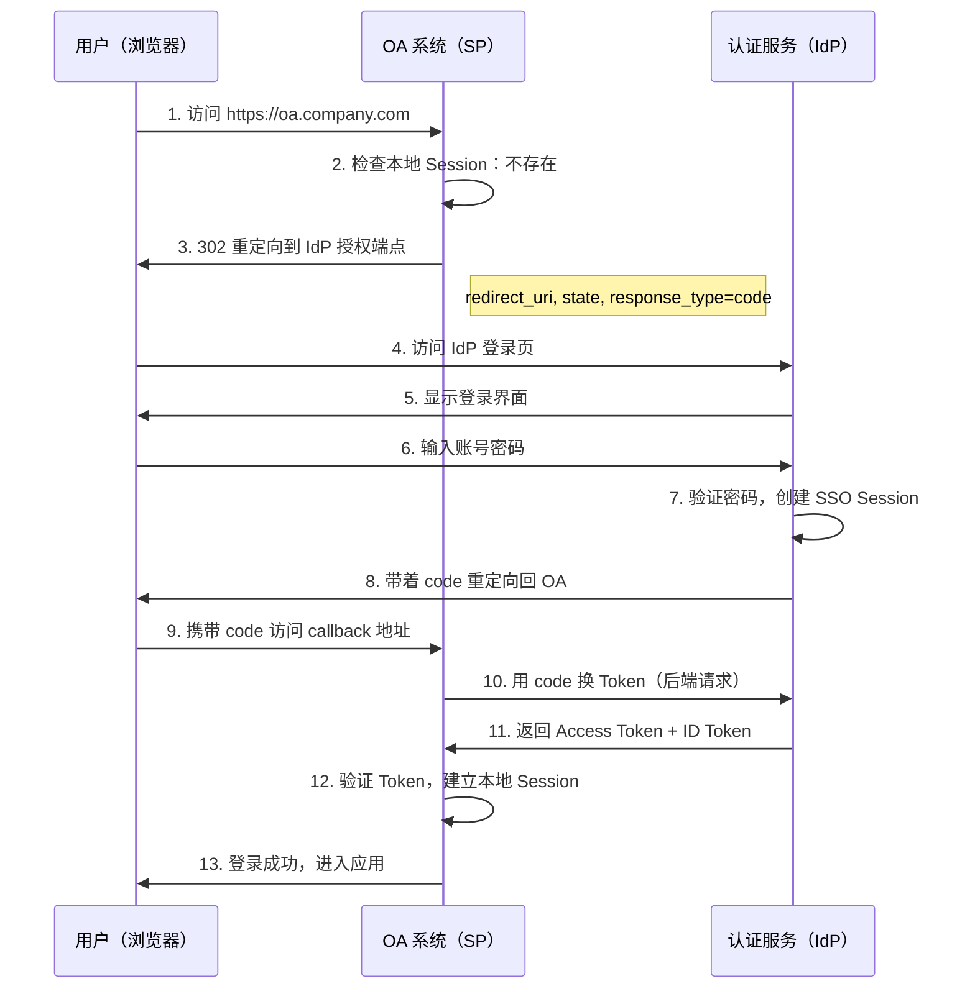
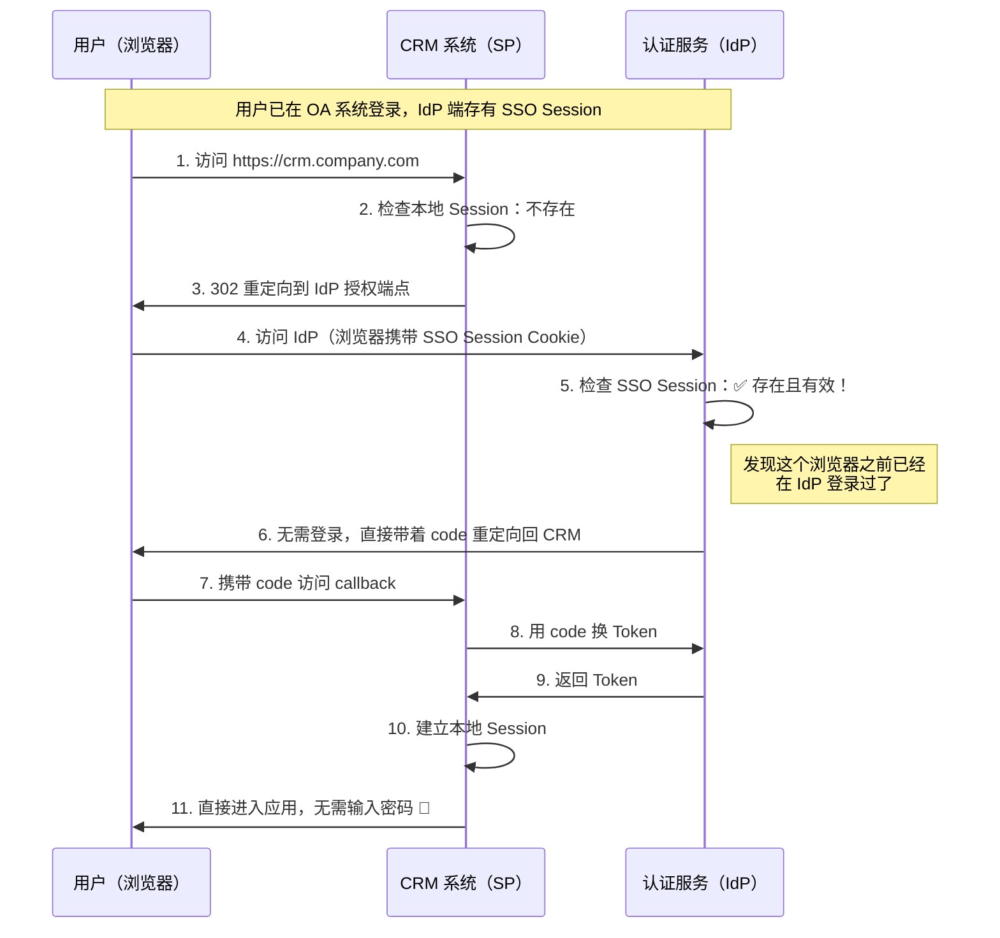
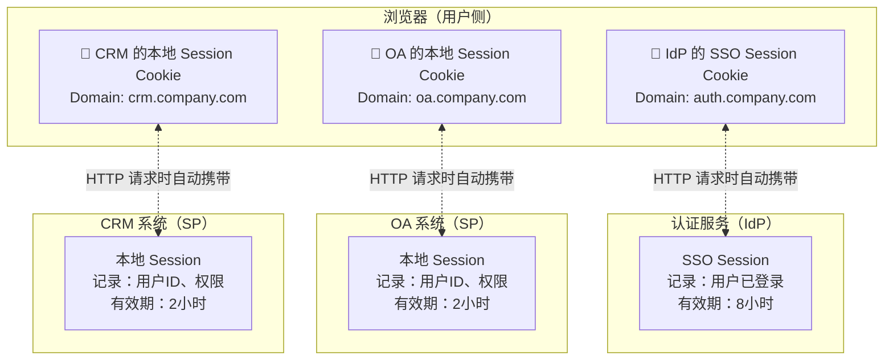

# SSO 是什么

## 本篇导读

### 核心目标

学完本篇后，你将能够：

- 用一卡通的类比解释 SSO 的本质
- 说清楚"免登录"的底层机制
- 区分 SSO Session 和应用本地 Session 的关系
- 了解主流 SSO 协议（SAML、CAS、OIDC）的差异

### 重要前置概念

本篇是 [OIDC 核心概念](./oidc-core-concepts.md) 的延续，假设你已经理解 IdP、SP、Client 的角色定义。

## 一个类比：大学一卡通

想象你进入一所大学：

**没有 SSO 之前**，每个场所都有独立的门禁：
- 图书馆有图书馆的门禁卡
- 食堂有食堂的刷卡机
- 宿舍有宿舍的磁卡
- 体育馆有体育馆的会员卡

你每到一处都要掏出不同的卡，管理员也要在不同系统里分别维护你的身份信息。

**有了 SSO 之后**，只需在注册时去学生处办一张卡，绑定你的学籍信息。之后进图书馆、在食堂消费、进宿舍，统统刷这一张卡。各个场所不再自己维护身份数据，而是统一向学生处核验身份。

这就是 SSO 的本质：

```
学生处（负责发卡） = IdP（身份提供者）
图书馆/食堂/宿舍（使用卡的场所） = SP（服务提供者）
你的一卡通 = SSO 凭证（Token）
刷卡进门 = SP 验证凭证后建立本地 Session
```

## SSO 解决什么问题

### 分散认证的三大痛点

| 痛点 | 具体表现 |
|------|----------|
| **用户体验差** | 每访问一个新系统就要重新登录一次，每天输好几次密码 |
| **安全风险高** | 密码分散管理，员工可能所有系统用同一个弱密码；某个系统被攻破可能牵连其他系统 |
| **运维成本高** | 每个系统都要独立维护注册/登录/找回密码逻辑；员工离职要在每个系统逐一删除账号 |

### SSO 的核心特性

| 特性 | 含义 |
|------|------|
| **一次登录，多处访问** | 在 IdP 登录一次，访问任何 SP 都无需再输入密码 |
| **统一身份** | 所有应用共享同一套用户身份，用户信息只需维护一处 |
| **统一登出（SLO）** | 在任一应用退出，可选择同时登出所有已登录的应用 |
| **统一安全策略** | 可以在 IdP 集中配置密码强度、MFA、账号锁定等 |

## SSO 的工作原理

### 场景一：用户第一次访问某个应用

假设用户早上打开电脑，第一次访问 OA 系统（SP）。



**关键步骤**：
- 步骤 3：SP 发现用户没登录，把用户"推"到 IdP
- 步骤 7：IdP 验证通过后，创建 SSO Session（存在 IdP 端）
- 步骤 10：SP 用授权码换 Token（Back-channel，不经过浏览器）

### 场景二：用户访问第二个应用（SSO 的核心体验）

用户在 OA 系统登录后，打开新标签页访问 CRM 系统。

这次，用户**不需要再输入密码**。



**关键机制**：步骤 4 中，浏览器访问 IdP 时自动携带了 SSO Session Cookie。IdP 检测到这个 Cookie 有效，就知道"这个用户之前已经在我这里登录过了"，于是跳过登录页面，直接颁发授权码。

## 两层 Session：IdP 的 vs SP 的

这是最容易混淆的地方。



| 维度 | SSO Session（IdP 端） | 本地 Session（SP 端） |
|------|----------------------|----------------------|
| 存储位置 | IdP 服务器（Redis） | 各个 SP 服务器 |
| 作用 | 记录用户在 IdP 处已认证 | 记录用户在该应用中已登录 |
| Cookie | IdP 域名下的 Cookie | SP 各自域名下的 Cookie |
| 生命周期 | 通常较长（如 8 小时） | 通常较短（如 2 小时） |
| 跨应用 | 被所有 SP 共享 | 仅在当前 SP 内有效 |
| 登出影响 | 登出后无法免密登录其他 SP | 不影响（需单独登出或通过 SLO 联动） |

### 一个常见的误解

> "SSO Session 过期后，各应用的本地 Session 也会立即失效"

**这是不对的**。各应用的本地 Session 是独立的。SSO Session 过期只意味着用户无法再通过 IdP 进行免密登录，但已经建立的本地 Session 依然有效，直到它自己过期为止。

这也是单点登出（Single Logout）复杂的原因——需要主动通知每个 SP 销毁本地 Session。

## SSO 与"记住密码"的区别

| 维度 | 记住密码 | SSO |
|------|----------|-----|
| 本质 | 浏览器帮你自动填写密码 | IdP 直接告诉 SP"这个用户已登录" |
| 需要登录吗 | 需要（只是自动帮你提交） | 不需要，直接跳过登录界面 |
| 跨设备 | 不可以 | 可以（任意设备登录一次 IdP 即可） |
| 密码暴露 | 密码存在浏览器存储中 | 密码只发给 IdP，各 SP 不知道用户密码 |
| 统一管理 | 无法统一管理 | 管理员可一键禁用账号，所有应用立即生效 |

## 主流 SSO 协议对比

SSO 是一种概念，有多种具体实现协议。

### SAML 2.0

| 特点 | 说明 |
|------|------|
| 数据格式 | XML |
| 推出时间 | 2005 年 |
| 主要场景 | 企业内部系统、老旧企业软件 |
| 优点 | 成熟、支持广泛（Salesforce、Office 365 等） |
| 缺点 | XML 解析开销大、调试困难、对 SPA 不友好 |

### CAS

| 特点 | 说明 |
|------|------|
| 数据格式 | 自定义（文本/XML） |
| 推出时间 | 1990 年代 |
| 主要场景 | 高校、部分企业内部系统 |
| 优点 | 协议简单、易于实现 |
| 缺点 | 生态封闭、扩展性差 |

### OAuth 2.0 + OIDC（本教程采用）

| 特点 | 说明 |
|------|------|
| 数据格式 | JSON / JWT |
| 推出时间 | OAuth2 2007 年，OIDC 2014 年 |
| 主要场景 | 互联网应用、移动 App、SPA |
| 优点 | 轻量易读、原生支持 SPA 和移动端、生态丰富 |
| 缺点 | 概念较多、学习曲线稍陡 |

### 协议选择建议

| 场景 | 推荐协议 |
|------|----------|
| 企业内部系统对接老旧软件（ERP、OA） | SAML 2.0 |
| 高校内网 SSO | CAS |
| 互联网应用、移动 App、SPA | OAuth 2.0 + OIDC |

本教程选择 OIDC，因为它最适合现代 Web 应用生态。

## 本篇小结

SSO 的本质是：

1. **IdP 统一管理用户身份**，所有 SP 信任 IdP 颁发的凭证
2. **SSO Session 存在 IdP 端**（通过 Cookie 维持），各 SP 各自维护本地 Session
3. **免密登录**是因为浏览器访问 IdP 时携带了 SSO Session Cookie，IdP 检测到有效 Session 后直接颁发授权码，跳过登录步骤
4. **两层 Session 独立**，SSO Session 过期不等于 SP 本地 Session 过期

理解这个机制后，你就能理解为什么 OIDC 要这样设计——它是实现 SSO 的一种现代、开放的协议。

## 下一步

接下来我们将深入学习 [OIDC 协议详解](../module-2-oidc-protocol/oauth2-protocol.md)，理解 OIDC 在 OAuth2 基础上增加了什么。
