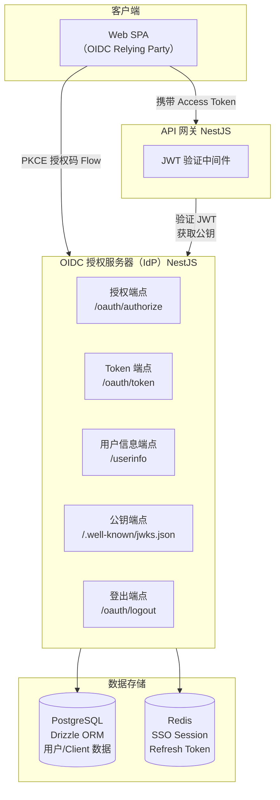
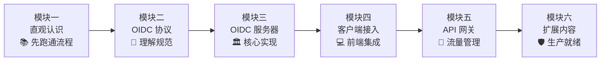

# 教程概览

## 本篇导读

### 核心目标

学完本篇后，你将能够：

- 了解本教程最终要构建的系统及其核心能力
- 建立对整体架构的清晰认知
- 掌握各模块之间的依赖关系与推荐学习路径

### 重点与难点

本篇以概览为主，不涉及具体实现代码。

## 我们要构建什么

一个 **OIDC 授权服务器**，具备以下能力：

- 邮箱 + 密码登录
- SSO 免登录：多个业务应用共享同一套登录体系
- 单点登出（SLO）：退出一处，可选择退出所有地方
- 完整的 OIDC 协议支持：授权码流、Discovery、JWKS

## 整体架构图

## 模块学习路径

**学习建议**：

- **模块一（直观认识）**：先跑通 OIDC Flow，建立直观认识
- **模块二（OIDC 协议）**：深入理解协议规范，为实现打下理论基础
- **模块三（OIDC 服务器）**：核心实现，耗时最长
- **模块四（客户端接入）**：学习如何将应用接入 OIDC 服务器
- **模块五（API 网关）**：网关如何验证 Token、保护 API
- **模块六（扩展内容）**：密码安全、MFA、审计监控、生产部署

## 本篇小结

本教程以 OIDC 为核心，从零构建完整的 SSO 认证体系：

- **模块一**：通过完整演示建立直观认识
- **模块二**：深入 OIDC 协议规范
- **模块三**：搭建 OIDC 授权服务器
- **模块四**：客户端（SPA/BFF）接入
- **模块五**：API 网关验证
- **模块六**：生产级安全扩展

各模块按层级递进，每一章都是下一章的基础。
