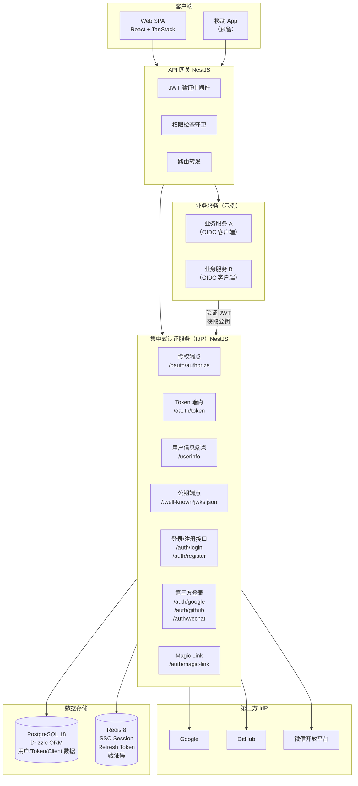
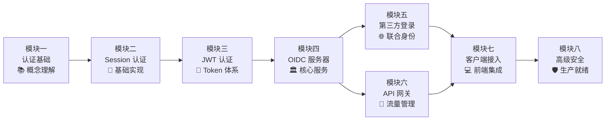
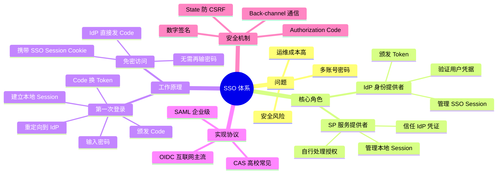

# 教程整体规划

## 本篇导读

### 核心目标

学完本篇后，你将能够：

- 了解本系列教程最终要构建的系统及其核心能力
- 建立对整体架构的清晰认知，包括各个组成部分的职责
- 掌握各模块之间的依赖关系与推荐学习路径
- 在后续每一章学习时，都能清楚自己在整体拼图中完成了哪一块

### 重点与难点

本篇以概览为主，不涉及具体实现代码。目的是在你正式开始学习之前，建立整体视图，避免"只见树木，不见森林"。

## 我们要构建什么

一个 **集中式认证服务**，具备以下能力：

- 邮箱 + 密码登录（Session 认证、JWT 认证）
- 第三方登录：Google OAuth2、GitHub OAuth2、微信扫码登录
- Magic Link 邮箱登录（无密码）
- SSO 能力：多个业务应用共享同一套登录体系
- 单点登出（SLO）：退出一处，可选择退出所有地方
- MFA（多因素认证）：TOTP 支持

同时，我们将构建一个 **API 网关**，负责：

- 验证认证服务颁发的 JWT
- 权限检查
- 请求路由

以及一个 **前端客户端示例**，演示如何以纯前端模式或 BFF 模式接入认证服务。

## 整体架构图

## 各模块的学习路径

**学习建议**：

- **模块一（认证基础）**：纯概念，不涉及代码。务必理解清楚再往后学
- **模块二（Session 认证）**：从最基础的认证方式入手，搭建项目脚手架
- **模块三（JWT 认证）**：理解 Token 体系，是后续 OIDC 的基础
- **模块四（OIDC 服务器）**：整个教程的核心，耗时最长，需要模块二和三的基础
- **模块五/六**：可以并行学习，分别是"谁能登录"和"登录后能做什么"
- **模块七**：在模块四/五/六完成后才能做完整的前后端联调

## 知识体系图

## 本篇小结

本教程将从零构建一套完整的集中式认证体系：以 NestJS 实现的 IdP（身份提供者）作为核心，向上对接 API 网关和前端客户端，向外集成 Google、GitHub、微信等第三方登录。

各模块按层级递进——先打牢认证基础概念，再逐步实现 Session 认证、JWT、OIDC 服务器、第三方登录、API 网关、前端接入，最终覆盖 MFA 和生产部署等高级主题。每一章都是下一章的基础，在学习具体章节时，可以随时回到这里确认自己在整体路径中所处的位置。
