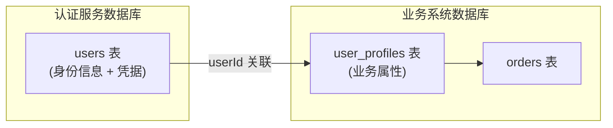
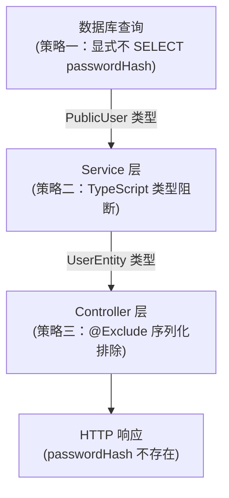

# 用户模型设计

## 本篇导读

### 核心目标

学完本篇后，你将能够：

- 理解用户表（users）在整个认证系统中的核心地位，以及它需要承载的职责
- 掌握如何使用 Drizzle ORM 定义符合生产标准的用户数据库 Schema
- 理解密码字段的正确处理方式，包括存储、读取和响应三个环节
- 设计合理的字段分层策略，区分公开信息与敏感信息
- 掌握软删除、审计字段等生产级最佳实践

### 重点与难点

**重点**：

- 用户表的字段设计——什么该存，什么不该存，边界在哪里
- 密码字段的生命周期管理——从写入到展示，如何确保哈希值不会泄露
- Drizzle ORM 的 Schema 定义语法与类型推导机制

**难点**：

- 如何在 TypeScript 类型层面阻止 `passwordHash` 泄露到 API 响应中
- 用户模型的职责边界——认证服务的用户表与业务系统的用户表该如何分离
- 索引设计与查询性能的权衡

## 从一张表开始

认证系统的核心是用户。无论你要实现 Session 认证、JWT 认证还是 OIDC 授权服务器，所有流程的起点都是同一个问题：

> "这个请求是谁发出的？"

而回答这个问题，需要一张设计合理的用户表。

很多教程会直接给出一个三列的用户表：`id`、`email`、`password`，然后快速进入登录接口的编写。这样的表在教学环境里能运行，但它隐藏了大量在生产环境中至关重要的问题：

- 密码哈希应该存在 `password` 字段还是 `passwordHash` 字段？名字重要吗？
- `createdAt` 和 `updatedAt` 是可选的装饰品还是必要的审计字段？
- 用户被"删除"时，数据应该真的从数据库里消失吗？
- 如果未来要支持 OAuth 登录，用户表需要做哪些预留？
- NestJS 的 `UserService` 返回用户对象时，如何确保密码哈希不会出现在 HTTP 响应中？

本篇将从零开始，逐一回答这些问题，并最终产出一个可以在真实项目中使用的用户数据模型。

## 核心概念讲解

### 数据库与 ORM 的角色

在我们开始讨论具体的字段之前，先来梳理一下工具的选择。

#### 为什么选择 Drizzle ORM？

本教程使用 Drizzle ORM 作为数据库交互层。Drizzle 是一个相对较新但已经相当成熟的 TypeScript ORM，相比 TypeORM 和 Prisma，它有几个关键优势：

**类型安全的 Schema 定义**

Drizzle 的 Schema 是纯 TypeScript 代码，而非独立的 prisma.schema 文件或 TypeORM 装饰器。这意味着：

- Schema 定义本身就是类型定义，无需额外的类型生成步骤
- TypeScript 类型推导直接来自 Schema，查询结果的类型是自动精确的
- IDE 自动补全立即生效，没有"生成一次才能用"的等待感

**SQL 优先，行为可预期**

Drizzle 的查询 API 被称为"对 SQL 的薄包装"。它不会对你隐藏 SQL，生成的查询几乎和你手写 SQL 一样可读，这让调试和性能优化变得直接。

**轻量且无运行时魔法**

Drizzle 没有隐式的懒加载、N+1 问题很容易被发现，且包体积极小，非常适合 NestJS + PostgreSQL 的组合。

#### PostgreSQL 的角色

我们使用 PostgreSQL 18 作为主数据库。PostgreSQL 是认证系统的理想选择，原因在于：

- 强大的事务支持，确保用户创建、Session 生成等操作的原子性
- 内置 UUID 类型，适合分布式场景的主键生成
- Row Level Security（RLS），在数据库层面支持细粒度访问控制
- `jsonb` 类型，方便存储非结构化的元信息（如 OAuth 的扩展属性）

### 用户模型的职责边界

在设计用户表之前，必须先回答一个核心问题：**这张用户表的职责是什么？**

#### 认证服务的用户表 vs 业务系统的用户表

在一个大型系统中，通常会有两种不同性质的"用户"：

**认证服务中的用户**：

- 关注"你是谁"——身份识别
- 存储认证凭据（密码哈希、外部 OAuth 账号关联）
- 存储最小化的身份信息（邮箱、用户名）
- 由认证服务（Auth Service）独立管理

**业务系统中的用户**：

- 关注"你能做什么"——业务属性
- 存储业务相关信息（地址、偏好、订单、积分）
- 通过认证服务返回的 `userId` 与认证身份关联
- 由各业务服务独立管理



在本教程的 Session 认证阶段，我们的认证服务和业务系统是合并在同一个 NestJS 应用中的，但我们要在设计上保持清晰的边界意识：**哪些字段属于认证职责，哪些属于业务职责**。随着教程推进到模块四（OIDC 授权服务器），你会看到这种职责分离是如何在架构层面落地的。

#### 最小化原则：只存必要的信息

用户表的设计应该遵循 **数据最小化（Data Minimization）** 原则：只收集和存储完成目标所必需的信息。这不仅是 GDPR 等隐私法规的要求，也是良好的系统设计原则——字段越少，职责越清晰，出错的可能性越低。

对于一个认证服务的用户表，必要字段是：

- **唯一标识**：`id`，用于在系统内部标识用户
- **登录凭据**：邮箱（+ 密码哈希），用于验证用户身份
- **状态控制**：账号是否激活、是否被锁定
- **审计信息**：创建时间、更新时间，用于安全审计

不需要的字段（让业务系统自己管理）：

- 用户的真实姓名、头像、个人简介
- 用户的收货地址、联系方式
- 用户的业务角色、权限（权限是授权的职责，不是认证的职责）

### 字段设计详解

现在来逐一分析每个字段的设计决策。

#### 主键：UUID vs 自增整数

```typescript
id: uuid('id').primaryKey().defaultRandom(),
```

**为什么选 UUID 而不是自增 ID？**

自增 ID（如 `SERIAL` 或 `BIGSERIAL`）是最简单的主键选择，但在认证系统中有几个问题：

**可枚举性导致的安全风险**

自增 ID 是可预测的。如果用户的 URL 是 `/api/users/42`，攻击者很容易推断出系统里有多少用户，并尝试访问 `/api/users/1`、`/api/users/2`……这被称为"对象级授权漏洞（IDOR，Insecure Direct Object Reference）"，是 OWASP Top 10 中的常见漏洞（破坏访问控制）。

**分布式场景下的冲突**

当你有多个服务实例、多个数据库分片，或者需要在客户端预生成 ID 时，自增 ID 会产生冲突。UUID 是基于随机数生成的，冲突概率极低（128 位随机数空间）。

**数据迁移和合并**

UUID 让不同系统之间的数据迁移和合并变得简单，不需要重新映射 ID。

**UUID v4 vs UUID v7**

PostgreSQL 的 `gen_random_uuid()`（即 Drizzle 中 `defaultRandom()`）生成的是 **UUID v4**（纯随机）。UUID v7 是较新的标准，它在前缀中包含时间戳，使得 UUID 按时间有序，这对数据库索引性能友好（因为 B-Tree 索引在有序插入时效率更高）。

在 Drizzle 中使用 UUID v7：

```typescript
import { v7 as uuidv7 } from 'uuid';

id: uuid('id').primaryKey().$defaultFn(() => uuidv7()),
```

**本教程的选择**：使用默认的 UUID v4（`defaultRandom()`），理由是 PostgreSQL 的 `gen_random_uuid()` 性能良好，且无需额外依赖。在读取性能有极高要求的场景，可以迁移到 UUID v7。

#### 邮箱字段

```typescript
email: varchar('email', { length: 254 }).notNull().unique(),
```

几个关键决策：

**长度为什么是 254？**

这来自 RFC 5321 的规范：电子邮件地址的最大长度是 254 个字符（本地部分最多 64 字符 + `@` + 域名最多 253 字符，但整体上限是 254）。使用 `varchar(254)` 确保符合标准，同时避免 `text` 类型在某些索引场景下的问题。

**为什么要加唯一索引？**

邮箱是用户的登录凭据，两个用户不能有相同的邮箱。`unique()` 在数据库层面强制保证这一点，而不是仅仅依赖应用层的校验。应用层校验可能有竞态条件问题（两个并发注册请求都通过了"邮箱是否存在"检查，然后都插入数据库）。

**大小写的问题**

邮件地址在大多数邮件系统中是大小写不敏感的（`User@Example.com` 和 `user@example.com` 是同一个地址）。在存储时，应该将邮箱统一转为小写：

```typescript
// 在 Service 层处理，不是在 Schema 层
const normalizedEmail = email.toLowerCase().trim();
```

另外，PostgreSQL 支持函数索引，可以在数据库层面强制唯一性：

```sql
CREATE UNIQUE INDEX users_email_lower_idx ON users (LOWER(email));
```

在 Drizzle 中，可以通过自定义索引实现：

```typescript
import { uniqueIndex, sql } from 'drizzle-orm/pg-core';

// 在 table 配置中添加
(table) => ({
  emailLowerIdx: uniqueIndex('users_email_lower_idx').on(
    sql`lower(${table.email})`
  ),
}),
```

#### 密码字段：命名的艺术

```typescript
passwordHash: varchar('password_hash', { length: 255 }).notNull(),
```

这个字段的命名 `passwordHash` 而不是 `password` 是一个重要细节。

**命名即文档**

`password` 这个名称有歧义——它到底存的是明文密码还是哈希值？如果是新来的开发者，看到 `password` 字段时可能会犯一个危险的错误：在某处将它直接返回给客户端。

`passwordHash` 则明确传达了"这个字段存储的是哈希值"的语义，任何看到它的开发者都会意识到：这个值不能直接暴露给用户，也不能直接用于比较。

**长度为什么是 255？**

Argon2id 的哈希输出格式如下：

```plaintext
$argon2id$v=19$m=65536,t=3,p=4$<base64-salt>$<base64-hash>
```

Bcrypt 的哈希输出格式如下：

```plaintext
$2b$12$<22字符base64-salt><31字符base64-hash>
```

Bcrypt 的输出固定为 60 字符，Argon2id 的输出大约在 95-120 字符之间（取决于参数配置）。选择 255 字符可以容纳当前和可预见的未来的所有主流密码哈希算法输出，同时不会过度浪费存储空间。

#### 账号状态字段

```typescript
isVerified: boolean('is_verified').notNull().default(false),
isActive: boolean('is_active').notNull().default(true),
```

**`isVerified`：邮箱验证状态**

用户注册后，需要通过邮箱验证才能激活账号。`isVerified` 表示邮箱是否已验证。

- 注册时默认 `false`
- 用户点击验证邮件中的链接后，设置为 `true`
- 登录检查：`isVerified = false` 时拒绝登录（或只允许访问受限功能）

**`isActive`：账号激活状态**

`isActive` 是管理员控制层面的开关，用于：

- 临时暂停一个账号（例如发现可疑行为时）
- 永久封禁违规账号
- 区别于 `isVerified`，`isActive = false` 是管理员主动干预的结果

将两个状态分开存储，而不是合并成一个 `status` 枚举字段，理由是：

1. 两个独立的布尔值查询效率高（可以分别建索引）
2. 状态变更逻辑清晰，`isVerified` 由邮箱验证流程控制，`isActive` 由管理员控制
3. 未来扩展时，增加新状态字段不影响现有逻辑

#### 审计字段

```typescript
createdAt: timestamp('created_at', { withTimezone: true }).notNull().defaultNow(),
updatedAt: timestamp('updated_at', { withTimezone: true }).notNull().defaultNow().$onUpdateFn(() => new Date()),
```

审计字段看起来是可有可无的附加品，但在生产环境中，它们往往是你排查问题的关键线索：

- "这个账号是什么时候注册的？" → `createdAt`
- "密码是什么时候最后一次修改的？" → `updatedAt`（如果每次密码修改都更新这个字段）
- "这次登录异常是什么时候开始的？" → 配合 Session 表的 `createdAt` 交叉分析

**`withTimezone: true` 的重要性**

PostgreSQL 有两种时间戳类型：`TIMESTAMP` 和 `TIMESTAMPTZ`。

`TIMESTAMP` 存储"本地时间"，不携带时区信息。如果你的服务器时区配置变化，或者你有来自不同时区的数据，`TIMESTAMP` 会产生歧义。

`TIMESTAMPTZ` 内部统一用 UTC 存储，查询时根据当前时区设置转换输出。对于任何跨时区的应用，`TIMESTAMPTZ` 都是正确选择。

**`$onUpdateFn` 的作用**

Drizzle 的 `$onUpdateFn(() => new Date())` 会在每次通过 Drizzle 执行 `UPDATE` 操作时自动更新 `updatedAt` 字段。

注意：这是在应用层实现的，如果通过直接执行 SQL 修改数据，`updatedAt` 不会自动更新。如果需要数据库层面的自动更新，可以使用 PostgreSQL 触发器：

```sql
CREATE OR REPLACE FUNCTION update_updated_at_column()
RETURNS TRIGGER AS $$
BEGIN
    NEW.updated_at = NOW();
    RETURN NEW;
END;
$$ language 'plpgsql';

CREATE TRIGGER update_users_updated_at
    BEFORE UPDATE ON users
    FOR EACH ROW
    EXECUTE FUNCTION update_updated_at_column();
```

#### 软删除

```typescript
deletedAt: timestamp('deleted_at', { withTimezone: true }),
```

**什么是软删除？**

软删除（Soft Delete）是指在逻辑上将数据标记为"已删除"，但不从数据库中物理删除记录。实现方式是添加一个可空的 `deletedAt` 字段：

- `deletedAt = NULL`：账号正常存在
- `deletedAt = <时间戳>`：账号已被删除，删除时间为该时间戳

**为什么需要软删除？**

**数据恢复**：用户误删账号或管理员误操作，可以快速恢复，而不是从备份中恢复。

**审计完整性**：用户的所有关联数据（订单、日志、Session）都通过 `userId` 关联。如果用户记录被物理删除，这些关联数据会变成孤立数据（外键约束会阻止删除，或者数据变得无法解释）。

**法规合规**：在某些场景下，"用户注销后仍需保留数据 X 天"的法规要求。软删除让你可以简单地在 X 天后再执行物理删除。

**实现软删除查询过滤**

软删除的代价是：所有查询都必须加上 `WHERE deleted_at IS NULL` 条件，稍有不慎就会查出已删除的用户。在 Drizzle 中，可以通过以下方式确保这一点：

```typescript
// 在 UserRepository 中封装所有查询，统一加过滤条件
async findById(id: string) {
  return this.db
    .select()
    .from(users)
    .where(and(eq(users.id, id), isNull(users.deletedAt)))
    .limit(1);
}
```

或者使用 Drizzle 的视图（View）功能，创建一个自动过滤软删除的虚拟表：

```sql
CREATE VIEW active_users AS
SELECT * FROM users WHERE deleted_at IS NULL;
```

### 完整的 Schema 定义

现在把所有字段组合在一起，并讨论完整的 Schema 文件组织方式。

#### 项目结构

在 NestJS 项目中，我们按照以下结构组织 Drizzle 相关文件：

```plaintext
src/
├── database/
│   ├── database.module.ts      # DatabaseModule，提供 Drizzle 实例
│   ├── database.provider.ts    # Drizzle 连接配置
│   └── schema/
│       ├── index.ts            # 导出所有 Schema
│       └── users.schema.ts     # users 表定义
├── users/
│   ├── users.module.ts
│   ├── users.service.ts
│   └── users.repository.ts    # 数据库操作封装
└── auth/
    └── ...
```

这种结构的好处：

- `schema/` 目录集中管理所有表定义，Drizzle Migrate 可以扫描整个目录
- 各模块（`users/`、`auth/`）不直接操作 Drizzle，而是通过 Repository 层访问数据库
- `database.module.ts` 是全局模块，任何模块都可以注入 Drizzle 实例

#### users.schema.ts

```typescript
import {
  pgTable,
  uuid,
  varchar,
  boolean,
  timestamp,
  uniqueIndex,
  sql,
} from 'drizzle-orm/pg-core';

export const users = pgTable(
  'users',
  {
    id: uuid('id').primaryKey().defaultRandom(),
    email: varchar('email', { length: 254 }).notNull(),
    passwordHash: varchar('password_hash', { length: 255 }).notNull(),
    isVerified: boolean('is_verified').notNull().default(false),
    isActive: boolean('is_active').notNull().default(true),
    createdAt: timestamp('created_at', { withTimezone: true })
      .notNull()
      .defaultNow(),
    updatedAt: timestamp('updated_at', { withTimezone: true })
      .notNull()
      .defaultNow()
      .$onUpdateFn(() => new Date()),
    deletedAt: timestamp('deleted_at', { withTimezone: true }),
  },
  (table) => ({
    emailLowerIdx: uniqueIndex('users_email_lower_idx').on(
      sql`lower(${table.email})`
    ),
  })
);
```

#### schema/index.ts

```typescript
export * from './users.schema';
// 后续添加 sessions、oauth_accounts 等表时，统一在这里导出
```

#### 从 Schema 推导 TypeScript 类型

Drizzle 的 `InferSelectModel` 和 `InferInsertModel` 可以从 Schema 自动推导出精确的 TypeScript 类型：

```typescript
import { InferSelectModel, InferInsertModel } from 'drizzle-orm';
import { users } from './users.schema';

// 查询结果类型（SELECT）：所有字段都存在
export type User = InferSelectModel<typeof users>;

// 插入数据类型（INSERT）：可选字段为可选
export type NewUser = InferInsertModel<typeof users>;
```

`InferSelectModel<typeof users>` 的推导结果大致等同于：

```typescript
type User = {
  id: string;
  email: string;
  passwordHash: string;
  isVerified: boolean;
  isActive: boolean;
  createdAt: Date;
  updatedAt: Date;
  deletedAt: Date | null;
};
```

`InferInsertModel<typeof users>` 的推导结果大致等同于：

```typescript
type NewUser = {
  id?: string; // 有默认值，可选
  email: string; // 必填
  passwordHash: string; // 必填
  isVerified?: boolean; // 有默认值，可选
  isActive?: boolean; // 有默认值，可选
  createdAt?: Date; // 有默认值，可选
  updatedAt?: Date; // 有默认值，可选
  deletedAt?: Date | null; // 可空，可选
};
```

这种类型推导是 Drizzle 最强大的特性之一：**Schema 既是运行时的表定义，也是编译时的类型来源**，两者严格同步，修改 Schema 后 TypeScript 类型同步更新。

### 密码字段的生命周期管理

这是本篇最重要的安全话题：**如何确保 `passwordHash` 永远不会出现在 HTTP 响应中？**

#### 三个环节的风险

密码哈希在三个环节存在泄露风险：

**环节 1：从数据库读取时**

```typescript
// 危险！SELECT * 会包含 passwordHash
const user = await db.select().from(users).where(eq(users.id, id));
// user.passwordHash 被读取到内存中
```

**环节 2：传递给 Controller 时**

```typescript
// 危险！整个 user 对象被传递
@Get(':id')
async getUser(@Param('id') id: string) {
  return this.usersService.findById(id); // 如果返回了 passwordHash...
}
```

**环节 3：序列化为 JSON 时**

```typescript
// 如果 user 对象包含 passwordHash，它会被序列化进 HTTP 响应
res.json(user); // { id: '...', email: '...', passwordHash: '$2b$...' }
```

#### 防御策略一：查询时显式排除

最根本的防御是在数据库查询时就不读取 `passwordHash`：

```typescript
// 查询用户信息时，明确列出需要的字段，不包含 passwordHash
async findById(id: string) {
  const result = await this.db
    .select({
      id: users.id,
      email: users.email,
      isVerified: users.isVerified,
      isActive: users.isActive,
      createdAt: users.createdAt,
      updatedAt: users.updatedAt,
    })
    .from(users)
    .where(and(eq(users.id, id), isNull(users.deletedAt)))
    .limit(1);

  return result[0] ?? null;
}

// 只有在需要验证密码时，才读取 passwordHash
async findByEmailWithPassword(email: string) {
  const result = await this.db
    .select()
    .from(users)
    .where(and(eq(sql`lower(${users.email})`, email.toLowerCase()), isNull(users.deletedAt)))
    .limit(1);

  return result[0] ?? null;
}
```

这种方式的好处：**问题在数据库层就被阻断**，`passwordHash` 根本不会进入应用内存（除非你明确需要它）。

#### 防御策略二：TypeScript 类型层面阻断

在 TypeScript 中，可以利用类型系统在编译时阻止 `passwordHash` 进入响应类型：

```typescript
import { User } from '../database/schema';

// 定义"公开用户信息"类型，排除敏感字段
type PublicUser = Omit<User, 'passwordHash' | 'deletedAt'>;

// UsersService 的方法返回 PublicUser 而不是 User
async findById(id: string): Promise<PublicUser | null> {
  // ...
}
```

如果你不小心在 `findById` 中返回了包含 `passwordHash` 的对象，TypeScript 编译器会报错：

```typescript
// 编译错误：Type 'User' is not assignable to type 'PublicUser'
// Property 'passwordHash' does not exist in type 'PublicUser'
return fullUser; // ❌ TypeScript 会阻止你
```

#### 防御策略三：NestJS 序列化拦截器（Class Transformer）

NestJS 提供了基于 `class-transformer` 的序列化机制，可以在响应序列化阶段排除特定字段：

```typescript
import { Exclude, Expose } from 'class-transformer';

export class UserEntity {
  @Expose()
  id: string;

  @Expose()
  email: string;

  @Expose()
  isVerified: boolean;

  @Expose()
  isActive: boolean;

  @Expose()
  createdAt: Date;

  @Expose()
  updatedAt: Date;

  @Exclude() // 🔒 序列化时排除该字段
  passwordHash: string;

  @Exclude()
  deletedAt: Date | null;

  constructor(partial: Partial<UserEntity>) {
    Object.assign(this, partial);
  }
}
```

在 Controller 中配合 `@UseInterceptors(ClassSerializerInterceptor)` 使用：

```typescript
import { Controller, Get, Param, UseInterceptors } from '@nestjs/common';
import { ClassSerializerInterceptor } from '@nestjs/common';
import { UsersService } from './users.service';

@Controller('users')
@UseInterceptors(ClassSerializerInterceptor)
export class UsersController {
  constructor(private readonly usersService: UsersService) {}

  @Get(':id')
  async getUser(@Param('id') id: string) {
    const user = await this.usersService.findById(id);
    return new UserEntity(user); // ClassSerializer 会自动跳过 @Exclude 字段
  }
}
```

**三种策略的最佳搭配**

这三种策略不是互斥的，它们形成了多层防御（Defense in Depth）：



- **策略一** 是最根本的防御，阻断数据在内存中的存在
- **策略二** 是编译时保障，让错误在上线前就被发现
- **策略三** 是最后一道防线，即使前两层有疏漏，序列化阶段也会拦截

在生产代码中，**强烈建议同时使用策略一和策略二**。策略三可以作为补充，但不应该是唯一防线。

### 数据库初始化与迁移

#### 配置 Drizzle

首先安装必要的依赖：

```plaintext
pnpm add drizzle-orm pg
pnpm add -D drizzle-kit @types/pg
```

配置 `drizzle.config.ts`：

```typescript
import type { Config } from 'drizzle-kit';

export default {
  schema: './src/database/schema', // Schema 文件目录
  out: './drizzle/migrations', // 迁移文件输出目录
  dialect: 'postgresql',
  dbCredentials: {
    url: process.env.DATABASE_URL!,
  },
} satisfies Config;
```

#### 在 NestJS 中配置 Drizzle 模块

```typescript
// src/database/database.provider.ts
import { drizzle } from 'drizzle-orm/node-postgres';
import { Pool } from 'pg';
import * as schema from './schema';

export const DATABASE_CONNECTION = 'DATABASE_CONNECTION';

export const databaseProviders = [
  {
    provide: DATABASE_CONNECTION,
    useFactory: async () => {
      const pool = new Pool({
        connectionString: process.env.DATABASE_URL,
        max: 20, // 连接池最大连接数
        idleTimeoutMillis: 30000,
        connectionTimeoutMillis: 2000,
      });

      return drizzle(pool, { schema });
    },
  },
];
```

```typescript
// src/database/database.module.ts
import { Module, Global } from '@nestjs/common';
import { databaseProviders, DATABASE_CONNECTION } from './database.provider';

@Global() // 全局模块，其他模块无需 import 即可注入
@Module({
  providers: databaseProviders,
  exports: [DATABASE_CONNECTION],
})
export class DatabaseModule {}
```

在其他模块中注入 Drizzle 实例：

```typescript
// src/users/users.repository.ts
import { Inject, Injectable } from '@nestjs/common';
import { DATABASE_CONNECTION } from '../database/database.provider';
import { NodePgDatabase } from 'drizzle-orm/node-postgres';
import * as schema from '../database/schema';

type Db = NodePgDatabase<typeof schema>;

@Injectable()
export class UsersRepository {
  constructor(
    @Inject(DATABASE_CONNECTION)
    private readonly db: Db
  ) {}

  // ...
}
```

#### 生成与执行迁移

```plaintext
# 生成迁移文件（对比当前 Schema 和数据库状态，生成 SQL diff）
pnpm drizzle-kit generate

# 执行迁移（将迁移文件应用到数据库）
pnpm drizzle-kit migrate

# 在开发环境中直接推送变更（跳过迁移文件，直接同步数据库结构）
pnpm drizzle-kit push
```

`drizzle-kit generate` 会生成类似这样的迁移 SQL 文件：

```sql
-- drizzle/migrations/0000_create_users.sql
CREATE TABLE IF NOT EXISTS "users" (
	"id" uuid PRIMARY KEY DEFAULT gen_random_uuid() NOT NULL,
	"email" varchar(254) NOT NULL,
	"password_hash" varchar(255) NOT NULL,
	"is_verified" boolean DEFAULT false NOT NULL,
	"is_active" boolean DEFAULT true NOT NULL,
	"created_at" timestamptz DEFAULT now() NOT NULL,
	"updated_at" timestamptz DEFAULT now() NOT NULL,
	"deleted_at" timestamptz
);

CREATE UNIQUE INDEX IF NOT EXISTS "users_email_lower_idx"
  ON "users" (lower("email"));
```

#### 开发环境 vs 生产环境的迁移策略

| 场景         | 推荐方式             | 说明                                               |
| ------------ | -------------------- | -------------------------------------------------- |
| 本地开发     | `drizzle-kit push`   | 快速同步，无需管理迁移文件，适合频繁改动 Schema 时 |
| 团队协作开发 | `generate + migrate` | 迁移文件纳入版本控制，团队成员可重现完整迁移历史   |
| 生产环境部署 | `migrate`            | 仅执行迁移文件，不自动生成，确保 Schema 变更受控   |
| CI/CD        | `migrate`            | 在部署流水线中自动执行迁移，确保数据库与代码同步   |

**警告**：在生产环境中永远不要使用 `drizzle-kit push`，它会直接修改数据库结构而不留下迁移历史，一旦出错难以回滚。

### 索引设计

良好的索引设计不只是性能优化，也与认证系统的可用性直接相关。一个慢查询的登录接口，在高并发场景下会迅速成为系统的瓶颈。

#### 用户表需要哪些索引？

```typescript
(table) => ({
  // 1. 邮箱唯一索引（大小写不敏感）：登录时通过邮箱查找用户
  emailLowerIdx: uniqueIndex('users_email_lower_idx').on(
    sql`lower(${table.email})`
  ),

  // 2. 活跃状态复合索引：查询活跃且已验证的用户列表（管理后台使用）
  activeVerifiedIdx: index('users_active_verified_idx').on(
    table.isActive,
    table.isVerified
  ),
});
```

**为什么登录不需要单独的 `email` 索引？**

因为我们已经创建了 `lower(email)` 的函数索引。当查询包含 `WHERE lower(email) = ?` 时，这个索引就会被使用。普通的 `email` 字段索引对于 `lower(email)` 查询是无效的。

**`deletedAt` 需要索引吗？**

通常不需要。`WHERE deleted_at IS NULL` 这类条件在大多数查询中都会结合其他高选择性条件（如 `email`、`id`）使用。如果有大量软删除数据，可以考虑添加一个 **局部索引（Partial Index）**：

```sql
-- 只对未删除的记录建索引，减少索引大小
CREATE UNIQUE INDEX users_email_lower_active_idx
  ON users (LOWER(email))
  WHERE deleted_at IS NULL;
```

在 Drizzle 中：

```typescript
emailLowerActiveIdx: uniqueIndex('users_email_lower_active_idx')
  .on(sql`lower(${table.email})`)
  .where(isNull(table.deletedAt)),
```

这种局部索引同时解决了两个问题：邮箱唯一性约束 + 过滤已删除用户。

### 完整的 UsersRepository 实现

基于以上设计，来看完整的 Repository 层实现：

```typescript
import { Inject, Injectable } from '@nestjs/common';
import { and, eq, isNull, sql } from 'drizzle-orm';
import { NodePgDatabase } from 'drizzle-orm/node-postgres';
import { DATABASE_CONNECTION } from '../database/database.provider';
import * as schema from '../database/schema';
import { users } from '../database/schema';
import { NewUser, User } from '../database/schema/users.schema';

type Db = NodePgDatabase<typeof schema>;

// 公开用户信息（排除敏感字段）
export type PublicUser = Omit<User, 'passwordHash' | 'deletedAt'>;

@Injectable()
export class UsersRepository {
  constructor(
    @Inject(DATABASE_CONNECTION)
    private readonly db: Db
  ) {}

  // ✅ 创建用户（密码必须已经哈希）
  async create(data: {
    email: string;
    passwordHash: string; // 调用方必须传入哈希值，不是明文
  }): Promise<PublicUser> {
    const [user] = await this.db
      .insert(users)
      .values({
        email: data.email.toLowerCase().trim(),
        passwordHash: data.passwordHash,
      })
      .returning({
        id: users.id,
        email: users.email,
        isVerified: users.isVerified,
        isActive: users.isActive,
        createdAt: users.createdAt,
        updatedAt: users.updatedAt,
      });

    return user;
  }

  // ✅ 通过 ID 查询用户（不含 passwordHash）
  async findById(id: string): Promise<PublicUser | null> {
    const [user] = await this.db
      .select({
        id: users.id,
        email: users.email,
        isVerified: users.isVerified,
        isActive: users.isActive,
        createdAt: users.createdAt,
        updatedAt: users.updatedAt,
      })
      .from(users)
      .where(and(eq(users.id, id), isNull(users.deletedAt)))
      .limit(1);

    return user ?? null;
  }

  // ✅ 通过邮箱查询用户含密码哈希（仅用于登录验证）
  async findByEmailWithPassword(email: string): Promise<User | null> {
    const [user] = await this.db
      .select()
      .from(users)
      .where(
        and(
          eq(sql`lower(${users.email})`, email.toLowerCase().trim()),
          isNull(users.deletedAt)
        )
      )
      .limit(1);

    return user ?? null;
  }

  // ✅ 通过邮箱查询用户（不含 passwordHash，用于注册时检查邮箱是否已存在）
  async findByEmail(email: string): Promise<PublicUser | null> {
    const [user] = await this.db
      .select({
        id: users.id,
        email: users.email,
        isVerified: users.isVerified,
        isActive: users.isActive,
        createdAt: users.createdAt,
        updatedAt: users.updatedAt,
      })
      .from(users)
      .where(
        and(
          eq(sql`lower(${users.email})`, email.toLowerCase().trim()),
          isNull(users.deletedAt)
        )
      )
      .limit(1);

    return user ?? null;
  }

  // ✅ 激活邮箱验证
  async markAsVerified(id: string): Promise<void> {
    await this.db
      .update(users)
      .set({ isVerified: true })
      .where(eq(users.id, id));
  }

  // ✅ 软删除用户
  async softDelete(id: string): Promise<void> {
    await this.db
      .update(users)
      .set({ deletedAt: new Date(), isActive: false })
      .where(eq(users.id, id));
  }
}
```

注意代码中每个查询方法的设计原则：

- **`findById`** 和 **`findByEmail`**：只选取公开字段，返回 `PublicUser`，适合用在 Controller 中直接返回给客户端
- **`findByEmailWithPassword`**：返回完整 `User`（含 `passwordHash`），方法名明确标注了"WithPassword"，提示调用者这是敏感查询，仅在登录验证时使用
- **`create`**：参数类型明确要求传入 `passwordHash`，不接受明文密码，职责边界清晰

## 常见问题与解决方案

### 问题一：邮箱大小写导致重复注册

**症状**：用户用 `User@example.com` 注册后，又用 `user@example.com` 再次注册成功，导致同一邮箱有两个账号。

**原因**：没有统一邮箱的大小写，唯一索引按照字符串原始值比较，`User@...` 和 `user@...` 被认为是不同值。

**解决方案**：

1. 在 Service 层存储前统一转小写：`email.toLowerCase().trim()`
2. 使用函数索引 `CREATE UNIQUE INDEX ON users (LOWER(email))` 在数据库层强制唯一性

函数索引确保即使 Service 层忘记转换，数据库也会拒绝重复插入：

```typescript
// 这两个插入操作，第二个会因为函数索引抛出唯一性违反错误
await db.insert(users).values({ email: 'User@example.com', ... });
await db.insert(users).values({ email: 'user@example.com', ... }); // ❌ 抛出错误
```

### 问题二：passwordHash 被意外打印在日志中

**症状**：在日志文件（或错误追踪服务，如 Sentry）中，看到包含 `passwordHash` 字段的用户对象。

**原因**：NestJS 的异常过滤器、日志中间件或错误上报代码将整个 User 对象序列化输出，`passwordHash` 被包含在其中。

**解决方案**：

1. 优先从根本解决：查询时就不 SELECT `passwordHash`
2. 为 User 类定义 `toJSON()` 方法，确保 JSON 序列化时不包含敏感字段：

```typescript
// 在 UserEntity 中
toJSON() {
  const { passwordHash, deletedAt, ...publicFields } = this;
  return publicFields;
}
```

3. 在日志工具配置中添加字段脱敏规则（如 Pino 的 `redact` 选项）：

```typescript
// NestJS with Pino
import { Logger } from 'nestjs-pino';

app.useLogger(
  new Logger({
    pinoHttp: {
      redact: ['req.body.password', '*.passwordHash'], // 自动脱敏
    },
  })
);
```

### 问题三：并发注册时，相同邮箱被插入两次

**症状**：在高并发场景下，两个相同邮箱的注册请求几乎同时到达，两个请求都通过了"邮箱是否存在"的检查，然后都成功插入了数据库。

**原因**：没有利用数据库的唯一约束，仅依赖应用层的串行检查，存在竞态条件（Race Condition）。

**解决方案**：

利用数据库的唯一索引，在应用层捕获唯一性冲突错误，转换为友好的错误提示：

```typescript
import { Injectable, ConflictException } from '@nestjs/common';
import { DatabaseError } from 'pg'; // PostgreSQL 错误类型

@Injectable()
export class UsersService {
  constructor(private readonly usersRepository: UsersRepository) {}

  async register(email: string, password: string) {
    const passwordHash = await argon2.hash(password);

    try {
      return await this.usersRepository.create({ email, passwordHash });
    } catch (error) {
      // PostgreSQL 唯一约束违反的错误码是 '23505'
      if (error instanceof DatabaseError && error.code === '23505') {
        throw new ConflictException('该邮箱已被注册');
      }
      throw error; // 其他错误继续抛出
    }
  }
}
```

这种"先插入再捕获冲突"的方式比"先查询再插入"更可靠，因为它利用了数据库的原子性保证。

### 问题四：Schema 修改后 TypeScript 类型不同步

**症状**：在 Drizzle Schema 中新增了一个字段，但代码中的类型引用仍然是旧的，TypeScript 没有给出错误提示。

**原因**：在某些项目配置中，Drizzle 的类型推导可能没有正确生效，或者代码中手动定义了类型（如 `interface User { ... }`）而不是使用 `InferSelectModel`。

**解决方案**：

始终使用 `InferSelectModel`/`InferInsertModel` 进行类型推导，而不是手动定义 `interface`：

```typescript
// ❌ 不要手动定义
interface User {
  id: string;
  email: string;
  // 忘记添加新字段？TypeScript 不会自动报错
}

// ✅ 使用自动推导，Schema 变动时类型立即同步
import { InferSelectModel } from 'drizzle-orm';
export type User = InferSelectModel<typeof users>;
```

### 问题五：软删除的邮箱冲突

**症状**：用户注销账号（软删除）后，用相同邮箱重新注册时失败，因为数据库中还有一条 `deleted_at IS NOT NULL` 的记录，触发了唯一索引冲突。

**原因**：唯一索引没有区分软删除和正常记录。

**解决方案一：使用局部唯一索引**

```sql
CREATE UNIQUE INDEX users_email_lower_active_idx
  ON users (LOWER(email))
  WHERE deleted_at IS NULL;
```

这样唯一性约束只对未删除的记录生效，已删除用户的邮箱可以被重新注册。

**解决方案二：在软删除时修改邮箱**

另一种常见做法是在软删除时，将邮箱改为 `{原邮箱}+deleted_{时间戳}` 的格式，释放邮箱供重新注册：

```typescript
async softDelete(id: string): Promise<void> {
  const user = await this.findById(id);
  const deletedEmail = `${user.email}+deleted_${Date.now()}`;

  await this.db
    .update(users)
    .set({
      email: deletedEmail,
      deletedAt: new Date(),
      isActive: false,
    })
    .where(eq(users.id, id));
}
```

方案一（局部索引）更干净，推荐优先使用。方案二适用于已有全局唯一索引且不方便修改的遗留系统。

## 本篇小结

本篇围绕认证系统中最核心的数据实体——用户，系统地讨论了用户模型的设计决策与实践。

**设计层面**：

- 用户表的职责应该聚焦于 **身份标识与认证凭据**，业务属性应由业务系统自己管理
- 主键选择 UUID，避免自增 ID 的可枚举性安全风险
- 邮箱字段配合函数索引（`lower(email)`）实现大小写不敏感的唯一性约束
- 密码字段命名为 `passwordHash`，字段名本身就是"不可明文比较、不可直接返回"的文档
- 软删除（`deletedAt`）比物理删除更安全，适合审计场景和用户数据恢复

**技术实现**：

- Drizzle ORM 的 Schema 定义即 TypeScript 类型来源，通过 `InferSelectModel` 自动推导
- 数据库层用局部唯一索引同时解决邮箱唯一性和软删除冲突问题
- 在 Repository 层区分"含密码查询"（`findByEmailWithPassword`）和"不含密码查询"（`findById`、`findByEmail`），从数据源头控制敏感字段

**安全层面**：

- `passwordHash` 的防泄露采用 **三层防御**：查询时不 SELECT、TypeScript 类型阻断、序列化时 `@Exclude`
- 并发注册冲突依赖数据库唯一约束而非应用层串行检查，从根本上消除竞态条件
- 日志系统配置字段脱敏规则，防止 `passwordHash` 意外出现在日志或错误追踪中

在下一篇 **Session 核心机制** 中，我们将基于这个用户模型，进入 Session 认证的核心流程：Session 在服务器和浏览器之间如何工作、Redis 如何存储 Session 数据、以及如何用 Passport.js 编写本地认证策略。
