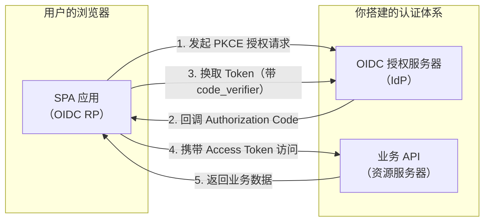
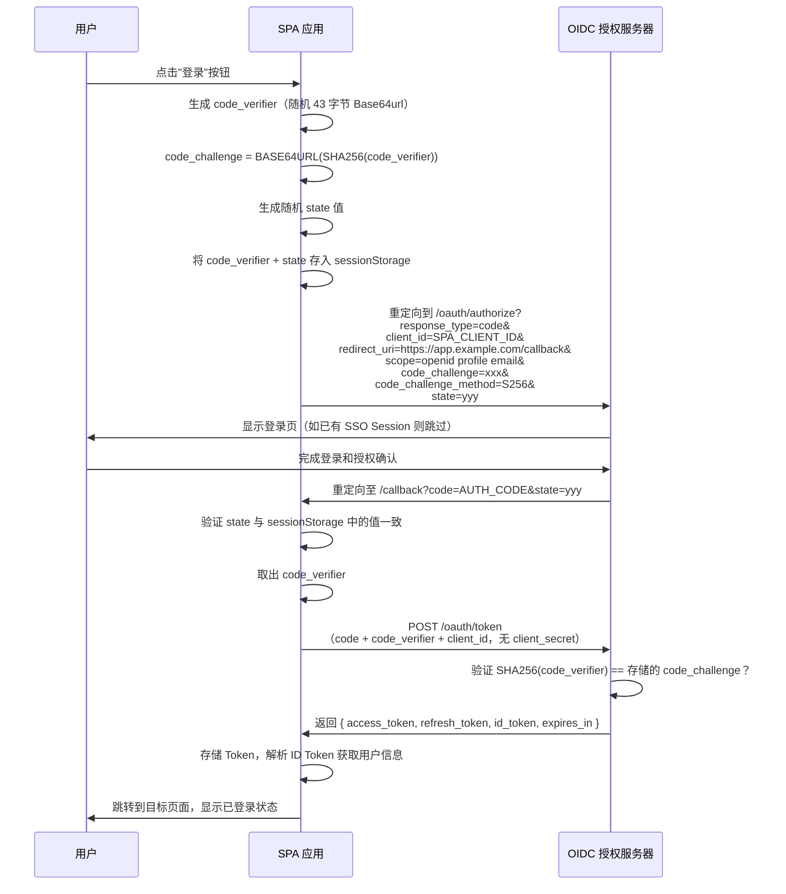
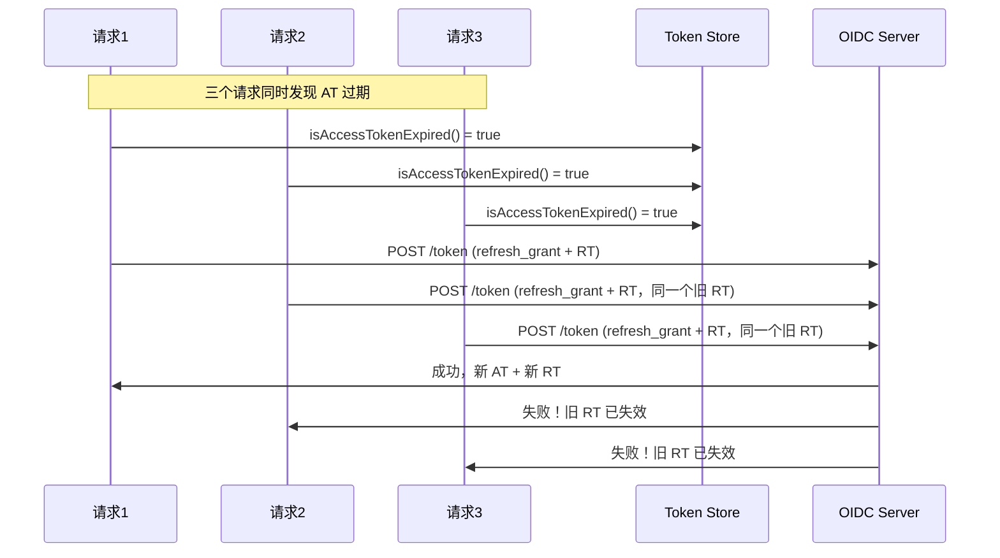
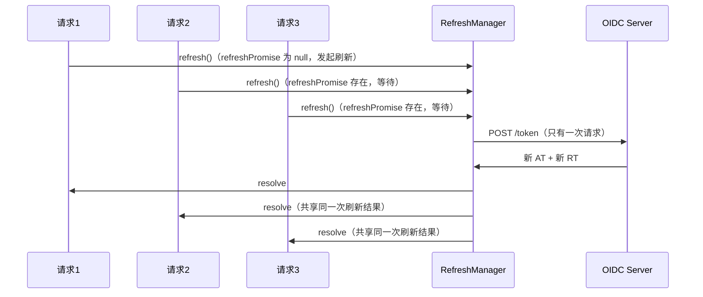

# Web 应用接入（纯前端模式）

## 本篇导读

### 核心目标

学完本篇后，你将能够：

- 理解 SPA（单页应用）作为 OIDC 依赖方（Relying Party）接入认证服务的完整架构
- 实现基于 PKCE 的授权码流程，保证公开客户端的安全性
- 掌握前端 Token 存储的三种方案及其安全权衡，并做出正确选择
- 实现 Access Token 的自动静默刷新机制，配合并发刷新防护
- 实现基于 `iframe` 的静默认证（`prompt=none`），让用户无感知地检测已有登录态
- 实现多标签页登录状态同步，避免用户在一个标签页退出后，其他标签页仍显示已登录

### 重点与难点

**重点**：

- SPA 为什么 **必须** 使用 PKCE——没有服务端就没有 `client_secret`，PKCE 是唯一的安全手段
- Token 存储的选择依据——内存存储 vs `localStorage` vs `sessionStorage`，各有什么代价
- Token 刷新的时机和并发控制——如何避免多个请求同时触发刷新导致的竞态条件

**难点**：

- `iframe` 静默认证的跨域限制——为什么现代浏览器的第三方 Cookie 限制会让这套方案逐渐失效
- 多标签页同步的边界情况——`BroadcastChannel` 和 `storage` 事件各自的适用场景
- Token 轮转（Refresh Token Rotation）在前端的处理——新旧 Refresh Token 的安全替换

## 纯前端模式的角色与定位

### SPA 作为 OIDC 依赖方

在我们搭建的整体认证架构中，SPA（Single Page Application）扮演的是 **OIDC 依赖方（Relying Party，简称 RP）** 的角色。



"依赖方"这个名字来自 OIDC 规范——SPA **依赖** 认证服务颁发的 ID Token 来判断用户身份，所以叫做依赖方。在第三方登录语境里，SPA 是"客户端应用"；在 API 访问语境里，SPA 通过 Access Token 访问资源服务器。

### 纯前端模式的本质约束

纯前端模式有一个根本性的约束：**所有代码对用户（或攻击者）可见**。

- JavaScript 代码，即使经过压缩和混淆，在浏览器的开发者工具里可以查看
- 写死在代码里的任何"秘密"（`client_secret`）都会被发现
- 浏览器本地存储（`localStorage`、`sessionStorage`、内存）对同源 JavaScript 完全可读

这个约束决定了：

- SPA 必须注册为 **公开客户端（Public Client）**，没有 `client_secret`
- 取而代之的是 PKCE（Proof Key for Code Exchange），用动态生成的密钥对代替静态的 `client_secret`
- Token 存储必须认真权衡安全风险

### 纯前端模式 vs BFF 模式

选择用哪种模式接入，取决于你的应用场景：

| 对比维度     | 纯前端模式（SPA）                        | BFF 模式                              |
| ------------ | ---------------------------------------- | ------------------------------------- |
| 架构复杂度   | 低，无需专用后端中间层                   | 高，需要维护 BFF 服务                 |
| Token 安全性 | Token 在浏览器内存/存储中                | Token 只在服务端，前端不接触          |
| XSS 攻击影响 | XSS 可窃取 Token                         | XSS 无法窃取 Token（Cookie HttpOnly） |
| CSRF 防护    | 不使用 Cookie 携带 Token，天然免疫 CSRF  | 需要主动防护 CSRF                     |
| 适用场景     | 对安全要求适中的工具类应用、内部系统     | 金融、医疗等高安全场景                |
| 静默刷新     | 需要 iframe 或轮询，有第三方 Cookie 限制 | 服务端自动完成，用户无感知            |

**本篇专注于纯前端模式**，BFF 模式在下一篇讲解。

## PKCE 授权码流程实现

### 完整流程时序



### PKCE 工具函数

首先实现 PKCE 所需的两个工具函数。Web Crypto API 是现代浏览器的内置 API，不需要额外依赖：

```typescript
// src/auth/pkce.ts

/**
 * 生成 code_verifier（43 字节随机 Base64url 字符串）
 * RFC 7636 规定长度范围是 43-128，推荐 43 字节
 */
export function generateCodeVerifier(): string {
  const bytes = new Uint8Array(43);
  crypto.getRandomValues(bytes);
  return base64UrlEncode(bytes);
}

/**
 * 由 code_verifier 生成 code_challenge（S256 方法）
 * code_challenge = BASE64URL(SHA256(ASCII(code_verifier)))
 */
export async function generateCodeChallenge(verifier: string): Promise<string> {
  const encoder = new TextEncoder();
  const data = encoder.encode(verifier);
  const digest = await crypto.subtle.digest('SHA-256', data);
  return base64UrlEncode(new Uint8Array(digest));
}

/**
 * 将 Uint8Array 编码为 Base64url（不含填充符 =）
 */
function base64UrlEncode(bytes: Uint8Array): string {
  const base64 = btoa(String.fromCharCode(...bytes));
  return base64.replace(/\+/g, '-').replace(/\//g, '_').replace(/=/g, '');
}

/**
 * 生成随机 state（用于 CSRF 防护）
 */
export function generateState(): string {
  const bytes = new Uint8Array(32);
  crypto.getRandomValues(bytes);
  return base64UrlEncode(bytes);
}
```

### 发起登录：构造授权 URL 并跳转

```typescript
// src/auth/auth.service.ts

const OIDC_CONFIG = {
  authorizeEndpoint: 'https://auth.example.com/oauth/authorize',
  tokenEndpoint: 'https://auth.example.com/oauth/token',
  clientId: 'spa-app-client-id', // 注册在 OIDC 服务器上的公开客户端 ID
  redirectUri: 'https://app.example.com/callback',
  scopes: ['openid', 'profile', 'email'],
};

export async function startLogin(returnTo?: string): Promise<void> {
  // 1. 生成 PKCE 参数
  const codeVerifier = generateCodeVerifier();
  const codeChallenge = await generateCodeChallenge(codeVerifier);

  // 2. 生成 state（CSRF 防护）
  //    state 中可以内嵌要返回的页面路径，登录完成后跳转回去
  const statePayload = {
    nonce: generateState(),
    returnTo: returnTo ?? window.location.pathname,
  };
  const state = btoa(JSON.stringify(statePayload));

  // 3. 将 code_verifier 和 state 存入 sessionStorage
  //    不用 localStorage：sessionStorage 在标签页关闭后自动清除，
  //    而且不会被其他标签页读取，降低泄露面
  sessionStorage.setItem('pkce_code_verifier', codeVerifier);
  sessionStorage.setItem('oauth_state', state);

  // 4. 构造授权 URL
  const params = new URLSearchParams({
    response_type: 'code',
    client_id: OIDC_CONFIG.clientId,
    redirect_uri: OIDC_CONFIG.redirectUri,
    scope: OIDC_CONFIG.scopes.join(' '),
    code_challenge: codeChallenge,
    code_challenge_method: 'S256',
    state,
  });

  const authorizeUrl = `${OIDC_CONFIG.authorizeEndpoint}?${params.toString()}`;

  // 5. 跳转到 OIDC 授权服务器
  window.location.href = authorizeUrl;
}
```

### 处理回调：验证 state 并换取 Token

```typescript
// src/auth/callback.ts

export async function handleCallback(): Promise<void> {
  const urlParams = new URLSearchParams(window.location.search);
  const code = urlParams.get('code');
  const returnedState = urlParams.get('state');
  const error = urlParams.get('error');
  const errorDescription = urlParams.get('error_description');

  // 处理授权服务器返回的错误
  if (error) {
    throw new AuthError(`Authorization failed: ${error} - ${errorDescription}`);
  }

  if (!code || !returnedState) {
    throw new AuthError('Missing code or state in callback');
  }

  // 1. 验证 state（CSRF 防护）
  const storedState = sessionStorage.getItem('oauth_state');
  if (!storedState || returnedState !== storedState) {
    // state 不匹配，可能是 CSRF 攻击，立即终止
    throw new AuthError('State mismatch - possible CSRF attack');
  }

  // 2. 取出 code_verifier
  const codeVerifier = sessionStorage.getItem('pkce_code_verifier');
  if (!codeVerifier) {
    throw new AuthError('Missing code verifier');
  }

  // 3. 清除 sessionStorage 中的临时数据
  sessionStorage.removeItem('pkce_code_verifier');
  sessionStorage.removeItem('oauth_state');

  // 4. 用授权码换取 Token
  const tokenResponse = await exchangeCodeForTokens(code, codeVerifier);

  // 5. 存储 Token（见下一节）
  await tokenStore.save(tokenResponse);

  // 6. 解析 state 中的 returnTo，跳转回目标页面
  try {
    const statePayload = JSON.parse(atob(returnedState));
    window.history.replaceState({}, '', statePayload.returnTo ?? '/');
  } catch {
    window.history.replaceState({}, '', '/');
  }
}

async function exchangeCodeForTokens(
  code: string,
  codeVerifier: string
): Promise<TokenResponse> {
  const response = await fetch(OIDC_CONFIG.tokenEndpoint, {
    method: 'POST',
    headers: {
      'Content-Type': 'application/x-www-form-urlencoded',
    },
    body: new URLSearchParams({
      grant_type: 'authorization_code',
      code,
      client_id: OIDC_CONFIG.clientId,
      redirect_uri: OIDC_CONFIG.redirectUri,
      code_verifier: codeVerifier, // 不是 code_challenge，是原始的 verifier
      // 注意：公开客户端没有 client_secret
    }),
  });

  if (!response.ok) {
    const error = await response.json();
    throw new AuthError(`Token exchange failed: ${error.error_description}`);
  }

  return response.json() as Promise<TokenResponse>;
}

interface TokenResponse {
  access_token: string;
  refresh_token?: string;
  id_token: string;
  expires_in: number; // Access Token 过期秒数（通常 300-900 秒）
  token_type: 'Bearer';
}
```

### 在 React Router 中配置回调路由

使用 TanStack Router 配置 `/callback` 路由，处理 OIDC 回调：

```typescript
// src/routes/callback.tsx
import { createFileRoute, useNavigate } from '@tanstack/react-router';
import { useEffect, useState } from 'react';
import { handleCallback } from '@/auth/callback';

export const Route = createFileRoute('/callback')({
  component: CallbackPage,
});

function CallbackPage() {
  const navigate = useNavigate();
  const [error, setError] = useState<string | null>(null);

  useEffect(() => {
    handleCallback()
      .then(() => {
        // handleCallback 内部已经处理了 returnTo 跳转
        // 但如果使用 React Router 管理路由，这里用 navigate
        navigate({ to: '/', replace: true });
      })
      .catch((err: Error) => {
        setError(err.message);
      });
  }, [navigate]);

  if (error) {
    return (
      <div>
        <h1>登录失败</h1>
        <p>{error}</p>
        <button onClick={() => navigate({ to: '/' })}>返回首页</button>
      </div>
    );
  }

  return <div>正在处理登录，请稍候...</div>;
}
```

## Token 存储策略

这是纯前端 OIDC 接入中争议最多、最需要深入理解的话题：**Token 存储在哪里？**

### 三种存储方案对比

#### 方案一：内存存储（JavaScript 变量）

Token 只存在于 JavaScript 变量中，不持久化到任何浏览器存储：

```typescript
// src/auth/token-store.ts

class MemoryTokenStore {
  private accessToken: string | null = null;
  private refreshToken: string | null = null;
  private idToken: string | null = null;
  private accessTokenExpiresAt: number = 0;

  save(response: TokenResponse): void {
    this.accessToken = response.access_token;
    this.refreshToken = response.refresh_token ?? null;
    this.idToken = response.id_token;
    // 提前 30 秒视为过期，留出刷新窗口
    this.accessTokenExpiresAt = Date.now() + (response.expires_in - 30) * 1000;
  }

  getAccessToken(): string | null {
    return this.accessToken;
  }

  getRefreshToken(): string | null {
    return this.refreshToken;
  }

  isAccessTokenExpired(): boolean {
    return Date.now() >= this.accessTokenExpiresAt;
  }

  clear(): void {
    this.accessToken = null;
    this.refreshToken = null;
    this.idToken = null;
    this.accessTokenExpiresAt = 0;
  }
}

export const tokenStore = new MemoryTokenStore();
```

**优点**：

- **最高安全性**：XSS 脚本无法通过 `localStorage.getItem()` 或 `document.cookie` 直接读取 Token（但仍能通过注入脚本读取内存变量，这点常被误解）
- Refresh Token 不持久化到磁盘，浏览器进程结束后即消失

**缺点**：

- **刷新页面丢失登录态**：用户按 F5 后，内存变量被清空，需要重新走完整登录流程（除非有静默认证保底）
- **多标签页独立**：每个标签页独立维护一份内存，一个标签页刷新不影响其他标签页，但也无法共享登录态
- 依赖静默认证（`iframe` + `prompt=none`）来恢复登录态，而静默认证有第三方 Cookie 限制

#### 方案二：localStorage 存储

```typescript
class LocalStorageTokenStore {
  private readonly KEYS = {
    ACCESS_TOKEN: 'auth_access_token',
    REFRESH_TOKEN: 'auth_refresh_token',
    ID_TOKEN: 'auth_id_token',
    EXPIRES_AT: 'auth_expires_at',
  };

  save(response: TokenResponse): void {
    localStorage.setItem(this.KEYS.ACCESS_TOKEN, response.access_token);
    if (response.refresh_token) {
      localStorage.setItem(this.KEYS.REFRESH_TOKEN, response.refresh_token);
    }
    localStorage.setItem(this.KEYS.ID_TOKEN, response.id_token);
    const expiresAt = Date.now() + (response.expires_in - 30) * 1000;
    localStorage.setItem(this.KEYS.EXPIRES_AT, String(expiresAt));
  }

  getAccessToken(): string | null {
    return localStorage.getItem(this.KEYS.ACCESS_TOKEN);
  }

  isAccessTokenExpired(): boolean {
    const expiresAt = Number(localStorage.getItem(this.KEYS.EXPIRES_AT) ?? 0);
    return Date.now() >= expiresAt;
  }

  clear(): void {
    Object.values(this.KEYS).forEach((key) => localStorage.removeItem(key));
  }
}
```

**优点**：

- **持久化**：刷新页面后登录态依然存在，刷新时直接从 `localStorage` 读取，无需走完整流程
- **多标签页共享**：所有同源标签页共享同一份 `localStorage`，用户在一个标签页登录后，其他标签页也能读到 Token

**缺点**：

- **XSS 风险高**：任何通过 XSS 注入的脚本都能调用 `localStorage.getItem('auth_access_token')` 直接拿走 Token。这是最严重的缺点——Token 一旦被盗，攻击者在 Token 有效期内完全冒充用户
- Refresh Token 存入 `localStorage` 尤为危险：Refresh Token 有效期远长于 Access Token，意味着攻击者可以持续刷新 Access Token

#### 方案三：sessionStorage 存储

行为介于内存和 `localStorage` 之间：

- 与 `localStorage` 一样，以 key-value 持久存储在浏览器中
- 与 `localStorage` 不同的是：sessionStorage 在 **标签页关闭** 时清除，且 **不在标签页之间共享**

**优点**：不会跨标签页共享，关闭标签页后自动清除

**缺点**：同样存在 XSS 风险（XSS 代码与页面同源，能读取同源 sessionStorage）；刷新页面时数据保留（与直觉相反，F5 不清除 sessionStorage，只有关闭标签页才清除）

### 正确的选择：分级存储策略

综合权衡，推荐的做法是：**Access Token 用内存，Refresh Token 视情况选择**。

```typescript
// src/auth/token-store.ts

/**
 * 分级 Token 存储：
 * - Access Token：仅内存，过期短（5-15 分钟），泄露影响有限
 * - Refresh Token：根据"记住登录"配置决定
 *   - 不勾选"记住登录"：存 sessionStorage（关闭浏览器即失效）
 *   - 勾选"记住登录"：存 localStorage（持久化），但要接受 XSS 风险
 */
class HybridTokenStore {
  private accessToken: string | null = null;
  private accessTokenExpiresAt: number = 0;
  private idToken: string | null = null;
  private user: UserInfo | null = null;

  private readonly REFRESH_TOKEN_KEY = 'auth_refresh_token';
  private readonly REMEMBER_ME_KEY = 'auth_remember_me';

  save(response: TokenResponse, rememberMe = false): void {
    // Access Token 和 ID Token 只存内存
    this.accessToken = response.access_token;
    this.idToken = response.id_token;
    this.accessTokenExpiresAt = Date.now() + (response.expires_in - 30) * 1000;
    this.user = parseIdToken(response.id_token);

    // Refresh Token 根据 rememberMe 决定存储位置
    if (response.refresh_token) {
      if (rememberMe) {
        localStorage.setItem(this.REFRESH_TOKEN_KEY, response.refresh_token);
        localStorage.setItem(this.REMEMBER_ME_KEY, 'true');
      } else {
        sessionStorage.setItem(this.REFRESH_TOKEN_KEY, response.refresh_token);
      }
    }
  }

  getAccessToken(): string | null {
    return this.accessToken;
  }

  getRefreshToken(): string | null {
    // 先查 sessionStorage，再查 localStorage
    return (
      sessionStorage.getItem(this.REFRESH_TOKEN_KEY) ??
      localStorage.getItem(this.REFRESH_TOKEN_KEY)
    );
  }

  isAccessTokenExpired(): boolean {
    // 没有 Access Token，视为已过期
    if (!this.accessToken) return true;
    return Date.now() >= this.accessTokenExpiresAt;
  }

  getUser(): UserInfo | null {
    return this.user;
  }

  clear(): void {
    this.accessToken = null;
    this.accessTokenExpiresAt = 0;
    this.idToken = null;
    this.user = null;
    sessionStorage.removeItem(this.REFRESH_TOKEN_KEY);
    localStorage.removeItem(this.REFRESH_TOKEN_KEY);
    localStorage.removeItem(this.REMEMBER_ME_KEY);
  }
}

export const tokenStore = new HybridTokenStore();
```

### 解析 ID Token 获取用户信息

JWT 的 Payload 部分是 Base64url 编码的 JSON，在前端可以直接解析（无需验证签名——验签需要公钥，前端可以做但复杂；对于 ID Token 来说，它是直接从 OIDC 服务器 Token 端点返回的，通过 HTTPS 传输，已经有了传输层保证，前端不验签是可以接受的实践）：

```typescript
// src/auth/id-token.ts

interface IdTokenClaims {
  sub: string; // 用户唯一 ID
  email: string;
  name: string;
  picture?: string;
  given_name?: string;
  family_name?: string;
  iat: number; // Token 颁发时间（Unix 时间戳）
  exp: number; // Token 过期时间
  iss: string; // 颁发者（OIDC 服务器 URL）
  aud: string; // 受众（你的 client_id）
  auth_time?: number; // 用户实际认证时间
  nonce?: string;
}

function parseIdToken(idToken: string): UserInfo {
  // JWT 结构：header.payload.signature，我们只需要 payload
  const parts = idToken.split('.');
  if (parts.length !== 3) {
    throw new Error('Invalid ID Token format');
  }

  // Base64url 解码 payload
  const payload = parts[1];
  // 补全 base64url 到 base64 所需的填充
  const padded = payload + '='.repeat((4 - (payload.length % 4)) % 4);
  const decoded = atob(padded.replace(/-/g, '+').replace(/_/g, '/'));

  const claims = JSON.parse(decoded) as IdTokenClaims;

  // 基本验证：颁发者是否是我们的 OIDC 服务器
  if (claims.iss !== 'https://auth.example.com') {
    throw new Error('Invalid token issuer');
  }

  // 基本验证：受众是否是我们的 client_id
  if (claims.aud !== OIDC_CONFIG.clientId) {
    throw new Error('Invalid token audience');
  }

  // 基本验证：Token 是否过期
  if (claims.exp < Math.floor(Date.now() / 1000)) {
    throw new Error('ID Token expired');
  }

  return {
    id: claims.sub,
    email: claims.email,
    name: claims.name,
    avatar: claims.picture,
  };
}
```

## Token 刷新管理

### Access Token 的过期处理

Access Token 通常有效期很短（5-15 分钟），在用户会话期间需要多次刷新。

处理刷新有两种策略：

**策略一：请求前检查（Proactive Refresh）**

在发出任何 API 请求前，主动检查 Access Token 是否临近过期，如果是则先刷新再请求：

```typescript
// src/auth/http-client.ts

export async function authenticatedFetch(
  url: string,
  options: RequestInit = {}
): Promise<Response> {
  // 如果 Access Token 过期，先刷新
  if (tokenStore.isAccessTokenExpired()) {
    await refreshAccessToken();
  }

  const accessToken = tokenStore.getAccessToken();
  if (!accessToken) {
    throw new AuthError('Not authenticated');
  }

  return fetch(url, {
    ...options,
    headers: {
      ...options.headers,
      Authorization: `Bearer ${accessToken}`,
    },
  });
}
```

**策略二：请求失败后重试（Reactive Refresh）**

先发出请求，如果收到 401 则刷新 Token 后重试一次：

```typescript
export async function authenticatedFetch(
  url: string,
  options: RequestInit = {}
): Promise<Response> {
  const makeRequest = async (): Promise<Response> => {
    const accessToken = tokenStore.getAccessToken();
    return fetch(url, {
      ...options,
      headers: {
        ...options.headers,
        ...(accessToken ? { Authorization: `Bearer ${accessToken}` } : {}),
      },
    });
  };

  let response = await makeRequest();

  if (response.status === 401) {
    // Token 无效或过期，尝试刷新
    try {
      await refreshAccessToken();
      // 刷新成功，重试原始请求
      response = await makeRequest();
    } catch {
      // 刷新失败（Refresh Token 也失效），强制重新登录
      tokenStore.clear();
      await startLogin(window.location.pathname);
      throw new AuthError('Session expired, redirecting to login');
    }
  }

  return response;
}
```

实践中两种策略可以结合：Proactive 减少一次不必要的 401 往返，Reactive 作为兜底处理 Token 提前失效的情况（如服务端主动吊销）。

### 并发刷新防护

这是 Token 刷新中最容易踩坑的地方：当多个并发请求同时发现 Token 过期，它们会各自发起刷新请求，导致：

1. 多个刷新请求同时发给 OIDC 服务器
2. 服务器上第一请求刷新成功，Refresh Token 被轮转（旧 RT 失效，新 RT 发给第一个请求）
3. 第二、三个刷新请求到达服务器时，携带的是已失效的旧 Refresh Token
4. 服务器返回错误，第二、三个请求失败
5. 用户被强制登出



**解决方案：刷新锁（Promise 复用）**

核心思想：第一个发现 Token 过期的请求发起刷新，后续请求等待同一个 Promise 的结果，而不是各自发起新的刷新请求：

```typescript
// src/auth/refresh.ts

class TokenRefreshManager {
  // 正在进行中的刷新 Promise，null 表示当前没有刷新
  private refreshPromise: Promise<void> | null = null;

  async refresh(): Promise<void> {
    // 如果已经有一个刷新在进行中，直接等待它完成
    if (this.refreshPromise) {
      return this.refreshPromise;
    }

    // 没有刷新在进行，发起新的刷新
    this.refreshPromise = this.doRefresh().finally(() => {
      // 刷新完成（无论成功还是失败），清除锁
      this.refreshPromise = null;
    });

    return this.refreshPromise;
  }

  private async doRefresh(): Promise<void> {
    const refreshToken = tokenStore.getRefreshToken();
    if (!refreshToken) {
      throw new AuthError('No refresh token available');
    }

    const response = await fetch(OIDC_CONFIG.tokenEndpoint, {
      method: 'POST',
      headers: {
        'Content-Type': 'application/x-www-form-urlencoded',
      },
      body: new URLSearchParams({
        grant_type: 'refresh_token',
        refresh_token: refreshToken,
        client_id: OIDC_CONFIG.clientId,
      }),
    });

    if (!response.ok) {
      // Refresh Token 失效，清除所有 Token
      tokenStore.clear();
      throw new AuthError('Refresh token invalid');
    }

    const tokens: TokenResponse = await response.json();
    // 保存新 Token（包括可能轮转的新 Refresh Token）
    tokenStore.save(tokens);
  }
}

export const tokenRefreshManager = new TokenRefreshManager();

// 对外暴露的刷新函数
export async function refreshAccessToken(): Promise<void> {
  return tokenRefreshManager.refresh();
}
```

现在并发的多个请求会共享同一次刷新：



## 静默认证（Silent Authentication）

### 什么是静默认证

静默认证解决的问题是：**内存中的 Access Token 在页面刷新后丢失，如何在不打扰用户（不跳转到登录页）的情况下恢复登录态？**

OIDC 提供了 `prompt=none` 参数：让浏览器以"静默模式"发起一次授权请求——如果用户在 OIDC 服务器有有效的 SSO Session，直接返回新的 Token/Code；如果没有，不显示任何 UI，直接返回错误 `login_required`。

### 基于 iframe 的实现

SPA 通常用 `iframe` 来实现静默认证，避免主页面发生跳转：

```typescript
// src/auth/silent-auth.ts

export async function trySilentAuthentication(): Promise<boolean> {
  return new Promise((resolve) => {
    // 1. 构造 prompt=none 的授权 URL
    const silentParams = new URLSearchParams({
      response_type: 'code',
      client_id: OIDC_CONFIG.clientId,
      redirect_uri: OIDC_CONFIG.silentRedirectUri, // 专用于静默认证的回调页面
      scope: OIDC_CONFIG.scopes.join(' '),
      prompt: 'none', // 关键：不显示任何 UI
      code_challenge_method: 'S256',
      // PKCE 参数也需要，因为回调时要换 Token
      // 实际实现中需要先生成 PKCE 并存储
    });

    // 2. 创建隐藏的 iframe
    const iframe = document.createElement('iframe');
    iframe.style.display = 'none';
    iframe.src = `${OIDC_CONFIG.authorizeEndpoint}?${silentParams.toString()}`;
    document.body.appendChild(iframe);

    // 3. 超时处理：如果 10 秒内没有响应，视为失败
    const timeout = setTimeout(() => {
      cleanup();
      resolve(false);
    }, 10_000);

    // 4. 监听来自静默回调页面的消息
    const messageHandler = (event: MessageEvent) => {
      // 验证消息来源（必须来自我们的 OIDC 服务器的 silent-callback 页面）
      if (event.origin !== 'https://app.example.com') return;

      if (event.data?.type === 'silent_auth_success') {
        // 静默认证成功，iframe 已经完成了 Token 换取和存储
        tokenStore.save(event.data.tokens);
        cleanup();
        resolve(true);
      } else if (event.data?.type === 'silent_auth_failure') {
        // 用户没有有效的 SSO Session
        cleanup();
        resolve(false);
      }
    };

    window.addEventListener('message', messageHandler);

    function cleanup() {
      clearTimeout(timeout);
      window.removeEventListener('message', messageHandler);
      if (document.body.contains(iframe)) {
        document.body.removeChild(iframe);
      }
    }
  });
}
```

静默回调页面（`/silent-callback`）是一个轻量级页面，完成 Token 换取后通过 `postMessage` 通知父页面：

```typescript
// src/pages/SilentCallback.tsx
// 这个页面在 iframe 中加载，处理 prompt=none 回调

useEffect(() => {
  const urlParams = new URLSearchParams(window.location.search);
  const code = urlParams.get('code');
  const error = urlParams.get('error');

  if (error) {
    // login_required 或其他错误
    window.parent.postMessage(
      { type: 'silent_auth_failure', error },
      window.location.origin
    );
    return;
  }

  if (code) {
    // 换取 Token 后通知父页面
    exchangeCodeForTokens(code, codeVerifier)
      .then((tokens) => {
        window.parent.postMessage(
          { type: 'silent_auth_success', tokens },
          window.location.origin
        );
      })
      .catch(() => {
        window.parent.postMessage(
          { type: 'silent_auth_failure', error: 'exchange_failed' },
          window.location.origin
        );
      });
  }
}, []);
```

### 第三方 Cookie 的限制与替代方案

`iframe` 静默认证的工作前提是：**iframe 中的 OIDC 服务器页面能读取到用户的 SSO Session Cookie**。

但现代浏览器正在逐步限制第三方 Cookie：

- **Safari（ITP）**：默认阻止第三方 Cookie，`iframe` 中无法读取不同域的 Cookie
- **Chrome**：2024 年起逐步淘汰第三方 Cookie（Privacy Sandbox）
- **Firefox**：默认启用 Total Cookie Protection

**影响**：如果 SPA 部署在 `app.example.com`，OIDC 服务器在 `auth.example.com`，那么在 `app.example.com` 页面中嵌入指向 `auth.example.com` 的 iframe，Safari 这类浏览器会阻止 `auth.example.com` 的 SSO Session Cookie，导致静默认证永远返回 `login_required`。

**应对策略**：

1. **相同顶级域名**：将 SPA 和 OIDC 服务器部署在同一顶级域名下（如 `app.example.com` 和 `auth.example.com`），便可以使用 `domain=.example.com` 的 Cookie，Safari 不会阻止同一顶级域名的 Cookie
2. **使用 Refresh Token 恢复**：页面加载时，先尝试用存储的 Refresh Token（sessionStorage/localStorage）换取新 Access Token，不依赖 iframe
3. **迁移至 BFF 模式**：把 Token 管理移到服务端，用 HttpOnly Cookie 维持 Session，完全绕开第三方 Cookie 问题

推荐的页面加载时初始化顺序：

```typescript
// src/auth/auth-initializer.ts

export async function initializeAuth(): Promise<void> {
  // 1. 优先尝试用 Refresh Token 恢复（不依赖 iframe，更可靠）
  const refreshToken = tokenStore.getRefreshToken();
  if (refreshToken) {
    try {
      await refreshAccessToken();
      return; // 恢复成功
    } catch {
      // Refresh Token 失效，继续尝试静默认证
    }
  }

  // 2. 尝试 iframe 静默认证
  const silentSuccess = await trySilentAuthentication();
  if (silentSuccess) {
    return;
  }

  // 3. 都失败，用户需要重新登录（但不强制跳转，让路由守卫来决定）
  tokenStore.clear();
}
```

## 多标签页同步

### 问题场景

用户用两个标签页打开你的应用：

- 标签页 A：用户正在操作
- 标签页 B：用户执行了退出登录

退出登录后，标签页 A 的内存中还有旧的 Access Token，页面还显示"已登录"状态。如果用户在标签页 A 发起 API 请求，得到 401 才意识到自己已经退出了。

更严重的场景：一个标签页发现用户身份切换了（Refresh Token 换出来的用户 ID 变了），当前标签页必须知道这件事。

### 方案一：BroadcastChannel API

`BroadcastChannel` 允许同源的页面/标签页之间发消息，是多标签页通信的现代方案：

```typescript
// src/auth/auth-broadcast.ts

type AuthEvent =
  | { type: 'logout' }
  | { type: 'token_refreshed'; userId: string }
  | { type: 'login'; userId: string };

class AuthBroadcast {
  private channel: BroadcastChannel;

  constructor() {
    this.channel = new BroadcastChannel('auth_sync');
    this.channel.onmessage = this.handleMessage.bind(this);
  }

  // 发送认证事件给其他标签页
  broadcast(event: AuthEvent): void {
    this.channel.postMessage(event);
  }

  private handleMessage(event: MessageEvent<AuthEvent>): void {
    const data = event.data;

    switch (data.type) {
      case 'logout':
        // 当前标签页也执行退出操作
        tokenStore.clear();
        // 通知 React 更新状态（可以用全局状态库或事件）
        authState.setUser(null);
        break;

      case 'token_refreshed':
        // 另一个标签页刷新了 Token，检查是否是同一用户
        if (data.userId !== authState.getUserId()) {
          // 用户已切换，强制本标签页重新加载
          window.location.reload();
        }
        break;

      case 'login':
        // 另一个标签页登录了，当前页面可以提示用户刷新
        if (!authState.isAuthenticated()) {
          authState.setNeedsRefresh(true);
        }
        break;
    }
  }

  destroy(): void {
    this.channel.close();
  }
}

export const authBroadcast = new AuthBroadcast();
```

在退出登录时广播事件：

```typescript
export async function logout(): Promise<void> {
  // 1. 通知 OIDC 服务器撤销 Session（可选，如果服务器支持）
  await revokeTokens();

  // 2. 清除本地 Token
  tokenStore.clear();

  // 3. 广播退出事件给其他标签页
  authBroadcast.broadcast({ type: 'logout' });

  // 4. 更新本地 UI 状态
  authState.setUser(null);
}
```

### 方案二：storage 事件（兼容旧浏览器）

`BroadcastChannel` 的兼容性不如 `storage` 事件（`BroadcastChannel` 在 iOS Safari 15.4+ 才支持）。`storage` 事件在 `localStorage` 发生变化时触发，且 **只在 ** 其他 **标签页** 触发（当前修改 localStorage 的页面不触发自己的 storage 事件）：

```typescript
// src/auth/storage-sync.ts

export function initStorageSync(): void {
  window.addEventListener('storage', (event: StorageEvent) => {
    // 只关注我们的登录状态 key
    if (event.key === 'auth_logout_signal') {
      // 另一个标签页退出了
      tokenStore.clear();
      authState.setUser(null);
    }

    if (event.key === 'auth_login_signal') {
      // 另一个标签页登录了
      // storage 事件里 newValue 是新的值，可以包含登录信息
      if (!authState.isAuthenticated()) {
        // 尝试用新登录的 Refresh Token 恢复当前标签页的登录状态
        initializeAuth();
      }
    }
  });
}

// 退出时写入 localStorage 触发 storage 事件
export async function logout(): Promise<void> {
  tokenStore.clear();

  // 写入一个信号（其他标签页会收到 storage 事件）
  const signal = String(Date.now()); // 每次值不同，确保事件触发
  localStorage.setItem('auth_logout_signal', signal);
  // 可以立即删除，storage 事件已经发送出去了
  localStorage.removeItem('auth_logout_signal');
}
```

### 在 React 中集成认证状态

使用 React Context 管理全局认证状态：

```typescript
// src/auth/AuthProvider.tsx
import { createContext, useContext, useEffect, useState } from 'react';
import { initializeAuth } from './auth-initializer';
import { initStorageSync } from './storage-sync';

interface AuthContextValue {
  user: UserInfo | null;
  isLoading: boolean;
  isAuthenticated: boolean;
  login: (returnTo?: string) => void;
  logout: () => Promise<void>;
}

const AuthContext = createContext<AuthContextValue | null>(null);

export function AuthProvider({ children }: { children: React.ReactNode }) {
  const [user, setUser] = useState<UserInfo | null>(null);
  const [isLoading, setIsLoading] = useState(true);

  useEffect(() => {
    // 初始化认证状态（尝试用 Refresh Token 或静默认证恢复）
    initializeAuth()
      .then(() => {
        setUser(tokenStore.getUser());
      })
      .finally(() => {
        setIsLoading(false);
      });

    // 初始化跨标签页同步
    initStorageSync();
  }, []);

  const login = (returnTo?: string) => startLogin(returnTo);

  const logout = async () => {
    await logoutAction();
    setUser(null);
  };

  return (
    <AuthContext.Provider
      value={{
        user,
        isLoading,
        isAuthenticated: user !== null,
        login,
        logout,
      }}
    >
      {children}
    </AuthContext.Provider>
  );
}

export function useAuth(): AuthContextValue {
  const ctx = useContext(AuthContext);
  if (!ctx) throw new Error('useAuth must be used within AuthProvider');
  return ctx;
}
```

路由守卫（使用 TanStack Router 的 `beforeLoad`）：

```typescript
// src/routes/__root.tsx
import { createRootRoute, redirect } from '@tanstack/react-router';

export const Route = createRootRoute({
  beforeLoad: async ({ location }) => {
    // 检查是否需要登录
    if (
      !authState.isAuthenticated() &&
      !location.pathname.startsWith('/public')
    ) {
      // 保存当前路径，登录后跳回来
      throw redirect({
        to: '/login',
        search: { returnTo: location.href },
      });
    }
  },
});
```

## 常见问题与解决方案

### 问题一：SPA 在刷新页面后反复跳转到登录页

**症状**：用户刷新页面，SPA 进入"用户未登录 → 跳转登录 → 登录 → 回来 → 刷新 → 未登录"的死循环。

**原因**：

1. SPA 初始化时没有等待 `initializeAuth()` 完成就检查登录状态，拿到了"未登录"的瞬态判断
2. `initializeAuth()` 尝试用 Refresh Token 恢复，但 Refresh Token 存在 sessionStorage 中，标签页刷新时 sessionStorage 会保留（这是正确的），问题在于换取新 AT 的请求还没回来，路由守卫就已经开始检查了

**解决**：在应用根组件中，用 `isLoading` 状态保证 `initializeAuth()` 完成前不渲染路由：

```tsx
function App() {
  const { isLoading } = useAuth();

  if (isLoading) {
    return <div>初始化中...</div>;
  }

  return <RouterProvider router={router} />;
}
```

### 问题二：Refresh Token 轮转后登录态丢失

**症状**：用户正常使用，但隔一段时间突然被强制登出。

**原因**：Refresh Token 轮转（Rotation）意味着每次刷新后旧的 RT 作废。如果同时有两个标签页都成功刷新了 Token（并发刷新防护没有覆盖到跨标签页的情况），第一个标签页拿到新 RT 并存储，第二个标签页随后也拿到自己的新 RT 覆盖了存储。当第一个标签页下次需要刷新时，它从存储中读取的是第二个标签页存进去的 RT，但这个 RT 可能已经被第二个标签页自己消耗掉，导致 401。

**解决**：

1. 跨标签页也要共享刷新锁：使用 `localStorage` + `storage` 事件实现分布式刷新锁
2. 或者一个标签页刷新成功后，通过 `BroadcastChannel` 将新 Token 分发给其他标签页

```typescript
// 刷新成功后，广播新 Token 给其他标签页
async function doRefresh(): Promise<void> {
  // ... 刷新逻辑 ...
  const tokens = await fetchNewTokens();
  tokenStore.save(tokens);

  // 广播新 Refresh Token 的存储位置更新信号
  authBroadcast.broadcast({
    type: 'token_refreshed',
    userId: tokenStore.getUser()?.id ?? '',
  });
  // 注意：不要直接广播 RT 本身，RT 通过广播会扩大泄露面
}
```

### 问题三：state 参数损坏导致 CSRF 验证失败

**症状**：偶发性的"State mismatch"错误，用户无法完成登录。

**原因**：某些浏览器扩展、广告过滤插件、WAF 会修改跳转 URL 的参数，或者用户在授权页面恰好手动刷新了，导致 `sessionStorage` 中的 state 被清除。

**解决**：实现 state 的容错机制，或者捕捉 state mismatch 错误后直接重新发起登录（不报错给用户）：

```typescript
export async function handleCallback(): Promise<void> {
  // ...
  const storedState = sessionStorage.getItem('oauth_state');
  if (!storedState || returnedState !== storedState) {
    // 不向用户展示神秘的错误，直接重启登录流程
    console.warn('State mismatch detected, restarting login flow');
    await startLogin();
    return;
  }
  // ...
}
```

### 问题四：ID Token 中的数据与用户的实际信息不同步

**症状**：用户在设置页面修改了头像和昵称，但 SPA 显示的还是旧数据。

**原因**：ID Token 是一次性签发的 JWT，修改数据库中的用户信息不会让已颁发的 ID Token 失效。前端只能等待下次刷新或重新登录时拿到新的 ID Token。

**解决**：对于频繁变化的用户信息，不要只依赖 ID Token，而是调用 OIDC 的 `UserInfo` 端点获取最新信息：

```typescript
export async function fetchUserInfo(): Promise<UserInfo> {
  const response = await authenticatedFetch(
    'https://auth.example.com/oauth/userinfo'
  );

  if (!response.ok) {
    throw new Error('Failed to fetch user info');
  }

  return response.json() as Promise<UserInfo>;
}
```

应用初始化时，可以在 `initializeAuth()` 完成后调用一次 `fetchUserInfo()`，确保展示的是最新信息。

## 本篇小结

本篇覆盖了 SPA 以纯前端模式接入 OIDC 认证服务的完整实现：

**PKCE 安全基础**：公开客户端没有 `client_secret`，PKCE 通过动态生成的 `code_verifier` / `code_challenge` 对来保证 Token 交换的安全性。核心原理是：即使攻击者拦截到授权码 `code`，没有只存在客户端内存中的 `code_verifier`，也无法完成 Token 交换。

**Token 存储权衡**：没有完美的存储方案。推荐分级策略——Access Token 存内存（过期快、泄露影响小），Refresh Token 根据"记住登录"功能选择 sessionStorage 或 localStorage。核心认知：XSS 是前端 Token 最大的威胁，减少 Token 对存储的持久化是降低风险的有效手段。

**并发刷新防护**：多个请求同时检测到 Token 过期时，通过 Promise 复用（刷新锁）保证只发出一次刷新请求。这个细节在高并发场景下至关重要——不处理会因 Refresh Token 轮转导致用户莫名其妙被登出。

**静默认证的现实**：`iframe` + `prompt=none` 是 OIDC 规范的标准静默认证方案，但 Safari 的 ITP 和 Chrome 的第三方 Cookie 限制使得跨域场景下这套方案逐渐失效。优先依赖持久化的 Refresh Token 恢复登录态是更可靠的策略。

**多标签页同步**：`BroadcastChannel`（现代浏览器）或 `storage` 事件（兼容方案）可以在标签页之间同步退出登录事件，避免一个标签页退出而其他标签页还以为用户在线的问题。

如果你的应用对安全性要求更高（金融、医疗、B 端 SaaS），Token 不应该出现在前端，请阅读下一篇 **Web 应用接入（BFF 模式）**，了解如何将 Token 管理完全移到服务端。
