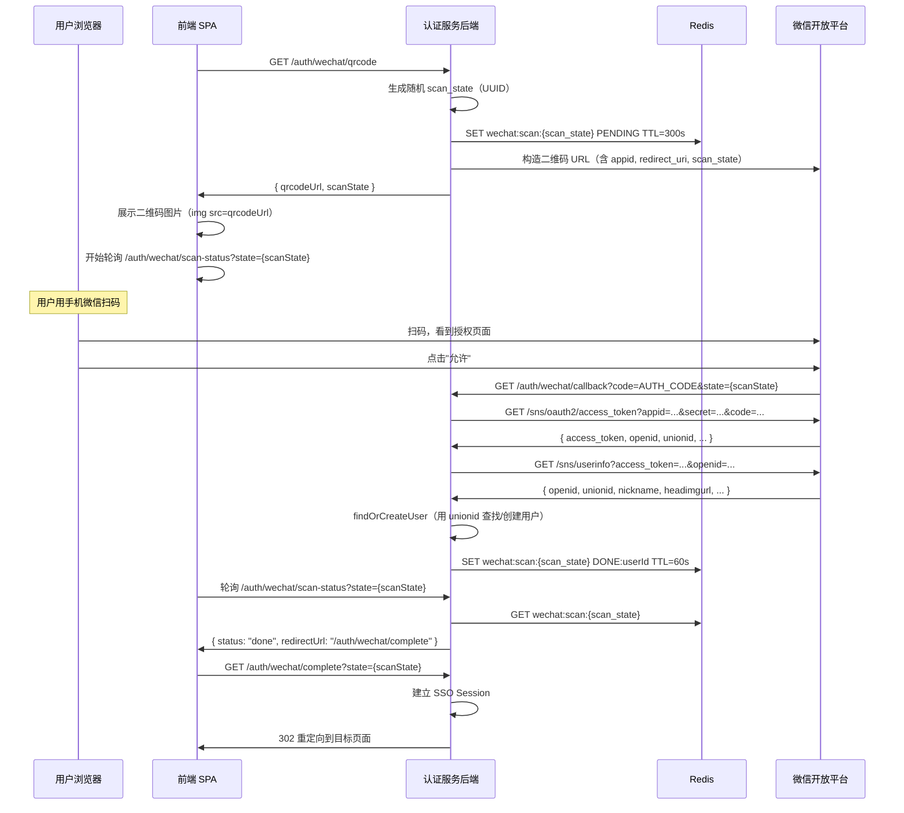

# 微信扫码登录集成

## 本篇导读

### 核心目标

学完本篇后，你将能够：

- 理解微信 OAuth2 与标准 OAuth2 的差异——为什么不能用通用库直接接入
- 实现微信扫码登录的完整流程：二维码生成 → 扫码轮询 → 授权回调 → 用户关联
- 理解 `openid` 与 `unionid` 的区别，以及何时使用哪个
- 处理微信特有的非标准 API 响应格式（非 JSON、错误码格式等）
- 实现轮询机制——用 Redis 存储扫码状态，前端定时检查是否扫码完成

### 重点与难点

**重点**：

- 微信开放平台 vs 微信公众平台：两套不同的接入体系，要接入扫码登录必须是开放平台
- `unionid` 的获取条件：用户必须关注了你的公众号，或者在微信开放平台绑定了应用，才能拿到 `unionid`
- 二维码状态轮询——如何用 Redis 实现高效的扫码状态管理

**难点**：

- 微信 API 错误处理——错误码不是通过 HTTP 状态码传递，而是通过 JSON 里的 `errcode` 字段
- 前端轮询的取消和超时处理——二维码过期后前端应该如何处理
- 与现有 SSO Session 的整合——扫码完成后如何无缝衔接已有的授权流程

## 微信 OAuth2 与标准 OAuth2 的差异

微信开放平台的 OAuth2 在协议结构上与标准 OAuth2 相似，但有大量非标准的实现细节：

| 特征           | 标准 OAuth2                         | 微信 OAuth2                                         |
| -------------- | ----------------------------------- | --------------------------------------------------- |
| 应用标识       | `client_id`                         | `appid`（术语不同）                                 |
| 应用密钥       | `client_secret`                     | `appsecret`（术语不同）                             |
| 授权端点       | 通常返回 JSON 错误                  | 部分错误直接返回 HTML 页面                          |
| Token 端点     | Content-Type: application/json      | Content-Type: text/plain（！）                      |
| Token 响应格式 | `{ access_token, expires_in, ... }` | `{ access_token, expires_in, openid, ... }`         |
| 错误格式       | `{ error, error_description }`      | `{ errcode, errmsg }`                               |
| 用户信息       | 通过 Bearer Token 调用 /userinfo    | 用 `access_token` + `openid` 作为 URL 参数          |
| 刷新 Token     | 标准 `refresh_token` grant          | 微信格式略有差异                                    |
| 唯一用户 ID    | OIDC 的 `sub`                       | 双 ID 体系：`openid`（按应用）+ `unionid`（跨应用） |

因此，不能用通用的 OAuth2/OIDC 客户端库（如 `openid-client`）直接接入微信，需要手动实现微信 API 调用。

## openid 与 unionid

这是微信 OAuth2 中最重要也最容易混淆的概念。

### openid：应用维度的用户 ID

`openid` 是用户在 **某个特定微信应用** 下的唯一 ID。同一个微信用户在应用 A 和应用 B 各自有不同的 `openid`。

```plaintext
用户 张三
  ├── 在公众号 A 的 openid: oAbcDef123
  ├── 在公众号 B 的 openid: oXyzUvw456
  └── 在开放平台应用 C 的 openid: oMnoQrs789
```

如果你用 `openid` 作为用户标识，换了应用（比如公众号换成独立 App），同一个用户就无法识别了。

### unionid：开放平台维度的用户 ID

`unionid` 是用户在 **同一个微信开放平台账号下** 所有应用中的统一 ID。只要你的多个应用（公众号、小程序、网站应用）都绑定在同一个开放平台账号下，同一个用户的 `unionid` 始终相同。

**结论**：用 `unionid` 作为第三方登录的 `providerUserId`，不要用 `openid`。

**但是**，`unionid` 不是总能拿到的——需要满足以下任一条件：

1. 用户关注了你绑定在开放平台的微信公众号
2. 用户已经在公众号或小程序内授权过（有历史记录）
3. 用户在网站应用中完成了扫码授权

在标准的扫码登录（用户用手机微信扫码）中，只要应用绑定了开放平台，通常可以拿到 `unionid`。

## 扫码登录完整流程



## 扫码状态的 Redis 设计

扫码登录的前后端解耦依赖 Redis 存储扫码状态：

```typescript
// 状态流转
type ScanStatus =
  | 'PENDING' // 等待扫码
  | 'SCANNED' // 已扫码，等待确认
  | `DONE:${string}` // 完成，值包含 userId
  | 'EXPIRED' // 已过期
  | 'ERROR'; // 出错

// Redis Key 结构
// wechat:scan:{scanState} → 状态值，TTL 300 秒
```

## WeChatService 实现

```typescript
// src/social/wechat/wechat.service.ts
import { Injectable } from '@nestjs/common';
import { ConfigService } from '@nestjs/config';
import { InjectRedis } from '@nestjs-modules/ioredis';
import Redis from 'ioredis';
import { randomUUID } from 'crypto';

interface WeChatTokenResponse {
  access_token: string;
  expires_in: number;
  refresh_token: string;
  openid: string;
  scope: string;
  unionid?: string;
  errcode?: number;
  errmsg?: string;
}

interface WeChatUserInfo {
  openid: string;
  nickname: string;
  sex: number;
  province: string;
  city: string;
  country: string;
  headimgurl: string;
  privilege: string[];
  unionid?: string;
  errcode?: number;
  errmsg?: string;
}

@Injectable()
export class WeChatService {
  private readonly appId: string;
  private readonly appSecret: string;
  private readonly callbackUrl: string;

  constructor(
    private readonly configService: ConfigService,
    @InjectRedis() private readonly redis: Redis
  ) {
    this.appId = configService.getOrThrow('WECHAT_APP_ID');
    this.appSecret = configService.getOrThrow('WECHAT_APP_SECRET');
    this.callbackUrl = `${configService.getOrThrow('APP_BASE_URL')}/auth/wechat/callback`;
  }

  // 生成二维码信息
  generateQrcode(): { qrcodeUrl: string; scanState: string } {
    const scanState = randomUUID();

    // 微信扫码授权 URL
    const params = new URLSearchParams({
      appid: this.appId,
      redirect_uri: this.callbackUrl,
      response_type: 'code',
      scope: 'snsapi_login', // 网站扫码登录必须用 snsapi_login
      state: scanState,
    });

    const qrcodeUrl =
      `https://open.weixin.qq.com/connect/qrconnect?` +
      params.toString() +
      `#wechat_redirect`;

    return { qrcodeUrl, scanState };
  }

  // 初始化扫码状态
  async initScanState(scanState: string): Promise<void> {
    await this.redis.setex(`wechat:scan:${scanState}`, 300, 'PENDING');
  }

  // 查询扫码状态
  async getScanStatus(scanState: string): Promise<string | null> {
    return await this.redis.get(`wechat:scan:${scanState}`);
  }

  // 用授权码换 Token
  async exchangeCodeForToken(code: string): Promise<WeChatTokenResponse> {
    const url =
      `https://api.weixin.qq.com/sns/oauth2/access_token?` +
      new URLSearchParams({
        appid: this.appId,
        secret: this.appSecret,
        code,
        grant_type: 'authorization_code',
      });

    const response = await fetch(url);
    // 注意：微信的 Token 端点返回 Content-Type: text/plain，需要 response.text() 再 JSON.parse
    const text = await response.text();
    const data = JSON.parse(text) as WeChatTokenResponse;

    if (data.errcode) {
      throw new Error(`微信 Token 交换失败: ${data.errcode} ${data.errmsg}`);
    }

    return data;
  }

  // 获取微信用户信息
  async getUserInfo(
    accessToken: string,
    openid: string
  ): Promise<WeChatUserInfo> {
    const url =
      `https://api.weixin.qq.com/sns/userinfo?` +
      new URLSearchParams({
        access_token: accessToken,
        openid,
        lang: 'zh_CN',
      });

    const response = await fetch(url);
    const data = (await response.json()) as WeChatUserInfo;

    if (data.errcode) {
      throw new Error(`微信用户信息获取失败: ${data.errcode} ${data.errmsg}`);
    }

    return data;
  }

  // 完成扫码，将用户 ID 写入 Redis
  async completeScan(scanState: string, userId: string): Promise<void> {
    // 扫码完成后，状态只需保留 60 秒（前端轮询拿到后即完成）
    await this.redis.setex(`wechat:scan:${scanState}`, 60, `DONE:${userId}`);
  }

  // 从 Redis 取出并删除扫码完成状态（一次性读取）
  async consumeScanResult(scanState: string): Promise<string | null> {
    const pipeline = this.redis.pipeline();
    pipeline.get(`wechat:scan:${scanState}`);
    pipeline.del(`wechat:scan:${scanState}`);
    const results = await pipeline.exec();
    const value = results?.[0]?.[1] as string | null;

    if (value?.startsWith('DONE:')) {
      return value.slice(5); // 返回 userId
    }
    return null;
  }
}
```

## WeChatController 实现

```typescript
// src/social/wechat/wechat.controller.ts
import { Controller, Get, Query, Req, Res } from '@nestjs/common';
import { Request, Response } from 'express';
import { WeChatService } from './wechat.service';
import { SocialAuthService } from '../social-auth.service';
import { SsoService } from '../../sso/sso.service';

@Controller('auth/wechat')
export class WeChatController {
  constructor(
    private readonly wechatService: WeChatService,
    private readonly socialAuthService: SocialAuthService,
    private readonly ssoService: SsoService
  ) {}

  // 1. 前端请求获取二维码
  @Get('qrcode')
  async getQrcode(@Res() res: Response) {
    const { qrcodeUrl, scanState } = this.wechatService.generateQrcode();
    await this.wechatService.initScanState(scanState);

    return res.json({ qrcodeUrl, scanState });
  }

  // 2. 前端轮询扫码状态
  @Get('scan-status')
  async getScanStatus(@Query('state') state: string, @Res() res: Response) {
    if (!state) {
      return res.status(400).json({ error: 'missing state' });
    }

    const status = await this.wechatService.getScanStatus(state);

    if (!status) {
      return res.json({ status: 'expired' });
    }

    if (status === 'PENDING') {
      return res.json({ status: 'pending' });
    }

    if (status.startsWith('DONE:')) {
      // 用户已完成授权，告诉前端跳转到完成端点
      return res.json({
        status: 'done',
        completeUrl: `/auth/wechat/complete?state=${encodeURIComponent(state)}`,
      });
    }

    return res.json({ status: 'error' });
  }

  // 3. 微信回调（用户扫码授权后，微信重定向到这里）
  @Get('callback')
  async callback(
    @Query('code') code: string,
    @Query('state') scanState: string,
    @Res() res: Response
  ) {
    if (!code || !scanState) {
      return res.status(400).send('Invalid callback parameters');
    }

    try {
      // 换取 Access Token
      const tokenData = await this.wechatService.exchangeCodeForToken(code);

      // 获取用户信息
      const userInfo = await this.wechatService.getUserInfo(
        tokenData.access_token,
        tokenData.openid
      );

      // 必须有 unionid（否则拒绝）
      const providerUserId = userInfo.unionid ?? tokenData.unionid;
      if (!providerUserId) {
        return res
          .status(400)
          .send('无法获取微信 unionid，请确认应用已绑定微信开放平台');
      }

      // 找到或创建用户
      const { userId } = await this.socialAuthService.findOrCreateUser({
        provider: 'wechat',
        providerUserId, // 使用 unionid
        name: userInfo.nickname,
        avatarUrl: userInfo.headimgurl,
        // 微信扫码登录默认不返回邮箱
        rawProfile: userInfo,
      });

      // 将扫码完成状态写入 Redis
      await this.wechatService.completeScan(scanState, userId);

      // 直接展示一个"扫码成功"页面，告诉用户用电脑确认
      return res.send(`
        <!DOCTYPE html>
        <html>
        <body style="text-align:center;padding-top:100px;">
          <h2>✓ 扫码成功</h2>
          <p>请在电脑端继续操作</p>
        </body>
        </html>
      `);
    } catch (err: any) {
      return res.status(500).send(`登录失败：${err.message}`);
    }
  }

  // 4. 前端轮询到 done 后，跳转到此端点建立 Session
  @Get('complete')
  async complete(
    @Query('state') state: string,
    @Req() req: Request,
    @Res() res: Response
  ) {
    const userId = await this.wechatService.consumeScanResult(state);

    if (!userId) {
      return res.status(400).json({ error: 'Invalid or expired scan state' });
    }

    // 建立 SSO Session
    const ssoSessionId = await this.ssoService.createSession(userId, {
      ip: req.ip ?? '',
      loginMethod: 'wechat',
    });

    res.cookie('sso_session', ssoSessionId, {
      httpOnly: true,
      secure: process.env.NODE_ENV === 'production',
      sameSite: 'lax',
      maxAge: 30 * 24 * 60 * 60 * 1000,
    });

    // 恢复 pending 授权流程或跳首页
    const pendingAuthParams = req.session?.pendingAuthRequest;
    if (pendingAuthParams) {
      delete req.session.pendingAuthRequest;
      return res.redirect(
        `/oauth/authorize?${new URLSearchParams(pendingAuthParams)}`
      );
    }

    return res.redirect('/');
  }
}
```

## 前端实现：二维码展示与轮询

```tsx
// WeChatLoginButton.tsx
import { useEffect, useRef, useState } from 'react';

type ScanStatus = 'idle' | 'loading' | 'pending' | 'done' | 'expired' | 'error';

export function WeChatQrLogin() {
  const [status, setStatus] = useState<ScanStatus>('idle');
  const [qrcodeUrl, setQrcodeUrl] = useState<string>('');
  const [scanState, setScanState] = useState<string>('');
  const pollRef = useRef<ReturnType<typeof setInterval> | null>(null);

  const startLogin = async () => {
    setStatus('loading');

    const res = await fetch('/auth/wechat/qrcode');
    const { qrcodeUrl, scanState } = await res.json();

    setQrcodeUrl(qrcodeUrl);
    setScanState(scanState);
    setStatus('pending');
  };

  useEffect(() => {
    if (status !== 'pending') return;

    // 开始轮询
    pollRef.current = setInterval(async () => {
      const res = await fetch(`/auth/wechat/scan-status?state=${scanState}`);
      const data = await res.json();

      if (data.status === 'done') {
        clearInterval(pollRef.current!);
        setStatus('done');
        // 跳转到 complete 端点，完成 Session 建立
        window.location.href = data.completeUrl;
      } else if (data.status === 'expired') {
        clearInterval(pollRef.current!);
        setStatus('expired');
      } else if (data.status === 'error') {
        clearInterval(pollRef.current!);
        setStatus('error');
      }
    }, 2000); // 每 2 秒轮询一次

    return () => {
      if (pollRef.current) clearInterval(pollRef.current);
    };
  }, [status, scanState]);

  if (status === 'idle') {
    return <button onClick={startLogin}>微信扫码登录</button>;
  }

  if (status === 'loading') {
    return <p>正在生成二维码...</p>;
  }

  if (status === 'pending') {
    return (
      <div>
        
        <p>请使用微信扫描二维码</p>
      </div>
    );
  }

  if (status === 'expired') {
    return (
      <div>
        <p>二维码已过期</p>
        <button onClick={startLogin}>重新获取</button>
      </div>
    );
  }

  if (status === 'done') {
    return <p>登录成功，正在跳转...</p>;
  }

  return <p>登录失败，请重试</p>;
}
```

## 常见问题与解决方案

### Q：为什么有时候拿不到 unionid？

**A**：`unionid` 只有在以下情况才能获取：

1. 用户关注了与该开放平台账号绑定的公众号
2. 用户在公众号/小程序内使用过网页授权（有历史授权记录）
3. 在开放平台发起的扫码授权（`snsapi_login` scope）

如果是微信公众平台内的网页授权（`snsapi_base` 或 `snsapi_userinfo`），默认拿不到 `unionid`。

**处理方案**：如果 `unionid` 缺失，回退到 `openid`（注意记录来自哪个 appid），并在日志中记录告警，提示运营人员检查开放平台绑定关系。

### Q：二维码 URL 可以直接展示`open.weixin.qq.com`的链接吗？

**A**：是的，`https://open.weixin.qq.com/connect/qrconnect?...` 这个 URL 就是一个标准的二维码页面——你可以把它嵌在 `<iframe>` 里（微信官方提供了内嵌 JS 库），也可以直接通过 `` 渲染（但要注意微信的 URL 返回的是一个完整 HTML 页面，不是纯二维码图片）。

微信官方推荐用内嵌 JS 方式（`WxLogin`），不推荐纯 iframe，因为内嵌 JS 会处理跨域和回调问题。但在本教程的架构中，我们使用后端轮询方式，不需要微信 JS SDK。

### Q：轮询间隔多久合适？

**A**：2 秒是常见选择。太频繁（<1s）会给服务器造成不必要压力；太慢（>5s）用户体验差（扫码了半天没反应）。

如果用户量很大，可以考虑用 WebSocket 或 Server-Sent Events（SSE）替代轮询——扫码成功后服务器主动推送，避免大量无效轮询请求。

### Q：微信登录的用户没有邮箱，注册后如何让他们绑定邮箱？

**A**：这是账号体系整合（模块五第八篇）的内容。简单来说，用户登录后可以在个人中心里绑定邮箱——邮箱绑定成功后更新 `users.email` 字段，之后也可以用 Magic Link 登录。

## 本篇小结

微信扫码登录的特殊性在于：它不遵循标准 OIDC 协议，API 响应格式（`errcode`/`errmsg`、Content-Type: text/plain）和用户 ID 体系（`openid` + `unionid` 双 ID）都与标准不同。

核心流程：后端生成带 `scan_state` 的微信授权 URL → 前端展示二维码并开始轮询 → 用户扫码后微信回调后端 → 后端用 `unionid` 找到或创建用户，将结果写入 Redis → 前端轮询到 done → 跳转到 complete 端点建立 SSO Session。

`unionid`（跨应用的统一 ID）必须用于 `providerUserId`，不能用 `openid`（按应用隔离的 ID）。

下一篇实现 Google 登录——相比微信，Google 完全遵循 OIDC 标准，集成更简单也更规范。
